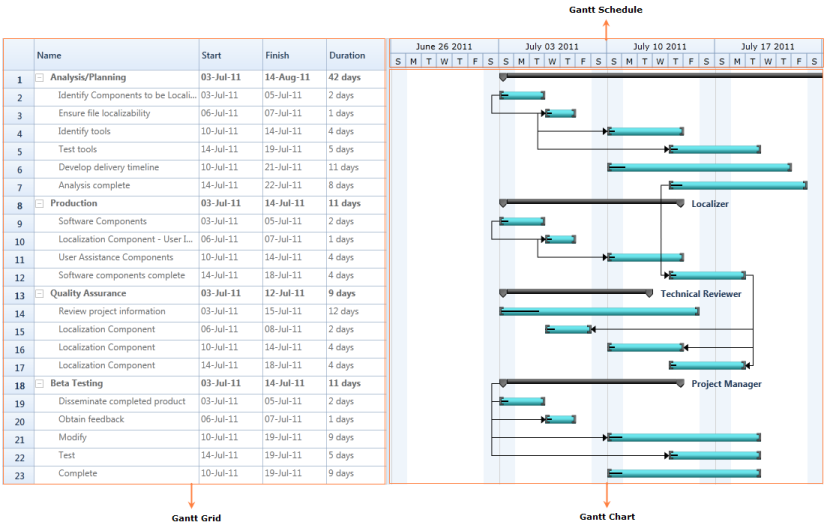
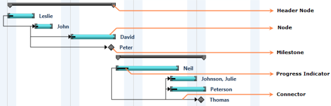
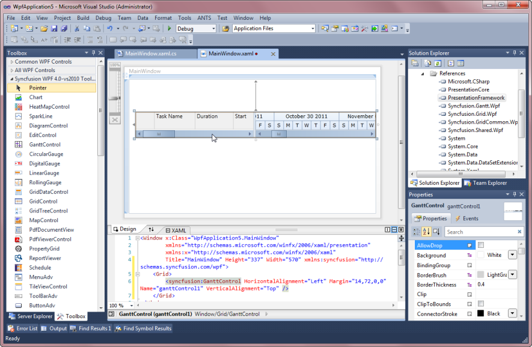

# Getting Started with Gantt

## Appearance and structure of Gantt

Gantt control is composed of three controls. They are:

* GanttGrid
* ScheduleHeader  
* GanttChartVisualControl

### Gantt grid

Gantt Grid is a table view control which displays the scheduled tasks/activities of the project with its hierarchy. You can edit the fields of the bounded tasks using this grid.

* Header— Header represents the table header which contains the field name of the task.
* Parent Task—Parent task represents the summary of the child tasks. This is an activity which will be further split into various child tasks.
* Child Task—Child task represents an individual task. This contains only the information about the specific task. The Child task is a part of parent task.
* Expand/Collapse Button—Expand/Collapse button allows you to expand or collapse the particular hierarchy.

### Gantt chart

Gantt Chart is an items control which provides a graphically representation of the task/activity that are currently scheduled. Gantt Chart have different components to represent the type of Task, Progress of the Task and Relationship between Tasks.

* Node— Node represents an individual or child task.
* Header Node—HeaderNode represents the parent or summary task of the projects.
* Milestone—Milestone represents the target to be completed in a day.
* Progress Indicator—Progress indicator represents the percentage of work completed for the task.
* Connector—Connector represents the dependency relationship between the tasks.

### Gantt schedule 

Gantt Schedule is a medium to measure the progress in the Gantt control. Using this you can track or measure the progress of the task or activity.

## Class diagram

## Feature summary

The following features are available in the Essential Gantt for WPF:

* Data Binding
* TaskDetails Binding
* External Property Binding
* Dependency relationship
* CustomToolTip
* Calendar customization
* Custom Node style
* VisualStyle
* XML Import/Export

## Adding GanttControl to an application

You can create a project management application using Essential Gantt WPF. 

You can create Gantt control in two methods. They are:

* Programmatically
* Through Designer 

### Programmatically creating GanttControl 

The following are the steps to create GanttControl programmatically: 

#### Adding GanttControl

You can add Gantt control to the application using the following code:





<Sync:GanttControl x:Name="Gantt" />





 //Initializing Gantt
 GanttControl Gantt = new GanttControl();





When the code runs, an empty Gantt with in-built TaskDetails collection will be displayed.

#### Binding data to GanttControl

Create a collection of tasks and bind it to the newly created GanttControl as given in the following code:





<Sync:GanttControl ItemsSource="{Binding TaskCollection}">
    <Sync:GanttControl.DataContext>
        <local:ViewModel></local:ViewModel>
    </Sync:GanttControl.DataContext>
</Sync:GanttControl>





 //Initializing Gantt
GanttControl Gantt = new GanttControl();
ViewModel model=  new ViewModel();
this.Gantt.DataContext = model;
Gantt.ItemsSource = model.GanttItemSource;







[C#]

public class ViewModel
{
    public ObservableCollection<TaskDetails> TaskCollection { get; set; }
    public ViewModel()
    {
        TaskCollection = this.GetDataSource();
    }
    
    private ObservableCollection<TaskDetails> GetDataSource()
    {
        ObservableCollection<TaskDetails> task = new ObservableCollection<TaskDetails>();
        task.Add(
            new TaskDetails
                {
                    TaskId = 1,
                    TaskName = "Scope",
                    StartDate = new DateTime(2011, 1, 3),
                    FinishDate = new DateTime(2011, 1, 14),
                    Progress = 40d
                });

        task[0].Child.Add(
            new TaskDetails
                {
                    TaskId = 2,
                    TaskName = "Determine project office scope",
                    StartDate = new DateTime(2011, 1, 3),
                    FinishDate = new DateTime(2011, 1, 5),
                    Progress = 20d
                });

        task[0].Child.Add(
            new TaskDetails
                {
                    TaskId = 3,
                    TaskName = "Justify project office via business model",
                    StartDate = new DateTime(2011, 1, 6),
                    FinishDate = new DateTime(2011, 1, 7),
                    Duration = new TimeSpan(1, 0, 0, 0),
                    Progress = 20d
                });

        task[0].Child.Add(
            new TaskDetails
                {
                    TaskId = 4,
                    TaskName = "Secure executive sponsorship",
                    StartDate = new DateTime(2011, 1, 10),
                    FinishDate = new DateTime(2011, 1, 14),
                    Duration = new TimeSpan(1, 0, 0, 0),
                    Progress = 20d
                });

        task[0].Child.Add(
            new TaskDetails
                {
                    TaskId = 5,
                    TaskName = "Secure complete",
                    StartDate = new DateTime(2011, 1, 14),
                    FinishDate = new DateTime(2011, 1, 14),
                    Duration = new TimeSpan(1, 0, 0, 0),
                    Progress = 20d
                });

        return task;
    }
}
    
 

### Adding GanttControl through designer

The following are the steps to create Gantt control through designer.

1. Open the XAML page of the application.

   

2. Select GanttControl from ToolBox.

   

3. Drag-and-drop the GanttControl to Designer View.

   

4. Gantt control is added to the window. Assembly reference will also be added to Project file.

   

5. Now you can customize the properties of Gantt control in the Properties Window.

## Adjusting chart and grid size

The GanttControl allows users to set the width for GanttChart and GanttGrid  using the [`ChartWidth`](https://help.syncfusion.com/cr/wpf/Syncfusion.Windows.Controls.Gantt.GanttControl.html#Syncfusion_Windows_Controls_Gantt_GanttControl_ChartWidth) and [`GridWidth`](https://help.syncfusion.com/cr/wpf/Syncfusion.Windows.Controls.Gantt.GanttControl.html#Syncfusion_Windows_Controls_Gantt_GanttControl_GridWidth) properties. The following code sample demonstrates how to set width for chart and grid.





<sync:GanttControl x:Name="control" GridWidth="200" ChartWidth="800" > 
</Sync:GanttControl>





 //Initializing Gantt
GanttControl control = new GanttControl();
control.GridWidth = new GridLength(200); 
control.ChartWidth = new GridLength(800); 




   

## Schedule padding 

Gantt schedule view can be extended by using the [`ScheduleRangePadding`](https://help.syncfusion.com/cr/wpf/Syncfusion.Windows.Controls.Gantt.GanttControl.html#Syncfusion_Windows_Controls_Gantt_GanttControl_ScheduleRangePadding) property in GanttControl. This property extends the schedule with number of lower schedule units in starting position to improve the user experience.





<Sync:GanttControl x:Name="control" ItemsSource="{Binding TaskCollection}"  ScheduleRangePadding="5">
</Sync:GanttControl>





 //Initializing Gantt
GanttControl control = new GanttControl();
control.ScheduleRangePadding = 5;





## ScheduleType

By using the [`ScheduleType`](https://help.syncfusion.com/cr/wpf/Syncfusion.Windows.Controls.Gantt.GanttControl.html#Syncfusion_Windows_Controls_Gantt_GanttControl_ScheduleType) enum in the GanttControl, you can define the specific schedule range. The [`ScheduleType`](https://help.syncfusion.com/cr/wpf/Syncfusion.Windows.Controls.Gantt.GanttControl.html#Syncfusion_Windows_Controls_Gantt_GanttControl_ScheduleType) is an enum, which contains the following schedule types: 

* HoursWithSeconds
* MinutesWithSeconds
* WeekWithDays
* DayWithHours
* DayWithMinutes
* MonthWithHours
* MonthWithDays
* YearWithDays
* YearWithMonths
* CustomDateTime
* CustomNumeric

The following code sample demonstrates how to set **ScheduleType** for GanttControl.





<Sync:GanttControl x:Name="control" ItemsSource="{Binding TaskCollection}"           ScheduleType="YearWithMonths" >
</Sync:GanttControl>





//Initializing Gantt
GanttControl control = new GanttControl();
control.DataContext = new ViewModel();
control.SetBinding(GanttControl.ItemsSourceProperty,"TaskCollection");
control.ScheduleType = ScheduleType.YearWithMonths;





## Showing date with time in GanttGrid

To show the date with time in the GanttGrid, enable the ShowDateWithTime property as shown in the following code sample.



<sync:GanttControl x:Name="control" ShowDateWithTime="True" ItemsSource="{Binding TaskCollection}"> 
 <sync:GanttControl.DataContext>
    <local:ViewModel/>
 </sync:GanttControl.DataContext>          
</Sync:GanttControl>





    //Initializing Gantt
    GanttControl control = new GanttControl();
    control.DataContext = new ViewModel();
    control.SetBinding(GanttControl.ItemsSourceProperty,"TaskCollection");
    control.ShowDateWithTime = true;





N> By default, GanttGrid will show the date alone.

## see also

[How to show horizontal and vertical grid lines in WPF gantt control]( https://www.syncfusion.com/kb/11800/how-to-show-horizontal-and-vertical-grid-lines-in-wpf-gantt-control)

[How to enable horizontal lines for gantt chart rows]( https://www.syncfusion.com/kb/3067/how-to-enable-horizontal-lines-for-ganttcharts-rows)

[How to create gantt chart control in C# WPF](https://www.syncfusion.com/kb/10800/how-to-create-gantt-chart-control-in-c-wpf)

[How to create a gantt chart by hiding the gantt grid](https://www.syncfusion.com/kb/10157/how-to-create-a-ganttchart-by-hiding-the-ganttgrid)

[How to wrap WPF gantt in Windows Forms]( https://www.syncfusion.com/kb/9464/how-to-wrap-wpf-gantt-in-windows-forms)
