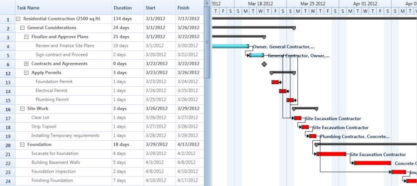

# Highlighting Tasks in Gantt

Highlighting tasks allows you to highlight a specific set of tasks in the Gantt chart region. This feature will get the set of tasks as input and highlight those tasks with the specified color in the Gantt chart region. It will accept a linear set of tasks of type IList as input. You can also specify the highlighting brush through the provided API.

## Use Case Scenario

* When you like to view some specific set of tasks with a different color, you can easily achieve that by providing that set of tasks as input.
* This feature also helps the user to highlight tasks that are in a critical path of a project.

## Properties

<table>
<tr>
<th>
Property </th><th>
Description </th><th>
Type </th><th>
Data Type </th></tr>
<tr>
<td>
HighlightedItems</td><td>
The items that are passed through this API will be highlighted in Gantt chart region. The items should be in linear form. </td><td>
Dependency</td><td>
IList</td></tr>
<tr>
<td>
HighlightItemBrush</td><td>
Specifies the color in which items should be highlight</td><td>
Dependency</td><td>
Brush</td></tr>
</table>

## Adding Highlighting Tasks to an Application

To highlight a set of tasks in Gantt chart region:

1. Define the Gantt with initial setup.
1. Bind the tasks that need to be highlighted with Gantt’s HighlightedItems API.
2. If required, change the value of the Gantt’s HighlightItemBrush API to change the item highlight color. The default color is red.




<sync:GanttControl x:Name="Gantt"
                   ItemsSource="{Binding GanttItemSource}" 
                   HighlightedItems="{Binding HighlightedTasks}">
</sync:GanttControl>





/// Codes in View Model 
/// 

/// Initializes a new instance of the <see cref="ViewModel"/> class.
/// 

public ViewModel()
{
    this.AddHighlightedTasks();
}

IList _highlightedTasks = new List<Task>();

/// 

/// Gets or sets the highlighted tasks.
/// 

/// <value>The highlighted tasks.</value>
public IList HighlightedTasks
{
    get
    {
        return _highlightedTasks;
    }
    set
    {
        _highlightedTasks = value;
        this.OnPropertyChanged("HighlightedTasks");
    }
}

/// 

/// Adds the highlighted tasks.
/// 

internal void AddHighlightedTasks()
{
    List<Task> tasks = new List<Task>();
    /// Adding the list of tasks
    tasks.AddRange(this.GanttItemSource[0].ChildTask[0].ChildTask[2].ChildTask);
    tasks.AddRange(this.GanttItemSource[0].ChildTask[1].ChildTask);
    this.HighlightedTasks = tasks;
}

/// Adding Highlighted items code behind
this.Gantt.HighlightedItems = this.view.HighlightedTasks;




The following image shows the Gantt with Highlighted Tasks:

Gantt with Highlighted Tasks
{:.caption}

## Samples Link

To view samples:

1. Go to the Syncfusion Essential Studio installed location. 
    Location: Installed Location\Syncfusion\Essential Studio\{{ site.releaseversion }}\Infrastructure\Launcher\Syncfusion Control Panel 
2. Open the Syncfusion Control Panel in the above location (or) Double click on the Syncfusion Control Panel desktop shortcut menu.
3. Click Run Samples for WPF under the User Interface Edition panel
4. Select Gantt
5. Expand the Interactive Features item in the Sample Browser
6. Choose Highlighting Tasks to launch the sample.

## see also

[How to view the gantt control with the desired date tasks at load time in WPF](https://www.syncfusion.com/kb/7728/how-to-view-the-gantt-control-with-the-desired-date-tasks-at-load-time-in-wpf)