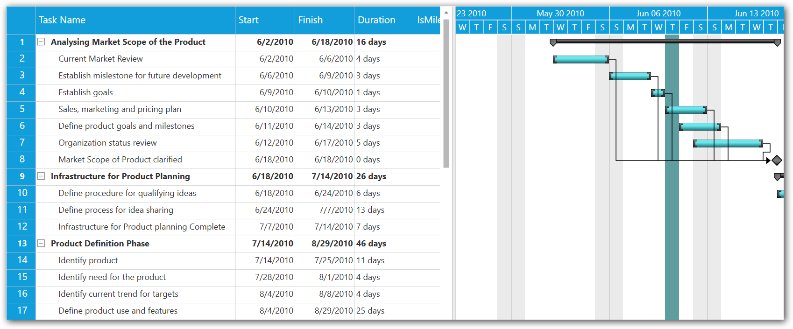

# Holidays Customization in WPF Gantt

The GanttControl allows customers to differentiate the dates of holidays. This support is used to highlight the holidays in the Gantt chart.

The holidays can be specified using the `Holidays` property in the SfGantt, which holds a collection of `GanttHoliday`.

The following properties in the GanttHoliday are used to define the holidays:

* `Day`: Specifies the holiday date.

* `Background`: Specifies the brush to highlight the holiday.

N> If the background is not defined, then the Non-WorkingDays background will be applied.

The following properties in the GanttControl are used to customize the holiday feature:

* `ShowHolidays`: Indicates whether to enable or disable the holidays in the Gantt chart.

* `ExcludeHolidays`: Indicates whether to include or exclude the holidays in duration calculation.

The following code sample demonstrates how to define the holidays.




<!--  GanttControl Information  -->
<sync:GanttControl x:Name="Gantt"
                   ItemsSource="{Binding TaskCollection}"
                   VisualStyle="Metro"
                   ShowHolidays="True"
                   ExcludeHolidays="False">
    <sync:GanttControl.Holidays>
        <sync:GanttHolidayCollection>
            <sync:GanttHoliday Day="6/10/2010" Background="CadetBlue"/>
            <sync:GanttHoliday Day="7/8/2010" Background="CadetBlue"/>
            <sync:GanttHoliday Day="8/3/2010" Background="CadetBlue"/>
            <sync:GanttHoliday Day="9/20/2010" Background="CadetBlue"/>
        </sync:GanttHolidayCollection>
    </sync:GanttControl.Holidays>
    <sync:GanttControl.TaskAttributeMapping>
        <sync:TaskAttributeMapping  TaskIdMapping="TaskId"
                                    TaskNameMapping="TaskName"
                                    StartDateMapping="StartDate" 
                                    ChildMapping="Child"               
                                    FinishDateMapping="FinishDate"
                                    DurationMapping="Duration" 
                                    MileStoneMapping="IsMileStone"
                                    ProgressMapping="Progress"
                                    PredecessorMapping="Predecessor"/>
    </sync:GanttControl.TaskAttributeMapping>
</sync:GanttControl>




public partial class MainWindow : Window
{
    ViewModel viewModel;

    /// 

    /// Initializes a new instance of the <see cref="MainWindow"/> class.
    /// 

    public MainWindow()
    {
        InitializeComponent();
        viewModel = new ViewModel();

        GanttControl gantt = new GanttControl();
        gantt.ItemsSource = this.viewModel.TaskCollection;
        gantt.VisualStyle = VisualStyle.Metro;
        gantt.ShowHolidays = true;
        gantt.ExcludeHolidays = false;
        gantt.Holidays = new GanttHolidayCollection
        {
            new GanttHoliday { Day = new DateTime(2010, 6, 10), Background = Brushes.CadetBlue },
            new GanttHoliday { Day = new DateTime(2010, 7, 8), Background = Brushes.CadetBlue },
            new GanttHoliday { Day = new DateTime(2010, 8, 3), Background = Brushes.CadetBlue },
            new GanttHoliday { Day = new DateTime(2010, 9, 20), Background = Brushes.CadetBlue }
        };

        this.AddChild(gantt);
    }
}




The following screenshot illustrates the customized holidays sample.

You can download the holiday customization sample from the following link:
[Holiday customization sample](https://github.com/SyncfusionExamples/WPF-Gantt-holiday-customization-).
