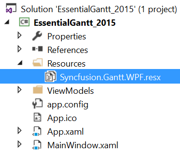
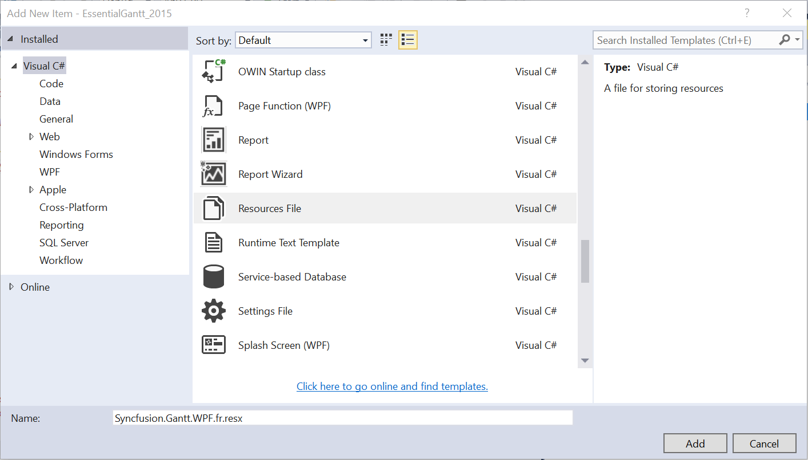
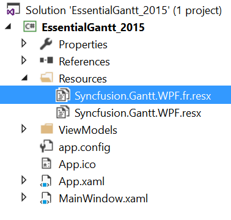

# Localization in WPF Gantt

Localization is the process of translating the application resources into different language for the specific cultures. You can localize the GanttControl by [adding resource file](https://msdn.microsoft.com/library/aa992030.aspx). Application culture can be changed by setting `CurrentUICulture` and `CurrentCulture` before `InitializeComponent()` method. 

In the below application, culture is configured to French language.



public MainWindow()
{
    System.Threading.Thread.CurrentThread.CurrentUICulture = new System.Globalization.CultureInfo("fr");

    System.Threading.Thread.CurrentThread.CurrentCulture = new System.Globalization.CultureInfo("fr");

    InitializeComponent();
}    



To localize the GanttControl based on `CurrentUICulture` using resource files, follow the below steps. 

1.Create new folder and named as **Resources** in your application. 
2.Add the default resource file of GanttControl into **Resources** folder. You can download the Syncfusion.Gantt.WPF.resx [here](http://www.syncfusion.com/downloads/support/directtrac/general/ze/Resources-2137559261.zip).

3.Right-click on the Resources folder, select **Add** and then **NewItem**.

4.In `Add New Item` wizard, select the **Resource File** option and name the filename as **Syncfusion.Gantt.WPF.&lt;culture name&gt;.resx**. 

For example, you have to give name as **Syncfusion.Gantt.WPF.fr.resx** for French culture.
 
5.The culture name that indicates the name of language and country. 

6.Now, select `Add` option to add the resource file in **Resources** folder.

7.Add the Name/Value pair in Resource Designer of **Syncfusion.Gantt.WPF.fr.resx** file and change its corresponding value to corresponding culture. 

You can download the sample for localization of Gantt from [here](http://www.syncfusion.com/downloads/support/directtrac/general/ze/Localization_Gantt-1030234357.zip)
