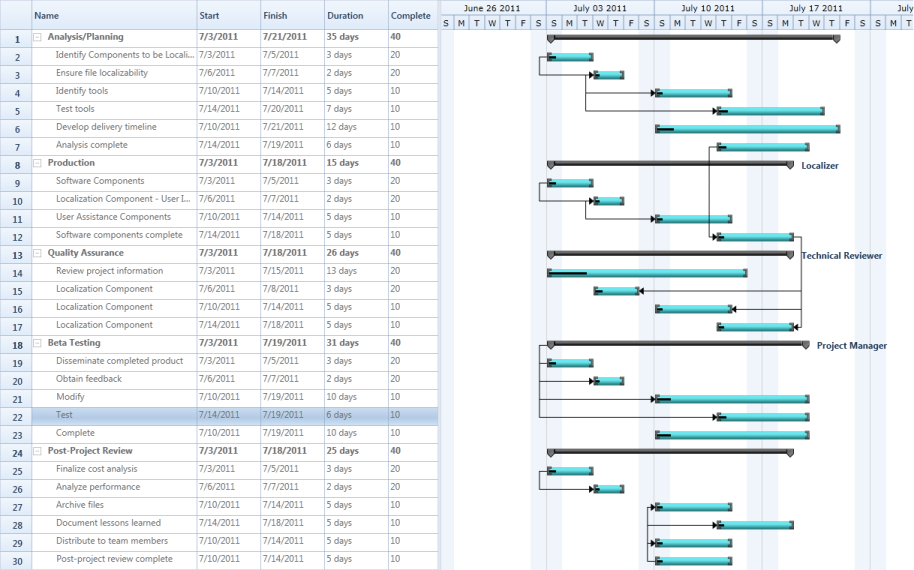
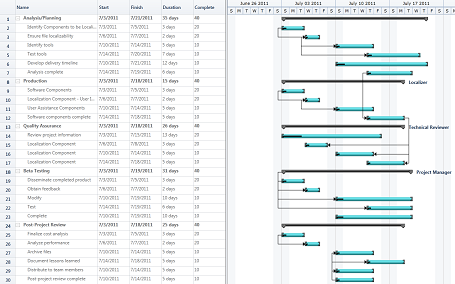
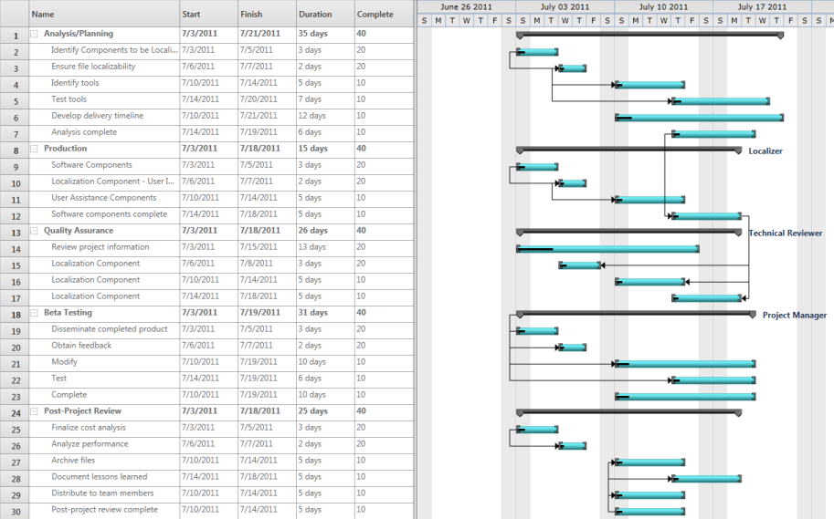

# Visual Style

Essential Gantt enables you to customize the appearance of the control. This supports the following themes:

* Office2010Blue
* Office2010Black
* Office2010Silver
* Metro

### Properties

<table>
<tr>
<th>
Property</th><th>
Description</th><th>
Type</th><th>
Data Type</th><th>
Reference links</th></tr>
<tr>
<td>
VisualStyle</td><td>
Gets or set the VisualStyle Property of Gantt control.</td><td>
Dependency Property</td><td>
Enum.VisualStyle.Office2010BlueVisualStyle.Office2010BlackVisualStyle.Office2010SilverVisualStyle.Metro</td><td>
NA</td></tr>
</table>

## Adding VisualStyle to Gantt Control 

You can customize the theme using the VisualStyle property.

The following code illustrates how to set the VisualStyle of Gantt control:




<Sync:GanttControl x:Name="Gantt" VisualStyle="Office2010Blue"/>




Gantt.VisualStyle = VisualStyle.Office2010Blue;




The following shows Office 2010 Blue:

Office 2010 Blue
{:.caption}

The following image shows Office 2010 silver:

Office 2010Silver
{:.caption}

The following image shows Office 2010Silver:

Office2010Black
{:.caption}

The following image shows Office 2010Metro:

Metro
{:.caption}

## Samples Link

To view samples: 

1. Select Start -> Programs -> Syncfusion -> Essential Studio x.x.xx -> Dashboard.
1. Click Run Samples for WPF under User Interface Edition panel.
2. Select Gantt.
3. Expand the Styles item in the Sample Browser.
4. Choose the Gantt Visual Style sample to launch. 

