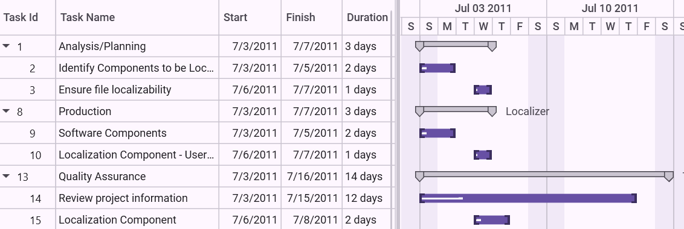

# Auto Update Hierarchy in WPF Gantt

Essential Gantt provides support for auto updating hierarchy, in which the Gantt control will listen to the change in child tasks/activities and automatically update them in the parent task/activity accordingly. There is no need to have any custom logics in business objects to update the hierarchy. You can enable or disable this functionality by using the UseAutoUpdateHierarchy property. 

## Use Case Scenario

1. When using this, no need to have custom logics in the business objects for updating the hierarchy so that codes in a business object class/data structure will be reduced.
2. This enables you to create the abstract class/data structure for the business objects.

## Properties

<table>
<tr>
<th>
Property </th><th>
Description </th><th>
Type </th><th>
Data Type </th></tr>
<tr>
<td>
UseAutoUpdateHierarchy</td><td>
Enable or disable the auto update hierarchy support.</td><td>
Dependency Property</td><td>
bool</td></tr>
</table>

## Using the Auto Update Hierarchy Support in an Application

By default, the UseAutoUpdateHierarchy property is set to true so that this feature will work in all applications by default. If you need to prevent this and want to update the hierarchy by your own logics, then you have to set this property as false.

## Default Scenario

To use the auto updating hierarchy support in an application:

1. Create a simple class structure for business objects.




public class Task : INotifyPropertyChanged
{
    /// 

    /// Holds the start date and end date value.
    /// 

    private DateTime startDate, endDate;

    /// 

    /// Holds the duration value.
    /// 

    private TimeSpan duration;

    /// 

    /// Holds the progress value.
    /// 

    private double progress;

    /// 

    /// Holds the id value.
    /// 

    private int id;

    /// 

    /// Holds the name value.
    /// 

    private string name;

    /// 

    /// Holds the collection value.
    /// 

    private ObservableCollection<Task> childCollection;

    public Task()
    {
        this.ChildCollection = new ObservableCollection<Task>();
    }

    /// 

    /// Gets or sets the start date.
    /// 

    public DateTime StartDate
    {
        get
        {
            return this.startDate;
        }
        set
        {
            this.startDate = value;
            OnPropertyChanged("StartDate");
        }
    }

    /// 

    /// Gets or sets the finish date.
    /// 

    public DateTime EndDate
    {
        get
        {
            return this.endDate;
        }
        set
        {
            this.endDate = value;
            OnPropertyChanged("EndDate");
        }
    }

    /// 

    /// Gets or sets the duration value.
    /// 

    public TimeSpan Duration
    {
        get
        {
            return this.duration;
        }
        set
        {
            this.duration = value;
            OnPropertyChanged("Duration");
        }
    }

    /// 

    /// Gets or sets the id value.
    /// 

    public int ID
    {
        get
        {
            return this.id;
        }
        set
        {
            this.id = value;
            OnPropertyChanged("ID");
        }
    }

    /// 

    /// Gets or sets the name.
    /// 

    public string Name
    {
        get
        {
            return this.name;
        }
        set
        {
            this.name = value;
            OnPropertyChanged("Name");
        }
    }

    /// 

    /// Gets or sets the progress value.
    /// 

    public double Progress
    {
        get
        {
            return this.progress;
        }
        set
        {
            this.progress = value;
            OnPropertyChanged("Progress");
        }
    }

    /// 

    /// Gets or sets the child collection.
    /// 

    public ObservableCollection<Task> ChildCollection
    {
        get
        {
            return this.childCollection;
        }
        set
        {
            this.childCollection = value;
            OnPropertyChanged("ChildCollection");
        }
    }

    /// 

    /// Method to get property changed.
    /// 

    private void OnPropertyChanged(string propName)
    {
        if (this.PropertyChanged != null)
        {
            PropertyChanged(this, new PropertyChangedEventArgs(propName));
        }
    }

    public event PropertyChangedEventHandler PropertyChanged;
}



{{ codesnippet1 | OrderList_Indent_Level_1 }}

2. Create a collection of business objects to bind them as ItemsSource for the Gantt control.



 
public class ViewModel
{
    /// 

    /// Gets or sets the child collection.
    /// 

    public ObservableCollection<Task> TaskCollection { get; set; }

    public ViewModel()
    {
        this.TaskCollection = this.GetDataSource();
    }
    
    /// 

    /// Method to get data source.
    /// 

    private ObservableCollection<Task> GetDataSource()
    {
        ObservableCollection<Task> taskDetails = new ObservableCollection<Task>();
        taskDetails.Add(new Task()
        {
            ID = 1,
            Name = "Analysis/Planning",
            StartDate = new DateTime(2012, 7, 3),
            EndDate = new DateTime(2012, 8, 14),
            Progress = 40d
        });

        taskDetails[0].ChildCollection.Add((new Task()
        {
            ID = 2,
            Name = "IDentify Components to be Localized",
            StartDate = new DateTime(2012, 7, 3),
            EndDate = new DateTime(2012, 7, 5),
            Progress = 20d
        }));

        taskDetails[0].ChildCollection.Add((new Task()
        {
            ID = 3,
            Name = "Ensure file localizability",
            StartDate = new DateTime(2012, 7, 6),
            EndDate = new DateTime(2012, 7, 7),
            Progress = 20d
        }));

        taskDetails.Add(new Task()
        {
            ID = 8,
            Name = "Production",
            StartDate = new DateTime(2012, 7, 3),
            EndDate = new DateTime(2012, 7, 14),
            Progress = 40d
        });

        taskDetails[1].ChildCollection.Add((new Task()
        {
            ID = 9,
            Name = "Software Components",
            StartDate = new DateTime(2012, 7, 3),
            EndDate = new DateTime(2012, 7, 5),
            Progress = 20d,
        }));

        taskDetails[1].ChildCollection.Add((new Task()
        {
            ID = 10,
            Name = "Localization Component - User Interface",
            StartDate = new DateTime(2012, 7, 6),
            EndDate = new DateTime(2012, 7, 7),
            Progress = 20d
        }));

        taskDetails.Add(new Task()
        {
            ID = 13,
            Name = "Quality Assurance",
            StartDate = new DateTime(2012, 7, 3),
            EndDate = new DateTime(2012, 7, 12),
            Progress = 40d,
        });

        taskDetails[2].ChildCollection.Add((new Task()
        {
            ID = 14,
            Name = "Review project information",
            StartDate = new DateTime(2012, 7, 3),
            EndDate = new DateTime(2012, 7, 15),
            Progress = 20d
        }));

        taskDetails[2].ChildCollection.Add((new Task()
        {
            ID = 15,
            Name = "Localization Component",
            StartDate = new DateTime(2012, 7, 6),
            EndDate = new DateTime(2012, 7, 8),
            Progress = 20d
        }));

        return taskDetails;
    }
}



{{ codesnippet2 | OrderList_Indent_Level_1 }}

3. Set the collection as ItemsSource of the Gantt control.




<syncfusion:GanttControl x:Name="ganttControl"
                         UseAutoUpdateHierarchy="False"
                         ItemsSource="{Binding TaskCollection}">
    <syncfusion:GanttControl.TaskAttributeMapping>
        <syncfusion:TaskAttributeMapping TaskIdMapping="ID"
                                         TaskNameMapping="Name"
                                         StartDateMapping="StartDate"
                                         ChildMapping="ChildCollection"
                                         FinishDateMapping="EndDate"
                                         DurationMapping="Duration"
                                         ProgressMapping="Progress"/>
    </syncfusion:GanttControl.TaskAttributeMapping>
    <syncfusion:GanttControl.DataContext>
        <local:ViewModel/>
    </syncfusion:GanttControl.DataContext>
</syncfusion:GanttControl>



this.ganttControl.UseAutoUpdateHierarchy = false;
this.ganttControl.ItemsSource = new ViewModel().TaskDetails;

// Task attribute mapping
TaskAttributeMapping taskAttributeMapping = new TaskAttributeMapping();
taskAttributeMapping.TaskIdMapping = "ID";
taskAttributeMapping.TaskNameMapping = "Name";
taskAttributeMapping.StartDateMapping = "StartDate";
taskAttributeMapping.ChildMapping = "ChildCollection";
taskAttributeMapping.FinishDateMapping = "EndDate";
taskAttributeMapping.DurationMapping = "Duration";
taskAttributeMapping.ProgressMapping = "Progress";
this.ganttControl.TaskAttributeMapping = taskAttributeMapping;




{{ codesnippet3 | OrderList_Indent_Level_1 }}

## Using Custom Logics in Business Objects

To use your own logics in business objects:

1. Create a simple class structure for business objects. Add custom calculations on business objects to update the hierarchy when its state changed.




public class Task : NotificationObject
{
    /// 

    /// Holds the start date and end date value.
    /// 

    private DateTime startDate, endDate;

    /// 

    /// Holds the duration value.
    /// 

    private TimeSpan duration;

    /// 

    /// Holds the progress value.
    /// 

    private double progress;

    /// 

    /// Holds the id value.
    /// 

    private int id;

    /// 

    /// Holds the name value.
    /// 

    private string name;

    /// 

    /// Holds the collection value.
    /// 

    private ObservableCollection<Task> childCollection;

    public Task()
    {
        this.ChildCollection = new ObservableCollection<Task>();
    }

    /// 

    /// Gets or sets the duration value.
    /// 

    public TimeSpan Duration
    {
        get
        {
            if (this.childCollection != null && this.childCollection.Count >= 1)
            {
                var sum = new TimeSpan(0, 0, 0, 0);
                sum = this.childCollection.Aggregate(sum, (current, task) => current + task.Duration);
                return sum;
            }

            /// The difference between the end date and starting date is calculated exactly.
            duration = endDate.Subtract(startDate);
            return duration;
        }
        set
        {
            if (this.childCollection != null && this.childCollection.Count >= 1)
            {
                var sum = new TimeSpan(0, 0, 0, 0);
                sum = this.childCollection.Aggregate(sum, (current, task) => current + task.Duration);
                duration = sum;
                return;
            }

            duration = value;
            /// The end date is calculated to make the change in end date based on duration. The duration is interlinked with the starting date and end date, so it will affect the both based on the changes.
            EndDate = startDate.AddDays(Double.Parse(duration.TotalDays.ToString()));
        }
    }

    /// 

    ///  Gets or sets the finish date.
    /// 

    public DateTime EndDate
    {
        get { return endDate; }
        set
        {
            if (this.childCollection != null && this.childCollection.Count >= 1)
            {
                /// If this task is a parent task, then it should have the maximum end time to compare the date with maximum date of its child tasks.
                if (value >= this.childCollection.Max(s => s.EndDate) && endDate != value)
                    endDate = value;
            }
            else
                endDate = value;
            RaisePropertyChanged("EndDate");
            /// The changed duration is invoked to notify the change in duration based on the new end date.
            RaisePropertyChanged("Duration");
        }
    }

    /// 

    /// Gets or sets the start date.
    /// 

    public DateTime StartDate
    {
        get
        {
            return startDate;
        }
        set
        {
            /// If this task is a parent task, then it should have the minimum starting time to compare the date with minimum date of its child tasks.

            if (this.childCollection != null && this.childCollection.Count >= 1)
            {
                if (value <= this.childCollection.Min(s => s.startDate) && startDate != value)
                    startDate = value;
            }
            else
                startDate = value;
            RaisePropertyChanged("startDate");
            /// The changed duration is invoked to notify the change in duration based on the new start date.
            RaisePropertyChanged("Duration");
        }
    }

    /// 

    /// Gets or sets the name value.
    /// 

    public string Name
    {
        get { return name; }
        set
        {
            name = value;
            RaisePropertyChanged("Name");
        }
    }

    /// 

    /// Gets or sets the id value.
    /// 

    public int Id
    {
        get { return id; }
        set
        {
            id = value;
            RaisePropertyChanged("Id");
        }
    }

    /// 

    /// Gets or sets the child collection.
    /// 

    public ObservableCollection<Task> ChildCollection
    {
        get
        {
            if (this.childCollection == null)
            {
                this.childCollection = new ObservableCollection<Task>();
                /// The changed collection of child tasks is hooked to listen and refresh the parent node based on the changes made in child des.
                this.childCollection.CollectionChanged += ChildNodesCollectionChanged;
            }

            return this.childCollection;
        }
        set
        {
            this.childCollection = value;
            ///The changed collection of child tasks is hooked to listen and refresh the parent node based on the changes made in child nodes.
            this.childCollection.CollectionChanged += ChildNodesCollectionChanged;
            if (value.Count > 0)
            {
                this.childCollection.ToList().ForEach(n =>
                {
                    /// To listen the changes made in child tasks.
                    n.PropertyChanged += ChildNodePropertyChanged;
                });
                UpdateData();
            }

            RaisePropertyChanged("this.ChildCollection");
        }
    }

    void ChildNodePropertyChanged(object sender, PropertyChangedEventArgs e)
    {
        if (e.PropertyName != null)
            if (e.PropertyName == "startDate" || e.PropertyName == "EndDate" || e.PropertyName == "Complete")
            {
                UpdateData();
            }
    }

    /// 

    /// Method to update data source.
    /// 

    private void UpdateData()
    {
        /// Update the starting date and end date based on the changes made in the date of child tasks.
        StartDate = this.childCollection.Select(c => c.startDate).Min();
        EndDate = this.childCollection.Select(c => c.EndDate).Max();
        progress = (this.childCollection.Aggregate(0d, (cur, task) => cur + task.progress)) / this.childCollection.Count;
    }

    /// 

    /// Method to update collection changed.
    /// 

    public void ChildNodesCollectionChanged(object sender, System.Collections.Specialized.NotifyCollectionChangedEventArgs e)
    {
        if (e.Action == NotifyCollectionChangedAction.Add)
        {
            foreach (Task node in e.NewItems)
            {
                node.PropertyChanged += ChildNodePropertyChanged;
            }
        }
        else
        {
            foreach (Task node in e.OldItems)
                node.PropertyChanged -= ChildNodePropertyChanged;
        }
        UpdateData();
    }
}



{{ codesnippet4 | OrderList_Indent_Level_1 }}

2. Create a collection of business objects to bind it as ItemsSource of the Gantt control.



 
public class ViewModel
{
    /// 

    /// Gets or sets the child collection.
    /// 

    public ObservableCollection<Task> TaskCollection { get; set; }

    public ViewModel()
    {
        this.TaskCollection = this.GetDataSource();
    }
 
    /// 

    /// Method to get data source.
    /// 

    private ObservableCollection<Task> GetDataSource()
    {
        ObservableCollection<Task> taskDetails = new ObservableCollection<Task>();
        taskDetails.Add(new Task()
        {
            ID = 1,
            Name = "Analysis/Planning",
            StartDate = new DateTime(2012, 7, 3),
            EndDate = new DateTime(2012, 8, 14),
            Progress = 40d
        });

        taskDetails[0].ChildCollection.Add((new Task()
        {
            ID = 2,
            Name = "IDentify Components to be Localized",
            StartDate = new DateTime(2012, 7, 3),
            EndDate = new DateTime(2012, 7, 5),
            Progress = 20d
        }));

        taskDetails[0].ChildCollection.Add((new Task()
        {
            ID = 3,
            Name = "Ensure file localizability",
            StartDate = new DateTime(2012, 7, 6),
            EndDate = new DateTime(2012, 7, 7),
            Progress = 20d
        }));

        taskDetails.Add(new Task()
        {
            ID = 8,
            Name = "Production",
            StartDate = new DateTime(2012, 7, 3),
            EndDate = new DateTime(2012, 7, 14),
            Progress = 40d
        });

        taskDetails[1].ChildCollection.Add((new Task()
        {
            ID = 9,
            Name = "Software Components",
            StartDate = new DateTime(2012, 7, 3),
            EndDate = new DateTime(2012, 7, 5),
            Progress = 20d,
        }));

        taskDetails[1].ChildCollection.Add((new Task()
        {
            ID = 10,
            Name = "Localization Component - User Interface",
            StartDate = new DateTime(2012, 7, 6),
            EndDate = new DateTime(2012, 7, 7),
            Progress = 20d
        }));

        taskDetails.Add(new Task()
        {
            ID = 13,
            Name = "Quality Assurance",
            StartDate = new DateTime(2012, 7, 3),
            EndDate = new DateTime(2012, 7, 12),
            Progress = 40d,
        });

        taskDetails[2].ChildCollection.Add((new Task()
        {
            ID = 14,
            Name = "Review project information",
            StartDate = new DateTime(2012, 7, 3),
            EndDate = new DateTime(2012, 7, 15),
            Progress = 20d
        }));

        taskDetails[2].ChildCollection.Add((new Task()
        {
            ID = 15,
            Name = "Localization Component",
            StartDate = new DateTime(2012, 7, 6),
            EndDate = new DateTime(2012, 7, 8),
            Progress = 20d
        }));

        return taskDetails;
    }
}



{{ codesnippet5 | OrderList_Indent_Level_1 }}

3. Set the UseAutoUpdateHierarchy property as false to handle the custom calculations on the business objects. Set the collection as ItemsSource of the Gantt control.

   N> If you use the TaskDetails class as your business object, then you should not set the UseAutoUpdateHierarchy property as false.





<syncfusion:GanttControl x:Name="ganttControl"
                         UseAutoUpdateHierarchy="False"
                         ItemsSource="{Binding TaskCollection}">
    <syncfusion:GanttControl.TaskAttributeMapping>
        <syncfusion:TaskAttributeMapping TaskIdMapping="ID"
                                         TaskNameMapping="Name"
                                         StartDateMapping="StartDate"
                                         ChildMapping="ChildCollection"
                                         FinishDateMapping="EndDate"
                                         DurationMapping="Duration"
                                         ProgressMapping="Progress"/>
    </syncfusion:GanttControl.TaskAttributeMapping>
    <syncfusion:GanttControl.DataContext>
        <local:ViewModel/>
    </syncfusion:GanttControl.DataContext>
</syncfusion:GanttControl>

	


this.ganttControl.UseAutoUpdateHierarchy = false;
this.ganttControl.ItemsSource = new ViewModel().TaskDetails;

// Task attribute mapping
TaskAttributeMapping taskAttributeMapping = new TaskAttributeMapping();
taskAttributeMapping.TaskIdMapping = "ID";
taskAttributeMapping.TaskNameMapping = "Name";
taskAttributeMapping.StartDateMapping = "StartDate";
taskAttributeMapping.ChildMapping = "ChildCollection";
taskAttributeMapping.FinishDateMapping = "EndDate";
taskAttributeMapping.DurationMapping = "Duration";
taskAttributeMapping.ProgressMapping = "Progress";
this.ganttControl.TaskAttributeMapping = taskAttributeMapping;




{{ codesnippet6 | OrderList_Indent_Level_1 }}

Output:

The corresponding output for the code is as follows.

Gantt Control with Auto Updated Hierarchy
{:.caption}

## Sample Link

To view samples:

1. Go to the Syncfusion Essential Studio installed location. 
    Location: Installed Location\Syncfusion\Essential Studio\{{ site.releaseversion }}\Infrastructure\Launcher\Syncfusion Control Panel 
2. Open the Syncfusion Control Panel in the above location (or) Double click on the Syncfusion Control Panel desktop shortcut menu.
3. Click Run Samples for WPF under User Interface Edition panel .
4. Select Gantt.
5. Expand the Data Binding Features item in the Sample Browser.
6. Choose the External Property Binding Demo sample to launch.

