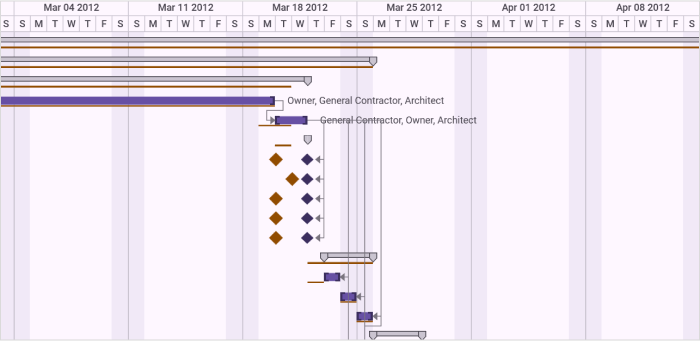
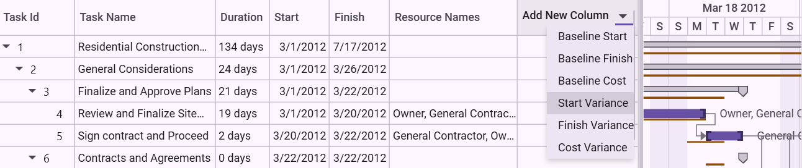
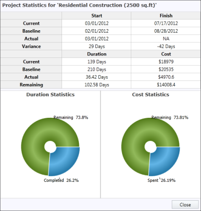

# Baseline Support in WPF Gantt

## Baseline Table View

Baseline Table View will display the differences between the current progresses and the baseline of the project in the Gantt Grid.

While invoking the appropriate method, the variance will be calculated between the actual value and the mapped baseline value, and displayed as variance view in the Gantt Grid.

The variances will be calculated only for the mapped baseline fields. For example, if you have mapped only the Baseline Start to TaskMappingAttribute, then it will calculate the variance only between Start and Baseline Start and display it in the Grid.

You can revert to the default view of the Grid by invoking the corresponding method in Gantt.

N> Variance view will have the read-only Grid. You cannot edit the cells in Gantt Grid, when it is in variance view.

## Use Case Scenario

This will help the Project Leads to compare the current progress of the project to the baseline and modify or rework the plan of existing tasks in order to meet deadlines. Organizations can use this to compare the current progress of the project to the initial estimation, analyze the rework of the plan or the budget of the project in to meet deadlines and exact user requirements.

#### Methods

<table>
<tr>
<th>
Method </th><th>
Description </th><th>
Parameters </th><th>
Type </th><th>
Return Type </th></tr>
<tr>
<td>
[LoadVarianceTableView](https://help.syncfusion.com/cr/wpf/Syncfusion.Windows.Controls.Gantt.GanttControl.html#Syncfusion_Windows_Controls_Gantt_GanttControl_LoadVarianceTableView)</td><td>
this method is used to load the Variance view of the Gantt.</td><td>
LoadVarianceTableView()</td><td>
N/A</td><td>
void </td></tr>
<tr>
<td>
[LoadDefaultTableView](https://help.syncfusion.com/cr/wpf/Syncfusion.Windows.Controls.Gantt.GanttControl.html#Syncfusion_Windows_Controls_Gantt_GanttControl_LoadDefaultTableView)</td><td>
this method is used to load the Default (Editing) view of the Gantt.</td><td>
LoadDefaultTableView()</td><td>
N/A</td><td>
void</td></tr>
</table>

## Adding Baseline Table View to an Application

To add Baseline Table View to an application:

1. Declare the baseline properties in the view model.
2. Map the properties to Gantt in the corresponding TaskAttributeMappingProperty.
3. To load the Variance view, call the [LoadVarianceTableView](https://help.syncfusion.com/cr/wpf/Syncfusion.Windows.Controls.Gantt.GanttControl.html#Syncfusion_Windows_Controls_Gantt_GanttControl_LoadVarianceTableView) method of the Gantt.
4. To load the Default (Editing) view, call the [LoadDefaultTableView](https://help.syncfusion.com/cr/wpf/Syncfusion.Windows.Controls.Gantt.GanttControl.html#Syncfusion_Windows_Controls_Gantt_GanttControl_LoadDefaultTableView) method of the Gantt.

The following codes illustrate this:




<syncfusion:GanttControl x:Name="ganttControl"
                         ShowBaseline="True"
                         ItemsSource="{Binding TaskDetails}">
    <syncfusion:GanttControl.TaskAttributeMapping>
        <syncfusion:TaskAttributeMapping TaskIdMapping="ID"
                                         TaskNameMapping="Name"
                                         StartDateMapping="StartDate"
                                         ChildMapping="ChildCollection"
                                         FinishDateMapping="EndDate"
                                         DurationMapping="Duration"
                                         ProgressMapping="Progress"
                                         PredecessorMapping="Predecessor"   
                                         ResourceInfoMapping="Resource"
                                         CostMapping="Cost"
                                         BaselineCostMapping="BaselineCost"
                                         BaselineFinishMapping="BaselineEnd"
                                         BaselineStartMapping="BaselineStart">
        </syncfusion:TaskAttributeMapping>
    </syncfusion:GanttControl.TaskAttributeMapping>
    <syncfusion:GanttControl.DataContext>
        <local:ViewModel/>
    </syncfusion:GanttControl.DataContext>
</syncfusion:GanttControl>




this.ganttControl.ItemsSource = new ViewModel().TaskDetails;
this.ganttControl.ShowBaseline = true;

/// Task attribute mapping
TaskAttributeMapping taskAttributeMapping = new TaskAttributeMapping();
taskAttributeMapping.TaskIdMapping = "ID";
taskAttributeMapping.TaskNameMapping = "Name";
taskAttributeMapping.StartDateMapping = "StartDate";
taskAttributeMapping.ChildMapping = "ChildCollection";
taskAttributeMapping.FinishDateMapping = "EndDate";
taskAttributeMapping.DurationMapping = "Duration";
taskAttributeMapping.ProgressMapping = "Progress";
taskAttributeMapping.PredecessorMapping = "Predecessor";
taskAttributeMapping.ResourceInfoMapping = "Resource";
this.ganttControl.TaskAttributeMapping = taskAttributeMapping;

// To load the Variance Table View 
this.ganttControl.LoadVarianceTableView();

// To load the Default [Editing] View
this.ganttControl.LoadDefaultTableView();





public class Task : INotifyPropertyChanged
{
    /// 

    /// Holds the start date and end date value.
    /// 

    private DateTime startDate, endDate;

    /// 

    /// Holds the duration value.
    /// 

    private TimeSpan duration;

    /// 

    /// Holds the progress value.
    /// 

    private double progress;

    /// 

    /// Holds the id value.
    /// 

    private int id;

    /// 

    /// Holds the name value.
    /// 

    private string name;

    /// 

    /// Holds the cost value.
    /// 

    private Double cost;

    /// 

    /// Holds the baselineStart value.
    /// 

    private DateTime baselineStart;

    /// 

    /// Holds the baselineEnd value.
    /// 

    private DateTime baselineEnd;

    /// 

    /// Holds the baselineCost value.
    /// 

    private Double baselineCost;

    /// 

    /// Holds the collection value.
    /// 

    private ObservableCollection<Task> childCollection;

    /// 

    /// Holds the resource value.
    /// 

    private ObservableCollection<Resource> resource;

    /// 

    /// Holds the predecessor value.
    /// 

    private ObservableCollection<Predecessor> predecessor;

    public Task()
    {
        this.ChildCollection = new ObservableCollection<Task>();
        this.Predecessor = new ObservableCollection<Predecessor>();
        this.Resource = new ObservableCollection<Resource>();
    }

    /// 

    /// Gets or sets the start date.
    /// 

    public DateTime StartDate
    {
        get
        {
            return this.startDate;
        }
        set
        {
            this.startDate = value;
            OnPropertyChanged("StartDate");
        }
    }

    /// 

    /// Gets or sets the finish date.
    /// 

    public DateTime EndDate
    {
        get
        {
            return this.endDate;
        }
        set
        {
            this.endDate = value;
            OnPropertyChanged("EndDate");
        }
    }

    /// 

    /// Gets or sets the duration value.
    /// 

    public TimeSpan Duration
    {
        get
        {
            return this.duration;
        }
        set
        {
            this.duration = value;
            OnPropertyChanged("Duration");
        }
    }

    /// 

    /// Gets or sets the id value.
    /// 

    public int ID
    {
        get
        {
            return this.id;
        }
        set
        {
            this.id = value;
            OnPropertyChanged("ID");
        }
    }

    /// 

    /// Gets or sets the Name.
    /// 

    public string Name
    {
        get
        {
            return this.name;
        }
        set
        {
            this.name = value;
            OnPropertyChanged("Name");
        }
    }

    /// 

    /// Gets or sets the progress value.
    /// 

    public double Progress
    {
        get
        {
            return this.progress;
        }
        set
        {
            this.progress = value;
            OnPropertyChanged("Progress");
        }
    }

    /// 

    /// Gets or sets the cost.
    /// 

    public Double Cost
    {
        get
        {
            return this.cost;
        }
        set
        {
            this.cost = value;
            OnPropertyChanged("Cost");
        }
    }

    /// 

    /// Gets or sets the baseline start.
    /// 

    public DateTime BaselineStart
    {
        get
        {
            return this.baselineStart;
        }
        set
        {
            this.baselineStart = value;
            OnPropertyChanged("BaselineStart");
        }
    }

    /// 

    /// Gets or sets the baseline end.
    /// 

    public DateTime BaselineEnd
    {
        get
        {
            return this.baselineEnd;
        }
        set
        {
            this.baselineEnd = value;
            OnPropertyChanged("BaselineEnd");
        }
    }

    /// 

    /// Gets or sets the baseline cost.
    /// 

    public Double BaselineCost
    {
        get
        {
            return this.baselineCost;
        }
        set
        {
            this.baselineCost = value;
            OnPropertyChanged("BaselineCost");
        }
    }

    /// 

    /// Gets or sets the child collection.
    /// 

    public ObservableCollection<Task> ChildCollection
    {
        get
        {
            return this.childCollection;
        }
        set
        {
            this.childCollection = value;
            OnPropertyChanged("ChildCollection");
        }
    }

    /// 

    /// Gets or sets the resource value.
    /// 

    public ObservableCollection<Resource> Resource
    {
        get
        {
            return this.resource;
        }
        set
        {
            this.resource = value;
            OnPropertyChanged("Resource");
        }
    }

    /// 

    /// Gets or sets the predecessor value.
    /// 

    public ObservableCollection<Predecessor> Predecessor
    {
        get
        {
            return this.predecessor;
        }
        set
        {
            this.predecessor = value;
            OnPropertyChanged("Predecessor");
        }
    }

    /// 

    /// Method for property changed.
    /// 

    private void OnPropertyChanged(string propName)
    {
        if (this.PropertyChanged != null)
        {
            PropertyChanged(this, new PropertyChangedEventArgs(propName));
        }
    }

    public event PropertyChangedEventHandler PropertyChanged;
}




public class ViewModel
{
    public ViewModel()
    {
        this.taskDetails = this.GetTaskDetails();
    }
    
    /// 

    /// Holds the task details value.
    /// 

    private ObservableCollection<Task> taskDetails;

    /// 

    /// Gets or sets the task collection.
    /// 

    /// <value>The task collection.</value>
    public ObservableCollection<Task> TaskDetails
    {
        get
        {
            return taskDetails;
        }
        set
        {
            this.taskDetails = value;
        }
    }

    /// 

    /// Gets the task details.
    /// 

    /// <returns></returns>
    ObservableCollection<Task> GetTaskDetails()
    {
        var taskDetails = new ObservableCollection<Task>();

        // Collection to Strore the Required Resources.
        ObservableCollection<Resource> ResidentialConstructionResources = new ObservableCollection<Resource>();
        ResidentialConstructionResources = GetResources();

        // Adding Tasks
        taskDetails.Add(new Task() { ID = 1, Name = "Residential Construction (2500 sq.ft)", StartDate = new DateTime(2012, 3, 1), EndDate = new DateTime(2012, 3, 15), BaselineStart = new DateTime(2012, 3, 1), BaselineEnd = new DateTime(2012, 3, 14), Progress = 0d, Cost = 500, BaselineCost = 833d, });

        taskDetails[0].ChildCollection.Add(new Task() { ID = 2, Name = "General Considerations", StartDate = new DateTime(2012, 7, 3), EndDate = new DateTime(2012, 7, 14), BaselineStart = new DateTime(2012, 7, 3), BaselineEnd = new DateTime(2012, 7, 14), Progress = 0d, Cost = 89, BaselineCost = 833d, });
        taskDetails[0].ChildCollection[0].ChildCollection.Add(new Task() { ID = 3, Name = "Finalize and Approve Plans", StartDate = new DateTime(2012, 3, 1), EndDate = new DateTime(2012, 3, 15), BaselineStart = new DateTime(2012, 3, 2), BaselineEnd = new DateTime(2012, 3, 16), Progress = 0d, Cost = 500, BaselineCost = 833d, });
        taskDetails[0].ChildCollection[0].ChildCollection[0].ChildCollection.Add(new Task() { ID = 4, Name = "Review and Finalize Site Plans", StartDate = new DateTime(2012, 3, 1), EndDate = new DateTime(2012, 3, 20), BaselineStart = new DateTime(2012, 3, 1), BaselineEnd = new DateTime(2012, 3, 20), Progress = 0d, Cost = 500, BaselineCost = 833d, });
        taskDetails[0].ChildCollection[0].ChildCollection[0].ChildCollection.Add(new Task() { ID = 5, Name = "Sign contract and Proceed", StartDate = new DateTime(2012, 3, 20), EndDate = new DateTime(2012, 3, 22), BaselineStart = new DateTime(2012, 3, 19), BaselineEnd = new DateTime(2012, 3, 21), Progress = 0d, Cost = 500, BaselineCost = 833d, });

        taskDetails[0].ChildCollection[0].ChildCollection.Add(new Task() { ID = 6, Name = "Contracts and Agreements", StartDate = new DateTime(2012, 3, 22), EndDate = new DateTime(2012, 3, 22), BaselineStart = new DateTime(2012, 3, 20), BaselineEnd = new DateTime(2012, 3, 21), Progress = 0d, Cost = 20d, BaselineCost = 14 });
        taskDetails[0].ChildCollection[0].ChildCollection[1].ChildCollection.Add((new Task() { ID = 7, Name = "Lot Sale Agreement", StartDate = new DateTime(2012, 3, 22), EndDate = new DateTime(2012, 3, 22), BaselineStart = new DateTime(2012, 3, 20), BaselineEnd = new DateTime(2012, 3, 20), Progress = 0d, Cost = 20d, BaselineCost = 14 }));
        taskDetails[0].ChildCollection[0].ChildCollection[1].ChildCollection.Add((new Task() { ID = 8, Name = "Construction Agreement", StartDate = new DateTime(2012, 3, 22), EndDate = new DateTime(2012, 3, 22), BaselineStart = new DateTime(2012, 3, 21), BaselineEnd = new DateTime(2012, 3, 21), Progress = 0d, Cost = 33d, BaselineCost = 12 }));
        taskDetails[0].ChildCollection[0].ChildCollection[1].ChildCollection.Add((new Task() { ID = 9, Name = "Contract Specifications", StartDate = new DateTime(2012, 3, 22), EndDate = new DateTime(2012, 3, 22), BaselineStart = new DateTime(2012, 3, 20), BaselineEnd = new DateTime(2012, 3, 20), Progress = 0d, Cost = 30d, BaselineCost = 50 }));
        taskDetails[0].ChildCollection[0].ChildCollection[1].ChildCollection.Add((new Task() { ID = 10, Name = "Contract Site Plan", StartDate = new DateTime(2012, 3, 22), EndDate = new DateTime(2012, 3, 22), BaselineStart = new DateTime(2012, 3, 20), BaselineEnd = new DateTime(2012, 3, 20), Progress = 0d, Cost = 360d, BaselineCost = 100 }));
        taskDetails[0].ChildCollection[0].ChildCollection[1].ChildCollection.Add((new Task() { ID = 11, Name = "Financing", StartDate = new DateTime(2012, 3, 22), EndDate = new DateTime(2012, 3, 22), BaselineStart = new DateTime(2012, 3, 20), BaselineEnd = new DateTime(2012, 3, 20), Progress = 0d, Cost = 39d, BaselineCost = 16 }));

        taskDetails[0].ChildCollection[0].ChildCollection.Add(new Task() { ID = 12, Name = "Apply Permits", StartDate = new DateTime(2012, 3, 23), EndDate = new DateTime(2012, 3, 24), BaselineStart = new DateTime(2012, 3, 22), BaselineEnd = new DateTime(2012, 3, 23), Progress = 0d, Cost = 53d, BaselineCost = 65 });
        taskDetails[0].ChildCollection[0].ChildCollection[2].ChildCollection.Add((new Task() { ID = 13, Name = "Foundation Permit", StartDate = new DateTime(2012, 3, 23), EndDate = new DateTime(2012, 3, 24), BaselineStart = new DateTime(2012, 3, 22), BaselineEnd = new DateTime(2012, 3, 23), Progress = 0d, Cost = 53d, BaselineCost = 65 }));
        taskDetails[0].ChildCollection[0].ChildCollection[2].ChildCollection.Add((new Task() { ID = 14, Name = "Electrical Permit", StartDate = new DateTime(2012, 3, 24), EndDate = new DateTime(2012, 3, 25), BaselineStart = new DateTime(2012, 3, 24), BaselineEnd = new DateTime(2012, 3, 25), Progress = 0d, Cost = 23d, BaselineCost = 34 }));
        taskDetails[0].ChildCollection[0].ChildCollection[2].ChildCollection.Add((new Task() { ID = 15, Name = "Plumbing Permit", StartDate = new DateTime(2012, 3, 25), EndDate = new DateTime(2012, 3, 26), BaselineStart = new DateTime(2012, 3, 25), BaselineEnd = new DateTime(2012, 3, 26), Progress = 0d, Cost = 63d, BaselineCost = 53 }));

        taskDetails[0].ChildCollection.Add(new Task() { ID = 16, Name = "Site Work", StartDate = new DateTime(2012, 3, 26), EndDate = new DateTime(2012, 3, 27), BaselineStart = new DateTime(2012, 3, 26), BaselineEnd = new DateTime(2012, 3, 27), Progress = 0d, Cost = 2000d, BaselineCost = 1000 });
        taskDetails[0].ChildCollection[1].ChildCollection.Add(new Task() { ID = 17, Name = "Clear Lot", StartDate = new DateTime(2012, 3, 26), EndDate = new DateTime(2012, 3, 27), BaselineStart = new DateTime(2012, 3, 27), BaselineEnd = new DateTime(2012, 3, 28), Progress = 0d, Cost = 2000d, BaselineCost = 1000 });
        taskDetails[0].ChildCollection[1].ChildCollection.Add(new Task() { ID = 18, Name = "Strip Topsoil", StartDate = new DateTime(2012, 3, 27), EndDate = new DateTime(2012, 3, 28), BaselineStart = new DateTime(2012, 3, 27), BaselineEnd = new DateTime(2012, 3, 28), Progress = 0d, Cost = 1200d, BaselineCost = 800 });
        taskDetails[0].ChildCollection[1].ChildCollection.Add(new Task() { ID = 19, Name = "Installing Temporary requirements", StartDate = new DateTime(2012, 3, 28), EndDate = new DateTime(2012, 3, 29), BaselineStart = new DateTime(2012, 3, 30), BaselineEnd = new DateTime(2012, 4, 2), Progress = 0d, Cost = 354d, BaselineCost = 230 });

        taskDetails[0].ChildCollection.Add(new Task() { ID = 20, Name = "Foundation", StartDate = new DateTime(2012, 3, 29), EndDate = new DateTime(2012, 4, 2), BaselineStart = new DateTime(2012, 3, 29), BaselineEnd = new DateTime(2012, 4, 2), Progress = 0d, Cost = 899, BaselineCost = 833d, });
        taskDetails[0].ChildCollection[2].ChildCollection.Add(new Task() { ID = 21, Name = "Excavate for foundation", StartDate = new DateTime(2012, 3, 29), EndDate = new DateTime(2012, 4, 2), BaselineStart = new DateTime(2012, 3, 29), BaselineEnd = new DateTime(2012, 4, 2), Progress = 0d, Cost = 899, BaselineCost = 833d, });
        taskDetails[0].ChildCollection[2].ChildCollection.Add(new Task() { ID = 22, Name = "Building Basement Walls", StartDate = new DateTime(2012, 4, 3), EndDate = new DateTime(2012, 4, 8), BaselineStart = new DateTime(2012, 4, 3), BaselineEnd = new DateTime(2012, 4, 8), Progress = 0d, Cost = 889, BaselineCost = 803d, });
        taskDetails[0].ChildCollection[2].ChildCollection.Add(new Task() { ID = 23, Name = "Foundation inspection", StartDate = new DateTime(2012, 4, 8), EndDate = new DateTime(2012, 4, 10), BaselineStart = new DateTime(2012, 4, 7), BaselineEnd = new DateTime(2012, 4, 9), Progress = 0d, Cost = 8, BaselineCost = 8d, });
        taskDetails[0].ChildCollection[2].ChildCollection.Add(new Task() { ID = 24, Name = "Finishing Foundation", StartDate = new DateTime(2012, 4, 10), EndDate = new DateTime(2012, 4, 17), BaselineStart = new DateTime(2012, 4, 10), BaselineEnd = new DateTime(2012, 4, 17), Progress = 0d, Cost = 0, BaselineCost = 8d, });

        taskDetails[0].ChildCollection.Add(new Task() { ID = 25, Name = "Framing", StartDate = new DateTime(2012, 4, 18), EndDate = new DateTime(2012, 4, 24), BaselineStart = new DateTime(2012, 4, 18), BaselineEnd = new DateTime(2012, 4, 24), Progress = 0d, Cost = 890, BaselineCost = 803d, });
        taskDetails[0].ChildCollection[3].ChildCollection.Add(new Task() { ID = 26, Name = "First Floor Framing", StartDate = new DateTime(2012, 4, 18), EndDate = new DateTime(2012, 4, 24), BaselineStart = new DateTime(2012, 4, 17), BaselineEnd = new DateTime(2012, 4, 23), Progress = 0d, Cost = 890, BaselineCost = 803d, });
        taskDetails[0].ChildCollection[3].ChildCollection.Add(new Task() { ID = 27, Name = "Second Floor Framing", StartDate = new DateTime(2012, 4, 24), EndDate = new DateTime(2012, 5, 3), BaselineStart = new DateTime(2012, 4, 24), BaselineEnd = new DateTime(2012, 5, 3), Progress = 0d, Cost = 789, BaselineCost = 898d, });
        taskDetails[0].ChildCollection[3].ChildCollection.Add(new Task() { ID = 28, Name = "Framing Roof", StartDate = new DateTime(2012, 5, 3), EndDate = new DateTime(2012, 5, 7), BaselineStart = new DateTime(2012, 5, 4), BaselineEnd = new DateTime(2012, 5, 8), Progress = 0d, Cost = 780, BaselineCost = 833d, });
        taskDetails[0].ChildCollection[3].ChildCollection.Add(new Task() { ID = 29, Name = "Framing Inspection", StartDate = new DateTime(2012, 5, 7), EndDate = new DateTime(2012, 5, 8), BaselineStart = new DateTime(2012, 5, 7), BaselineEnd = new DateTime(2012, 5, 8), Progress = 0d, Cost = 5, BaselineCost = 8d, });

        taskDetails[0].ChildCollection.Add(new Task() { ID = 30, Name = "Dry In", StartDate = new DateTime(2012, 5, 8), EndDate = new DateTime(2012, 5, 14), BaselineStart = new DateTime(2012, 5, 8), BaselineEnd = new DateTime(2012, 5, 15), Progress = 0d, Cost = 232, BaselineCost = 323d, });
        taskDetails[0].ChildCollection[4].ChildCollection.Add(new Task() { ID = 31, Name = "Installing Sheathing for floors", StartDate = new DateTime(2012, 5, 8), EndDate = new DateTime(2012, 5, 14), BaselineStart = new DateTime(2012, 5, 9), BaselineEnd = new DateTime(2012, 5, 15), Progress = 0d, Cost = 232, BaselineCost = 323d, });
        taskDetails[0].ChildCollection[4].ChildCollection.Add(new Task() { ID = 32, Name = "Installing Windows", StartDate = new DateTime(2012, 5, 14), EndDate = new DateTime(2012, 5, 25), BaselineStart = new DateTime(2012, 5, 14), BaselineEnd = new DateTime(2012, 5, 25), Progress = 0d, Cost = 325, BaselineCost = 452d, });
        taskDetails[0].ChildCollection[4].ChildCollection.Add(new Task() { ID = 33, Name = "Installing Sheathing for Roof", StartDate = new DateTime(2012, 5, 25), EndDate = new DateTime(2012, 5, 30), BaselineStart = new DateTime(2012, 5, 23), BaselineEnd = new DateTime(2012, 5, 30), Progress = 0d, Cost = 82, BaselineCost = 83d, });

        taskDetails[0].ChildCollection.Add(new Task() { ID = 34, Name = "Exterior Finishing", StartDate = new DateTime(2012, 5, 31), EndDate = new DateTime(2012, 6, 12), BaselineStart = new DateTime(2012, 5, 31), BaselineEnd = new DateTime(2012, 6, 12), Progress = 0d, Cost = 463, BaselineCost = 633d, });
        taskDetails[0].ChildCollection[5].ChildCollection.Add(new Task() { ID = 35, Name = "Exterior Trimming", StartDate = new DateTime(2012, 5, 31), EndDate = new DateTime(2012, 6, 12), BaselineStart = new DateTime(2012, 5, 31), BaselineEnd = new DateTime(2012, 6, 12), Progress = 0d, Cost = 463, BaselineCost = 633d, });
        taskDetails[0].ChildCollection[5].ChildCollection.Add(new Task() { ID = 36, Name = "Completing Exterior Bricks", StartDate = new DateTime(2012, 6, 12), EndDate = new DateTime(2012, 6, 17), BaselineStart = new DateTime(2012, 6, 12), BaselineEnd = new DateTime(2012, 6, 17), Progress = 0d, Cost = 234, BaselineCost = 333d, });

        taskDetails[0].ChildCollection.Add(new Task() { ID = 37, Name = "Interior Finishing", StartDate = new DateTime(2012, 6, 17), EndDate = new DateTime(2012, 6, 19), BaselineStart = new DateTime(2012, 6, 17), BaselineEnd = new DateTime(2012, 6, 19), Progress = 0d, Cost = 43, BaselineCost = 33d, });

        taskDetails[0].ChildCollection[6].ChildCollection.Add(new Task() { ID = 38, Name = "Installing Insulation", StartDate = new DateTime(2012, 6, 17), EndDate = new DateTime(2012, 6, 19), BaselineStart = new DateTime(2012, 6, 17), BaselineEnd = new DateTime(2012, 6, 19), Progress = 0d, Cost = 43, BaselineCost = 33d, });
        taskDetails[0].ChildCollection[6].ChildCollection[0].ChildCollection.Add(new Task() { ID = 39, Name = "Install Floor Insulation", StartDate = new DateTime(2012, 6, 17), EndDate = new DateTime(2012, 6, 19), BaselineStart = new DateTime(2012, 6, 17), BaselineEnd = new DateTime(2012, 6, 19), Progress = 0d, Cost = 43, BaselineCost = 33d, });
        taskDetails[0].ChildCollection[6].ChildCollection[0].ChildCollection.Add(new Task() { ID = 40, Name = "Install Wall Insulation", StartDate = new DateTime(2012, 6, 19), EndDate = new DateTime(2012, 6, 21), BaselineStart = new DateTime(2012, 6, 19), BaselineEnd = new DateTime(2012, 6, 21), Progress = 0d, Cost = 53, BaselineCost = 83d, });
        taskDetails[0].ChildCollection[6].ChildCollection[0].ChildCollection.Add(new Task() { ID = 41, Name = "Install Ceiling Insulation", StartDate = new DateTime(2012, 6, 21), EndDate = new DateTime(2012, 6, 22), BaselineStart = new DateTime(2012, 6, 21), BaselineEnd = new DateTime(2012, 6, 22), Progress = 0d, Cost = 89, BaselineCost = 83d, });

        taskDetails[0].ChildCollection[6].ChildCollection.Add(new Task() { ID = 42, Name = "Painting and Wallpaper", StartDate = new DateTime(2012, 6, 22), EndDate = new DateTime(2012, 6, 23), BaselineStart = new DateTime(2012, 6, 22), BaselineEnd = new DateTime(2012, 6, 23), Progress = 0d, Cost = 453, BaselineCost = 563, });
        taskDetails[0].ChildCollection[6].ChildCollection[1].ChildCollection.Add(new Task() { ID = 43, Name = "Painting all Interior", StartDate = new DateTime(2012, 6, 22), EndDate = new DateTime(2012, 6, 23), BaselineStart = new DateTime(2012, 6, 22), BaselineEnd = new DateTime(2012, 6, 23), Progress = 0d, Cost = 453, BaselineCost = 563, });
        taskDetails[0].ChildCollection[6].ChildCollection[1].ChildCollection.Add(new Task() { ID = 44, Name = "Painting all Exterior", StartDate = new DateTime(2012, 6, 23), EndDate = new DateTime(2012, 6, 25), BaselineStart = new DateTime(2012, 6, 23), BaselineEnd = new DateTime(2012, 6, 25), Progress = 0d, Cost = 352, BaselineCost = 342, });
        taskDetails[0].ChildCollection[6].ChildCollection[1].ChildCollection.Add(new Task() { ID = 45, Name = "Additional Trimming Work", StartDate = new DateTime(2012, 6, 25), EndDate = new DateTime(2012, 6, 27), BaselineStart = new DateTime(2012, 6, 25), BaselineEnd = new DateTime(2012, 6, 27), Progress = 0d, Cost = 32, BaselineCost = 50, });

        taskDetails[0].ChildCollection[6].ChildCollection.Add(new Task() { ID = 46, Name = "Finishing Plumbing", StartDate = new DateTime(2012, 6, 27), EndDate = new DateTime(2012, 6, 29), BaselineStart = new DateTime(2012, 6, 27), BaselineEnd = new DateTime(2012, 6, 29), Progress = 0d, Cost = 424, BaselineCost = 423, });
        taskDetails[0].ChildCollection[6].ChildCollection[2].ChildCollection.Add(new Task() { ID = 47, Name = "First floor Plumbing", StartDate = new DateTime(2012, 6, 27), EndDate = new DateTime(2012, 6, 29), BaselineStart = new DateTime(2012, 6, 27), BaselineEnd = new DateTime(2012, 6, 29), Progress = 0d, Cost = 424, BaselineCost = 423, });
        taskDetails[0].ChildCollection[6].ChildCollection[2].ChildCollection.Add(new Task() { ID = 48, Name = "Second floor plumbing", StartDate = new DateTime(2012, 6, 29), EndDate = new DateTime(2012, 7, 1), BaselineStart = new DateTime(2012, 6, 29), BaselineEnd = new DateTime(2012, 7, 1), Progress = 0d, Cost = 234, BaselineCost = 324, });
        taskDetails[0].ChildCollection[6].ChildCollection[2].ChildCollection.Add(new Task() { ID = 49, Name = "Inspecting Plumbing", StartDate = new DateTime(2012, 7, 1), EndDate = new DateTime(2012, 7, 3), BaselineStart = new DateTime(2012, 7, 1), BaselineEnd = new DateTime(2012, 7, 3), Progress = 0d, Cost = 23, BaselineCost = 33d, });

        taskDetails[0].ChildCollection[6].ChildCollection.Add(new Task() { ID = 50, Name = "Finishing Electrical", StartDate = new DateTime(2012, 7, 3), EndDate = new DateTime(2012, 7, 5), BaselineStart = new DateTime(2012, 7, 3), BaselineEnd = new DateTime(2012, 7, 5), Progress = 0d, Cost = 432, BaselineCost = 536, });
        taskDetails[0].ChildCollection[6].ChildCollection[3].ChildCollection.Add(new Task() { ID = 51, Name = "Progress first floor connections", StartDate = new DateTime(2012, 7, 3), EndDate = new DateTime(2012, 7, 5), BaselineStart = new DateTime(2012, 7, 3), BaselineEnd = new DateTime(2012, 7, 5), Progress = 0d, Cost = 432, BaselineCost = 536, });
        taskDetails[0].ChildCollection[6].ChildCollection[3].ChildCollection.Add(new Task() { ID = 52, Name = "Progress second floor connections", StartDate = new DateTime(2012, 7, 5), EndDate = new DateTime(2012, 7, 7), BaselineStart = new DateTime(2012, 7, 4), BaselineEnd = new DateTime(2012, 7, 6), Progress = 0d, Cost = 563, BaselineCost = 463, });
        taskDetails[0].ChildCollection[6].ChildCollection[3].ChildCollection.Add(new Task() { ID = 53, Name = "Progress non-Electrical Wiring", StartDate = new DateTime(2012, 7, 7), EndDate = new DateTime(2012, 7, 8), BaselineStart = new DateTime(2012, 7, 7), BaselineEnd = new DateTime(2012, 7, 8), Progress = 0d, Cost = 234, BaselineCost = 563, });

        taskDetails[0].ChildCollection[6].ChildCollection.Add(new Task() { ID = 54, Name = "Carpet,Tiles and Furnishing", StartDate = new DateTime(2012, 7, 8), EndDate = new DateTime(2012, 7, 10), BaselineStart = new DateTime(2012, 7, 9), BaselineEnd = new DateTime(2012, 7, 11), Progress = 0d, Cost = 253, BaselineCost = 210, });
        taskDetails[0].ChildCollection[6].ChildCollection[4].ChildCollection.Add(new Task() { ID = 55, Name = "Progress first floor carpet", StartDate = new DateTime(2012, 7, 8), EndDate = new DateTime(2012, 7, 10), BaselineStart = new DateTime(2012, 7, 8), BaselineEnd = new DateTime(2012, 7, 10), Progress = 0d, Cost = 253, BaselineCost = 210, });
        taskDetails[0].ChildCollection[6].ChildCollection[4].ChildCollection.Add(new Task() { ID = 56, Name = "Progress second floor carpet", StartDate = new DateTime(2012, 7, 10), EndDate = new DateTime(2012, 7, 13), BaselineStart = new DateTime(2012, 7, 10), BaselineEnd = new DateTime(2012, 7, 13), Progress = 0d, Cost = 341, BaselineCost = 300, });
        taskDetails[0].ChildCollection[6].ChildCollection[4].ChildCollection.Add(new Task() { ID = 57, Name = "Progress Furnishing Kitchen, bath, hall", StartDate = new DateTime(2012, 7, 13), EndDate = new DateTime(2012, 7, 14), BaselineStart = new DateTime(2012, 7, 13), BaselineEnd = new DateTime(2012, 7, 14), Progress = 0, Cost = 4252, BaselineCost = 6033d, });

        taskDetails[0].ChildCollection.Add(new Task() { ID = 58, Name = "Final Acceptance", StartDate = new DateTime(2012, 7, 14), EndDate = new DateTime(2012, 7, 16), BaselineStart = new DateTime(2012, 7, 14), BaselineEnd = new DateTime(2012, 7, 16), Progress = 0d, Cost = 430, BaselineCost = 433d, });
        taskDetails[0].ChildCollection[7].ChildCollection.Add(new Task() { ID = 59, Name = "Cleaning", StartDate = new DateTime(2012, 7, 14), EndDate = new DateTime(2012, 7, 16), BaselineStart = new DateTime(2012, 7, 14), BaselineEnd = new DateTime(2012, 7, 16), Progress = 0d, Cost = 430, BaselineCost = 433d, });
        taskDetails[0].ChildCollection[7].ChildCollection.Add(new Task() { ID = 60, Name = "Final Inspection", StartDate = new DateTime(2012, 7, 16), EndDate = new DateTime(2012, 7, 17), BaselineStart = new DateTime(2012, 7, 16), BaselineEnd = new DateTime(2012, 7, 17), Progress = 0d, Cost = 0, BaselineCost = 5, });
        taskDetails[0].ChildCollection[7].ChildCollection.Add(new Task() { ID = 61, Name = "Move In", StartDate = new DateTime(2012, 7, 17), EndDate = new DateTime(2012, 7, 17), BaselineStart = new DateTime(2012, 7, 18), BaselineEnd = new DateTime(2012, 7, 18), Progress = 0d, Cost = 0, BaselineCost = 0, });

        //Adding Resources
        taskDetails[0].ChildCollection[0].ChildCollection[0].ChildCollection[0].Resource.Add(ResidentialConstructionResources[1]);
        taskDetails[0].ChildCollection[0].ChildCollection[0].ChildCollection[0].Resource.Add(ResidentialConstructionResources[0]);
        taskDetails[0].ChildCollection[0].ChildCollection[0].ChildCollection[0].Resource.Add(ResidentialConstructionResources[2]);

        taskDetails[0].ChildCollection[0].ChildCollection[0].ChildCollection[1].Resource.Add(ResidentialConstructionResources[0]);
        taskDetails[0].ChildCollection[0].ChildCollection[0].ChildCollection[1].Resource.Add(ResidentialConstructionResources[1]);
        taskDetails[0].ChildCollection[0].ChildCollection[0].ChildCollection[1].Resource.Add(ResidentialConstructionResources[2]);

        taskDetails[0].ChildCollection[1].ChildCollection[0].Resource.Add(ResidentialConstructionResources[3]);
        taskDetails[0].ChildCollection[1].ChildCollection[1].Resource.Add(ResidentialConstructionResources[3]);
        taskDetails[0].ChildCollection[1].ChildCollection[2].Resource.Add(ResidentialConstructionResources[5]);
        taskDetails[0].ChildCollection[1].ChildCollection[2].Resource.Add(ResidentialConstructionResources[6]);
        taskDetails[0].ChildCollection[1].ChildCollection[2].Resource.Add(ResidentialConstructionResources[4]);

        taskDetails[0].ChildCollection[2].ChildCollection[0].Resource.Add(ResidentialConstructionResources[3]);
        taskDetails[0].ChildCollection[2].ChildCollection[1].Resource.Add(ResidentialConstructionResources[6]);
        taskDetails[0].ChildCollection[2].ChildCollection[2].Resource.Add(ResidentialConstructionResources[7]);
        taskDetails[0].ChildCollection[2].ChildCollection[3].Resource.Add(ResidentialConstructionResources[3]);

        taskDetails[0].ChildCollection[3].ChildCollection[0].Resource.Add(ResidentialConstructionResources[8]);
        taskDetails[0].ChildCollection[3].ChildCollection[1].Resource.Add(ResidentialConstructionResources[8]);
        taskDetails[0].ChildCollection[3].ChildCollection[2].Resource.Add(ResidentialConstructionResources[9]);
        taskDetails[0].ChildCollection[3].ChildCollection[3].Resource.Add(ResidentialConstructionResources[7]);

        taskDetails[0].ChildCollection[4].ChildCollection[0].Resource.Add(ResidentialConstructionResources[8]);
        taskDetails[0].ChildCollection[4].ChildCollection[1].Resource.Add(ResidentialConstructionResources[9]);
        taskDetails[0].ChildCollection[4].ChildCollection[2].Resource.Add(ResidentialConstructionResources[8]);

        taskDetails[0].ChildCollection[5].ChildCollection[0].Resource.Add(ResidentialConstructionResources[14]);
        taskDetails[0].ChildCollection[5].ChildCollection[1].Resource.Add(ResidentialConstructionResources[8]);

        taskDetails[0].ChildCollection[6].ChildCollection[0].ChildCollection[0].Resource.Add(ResidentialConstructionResources[10]);
        taskDetails[0].ChildCollection[6].ChildCollection[0].ChildCollection[1].Resource.Add(ResidentialConstructionResources[10]);
        taskDetails[0].ChildCollection[6].ChildCollection[0].ChildCollection[2].Resource.Add(ResidentialConstructionResources[10]);

        taskDetails[0].ChildCollection[6].ChildCollection[1].ChildCollection[0].Resource.Add(ResidentialConstructionResources[12]);
        taskDetails[0].ChildCollection[6].ChildCollection[1].ChildCollection[1].Resource.Add(ResidentialConstructionResources[12]);
        taskDetails[0].ChildCollection[6].ChildCollection[1].ChildCollection[2].Resource.Add(ResidentialConstructionResources[12]);

        taskDetails[0].ChildCollection[6].ChildCollection[2].ChildCollection[0].Resource.Add(ResidentialConstructionResources[5]);
        taskDetails[0].ChildCollection[6].ChildCollection[2].ChildCollection[1].Resource.Add(ResidentialConstructionResources[5]);
        taskDetails[0].ChildCollection[6].ChildCollection[2].ChildCollection[2].Resource.Add(ResidentialConstructionResources[7]);

        taskDetails[0].ChildCollection[6].ChildCollection[3].ChildCollection[0].Resource.Add(ResidentialConstructionResources[4]);
        taskDetails[0].ChildCollection[6].ChildCollection[3].ChildCollection[1].Resource.Add(ResidentialConstructionResources[4]);
        taskDetails[0].ChildCollection[6].ChildCollection[3].ChildCollection[2].Resource.Add(ResidentialConstructionResources[4]);

        taskDetails[0].ChildCollection[6].ChildCollection[4].ChildCollection[0].Resource.Add(ResidentialConstructionResources[13]);
        taskDetails[0].ChildCollection[6].ChildCollection[4].ChildCollection[1].Resource.Add(ResidentialConstructionResources[13]);
        taskDetails[0].ChildCollection[6].ChildCollection[4].ChildCollection[2].Resource.Add(ResidentialConstructionResources[14]);

        taskDetails[0].ChildCollection[7].ChildCollection[0].Resource.Add(ResidentialConstructionResources[16]);
        taskDetails[0].ChildCollection[7].ChildCollection[1].Resource.Add(ResidentialConstructionResources[7]);
        taskDetails[0].ChildCollection[7].ChildCollection[2].Resource.Add(ResidentialConstructionResources[1]);

        //Adding Predecessors
        taskDetails[0].ChildCollection[0].ChildCollection[0].ChildCollection[1].Predecessor.Add(new Predecessor() { GanttTaskIndex = 4, GanttTaskRelationship = GanttTaskRelationship.FinishToStart });
        taskDetails[0].ChildCollection[0].ChildCollection[1].ChildCollection[0].Predecessor.Add(new Predecessor() { GanttTaskIndex = 5, GanttTaskRelationship = GanttTaskRelationship.FinishToFinish });
        taskDetails[0].ChildCollection[0].ChildCollection[1].ChildCollection[1].Predecessor.Add(new Predecessor() { GanttTaskIndex = 5, GanttTaskRelationship = GanttTaskRelationship.FinishToFinish });
        taskDetails[0].ChildCollection[0].ChildCollection[1].ChildCollection[2].Predecessor.Add(new Predecessor() { GanttTaskIndex = 5, GanttTaskRelationship = GanttTaskRelationship.FinishToFinish });
        taskDetails[0].ChildCollection[0].ChildCollection[1].ChildCollection[3].Predecessor.Add(new Predecessor() { GanttTaskIndex = 5, GanttTaskRelationship = GanttTaskRelationship.FinishToFinish });
        taskDetails[0].ChildCollection[0].ChildCollection[1].ChildCollection[4].Predecessor.Add(new Predecessor() { GanttTaskIndex = 5, GanttTaskRelationship = GanttTaskRelationship.FinishToFinish });

        taskDetails[0].ChildCollection[0].ChildCollection[2].ChildCollection[0].Predecessor.Add(new Predecessor() { GanttTaskIndex = 5, GanttTaskRelationship = GanttTaskRelationship.FinishToFinish });
        taskDetails[0].ChildCollection[0].ChildCollection[2].ChildCollection[1].Predecessor.Add(new Predecessor() { GanttTaskIndex = 5, GanttTaskRelationship = GanttTaskRelationship.FinishToFinish });
        taskDetails[0].ChildCollection[0].ChildCollection[2].ChildCollection[2].Predecessor.Add(new Predecessor() { GanttTaskIndex = 5, GanttTaskRelationship = GanttTaskRelationship.FinishToFinish });

        taskDetails[0].ChildCollection[1].ChildCollection[0].Predecessor.Add(new Predecessor() { GanttTaskIndex = 13, GanttTaskRelationship = GanttTaskRelationship.FinishToStart });
        taskDetails[0].ChildCollection[1].ChildCollection[0].Predecessor.Add(new Predecessor() { GanttTaskIndex = 14, GanttTaskRelationship = GanttTaskRelationship.FinishToStart });
        taskDetails[0].ChildCollection[1].ChildCollection[0].Predecessor.Add(new Predecessor() { GanttTaskIndex = 15, GanttTaskRelationship = GanttTaskRelationship.FinishToStart });
        taskDetails[0].ChildCollection[1].ChildCollection[1].Predecessor.Add(new Predecessor() { GanttTaskIndex = 17, GanttTaskRelationship = GanttTaskRelationship.FinishToStart });
        taskDetails[0].ChildCollection[1].ChildCollection[2].Predecessor.Add(new Predecessor() { GanttTaskIndex = 18, GanttTaskRelationship = GanttTaskRelationship.FinishToStart });

        taskDetails[0].ChildCollection[2].ChildCollection[0].Predecessor.Add(new Predecessor() { GanttTaskIndex = 19, GanttTaskRelationship = GanttTaskRelationship.FinishToStart });
        taskDetails[0].ChildCollection[2].ChildCollection[1].Predecessor.Add(new Predecessor() { GanttTaskIndex = 21, GanttTaskRelationship = GanttTaskRelationship.FinishToStart });
        taskDetails[0].ChildCollection[2].ChildCollection[2].Predecessor.Add(new Predecessor() { GanttTaskIndex = 19, GanttTaskRelationship = GanttTaskRelationship.FinishToStart });
        taskDetails[0].ChildCollection[2].ChildCollection[3].Predecessor.Add(new Predecessor() { GanttTaskIndex = 23, GanttTaskRelationship = GanttTaskRelationship.FinishToStart });

        taskDetails[0].ChildCollection[3].ChildCollection[0].Predecessor.Add(new Predecessor() { GanttTaskIndex = 24, GanttTaskRelationship = GanttTaskRelationship.FinishToStart });
        taskDetails[0].ChildCollection[3].ChildCollection[1].Predecessor.Add(new Predecessor() { GanttTaskIndex = 26, GanttTaskRelationship = GanttTaskRelationship.FinishToStart });
        taskDetails[0].ChildCollection[3].ChildCollection[2].Predecessor.Add(new Predecessor() { GanttTaskIndex = 27, GanttTaskRelationship = GanttTaskRelationship.FinishToStart });
        taskDetails[0].ChildCollection[3].ChildCollection[3].Predecessor.Add(new Predecessor() { GanttTaskIndex = 28, GanttTaskRelationship = GanttTaskRelationship.FinishToStart });

        taskDetails[0].ChildCollection[4].ChildCollection[0].Predecessor.Add(new Predecessor() { GanttTaskIndex = 29, GanttTaskRelationship = GanttTaskRelationship.FinishToStart });
        taskDetails[0].ChildCollection[4].ChildCollection[1].Predecessor.Add(new Predecessor() { GanttTaskIndex = 31, GanttTaskRelationship = GanttTaskRelationship.FinishToStart });
        taskDetails[0].ChildCollection[4].ChildCollection[2].Predecessor.Add(new Predecessor() { GanttTaskIndex = 32, GanttTaskRelationship = GanttTaskRelationship.FinishToStart });

        taskDetails[0].ChildCollection[5].ChildCollection[0].Predecessor.Add(new Predecessor() { GanttTaskIndex = 33, GanttTaskRelationship = GanttTaskRelationship.FinishToStart });
        taskDetails[0].ChildCollection[5].ChildCollection[1].Predecessor.Add(new Predecessor() { GanttTaskIndex = 35, GanttTaskRelationship = GanttTaskRelationship.FinishToStart });

        taskDetails[0].ChildCollection[6].ChildCollection[0].ChildCollection[0].Predecessor.Add(new Predecessor() { GanttTaskIndex = 36, GanttTaskRelationship = GanttTaskRelationship.FinishToStart });
        taskDetails[0].ChildCollection[6].ChildCollection[0].ChildCollection[1].Predecessor.Add(new Predecessor() { GanttTaskIndex = 39, GanttTaskRelationship = GanttTaskRelationship.FinishToStart });
        taskDetails[0].ChildCollection[6].ChildCollection[0].ChildCollection[2].Predecessor.Add(new Predecessor() { GanttTaskIndex = 40, GanttTaskRelationship = GanttTaskRelationship.FinishToStart });

        taskDetails[0].ChildCollection[6].ChildCollection[1].ChildCollection[0].Predecessor.Add(new Predecessor() { GanttTaskIndex = 41, GanttTaskRelationship = GanttTaskRelationship.FinishToStart });
        taskDetails[0].ChildCollection[6].ChildCollection[1].ChildCollection[1].Predecessor.Add(new Predecessor() { GanttTaskIndex = 43, GanttTaskRelationship = GanttTaskRelationship.FinishToStart });
        taskDetails[0].ChildCollection[6].ChildCollection[1].ChildCollection[2].Predecessor.Add(new Predecessor() { GanttTaskIndex = 44, GanttTaskRelationship = GanttTaskRelationship.FinishToStart });
        taskDetails[0].ChildCollection[6].ChildCollection[1].ChildCollection[2].Predecessor.Add(new Predecessor() { GanttTaskIndex = 43, GanttTaskRelationship = GanttTaskRelationship.FinishToStart });

        taskDetails[0].ChildCollection[6].ChildCollection[2].ChildCollection[0].Predecessor.Add(new Predecessor() { GanttTaskIndex = 45, GanttTaskRelationship = GanttTaskRelationship.FinishToStart });
        taskDetails[0].ChildCollection[6].ChildCollection[2].ChildCollection[2].Predecessor.Add(new Predecessor() { GanttTaskIndex = 47, GanttTaskRelationship = GanttTaskRelationship.FinishToStart });
        taskDetails[0].ChildCollection[6].ChildCollection[2].ChildCollection[2].Predecessor.Add(new Predecessor() { GanttTaskIndex = 48, GanttTaskRelationship = GanttTaskRelationship.FinishToStart });

        taskDetails[0].ChildCollection[6].ChildCollection[3].ChildCollection[0].Predecessor.Add(new Predecessor() { GanttTaskIndex = 49, GanttTaskRelationship = GanttTaskRelationship.FinishToStart });
        taskDetails[0].ChildCollection[6].ChildCollection[3].ChildCollection[0].Predecessor.Add(new Predecessor() { GanttTaskIndex = 48, GanttTaskRelationship = GanttTaskRelationship.FinishToStart });
        taskDetails[0].ChildCollection[6].ChildCollection[3].ChildCollection[1].Predecessor.Add(new Predecessor() { GanttTaskIndex = 51, GanttTaskRelationship = GanttTaskRelationship.FinishToStart });
        taskDetails[0].ChildCollection[6].ChildCollection[3].ChildCollection[2].Predecessor.Add(new Predecessor() { GanttTaskIndex = 52, GanttTaskRelationship = GanttTaskRelationship.FinishToStart });

        taskDetails[0].ChildCollection[6].ChildCollection[4].ChildCollection[0].Predecessor.Add(new Predecessor() { GanttTaskIndex = 53, GanttTaskRelationship = GanttTaskRelationship.FinishToStart });
        taskDetails[0].ChildCollection[6].ChildCollection[4].ChildCollection[1].Predecessor.Add(new Predecessor() { GanttTaskIndex = 55, GanttTaskRelationship = GanttTaskRelationship.FinishToStart });
        taskDetails[0].ChildCollection[6].ChildCollection[4].ChildCollection[2].Predecessor.Add(new Predecessor() { GanttTaskIndex = 56, GanttTaskRelationship = GanttTaskRelationship.FinishToStart });

        taskDetails[0].ChildCollection[7].ChildCollection[0].Predecessor.Add(new Predecessor() { GanttTaskIndex = 57, GanttTaskRelationship = GanttTaskRelationship.FinishToStart });
        taskDetails[0].ChildCollection[7].ChildCollection[1].Predecessor.Add(new Predecessor() { GanttTaskIndex = 59, GanttTaskRelationship = GanttTaskRelationship.FinishToStart });
        taskDetails[0].ChildCollection[7].ChildCollection[2].Predecessor.Add(new Predecessor() { GanttTaskIndex = 60, GanttTaskRelationship = GanttTaskRelationship.FinishToStart });

        return taskDetails;
    }

    /// 

    /// Gets the resources.
    /// 

    /// <returns></returns>
    private static ObservableCollection<Resource> GetResources()
    {
        ObservableCollection<Resource> Resources = new ObservableCollection<Resource>();
        Resources.Add(new Resource() { ID = 1, Name = "General Contractor" });
        Resources.Add(new Resource() { ID = 2, Name = "Owner" });
        Resources.Add(new Resource() { ID = 3, Name = "Architect" });
        Resources.Add(new Resource() { ID = 4, Name = "Site Excavation Contractor" });
        Resources.Add(new Resource() { ID = 5, Name = "Electrical Contractor" });
        Resources.Add(new Resource() { ID = 6, Name = "Plumbing Contractor" });
        Resources.Add(new Resource() { ID = 7, Name = "Concrete Contractor" });
        Resources.Add(new Resource() { ID = 8, Name = "Inspector" });
        Resources.Add(new Resource() { ID = 9, Name = "Framing Contractor" });
        Resources.Add(new Resource() { ID = 10, Name = "Roofing Contractor" });
        Resources.Add(new Resource() { ID = 11, Name = "Insulation Contractor" });
        Resources.Add(new Resource() { ID = 12, Name = "Drywall contractor" });
        Resources.Add(new Resource() { ID = 13, Name = "Painting Contractor" });
        Resources.Add(new Resource() { ID = 14, Name = "Flooring Contractor" });
        Resources.Add(new Resource() { ID = 15, Name = "Appliance Contractor" });
        Resources.Add(new Resource() { ID = 16, Name = "Masonry Contractor" });
        Resources.Add(new Resource() { ID = 17, Name = "MaID Service" });

        return Resources;
    }
}




The following image shows the BaseLine Table View:

BaseLine Table View
{:.caption}

## Baseline Chart View

In Gantt chart, baseline start and end values are graphically visualized.

* Line shape represents the header node and node.
* Diamond shape represents the milestone.

#### Properties

<table>
<tr>
<th>
Property</th><th>
Description</th><th>
Type</th><th>
Data Type</th><th>
Reference links</th></tr>
<tr>
<td>
[ShowBaseline](https://help.syncfusion.com/cr/wpf/Syncfusion.Windows.Controls.Gantt.GanttControl.html#Syncfusion_Windows_Controls_Gantt_GanttControl_ShowBaseline)</td><td>
Controls the view of baseline in the Gantt Chart. Default value is false</td><td>
DependencyProperty</td><td>
bool</td><td>
NA</td></tr>
</table>

## Baseline Customization

Able to customize the baseline color and thickness by using following properties.

#### Properties

<table>
<tr>
<th>
Property</th><th>
Description</th><th>
Type</th><th>
Data Type</th><th>
Reference links</th></tr>
<tr>
<td>
[BaselineColor](https://help.syncfusion.com/cr/wpf/Syncfusion.Windows.Controls.Gantt.GanttControl.html#Syncfusion_Windows_Controls_Gantt_GanttControl_BaselineColor)</td><td>
Used to customize the baseline color. Default value is Orange</td><td>
DependencyProperty</td><td>
Brush</td><td>
NA</td></tr>
<tr>
<td>
[BaselineStrokeThickness](https://help.syncfusion.com/cr/wpf/Syncfusion.Windows.Controls.Gantt.GanttControl.html#Syncfusion_Windows_Controls_Gantt_GanttControl_BaselineStrokeThickness)</td><td>
Used to customize the baseline thickness. Default value is 3d</td><td>
DependencyProperty</td><td>
bool</td><td>
NA</td></tr>
</table>

The following image shows the BaseLine Chart View:

#### Samples

To view samples:

1. Select Start -> Programs -> Syncfusion -> Essential Studio x.x.xx -> Dashboard.
2. Click Run Samples for WPF under User Interface Edition panel.
3. Select Gantt.
4. Expand the Baseline Support item in the Sample Browser.
5. Choose the Baseline TableView sample to launch.

## On-Demand Baseline Column Inclusion

On-Demand Baseline Column inclusion will dynamically add the baseline columns namely Baseline Start, Baseline End, Baseline Cost, Start Variance, Finish Variance, Cost Variance to Gantt Grid on demand basis. These columns will be listed in a drop down cell. By picking a column from that cell, it will get added to the current table. 

Initially, Gantt will get loaded with a default set of columns. Then, you can add the baseline columns on demand basis to Gantt Grid, by selecting the columns from the drop down cell. 

#### Use Case Scenario

This helps the Project Lead to store the estimation and will help to schedule the project in an efficient way by comparing the progress on planning itself. Organizations can have the default set of columns on Gantt Grid on loading, and when they need to compare a field with the estimate data, they can pick that column from the drop down. 

On-Demand Baseline Column Inclusion
{:caption}

#### Properties

<table>
<tr>
<th>
Property </th><th>
Description </th><th>
Type </th><th>
Data Type </th></tr>
<tr>
<td>
[ShowAddNewColumn](https://help.syncfusion.com/cr/wpf/Syncfusion.Windows.Controls.Gantt.GanttControl.html#Syncfusion_Windows_Controls_Gantt_GanttControl_ShowAddNewColumn)</td><td>
Gets/Sets the  value that is used in displaying/hiding the add new column combo box in grid</td><td>
DependencyProperty </td><td>
bool</td></tr>
</table>

Adding On-Demand Baseline Column Inclusion to an Application

To add the On-Demand Baseline Column Inclusion to an application you need to enable the AddNewColumn of Gantt Grid, which will have a drop down cell on its head, which in turn will have the baseline columns that can be added dynamically. To enable this feature:

1. To show the Add New Column of Gantt Grid, set the [ShowAddNewColumn](https://help.syncfusion.com/cr/wpf/Syncfusion.Windows.Controls.Gantt.GanttControl.html#Syncfusion_Windows_Controls_Gantt_GanttControl_ShowAddNewColumn) Property to true in Gantt.
2. To include the Baseline columns in the Add New Columns drop down cell, provide the corresponding mapping name in [TaskAttributeMapping](https://help.syncfusion.com/cr/wpf/Syncfusion.Windows.Controls.Gantt.TaskAttributeMapping.html). 
3. Mapped Baseline columns will be listed in the drop down cell.
4. By selecting a column name from the drop down cell, the corresponding column will be dynamically added to the Gantt Grid.

The following codes illustrate Adding On-Demand Baseline Column Inclusion to an Application:



<syncfusion:GanttControl x:Name="ganttControl" 
                         ShowAddNewColumn="True"
                         ItemsSource="{Binding TaskDetails}">
    <syncfusion:GanttControl.TaskAttributeMapping>
        <syncfusion:TaskAttributeMapping TaskIdMapping="ID"
                                         TaskNameMapping="Name"
                                         StartDateMapping="StartDate"
                                         ChildMapping="ChildCollection"
                                         FinishDateMapping="EndDate"
                                         DurationMapping="Duration"
                                         ProgressMapping="Progress"
                                         PredecessorMapping="Predecessor"
                                         ResourceInfoMapping="Resource"
                                         CostMapping="Cost"
                                         BaselineCostMapping="BaselineCost"
                                         BaselineFinishMapping="BaselineEnd"
                                         BaselineStartMapping="BaselineStart">
        </syncfusion:TaskAttributeMapping>
    </syncfusion:GanttControl.TaskAttributeMapping>
    <syncfusion:GanttControl.DataContext>
        <local:ViewModel/>
    </syncfusion:GanttControl.DataContext>
</syncfusion:GanttControl>




this.ganttControl.ItemsSource = new ViewModel().TaskDetails;

// Displaying the Add new column drop down
this.ganttControl.ShowAddNewColumn = true;

// Task attribute mapping
TaskAttributeMapping taskAttributeMapping = new TaskAttributeMapping();
taskAttributeMapping.TaskIdMapping = "ID";
taskAttributeMapping.TaskNameMapping = "Name";
taskAttributeMapping.StartDateMapping = "StartDate";
taskAttributeMapping.ChildMapping = "ChildCollection";
taskAttributeMapping.FinishDateMapping = "EndDate";
taskAttributeMapping.DurationMapping = "Duration";
taskAttributeMapping.ProgressMapping = "Progress";
taskAttributeMapping.PredecessorMapping = "Predecessor";
taskAttributeMapping.ResourceInfoMapping = "Resource";
taskAttributeMapping.BaselineCostMapping = "BaselineCost";
taskAttributeMapping.BaselineFinishMapping = "BaselineEnd";
taskAttributeMapping.BaselineStartMapping = "BaselineStart";
this.ganttControl.TaskAttributeMapping = taskAttributeMapping;





public class Task : INotifyPropertyChanged
{
    /// 

    /// Holds the start date and end date value.
    /// 

    private DateTime startDate, endDate;

    /// 

    /// Holds the duration value.
    /// 

    private TimeSpan duration;

    /// 

    /// Holds the progress value.
    /// 

    private double progress;

    /// 

    /// Holds the id value.
    /// 

    private int id;

    /// 

    /// Holds the name value.
    /// 

    private string name;

    /// 

    /// Holds the cost value.
    /// 

    private Double cost;

    /// 

    /// Holds the baselineStart value.
    /// 

    private DateTime baselineStart;

    /// 

    /// Holds the baselineEnd value.
    /// 

    private DateTime baselineEnd;

    /// 

    /// Holds the baselineCost value.
    /// 

    private Double baselineCost;

    /// 

    /// Holds the collection value.
    /// 

    private ObservableCollection<Task> childCollection;

    /// 

    /// Holds the resource value.
    /// 

    private ObservableCollection<Resource> resource;

    /// 

    /// Holds the predecessor value.
    /// 

    private ObservableCollection<Predecessor> predecessor;

    public Task()
    {
        this.ChildCollection = new ObservableCollection<Task>();
        this.Predecessor = new ObservableCollection<Predecessor>();
        this.Resource = new ObservableCollection<Resource>();
    }

    /// 

    /// Gets or sets the start date.
    /// 

    public DateTime StartDate
    {
        get
        {
            return this.startDate;
        }
        set
        {
            this.startDate = value;
            OnPropertyChanged("StartDate");
        }
    }

    /// 

    /// Gets or sets the finish date.
    /// 

    public DateTime EndDate
    {
        get
        {
            return this.endDate;
        }
        set
        {
            this.endDate = value;
            OnPropertyChanged("EndDate");
        }
    }

    /// 

    /// Gets or sets the duration value.
    /// 

    public TimeSpan Duration
    {
        get
        {
            return this.duration;
        }
        set
        {
            this.duration = value;
            OnPropertyChanged("Duration");
        }
    }

    /// 

    /// Gets or sets the id value.
    /// 

    public int ID
    {
        get
        {
            return this.id;
        }
        set
        {
            this.id = value;
            OnPropertyChanged("ID");
        }
    }

    /// 

    /// Gets or sets the Name.
    /// 

    public string Name
    {
        get
        {
            return this.name;
        }
        set
        {
            this.name = value;
            OnPropertyChanged("Name");
        }
    }

    /// 

    /// Gets or sets the progress value.
    /// 

    public double Progress
    {
        get
        {
            return this.progress;
        }
        set
        {
            this.progress = value;
            OnPropertyChanged("Progress");
        }
    }

    /// 

    /// Gets or sets the cost.
    /// 

    public Double Cost
    {
        get
        {
            return this.cost;
        }
        set
        {
            this.cost = value;
            OnPropertyChanged("Cost");
        }
    }

    /// 

    /// Gets or sets the baseline start.
    /// 

    public DateTime BaselineStart
    {
        get
        {
            return this.baselineStart;
        }
        set
        {
            this.baselineStart = value;
            OnPropertyChanged("BaselineStart");
        }
    }

    /// 

    /// Gets or sets the baseline end.
    /// 

    public DateTime BaselineEnd
    {
        get
        {
            return this.baselineEnd;
        }
        set
        {
            this.baselineEnd = value;
            OnPropertyChanged("BaselineEnd");
        }
    }

    /// 

    /// Gets or sets the baseline cost.
    /// 

    public Double BaselineCost
    {
        get
        {
            return this.baselineCost;
        }
        set
        {
            this.baselineCost = value;
            OnPropertyChanged("BaselineCost");
        }
    }

    /// 

    /// Gets or sets the child collection.
    /// 

    public ObservableCollection<Task> ChildCollection
    {
        get
        {
            return this.childCollection;
        }
        set
        {
            this.childCollection = value;
            OnPropertyChanged("ChildCollection");
        }
    }

    /// 

    /// Gets or sets the resource value.
    /// 

    public ObservableCollection<Resource> Resource
    {
        get
        {
            return this.resource;
        }
        set
        {
            this.resource = value;
            OnPropertyChanged("Resource");
        }
    }

    /// 

    /// Gets or sets the predecessor value.
    /// 

    public ObservableCollection<Predecessor> Predecessor
    {
        get
        {
            return this.predecessor;
        }
        set
        {
            this.predecessor = value;
            OnPropertyChanged("Predecessor");
        }
    }

    /// 

    /// Method for property changed.
    /// 

    private void OnPropertyChanged(string propName)
    {
        if (this.PropertyChanged != null)
        {
            PropertyChanged(this, new PropertyChangedEventArgs(propName));
        }
    }

    public event PropertyChangedEventHandler PropertyChanged;
}





public class ViewModel
{
    public ViewModel()
    {
        this.taskDetails = this.GetTaskDetails();
    }
    
    /// 

    /// Holds the task details value.
    /// 

    private ObservableCollection<Task> taskDetails;

    /// 

    /// Gets or sets the task collection.
    /// 

    /// <value>The task collection.</value>
    public ObservableCollection<Task> TaskDetails
    {
        get
        {
            return taskDetails;
        }
        set
        {
            this.taskDetails = value;
        }
    }

    /// 

    /// Gets the task details.
    /// 

    /// <returns></returns>
    ObservableCollection<Task> GetTaskDetails()
    {
        var taskDetails = new ObservableCollection<Task>();

        // Collection to Strore the Required Resources.
        ObservableCollection<Resource> ResidentialConstructionResources = new ObservableCollection<Resource>();
        ResidentialConstructionResources = GetResources();

        // Adding Tasks

        taskDetails.Add(new Task() { ID = 1, Name = "Residential Construction (2500 sq.ft)", StartDate = new DateTime(2012, 3, 1), EndDate = new DateTime(2012, 3, 15), BaselineStart = new DateTime(2012, 3, 1), BaselineEnd = new DateTime(2012, 3, 14), Progress = 0d, Cost = 500, BaselineCost = 833d, });

        taskDetails[0].ChildCollection.Add(new Task() { ID = 2, Name = "General Considerations", StartDate = new DateTime(2012, 7, 3), EndDate = new DateTime(2012, 7, 14), BaselineStart = new DateTime(2012, 7, 3), BaselineEnd = new DateTime(2012, 7, 14), Progress = 0d, Cost = 89, BaselineCost = 833d, });

        taskDetails[0].ChildCollection[0].ChildCollection.Add(new Task() { ID = 3, Name = "Finalize and Approve Plans", StartDate = new DateTime(2012, 3, 1), EndDate = new DateTime(2012, 3, 15), BaselineStart = new DateTime(2012, 3, 2), BaselineEnd = new DateTime(2012, 3, 16), Progress = 0d, Cost = 500, BaselineCost = 833d, });
        taskDetails[0].ChildCollection[0].ChildCollection[0].ChildCollection.Add(new Task() { ID = 4, Name = "Review and Finalize Site Plans", StartDate = new DateTime(2012, 3, 1), EndDate = new DateTime(2012, 3, 20), BaselineStart = new DateTime(2012, 3, 1), BaselineEnd = new DateTime(2012, 3, 20), Progress = 0d, Cost = 500, BaselineCost = 833d, });
        taskDetails[0].ChildCollection[0].ChildCollection[0].ChildCollection.Add(new Task() { ID = 5, Name = "Sign contract and Proceed", StartDate = new DateTime(2012, 3, 20), EndDate = new DateTime(2012, 3, 22), BaselineStart = new DateTime(2012, 3, 19), BaselineEnd = new DateTime(2012, 3, 21), Progress = 0d, Cost = 500, BaselineCost = 833d, });

        taskDetails[0].ChildCollection[0].ChildCollection.Add(new Task() { ID = 6, Name = "Contracts and Agreements", StartDate = new DateTime(2012, 3, 22), EndDate = new DateTime(2012, 3, 22), BaselineStart = new DateTime(2012, 3, 20), BaselineEnd = new DateTime(2012, 3, 21), Progress = 0d, Cost = 20d, BaselineCost = 14 });
        taskDetails[0].ChildCollection[0].ChildCollection[1].ChildCollection.Add((new Task() { ID = 7, Name = "Lot Sale Agreement", StartDate = new DateTime(2012, 3, 22), EndDate = new DateTime(2012, 3, 22), BaselineStart = new DateTime(2012, 3, 20), BaselineEnd = new DateTime(2012, 3, 20), Progress = 0d, Cost = 20d, BaselineCost = 14 }));
        taskDetails[0].ChildCollection[0].ChildCollection[1].ChildCollection.Add((new Task() { ID = 8, Name = "Construction Agreement", StartDate = new DateTime(2012, 3, 22), EndDate = new DateTime(2012, 3, 22), BaselineStart = new DateTime(2012, 3, 21), BaselineEnd = new DateTime(2012, 3, 21), Progress = 0d, Cost = 33d, BaselineCost = 12 }));
        taskDetails[0].ChildCollection[0].ChildCollection[1].ChildCollection.Add((new Task() { ID = 9, Name = "Contract Specifications", StartDate = new DateTime(2012, 3, 22), EndDate = new DateTime(2012, 3, 22), BaselineStart = new DateTime(2012, 3, 20), BaselineEnd = new DateTime(2012, 3, 20), Progress = 0d, Cost = 30d, BaselineCost = 50 }));
        taskDetails[0].ChildCollection[0].ChildCollection[1].ChildCollection.Add((new Task() { ID = 10, Name = "Contract Site Plan", StartDate = new DateTime(2012, 3, 22), EndDate = new DateTime(2012, 3, 22), BaselineStart = new DateTime(2012, 3, 20), BaselineEnd = new DateTime(2012, 3, 20), Progress = 0d, Cost = 360d, BaselineCost = 100 }));
        taskDetails[0].ChildCollection[0].ChildCollection[1].ChildCollection.Add((new Task() { ID = 11, Name = "Financing", StartDate = new DateTime(2012, 3, 22), EndDate = new DateTime(2012, 3, 22), BaselineStart = new DateTime(2012, 3, 20), BaselineEnd = new DateTime(2012, 3, 20), Progress = 0d, Cost = 39d, BaselineCost = 16 }));

        taskDetails[0].ChildCollection[0].ChildCollection.Add(new Task() { ID = 12, Name = "Apply Permits", StartDate = new DateTime(2012, 3, 23), EndDate = new DateTime(2012, 3, 24), BaselineStart = new DateTime(2012, 3, 22), BaselineEnd = new DateTime(2012, 3, 23), Progress = 0d, Cost = 53d, BaselineCost = 65 });
        taskDetails[0].ChildCollection[0].ChildCollection[2].ChildCollection.Add((new Task() { ID = 13, Name = "Foundation Permit", StartDate = new DateTime(2012, 3, 23), EndDate = new DateTime(2012, 3, 24), BaselineStart = new DateTime(2012, 3, 22), BaselineEnd = new DateTime(2012, 3, 23), Progress = 0d, Cost = 53d, BaselineCost = 65 }));
        taskDetails[0].ChildCollection[0].ChildCollection[2].ChildCollection.Add((new Task() { ID = 14, Name = "Electrical Permit", StartDate = new DateTime(2012, 3, 24), EndDate = new DateTime(2012, 3, 25), BaselineStart = new DateTime(2012, 3, 24), BaselineEnd = new DateTime(2012, 3, 25), Progress = 0d, Cost = 23d, BaselineCost = 34 }));
        taskDetails[0].ChildCollection[0].ChildCollection[2].ChildCollection.Add((new Task() { ID = 15, Name = "Plumbing Permit", StartDate = new DateTime(2012, 3, 25), EndDate = new DateTime(2012, 3, 26), BaselineStart = new DateTime(2012, 3, 25), BaselineEnd = new DateTime(2012, 3, 26), Progress = 0d, Cost = 63d, BaselineCost = 53 }));

        taskDetails[0].ChildCollection.Add(new Task() { ID = 16, Name = "Site Work", StartDate = new DateTime(2012, 3, 26), EndDate = new DateTime(2012, 3, 27), BaselineStart = new DateTime(2012, 3, 26), BaselineEnd = new DateTime(2012, 3, 27), Progress = 0d, Cost = 2000d, BaselineCost = 1000 });
        taskDetails[0].ChildCollection[1].ChildCollection.Add(new Task() { ID = 17, Name = "Clear Lot", StartDate = new DateTime(2012, 3, 26), EndDate = new DateTime(2012, 3, 27), BaselineStart = new DateTime(2012, 3, 27), BaselineEnd = new DateTime(2012, 3, 28), Progress = 0d, Cost = 2000d, BaselineCost = 1000 });
        taskDetails[0].ChildCollection[1].ChildCollection.Add(new Task() { ID = 18, Name = "Strip Topsoil", StartDate = new DateTime(2012, 3, 27), EndDate = new DateTime(2012, 3, 28), BaselineStart = new DateTime(2012, 3, 27), BaselineEnd = new DateTime(2012, 3, 28), Progress = 0d, Cost = 1200d, BaselineCost = 800 });
        taskDetails[0].ChildCollection[1].ChildCollection.Add(new Task() { ID = 19, Name = "Installing Temporary requirements", StartDate = new DateTime(2012, 3, 28), EndDate = new DateTime(2012, 3, 29), BaselineStart = new DateTime(2012, 3, 30), BaselineEnd = new DateTime(2012, 4, 2), Progress = 0d, Cost = 354d, BaselineCost = 230 });

        taskDetails[0].ChildCollection.Add(new Task() { ID = 20, Name = "Foundation", StartDate = new DateTime(2012, 3, 29), EndDate = new DateTime(2012, 4, 2), BaselineStart = new DateTime(2012, 3, 29), BaselineEnd = new DateTime(2012, 4, 2), Progress = 0d, Cost = 899, BaselineCost = 833d, });
        taskDetails[0].ChildCollection[2].ChildCollection.Add(new Task() { ID = 21, Name = "Excavate for foundation", StartDate = new DateTime(2012, 3, 29), EndDate = new DateTime(2012, 4, 2), BaselineStart = new DateTime(2012, 3, 29), BaselineEnd = new DateTime(2012, 4, 2), Progress = 0d, Cost = 899, BaselineCost = 833d, });
        taskDetails[0].ChildCollection[2].ChildCollection.Add(new Task() { ID = 22, Name = "Building Basement Walls", StartDate = new DateTime(2012, 4, 3), EndDate = new DateTime(2012, 4, 8), BaselineStart = new DateTime(2012, 4, 3), BaselineEnd = new DateTime(2012, 4, 8), Progress = 0d, Cost = 889, BaselineCost = 803d, });
        taskDetails[0].ChildCollection[2].ChildCollection.Add(new Task() { ID = 23, Name = "Foundation inspection", StartDate = new DateTime(2012, 4, 8), EndDate = new DateTime(2012, 4, 10), BaselineStart = new DateTime(2012, 4, 7), BaselineEnd = new DateTime(2012, 4, 9), Progress = 0d, Cost = 8, BaselineCost = 8d, });
        taskDetails[0].ChildCollection[2].ChildCollection.Add(new Task() { ID = 24, Name = "Finishing Foundation", StartDate = new DateTime(2012, 4, 10), EndDate = new DateTime(2012, 4, 17), BaselineStart = new DateTime(2012, 4, 10), BaselineEnd = new DateTime(2012, 4, 17), Progress = 0d, Cost = 0, BaselineCost = 8d, });

        taskDetails[0].ChildCollection.Add(new Task() { ID = 25, Name = "Framing", StartDate = new DateTime(2012, 4, 18), EndDate = new DateTime(2012, 4, 24), BaselineStart = new DateTime(2012, 4, 18), BaselineEnd = new DateTime(2012, 4, 24), Progress = 0d, Cost = 890, BaselineCost = 803d, });
        taskDetails[0].ChildCollection[3].ChildCollection.Add(new Task() { ID = 26, Name = "First Floor Framing", StartDate = new DateTime(2012, 4, 18), EndDate = new DateTime(2012, 4, 24), BaselineStart = new DateTime(2012, 4, 17), BaselineEnd = new DateTime(2012, 4, 23), Progress = 0d, Cost = 890, BaselineCost = 803d, });
        taskDetails[0].ChildCollection[3].ChildCollection.Add(new Task() { ID = 27, Name = "Second Floor Framing", StartDate = new DateTime(2012, 4, 24), EndDate = new DateTime(2012, 5, 3), BaselineStart = new DateTime(2012, 4, 24), BaselineEnd = new DateTime(2012, 5, 3), Progress = 0d, Cost = 789, BaselineCost = 898d, });
        taskDetails[0].ChildCollection[3].ChildCollection.Add(new Task() { ID = 28, Name = "Framing Roof", StartDate = new DateTime(2012, 5, 3), EndDate = new DateTime(2012, 5, 7), BaselineStart = new DateTime(2012, 5, 4), BaselineEnd = new DateTime(2012, 5, 8), Progress = 0d, Cost = 780, BaselineCost = 833d, });
        taskDetails[0].ChildCollection[3].ChildCollection.Add(new Task() { ID = 29, Name = "Framing Inspection", StartDate = new DateTime(2012, 5, 7), EndDate = new DateTime(2012, 5, 8), BaselineStart = new DateTime(2012, 5, 7), BaselineEnd = new DateTime(2012, 5, 8), Progress = 0d, Cost = 5, BaselineCost = 8d, });

        taskDetails[0].ChildCollection.Add(new Task() { ID = 30, Name = "Dry In", StartDate = new DateTime(2012, 5, 8), EndDate = new DateTime(2012, 5, 14), BaselineStart = new DateTime(2012, 5, 8), BaselineEnd = new DateTime(2012, 5, 15), Progress = 0d, Cost = 232, BaselineCost = 323d, });
        taskDetails[0].ChildCollection[4].ChildCollection.Add(new Task() { ID = 31, Name = "Installing Sheathing for floors", StartDate = new DateTime(2012, 5, 8), EndDate = new DateTime(2012, 5, 14), BaselineStart = new DateTime(2012, 5, 9), BaselineEnd = new DateTime(2012, 5, 15), Progress = 0d, Cost = 232, BaselineCost = 323d, });
        taskDetails[0].ChildCollection[4].ChildCollection.Add(new Task() { ID = 32, Name = "Installing Windows", StartDate = new DateTime(2012, 5, 14), EndDate = new DateTime(2012, 5, 25), BaselineStart = new DateTime(2012, 5, 14), BaselineEnd = new DateTime(2012, 5, 25), Progress = 0d, Cost = 325, BaselineCost = 452d, });
        taskDetails[0].ChildCollection[4].ChildCollection.Add(new Task() { ID = 33, Name = "Installing Sheathing for Roof", StartDate = new DateTime(2012, 5, 25), EndDate = new DateTime(2012, 5, 30), BaselineStart = new DateTime(2012, 5, 23), BaselineEnd = new DateTime(2012, 5, 30), Progress = 0d, Cost = 82, BaselineCost = 83d, });

        taskDetails[0].ChildCollection.Add(new Task() { ID = 34, Name = "Exterior Finishing", StartDate = new DateTime(2012, 5, 31), EndDate = new DateTime(2012, 6, 12), BaselineStart = new DateTime(2012, 5, 31), BaselineEnd = new DateTime(2012, 6, 12), Progress = 0d, Cost = 463, BaselineCost = 633d, });
        taskDetails[0].ChildCollection[5].ChildCollection.Add(new Task() { ID = 35, Name = "Exterior Trimming", StartDate = new DateTime(2012, 5, 31), EndDate = new DateTime(2012, 6, 12), BaselineStart = new DateTime(2012, 5, 31), BaselineEnd = new DateTime(2012, 6, 12), Progress = 0d, Cost = 463, BaselineCost = 633d, });
        taskDetails[0].ChildCollection[5].ChildCollection.Add(new Task() { ID = 36, Name = "Completing Exterior Bricks", StartDate = new DateTime(2012, 6, 12), EndDate = new DateTime(2012, 6, 17), BaselineStart = new DateTime(2012, 6, 12), BaselineEnd = new DateTime(2012, 6, 17), Progress = 0d, Cost = 234, BaselineCost = 333d, });

        taskDetails[0].ChildCollection.Add(new Task() { ID = 37, Name = "Interior Finishing", StartDate = new DateTime(2012, 6, 17), EndDate = new DateTime(2012, 6, 19), BaselineStart = new DateTime(2012, 6, 17), BaselineEnd = new DateTime(2012, 6, 19), Progress = 0d, Cost = 43, BaselineCost = 33d, });

        taskDetails[0].ChildCollection[6].ChildCollection.Add(new Task() { ID = 38, Name = "Installing Insulation", StartDate = new DateTime(2012, 6, 17), EndDate = new DateTime(2012, 6, 19), BaselineStart = new DateTime(2012, 6, 17), BaselineEnd = new DateTime(2012, 6, 19), Progress = 0d, Cost = 43, BaselineCost = 33d, });
        taskDetails[0].ChildCollection[6].ChildCollection[0].ChildCollection.Add(new Task() { ID = 39, Name = "Install Floor Insulation", StartDate = new DateTime(2012, 6, 17), EndDate = new DateTime(2012, 6, 19), BaselineStart = new DateTime(2012, 6, 17), BaselineEnd = new DateTime(2012, 6, 19), Progress = 0d, Cost = 43, BaselineCost = 33d, });
        taskDetails[0].ChildCollection[6].ChildCollection[0].ChildCollection.Add(new Task() { ID = 40, Name = "Install Wall Insulation", StartDate = new DateTime(2012, 6, 19), EndDate = new DateTime(2012, 6, 21), BaselineStart = new DateTime(2012, 6, 19), BaselineEnd = new DateTime(2012, 6, 21), Progress = 0d, Cost = 53, BaselineCost = 83d, });
        taskDetails[0].ChildCollection[6].ChildCollection[0].ChildCollection.Add(new Task() { ID = 41, Name = "Install Ceiling Insulation", StartDate = new DateTime(2012, 6, 21), EndDate = new DateTime(2012, 6, 22), BaselineStart = new DateTime(2012, 6, 21), BaselineEnd = new DateTime(2012, 6, 22), Progress = 0d, Cost = 89, BaselineCost = 83d, });

        taskDetails[0].ChildCollection[6].ChildCollection.Add(new Task() { ID = 42, Name = "Painting and Wallpaper", StartDate = new DateTime(2012, 6, 22), EndDate = new DateTime(2012, 6, 23), BaselineStart = new DateTime(2012, 6, 22), BaselineEnd = new DateTime(2012, 6, 23), Progress = 0d, Cost = 453, BaselineCost = 563, });
        taskDetails[0].ChildCollection[6].ChildCollection[1].ChildCollection.Add(new Task() { ID = 43, Name = "Painting all Interior", StartDate = new DateTime(2012, 6, 22), EndDate = new DateTime(2012, 6, 23), BaselineStart = new DateTime(2012, 6, 22), BaselineEnd = new DateTime(2012, 6, 23), Progress = 0d, Cost = 453, BaselineCost = 563, });
        taskDetails[0].ChildCollection[6].ChildCollection[1].ChildCollection.Add(new Task() { ID = 44, Name = "Painting all Exterior", StartDate = new DateTime(2012, 6, 23), EndDate = new DateTime(2012, 6, 25), BaselineStart = new DateTime(2012, 6, 23), BaselineEnd = new DateTime(2012, 6, 25), Progress = 0d, Cost = 352, BaselineCost = 342, });
        taskDetails[0].ChildCollection[6].ChildCollection[1].ChildCollection.Add(new Task() { ID = 45, Name = "Additional Trimming Work", StartDate = new DateTime(2012, 6, 25), EndDate = new DateTime(2012, 6, 27), BaselineStart = new DateTime(2012, 6, 25), BaselineEnd = new DateTime(2012, 6, 27), Progress = 0d, Cost = 32, BaselineCost = 50, });

        taskDetails[0].ChildCollection[6].ChildCollection.Add(new Task() { ID = 46, Name = "Finishing Plumbing", StartDate = new DateTime(2012, 6, 27), EndDate = new DateTime(2012, 6, 29), BaselineStart = new DateTime(2012, 6, 27), BaselineEnd = new DateTime(2012, 6, 29), Progress = 0d, Cost = 424, BaselineCost = 423, });
        taskDetails[0].ChildCollection[6].ChildCollection[2].ChildCollection.Add(new Task() { ID = 47, Name = "First floor Plumbing", StartDate = new DateTime(2012, 6, 27), EndDate = new DateTime(2012, 6, 29), BaselineStart = new DateTime(2012, 6, 27), BaselineEnd = new DateTime(2012, 6, 29), Progress = 0d, Cost = 424, BaselineCost = 423, });
        taskDetails[0].ChildCollection[6].ChildCollection[2].ChildCollection.Add(new Task() { ID = 48, Name = "Second floor plumbing", StartDate = new DateTime(2012, 6, 29), EndDate = new DateTime(2012, 7, 1), BaselineStart = new DateTime(2012, 6, 29), BaselineEnd = new DateTime(2012, 7, 1), Progress = 0d, Cost = 234, BaselineCost = 324, });
        taskDetails[0].ChildCollection[6].ChildCollection[2].ChildCollection.Add(new Task() { ID = 49, Name = "Inspecting Plumbing", StartDate = new DateTime(2012, 7, 1), EndDate = new DateTime(2012, 7, 3), BaselineStart = new DateTime(2012, 7, 1), BaselineEnd = new DateTime(2012, 7, 3), Progress = 0d, Cost = 23, BaselineCost = 33d, });

        taskDetails[0].ChildCollection[6].ChildCollection.Add(new Task() { ID = 50, Name = "Finishing Electrical", StartDate = new DateTime(2012, 7, 3), EndDate = new DateTime(2012, 7, 5), BaselineStart = new DateTime(2012, 7, 3), BaselineEnd = new DateTime(2012, 7, 5), Progress = 0d, Cost = 432, BaselineCost = 536, });
        taskDetails[0].ChildCollection[6].ChildCollection[3].ChildCollection.Add(new Task() { ID = 51, Name = "Progress first floor connections", StartDate = new DateTime(2012, 7, 3), EndDate = new DateTime(2012, 7, 5), BaselineStart = new DateTime(2012, 7, 3), BaselineEnd = new DateTime(2012, 7, 5), Progress = 0d, Cost = 432, BaselineCost = 536, });
        taskDetails[0].ChildCollection[6].ChildCollection[3].ChildCollection.Add(new Task() { ID = 52, Name = "Progress second floor connections", StartDate = new DateTime(2012, 7, 5), EndDate = new DateTime(2012, 7, 7), BaselineStart = new DateTime(2012, 7, 4), BaselineEnd = new DateTime(2012, 7, 6), Progress = 0d, Cost = 563, BaselineCost = 463, });
        taskDetails[0].ChildCollection[6].ChildCollection[3].ChildCollection.Add(new Task() { ID = 53, Name = "Progress non-Electrical Wiring", StartDate = new DateTime(2012, 7, 7), EndDate = new DateTime(2012, 7, 8), BaselineStart = new DateTime(2012, 7, 7), BaselineEnd = new DateTime(2012, 7, 8), Progress = 0d, Cost = 234, BaselineCost = 563, });

        taskDetails[0].ChildCollection[6].ChildCollection.Add(new Task() { ID = 54, Name = "Carpet,Tiles and Furnishing", StartDate = new DateTime(2012, 7, 8), EndDate = new DateTime(2012, 7, 10), BaselineStart = new DateTime(2012, 7, 9), BaselineEnd = new DateTime(2012, 7, 11), Progress = 0d, Cost = 253, BaselineCost = 210, });
        taskDetails[0].ChildCollection[6].ChildCollection[4].ChildCollection.Add(new Task() { ID = 55, Name = "Progress first floor carpet", StartDate = new DateTime(2012, 7, 8), EndDate = new DateTime(2012, 7, 10), BaselineStart = new DateTime(2012, 7, 8), BaselineEnd = new DateTime(2012, 7, 10), Progress = 0d, Cost = 253, BaselineCost = 210, });
        taskDetails[0].ChildCollection[6].ChildCollection[4].ChildCollection.Add(new Task() { ID = 56, Name = "Progress second floor carpet", StartDate = new DateTime(2012, 7, 10), EndDate = new DateTime(2012, 7, 13), BaselineStart = new DateTime(2012, 7, 10), BaselineEnd = new DateTime(2012, 7, 13), Progress = 0d, Cost = 341, BaselineCost = 300, });
        taskDetails[0].ChildCollection[6].ChildCollection[4].ChildCollection.Add(new Task() { ID = 57, Name = "Progress Furnishing Kitchen, bath, hall", StartDate = new DateTime(2012, 7, 13), EndDate = new DateTime(2012, 7, 14), BaselineStart = new DateTime(2012, 7, 13), BaselineEnd = new DateTime(2012, 7, 14), Progress = 0, Cost = 4252, BaselineCost = 6033d, });

        taskDetails[0].ChildCollection.Add(new Task() { ID = 58, Name = "Final Acceptance", StartDate = new DateTime(2012, 7, 14), EndDate = new DateTime(2012, 7, 16), BaselineStart = new DateTime(2012, 7, 14), BaselineEnd = new DateTime(2012, 7, 16), Progress = 0d, Cost = 430, BaselineCost = 433d, });
        taskDetails[0].ChildCollection[7].ChildCollection.Add(new Task() { ID = 59, Name = "Cleaning", StartDate = new DateTime(2012, 7, 14), EndDate = new DateTime(2012, 7, 16), BaselineStart = new DateTime(2012, 7, 14), BaselineEnd = new DateTime(2012, 7, 16), Progress = 0d, Cost = 430, BaselineCost = 433d, });
        taskDetails[0].ChildCollection[7].ChildCollection.Add(new Task() { ID = 60, Name = "Final Inspection", StartDate = new DateTime(2012, 7, 16), EndDate = new DateTime(2012, 7, 17), BaselineStart = new DateTime(2012, 7, 16), BaselineEnd = new DateTime(2012, 7, 17), Progress = 0d, Cost = 0, BaselineCost = 5, });
        taskDetails[0].ChildCollection[7].ChildCollection.Add(new Task() { ID = 61, Name = "Move In", StartDate = new DateTime(2012, 7, 17), EndDate = new DateTime(2012, 7, 17), BaselineStart = new DateTime(2012, 7, 18), BaselineEnd = new DateTime(2012, 7, 18), Progress = 0d, Cost = 0, BaselineCost = 0, });

        //Adding Resources
        taskDetails[0].ChildCollection[0].ChildCollection[0].ChildCollection[0].Resource.Add(ResidentialConstructionResources[1]);
        taskDetails[0].ChildCollection[0].ChildCollection[0].ChildCollection[0].Resource.Add(ResidentialConstructionResources[0]);
        taskDetails[0].ChildCollection[0].ChildCollection[0].ChildCollection[0].Resource.Add(ResidentialConstructionResources[2]);

        taskDetails[0].ChildCollection[0].ChildCollection[0].ChildCollection[1].Resource.Add(ResidentialConstructionResources[0]);
        taskDetails[0].ChildCollection[0].ChildCollection[0].ChildCollection[1].Resource.Add(ResidentialConstructionResources[1]);
        taskDetails[0].ChildCollection[0].ChildCollection[0].ChildCollection[1].Resource.Add(ResidentialConstructionResources[2]);

        taskDetails[0].ChildCollection[1].ChildCollection[0].Resource.Add(ResidentialConstructionResources[3]);
        taskDetails[0].ChildCollection[1].ChildCollection[1].Resource.Add(ResidentialConstructionResources[3]);
        taskDetails[0].ChildCollection[1].ChildCollection[2].Resource.Add(ResidentialConstructionResources[5]);
        taskDetails[0].ChildCollection[1].ChildCollection[2].Resource.Add(ResidentialConstructionResources[6]);
        taskDetails[0].ChildCollection[1].ChildCollection[2].Resource.Add(ResidentialConstructionResources[4]);

        taskDetails[0].ChildCollection[2].ChildCollection[0].Resource.Add(ResidentialConstructionResources[3]);
        taskDetails[0].ChildCollection[2].ChildCollection[1].Resource.Add(ResidentialConstructionResources[6]);
        taskDetails[0].ChildCollection[2].ChildCollection[2].Resource.Add(ResidentialConstructionResources[7]);
        taskDetails[0].ChildCollection[2].ChildCollection[3].Resource.Add(ResidentialConstructionResources[3]);

        taskDetails[0].ChildCollection[3].ChildCollection[0].Resource.Add(ResidentialConstructionResources[8]);
        taskDetails[0].ChildCollection[3].ChildCollection[1].Resource.Add(ResidentialConstructionResources[8]);
        taskDetails[0].ChildCollection[3].ChildCollection[2].Resource.Add(ResidentialConstructionResources[9]);
        taskDetails[0].ChildCollection[3].ChildCollection[3].Resource.Add(ResidentialConstructionResources[7]);

        taskDetails[0].ChildCollection[4].ChildCollection[0].Resource.Add(ResidentialConstructionResources[8]);
        taskDetails[0].ChildCollection[4].ChildCollection[1].Resource.Add(ResidentialConstructionResources[9]);
        taskDetails[0].ChildCollection[4].ChildCollection[2].Resource.Add(ResidentialConstructionResources[8]);

        taskDetails[0].ChildCollection[5].ChildCollection[0].Resource.Add(ResidentialConstructionResources[14]);
        taskDetails[0].ChildCollection[5].ChildCollection[1].Resource.Add(ResidentialConstructionResources[8]);

        taskDetails[0].ChildCollection[6].ChildCollection[0].ChildCollection[0].Resource.Add(ResidentialConstructionResources[10]);
        taskDetails[0].ChildCollection[6].ChildCollection[0].ChildCollection[1].Resource.Add(ResidentialConstructionResources[10]);
        taskDetails[0].ChildCollection[6].ChildCollection[0].ChildCollection[2].Resource.Add(ResidentialConstructionResources[10]);

        taskDetails[0].ChildCollection[6].ChildCollection[1].ChildCollection[0].Resource.Add(ResidentialConstructionResources[12]);
        taskDetails[0].ChildCollection[6].ChildCollection[1].ChildCollection[1].Resource.Add(ResidentialConstructionResources[12]);
        taskDetails[0].ChildCollection[6].ChildCollection[1].ChildCollection[2].Resource.Add(ResidentialConstructionResources[12]);

        taskDetails[0].ChildCollection[6].ChildCollection[2].ChildCollection[0].Resource.Add(ResidentialConstructionResources[5]);
        taskDetails[0].ChildCollection[6].ChildCollection[2].ChildCollection[1].Resource.Add(ResidentialConstructionResources[5]);
        taskDetails[0].ChildCollection[6].ChildCollection[2].ChildCollection[2].Resource.Add(ResidentialConstructionResources[7]);

        taskDetails[0].ChildCollection[6].ChildCollection[3].ChildCollection[0].Resource.Add(ResidentialConstructionResources[4]);
        taskDetails[0].ChildCollection[6].ChildCollection[3].ChildCollection[1].Resource.Add(ResidentialConstructionResources[4]);
        taskDetails[0].ChildCollection[6].ChildCollection[3].ChildCollection[2].Resource.Add(ResidentialConstructionResources[4]);

        taskDetails[0].ChildCollection[6].ChildCollection[4].ChildCollection[0].Resource.Add(ResidentialConstructionResources[13]);
        taskDetails[0].ChildCollection[6].ChildCollection[4].ChildCollection[1].Resource.Add(ResidentialConstructionResources[13]);
        taskDetails[0].ChildCollection[6].ChildCollection[4].ChildCollection[2].Resource.Add(ResidentialConstructionResources[14]);

        taskDetails[0].ChildCollection[7].ChildCollection[0].Resource.Add(ResidentialConstructionResources[16]);
        taskDetails[0].ChildCollection[7].ChildCollection[1].Resource.Add(ResidentialConstructionResources[7]);
        taskDetails[0].ChildCollection[7].ChildCollection[2].Resource.Add(ResidentialConstructionResources[1]);

        //Adding Predecessors
        taskDetails[0].ChildCollection[0].ChildCollection[0].ChildCollection[1].Predecessor.Add(new Predecessor() { GanttTaskIndex = 4, GanttTaskRelationship = GanttTaskRelationship.FinishToStart });
        taskDetails[0].ChildCollection[0].ChildCollection[1].ChildCollection[0].Predecessor.Add(new Predecessor() { GanttTaskIndex = 5, GanttTaskRelationship = GanttTaskRelationship.FinishToFinish });
        taskDetails[0].ChildCollection[0].ChildCollection[1].ChildCollection[1].Predecessor.Add(new Predecessor() { GanttTaskIndex = 5, GanttTaskRelationship = GanttTaskRelationship.FinishToFinish });
        taskDetails[0].ChildCollection[0].ChildCollection[1].ChildCollection[2].Predecessor.Add(new Predecessor() { GanttTaskIndex = 5, GanttTaskRelationship = GanttTaskRelationship.FinishToFinish });
        taskDetails[0].ChildCollection[0].ChildCollection[1].ChildCollection[3].Predecessor.Add(new Predecessor() { GanttTaskIndex = 5, GanttTaskRelationship = GanttTaskRelationship.FinishToFinish });
        taskDetails[0].ChildCollection[0].ChildCollection[1].ChildCollection[4].Predecessor.Add(new Predecessor() { GanttTaskIndex = 5, GanttTaskRelationship = GanttTaskRelationship.FinishToFinish });

        taskDetails[0].ChildCollection[0].ChildCollection[2].ChildCollection[0].Predecessor.Add(new Predecessor() { GanttTaskIndex = 5, GanttTaskRelationship = GanttTaskRelationship.FinishToFinish });
        taskDetails[0].ChildCollection[0].ChildCollection[2].ChildCollection[1].Predecessor.Add(new Predecessor() { GanttTaskIndex = 5, GanttTaskRelationship = GanttTaskRelationship.FinishToFinish });
        taskDetails[0].ChildCollection[0].ChildCollection[2].ChildCollection[2].Predecessor.Add(new Predecessor() { GanttTaskIndex = 5, GanttTaskRelationship = GanttTaskRelationship.FinishToFinish });

        taskDetails[0].ChildCollection[1].ChildCollection[0].Predecessor.Add(new Predecessor() { GanttTaskIndex = 13, GanttTaskRelationship = GanttTaskRelationship.FinishToStart });
        taskDetails[0].ChildCollection[1].ChildCollection[0].Predecessor.Add(new Predecessor() { GanttTaskIndex = 14, GanttTaskRelationship = GanttTaskRelationship.FinishToStart });
        taskDetails[0].ChildCollection[1].ChildCollection[0].Predecessor.Add(new Predecessor() { GanttTaskIndex = 15, GanttTaskRelationship = GanttTaskRelationship.FinishToStart });
        taskDetails[0].ChildCollection[1].ChildCollection[1].Predecessor.Add(new Predecessor() { GanttTaskIndex = 17, GanttTaskRelationship = GanttTaskRelationship.FinishToStart });
        taskDetails[0].ChildCollection[1].ChildCollection[2].Predecessor.Add(new Predecessor() { GanttTaskIndex = 18, GanttTaskRelationship = GanttTaskRelationship.FinishToStart });

        taskDetails[0].ChildCollection[2].ChildCollection[0].Predecessor.Add(new Predecessor() { GanttTaskIndex = 19, GanttTaskRelationship = GanttTaskRelationship.FinishToStart });
        taskDetails[0].ChildCollection[2].ChildCollection[1].Predecessor.Add(new Predecessor() { GanttTaskIndex = 21, GanttTaskRelationship = GanttTaskRelationship.FinishToStart });
        taskDetails[0].ChildCollection[2].ChildCollection[2].Predecessor.Add(new Predecessor() { GanttTaskIndex = 19, GanttTaskRelationship = GanttTaskRelationship.FinishToStart });
        taskDetails[0].ChildCollection[2].ChildCollection[3].Predecessor.Add(new Predecessor() { GanttTaskIndex = 23, GanttTaskRelationship = GanttTaskRelationship.FinishToStart });

        taskDetails[0].ChildCollection[3].ChildCollection[0].Predecessor.Add(new Predecessor() { GanttTaskIndex = 24, GanttTaskRelationship = GanttTaskRelationship.FinishToStart });
        taskDetails[0].ChildCollection[3].ChildCollection[1].Predecessor.Add(new Predecessor() { GanttTaskIndex = 26, GanttTaskRelationship = GanttTaskRelationship.FinishToStart });
        taskDetails[0].ChildCollection[3].ChildCollection[2].Predecessor.Add(new Predecessor() { GanttTaskIndex = 27, GanttTaskRelationship = GanttTaskRelationship.FinishToStart });
        taskDetails[0].ChildCollection[3].ChildCollection[3].Predecessor.Add(new Predecessor() { GanttTaskIndex = 28, GanttTaskRelationship = GanttTaskRelationship.FinishToStart });

        taskDetails[0].ChildCollection[4].ChildCollection[0].Predecessor.Add(new Predecessor() { GanttTaskIndex = 29, GanttTaskRelationship = GanttTaskRelationship.FinishToStart });
        taskDetails[0].ChildCollection[4].ChildCollection[1].Predecessor.Add(new Predecessor() { GanttTaskIndex = 31, GanttTaskRelationship = GanttTaskRelationship.FinishToStart });
        taskDetails[0].ChildCollection[4].ChildCollection[2].Predecessor.Add(new Predecessor() { GanttTaskIndex = 32, GanttTaskRelationship = GanttTaskRelationship.FinishToStart });

        taskDetails[0].ChildCollection[5].ChildCollection[0].Predecessor.Add(new Predecessor() { GanttTaskIndex = 33, GanttTaskRelationship = GanttTaskRelationship.FinishToStart });
        taskDetails[0].ChildCollection[5].ChildCollection[1].Predecessor.Add(new Predecessor() { GanttTaskIndex = 35, GanttTaskRelationship = GanttTaskRelationship.FinishToStart });

        taskDetails[0].ChildCollection[6].ChildCollection[0].ChildCollection[0].Predecessor.Add(new Predecessor() { GanttTaskIndex = 36, GanttTaskRelationship = GanttTaskRelationship.FinishToStart });
        taskDetails[0].ChildCollection[6].ChildCollection[0].ChildCollection[1].Predecessor.Add(new Predecessor() { GanttTaskIndex = 39, GanttTaskRelationship = GanttTaskRelationship.FinishToStart });
        taskDetails[0].ChildCollection[6].ChildCollection[0].ChildCollection[2].Predecessor.Add(new Predecessor() { GanttTaskIndex = 40, GanttTaskRelationship = GanttTaskRelationship.FinishToStart });

        taskDetails[0].ChildCollection[6].ChildCollection[1].ChildCollection[0].Predecessor.Add(new Predecessor() { GanttTaskIndex = 41, GanttTaskRelationship = GanttTaskRelationship.FinishToStart });
        taskDetails[0].ChildCollection[6].ChildCollection[1].ChildCollection[1].Predecessor.Add(new Predecessor() { GanttTaskIndex = 43, GanttTaskRelationship = GanttTaskRelationship.FinishToStart });
        taskDetails[0].ChildCollection[6].ChildCollection[1].ChildCollection[2].Predecessor.Add(new Predecessor() { GanttTaskIndex = 44, GanttTaskRelationship = GanttTaskRelationship.FinishToStart });
        taskDetails[0].ChildCollection[6].ChildCollection[1].ChildCollection[2].Predecessor.Add(new Predecessor() { GanttTaskIndex = 43, GanttTaskRelationship = GanttTaskRelationship.FinishToStart });

        taskDetails[0].ChildCollection[6].ChildCollection[2].ChildCollection[0].Predecessor.Add(new Predecessor() { GanttTaskIndex = 45, GanttTaskRelationship = GanttTaskRelationship.FinishToStart });
        taskDetails[0].ChildCollection[6].ChildCollection[2].ChildCollection[2].Predecessor.Add(new Predecessor() { GanttTaskIndex = 47, GanttTaskRelationship = GanttTaskRelationship.FinishToStart });
        taskDetails[0].ChildCollection[6].ChildCollection[2].ChildCollection[2].Predecessor.Add(new Predecessor() { GanttTaskIndex = 48, GanttTaskRelationship = GanttTaskRelationship.FinishToStart });

        taskDetails[0].ChildCollection[6].ChildCollection[3].ChildCollection[0].Predecessor.Add(new Predecessor() { GanttTaskIndex = 49, GanttTaskRelationship = GanttTaskRelationship.FinishToStart });
        taskDetails[0].ChildCollection[6].ChildCollection[3].ChildCollection[0].Predecessor.Add(new Predecessor() { GanttTaskIndex = 48, GanttTaskRelationship = GanttTaskRelationship.FinishToStart });
        taskDetails[0].ChildCollection[6].ChildCollection[3].ChildCollection[1].Predecessor.Add(new Predecessor() { GanttTaskIndex = 51, GanttTaskRelationship = GanttTaskRelationship.FinishToStart });
        taskDetails[0].ChildCollection[6].ChildCollection[3].ChildCollection[2].Predecessor.Add(new Predecessor() { GanttTaskIndex = 52, GanttTaskRelationship = GanttTaskRelationship.FinishToStart });

        taskDetails[0].ChildCollection[6].ChildCollection[4].ChildCollection[0].Predecessor.Add(new Predecessor() { GanttTaskIndex = 53, GanttTaskRelationship = GanttTaskRelationship.FinishToStart });
        taskDetails[0].ChildCollection[6].ChildCollection[4].ChildCollection[1].Predecessor.Add(new Predecessor() { GanttTaskIndex = 55, GanttTaskRelationship = GanttTaskRelationship.FinishToStart });
        taskDetails[0].ChildCollection[6].ChildCollection[4].ChildCollection[2].Predecessor.Add(new Predecessor() { GanttTaskIndex = 56, GanttTaskRelationship = GanttTaskRelationship.FinishToStart });

        taskDetails[0].ChildCollection[7].ChildCollection[0].Predecessor.Add(new Predecessor() { GanttTaskIndex = 57, GanttTaskRelationship = GanttTaskRelationship.FinishToStart });
        taskDetails[0].ChildCollection[7].ChildCollection[1].Predecessor.Add(new Predecessor() { GanttTaskIndex = 59, GanttTaskRelationship = GanttTaskRelationship.FinishToStart });
        taskDetails[0].ChildCollection[7].ChildCollection[2].Predecessor.Add(new Predecessor() { GanttTaskIndex = 60, GanttTaskRelationship = GanttTaskRelationship.FinishToStart });

        return taskDetails;
    }

    /// 

    /// Gets the resources.
    /// 

    /// <returns></returns>
    private static ObservableCollection<Resource> GetResources()
    {
        ObservableCollection<Resource> Resources = new ObservableCollection<Resource>();
        Resources.Add(new Resource() { ID = 1, Name = "General Contractor" });
        Resources.Add(new Resource() { ID = 2, Name = "Owner" });
        Resources.Add(new Resource() { ID = 3, Name = "Architect" });
        Resources.Add(new Resource() { ID = 4, Name = "Site Excavation Contractor" });
        Resources.Add(new Resource() { ID = 5, Name = "Electrical Contractor" });
        Resources.Add(new Resource() { ID = 6, Name = "Plumbing Contractor" });
        Resources.Add(new Resource() { ID = 7, Name = "Concrete Contractor" });
        Resources.Add(new Resource() { ID = 8, Name = "Inspector" });
        Resources.Add(new Resource() { ID = 9, Name = "Framing Contractor" });
        Resources.Add(new Resource() { ID = 10, Name = "Roofing Contractor" });
        Resources.Add(new Resource() { ID = 11, Name = "Insulation Contractor" });
        Resources.Add(new Resource() { ID = 12, Name = "Drywall contractor" });
        Resources.Add(new Resource() { ID = 13, Name = "Painting Contractor" });
        Resources.Add(new Resource() { ID = 14, Name = "Flooring Contractor" });
        Resources.Add(new Resource() { ID = 15, Name = "Appliance Contractor" });
        Resources.Add(new Resource() { ID = 16, Name = "Masonry Contractor" });
        Resources.Add(new Resource() { ID = 17, Name = "MaID Service" });

        return Resources;
    }
}




## Samples Link

To view samples:

1. Go to the Syncfusion Essential Studio installed location. 
    Location: Installed Location\Syncfusion\Essential Studio\{{ site.releaseversion }}\Infrastructure\Launcher\Syncfusion Control Panel 
2. Open the Syncfusion Control Panel in the above location (or) Double click on the Syncfusion Control Panel desktop shortcut menu.
3. Click Run Samples for WPF under User Interface Edition panel.
4. Select Gantt.
5. Expand the Baseline Support item in the Sample Browser.
6. Choose the Baseline Table View sample to launch.

## Project Statistics

Project statistics will provide the current statistics of the project in an object form. It will have all the basic information about the project and will provide the variance between the initial plan and current progress. 

This will provide enough information about the project. The entire project information will be available in the form of an object of type “ProjectInfo”. You can set your own visual to display the statistics. 

#### Use Case Scenario

This will be useful for Project Leads to take decisions based on the current status. An Organization can use this to present the current statuses of their projects to their clients. They can also use this for analysis before making important decisions on projects.

#### Methods

<table>
<tr>
<th>
Method </th><th>
Description </th><th>
Parameters </th><th>
Type </th><th>
Return Type </th></tr>
<tr>
<td>
[GetProjectStatistics](https://help.syncfusion.com/cr/wpf/Syncfusion.Windows.Controls.Gantt.GanttControl.html#Syncfusion_Windows_Controls_Gantt_GanttControl_GetProjectStatistics)</td><td>
this method is used to get the current statistics information about the project</td><td>
GetProjectStatistics()</td><td>
N/A</td><td>
ProjectInfo </td></tr>
</table>

#### Adding Project Statistics to an Application

To add Project Statistics to an application:

1. Initialize new instance of ‘ProjectInfo’ class.
2. Assign the GetProjectStatistics() Methods’ return value to that instance.
3. Use the instance for further process.

The following codes illustrate adding Project Statistics to an application:




<syncfusion:GanttControl x:Name="ganttControl"
                         ItemsSource="{Binding TaskDetails}>
 <syncfusion:GanttControl.TaskAttributeMapping>
        <syncfusion:TaskAttributeMapping TaskIdMapping="ID"
                                         TaskNameMapping="Name"
                                         StartDateMapping="StartDate"
                                         ChildMapping="ChildCollection"
                                         FinishDateMapping="EndDate"
                                         DurationMapping="Duration"
                                         ProgressMapping="Progress"
                                         PredecessorMapping="Predecessor"   
                                         ResourceInfoMapping="Resource"
                                         CostMapping="Cost"
                                         BaselineCostMapping="BaselineCost"
                                         BaselineFinishMapping="BaselineEnd"
                                         BaselineStartMapping="BaselineStart">
        </syncfusion:TaskAttributeMapping>
    </syncfusion:GanttControl.TaskAttributeMapping>
    <syncfusion:GanttControl.DataContext>
        <local:ViewModel/>
    </syncfusion:GanttControl.DataContext>
</syncfusion:GanttControl>




this.ganttControl.ItemsSource = new ViewModel().TaskDetails;

// To get the Project Statistics 
ProjectInfo projInfo = this.ganttControl.GetProjectStatistics();

	   (or)

ProjectInfo projInfo = new ProjectInfo();
projInfo = this.ganttControl.GetProjectStatistics();     

// Task attribute mapping
TaskAttributeMapping taskAttributeMapping = new TaskAttributeMapping();
taskAttributeMapping.TaskIdMapping = "ID";
taskAttributeMapping.TaskNameMapping = "Name";
taskAttributeMapping.StartDateMapping = "StartDate";
taskAttributeMapping.ChildMapping = "ChildCollection";
taskAttributeMapping.FinishDateMapping = "EndDate";
taskAttributeMapping.DurationMapping = "Duration";
taskAttributeMapping.ProgressMapping = "Progress";
taskAttributeMapping.PredecessorMapping = "Predecessor";
taskAttributeMapping.ResourceInfoMapping = "Resource";
taskAttributeMapping.BaselineCostMapping = "BaselineCost";
taskAttributeMapping.BaselineFinishMapping = "BaselineEnd";
taskAttributeMapping.BaselineStartMapping = "BaselineStart";
this.ganttControl.TaskAttributeMapping = taskAttributeMapping;





public class Task : INotifyPropertyChanged
{
    /// 

    /// Holds the start date and end date value.
    /// 

    private DateTime startDate, endDate;

    /// 

    /// Holds the duration value.
    /// 

    private TimeSpan duration;

    /// 

    /// Holds the progress value.
    /// 

    private double progress;

    /// 

    /// Holds the id value.
    /// 

    private int id;

    /// 

    /// Holds the name value.
    /// 

    private string name;

    /// 

    /// Holds the cost value.
    /// 

    private Double cost;

    /// 

    /// Holds the baselineStart value.
    /// 

    private DateTime baselineStart;

    /// 

    /// Holds the baselineEnd value.
    /// 

    private DateTime baselineEnd;

    /// 

    /// Holds the baselineCost value.
    /// 

    private Double baselineCost;

    /// 

    /// Holds the collection value.
    /// 

    private ObservableCollection<Task> childCollection;

    /// 

    /// Holds the resource value.
    /// 

    private ObservableCollection<Resource> resource;

    /// 

    /// Holds the predecessor value.
    /// 

    private ObservableCollection<Predecessor> predecessor;

    public Task()
    {
        this.ChildCollection = new ObservableCollection<Task>();
        this.Predecessor = new ObservableCollection<Predecessor>();
        this.Resource = new ObservableCollection<Resource>();
    }

    /// 

    /// Gets or sets the start date.
    /// 

    public DateTime StartDate
    {
        get
        {
            return this.startDate;
        }
        set
        {
            this.startDate = value;
            OnPropertyChanged("StartDate");
        }
    }

    /// 

    /// Gets or sets the finish date.
    /// 

    public DateTime EndDate
    {
        get
        {
            return this.endDate;
        }
        set
        {
            this.endDate = value;
            OnPropertyChanged("EndDate");
        }
    }

    /// 

    /// Gets or sets the duration value.
    /// 

    public TimeSpan Duration
    {
        get
        {
            return this.duration;
        }
        set
        {
            this.duration = value;
            OnPropertyChanged("Duration");
        }
    }

    /// 

    /// Gets or sets the id value.
    /// 

    public int ID
    {
        get
        {
            return this.id;
        }
        set
        {
            this.id = value;
            OnPropertyChanged("ID");
        }
    }

    /// 

    /// Gets or sets the Name.
    /// 

    public string Name
    {
        get
        {
            return this.name;
        }
        set
        {
            this.name = value;
            OnPropertyChanged("Name");
        }
    }

    /// 

    /// Gets or sets the progress value.
    /// 

    public double Progress
    {
        get
        {
            return this.progress;
        }
        set
        {
            this.progress = value;
            OnPropertyChanged("Progress");
        }
    }

    /// 

    /// Gets or sets the cost.
    /// 

    public Double Cost
    {
        get
        {
            return this.cost;
        }
        set
        {
            this.cost = value;
            OnPropertyChanged("Cost");
        }
    }

    /// 

    /// Gets or sets the baseline start.
    /// 

    public DateTime BaselineStart
    {
        get
        {
            return this.baselineStart;
        }
        set
        {
            this.baselineStart = value;
            OnPropertyChanged("BaselineStart");
        }
    }

    /// 

    /// Gets or sets the baseline end.
    /// 

    public DateTime BaselineEnd
    {
        get
        {
            return this.baselineEnd;
        }
        set
        {
            this.baselineEnd = value;
            OnPropertyChanged("BaselineEnd");
        }
    }

    /// 

    /// Gets or sets the baseline cost.
    /// 

    public Double BaselineCost
    {
        get
        {
            return this.baselineCost;
        }
        set
        {
            this.baselineCost = value;
            OnPropertyChanged("BaselineCost");
        }
    }

    /// 

    /// Gets or sets the child collection.
    /// 

    public ObservableCollection<Task> ChildCollection
    {
        get
        {
            return this.childCollection;
        }
        set
        {
            this.childCollection = value;
            OnPropertyChanged("ChildCollection");
        }
    }

    /// 

    /// Gets or sets the resource value.
    /// 

    public ObservableCollection<Resource> Resource
    {
        get
        {
            return this.resource;
        }
        set
        {
            this.resource = value;
            OnPropertyChanged("Resource");
        }
    }

    /// 

    /// Gets or sets the predecessor value.
    /// 

    public ObservableCollection<Predecessor> Predecessor
    {
        get
        {
            return this.predecessor;
        }
        set
        {
            this.predecessor = value;
            OnPropertyChanged("Predecessor");
        }
    }

    /// 

    /// Method for property changed.
    /// 

    private void OnPropertyChanged(string propName)
    {
        if (this.PropertyChanged != null)
        {
            PropertyChanged(this, new PropertyChangedEventArgs(propName));
        }
    }

    public event PropertyChangedEventHandler PropertyChanged;
}





public class ViewModel
{
    public ViewModel()
    {
        this.taskDetails = this.GetTaskDetails();
    }
    
    /// 

    /// Holds the task details value.
    /// 

    private ObservableCollection<Task> taskDetails;

    /// 

    /// Gets or sets the task collection.
    /// 

    /// <value>The task collection.</value>
    public ObservableCollection<Task> TaskDetails
    {
        get
        {
            return taskDetails;
        }
        set
        {
            this.taskDetails = value;
        }
    }

    /// 

    /// Gets the task details.
    /// 

    /// <returns></returns>
    ObservableCollection<Task> GetTaskDetails()
    {
        var taskDetails = new ObservableCollection<Task>();

        // Collection to Strore the Required Resources.
        ObservableCollection<Resource> ResidentialConstructionResources = new ObservableCollection<Resource>();
        ResidentialConstructionResources = GetResources();

        // Adding Tasks

        taskDetails.Add(new Task() { ID = 1, Name = "Residential Construction (2500 sq.ft)", StartDate = new DateTime(2012, 3, 1), EndDate = new DateTime(2012, 3, 15), BaselineStart = new DateTime(2012, 3, 1), BaselineEnd = new DateTime(2012, 3, 14), Progress = 0d, Cost = 500, BaselineCost = 833d, });

        taskDetails[0].ChildCollection.Add(new Task() { ID = 2, Name = "General Considerations", StartDate = new DateTime(2012, 7, 3), EndDate = new DateTime(2012, 7, 14), BaselineStart = new DateTime(2012, 7, 3), BaselineEnd = new DateTime(2012, 7, 14), Progress = 0d, Cost = 89, BaselineCost = 833d, });

        taskDetails[0].ChildCollection[0].ChildCollection.Add(new Task() { ID = 3, Name = "Finalize and Approve Plans", StartDate = new DateTime(2012, 3, 1), EndDate = new DateTime(2012, 3, 15), BaselineStart = new DateTime(2012, 3, 2), BaselineEnd = new DateTime(2012, 3, 16), Progress = 0d, Cost = 500, BaselineCost = 833d, });
        taskDetails[0].ChildCollection[0].ChildCollection[0].ChildCollection.Add(new Task() { ID = 4, Name = "Review and Finalize Site Plans", StartDate = new DateTime(2012, 3, 1), EndDate = new DateTime(2012, 3, 20), BaselineStart = new DateTime(2012, 3, 1), BaselineEnd = new DateTime(2012, 3, 20), Progress = 0d, Cost = 500, BaselineCost = 833d, });
        taskDetails[0].ChildCollection[0].ChildCollection[0].ChildCollection.Add(new Task() { ID = 5, Name = "Sign contract and Proceed", StartDate = new DateTime(2012, 3, 20), EndDate = new DateTime(2012, 3, 22), BaselineStart = new DateTime(2012, 3, 19), BaselineEnd = new DateTime(2012, 3, 21), Progress = 0d, Cost = 500, BaselineCost = 833d, });

        taskDetails[0].ChildCollection[0].ChildCollection.Add(new Task() { ID = 6, Name = "Contracts and Agreements", StartDate = new DateTime(2012, 3, 22), EndDate = new DateTime(2012, 3, 22), BaselineStart = new DateTime(2012, 3, 20), BaselineEnd = new DateTime(2012, 3, 21), Progress = 0d, Cost = 20d, BaselineCost = 14 });
        taskDetails[0].ChildCollection[0].ChildCollection[1].ChildCollection.Add((new Task() { ID = 7, Name = "Lot Sale Agreement", StartDate = new DateTime(2012, 3, 22), EndDate = new DateTime(2012, 3, 22), BaselineStart = new DateTime(2012, 3, 20), BaselineEnd = new DateTime(2012, 3, 20), Progress = 0d, Cost = 20d, BaselineCost = 14 }));
        taskDetails[0].ChildCollection[0].ChildCollection[1].ChildCollection.Add((new Task() { ID = 8, Name = "Construction Agreement", StartDate = new DateTime(2012, 3, 22), EndDate = new DateTime(2012, 3, 22), BaselineStart = new DateTime(2012, 3, 21), BaselineEnd = new DateTime(2012, 3, 21), Progress = 0d, Cost = 33d, BaselineCost = 12 }));
        taskDetails[0].ChildCollection[0].ChildCollection[1].ChildCollection.Add((new Task() { ID = 9, Name = "Contract Specifications", StartDate = new DateTime(2012, 3, 22), EndDate = new DateTime(2012, 3, 22), BaselineStart = new DateTime(2012, 3, 20), BaselineEnd = new DateTime(2012, 3, 20), Progress = 0d, Cost = 30d, BaselineCost = 50 }));
        taskDetails[0].ChildCollection[0].ChildCollection[1].ChildCollection.Add((new Task() { ID = 10, Name = "Contract Site Plan", StartDate = new DateTime(2012, 3, 22), EndDate = new DateTime(2012, 3, 22), BaselineStart = new DateTime(2012, 3, 20), BaselineEnd = new DateTime(2012, 3, 20), Progress = 0d, Cost = 360d, BaselineCost = 100 }));
        taskDetails[0].ChildCollection[0].ChildCollection[1].ChildCollection.Add((new Task() { ID = 11, Name = "Financing", StartDate = new DateTime(2012, 3, 22), EndDate = new DateTime(2012, 3, 22), BaselineStart = new DateTime(2012, 3, 20), BaselineEnd = new DateTime(2012, 3, 20), Progress = 0d, Cost = 39d, BaselineCost = 16 }));

        taskDetails[0].ChildCollection[0].ChildCollection.Add(new Task() { ID = 12, Name = "Apply Permits", StartDate = new DateTime(2012, 3, 23), EndDate = new DateTime(2012, 3, 24), BaselineStart = new DateTime(2012, 3, 22), BaselineEnd = new DateTime(2012, 3, 23), Progress = 0d, Cost = 53d, BaselineCost = 65 });
        taskDetails[0].ChildCollection[0].ChildCollection[2].ChildCollection.Add((new Task() { ID = 13, Name = "Foundation Permit", StartDate = new DateTime(2012, 3, 23), EndDate = new DateTime(2012, 3, 24), BaselineStart = new DateTime(2012, 3, 22), BaselineEnd = new DateTime(2012, 3, 23), Progress = 0d, Cost = 53d, BaselineCost = 65 }));
        taskDetails[0].ChildCollection[0].ChildCollection[2].ChildCollection.Add((new Task() { ID = 14, Name = "Electrical Permit", StartDate = new DateTime(2012, 3, 24), EndDate = new DateTime(2012, 3, 25), BaselineStart = new DateTime(2012, 3, 24), BaselineEnd = new DateTime(2012, 3, 25), Progress = 0d, Cost = 23d, BaselineCost = 34 }));
        taskDetails[0].ChildCollection[0].ChildCollection[2].ChildCollection.Add((new Task() { ID = 15, Name = "Plumbing Permit", StartDate = new DateTime(2012, 3, 25), EndDate = new DateTime(2012, 3, 26), BaselineStart = new DateTime(2012, 3, 25), BaselineEnd = new DateTime(2012, 3, 26), Progress = 0d, Cost = 63d, BaselineCost = 53 }));

        taskDetails[0].ChildCollection.Add(new Task() { ID = 16, Name = "Site Work", StartDate = new DateTime(2012, 3, 26), EndDate = new DateTime(2012, 3, 27), BaselineStart = new DateTime(2012, 3, 26), BaselineEnd = new DateTime(2012, 3, 27), Progress = 0d, Cost = 2000d, BaselineCost = 1000 });
        taskDetails[0].ChildCollection[1].ChildCollection.Add(new Task() { ID = 17, Name = "Clear Lot", StartDate = new DateTime(2012, 3, 26), EndDate = new DateTime(2012, 3, 27), BaselineStart = new DateTime(2012, 3, 27), BaselineEnd = new DateTime(2012, 3, 28), Progress = 0d, Cost = 2000d, BaselineCost = 1000 });
        taskDetails[0].ChildCollection[1].ChildCollection.Add(new Task() { ID = 18, Name = "Strip Topsoil", StartDate = new DateTime(2012, 3, 27), EndDate = new DateTime(2012, 3, 28), BaselineStart = new DateTime(2012, 3, 27), BaselineEnd = new DateTime(2012, 3, 28), Progress = 0d, Cost = 1200d, BaselineCost = 800 });
        taskDetails[0].ChildCollection[1].ChildCollection.Add(new Task() { ID = 19, Name = "Installing Temporary requirements", StartDate = new DateTime(2012, 3, 28), EndDate = new DateTime(2012, 3, 29), BaselineStart = new DateTime(2012, 3, 30), BaselineEnd = new DateTime(2012, 4, 2), Progress = 0d, Cost = 354d, BaselineCost = 230 });

        taskDetails[0].ChildCollection.Add(new Task() { ID = 20, Name = "Foundation", StartDate = new DateTime(2012, 3, 29), EndDate = new DateTime(2012, 4, 2), BaselineStart = new DateTime(2012, 3, 29), BaselineEnd = new DateTime(2012, 4, 2), Progress = 0d, Cost = 899, BaselineCost = 833d, });
        taskDetails[0].ChildCollection[2].ChildCollection.Add(new Task() { ID = 21, Name = "Excavate for foundation", StartDate = new DateTime(2012, 3, 29), EndDate = new DateTime(2012, 4, 2), BaselineStart = new DateTime(2012, 3, 29), BaselineEnd = new DateTime(2012, 4, 2), Progress = 0d, Cost = 899, BaselineCost = 833d, });
        taskDetails[0].ChildCollection[2].ChildCollection.Add(new Task() { ID = 22, Name = "Building Basement Walls", StartDate = new DateTime(2012, 4, 3), EndDate = new DateTime(2012, 4, 8), BaselineStart = new DateTime(2012, 4, 3), BaselineEnd = new DateTime(2012, 4, 8), Progress = 0d, Cost = 889, BaselineCost = 803d, });
        taskDetails[0].ChildCollection[2].ChildCollection.Add(new Task() { ID = 23, Name = "Foundation inspection", StartDate = new DateTime(2012, 4, 8), EndDate = new DateTime(2012, 4, 10), BaselineStart = new DateTime(2012, 4, 7), BaselineEnd = new DateTime(2012, 4, 9), Progress = 0d, Cost = 8, BaselineCost = 8d, });
        taskDetails[0].ChildCollection[2].ChildCollection.Add(new Task() { ID = 24, Name = "Finishing Foundation", StartDate = new DateTime(2012, 4, 10), EndDate = new DateTime(2012, 4, 17), BaselineStart = new DateTime(2012, 4, 10), BaselineEnd = new DateTime(2012, 4, 17), Progress = 0d, Cost = 0, BaselineCost = 8d, });

        taskDetails[0].ChildCollection.Add(new Task() { ID = 25, Name = "Framing", StartDate = new DateTime(2012, 4, 18), EndDate = new DateTime(2012, 4, 24), BaselineStart = new DateTime(2012, 4, 18), BaselineEnd = new DateTime(2012, 4, 24), Progress = 0d, Cost = 890, BaselineCost = 803d, });
        taskDetails[0].ChildCollection[3].ChildCollection.Add(new Task() { ID = 26, Name = "First Floor Framing", StartDate = new DateTime(2012, 4, 18), EndDate = new DateTime(2012, 4, 24), BaselineStart = new DateTime(2012, 4, 17), BaselineEnd = new DateTime(2012, 4, 23), Progress = 0d, Cost = 890, BaselineCost = 803d, });
        taskDetails[0].ChildCollection[3].ChildCollection.Add(new Task() { ID = 27, Name = "Second Floor Framing", StartDate = new DateTime(2012, 4, 24), EndDate = new DateTime(2012, 5, 3), BaselineStart = new DateTime(2012, 4, 24), BaselineEnd = new DateTime(2012, 5, 3), Progress = 0d, Cost = 789, BaselineCost = 898d, });
        taskDetails[0].ChildCollection[3].ChildCollection.Add(new Task() { ID = 28, Name = "Framing Roof", StartDate = new DateTime(2012, 5, 3), EndDate = new DateTime(2012, 5, 7), BaselineStart = new DateTime(2012, 5, 4), BaselineEnd = new DateTime(2012, 5, 8), Progress = 0d, Cost = 780, BaselineCost = 833d, });
        taskDetails[0].ChildCollection[3].ChildCollection.Add(new Task() { ID = 29, Name = "Framing Inspection", StartDate = new DateTime(2012, 5, 7), EndDate = new DateTime(2012, 5, 8), BaselineStart = new DateTime(2012, 5, 7), BaselineEnd = new DateTime(2012, 5, 8), Progress = 0d, Cost = 5, BaselineCost = 8d, });

        taskDetails[0].ChildCollection.Add(new Task() { ID = 30, Name = "Dry In", StartDate = new DateTime(2012, 5, 8), EndDate = new DateTime(2012, 5, 14), BaselineStart = new DateTime(2012, 5, 8), BaselineEnd = new DateTime(2012, 5, 15), Progress = 0d, Cost = 232, BaselineCost = 323d, });
        taskDetails[0].ChildCollection[4].ChildCollection.Add(new Task() { ID = 31, Name = "Installing Sheathing for floors", StartDate = new DateTime(2012, 5, 8), EndDate = new DateTime(2012, 5, 14), BaselineStart = new DateTime(2012, 5, 9), BaselineEnd = new DateTime(2012, 5, 15), Progress = 0d, Cost = 232, BaselineCost = 323d, });
        taskDetails[0].ChildCollection[4].ChildCollection.Add(new Task() { ID = 32, Name = "Installing Windows", StartDate = new DateTime(2012, 5, 14), EndDate = new DateTime(2012, 5, 25), BaselineStart = new DateTime(2012, 5, 14), BaselineEnd = new DateTime(2012, 5, 25), Progress = 0d, Cost = 325, BaselineCost = 452d, });
        taskDetails[0].ChildCollection[4].ChildCollection.Add(new Task() { ID = 33, Name = "Installing Sheathing for Roof", StartDate = new DateTime(2012, 5, 25), EndDate = new DateTime(2012, 5, 30), BaselineStart = new DateTime(2012, 5, 23), BaselineEnd = new DateTime(2012, 5, 30), Progress = 0d, Cost = 82, BaselineCost = 83d, });

        taskDetails[0].ChildCollection.Add(new Task() { ID = 34, Name = "Exterior Finishing", StartDate = new DateTime(2012, 5, 31), EndDate = new DateTime(2012, 6, 12), BaselineStart = new DateTime(2012, 5, 31), BaselineEnd = new DateTime(2012, 6, 12), Progress = 0d, Cost = 463, BaselineCost = 633d, });
        taskDetails[0].ChildCollection[5].ChildCollection.Add(new Task() { ID = 35, Name = "Exterior Trimming", StartDate = new DateTime(2012, 5, 31), EndDate = new DateTime(2012, 6, 12), BaselineStart = new DateTime(2012, 5, 31), BaselineEnd = new DateTime(2012, 6, 12), Progress = 0d, Cost = 463, BaselineCost = 633d, });
        taskDetails[0].ChildCollection[5].ChildCollection.Add(new Task() { ID = 36, Name = "Completing Exterior Bricks", StartDate = new DateTime(2012, 6, 12), EndDate = new DateTime(2012, 6, 17), BaselineStart = new DateTime(2012, 6, 12), BaselineEnd = new DateTime(2012, 6, 17), Progress = 0d, Cost = 234, BaselineCost = 333d, });

        taskDetails[0].ChildCollection.Add(new Task() { ID = 37, Name = "Interior Finishing", StartDate = new DateTime(2012, 6, 17), EndDate = new DateTime(2012, 6, 19), BaselineStart = new DateTime(2012, 6, 17), BaselineEnd = new DateTime(2012, 6, 19), Progress = 0d, Cost = 43, BaselineCost = 33d, });

        taskDetails[0].ChildCollection[6].ChildCollection.Add(new Task() { ID = 38, Name = "Installing Insulation", StartDate = new DateTime(2012, 6, 17), EndDate = new DateTime(2012, 6, 19), BaselineStart = new DateTime(2012, 6, 17), BaselineEnd = new DateTime(2012, 6, 19), Progress = 0d, Cost = 43, BaselineCost = 33d, });
        taskDetails[0].ChildCollection[6].ChildCollection[0].ChildCollection.Add(new Task() { ID = 39, Name = "Install Floor Insulation", StartDate = new DateTime(2012, 6, 17), EndDate = new DateTime(2012, 6, 19), BaselineStart = new DateTime(2012, 6, 17), BaselineEnd = new DateTime(2012, 6, 19), Progress = 0d, Cost = 43, BaselineCost = 33d, });
        taskDetails[0].ChildCollection[6].ChildCollection[0].ChildCollection.Add(new Task() { ID = 40, Name = "Install Wall Insulation", StartDate = new DateTime(2012, 6, 19), EndDate = new DateTime(2012, 6, 21), BaselineStart = new DateTime(2012, 6, 19), BaselineEnd = new DateTime(2012, 6, 21), Progress = 0d, Cost = 53, BaselineCost = 83d, });
        taskDetails[0].ChildCollection[6].ChildCollection[0].ChildCollection.Add(new Task() { ID = 41, Name = "Install Ceiling Insulation", StartDate = new DateTime(2012, 6, 21), EndDate = new DateTime(2012, 6, 22), BaselineStart = new DateTime(2012, 6, 21), BaselineEnd = new DateTime(2012, 6, 22), Progress = 0d, Cost = 89, BaselineCost = 83d, });

        taskDetails[0].ChildCollection[6].ChildCollection.Add(new Task() { ID = 42, Name = "Painting and Wallpaper", StartDate = new DateTime(2012, 6, 22), EndDate = new DateTime(2012, 6, 23), BaselineStart = new DateTime(2012, 6, 22), BaselineEnd = new DateTime(2012, 6, 23), Progress = 0d, Cost = 453, BaselineCost = 563, });
        taskDetails[0].ChildCollection[6].ChildCollection[1].ChildCollection.Add(new Task() { ID = 43, Name = "Painting all Interior", StartDate = new DateTime(2012, 6, 22), EndDate = new DateTime(2012, 6, 23), BaselineStart = new DateTime(2012, 6, 22), BaselineEnd = new DateTime(2012, 6, 23), Progress = 0d, Cost = 453, BaselineCost = 563, });
        taskDetails[0].ChildCollection[6].ChildCollection[1].ChildCollection.Add(new Task() { ID = 44, Name = "Painting all Exterior", StartDate = new DateTime(2012, 6, 23), EndDate = new DateTime(2012, 6, 25), BaselineStart = new DateTime(2012, 6, 23), BaselineEnd = new DateTime(2012, 6, 25), Progress = 0d, Cost = 352, BaselineCost = 342, });
        taskDetails[0].ChildCollection[6].ChildCollection[1].ChildCollection.Add(new Task() { ID = 45, Name = "Additional Trimming Work", StartDate = new DateTime(2012, 6, 25), EndDate = new DateTime(2012, 6, 27), BaselineStart = new DateTime(2012, 6, 25), BaselineEnd = new DateTime(2012, 6, 27), Progress = 0d, Cost = 32, BaselineCost = 50, });

        taskDetails[0].ChildCollection[6].ChildCollection.Add(new Task() { ID = 46, Name = "Finishing Plumbing", StartDate = new DateTime(2012, 6, 27), EndDate = new DateTime(2012, 6, 29), BaselineStart = new DateTime(2012, 6, 27), BaselineEnd = new DateTime(2012, 6, 29), Progress = 0d, Cost = 424, BaselineCost = 423, });
        taskDetails[0].ChildCollection[6].ChildCollection[2].ChildCollection.Add(new Task() { ID = 47, Name = "First floor Plumbing", StartDate = new DateTime(2012, 6, 27), EndDate = new DateTime(2012, 6, 29), BaselineStart = new DateTime(2012, 6, 27), BaselineEnd = new DateTime(2012, 6, 29), Progress = 0d, Cost = 424, BaselineCost = 423, });
        taskDetails[0].ChildCollection[6].ChildCollection[2].ChildCollection.Add(new Task() { ID = 48, Name = "Second floor plumbing", StartDate = new DateTime(2012, 6, 29), EndDate = new DateTime(2012, 7, 1), BaselineStart = new DateTime(2012, 6, 29), BaselineEnd = new DateTime(2012, 7, 1), Progress = 0d, Cost = 234, BaselineCost = 324, });
        taskDetails[0].ChildCollection[6].ChildCollection[2].ChildCollection.Add(new Task() { ID = 49, Name = "Inspecting Plumbing", StartDate = new DateTime(2012, 7, 1), EndDate = new DateTime(2012, 7, 3), BaselineStart = new DateTime(2012, 7, 1), BaselineEnd = new DateTime(2012, 7, 3), Progress = 0d, Cost = 23, BaselineCost = 33d, });

        taskDetails[0].ChildCollection[6].ChildCollection.Add(new Task() { ID = 50, Name = "Finishing Electrical", StartDate = new DateTime(2012, 7, 3), EndDate = new DateTime(2012, 7, 5), BaselineStart = new DateTime(2012, 7, 3), BaselineEnd = new DateTime(2012, 7, 5), Progress = 0d, Cost = 432, BaselineCost = 536, });
        taskDetails[0].ChildCollection[6].ChildCollection[3].ChildCollection.Add(new Task() { ID = 51, Name = "Progress first floor connections", StartDate = new DateTime(2012, 7, 3), EndDate = new DateTime(2012, 7, 5), BaselineStart = new DateTime(2012, 7, 3), BaselineEnd = new DateTime(2012, 7, 5), Progress = 0d, Cost = 432, BaselineCost = 536, });
        taskDetails[0].ChildCollection[6].ChildCollection[3].ChildCollection.Add(new Task() { ID = 52, Name = "Progress second floor connections", StartDate = new DateTime(2012, 7, 5), EndDate = new DateTime(2012, 7, 7), BaselineStart = new DateTime(2012, 7, 4), BaselineEnd = new DateTime(2012, 7, 6), Progress = 0d, Cost = 563, BaselineCost = 463, });
        taskDetails[0].ChildCollection[6].ChildCollection[3].ChildCollection.Add(new Task() { ID = 53, Name = "Progress non-Electrical Wiring", StartDate = new DateTime(2012, 7, 7), EndDate = new DateTime(2012, 7, 8), BaselineStart = new DateTime(2012, 7, 7), BaselineEnd = new DateTime(2012, 7, 8), Progress = 0d, Cost = 234, BaselineCost = 563, });

        taskDetails[0].ChildCollection[6].ChildCollection.Add(new Task() { ID = 54, Name = "Carpet,Tiles and Furnishing", StartDate = new DateTime(2012, 7, 8), EndDate = new DateTime(2012, 7, 10), BaselineStart = new DateTime(2012, 7, 9), BaselineEnd = new DateTime(2012, 7, 11), Progress = 0d, Cost = 253, BaselineCost = 210, });
        taskDetails[0].ChildCollection[6].ChildCollection[4].ChildCollection.Add(new Task() { ID = 55, Name = "Progress first floor carpet", StartDate = new DateTime(2012, 7, 8), EndDate = new DateTime(2012, 7, 10), BaselineStart = new DateTime(2012, 7, 8), BaselineEnd = new DateTime(2012, 7, 10), Progress = 0d, Cost = 253, BaselineCost = 210, });
        taskDetails[0].ChildCollection[6].ChildCollection[4].ChildCollection.Add(new Task() { ID = 56, Name = "Progress second floor carpet", StartDate = new DateTime(2012, 7, 10), EndDate = new DateTime(2012, 7, 13), BaselineStart = new DateTime(2012, 7, 10), BaselineEnd = new DateTime(2012, 7, 13), Progress = 0d, Cost = 341, BaselineCost = 300, });
        taskDetails[0].ChildCollection[6].ChildCollection[4].ChildCollection.Add(new Task() { ID = 57, Name = "Progress Furnishing Kitchen, bath, hall", StartDate = new DateTime(2012, 7, 13), EndDate = new DateTime(2012, 7, 14), BaselineStart = new DateTime(2012, 7, 13), BaselineEnd = new DateTime(2012, 7, 14), Progress = 0, Cost = 4252, BaselineCost = 6033d, });

        taskDetails[0].ChildCollection.Add(new Task() { ID = 58, Name = "Final Acceptance", StartDate = new DateTime(2012, 7, 14), EndDate = new DateTime(2012, 7, 16), BaselineStart = new DateTime(2012, 7, 14), BaselineEnd = new DateTime(2012, 7, 16), Progress = 0d, Cost = 430, BaselineCost = 433d, });
        taskDetails[0].ChildCollection[7].ChildCollection.Add(new Task() { ID = 59, Name = "Cleaning", StartDate = new DateTime(2012, 7, 14), EndDate = new DateTime(2012, 7, 16), BaselineStart = new DateTime(2012, 7, 14), BaselineEnd = new DateTime(2012, 7, 16), Progress = 0d, Cost = 430, BaselineCost = 433d, });
        taskDetails[0].ChildCollection[7].ChildCollection.Add(new Task() { ID = 60, Name = "Final Inspection", StartDate = new DateTime(2012, 7, 16), EndDate = new DateTime(2012, 7, 17), BaselineStart = new DateTime(2012, 7, 16), BaselineEnd = new DateTime(2012, 7, 17), Progress = 0d, Cost = 0, BaselineCost = 5, });
        taskDetails[0].ChildCollection[7].ChildCollection.Add(new Task() { ID = 61, Name = "Move In", StartDate = new DateTime(2012, 7, 17), EndDate = new DateTime(2012, 7, 17), BaselineStart = new DateTime(2012, 7, 18), BaselineEnd = new DateTime(2012, 7, 18), Progress = 0d, Cost = 0, BaselineCost = 0, });

        //Adding Resources
        taskDetails[0].ChildCollection[0].ChildCollection[0].ChildCollection[0].Resource.Add(ResidentialConstructionResources[1]);
        taskDetails[0].ChildCollection[0].ChildCollection[0].ChildCollection[0].Resource.Add(ResidentialConstructionResources[0]);
        taskDetails[0].ChildCollection[0].ChildCollection[0].ChildCollection[0].Resource.Add(ResidentialConstructionResources[2]);

        taskDetails[0].ChildCollection[0].ChildCollection[0].ChildCollection[1].Resource.Add(ResidentialConstructionResources[0]);
        taskDetails[0].ChildCollection[0].ChildCollection[0].ChildCollection[1].Resource.Add(ResidentialConstructionResources[1]);
        taskDetails[0].ChildCollection[0].ChildCollection[0].ChildCollection[1].Resource.Add(ResidentialConstructionResources[2]);

        taskDetails[0].ChildCollection[1].ChildCollection[0].Resource.Add(ResidentialConstructionResources[3]);
        taskDetails[0].ChildCollection[1].ChildCollection[1].Resource.Add(ResidentialConstructionResources[3]);
        taskDetails[0].ChildCollection[1].ChildCollection[2].Resource.Add(ResidentialConstructionResources[5]);
        taskDetails[0].ChildCollection[1].ChildCollection[2].Resource.Add(ResidentialConstructionResources[6]);
        taskDetails[0].ChildCollection[1].ChildCollection[2].Resource.Add(ResidentialConstructionResources[4]);

        taskDetails[0].ChildCollection[2].ChildCollection[0].Resource.Add(ResidentialConstructionResources[3]);
        taskDetails[0].ChildCollection[2].ChildCollection[1].Resource.Add(ResidentialConstructionResources[6]);
        taskDetails[0].ChildCollection[2].ChildCollection[2].Resource.Add(ResidentialConstructionResources[7]);
        taskDetails[0].ChildCollection[2].ChildCollection[3].Resource.Add(ResidentialConstructionResources[3]);

        taskDetails[0].ChildCollection[3].ChildCollection[0].Resource.Add(ResidentialConstructionResources[8]);
        taskDetails[0].ChildCollection[3].ChildCollection[1].Resource.Add(ResidentialConstructionResources[8]);
        taskDetails[0].ChildCollection[3].ChildCollection[2].Resource.Add(ResidentialConstructionResources[9]);
        taskDetails[0].ChildCollection[3].ChildCollection[3].Resource.Add(ResidentialConstructionResources[7]);

        taskDetails[0].ChildCollection[4].ChildCollection[0].Resource.Add(ResidentialConstructionResources[8]);
        taskDetails[0].ChildCollection[4].ChildCollection[1].Resource.Add(ResidentialConstructionResources[9]);
        taskDetails[0].ChildCollection[4].ChildCollection[2].Resource.Add(ResidentialConstructionResources[8]);

        taskDetails[0].ChildCollection[5].ChildCollection[0].Resource.Add(ResidentialConstructionResources[14]);
        taskDetails[0].ChildCollection[5].ChildCollection[1].Resource.Add(ResidentialConstructionResources[8]);

        taskDetails[0].ChildCollection[6].ChildCollection[0].ChildCollection[0].Resource.Add(ResidentialConstructionResources[10]);
        taskDetails[0].ChildCollection[6].ChildCollection[0].ChildCollection[1].Resource.Add(ResidentialConstructionResources[10]);
        taskDetails[0].ChildCollection[6].ChildCollection[0].ChildCollection[2].Resource.Add(ResidentialConstructionResources[10]);

        taskDetails[0].ChildCollection[6].ChildCollection[1].ChildCollection[0].Resource.Add(ResidentialConstructionResources[12]);
        taskDetails[0].ChildCollection[6].ChildCollection[1].ChildCollection[1].Resource.Add(ResidentialConstructionResources[12]);
        taskDetails[0].ChildCollection[6].ChildCollection[1].ChildCollection[2].Resource.Add(ResidentialConstructionResources[12]);

        taskDetails[0].ChildCollection[6].ChildCollection[2].ChildCollection[0].Resource.Add(ResidentialConstructionResources[5]);
        taskDetails[0].ChildCollection[6].ChildCollection[2].ChildCollection[1].Resource.Add(ResidentialConstructionResources[5]);
        taskDetails[0].ChildCollection[6].ChildCollection[2].ChildCollection[2].Resource.Add(ResidentialConstructionResources[7]);

        taskDetails[0].ChildCollection[6].ChildCollection[3].ChildCollection[0].Resource.Add(ResidentialConstructionResources[4]);
        taskDetails[0].ChildCollection[6].ChildCollection[3].ChildCollection[1].Resource.Add(ResidentialConstructionResources[4]);
        taskDetails[0].ChildCollection[6].ChildCollection[3].ChildCollection[2].Resource.Add(ResidentialConstructionResources[4]);

        taskDetails[0].ChildCollection[6].ChildCollection[4].ChildCollection[0].Resource.Add(ResidentialConstructionResources[13]);
        taskDetails[0].ChildCollection[6].ChildCollection[4].ChildCollection[1].Resource.Add(ResidentialConstructionResources[13]);
        taskDetails[0].ChildCollection[6].ChildCollection[4].ChildCollection[2].Resource.Add(ResidentialConstructionResources[14]);

        taskDetails[0].ChildCollection[7].ChildCollection[0].Resource.Add(ResidentialConstructionResources[16]);
        taskDetails[0].ChildCollection[7].ChildCollection[1].Resource.Add(ResidentialConstructionResources[7]);
        taskDetails[0].ChildCollection[7].ChildCollection[2].Resource.Add(ResidentialConstructionResources[1]);

        //Adding Predecessors
        taskDetails[0].ChildCollection[0].ChildCollection[0].ChildCollection[1].Predecessor.Add(new Predecessor() { GanttTaskIndex = 4, GanttTaskRelationship = GanttTaskRelationship.FinishToStart });
        taskDetails[0].ChildCollection[0].ChildCollection[1].ChildCollection[0].Predecessor.Add(new Predecessor() { GanttTaskIndex = 5, GanttTaskRelationship = GanttTaskRelationship.FinishToFinish });
        taskDetails[0].ChildCollection[0].ChildCollection[1].ChildCollection[1].Predecessor.Add(new Predecessor() { GanttTaskIndex = 5, GanttTaskRelationship = GanttTaskRelationship.FinishToFinish });
        taskDetails[0].ChildCollection[0].ChildCollection[1].ChildCollection[2].Predecessor.Add(new Predecessor() { GanttTaskIndex = 5, GanttTaskRelationship = GanttTaskRelationship.FinishToFinish });
        taskDetails[0].ChildCollection[0].ChildCollection[1].ChildCollection[3].Predecessor.Add(new Predecessor() { GanttTaskIndex = 5, GanttTaskRelationship = GanttTaskRelationship.FinishToFinish });
        taskDetails[0].ChildCollection[0].ChildCollection[1].ChildCollection[4].Predecessor.Add(new Predecessor() { GanttTaskIndex = 5, GanttTaskRelationship = GanttTaskRelationship.FinishToFinish });

        taskDetails[0].ChildCollection[0].ChildCollection[2].ChildCollection[0].Predecessor.Add(new Predecessor() { GanttTaskIndex = 5, GanttTaskRelationship = GanttTaskRelationship.FinishToFinish });
        taskDetails[0].ChildCollection[0].ChildCollection[2].ChildCollection[1].Predecessor.Add(new Predecessor() { GanttTaskIndex = 5, GanttTaskRelationship = GanttTaskRelationship.FinishToFinish });
        taskDetails[0].ChildCollection[0].ChildCollection[2].ChildCollection[2].Predecessor.Add(new Predecessor() { GanttTaskIndex = 5, GanttTaskRelationship = GanttTaskRelationship.FinishToFinish });

        taskDetails[0].ChildCollection[1].ChildCollection[0].Predecessor.Add(new Predecessor() { GanttTaskIndex = 13, GanttTaskRelationship = GanttTaskRelationship.FinishToStart });
        taskDetails[0].ChildCollection[1].ChildCollection[0].Predecessor.Add(new Predecessor() { GanttTaskIndex = 14, GanttTaskRelationship = GanttTaskRelationship.FinishToStart });
        taskDetails[0].ChildCollection[1].ChildCollection[0].Predecessor.Add(new Predecessor() { GanttTaskIndex = 15, GanttTaskRelationship = GanttTaskRelationship.FinishToStart });
        taskDetails[0].ChildCollection[1].ChildCollection[1].Predecessor.Add(new Predecessor() { GanttTaskIndex = 17, GanttTaskRelationship = GanttTaskRelationship.FinishToStart });
        taskDetails[0].ChildCollection[1].ChildCollection[2].Predecessor.Add(new Predecessor() { GanttTaskIndex = 18, GanttTaskRelationship = GanttTaskRelationship.FinishToStart });

        taskDetails[0].ChildCollection[2].ChildCollection[0].Predecessor.Add(new Predecessor() { GanttTaskIndex = 19, GanttTaskRelationship = GanttTaskRelationship.FinishToStart });
        taskDetails[0].ChildCollection[2].ChildCollection[1].Predecessor.Add(new Predecessor() { GanttTaskIndex = 21, GanttTaskRelationship = GanttTaskRelationship.FinishToStart });
        taskDetails[0].ChildCollection[2].ChildCollection[2].Predecessor.Add(new Predecessor() { GanttTaskIndex = 19, GanttTaskRelationship = GanttTaskRelationship.FinishToStart });
        taskDetails[0].ChildCollection[2].ChildCollection[3].Predecessor.Add(new Predecessor() { GanttTaskIndex = 23, GanttTaskRelationship = GanttTaskRelationship.FinishToStart });

        taskDetails[0].ChildCollection[3].ChildCollection[0].Predecessor.Add(new Predecessor() { GanttTaskIndex = 24, GanttTaskRelationship = GanttTaskRelationship.FinishToStart });
        taskDetails[0].ChildCollection[3].ChildCollection[1].Predecessor.Add(new Predecessor() { GanttTaskIndex = 26, GanttTaskRelationship = GanttTaskRelationship.FinishToStart });
        taskDetails[0].ChildCollection[3].ChildCollection[2].Predecessor.Add(new Predecessor() { GanttTaskIndex = 27, GanttTaskRelationship = GanttTaskRelationship.FinishToStart });
        taskDetails[0].ChildCollection[3].ChildCollection[3].Predecessor.Add(new Predecessor() { GanttTaskIndex = 28, GanttTaskRelationship = GanttTaskRelationship.FinishToStart });

        taskDetails[0].ChildCollection[4].ChildCollection[0].Predecessor.Add(new Predecessor() { GanttTaskIndex = 29, GanttTaskRelationship = GanttTaskRelationship.FinishToStart });
        taskDetails[0].ChildCollection[4].ChildCollection[1].Predecessor.Add(new Predecessor() { GanttTaskIndex = 31, GanttTaskRelationship = GanttTaskRelationship.FinishToStart });
        taskDetails[0].ChildCollection[4].ChildCollection[2].Predecessor.Add(new Predecessor() { GanttTaskIndex = 32, GanttTaskRelationship = GanttTaskRelationship.FinishToStart });

        taskDetails[0].ChildCollection[5].ChildCollection[0].Predecessor.Add(new Predecessor() { GanttTaskIndex = 33, GanttTaskRelationship = GanttTaskRelationship.FinishToStart });
        taskDetails[0].ChildCollection[5].ChildCollection[1].Predecessor.Add(new Predecessor() { GanttTaskIndex = 35, GanttTaskRelationship = GanttTaskRelationship.FinishToStart });

        taskDetails[0].ChildCollection[6].ChildCollection[0].ChildCollection[0].Predecessor.Add(new Predecessor() { GanttTaskIndex = 36, GanttTaskRelationship = GanttTaskRelationship.FinishToStart });
        taskDetails[0].ChildCollection[6].ChildCollection[0].ChildCollection[1].Predecessor.Add(new Predecessor() { GanttTaskIndex = 39, GanttTaskRelationship = GanttTaskRelationship.FinishToStart });
        taskDetails[0].ChildCollection[6].ChildCollection[0].ChildCollection[2].Predecessor.Add(new Predecessor() { GanttTaskIndex = 40, GanttTaskRelationship = GanttTaskRelationship.FinishToStart });

        taskDetails[0].ChildCollection[6].ChildCollection[1].ChildCollection[0].Predecessor.Add(new Predecessor() { GanttTaskIndex = 41, GanttTaskRelationship = GanttTaskRelationship.FinishToStart });
        taskDetails[0].ChildCollection[6].ChildCollection[1].ChildCollection[1].Predecessor.Add(new Predecessor() { GanttTaskIndex = 43, GanttTaskRelationship = GanttTaskRelationship.FinishToStart });
        taskDetails[0].ChildCollection[6].ChildCollection[1].ChildCollection[2].Predecessor.Add(new Predecessor() { GanttTaskIndex = 44, GanttTaskRelationship = GanttTaskRelationship.FinishToStart });
        taskDetails[0].ChildCollection[6].ChildCollection[1].ChildCollection[2].Predecessor.Add(new Predecessor() { GanttTaskIndex = 43, GanttTaskRelationship = GanttTaskRelationship.FinishToStart });

        taskDetails[0].ChildCollection[6].ChildCollection[2].ChildCollection[0].Predecessor.Add(new Predecessor() { GanttTaskIndex = 45, GanttTaskRelationship = GanttTaskRelationship.FinishToStart });
        taskDetails[0].ChildCollection[6].ChildCollection[2].ChildCollection[2].Predecessor.Add(new Predecessor() { GanttTaskIndex = 47, GanttTaskRelationship = GanttTaskRelationship.FinishToStart });
        taskDetails[0].ChildCollection[6].ChildCollection[2].ChildCollection[2].Predecessor.Add(new Predecessor() { GanttTaskIndex = 48, GanttTaskRelationship = GanttTaskRelationship.FinishToStart });

        taskDetails[0].ChildCollection[6].ChildCollection[3].ChildCollection[0].Predecessor.Add(new Predecessor() { GanttTaskIndex = 49, GanttTaskRelationship = GanttTaskRelationship.FinishToStart });
        taskDetails[0].ChildCollection[6].ChildCollection[3].ChildCollection[0].Predecessor.Add(new Predecessor() { GanttTaskIndex = 48, GanttTaskRelationship = GanttTaskRelationship.FinishToStart });
        taskDetails[0].ChildCollection[6].ChildCollection[3].ChildCollection[1].Predecessor.Add(new Predecessor() { GanttTaskIndex = 51, GanttTaskRelationship = GanttTaskRelationship.FinishToStart });
        taskDetails[0].ChildCollection[6].ChildCollection[3].ChildCollection[2].Predecessor.Add(new Predecessor() { GanttTaskIndex = 52, GanttTaskRelationship = GanttTaskRelationship.FinishToStart });

        taskDetails[0].ChildCollection[6].ChildCollection[4].ChildCollection[0].Predecessor.Add(new Predecessor() { GanttTaskIndex = 53, GanttTaskRelationship = GanttTaskRelationship.FinishToStart });
        taskDetails[0].ChildCollection[6].ChildCollection[4].ChildCollection[1].Predecessor.Add(new Predecessor() { GanttTaskIndex = 55, GanttTaskRelationship = GanttTaskRelationship.FinishToStart });
        taskDetails[0].ChildCollection[6].ChildCollection[4].ChildCollection[2].Predecessor.Add(new Predecessor() { GanttTaskIndex = 56, GanttTaskRelationship = GanttTaskRelationship.FinishToStart });

        taskDetails[0].ChildCollection[7].ChildCollection[0].Predecessor.Add(new Predecessor() { GanttTaskIndex = 57, GanttTaskRelationship = GanttTaskRelationship.FinishToStart });
        taskDetails[0].ChildCollection[7].ChildCollection[1].Predecessor.Add(new Predecessor() { GanttTaskIndex = 59, GanttTaskRelationship = GanttTaskRelationship.FinishToStart });
        taskDetails[0].ChildCollection[7].ChildCollection[2].Predecessor.Add(new Predecessor() { GanttTaskIndex = 60, GanttTaskRelationship = GanttTaskRelationship.FinishToStart });

        return taskDetails;
    }

    /// 

    /// Gets the resources.
    /// 

    /// <returns></returns>
    private static ObservableCollection<Resource> GetResources()
    {
        ObservableCollection<Resource> Resources = new ObservableCollection<Resource>();
        Resources.Add(new Resource() { ID = 1, Name = "General Contractor" });
        Resources.Add(new Resource() { ID = 2, Name = "Owner" });
        Resources.Add(new Resource() { ID = 3, Name = "Architect" });
        Resources.Add(new Resource() { ID = 4, Name = "Site Excavation Contractor" });
        Resources.Add(new Resource() { ID = 5, Name = "Electrical Contractor" });
        Resources.Add(new Resource() { ID = 6, Name = "Plumbing Contractor" });
        Resources.Add(new Resource() { ID = 7, Name = "Concrete Contractor" });
        Resources.Add(new Resource() { ID = 8, Name = "Inspector" });
        Resources.Add(new Resource() { ID = 9, Name = "Framing Contractor" });
        Resources.Add(new Resource() { ID = 10, Name = "Roofing Contractor" });
        Resources.Add(new Resource() { ID = 11, Name = "Insulation Contractor" });
        Resources.Add(new Resource() { ID = 12, Name = "Drywall contractor" });
        Resources.Add(new Resource() { ID = 13, Name = "Painting Contractor" });
        Resources.Add(new Resource() { ID = 14, Name = "Flooring Contractor" });
        Resources.Add(new Resource() { ID = 15, Name = "Appliance Contractor" });
        Resources.Add(new Resource() { ID = 16, Name = "Masonry Contractor" });
        Resources.Add(new Resource() { ID = 17, Name = "MaID Service" });

        return Resources;
    }
}




Sample Project Statistic Visual:

Project Statistics
{:.caption}

#### Samples

To view samples:

1. Select Start -> Programs -> Syncfusion -> Essential Studio x.x.xx -> Dashboard.
2. Click Run Samples for WPF under User Interface Edition panel.
3. Select Gantt.
4. Expand the Baseline Support item in the Sample Browser.
5. Choose the Project Statistics sample to launch.