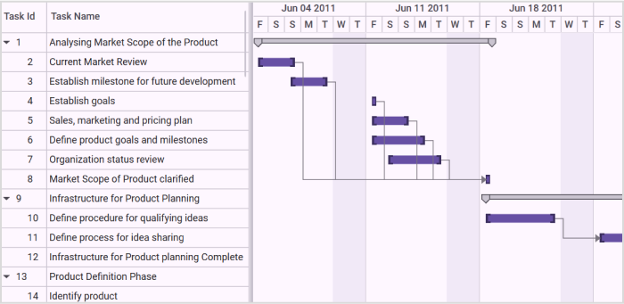

# Calendar Customization in WPF Gantt

This feature allows you to set your own schedule for the entire project. Using this feature you can customize the calendar as per the organization’s requirement. 

## Use Case Scenarios

You can use this feature when you want to change the schedule as needed. For example, if April to March is your financial year, you can set this as your fiscal year and schedule the tasks accordingly. 

You can also use this to schedule the works that have different week cycle. For example if your organization follows the week cycle from Wednesday to Tuesday, you can achieve this using calendar Customization feature.

## Properties

<table>
<tr>
<th>
Property </th><th>
Description </th><th>
Type </th><th>
Data Type </th><th>
Reference links </th></tr>
<tr>
<td>
WeekBeginsOn</td><td>
Gets or sets the starting day of a week in the project schedule. By default it is set to Sunday. </td><td>
DependencyProperty </td><td>
Enum</td><td>
N/A</td></tr>
<tr>
<td>
FiscalYearBeginsOn</td><td>
Gets or sets the starting month of a fiscal year. By default it is set to January</td><td>
DependencyProperty</td><td>
Enum</td><td>
N/A</td></tr>
<tr>
<td>
IsFYNumberingEnabled</td><td>
Gets or sets the Fiscal Year Numbering. If this property is changed, it will be reflected in the schedule.By default FY Numbering is set to false.</td><td>
Dependency Property</td><td>
bool</td><td>
N/A</td></tr>
<tr>
<td>
DefaultStartTime</td><td>
Gets or sets the task starting time in a day. This is based on the {{ '_GanttTime_' | markdownify }} class of the Gantt control.By default this is set to 9.00 AM</td><td>
Dependency Property</td><td>
GanttTime</td><td>
N/A</td></tr>
<tr>
<td>
DefaultEndTime</td><td>
Gets or sets the task ending time in a day. This is based on the {{ '_GanttTime_' | markdownify }} class of the Gantt control.By default this is set to 6.00 PM</td><td>
Dependency Property</td><td>
GanttTime</td><td>
N/A</td></tr>
<tr>
<td>
Weekends</td><td>
Gets or sets the weekend days. Default value is Saturday, Sunday.</td><td>
Dependency Property</td><td>
Days</td><td>
N/A</td></tr>
<tr>
<td>
ShowWeekends</td><td>
Enables or disables the weekend days in schedule. Default value is true.</td><td>
Dependency Property</td><td>
bool</td><td>
N/A</td></tr>
<tr>
<td>
ExcludeWeekends</td><td>
Excludes or includes the weekend days in duration calculation. Default value is false.</td><td>
Dependency Property</td><td>
bool</td><td>
N/A</td></tr>
<tr>
<td>
ShowNonWorkingHoursBackground</td><td>
Enables or disables the background for weekend days. Default value is true.</td><td>
Dependency Property</td><td>
bool</td><td>
N/A</td></tr>
</table>

N> Currently DefaultStartTime and DefaultEndTime will reflect only in the Chart Background Panel.

## Adding Calendar Customization to an Application 

Define the value to weekdays, months, FY Numbering, default start time and default end time as required and assign it to the appropriate APIs in the Gantt.

The following code illustrates adding Calendar Customization to an Application:




<syncfusion:GanttControl x:Name="ganttControl"
                         WeekBeginsOn="Friday" 
                         Weekends="Wednesday,Thursday"
                         FiscalYearBeginsOn="June"
                         IsFiscalYearNumberingEnabled="True"
                         DefaultEndTime="16:00:00"
                         ShowWeekends="True"
                         ExcludeWeekends="True"
                         DefaultStartTime="10:00:00"
                         ShowNonWorkingHoursBackground="True"
                         ItemsSource="{Binding TaskCollection}">
    <syncfusion:GanttControl.TaskAttributeMapping>
        <syncfusion:TaskAttributeMapping TaskIdMapping="TaskId"
                                         TaskNameMapping="TaskName"
                                         StartDateMapping="StartDate"
                                         ChildMapping="Child"
                                         FinishDateMapping="FinishDate"
                                         DurationMapping="Duration"
                                         ProgressMapping="Progress"
                                         MileStoneMapping="IsMileStone"
                                         PredecessorMapping="Predecessor"/>
    </syncfusion:GanttControl.TaskAttributeMapping>
    <syncfusion:GanttControl.DataContext>
        <local:ViewModel/>
    </syncfusion:GanttControl.DataContext>
</syncfusion:GanttControl>




this.ganttControl.ItemsSource = new ViewModel().TaskCollection;

//To set WeekBeginsOn
this.ganttControl.WeekBeginsOn = DayOfWeek.Friday;

//To set FY Numbering
this.ganttControl.IsFiscalYearNumberingEnabled = true;

//To set FiscalYearBeginsOn
this.ganttControl.FiscalYearBeginsOn = Month.June;

//To set DefaultStartTime
this.ganttControl.DefaultStartTime = new TimeSpan(10, 0, 0);

//To set DefaultEndTime
this.ganttControl.DefaultEndTime = new TimeSpan(16, 0, 0);

//To set Weekends
this.ganttControl.Weekends = Days.Wednesday | Days.Thursday;

//To set ShowWeekends
this.ganttControl.ShowWeekends = true;

//To set ExcludeWeekends
this.ganttControl.ExcludeWeekends = true;

//To set ShowNonWorkingHoursBackground
this.ganttControl.ShowNonWorkingHoursBackground = true;

// Task attribute mapping
TaskAttributeMapping taskAttributeMapping = new TaskAttributeMapping();
taskAttributeMapping.TaskIdMapping = "TaskId";
taskAttributeMapping.TaskNameMapping = "TaskName";
taskAttributeMapping.StartDateMapping = "StartDate";
taskAttributeMapping.ChildMapping = "Child";
taskAttributeMapping.FinishDateMapping = "FinishDate";
taskAttributeMapping.DurationMapping = "Duration";
taskAttributeMapping.ProgressMapping = "Progress";
taskAttributeMapping.PredecessorMapping = "Predecessor";
taskAttributeMapping.ResourceInfoMapping = "Resource";
taskAttributeMapping.MileStoneMapping = "IsMileStone";
this.ganttControl.TaskAttributeMapping = taskAttributeMapping;



 
public class ViewModel
{
    /// 

    /// Holds the collection value.
    /// 

    private ObservableCollection<TaskDetails> _taskCollection;

    /// 

    /// Holds the default start value.
    /// 

    private string[] defaultstart;

    /// 

    /// Holds the default end value.
    /// 

    private string[] defaultend;

    /// 

    /// Holds the fynumbering value.
    /// 

    private string[] fynumbering;

    /// 

    /// Gets or sets the default start.
    /// 

    /// <value>The default start.</value>
    public string[] DefaultStart
    {
        get
        {
            return defaultstart;
        }
        set
        {
            defaultstart = value;
        }
    }

    /// 

    /// Gets or sets the default end.
    /// 

    /// <value>The default end.</value>
    public string[] DefaultEnd
    {
        get
        {
            return defaultend;
        }
        set
        {
            defaultend = value;
        }
    }

    /// 

    /// Gets or sets the FY numbering.
    /// 

    /// <value>The FY numbering.</value>
    public string[] FYNumbering
    {
        get
        {
            return fynumbering;
        }
        set
        {
            fynumbering = value;
        }
    }

    /// 

    /// Gets or sets the show holidays collection.
    /// 

    public string[] ShowHolidaysCollection { get; set; }

    /// 

    /// Gets or sets the exclude holidays collection.
    /// 

    public string[] ExcludeHolidaysCollection { get; set; }

    /// 

    /// Gets or sets the show weekend collection.
    /// 

    public string[] ShowWeekendsCollection { get; set; }

    /// 

    /// Gets or sets the exclude weekend collection.
    /// 

    public string[] ExcludeWeekendsCollection { get; set; }

    /// 

    /// Gets or sets the Holidays collection.
    /// 

    /// <value>The Holiday collection.</value>
    public GanttHolidayCollection GanttHolidayCollection { get; set; }

    /// 

    /// Initializes a new instance of the <see cref="ViewModel"/> class.
    /// 

    public ViewModel()
    {
        _taskCollection = GetData();
        ExcludeWeekendsCollection = ShowWeekendsCollection = ExcludeHolidaysCollection = ShowHolidaysCollection = FYNumbering = new string[] { "True", "False" };
        DefaultStart = new string[]{"12:00 AM","01:00 AM","02:00 AM","03:00 AM","04:00 AM","05:00 AM","06:00 AM","07:00 AM","08:00 AM","09:00 AM",
                                   "10:00 AM","11:00 AM","12:00 PM","01:00 PM","02:00 PM","03:00 PM","04:00 PM","05:00 PM","06:00 PM","07:00 PM","08:00 PM","09:00 PM",
                                   "10:00 PM","11:00 PM"};
        DefaultEnd = new string[]{"12:00 AM","01:00 AM","02:00 AM","03:00 AM","04:00 AM","05:00 AM","06:00 AM","07:00 AM","08:00 AM","09:00 AM",
                                   "10:00 AM","11:00 AM","12:00 PM","01:00 PM","02:00 PM","03:00 PM","04:00 PM","05:00 PM","06:00 PM","07:00 PM","08:00 PM","09:00 PM",
                                   "10:00 PM","11:00 PM"};
        this.GanttHolidayCollection = this.GetHolidayCollection();
    }

    /// 

    /// Gets the Holiday collection.
    /// 

    /// <value>The Holiday collection.</value>
    private GanttHolidayCollection GetHolidayCollection()
    {
        GanttHolidayCollection collection = new GanttHolidayCollection();
        collection.Add(new GanttHoliday { Day = new DateTime(2010, 6, 10), Background = Brushes.CadetBlue });
        collection.Add(new GanttHoliday { Day = new DateTime(2010, 7, 8), Background = Brushes.CadetBlue });
        collection.Add(new GanttHoliday { Day = new DateTime(2010, 8, 3), Background = Brushes.CadetBlue });
        collection.Add(new GanttHoliday { Day = new DateTime(2010, 9, 20), Background = Brushes.CadetBlue });
        return collection;
    }

    /// 

    /// Gets or sets the appointment item source.
    /// 

    /// <value>The appointment item source.</value>
    public ObservableCollection<TaskDetails> TaskCollection
    {
        get
        {
            return _taskCollection;
        }
        set
        {
            _taskCollection = value;
        }
    }

    /// 

    /// Gets the data.
    /// 

    /// <returns></returns>
    public ObservableCollection<TaskDetails> GetData()
    {
        ObservableCollection<TaskDetails> taskDetails = new ObservableCollection<TaskDetails>();

        taskDetails.Add(new TaskDetails { StartDate = new DateTime(2010, 6, 2), FinishDate = new DateTime(2010, 6, 18), TaskName = "Analysing Market Scope of the Product", TaskId = 1 });

        ObservableCollection<IGanttTask> MarketAnalysis = new ObservableCollection<IGanttTask>();
        MarketAnalysis.Add(new TaskDetails { StartDate = new DateTime(2010, 6, 2), FinishDate = new DateTime(2010, 6, 6), TaskName = "Current Market Review", TaskId = 2 });
        MarketAnalysis.Add(new TaskDetails { StartDate = new DateTime(2010, 6, 6), FinishDate = new DateTime(2010, 6, 9), TaskName = "Establish milestone for future development", TaskId = 3 });
        MarketAnalysis.Add(new TaskDetails { StartDate = new DateTime(2010, 6, 9), FinishDate = new DateTime(2010, 6, 10), TaskName = "Establish goals", TaskId = 4 });
        MarketAnalysis.Add(new TaskDetails { StartDate = new DateTime(2010, 6, 10), FinishDate = new DateTime(2010, 6, 13), TaskName = "Sales, marketing and pricing plan", TaskId = 5 });
        MarketAnalysis.Add(new TaskDetails { StartDate = new DateTime(2010, 6, 11), FinishDate = new DateTime(2010, 6, 14), TaskName = "Define product goals and milestones", TaskId = 6 });
        MarketAnalysis.Add(new TaskDetails { StartDate = new DateTime(2010, 6, 12), FinishDate = new DateTime(2010, 6, 17), TaskName = "Organization status review", TaskId = 7 });
        MarketAnalysis.Add(new TaskDetails { StartDate = new DateTime(2010, 6, 18), FinishDate = new DateTime(2010, 6, 18), TaskName = "Market Scope of Product clarified", TaskId = 8 });
        ObservableCollection<Predecessor> predecessors = new ObservableCollection<Predecessor>();
        predecessors.Add(new Predecessor { GanttTaskIndex = 2, GanttTaskRelationship = GanttTaskRelationship.FinishToStart });
        predecessors.Add(new Predecessor { GanttTaskIndex = 3, GanttTaskRelationship = GanttTaskRelationship.FinishToStart });
        predecessors.Add(new Predecessor { GanttTaskIndex = 4, GanttTaskRelationship = GanttTaskRelationship.FinishToStart });
        predecessors.Add(new Predecessor { GanttTaskIndex = 5, GanttTaskRelationship = GanttTaskRelationship.FinishToStart });
        predecessors.Add(new Predecessor { GanttTaskIndex = 6, GanttTaskRelationship = GanttTaskRelationship.FinishToStart });
        predecessors.Add(new Predecessor { GanttTaskIndex = 7, GanttTaskRelationship = GanttTaskRelationship.FinishToStart });
        MarketAnalysis[6].Predecessor = predecessors;

        taskDetails[0].Child = MarketAnalysis;

        taskDetails.Add(new TaskDetails { StartDate = new DateTime(2010, 6, 18), FinishDate = new DateTime(2010, 7, 14), TaskName = "Infrastructure for Product Planning", TaskId = 9 });
        ObservableCollection<IGanttTask> InfrastructureReq = new ObservableCollection<IGanttTask>();
        InfrastructureReq.Add(new TaskDetails { StartDate = new DateTime(2010, 6, 18), FinishDate = new DateTime(2010, 6, 24), TaskName = "Define procedure for qualifying ideas", TaskId = 10 });
        InfrastructureReq.Add(new TaskDetails { StartDate = new DateTime(2010, 6, 24), FinishDate = new DateTime(2010, 7, 7), TaskName = "Define process for idea sharing", TaskId = 11 });
        InfrastructureReq.Add(new TaskDetails { StartDate = new DateTime(2010, 7, 7), FinishDate = new DateTime(2010, 7, 14), TaskName = "Infrastructure for Product planning Complete", TaskId = 12 });
        InfrastructureReq[1].Predecessor.Add(new Predecessor { GanttTaskIndex = 10, GanttTaskRelationship = GanttTaskRelationship.FinishToStart });
        InfrastructureReq[2].Predecessor.Add(new Predecessor { GanttTaskIndex = 11, GanttTaskRelationship = GanttTaskRelationship.FinishToStart });

        taskDetails[1].Child = InfrastructureReq;

        taskDetails.Add(new TaskDetails { StartDate = new DateTime(2010, 7, 14), FinishDate = new DateTime(2010, 8, 29), TaskName = "Product Definition Phase", TaskId = 13 });
        ObservableCollection<IGanttTask> Product = new ObservableCollection<IGanttTask>();
        Product.Add(new TaskDetails { StartDate = new DateTime(2010, 7, 14), FinishDate = new DateTime(2010, 7, 25), TaskName = "Identify product", TaskId = 14 });
        Product.Add(new TaskDetails { StartDate = new DateTime(2010, 7, 28), FinishDate = new DateTime(2010, 8, 1), TaskName = "Identify need for the product", TaskId = 15 });
        Product.Add(new TaskDetails { StartDate = new DateTime(2010, 8, 4), FinishDate = new DateTime(2010, 8, 8), TaskName = "Identify current trend for targets", TaskId = 16 });
        Product.Add(new TaskDetails { StartDate = new DateTime(2010, 8, 4), FinishDate = new DateTime(2010, 8, 29), TaskName = "Define product use and features", TaskId = 17 });
        Product.Add(new TaskDetails { StartDate = new DateTime(2010, 8, 4), FinishDate = new DateTime(2010, 8, 8), TaskName = "Identify competitor product", TaskId = 18 });
        Product.Add(new TaskDetails { StartDate = new DateTime(2010, 8, 29), FinishDate = new DateTime(2010, 8, 29), TaskName = "Product Definition Complete", TaskId = 19 });

        Product[1].Predecessor.Add(new Predecessor { GanttTaskIndex = 14, GanttTaskRelationship = GanttTaskRelationship.FinishToStart });
        Product[2].Predecessor.Add(new Predecessor { GanttTaskIndex = 15, GanttTaskRelationship = GanttTaskRelationship.FinishToStart });
        Product[3].Predecessor.Add(new Predecessor { GanttTaskIndex = 16, GanttTaskRelationship = GanttTaskRelationship.FinishToStart });
        Product[5].Predecessor.Add(new Predecessor { GanttTaskIndex = 16, GanttTaskRelationship = GanttTaskRelationship.FinishToStart });
        Product[5].Predecessor.Add(new Predecessor { GanttTaskIndex = 17, GanttTaskRelationship = GanttTaskRelationship.FinishToStart });
        Product[5].Predecessor.Add(new Predecessor { GanttTaskIndex = 18, GanttTaskRelationship = GanttTaskRelationship.FinishToStart });

        taskDetails[2].Child = Product;

        taskDetails.Add(new TaskDetails { StartDate = new DateTime(2010, 9, 2), FinishDate = new DateTime(2010, 9, 10), TaskName = "Analysing Customer Requirement", TaskId = 20 });
        ObservableCollection<IGanttTask> Customer = new ObservableCollection<IGanttTask>();
        Customer.Add(new TaskDetails { StartDate = new DateTime(2010, 9, 2), FinishDate = new DateTime(2010, 9, 4), TaskName = "Identify Consumer of Products", TaskId = 21 });
        Customer.Add(new TaskDetails { StartDate = new DateTime(2010, 9, 3), FinishDate = new DateTime(2010, 9, 6), TaskName = "Identify Customer Requirement", TaskId = 22 });
        Customer.Add(new TaskDetails { StartDate = new DateTime(2010, 9, 5), FinishDate = new DateTime(2010, 9, 8), TaskName = "Analysing Customer Requiremet with current plan", TaskId = 23 });
        Customer.Add(new TaskDetails { StartDate = new DateTime(2010, 9, 7), FinishDate = new DateTime(2010, 9, 10), TaskName = "Design based on Customer Requirement", TaskId = 24 });
        Customer.Add(new TaskDetails { StartDate = new DateTime(2010, 9, 10), FinishDate = new DateTime(2010, 9, 10), TaskName = "Customer Requirement Analysis Complete", TaskId = 25 });
        Customer[1].Predecessor.Add(new Predecessor { GanttTaskIndex = 21, GanttTaskRelationship = GanttTaskRelationship.FinishToStart });
        Customer[2].Predecessor.Add(new Predecessor { GanttTaskIndex = 22, GanttTaskRelationship = GanttTaskRelationship.FinishToStart });
        Customer[3].Predecessor.Add(new Predecessor { GanttTaskIndex = 23, GanttTaskRelationship = GanttTaskRelationship.FinishToStart });
        Customer[4].Predecessor.Add(new Predecessor { GanttTaskIndex = 24, GanttTaskRelationship = GanttTaskRelationship.FinishToStart });

        taskDetails[3].Child = Customer;

        taskDetails.Add(new TaskDetails { StartDate = new DateTime(2010, 9, 2), FinishDate = new DateTime(2010, 10, 10), TaskName = "Competitor Analysis", TaskId = 26 });
        ObservableCollection<IGanttTask> Competitor = new ObservableCollection<IGanttTask>();
        Competitor.Add(new TaskDetails { StartDate = new DateTime(2010, 9, 2), FinishDate = new DateTime(2010, 9, 13), TaskName = "Define competitor with similar Product", TaskId = 27 });
        Competitor.Add(new TaskDetails { StartDate = new DateTime(2010, 9, 13), FinishDate = new DateTime(2010, 9, 20), TaskName = "Define competitive advantage", TaskId = 28 });
        Competitor.Add(new TaskDetails { StartDate = new DateTime(2010, 9, 22), FinishDate = new DateTime(2010, 9, 27), TaskName = "Identify competitive features", TaskId = 29 });
        Competitor.Add(new TaskDetails { StartDate = new DateTime(2010, 9, 29), FinishDate = new DateTime(2010, 10, 10), TaskName = "Define how to build competitive features", TaskId = 30 });
        Competitor[1].Predecessor.Add(new Predecessor { GanttTaskIndex = 27, GanttTaskRelationship = GanttTaskRelationship.FinishToStart });
        Competitor[2].Predecessor.Add(new Predecessor { GanttTaskIndex = 28, GanttTaskRelationship = GanttTaskRelationship.FinishToStart });
        Competitor[3].Predecessor.Add(new Predecessor { GanttTaskIndex = 29, GanttTaskRelationship = GanttTaskRelationship.FinishToStart });

        taskDetails[4].Child = Competitor;

        taskDetails.Add(new TaskDetails { StartDate = new DateTime(2010, 9, 9), FinishDate = new DateTime(2010, 9, 20), TaskName = "Defining Sucess Measure", TaskId = 31 });
        ObservableCollection<IGanttTask> Measure = new ObservableCollection<IGanttTask>();
        Measure.Add(new TaskDetails { StartDate = new DateTime(2010, 9, 2), FinishDate = new DateTime(2010, 9, 6), TaskName = "Identify Risks", TaskId = 32 });
        Measure.Add(new TaskDetails { StartDate = new DateTime(2010, 9, 2), FinishDate = new DateTime(2010, 9, 6), TaskName = "Define Key success measures", TaskId = 33 });
        Measure.Add(new TaskDetails { StartDate = new DateTime(2010, 9, 7), FinishDate = new DateTime(2010, 9, 13), TaskName = "Define strategy to address risks", TaskId = 34 });
        Measure.Add(new TaskDetails { StartDate = new DateTime(2010, 9, 13), FinishDate = new DateTime(2010, 9, 20), TaskName = "Define strategy to meet market position", TaskId = 35 });
        Measure.Add(new TaskDetails { StartDate = new DateTime(2010, 9, 20), FinishDate = new DateTime(2010, 9, 20), TaskName = "Success Measure Defined", TaskId = 36 });

        Measure[1].Predecessor.Add(new Predecessor { GanttTaskIndex = 32, GanttTaskRelationship = GanttTaskRelationship.FinishToStart });
        Measure[4].Predecessor.Add(new Predecessor { GanttTaskIndex = 33, GanttTaskRelationship = GanttTaskRelationship.FinishToStart });
        Measure[4].Predecessor.Add(new Predecessor { GanttTaskIndex = 34, GanttTaskRelationship = GanttTaskRelationship.FinishToStart });
        Measure[4].Predecessor.Add(new Predecessor { GanttTaskIndex = 35, GanttTaskRelationship = GanttTaskRelationship.FinishToStart });

        taskDetails[5].Child = Measure;

        taskDetails.Add(new TaskDetails { StartDate = new DateTime(2010, 9, 23), FinishDate = new DateTime(2010, 10, 17), TaskName = "Defining Team to Develop", TaskId = 37 });
        ObservableCollection<IGanttTask> Team = new ObservableCollection<IGanttTask>();
        Team.Add(new TaskDetails { StartDate = new DateTime(2010, 9, 23), FinishDate = new DateTime(2010, 9, 27), TaskName = "Define successful team components for success", TaskId = 38 });
        Team.Add(new TaskDetails { StartDate = new DateTime(2010, 9, 30), FinishDate = new DateTime(2010, 10, 3), TaskName = "Identify Key qualities needed to develop, produce and grow", TaskId = 39 });
        Team.Add(new TaskDetails { StartDate = new DateTime(2010, 10, 6), FinishDate = new DateTime(2010, 10, 10), TaskName = "Define current team members", TaskId = 40 });
        Team.Add(new TaskDetails { StartDate = new DateTime(2010, 10, 13), FinishDate = new DateTime(2010, 10, 17), TaskName = "Identify and address gaps", TaskId = 41 });
        Team.Add(new TaskDetails { StartDate = new DateTime(2010, 10, 17), FinishDate = new DateTime(2010, 10, 17), TaskName = "Team Defined", TaskId = 42 });

        Team[1].Predecessor.Add(new Predecessor { GanttTaskIndex = 38, GanttTaskRelationship = GanttTaskRelationship.FinishToStart });
        Team[2].Predecessor.Add(new Predecessor { GanttTaskIndex = 39, GanttTaskRelationship = GanttTaskRelationship.FinishToStart });
        Team[3].Predecessor.Add(new Predecessor { GanttTaskIndex = 40, GanttTaskRelationship = GanttTaskRelationship.FinishToStart });
        Team[4].Predecessor.Add(new Predecessor { GanttTaskIndex = 41, GanttTaskRelationship = GanttTaskRelationship.FinishToStart });

        taskDetails[6].Child = Team;

        taskDetails.Add(new TaskDetails { StartDate = new DateTime(2010, 9, 2), FinishDate = new DateTime(2010, 9, 24), TaskName = "Budgeting in the Product", TaskId = 43 });
        ObservableCollection<IGanttTask> Budget = new ObservableCollection<IGanttTask>();
        Budget.Add(new TaskDetails { StartDate = new DateTime(2010, 9, 2), FinishDate = new DateTime(2010, 9, 3), TaskName = "Define financial metrics of product", TaskId = 44 });
        Budget.Add(new TaskDetails { StartDate = new DateTime(2010, 9, 3), FinishDate = new DateTime(2010, 9, 13), TaskName = "Estimate cost need to develop", TaskId = 45 });
        Budget.Add(new TaskDetails { StartDate = new DateTime(2010, 9, 13), FinishDate = new DateTime(2010, 9, 15), TaskName = "Estimate time to develop", TaskId = 46 });
        Budget.Add(new TaskDetails { StartDate = new DateTime(2010, 9, 15), FinishDate = new DateTime(2010, 9, 20), TaskName = "Analyse resource cost", TaskId = 47 });
        Budget.Add(new TaskDetails { StartDate = new DateTime(2010, 9, 20), FinishDate = new DateTime(2010, 9, 24), TaskName = "Define financial plan of Product", TaskId = 48 });
        Budget.Add(new TaskDetails { StartDate = new DateTime(2010, 9, 24), FinishDate = new DateTime(2010, 9, 24), TaskName = "Product Budget defined", TaskId = 49 });

        Budget[1].Predecessor.Add(new Predecessor { GanttTaskIndex = 44, GanttTaskRelationship = GanttTaskRelationship.FinishToStart });
        Budget[2].Predecessor.Add(new Predecessor { GanttTaskIndex = 45, GanttTaskRelationship = GanttTaskRelationship.FinishToStart });
        Budget[3].Predecessor.Add(new Predecessor { GanttTaskIndex = 46, GanttTaskRelationship = GanttTaskRelationship.FinishToStart });
        Budget[4].Predecessor.Add(new Predecessor { GanttTaskIndex = 47, GanttTaskRelationship = GanttTaskRelationship.FinishToStart });
        Budget[5].Predecessor.Add(new Predecessor { GanttTaskIndex = 48, GanttTaskRelationship = GanttTaskRelationship.FinishToStart });

        taskDetails[7].Child = Budget;

        taskDetails.Add(new TaskDetails { StartDate = new DateTime(2010, 10, 20), FinishDate = new DateTime(2010, 11, 10), TaskName = "Product Development", TaskId = 50 });
        ObservableCollection<IGanttTask> Development = new ObservableCollection<IGanttTask>();
        Development.Add(new TaskDetails { StartDate = new DateTime(2010, 10, 20), FinishDate = new DateTime(2010, 10, 30), TaskName = "Implementation Phase 1", TaskId = 51 });
        Development.Add(new TaskDetails { StartDate = new DateTime(2010, 10, 30), FinishDate = new DateTime(2010, 11, 10), TaskName = "Implementation Phase 2", TaskId = 52 });
        Development.Add(new TaskDetails { StartDate = new DateTime(2010, 11, 10), FinishDate = new DateTime(2010, 11, 10), TaskName = "Product Developed", TaskId = 53 });

        Development[1].Predecessor.Add(new Predecessor { GanttTaskIndex = 51, GanttTaskRelationship = GanttTaskRelationship.FinishToStart });
        Development[2].Predecessor.Add(new Predecessor { GanttTaskIndex = 52, GanttTaskRelationship = GanttTaskRelationship.FinishToStart });

        taskDetails[8].Child = Development;

        taskDetails.Add(new TaskDetails { StartDate = new DateTime(2010, 11, 8), FinishDate = new DateTime(2010, 11, 13), TaskName = "Product Review", TaskId = 54 });
        taskDetails[9].Child.Add(new TaskDetails { StartDate = new DateTime(2010, 11, 8), FinishDate = new DateTime(2010, 11, 10), TaskName = "Product Techincal Review", TaskId = 55 });
        taskDetails[9].Child.Add(new TaskDetails { StartDate = new DateTime(2010, 11, 9), FinishDate = new DateTime(2010, 11, 13), TaskName = "Product Cost Review", TaskId = 56 });

        taskDetails.Add(new TaskDetails { StartDate = new DateTime(2010, 11, 15), FinishDate = new DateTime(2010, 11, 30), TaskName = "Beta Testing", TaskId = 57 });
        ObservableCollection<IGanttTask> Testing = new ObservableCollection<IGanttTask>();
        Testing.Add((new TaskDetails { StartDate = new DateTime(2010, 11, 15), FinishDate = new DateTime(2010, 11, 17), TaskName = "Disseminate completed product", TaskId = 58 }));
        Testing.Add((new TaskDetails { StartDate = new DateTime(2010, 11, 18), FinishDate = new DateTime(2010, 11, 20), TaskName = "Obtain feedback", TaskId = 59 }));
        Testing.Add((new TaskDetails { StartDate = new DateTime(2010, 11, 20), FinishDate = new DateTime(2010, 11, 25), TaskName = "Modification", TaskId = 60 }));
        Testing.Add((new TaskDetails { StartDate = new DateTime(2010, 11, 24), FinishDate = new DateTime(2010, 11, 30), TaskName = "Test", TaskId = 61 }));
        Testing.Add((new TaskDetails { StartDate = new DateTime(2010, 11, 30), FinishDate = new DateTime(2010, 11, 30), TaskName = "Testing Completed", TaskId = 62 }));

        Testing[1].Predecessor.Add(new Predecessor { GanttTaskIndex = 58, GanttTaskRelationship = GanttTaskRelationship.FinishToStart });
        Testing[2].Predecessor.Add(new Predecessor { GanttTaskIndex = 59, GanttTaskRelationship = GanttTaskRelationship.FinishToStart });
        Testing[3].Predecessor.Add(new Predecessor { GanttTaskIndex = 60, GanttTaskRelationship = GanttTaskRelationship.FinishToStart });
        Testing[4].Predecessor.Add(new Predecessor { GanttTaskIndex = 61, GanttTaskRelationship = GanttTaskRelationship.FinishToStart });

        taskDetails[10].Child = Testing;

        taskDetails.Add(new TaskDetails { StartDate = new DateTime(2010, 11, 25), FinishDate = new DateTime(2010, 12, 06), TaskName = "Post Product Review", TaskId = 63 });
        ObservableCollection<IGanttTask> PostReview = new ObservableCollection<IGanttTask>();
        PostReview.Add((new TaskDetails { StartDate = new DateTime(2010, 11, 25), FinishDate = new DateTime(2010, 11, 27), TaskName = "Finalize cost analysis", TaskId = 64 }));
        PostReview.Add((new TaskDetails { StartDate = new DateTime(2010, 11, 27), FinishDate = new DateTime(2010, 11, 28), TaskName = "Analyze performance", TaskId = 65 }));
        PostReview.Add((new TaskDetails { StartDate = new DateTime(2010, 11, 29), FinishDate = new DateTime(2010, 12, 2), TaskName = "Archive files", TaskId = 66 }));
        PostReview.Add((new TaskDetails { StartDate = new DateTime(2010, 12, 2), FinishDate = new DateTime(2010, 12, 4), TaskName = "Document lessons learned", TaskId = 67 }));
        PostReview.Add((new TaskDetails { StartDate = new DateTime(2010, 12, 4), FinishDate = new DateTime(2010, 12, 6), TaskName = "Distribute to team members", TaskId = 68 }));
        PostReview.Add((new TaskDetails { StartDate = new DateTime(2010, 12, 6), FinishDate = new DateTime(2010, 12, 6), TaskName = "Post-project review complete", TaskId = 69 }));

        PostReview[1].Predecessor.Add(new Predecessor { GanttTaskIndex = 64, GanttTaskRelationship = GanttTaskRelationship.FinishToStart });
        PostReview[2].Predecessor.Add(new Predecessor { GanttTaskIndex = 65, GanttTaskRelationship = GanttTaskRelationship.FinishToStart });
        PostReview[3].Predecessor.Add(new Predecessor { GanttTaskIndex = 66, GanttTaskRelationship = GanttTaskRelationship.FinishToStart });
        PostReview[4].Predecessor.Add(new Predecessor { GanttTaskIndex = 67, GanttTaskRelationship = GanttTaskRelationship.FinishToStart });
        PostReview[5].Predecessor.Add(new Predecessor { GanttTaskIndex = 68, GanttTaskRelationship = GanttTaskRelationship.FinishToStart });

        taskDetails[11].Child = PostReview;

        taskDetails.Add(new TaskDetails { StartDate = new DateTime(2010, 12, 10), FinishDate = new DateTime(2010, 12, 10), TaskName = "Product Released Successfully", TaskId = 70 });

        return taskDetails;
    }
}




The following image shows Customized Calender and Weekends:

Customized Calender
{:.caption}

#### Samples Link

To view samples:

1. Go to the Syncfusion Essential Studio installed location. 
    Location: Installed Location\Syncfusion\Essential Studio\{{ site.releaseversion }}\Infrastructure\Launcher\Syncfusion Control Panel 
2. Open the Syncfusion Control Panel in the above location (or) Double click on the Syncfusion Control Panel desktop shortcut menu.
3. Click Run Samples for WPF under User Interface Edition panel.
4. Select Gantt.
5. Expand the Interactive Features item in the Sample Browser.
6. Choose the Calendar Customization sample to launch.

