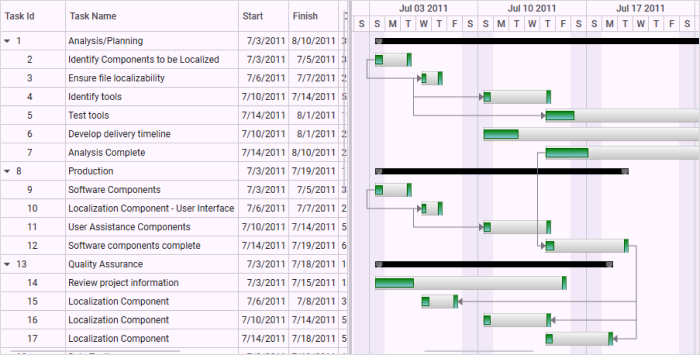
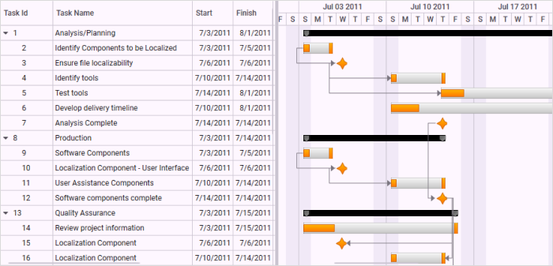

# Custom Node Style in WPF Gantt

Custom node style enables you to design your own style to the nodes that will be displayed in the Gantt. You can also customize the progress bar of the Task Node.Currently [GanttControl](https://help.syncfusion.com/cr/wpf/Syncfusion.Windows.Controls.Gantt.GanttControl.html) supports three types of node. They are:

* Header Node 
* Task Node
* Milestone

You can apply custom styles for all the three nodes. The basic functionalities of the Gantt nodes like resizing, drag and drop and tooltip are available only when the custom node style has the built-in node style’s such as drag and drop the thumb and resizing the thumbs. Otherwise the custom node will work properly, but you cannot access these features of Gantt. 

## Use Case Scenarios

You can customize the node to give a similar look and feel of your product. For example if you are from a steel company, then you can add a style that gives steel rod like look and feel to the node. 

You can also design the node based on your organization’s logo.

## Adding Custom Node Style to an Application 

The following are the steps to add custom node style to an application:

1. Define a style as needed with the target type for each node type as given in the following table:

#### Custom Node Types

<table>
<tr>
<th>
Node Type</th><th>
Target Type</th></tr>
<tr>
<td>
Header Node</td><td>
HeaderNode</td></tr>
<tr>
<td>
Task Node</td><td>
GanttNode</td></tr>
<tr>
<td>
Milestone</td><td>
MileStone</td></tr>
</table>




<syncfusion:GanttControl x:Name="ganttControl"
                         ItemsSource="{Binding TaskCollection}">
     <syncfusion:GanttControl.TaskAttributeMapping>
         <syncfusion:TaskAttributeMapping  TaskIdMapping="TaskId"
                                           TaskNameMapping="TaskName"
                                           StartDateMapping="StartDate"
                                           ChildMapping="Child"
                                           FinishDateMapping="FinishDate"
                                           DurationMapping="Duration"
                                           MileStoneMapping="IsMileStone"
                                           PredecessorMapping="Predecessor"
                                           ProgressMapping="Progress" />
     </syncfusion:GanttControl.TaskAttributeMapping>
    <syncfusion:GanttControl.Resources>
    

    <!-- Task Node style-->
    

    <!--Milestone style-->
    
        <Style TargetType="chart:GanttNode" BasedOn="{StaticResource TaskNode}"/>
        <Style TargetType="chart:MileStone" BasedOn="{StaticResource MileStone}"/>
    </syncfusion:GanttControl.Resources>
    <syncfusion:GanttControl.DataContext>
        <local:ViewModel/>
    </syncfusion:GanttControl.DataContext>
</syncfusion:GanttControl>





 this.ganttControl.ItemsSource = new ViewModel().TaskDetails;

// Task attribute mapping
TaskAttributeMapping taskAttributeMapping = new TaskAttributeMapping();
taskAttributeMapping.TaskIdMapping = "TaskId";
taskAttributeMapping.TaskNameMapping = "TaskName";
taskAttributeMapping.StartDateMapping = "StartDate";
taskAttributeMapping.ChildMapping = "Child";
taskAttributeMapping.FinishDateMapping = "FinishDate";
taskAttributeMapping.DurationMapping = "Duration";
taskAttributeMapping.MileStoneMapping = "IsMileStone";
taskAttributeMapping.PredecessorMapping = "Predecessor";
taskAttributeMapping.ProgressMapping = "Progress";
taskAttributeMapping.ResourceInfoMapping = "Resource";
this.ganttControl.TaskAttributeMapping = taskAttributeMapping;





 public class ViewModel
 {
    /// 

    /// Holds the task collections.
    /// 

    private ObservableCollection<TaskDetails> taskCollections;

    /// 

    /// Initializes a new instance of the <see cref="ViewModel"/> class.
    /// 

    public ViewModel()
    {
        this.taskCollections = GetData();
    }
    
    /// 

    /// Gets or sets the appointment item source.
    /// 

    /// <value>The appointment item source.</value>
    public ObservableCollection<TaskDetails> TaskCollection
    {
        get
        {
            return this.taskCollections;
        }
        set
        {
            this.taskCollections = value;
        }
    }

    /// 

    /// Gets the data.
    /// 

    /// <returns>The task details</returns>
    public  ObservableCollection<TaskDetails> GetData()
    {
        var taskDetails = new ObservableCollection<TaskDetails>();

        taskDetails.Add(new TaskDetails() { TaskId = 1, TaskName = "Analysis/Planning", StartDate = new DateTime(2011, 7, 3), FinishDate = new DateTime(2011, 7, 14), Progress = 40d });
        taskDetails[0].Child.Add((new TaskDetails() { TaskId = 2, TaskName = "Identify Components to be Localized", StartDate = new DateTime(2011, 7, 3), FinishDate = new DateTime(2011, 7, 5), Progress = 20d }));
        taskDetails[0].Child.Add((new TaskDetails() { TaskId = 3, TaskName = "Ensure file localizability", StartDate = new DateTime(2011, 7, 6), FinishDate = new DateTime(2011, 7, 7), Progress = 20d }));
        taskDetails[0].Child.Add((new TaskDetails() { TaskId = 4, TaskName = "Identify tools", StartDate = new DateTime(2011, 7, 10), FinishDate = new DateTime(2011, 7, 14), Progress = 10d }));
        taskDetails[0].Child.Add((new TaskDetails() { TaskId = 5, TaskName = "Test tools", StartDate = new DateTime(2011, 7, 14), FinishDate = new DateTime(2011, 8, 1), Progress = 10d }));
        taskDetails[0].Child.Add((new TaskDetails() { TaskId = 6, TaskName = "Develop delivery timeline", StartDate = new DateTime(2011, 7, 10), FinishDate = new DateTime(2011, 8, 1), Progress = 10d }));
        taskDetails[0].Child.Add((new TaskDetails() { TaskId = 7, TaskName = "Analysis Complete", StartDate = new DateTime(2011, 7, 14), FinishDate = new DateTime(2011, 8, 10), Progress = 10d }));

        taskDetails.Add(new TaskDetails() { TaskId = 8, TaskName = "Production", StartDate = new DateTime(2011, 7, 3), FinishDate = new DateTime(2011, 7, 14), Progress = 40d });
        taskDetails[1].Child.Add((new TaskDetails() { TaskId = 9, TaskName = "Software Components", StartDate = new DateTime(2011, 7, 3), FinishDate = new DateTime(2011, 7, 5), Progress = 20d }));
        taskDetails[1].Child.Add((new TaskDetails() { TaskId = 10, TaskName = "Localization Component - User Interface", StartDate = new DateTime(2011, 7, 6), FinishDate = new DateTime(2011, 7, 7), Progress = 20d }));
        taskDetails[1].Child.Add((new TaskDetails() { TaskId = 11, TaskName = "User Assistance Components", StartDate = new DateTime(2011, 7, 10), FinishDate = new DateTime(2011, 7, 14), Progress = 10d }));
        taskDetails[1].Child.Add((new TaskDetails() { TaskId = 12, TaskName = "Software components complete", StartDate = new DateTime(2011, 7, 14), FinishDate = new DateTime(2011, 7, 19), Progress = 10d }));

        taskDetails.Add(new TaskDetails() { TaskId = 13, TaskName = "Quality Assurance", StartDate = new DateTime(2011, 7, 3), FinishDate = new DateTime(2011, 7, 12), Progress = 40d, });
        taskDetails[2].Child.Add((new TaskDetails() { TaskId = 14, TaskName = "Review project information", StartDate = new DateTime(2011, 7, 3), FinishDate = new DateTime(2011, 7, 15), Progress = 20d }));
        taskDetails[2].Child.Add((new TaskDetails() { TaskId = 15, TaskName = "Localization Component", StartDate = new DateTime(2011, 7, 6), FinishDate = new DateTime(2011, 7, 8), Progress = 20d }));
        taskDetails[2].Child.Add((new TaskDetails() { TaskId = 16, TaskName = "Localization Component", StartDate = new DateTime(2011, 7, 10), FinishDate = new DateTime(2011, 7, 14), Progress = 10d }));
        taskDetails[2].Child.Add((new TaskDetails() { TaskId = 17, TaskName = "Localization Component", StartDate = new DateTime(2011, 7, 14), FinishDate = new DateTime(2011, 7, 18), Progress = 10d }));

        taskDetails.Add(new TaskDetails() { TaskId = 18, TaskName = "Beta Testing", StartDate = new DateTime(2011, 7, 3), FinishDate = new DateTime(2011, 7, 14), Progress = 40d });
        taskDetails[3].Child.Add((new TaskDetails() { TaskId = 19, TaskName = "Disseminate completed product", StartDate = new DateTime(2011, 7, 3), FinishDate = new DateTime(2011, 7, 5), Progress = 20d }));
        taskDetails[3].Child.Add((new TaskDetails() { TaskId = 20, TaskName = "Obtain feedback", StartDate = new DateTime(2011, 7, 6), FinishDate = new DateTime(2011, 7, 7), Progress = 20d }));
        taskDetails[3].Child.Add((new TaskDetails() { TaskId = 21, TaskName = "Modify", StartDate = new DateTime(2011, 7, 10), FinishDate = new DateTime(2011, 7, 19), Progress = 10d }));
        taskDetails[3].Child.Add((new TaskDetails() { TaskId = 22, TaskName = "Test", StartDate = new DateTime(2011, 7, 14), FinishDate = new DateTime(2011, 7, 19), Progress = 10d }));
        taskDetails[3].Child.Add((new TaskDetails() { TaskId = 23, TaskName = "Complete", StartDate = new DateTime(2011, 7, 10), FinishDate = new DateTime(2011, 7, 19), Progress = 10d }));

        taskDetails.Add(new TaskDetails() { TaskId = 24, TaskName = "Post-Project Review", StartDate = new DateTime(2011, 7, 3), FinishDate = new DateTime(2011, 7, 18), Progress = 40d, });
        taskDetails[4].Child.Add((new TaskDetails() { TaskId = 25, TaskName = "Finalize cost analysis", StartDate = new DateTime(2011, 7, 3), FinishDate = new DateTime(2011, 7, 5), Progress = 20d }));
        taskDetails[4].Child.Add((new TaskDetails() { TaskId = 26, TaskName = "Analyze performance", StartDate = new DateTime(2011, 7, 6), FinishDate = new DateTime(2011, 7, 7), Progress = 20d }));
        taskDetails[4].Child.Add((new TaskDetails() { TaskId = 27, TaskName = "Archive files", StartDate = new DateTime(2011, 7, 10), FinishDate = new DateTime(2011, 7, 14), Progress = 10d }));
        taskDetails[4].Child.Add((new TaskDetails() { TaskId = 28, TaskName = "Document lessons learned", StartDate = new DateTime(2011, 7, 14), FinishDate = new DateTime(2011, 7, 18), Progress = 10d }));
        taskDetails[4].Child.Add((new TaskDetails() { TaskId = 29, TaskName = "Distribute to team members", StartDate = new DateTime(2011, 7, 10), FinishDate = new DateTime(2011, 7, 14), Progress = 10d }));
        taskDetails[4].Child.Add((new TaskDetails() { TaskId = 30, TaskName = "Post-project review complete", StartDate = new DateTime(2011, 7, 10), FinishDate = new DateTime(2011, 7, 14), Progress = 10d }));

        taskDetails[0].Resources = new ObservableCollection<Resource>() { new Resource { ID = 1, Name = "John" }, new Resource { ID = 2, Name = "Neil" } };
        taskDetails[0].Child[3].Resources = new ObservableCollection<Resource>() { new Resource() { ID = 3, Name = "Peter" } };
        taskDetails[1].Resources = new ObservableCollection<Resource>() { new Resource() { ID = 4, Name = "David" } };

        taskDetails[0].Child[1].Predecessor.Add(new Predecessor() { GanttTaskIndex = 2, GanttTaskRelationship = GanttTaskRelationship.StartToStart });
        taskDetails[0].Child[2].Predecessor.Add(new Predecessor() { GanttTaskIndex = 3, GanttTaskRelationship = GanttTaskRelationship.StartToStart });
        taskDetails[0].Child[3].Predecessor.Add(new Predecessor() { GanttTaskIndex = 3, GanttTaskRelationship = GanttTaskRelationship.StartToStart });

        taskDetails[1].Child[1].Predecessor.Add(new Predecessor() { GanttTaskIndex = 9, GanttTaskRelationship = GanttTaskRelationship.StartToStart });
        taskDetails[1].Child[2].Predecessor.Add(new Predecessor() { GanttTaskIndex = 10, GanttTaskRelationship = GanttTaskRelationship.StartToStart });
        taskDetails[1].Child[3].Predecessor.Add(new Predecessor() { GanttTaskIndex = 7, GanttTaskRelationship = GanttTaskRelationship.StartToStart });

        taskDetails[2].Child[1].Predecessor.Add(new Predecessor() { GanttTaskIndex = 12, GanttTaskRelationship = GanttTaskRelationship.FinishToFinish });
        taskDetails[2].Child[2].Predecessor.Add(new Predecessor() { GanttTaskIndex = 12, GanttTaskRelationship = GanttTaskRelationship.FinishToFinish });
        taskDetails[2].Child[3].Predecessor.Add(new Predecessor() { GanttTaskIndex = 12, GanttTaskRelationship = GanttTaskRelationship.FinishToFinish });

        taskDetails[3].Child[1].Predecessor.Add(new Predecessor() { GanttTaskIndex = 18, GanttTaskRelationship = GanttTaskRelationship.StartToStart });
        taskDetails[3].Child[2].Predecessor.Add(new Predecessor() { GanttTaskIndex = 18, GanttTaskRelationship = GanttTaskRelationship.StartToStart });
        taskDetails[3].Child[3].Predecessor.Add(new Predecessor() { GanttTaskIndex = 19, GanttTaskRelationship = GanttTaskRelationship.StartToStart });

        taskDetails[4].Child[1].Predecessor.Add(new Predecessor() { GanttTaskIndex = 25, GanttTaskRelationship = GanttTaskRelationship.StartToStart });
        taskDetails[4].Child[2].Predecessor.Add(new Predecessor() { GanttTaskIndex = 28, GanttTaskRelationship = GanttTaskRelationship.StartToStart });
        taskDetails[4].Child[3].Predecessor.Add(new Predecessor() { GanttTaskIndex = 30, GanttTaskRelationship = GanttTaskRelationship.StartToStart });
        taskDetails[4].Child[4].Predecessor.Add(new Predecessor() { GanttTaskIndex = 27, GanttTaskRelationship = GanttTaskRelationship.StartToStart });
        return taskDetails;
    }
}




_Custom Node Style_

Custom Node Style
{:.caption}

## Samples Link

To view samples: 

1. Go to the Syncfusion Essential Studio installed location. 
    Location: Installed Location\Syncfusion\Essential Studio\{{ site.releaseversion }}\Infrastructure\Launcher\Syncfusion Control Panel 
2. Open the Syncfusion Control Panel in the above location (or) Double click on the Syncfusion Control Panel desktop shortcut menu.
3. Click Run Samples for WPF under User Interface Edition panel.
4. Select Gantt.
5. Expand the Styles item in the Sample Browser.
6. Choose the Custom Node Style sample to launch.

