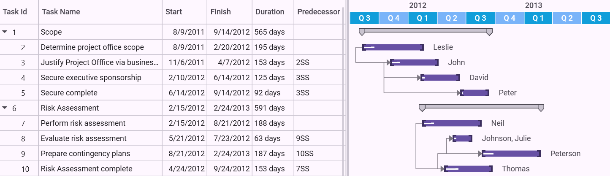

# Custom Schedule in WPF Gantt

Essential Gantt provides the custom schedule support that allows you to define your own schedule for Gantt to track the progress of projects. You can define the schedule for any measurement unit or for different types of date time formats namely quarterly basis scale and so on.

This feature will get the information from you and will draw the Gantt schedule with that information. Custom schedule is categorized into two types namely: 

* Custom Numeric 
* Custom DateTime

These types are included in the existing ScheduleType enum.

## Custom Numeric

Custom Numeric schedule is used to define your own schedule with any numeric measurement unit other than date time. With this schedule, you can track the progress based on your own measurement and there is no need to depend on Date Time. Two new API’s are added to the Mapping attributes to support this schedule in GanttChart and GanttGrid.

## Custom DateTime

Custom DateTime schedule is used to define your own date time schedule, which can match your current financial calendar. By using schedule type as custom schedule, you can define your schedule on quarterly basis.

In both the custom schedules, Gantt will get the information from the application to render the schedule. Gantt will accept the custom schedule information in the form of a collection of GanttScheduleRowInfo object, and process it to draw the schedule. 

GanttScheduleRowInfo class will have following fields:

1. PixelsPerUnit—Gets the information of the pixel value equivalent to one unit in custom measurement.
2. CellsPerUnit—Gets the information of a cell size of preceding row in the schedule based on the immediate next row. In CustomDateTime Schedule, the CellsPerUnit will be used to customize the cell. For example, in quarterly basis month cell, You need to draw a schedule by consolidating three months. For this, you need to define the CellsPerUnit of that corresponding row as 3.
3. TimeUnit—Gets the information about the type of row, when the schedule type is CustomDateTime. The Time unit can be any one of the following:

    * Seconds-represents the corresponding row as second's row.
    * Minutes—represents the corresponding row as minute’s row.
    * Hours—represents the corresponding row as hour’s row.
    * Days—represents the corresponding row as day’s row.
    * Weeks—represents the corresponding row as week’s row.
    * Months—represents the corresponding row as month’s row.
    * Years—represents the corresponding row as year’s row.

#### Use Case Scenario

This will be useful when you like to define your own schedules with your own measurements/calendars.

Example 1: The Research organizations may follow different measurements to track their work progress and the measurement will depend on their products. In this case, they can use CustomNumeric schedule to define the schedule with their own measure.

Example 2: A very big construction project many have the time period of many years or months. They need some customized way of date time schedule to track their progress. In this scenario, they can use the CustomDateTime schedule to form the custom schedule like the schedule that has the time scale on quarterly basis to track their progress.

#### Properties

<table>
<tr>
<th>
Property </th><th>
Description </th><th>
Type </th><th>
Data Type </th></tr>
<tr>
<td>
CustomScheduleSource</td><td>
Gets/Sets the custom schedule items Source of the Gantt.</td><td>
DependencyProperty </td><td>
IList&lt;GanttScheduleRowInfo&gt;</td></tr>
</table>

#### Events

<table>
<tr>
<th>
Event </th><th>
Description </th><th>
Arguments </th><th>
Type </th></tr>
<tr>
<td>
ScheduleCellCreated </td><td>
Event will be triggered whenever a schedule cell is created. The handler of the event will have the newly created cell (GanttScheduleCell) in the argument.By handling this event, you can customize the appearance of the cell. </td><td>
ScheduleCellCreated (object sender, ScheduleCellCreatedEventArgs args)</td><td>
Routed Event </td></tr>
</table>

## GanttScheduleCell Class

The properties of the GanttScheduleCell class are as follows:

#### Properties

<table>
<tr>
<th>
Property</th><th>
Description </th><th>
Type </th><th>
Data Type </th></tr>
<tr>
<td>
CellDate</td><td>
Gets/Sets the current schedule cell date in the datetime schedule. </td><td>
Dependency Property </td><td>
DateTime</td></tr>
<tr>
<td>
CellToolTip</td><td>
Gets/Sets the current schedule cell tool tip.</td><td>
Dependency Property</td><td>
Object</td></tr>
<tr>
<td>
CellTimeUnit</td><td>
Gets/Sets the current schedule row time unit (like weeks, months and so on).</td><td>
Dependency Property</td><td>
TimeUnit (Enum)</td></tr>
<tr>
<td>
Content</td><td>
Gets/Sets the current schedule cell content.</td><td>
Dependency Property</td><td>
Object</td></tr>
</table>

## Adding Custom Schedule to an Application

To Add CustomNumeric Schedule to an application:

1. Define the Mapping for StartPointMapping and FinishPointMapping in TaskAttributeMapping.
1. Set the Gantt Schedule type as CustomNumeric.
2. Bind the GanttScheduleRowInfo collection to the CustomScheduleSource property of the Gantt.

The following code illustrates Adding Custom Schedule to an Application:


<sync:GanttControl Grid.Row="1" 
                   ScheduleType="CustomNumeric" 
                   x:Name="Gantt"
                   VisualStyle="Office2010Black">
    <sync:GanttControl.TaskAttributeMapping>
        <sync:TaskAttributeMapping TaskIdMapping="Id"                    
                                   TaskNameMapping="Name"                
                                   StartPointMapping="Start" 
                                   FinishPointMapping="End"              
                                   ChildMapping="ChildTask"              
                                   ProgressMapping="Complete"
                                   ResourceInfoMapping="Resource">
        </sync:TaskAttributeMapping>
    </sync:GanttControl.TaskAttributeMapping>
</sync:GanttControl>




// Assigning the custom schedule Items Source

this.Gantt.CustomScheduleSource = this.GetInfo();   

/// Gets the Numeric Schedule Items Info        

private ObservableCollection<GanttScheduleRowInfo> GetInfo()

{

// Creating a new collection

ObservableCollection<GanttScheduleRowInfo> RowInfo = new

 ObservableCollection<GanttScheduleRowInfo>();

// Defining the top most row of the schedule 

RowInfo.Add(new GanttScheduleRowInfo() { CellsPerUnit = 3 });

// Defining the consecutive rows of the schedule

RowInfo.Add(new GanttScheduleRowInfo() { CellsPerUnit = 2 });

RowInfo.Add(new GanttScheduleRowInfo() { CellsPerUnit = 5 });

// Defining the bottom most row of the schedule

// Here we are setting the cell width in pixels

RowInfo.Add(new GanttScheduleRowInfo() { PixelsPerUnit = 30d });

return RowInfo;

}   



The following image shows Custom Schedule:

Custom Schedule
{:.caption}

## Samples Link

To view samples:

1. Go to the Syncfusion Essential Studio installed location. 
    Location: Installed Location\Syncfusion\Essential Studio\{{ site.releaseversion }}\Infrastructure\Launcher\Syncfusion Control Panel 
2. Open the Syncfusion Control Panel in the above location (or) Double click on the Syncfusion Control Panel desktop shortcut menu.
3. Click Run Samples for WPF under the User Interface Edition panel.
4. Select Gantt.
5. Expand the Custom Schedule item in the Sample Browser.
6. Choose the Custom Numeric Schedule sample to launch.

## Adding CustomDateTime Schedule to an Application

To Add CustomDateTime Schedule to an application:

1. Define the Gantt Schedule type as CustomDateTime.
2. Bind the GanttScheduleRowInfo collection to the CustomScheduleSource property of the Gantt.

The following code illustrates this:




<syncfusion:GanttControl x:Name="ganttControl"
                         ScheduleType="CustomDateTime"
                         ShowChartLines="False"
                         ShowNonWorkingHoursBackground="False"
                         ItemsSource="{Binding TaskCollection}">
    <syncfusion:GanttControl.TaskAttributeMapping>
        <syncfusion:TaskAttributeMapping ChildMapping="ChildCollection"
                                         DurationMapping="Duration"
                                         FinishDateMapping="EndDate"
                                         PredecessorMapping="Predecessor"
                                         ProgressMapping="Progress"
                                         ResourceInfoMapping="Resource"
                                         StartDateMapping="StartDate"
                                         TaskIdMapping="ID"
                                         TaskNameMapping="Name" />
    </syncfusion:GanttControl.TaskAttributeMapping>
</syncfusion:GanttControl>




// Assigning the custom schedule Items Source.
this.ganttControl.CustomScheduleSource = this.GetCustomScheduleSource();

// Hooks the schedule cell created event to customize the schedule cell appearance.
this.ganttControl.ScheduleCellCreated += this.OnGanttScheduleCellCreated;

// Gets the Custom Schedule Items Info
public IList<GanttScheduleRowInfo> GetCustomScheduleSource()
{
    List<GanttScheduleRowInfo> RowInfo = new List<GanttScheduleRowInfo>();

    // Defining the top most row of the schedule
    // Here we need the Year Schedule in this row. So we are defining  the TimeUnit as years
    RowInfo.Add(new GanttScheduleRowInfo()
    {
        TimeUnit = TimeUnit.Years,
        CellsPerUnit = 1,
        HorizontalAlignment = HorizontalAlignment.Left
    });

    // Defining the bottom most row of the schedule
    // Here we need to display the three months in a cell so we are defining TimeUnit in months, and cells per Unit as 3 
    // Bottom Most row should consist information about the pixels per Unit, so we define the pixels per unit as 15 (here this is a one month width).
    RowInfo.Add(new GanttScheduleRowInfo()
    {
        TimeUnit = TimeUnit.Months,
        CellsPerUnit = 3,
        PixelsPerUnit = 15
    });

    return RowInfo;
}

/// Handles the Schedule cell Created Event of the Gantt 

void Gantt_ScheduleCellCreated(object sender, ScheduleCellCreatedEventArgs args)
{
    DateTime currentDate = args.CurrentCell.CellDate;
    if (args.CurrentCell.CellTimeUnit == TimeUnit.Months)
    {
        args.CurrentCell.Foreground = new SolidColorBrush(Colors.White);
        // Quarter 1 dates contain months below 3 as we are checking the cell date and changing the content of the cell.
        if (currentDate.Month <= 3)
        {
            args.CurrentCell.Content = "Q 1";
            args.CurrentCell.CellToolTip = "Quarter 1";
            args.CurrentCell.Background = new SolidColorBrush(Colors.DarkGray);
        }

        // Quarter 2 dates contain months between 4 – 6 as we are checking the cell dates and changing the content of the cell.
        else if (currentDate.Month > 3 && currentDate.Month <= 6)
        {
            args.CurrentCell.Content = "Q 2";
            args.CurrentCell.CellToolTip = "Quarter 2";
            args.CurrentCell.Background = new SolidColorBrush(Colors.LightGray);
        }

        // Quarter 3 dates contains months between 6 - 9 as we are checking the cell date and changing the Content of the cell.
        else if (currentDate.Month > 6 && currentDate.Month <= 9)
        {
            args.CurrentCell.Content = "Q 3";
            args.CurrentCell.CellToolTip = "Quarter 3";
            args.CurrentCell.Background = new SolidColorBrush(Colors.DarkGray);
        }

        // Quarter 4 dates contains months between 9 - 12. So we are checking the cell date and changing the content of the cell.
        else if (currentDate.Month > 9 && currentDate.Month <= 12)
        {
            args.CurrentCell.Content = "Q 4";
            args.CurrentCell.CellToolTip = "Quarter 4";
            args.CurrentCell.Background = new SolidColorBrush(Colors.LightGray);
        }
    }

}




public class Task : INotifyPropertyChanged
{
    private DateTime startDate, endDate;

    private TimeSpan duration;

    private double progress;

    private int id;

    private string name;

    private ObservableCollection<Task> childCollection;

    private ObservableCollection<Resource> resource;

    private ObservableCollection<Predecessor> predecessor;

    public Task()
    {
        ChildCollection = new ObservableCollection<Task>();
        Predecessor = new ObservableCollection<Predecessor>();
        Resource = new ObservableCollection<Resource>();
    }

    /// 

    /// Property for Start Date.
    /// 

    public DateTime StartDate
    {
        get
        {
            return this.startDate;
        }
        set
        {
            this.startDate = value;
            OnPropertyChanged("StartDate");
        }
    }

    /// 

    /// Property for Finish Date.
    /// 

    public DateTime EndDate
    {
        get
        {
            return this.endDate;
        }
        set
        {
            this.endDate = value;
            OnPropertyChanged("EndDate");
        }
    }

    /// 

    /// Property for duration value.
    /// 

    public TimeSpan Duration
    {
        get
        {
            return this.duration;
        }
        set
        {
            this.duration = value;
            OnPropertyChanged("Duration");
        }
    }

    /// 

    /// Property for ID value.
    /// 

    public int ID
    {
        get
        {
            return this.id;
        }
        set
        {
            this.id = value;
            OnPropertyChanged("ID");
        }
    }

    /// 

    /// Property for Name.
    /// 

    public string Name
    {
        get
        {
            return this.name;
        }
        set
        {
            this.name = value;
            OnPropertyChanged("Name");
        }
    }

    /// 

    /// Property to define progress value.
    /// 

    public double Progress
    {
        get
        {
            return this.progress;
        }
        set
        {
            this.progress = value;
            OnPropertyChanged("Progress");
        }
    }

    /// 

    /// Property to add child collection.
    /// 

    public ObservableCollection<Task> ChildCollection
    {
        get
        {
            return this.childCollection;
        }
        set
        {
            this.childCollection = value;
            OnPropertyChanged("ChildCollection");
        }
    }

    /// 

    /// Property to define resource value.
    /// 

    public ObservableCollection<Resource> Resource
    {
        get
        {
            return this.resource;
        }
        set
        {
            this.resource = value;
            OnPropertyChanged("Resource");
        }
    }

    /// 

    /// Property to define predecessor value.
    /// 

    public ObservableCollection<Predecessor> Predecessor
    {
        get
        {
            return this.predecessor;
        }
        set
        {
            this.predecessor = value;
            OnPropertyChanged("Predecessor");
        }
    }

    private void OnPropertyChanged(string propName)
    {
        if (this.PropertyChanged != null)
        {
            PropertyChanged(this, new PropertyChangedEventArgs(propName));
        }
    }

    public event PropertyChangedEventHandler PropertyChanged;
}



 
public class ViewModel
{
    public ObservableCollection<Task> TaskCollection { get; set; }

    public ViewModel()
    {
    TaskCollection = this.GetDataSource();
    }

    private ObservableCollection<Task> GetDataSource()
    {
        var data = new ObservableCollection<Task>();
        data.Add(new Task() { ID = 1, Name = "Scope", StartDate = new DateTime(2011, 8, 9), EndDate = new DateTime(2012, 6, 20), Progress = 40d });
        data[0].ChildCollection.Add((new Task() { ID = 2, Name = "Determine project office scope", StartDate = new DateTime(2011, 8, 9), EndDate = new DateTime(2012, 2, 20), Progress = 20d, }));
        data[0].ChildCollection.Add((new Task() { ID = 3, Name = "Justify Project Offfice via business model", StartDate = new DateTime(2011, 11, 6), EndDate = new DateTime(2012, 4, 7), Progress = 20d, }));
        data[0].ChildCollection.Add((new Task() { ID = 4, Name = "Secure executive sponsorship", StartDate = new DateTime(2012, 2, 10), EndDate = new DateTime(2012, 6, 14), Progress = 10d, }));
        data[0].ChildCollection.Add((new Task() { ID = 5, Name = "Secure Progress", StartDate = new DateTime(2012, 6, 14), EndDate = new DateTime(2012, 9, 14), Progress = 10d }));

        data.Add(new Task() { ID = 6, Name = "Risk Assessment", StartDate = new DateTime(2012, 7, 15), EndDate = new DateTime(2011, 7, 24) });
        data[1].ChildCollection.Add((new Task() { ID = 7, Name = "Perform risk assessment", StartDate = new DateTime(2012, 2, 15), EndDate = new DateTime(2012, 8, 21), Progress = 20d, }));
        data[1].ChildCollection.Add((new Task() { ID = 8, Name = "Evaluate risk assessment", StartDate = new DateTime(2012, 5, 21), EndDate = new DateTime(2012, 7, 23), Progress = 20d, }));
        data[1].ChildCollection.Add((new Task() { ID = 9, Name = "Prepare contingency plans", StartDate = new DateTime(2012, 8, 21), EndDate = new DateTime(2013, 2, 24), Progress = 20d, }));
        data[1].ChildCollection.Add((new Task() { ID = 10, Name = "Risk Assessment Progress", StartDate = new DateTime(2012, 4, 24), EndDate = new DateTime(2012, 9, 24), Progress = 30d }));

        data.Add(new Task() { ID = 11, Name = "Monitoring", StartDate = new DateTime(2012, 7, 25), EndDate = new DateTime(2012, 8, 6), Duration = new TimeSpan(1, 0, 0, 0) });
        data[2].ChildCollection.Add((new Task() { ID = 12, Name = "Prepare Meeting agenda", StartDate = new DateTime(2012, 9, 25), EndDate = new DateTime(2012, 12, 26), Progress = 20d, }));
        data[2].ChildCollection.Add((new Task() { ID = 13, Name = "Conduct review meeting", StartDate = new DateTime(2013, 1, 27), EndDate = new DateTime(2013, 7, 30), Progress = 20d, }));
        data[2].ChildCollection.Add((new Task() { ID = 14, Name = "Migrate critical issues", StartDate = new DateTime(2013, 3, 30), EndDate = new DateTime(2013, 7, 2), Progress = 20d, }));
        data[2].ChildCollection.Add((new Task() { ID = 15, Name = "Estabilish change mgmt Control", StartDate = new DateTime(2013, 5, 3), EndDate = new DateTime(2013, 9, 6), Progress = 30d, }));
        data[2].ChildCollection.Add((new Task() { ID = 16, Name = "Monitoring Progress", StartDate = new DateTime(2013, 7, 6), EndDate = new DateTime(2013, 12, 6), Progress = 30d }));

        data.Add(new Task() { ID = 17, Name = "Post Implementation", StartDate = new DateTime(2013, 7, 25), EndDate = new DateTime(2012, 3, 12) });
        data[3].ChildCollection.Add((new Task() { ID = 18, Name = "Obtain User feedback", StartDate = new DateTime(2013, 7, 25), EndDate = new DateTime(2014, 4, 29), Progress = 20d, }));
        data[3].ChildCollection.Add((new Task() { ID = 19, Name = "Evaluate lessons learned", StartDate = new DateTime(2013, 10, 29), EndDate = new DateTime(2014, 7, 5), Progress = 20d, }));
        data[3].ChildCollection.Add((new Task() { ID = 20, Name = "Modify items as necessary", StartDate = new DateTime(2014, 1, 2), EndDate = new DateTime(2014, 9, 8), Progress = 20d, }));
        data[3].ChildCollection.Add((new Task() { ID = 21, Name = "Post Implementation Progress", StartDate = new DateTime(2014, 4, 8), EndDate = new DateTime(2014, 9, 12), Progress = 30d }));

        data[0].ChildCollection[0].Resource.Add(new Resource() { ID = 1, Name = "Leslie" });
        data[0].ChildCollection[1].Resource.Add(new Resource() { ID = 2, Name = "John" });
        data[0].ChildCollection[2].Resource.Add(new Resource() { ID = 3, Name = "DavID" });
        data[0].ChildCollection[3].Resource.Add(new Resource() { ID = 4, Name = "Peter" });

        data[1].ChildCollection[0].Resource.Add(new Resource() { ID = 5, Name = "Neil" });
        data[1].ChildCollection[1].Resource.Add(new Resource() { ID = 7, Name = "Johnson" });
        data[1].ChildCollection[1].Resource.Add(new Resource() { ID = 8, Name = "Julie" });
        data[1].ChildCollection[2].Resource.Add(new Resource() { ID = 9, Name = "Peterson" });
        data[1].ChildCollection[3].Resource.Add(new Resource() { ID = 10, Name = "Thomas" });

        data[3].ChildCollection[1].Resource.Add(new Resource() { ID = 5, Name = "DavID" });
        data[3].ChildCollection[2].Resource.Add(new Resource() { ID = 7, Name = "Peter" });
        data[3].ChildCollection[3].Resource.Add(new Resource() { ID = 8, Name = "Thomas" });

        data[0].ChildCollection[1].Predecessor.Add(new Predecessor() { GanttTaskIndex = 2, GanttTaskRelationship = GanttTaskRelationship.StartToStart });
        data[0].ChildCollection[2].Predecessor.Add(new Predecessor() { GanttTaskIndex = 3, GanttTaskRelationship = GanttTaskRelationship.StartToStart });
        data[0].ChildCollection[3].Predecessor.Add(new Predecessor() { GanttTaskIndex = 3, GanttTaskRelationship = GanttTaskRelationship.StartToStart });

        data[1].ChildCollection[1].Predecessor.Add(new Predecessor() { GanttTaskIndex = 9, GanttTaskRelationship = GanttTaskRelationship.StartToStart });
        data[1].ChildCollection[2].Predecessor.Add(new Predecessor() { GanttTaskIndex = 10, GanttTaskRelationship = GanttTaskRelationship.StartToStart });
        data[1].ChildCollection[3].Predecessor.Add(new Predecessor() { GanttTaskIndex = 7, GanttTaskRelationship = GanttTaskRelationship.StartToStart });

        data[2].ChildCollection[1].Predecessor.Add(new Predecessor() { GanttTaskIndex = 12, GanttTaskRelationship = GanttTaskRelationship.FinishToFinish });
        data[2].ChildCollection[2].Predecessor.Add(new Predecessor() { GanttTaskIndex = 12, GanttTaskRelationship = GanttTaskRelationship.FinishToFinish });
        data[2].ChildCollection[3].Predecessor.Add(new Predecessor() { GanttTaskIndex = 12, GanttTaskRelationship = GanttTaskRelationship.FinishToFinish });

        data[3].ChildCollection[1].Predecessor.Add(new Predecessor() { GanttTaskIndex = 18, GanttTaskRelationship = GanttTaskRelationship.StartToStart });
        data[3].ChildCollection[2].Predecessor.Add(new Predecessor() { GanttTaskIndex = 18, GanttTaskRelationship = GanttTaskRelationship.StartToStart });
        data[3].ChildCollection[3].Predecessor.Add(new Predecessor() { GanttTaskIndex = 19, GanttTaskRelationship = GanttTaskRelationship.StartToStart });
        return data;
    }
}




The following image shows Custom DateTime Schedule:

Custom DateTime Schedule
{:.caption}

## Samples Link

To view samples:

1. Go to the Syncfusion Essential Studio installed location. 
    Location: Installed Location\Syncfusion\Essential Studio\{{ site.releaseversion }}\Infrastructure\Launcher\Syncfusion Control Panel 
2. Open the Syncfusion Control Panel in the above location (or) Double click on the Syncfusion Control Panel desktop shortcut menu.
3. Click Run Samples for WPF under User Interface Edition panel.
4. Select Gantt.
5. Expand the Custom Schedule item in the Sample Browser.
6. Choose the Customized Schedule Appearance sample to launch.

## ScheduleCellCreatedEventArgs Class

The ScheduleCellCreatedEventArgs consists of the current schedule cell in the name of CurrentCell. It is the GanttScheduleCell type. 

