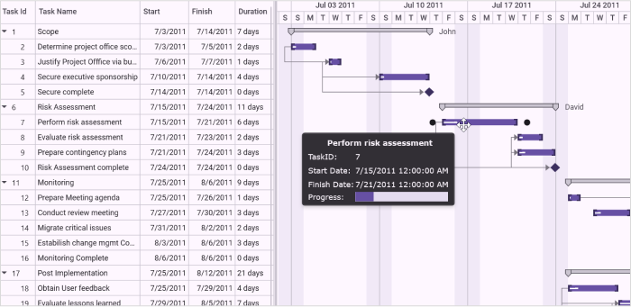

# CustomToolTip in WPF Gantt

Essential Gantt provides tooltip support for the TaskBar. Tooltip is a small pop-up box, which is usually displayed on mouse hover. This is used to display additional information about the elements without increasing the window size. Essential Gantt provides support to add customizable tooltip. You can add text or image to your tooltip as needed. 

## Properties

<table>
<tr>
<th>
Property </th><th>
Description </th><th>
Type </th><th>
Data Type </th></tr>
<tr>
<td>
[ToolTipTemplate](https://help.syncfusion.com/cr/wpf/Syncfusion.Windows.Controls.Gantt.GanttControl.html#Syncfusion_Windows_Controls_Gantt_GanttControl_ToolTipTemplate)</td><td>
Gets or set the TaskBarCollection Property of GanttControl</td><td>
Dependency Property</td><td>
DataTemplate</td></tr>
</table>

## Adding CustomToolTip to Gantt 

The following code illustrates how to add a custom tooltip to the Gantt control.



<Window.DataContext>
    <local:ViewModel/>
</Window.DataContext>
<Window.Resources>
    <DataTemplate x:Key="toolTipTemplate">
        <Grid>
            <Grid.ColumnDefinitions>
                <ColumnDefinition />
                <ColumnDefinition />
            </Grid.ColumnDefinitions>
            <Grid.RowDefinitions>
                <RowDefinition Height="22" />
                <RowDefinition Height="22" />
                <RowDefinition Height="22" />
                <RowDefinition Height="22" />
                <RowDefinition Height="Auto" />
            </Grid.RowDefinitions>
    <Border Grid.Row="0"
            Grid.Column="0"
            Grid.ColumnSpan="2">
    <TextBlock Margin="5,0,0,0"
               HorizontalAlignment="Center"
               VerticalAlignment="Center"
               FontFamily="Verdana"
               FontWeight="Bold"
               Text="{Binding Name}" />
    </Border>
    <TextBlock Grid.Row="1"
               Grid.Column="0"
               Margin="1"
               VerticalAlignment="Center"
               FontFamily="Verdana"
               Text="TaskID:" />
    <TextBlock Grid.Row="1"
               Grid.Column="1"
               Margin="1"
               VerticalAlignment="Center"
               FontFamily="Verdana"
               Text="{Binding ID}" />
    <TextBlock Grid.Row="2"
               Grid.Column="0"
               Margin="1"
               VerticalAlignment="Center"
               FontFamily="Verdana"
               Text="Start Date:" />
    <TextBlock Grid.Row="2"
               Grid.Column="1"
               Margin="1"
               VerticalAlignment="Center"
               FontFamily="Verdana"
               Text="{Binding StartDate}" />
    <TextBlock Grid.Row="3"
               Grid.Column="0"
               Margin="1"
               VerticalAlignment="Center"
               FontFamily="Verdana"
               Text="Finish Date:" />
    <TextBlock Grid.Row="3"
               Grid.Column="1"
               Margin="1"
               VerticalAlignment="Center"
               FontFamily="Verdana"
               Text="{Binding EndDate}" />
    <TextBlock Grid.Row="4"
               Grid.Column="0"
               Margin="1"
               VerticalAlignment="Center"
               FontFamily="Verdana"
               Text="Progress:" />
    <ProgressBar Grid.Row="4"
                 Grid.Column="1"
                 Height="15"
                 Margin="1,1,2,2"
                 VerticalAlignment="Center"
                 Value="{Binding Progress}" />
        </Grid>
    </DataTemplate>
</Window.Resources>

<syncfusion:GanttControl x:Name="ganttControl"
                         ToolTipTemplate="{StaticResource toolTipTemplate}"
                         ItemsSource="{Binding TaskCollection}">
    <syncfusion:GanttControl.TaskAttributeMapping>
        <syncfusion:TaskAttributeMapping TaskIdMapping="ID"
                                         TaskNameMapping="Name"
                                         StartDateMapping="StartDate"
                                         ChildMapping="ChildCollection"
                                         FinishDateMapping="EndDate"
                                         DurationMapping="Duration"
                                         ProgressMapping="Progress"
                                         PredecessorMapping="Predecessor"
                                         ResourceInfoMapping="Resource" />
    </syncfusion:GanttControl.TaskAttributeMapping>
    <syncfusion:GanttControl.DataContext>
        <local:ViewModel/>
    </syncfusion:GanttControl.DataContext>
</syncfusion:GanttControl>





this.ganttControl.ItemsSource = new ViewModel().TaskCollection;

// Task attribute mapping
TaskAttributeMapping taskAttributeMapping = new TaskAttributeMapping();
taskAttributeMapping.TaskIdMapping = "ID";
taskAttributeMapping.TaskNameMapping = "Name";
taskAttributeMapping.StartDateMapping = "StartDate";
taskAttributeMapping.ChildMapping = "ChildCollection";
taskAttributeMapping.FinishDateMapping = "EndDate";
taskAttributeMapping.DurationMapping = "Duration";
taskAttributeMapping.ProgressMapping = "Progress";
taskAttributeMapping.PredecessorMapping = "Predecessor";
taskAttributeMapping.ResourceInfoMapping = "Resource";
this.ganttControl.TaskAttributeMapping = taskAttributeMapping;





public class Task : INotifyPropertyChanged
{
    /// 

    /// Holds the start date and end date value.
    /// 

    private DateTime startDate, endDate;

    /// 

    /// Holds the duration value.
    /// 

    private TimeSpan duration;

    /// 

    /// Holds the progress value.
    /// 

    private double progress;

    /// 

    /// Holds the id value.
    /// 

    private int id;

    /// 

    /// Holds the name value.
    /// 

    private string name;

    /// 

    /// Holds the collection value.
    /// 

    private ObservableCollection<Task> childCollection;

    /// 

    /// Holds the resource value.
    /// 

    private ObservableCollection<Resource> resource;

    /// 

    /// Holds the predecessor value.
    /// 

    private ObservableCollection<Predecessor> predecessor;

    public Task()
    {
        this.ChildCollection = new ObservableCollection<Task>();
        this.Predecessor = new ObservableCollection<Predecessor>();
        this.Resource = new ObservableCollection<Resource>();
    }

    /// 

    /// Gets or sets the start date.
    /// 

    public DateTime StartDate
    {
        get
        {
            return this.startDate;
        }
        set
        {
            this.startDate = value;
            OnPropertyChanged("StartDate");
        }
    }

    /// 

    /// Gets or sets the finish date.
    /// 

    public DateTime EndDate
    {
        get
        {
            return this.endDate;
        }
        set
        {
            this.endDate = value;
            OnPropertyChanged("EndDate");
        }
    }

    /// 

    /// Gets or sets the duration value.
    /// 

    public TimeSpan Duration
    {
        get
        {
            return this.duration;
        }
        set
        {
            this.duration = value;
            OnPropertyChanged("Duration");
        }
    }

    /// 

    /// Gets or sets the ID value.
    /// 

    public int ID
    {
        get
        {
            return this.id;
        }
        set
        {
            this.id = value;
            OnPropertyChanged("ID");
        }
    }

    /// 

    /// Gets or sets the Name.
    /// 

    public string Name
    {
        get
        {
            return this.name;
        }
        set
        {
            this.name = value;
            OnPropertyChanged("Name");
        }
    }

    /// 

    /// Gets or sets the progress value.
    /// 

    public double Progress
    {
        get
        {
            return this.progress;
        }
        set
        {
            this.progress = value;
            OnPropertyChanged("Progress");
        }
    }

    /// 

    /// Gets or sets the child collection.
    /// 

    public ObservableCollection<Task> ChildCollection
    {
        get
        {
            return this.childCollection;
        }
        set
        {
            this.childCollection = value;
            OnPropertyChanged("ChildCollection");
        }
    }

    /// 

    /// Gets or sets the resource value.
    /// 

    public ObservableCollection<Resource> Resource
    {
        get
        {
            return this.resource;
        }
        set
        {
            this.resource = value;
            OnPropertyChanged("Resource");
        }
    }

    /// 

    /// Gets or sets the predecessor value.
    /// 

    public ObservableCollection<Predecessor> Predecessor
    {
        get
        {
            return this.predecessor;
        }
        set
        {
            this.predecessor = value;
            OnPropertyChanged("Predecessor");
        }
    }

    /// 

    /// Method for property changed.
    /// 

    private void OnPropertyChanged(string propName)
    {
        if (this.PropertyChanged != null)
        {
            PropertyChanged(this, new PropertyChangedEventArgs(propName));
        }
    }

    public event PropertyChangedEventHandler PropertyChanged;
}




public class ViewModel
{
    /// 

    /// Gets or sets the task collection.
    /// 

    public ObservableCollection<Task> TaskCollection { get; set; }

    public ViewModel()
    {
        this.TaskCollection = this.GetDataSource();
    }

    /// 

    /// Method to get taskDetails source.
    /// 

    private ObservableCollection<Task> GetDataSource()
    {
        var taskDetails = new ObservableCollection<Task>();
        taskDetails.Add(new Task() { ID = 1, Name = "Scope", StartDate = new DateTime(2011, 7, 3), EndDate = new DateTime(2011, 7, 14), Progress = 40d, Resource = new ObservableCollection<Resource>() { new Resource() { Name = "John" } } });
        taskDetails[0].ChildCollection.Add((new Task() { ID = 2, Name = "Determine project office scope", StartDate = new DateTime(2011, 7, 3), EndDate = new DateTime(2011, 7, 5), Progress = 20d }));
        taskDetails[0].ChildCollection.Add((new Task() { ID = 3, Name = "Justify Project Offfice via business model", StartDate = new DateTime(2011, 7, 6), EndDate = new DateTime(2011, 7, 7), Progress = 20d }));
        taskDetails[0].ChildCollection.Add((new Task() { ID = 4, Name = "Secure executive sponsorship", StartDate = new DateTime(2011, 7, 10), EndDate = new DateTime(2011, 7, 14), Progress = 10d }));
        taskDetails[0].ChildCollection.Add((new Task() { ID = 5, Name = "Secure Progress", StartDate = new DateTime(2011, 7, 14), EndDate = new DateTime(2011, 7, 14), Progress = 10d }));

        taskDetails.Add(new Task() { ID = 6, Name = "Risk Assessment", StartDate = new DateTime(2011, 7, 15), EndDate = new DateTime(2011, 7, 24), Resource = new ObservableCollection<Resource>() { new Resource() { Name = "DavID" } } });
        taskDetails[1].ChildCollection.Add((new Task() { ID = 7, Name = "Perform risk assessment", StartDate = new DateTime(2011, 7, 15), EndDate = new DateTime(2011, 7, 21), Progress = 20d }));
        taskDetails[1].ChildCollection.Add((new Task() { ID = 8, Name = "Evaluate risk assessment", StartDate = new DateTime(2011, 7, 21), EndDate = new DateTime(2011, 7, 23), Progress = 20d }));
        taskDetails[1].ChildCollection.Add((new Task() { ID = 9, Name = "Prepare contingency plans", StartDate = new DateTime(2011, 7, 21), EndDate = new DateTime(2011, 7, 24), Progress = 20d }));
        taskDetails[1].ChildCollection.Add((new Task() { ID = 10, Name = "Risk Assessment Progress", StartDate = new DateTime(2011, 7, 24), EndDate = new DateTime(2011, 7, 24), Progress = 30d }));

        taskDetails.Add(new Task() { ID = 11, Name = "Monitoring", StartDate = new DateTime(2011, 7, 25), EndDate = new DateTime(2011, 8, 6), Duration = new TimeSpan(1, 0, 0, 0) });
        taskDetails[2].ChildCollection.Add((new Task() { ID = 12, Name = "Prepare Meeting agenda", StartDate = new DateTime(2011, 7, 25), EndDate = new DateTime(2011, 7, 26), Progress = 20d }));
        taskDetails[2].ChildCollection.Add((new Task() { ID = 13, Name = "Conduct review meeting", StartDate = new DateTime(2011, 7, 27), EndDate = new DateTime(2011, 7, 30), Progress = 20d }));
        taskDetails[2].ChildCollection.Add((new Task() { ID = 14, Name = "Migrate critical issues", StartDate = new DateTime(2011, 7, 31), EndDate = new DateTime(2011, 8, 2), Progress = 20d }));
        taskDetails[2].ChildCollection.Add((new Task() { ID = 15, Name = "Estabilish change mgmt Control", StartDate = new DateTime(2011, 8, 3), EndDate = new DateTime(2011, 8, 6), Progress = 30d }));
        taskDetails[2].ChildCollection.Add((new Task() { ID = 16, Name = "Monitoring Progress", StartDate = new DateTime(2011, 8, 6), EndDate = new DateTime(2011, 8, 6), Progress = 30d }));

        taskDetails.Add(new Task() { ID = 17, Name = "Post Implementation", StartDate = new DateTime(2011, 7, 25), EndDate = new DateTime(2011, 8, 12) });
        taskDetails[3].ChildCollection.Add((new Task() { ID = 18, Name = "Obtain User feedback", StartDate = new DateTime(2011, 7, 25), EndDate = new DateTime(2011, 7, 29), Progress = 20d }));
        taskDetails[3].ChildCollection.Add((new Task() { ID = 19, Name = "Evaluate lessons learned", StartDate = new DateTime(2011, 7, 29), EndDate = new DateTime(2011, 8, 5), Progress = 20d }));
        taskDetails[3].ChildCollection.Add((new Task() { ID = 20, Name = "Modify items as necessary", StartDate = new DateTime(2011, 8, 2), EndDate = new DateTime(2011, 8, 8), Progress = 20d }));
        taskDetails[3].ChildCollection.Add((new Task() { ID = 21, Name = "Post Implementation Progress", StartDate = new DateTime(2011, 8, 8), EndDate = new DateTime(2011, 8, 12), Progress = 30d }));

        taskDetails[0].ChildCollection[1].Predecessor.Add(new Predecessor() { GanttTaskIndex = 2, GanttTaskRelationship = GanttTaskRelationship.StartToStart });
        taskDetails[0].ChildCollection[2].Predecessor.Add(new Predecessor() { GanttTaskIndex = 3, GanttTaskRelationship = GanttTaskRelationship.StartToStart });
        taskDetails[0].ChildCollection[3].Predecessor.Add(new Predecessor() { GanttTaskIndex = 3, GanttTaskRelationship = GanttTaskRelationship.StartToStart });

        taskDetails[1].ChildCollection[1].Predecessor.Add(new Predecessor() { GanttTaskIndex = 9, GanttTaskRelationship = GanttTaskRelationship.StartToStart });
        taskDetails[1].ChildCollection[2].Predecessor.Add(new Predecessor() { GanttTaskIndex = 10, GanttTaskRelationship = GanttTaskRelationship.StartToStart });
        taskDetails[1].ChildCollection[3].Predecessor.Add(new Predecessor() { GanttTaskIndex = 7, GanttTaskRelationship = GanttTaskRelationship.StartToStart });

        taskDetails[2].ChildCollection[1].Predecessor.Add(new Predecessor() { GanttTaskIndex = 12, GanttTaskRelationship = GanttTaskRelationship.FinishToFinish });
        taskDetails[2].ChildCollection[2].Predecessor.Add(new Predecessor() { GanttTaskIndex = 12, GanttTaskRelationship = GanttTaskRelationship.FinishToFinish });
        taskDetails[2].ChildCollection[3].Predecessor.Add(new Predecessor() { GanttTaskIndex = 12, GanttTaskRelationship = GanttTaskRelationship.FinishToFinish });

        taskDetails[3].ChildCollection[1].Predecessor.Add(new Predecessor() { GanttTaskIndex = 18, GanttTaskRelationship = GanttTaskRelationship.StartToStart });
        taskDetails[3].ChildCollection[2].Predecessor.Add(new Predecessor() { GanttTaskIndex = 18, GanttTaskRelationship = GanttTaskRelationship.StartToStart });
        taskDetails[3].ChildCollection[3].Predecessor.Add(new Predecessor() { GanttTaskIndex = 19, GanttTaskRelationship = GanttTaskRelationship.StartToStart });
        return taskDetails;
    }
}




The following image shows Custom ToolTip:

Custom ToolTip Demo
{:.caption}

## Samples Link

To view samples: 

1. Go to the Syncfusion Essential Studio installed location. 
    Location: Installed Location\Syncfusion\Essential Studio\{{ site.releaseversion }}\Infrastructure\Launcher\Syncfusion Control Panel 
2. Open the Syncfusion Control Panel in the above location (or) Double click on the Syncfusion Control Panel desktop shortcut menu.
2. Click Run Samples for WPF under User Interface Edition panel .
3. Select Gantt.
4. Expand the Interactive Features item in the Sample Browser.
5. Choose the CustomToolTip samples to launch.

