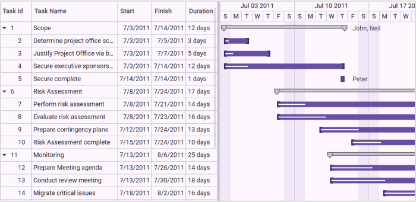
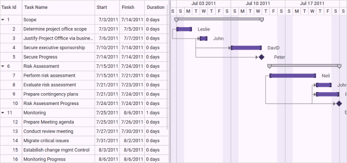

# Data Binding in WPF Gantt

## TaskDetails Binding

Essential Gantt for WPF includes an built-in class called [TaskDetails](https://help.syncfusion.com/cr/wpf/Syncfusion.Windows.Controls.Gantt.TaskDetails.html), which is inherited from the [IGanttTask](https://help.syncfusion.com/cr/wpf/Syncfusion.Windows.Controls.Gantt.IGanttTask.html) interface. A collection of the [TaskDetails](https://help.syncfusion.com/cr/wpf/Syncfusion.Windows.Controls.Gantt.TaskDetails.html) can be bounded as an ItemsSource for the [GanttControl](https://help.syncfusion.com/cr/wpf/Syncfusion.Windows.Controls.Gantt.GanttControl.html).

#### Use Case Scenarios

You can easily create the task details collection using the TaskDetails class or by creating a new class by inheriting the [IGanttTask](https://help.syncfusion.com/cr/wpf/Syncfusion.Windows.Controls.Gantt.IGanttTask.html) interface.

Binding [TaskDetails](https://help.syncfusion.com/cr/wpf/Syncfusion.Windows.Controls.Gantt.TaskDetails.html) collection to Gantt Control

The following code illustrates how to bind the Task Details to the Gantt Control:





<syncfusion:GanttControl x:Name="ganttControl"
                         ItemsSource="{Binding TaskDetails}">
    <syncfusion:GanttControl.TaskAttributeMapping>
        <syncfusion:TaskAttributeMapping TaskIdMapping="TaskId"
                                         TaskNameMapping="TaskName"
                                         StartDateMapping="StartDate"
                                         ChildMapping="Child"
                                         FinishDateMapping="FinishDate"
                                         DurationMapping="Duration"
                                         ProgressMapping="Progress"/>
    </syncfusion:GanttControl.TaskAttributeMapping>
    <syncfusion:GanttControl.DataContext>
        <local:ViewModel/>
    </syncfusion:GanttControl.DataContext>
</syncfusion:GanttControl>





// Task attribute mapping
TaskAttributeMapping taskAttributeMapping = new TaskAttributeMapping();
taskAttributeMapping.TaskIdMapping = "TaskId";
taskAttributeMapping.TaskNameMapping = "TaskName";
taskAttributeMapping.StartDateMapping = "StartDate";
taskAttributeMapping.ChildMapping = "Child";
taskAttributeMapping.FinishDateMapping = "FinishDate";
taskAttributeMapping.DurationMapping = "Duration";
taskAttributeMapping.ProgressMapping = "Progress";
this.ganttControl.TaskAttributeMapping = taskAttributeMapping;

this.ganttControl.ItemsSource = new ViewModel().TaskDetails;





public class ViewModel
{
    /// 

    /// Holds the collection value.
    /// 

    private ObservableCollection<TaskDetails> taskDetails;

    public ViewModel()
    {
        this.taskDetails = this.GetTaskDetails();
    }

    /// 

    /// Gets or sets the task collection.
    /// 

    /// <value>The task collection.</value>
    public ObservableCollection<TaskDetails> TaskDetails
    {
        get
        {
            return this.taskDetails;
        }
        set
        {
            this.taskDetails = value;
        }
    }

    /// 

    /// Method to get the task details.
    /// 

    /// <returns></returns>
    ObservableCollection<TaskDetails> GetTaskDetails()
    {
        ObservableCollection<TaskDetails> taskDetails = new ObservableCollection<TaskDetails>();
        taskDetails.Add(new TaskDetails { TaskId = 1, TaskName = "Scope", StartDate = new DateTime(2011, 7, 3), FinishDate = new DateTime(2011, 7, 14), Progress = 40d });
        taskDetails[0].Child.Add(new TaskDetails { TaskId = 2, TaskName = "Determine project office scope", StartDate = new DateTime(2011, 7, 3), FinishDate = new DateTime(2011, 7, 5), Progress = 20d });
        taskDetails[0].Child.Add(new TaskDetails { TaskId = 3, TaskName = "Justify Project Offfice via business model", StartDate = new DateTime(2011, 7, 3), FinishDate = new DateTime(2011, 7, 7), Progress = 20d });
        taskDetails[0].Child.Add(new TaskDetails { TaskId = 4, TaskName = "Secure executive sponsorship", StartDate = new DateTime(2011, 7, 3), FinishDate = new DateTime(2011, 7, 14), Progress = 20d });
        taskDetails[0].Child.Add(new TaskDetails { TaskId = 5, TaskName = "Secure complete", StartDate = new DateTime(2011, 7, 14), FinishDate = new DateTime(2011, 7, 14), Progress = 20d });

        taskDetails.Add(new TaskDetails { TaskId = 6, TaskName = "Risk Assessment", StartDate = new DateTime(2011, 7, 8), FinishDate = new DateTime(2011, 7, 24), Progress = 30d });
        taskDetails[1].Child.Add(new TaskDetails { TaskId = 7, TaskName = "Perform risk assessment", StartDate = new DateTime(2011, 7, 8), FinishDate = new DateTime(2011, 7, 21), Progress = 20d });
        taskDetails[1].Child.Add(new TaskDetails { TaskId = 8, TaskName = "Evaluate risk assessment", StartDate = new DateTime(2011, 7, 8), FinishDate = new DateTime(2011, 7, 23), Progress = 30d });
        taskDetails[1].Child.Add(new TaskDetails { TaskId = 9, TaskName = "Prepare contingency plans", StartDate = new DateTime(2011, 7, 12), FinishDate = new DateTime(2011, 7, 24), Progress = 30d });
        taskDetails[1].Child.Add(new TaskDetails { TaskId = 10, TaskName = "Risk Assessment complete", StartDate = new DateTime(2011, 7, 15), FinishDate = new DateTime(2011, 7, 24), Progress = 30d });

        taskDetails.Add(new TaskDetails { TaskId = 11, TaskName = "Monitoring", StartDate = new DateTime(2011, 7, 13), FinishDate = new DateTime(2011, 8, 6), Progress = 40d });
        taskDetails[2].Child.Add(new TaskDetails { TaskId = 12, TaskName = "Prepare Meeting agenda", StartDate = new DateTime(2011, 7, 13), FinishDate = new DateTime(2011, 7, 26), Progress = 30d });
        taskDetails[2].Child.Add(new TaskDetails { TaskId = 13, TaskName = "Conduct review meeting", StartDate = new DateTime(2011, 7, 13), FinishDate = new DateTime(2011, 7, 30), Progress = 30d });
        taskDetails[2].Child.Add(new TaskDetails { TaskId = 14, TaskName = "Migrate critical issues", StartDate = new DateTime(2011, 7, 18), FinishDate = new DateTime(2011, 8, 2), Progress = 30d });
        taskDetails[2].Child.Add(new TaskDetails { TaskId = 15, TaskName = "Estabilish change mgmt Control", StartDate = new DateTime(2011, 8, 3), FinishDate = new DateTime(2011, 8, 6), Progress = 30d });
        taskDetails[2].Child.Add(new TaskDetails { TaskId = 16, TaskName = "Monitoring Complete", StartDate = new DateTime(2011, 8, 6), FinishDate = new DateTime(2011, 8, 6), Progress = 30d });

        taskDetails.Add(new TaskDetails { TaskId = 17, TaskName = "Post Implementation", StartDate = new DateTime(2011, 8, 7), FinishDate = new DateTime(2011, 8, 19), Progress = 40d });
        taskDetails[3].Child.Add(new TaskDetails { TaskId = 18, TaskName = "Obtain User feedback", StartDate = new DateTime(2011, 8, 7), FinishDate = new DateTime(2011, 8, 10), Progress = 30d });
        taskDetails[3].Child.Add(new TaskDetails { TaskId = 19, TaskName = "Evaluate lessons learned", StartDate = new DateTime(2011, 8, 7), FinishDate = new DateTime(2011, 8, 17), Progress = 30d });
        taskDetails[3].Child.Add(new TaskDetails { TaskId = 20, TaskName = "Modify items as necessary", StartDate = new DateTime(2011, 8, 7), FinishDate = new DateTime(2011, 8, 19), Progress = 30d });
        taskDetails[3].Child.Add(new TaskDetails { TaskId = 21, TaskName = "Post Implementation complete", StartDate = new DateTime(2011, 8, 19), FinishDate = new DateTime(2011, 8, 19), Progress = 30d });

        taskDetails[0].Resources = new ObservableCollection<Resource>() { new Resource { ID = 1, Name = "John" }, new Resource { ID = 2, Name = "Neil" } };
        taskDetails[0].Child[3].Resources = new ObservableCollection<Resource>() { new Resource() { ID = 3, Name = "Peter" } };
        taskDetails[1].Resources = new ObservableCollection<Resource>() { new Resource() { ID = 4, Name = "David" } };
        return taskDetails;
    }
}
 



The following image shows the binding TaskDetails:

#### Samples Link

To view samples: 

1. Go to the Syncfusion Essential Studio installed location. 
    Location: Installed Location\Syncfusion\Essential Studio\{{ site.releaseversion }}\Infrastructure\Launcher\Syncfusion Control Panel 
2. Open the Syncfusion Control Panel in the above location (or) Double click on the Syncfusion Control Panel desktop shortcut menu.
3. Click Run Samples for WPF under User Interface Edition panel.
4. Select Gantt.
5. Expand the DataBinding Features item in the Sample Browser.
6. Choose the Binding Task Details samples to launch.

## External Property Binding

Essential Gantt for WPF allows you to bind any type of IEnumerable source to Gantt. You can bind any collection to Gantt using the [TaskAttributeMapping](https://help.syncfusion.com/cr/wpf/Syncfusion.Windows.Controls.Gantt.TaskAttributeMapping.html) class. This will get the mapping name of the required fields from the underlying source. With this mapping the Gantt will get the required information to render the Chart nodes.

The following code illustrate how to map the properties using the [TaskAttributeMapping](https://help.syncfusion.com/cr/wpf/Syncfusion.Windows.Controls.Gantt.TaskAttributeMapping.html) class:




<syncfusion:GanttControl x:Name="ganttControl" 
                         ItemsSource="{Binding TaskDetails}">
    <syncfusion:GanttControl.TaskAttributeMapping>
        <syncfusion:TaskAttributeMapping TaskIdMapping="ID"
                                         TaskNameMapping="Name"
                                         StartDateMapping="StartDate"
                                         ChildMapping="ChildCollection"
                                         FinishDateMapping="EndDate"
                                         DurationMapping="Duration"
                                         ProgressMapping="Progress"
                                         PredecessorMapping="Predecessor"
                                         ResourceInfoMapping="Resource"/>
    </syncfusion:GanttControl.TaskAttributeMapping>
    <syncfusion:GanttControl.DataContext>
        <local:ViewModel/>
    </syncfusion:GanttControl.DataContext>
</syncfusion:GanttControl>




// Task attribute mapping
TaskAttributeMapping taskAttributeMapping = new TaskAttributeMapping();
taskAttributeMapping.TaskIdMapping = "ID";
taskAttributeMapping.TaskNameMapping = "Name";
taskAttributeMapping.StartDateMapping = "StartDate";
taskAttributeMapping.ChildMapping = "ChildCollection";
taskAttributeMapping.FinishDateMapping = "EndDate";
taskAttributeMapping.DurationMapping = "Duration";
taskAttributeMapping.ProgressMapping = "Progress";
taskAttributeMapping.PredecessorMapping = "Predecessor";
taskAttributeMapping.ResourceInfoMapping = "Resource";
this.ganttControl.TaskAttributeMapping = taskAttributeMapping;

this.ganttControl.ItemsSource = new ViewModel().TaskCollection;




The following code illustrates how to bind the external source to Gantt control:




<syncfusion:GanttControl x:Name="ganttControl"
                         ItemsSource="{Binding TaskCollection}">
   <syncfusion:GanttControl.TaskAttributeMapping>
        <syncfusion:TaskAttributeMapping TaskIdMapping="ID"
                                         TaskNameMapping="Name"
                                         StartDateMapping="StartDate"
                                         ChildMapping="ChildCollection"
                                         FinishDateMapping="EndDate"
                                         DurationMapping="Duration"
                                         ProgressMapping="Progress"
                                         PredecessorMapping="Predecessor"
                                         ResourceInfoMapping="Resource"/>
    </syncfusion:GanttControl.TaskAttributeMapping>
    <syncfusion:GanttControl.DataContext>
        <local:ViewModel/>
    </syncfusion:GanttControl.DataContext>
</syncfusion:GanttControl>




// Task attribute mapping
TaskAttributeMapping taskAttributeMapping = new TaskAttributeMapping();
taskAttributeMapping.TaskIdMapping = "ID";
taskAttributeMapping.TaskNameMapping = "Name";
taskAttributeMapping.StartDateMapping = "StartDate";
taskAttributeMapping.ChildMapping = "ChildCollection";
taskAttributeMapping.FinishDateMapping = "EndDate";
taskAttributeMapping.DurationMapping = "Duration";
taskAttributeMapping.ProgressMapping = "Progress";
taskAttributeMapping.PredecessorMapping = "Predecessor";
taskAttributeMapping.ResourceInfoMapping = "Resource";
this.ganttControl.TaskAttributeMapping = taskAttributeMapping;

this.ganttControl.ItemsSource = new ViewModel().TaskCollection;




public class Task : INotifyPropertyChanged
{
    /// 

    /// Holds the start date and end date value.
    /// 

    private DateTime startDate, endDate;

    /// 

    /// Holds the duration value.
    /// 

    private TimeSpan duration;

    /// 

    /// Holds the progress value.
    /// 

    private double progress;

    /// 

    /// Holds the id value.
    /// 

    private int id;

    /// 

    /// Holds the name value.
    /// 

    private string name;

    /// 

    /// Holds the collection value.
    /// 

    private ObservableCollection<Task> childCollection;

    /// 

    /// Holds the resource value.
    /// 

    private ObservableCollection<Resource> resource;

    /// 

    /// Holds the predecessor value.
    /// 

    private ObservableCollection<Predecessor> predecessor;

    public Task()
    {
        this.ChildCollection = new ObservableCollection<Task>();
        this.Predecessor = new ObservableCollection<Predecessor>();
        this.Resource = new ObservableCollection<Resource>();
    }

    /// 

    /// Gets or sets the start date.
    /// 

    public DateTime StartDate
    {
        get
        {
            return this.startDate;
        }
        set
        {
            this.startDate = value;
            OnPropertyChanged("StartDate");
        }
    }

    /// 

    /// Gets or sets the finish date.
    /// 

    public DateTime EndDate
    {
        get
        {
            return this.endDate;
        }
        set
        {
            this.endDate = value;
            OnPropertyChanged("EndDate");
        }
    }

    /// 

    /// Gets or sets the duration value.
    /// 

    public TimeSpan Duration
    {
        get
        {
            return this.duration;
        }
        set
        {
            this.duration = value;
            OnPropertyChanged("Duration");
        }
    }

    /// 

    /// Gets or sets the id value.
    /// 

    public int ID
    {
        get
        {
            return this.id;
        }
        set
        {
            this.id = value;
            OnPropertyChanged("ID");
        }
    }

    /// 

    /// Gets or sets the Name.
    /// 

    public string Name
    {
        get
        {
            return this.name;
        }
        set
        {
            this.name = value;
            OnPropertyChanged("Name");
        }
    }

    /// 

    /// Gets or sets the progress value.
    /// 

    public double Progress
    {
        get
        {
            return this.progress;
        }
        set
        {
            this.progress = value;
            OnPropertyChanged("Progress");
        }
    }

    /// 

    /// Gets or sets the child collection.
    /// 

    public ObservableCollection<Task> ChildCollection
    {
        get
        {
            return this.childCollection;
        }
        set
        {
            this.childCollection = value;
            OnPropertyChanged("ChildCollection");
        }
    }

    /// 

    /// Gets or sets the resource value.
    /// 

    public ObservableCollection<Resource> Resource
    {
        get
        {
            return this.resource;
        }
        set
        {
            this.resource = value;
            OnPropertyChanged("Resource");
        }
    }

    /// 

    /// Gets or sets the predecessor value.
    /// 

    public ObservableCollection<Predecessor> Predecessor
    {
        get
        {
            return this.predecessor;
        }
        set
        {
            this.predecessor = value;
            OnPropertyChanged("Predecessor");
        }
    }

    /// 

    /// Method for property changed.
    /// 

    private void OnPropertyChanged(string propName)
    {
        if (this.PropertyChanged != null)
        {
            PropertyChanged(this, new PropertyChangedEventArgs(propName));
        }
    }

    public event PropertyChangedEventHandler PropertyChanged;
}



 
public class ViewModel
{
    /// 

    /// Property to add task collection.
    /// 

    public ObservableCollection<Task> TaskCollection { get; set; }

    public ViewModel()
    {
        this.TaskCollection = this.GetDataSource();
    }

    private ObservableCollection<Task> GetDataSource()
    {

        var data = new ObservableCollection<Task>();
        data.Add(new Task() { ID = 1, Name = "Scope", StartDate = new DateTime(2011, 7, 3), EndDate = new DateTime(2011, 7, 14), Progress = 40d });
        data[0].ChildCollection.Add((new Task() { ID = 2, Name = "Determine project office scope", StartDate = new DateTime(2011, 7, 3), EndDate = new DateTime(2011, 7, 5), Progress = 20d, }));
        data[0].ChildCollection.Add((new Task() { ID = 3, Name = "Justify Project Offfice via business model", StartDate = new DateTime(2011, 7, 6), EndDate = new DateTime(2011, 7, 7), Progress = 20d }));
        data[0].ChildCollection.Add((new Task() { ID = 4, Name = "Secure executive sponsorship", StartDate = new DateTime(2011, 7, 10), EndDate = new DateTime(2011, 7, 14), Progress = 10d, }));
        data[0].ChildCollection.Add((new Task() { ID = 5, Name = "Secure Progress", StartDate = new DateTime(2011, 7, 14), EndDate = new DateTime(2011, 7, 14), Progress = 10d }));

        data.Add(new Task() { ID = 6, Name = "Risk Assessment", StartDate = new DateTime(2011, 7, 15), EndDate = new DateTime(2011, 7, 24) });
        data[1].ChildCollection.Add((new Task() { ID = 7, Name = "Perform risk assessment", StartDate = new DateTime(2011, 7, 15), EndDate = new DateTime(2011, 7, 21), Progress = 20d, }));
        data[1].ChildCollection.Add((new Task() { ID = 8, Name = "Evaluate risk assessment", StartDate = new DateTime(2011, 7, 21), EndDate = new DateTime(2011, 7, 23), Progress = 20d, }));
        data[1].ChildCollection.Add((new Task() { ID = 9, Name = "Prepare contingency plans", StartDate = new DateTime(2011, 7, 21), EndDate = new DateTime(2011, 7, 24), Progress = 20d, }));
        data[1].ChildCollection.Add((new Task() { ID = 10, Name = "Risk Assessment Progress", StartDate = new DateTime(2011, 7, 24), EndDate = new DateTime(2011, 7, 24), Progress = 30d }));

        data.Add(new Task() { ID = 11, Name = "Monitoring", StartDate = new DateTime(2011, 7, 25), EndDate = new DateTime(2011, 8, 6), Duration = new TimeSpan(1, 0, 0, 0) });
        data[2].ChildCollection.Add((new Task() { ID = 12, Name = "Prepare Meeting agenda", StartDate = new DateTime(2011, 7, 25), EndDate = new DateTime(2011, 7, 26), Progress = 20d, }));
        data[2].ChildCollection.Add((new Task() { ID = 13, Name = "Conduct review meeting", StartDate = new DateTime(2011, 7, 27), EndDate = new DateTime(2011, 7, 30), Progress = 20d, }));
        data[2].ChildCollection.Add((new Task() { ID = 14, Name = "Migrate critical issues", StartDate = new DateTime(2011, 7, 31), EndDate = new DateTime(2011, 8, 2), Progress = 20d, }));
        data[2].ChildCollection.Add((new Task() { ID = 15, Name = "Estabilish change mgmt Control", StartDate = new DateTime(2011, 8, 3), EndDate = new DateTime(2011, 8, 6), Progress = 30d, }));
        data[2].ChildCollection.Add((new Task() { ID = 16, Name = "Monitoring Progress", StartDate = new DateTime(2011, 8, 6), EndDate = new DateTime(2011, 8, 6), Progress = 30d }));

        data.Add(new Task() { ID = 17, Name = "Post Implementation", StartDate = new DateTime(2011, 7, 25), EndDate = new DateTime(2011, 8, 12) });
        data[3].ChildCollection.Add((new Task() { ID = 18, Name = "Obtain User feedback", StartDate = new DateTime(2011, 7, 25), EndDate = new DateTime(2011, 7, 29), Progress = 20d, }));
        data[3].ChildCollection.Add((new Task() { ID = 19, Name = "Evaluate lessons learned", StartDate = new DateTime(2011, 7, 29), EndDate = new DateTime(2011, 8, 5), Progress = 20d, }));
        data[3].ChildCollection.Add((new Task() { ID = 20, Name = "Modify items as necessary", StartDate = new DateTime(2011, 8, 2), EndDate = new DateTime(2011, 8, 8), Progress = 20d, }));
        data[3].ChildCollection.Add((new Task() { ID = 21, Name = "Post Implementation Progress", StartDate = new DateTime(2011, 8, 8), EndDate = new DateTime(2011, 8, 12), Progress = 30d }));

        data[0].ChildCollection[0].Resource.Add(new Resource() { ID = 1, Name = "Leslie" });
        data[0].ChildCollection[1].Resource.Add(new Resource() { ID = 2, Name = "John" });
        data[0].ChildCollection[2].Resource.Add(new Resource() { ID = 3, Name = "DavID" });
        data[0].ChildCollection[3].Resource.Add(new Resource() { ID = 4, Name = "Peter" });

        data[1].ChildCollection[0].Resource.Add(new Resource() { ID = 5, Name = "Neil" });
        data[1].ChildCollection[1].Resource.Add(new Resource() { ID = 7, Name = "Johnson" });
        data[1].ChildCollection[1].Resource.Add(new Resource() { ID = 8, Name = "Julie" });
        data[1].ChildCollection[2].Resource.Add(new Resource() { ID = 9, Name = "Peterson" });
        data[1].ChildCollection[3].Resource.Add(new Resource() { ID = 10, Name = "Thomas" });

        data[3].ChildCollection[1].Resource.Add(new Resource() { ID = 5, Name = "DavID" });
        data[3].ChildCollection[2].Resource.Add(new Resource() { ID = 7, Name = "Peter" });
        data[3].ChildCollection[3].Resource.Add(new Resource() { ID = 8, Name = "Thomas" });

        data[0].ChildCollection[1].Predecessor.Add(new Predecessor() { GanttTaskIndex = 2, GanttTaskRelationship = GanttTaskRelationship.StartToStart });
        data[0].ChildCollection[2].Predecessor.Add(new Predecessor() { GanttTaskIndex = 3, GanttTaskRelationship = GanttTaskRelationship.StartToStart });
        data[0].ChildCollection[3].Predecessor.Add(new Predecessor() { GanttTaskIndex = 3, GanttTaskRelationship = GanttTaskRelationship.StartToStart });

        data[1].ChildCollection[1].Predecessor.Add(new Predecessor() { GanttTaskIndex = 9, GanttTaskRelationship = GanttTaskRelationship.StartToStart });
        data[1].ChildCollection[2].Predecessor.Add(new Predecessor() { GanttTaskIndex = 10, GanttTaskRelationship = GanttTaskRelationship.StartToStart });
        data[1].ChildCollection[3].Predecessor.Add(new Predecessor() { GanttTaskIndex = 7, GanttTaskRelationship = GanttTaskRelationship.StartToStart });

        data[2].ChildCollection[1].Predecessor.Add(new Predecessor() { GanttTaskIndex = 12, GanttTaskRelationship = GanttTaskRelationship.FinishToFinish });
        data[2].ChildCollection[2].Predecessor.Add(new Predecessor() { GanttTaskIndex = 12, GanttTaskRelationship = GanttTaskRelationship.FinishToFinish });
        data[2].ChildCollection[3].Predecessor.Add(new Predecessor() { GanttTaskIndex = 12, GanttTaskRelationship = GanttTaskRelationship.FinishToFinish });

        data[3].ChildCollection[1].Predecessor.Add(new Predecessor() { GanttTaskIndex = 18, GanttTaskRelationship = GanttTaskRelationship.StartToStart });
        data[3].ChildCollection[2].Predecessor.Add(new Predecessor() { GanttTaskIndex = 18, GanttTaskRelationship = GanttTaskRelationship.StartToStart });
        data[3].ChildCollection[3].Predecessor.Add(new Predecessor() { GanttTaskIndex = 19, GanttTaskRelationship = GanttTaskRelationship.StartToStart });
        return data;
    }
}




The following image shows the External Property Binding:

#### Samples Link

To view samples: 

1. Go to the Syncfusion Essential Studio installed location. 
    Location: Installed Location\Syncfusion\Essential Studio\{{ site.releaseversion }}\Infrastructure\Launcher\Syncfusion Control Panel 
2. Open the Syncfusion Control Panel in the above location (or) Double click on the Syncfusion Control Panel desktop shortcut menu.
3. Click Run Samples for WPF under User Interface Edition panel.
4. Select Gantt.
5. Expand the DataBinding Features item in the Sample Browser.
6. Choose the External Property Binding sample to launch.
