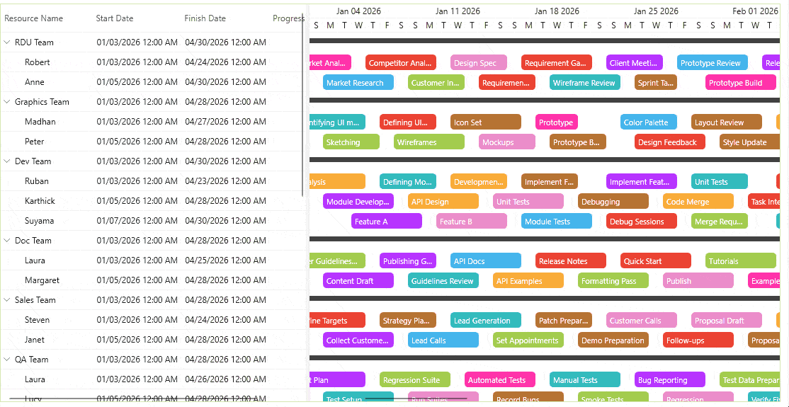

# Data Virtualization in WPF Gantt

The WPF Gantt control supports data virtualization to improve performance when working with large datasets. When virtualization is enabled, the control renders only the nodes that are currently visible in the viewport, reducing memory usage and improving scrolling responsiveness.

## How virtualization Works

Data virtualization in the Gantt control includes the following:

* **Row virtualization** – Only visible task rows (including inline/child tasks) are created during vertical scrolling.
* **Timeline virtualization** – Only the tasks within the visible timeline viewport are rendered during horizontal scrolling.

This approach ensures optimal performance even when working with thousands of tasks or long‑duration schedules.

## Enable Timeline Virtualization

You can enable timeline virtualization by setting the `EnableTimelineVirtualization` property to `true` in WPF `GanttControl`. 




 <syncfusion:GanttControl x:Name="Gantt"
                          ItemsSource="{Binding Tasks}"
                          EnableTimelineVirtualization="True">
    <syncfusion:GanttControl.TaskAttributeMapping>
        <syncfusion:TaskAttributeMapping TaskNameMapping="Name"
                                         StartDateMapping="StartDate"
                                         FinishDateMapping="FinishDate"
                                         ChildMapping="SubItems"
                                         ProgressMapping="Progress"
                                         InLineTaskMapping="InLineItems">
        </syncfusion:TaskAttributeMapping>
    </syncfusion:GanttControl.TaskAttributeMapping>
    <syncfusion:GanttControl.Resources>
        
    </syncfusion:GanttControl.Resources>
    <syncfusion:GanttControl.DataContext>
        <local:ViewModel/>
    </syncfusion:GanttControl.DataContext>
</syncfusion:GanttControl>




    this.Gantt.ItemsSource = new ViewModel().Tasks;
    this.Gantt.EnableTimelineVirtualization = true;

    // Task attribute mapping
    TaskAttributeMapping taskAttributeMapping = new TaskAttributeMapping();
    taskAttributeMapping.TaskNameMapping = "Name";
    taskAttributeMapping.StartDateMapping = "StartDate";
    taskAttributeMapping.ChildMapping = "SubItems";
    taskAttributeMapping.FinishDateMapping = "FinishDate";
    taskAttributeMapping.ProgressMapping="Progress";
    taskAttributeMapping.InLineTaskMapping = "InLineItems";
    this.Gantt.TaskAttributeMapping = taskAttributeMapping;




 public class Task : NotificationObject
 {
    private string _name;
    private DateTime _startDate;
    private DateTime _finishDate;
    private double _progress;
    ObservableCollection<Task> _subItems = new ObservableCollection<Task>();
    ObservableCollection<Task> _inLineItems = new ObservableCollection<Task>();

    /// 

    /// Initializes a new instance of the <see cref="Task"/> class.
    /// 

    public Task()
    {
        _subItems.CollectionChanged += this.OnItemsCollectionChanged;
        _inLineItems.CollectionChanged += this.OnItemsCollectionChanged;
    }

    /// 

    /// Gets or sets the name.
    /// 

    public string Name
    {
        get
        {
            return _name;
        }
        set
        {
            _name = value;
            this.RaisePropertyChanged(nameof(Name));
        }
    }

    /// 

    /// Gets or sets the start date.
    /// 

    public DateTime StartDate
    {
        get
        {
            return _startDate;
        }
        set
        {
            _startDate = value;
            this.RaisePropertyChanged(nameof(StartDate));
        }
    }

    /// 

    /// Gets or sets the finish date.
    /// 

    public DateTime FinishDate
    {
        get
        {
            return _finishDate;
        }
        set
        {
            _finishDate = value;
            this.RaisePropertyChanged(nameof(FinishDate));
        }
    }

    /// 

    /// Gets or sets the progress.
    /// 

    public double Progress
    {
        get
        {
            return Math.Round(_progress, 2);
        }
        set
        {
            _progress = value;
            this.RaisePropertyChanged(nameof(Progress));
        }
    }

    /// 

    /// Gets or sets the sub items.
    /// 

    public ObservableCollection<Task> SubItems
    {
        get
        {
            return _subItems;
        }
        set
        {
            _subItems = value;
            _subItems.CollectionChanged += OnItemsCollectionChanged;
            if (value.Count > 0)
            {
                _subItems.ToList().ForEach(n =>
                {
                    /// To listen the changes occuring in child task.
                    n.PropertyChanged += this.OnItemPropertyChanged;
                });

                this.UpdateDates();
            }

            this.RaisePropertyChanged(nameof(SubItems));
        }
    }

    /// 

    /// Gets or sets the in line items.
    /// 

    public ObservableCollection<Task> InLineItems
    {
        get
        {
            return _inLineItems;
        }
        set
        {
            _inLineItems = value;
            _inLineItems.CollectionChanged += OnItemsCollectionChanged;
            if (value.Count > 0)
            {
                _inLineItems.ToList().ForEach(n =>
                {
                    /// To listen the changes occuring in child task.
                    n.PropertyChanged += this.OnItemPropertyChanged;
                });

                this.UpdateDates();
            }

            this.RaisePropertyChanged(nameof(InLineItems));
        }
    }

    public void OnItemsCollectionChanged(object sender, System.Collections.Specialized.NotifyCollectionChangedEventArgs e)
    {
        if (e.Action == NotifyCollectionChangedAction.Add)
        {
            foreach (Task item in e.NewItems)
                item.PropertyChanged += this.OnItemPropertyChanged;
        }
        else
        {
            foreach (Task item in e.OldItems)
                item.PropertyChanged -= this.OnItemPropertyChanged;
        }

        this.UpdateDates();
    }
        
    public void OnItemPropertyChanged(object sender, PropertyChangedEventArgs e)
    {
        if (e.PropertyName != null && (e.PropertyName == "StartDate" || e.PropertyName == "FinishDate" || e.PropertyName == "Progress"))
        {
            this.UpdateDates();
        }
    }

    private void UpdateDates()
    {
        var tempCal = 0d;
        if (_subItems.Count > 0)
        {
            /// Updating the start and end date based on the chagne occur in the date of child task
            StartDate = _subItems.Select(c => c.StartDate).Min();
            FinishDate = _subItems.Select(c => c.FinishDate).Max();
            Progress = (_subItems.Aggregate(tempCal, (cur, task) => cur + task.Progress)) / _subItems.Count;
        }

        if (_inLineItems.Count > 0)
        {
            /// Updating the start and end date based on the chagne occur in the date of child task
            StartDate = _inLineItems.Select(c => c.StartDate).Min();
            FinishDate = _inLineItems.Select(c => c.FinishDate).Max();
            Progress = (_inLineItems.Aggregate(tempCal, (cur, task) => cur + task.Progress)) / _inLineItems.Count;
        }
    }
 }




public class ViewModel
{
    private ObservableCollection<Task> _tasks;

    /// 

    /// Initializes a new instance of the <see cref="ViewModel"/> class.
    /// 

    public ViewModel()
    {
        _tasks = GetTaskDetails();
    }

    /// 

    /// Gets or sets the task collection for all teams.
    /// 

    public ObservableCollection<Task> Tasks
    {
        get
        {
            return _tasks;
        }
        set
        {
            _tasks = value;
        }
    }

    public ObservableCollection<Task> GetTaskDetails()
    {
        ObservableCollection<Task> teams = new ObservableCollection<Task>();

        teams.Add(new Task() { Name = "RDU Team" });
        Task Person = new Task() { Name = "Robert" };
        Person.InLineItems.Add(new Task() { StartDate = new DateTime(2026, 1, 3), FinishDate = new DateTime(2026, 1, 7), Name = "Market Analysis", Progress = 10d }); 
        Person.InLineItems.Add(new Task() { StartDate = new DateTime(2026, 1, 8), FinishDate = new DateTime(2026, 1, 13), Name = "Competitor Analysis", Progress = 20d }); 
        Person.InLineItems.Add(new Task() { StartDate = new DateTime(2026, 1, 14), FinishDate = new DateTime(2026, 1, 18), Name = "Design Spec", Progress = 15d }); 
        Person.InLineItems.Add(new Task() { StartDate = new DateTime(2026, 1, 19), FinishDate = new DateTime(2026, 1, 24), Name = "Requirement Gathering", Progress = 5d }); 
        Person.InLineItems.Add(new Task() { StartDate = new DateTime(2026, 1, 25), FinishDate = new DateTime(2026, 1, 29), Name = "Client Meeting", Progress = 0d }); 
        Person.InLineItems.Add(new Task() { StartDate = new DateTime(2026, 1, 30), FinishDate = new DateTime(2026, 2, 4), Name = "Prototype Review", Progress = 30d }); 
        Person.InLineItems.Add(new Task() { StartDate = new DateTime(2026, 2, 5), FinishDate = new DateTime(2026, 2, 11), Name = "Release Planning", Progress = 40d }); 
        Person.InLineItems.Add(new Task() { StartDate = new DateTime(2026, 2, 12), FinishDate = new DateTime(2026, 2, 16), Name = "Sprint Kickoff", Progress = 10d }); 
        Person.InLineItems.Add(new Task() { StartDate = new DateTime(2026, 2, 17), FinishDate = new DateTime(2026, 2, 21), Name = "Email Campaign", Progress = 0d }); 
        Person.InLineItems.Add(new Task() { StartDate = new DateTime(2026, 2, 22), FinishDate = new DateTime(2026, 2, 26), Name = "Data Cleanup", Progress = 5d }); 
        Person.InLineItems.Add(new Task() { StartDate = new DateTime(2026, 2, 27), FinishDate = new DateTime(2026, 3, 3), Name = "Feature Prioritization", Progress = 25d }); 
        Person.InLineItems.Add(new Task() { StartDate = new DateTime(2026, 3, 4), FinishDate = new DateTime(2026, 3, 9), Name = "Usability Study", Progress = 35d }); 
        Person.InLineItems.Add(new Task() { StartDate = new DateTime(2026, 3, 10), FinishDate = new DateTime(2026, 3, 14), Name = "Risk Assessment", Progress = 0d }); 
        Person.InLineItems.Add(new Task() { StartDate = new DateTime(2026, 3, 15), FinishDate = new DateTime(2026, 3, 20), Name = "Budget Review", Progress = 10d }); 
        Person.InLineItems.Add(new Task() { StartDate = new DateTime(2026, 3, 21), FinishDate = new DateTime(2026, 3, 26), Name = "Stakeholder Update", Progress = 50d }); 
        Person.InLineItems.Add(new Task() { StartDate = new DateTime(2026, 3, 27), FinishDate = new DateTime(2026, 3, 30), Name = "Demo Preparation", Progress = 60d }); 
        Person.InLineItems.Add(new Task() { StartDate = new DateTime(2026, 4, 1), FinishDate = new DateTime(2026, 4, 6), Name = "Internal Review", Progress = 40d }); 
        Person.InLineItems.Add(new Task() { StartDate = new DateTime(2026, 4, 7), FinishDate = new DateTime(2026, 4, 12), Name = "Customer Feedback", Progress = 30d }); 
        Person.InLineItems.Add(new Task() { StartDate = new DateTime(2026, 4, 13), FinishDate = new DateTime(2026, 4, 18), Name = "Iteration Work", Progress = 20d }); 
        Person.InLineItems.Add(new Task() { StartDate = new DateTime(2026, 4, 19), FinishDate = new DateTime(2026, 4, 24), Name = "Backlog Grooming", Progress = 10d }); 
        teams[0].SubItems.Add(Person);

        Person = new Task() { Name = "Anne" };
        Person.InLineItems.Add(new Task() { StartDate = new DateTime(2026, 1, 5), FinishDate = new DateTime(2026, 1, 10), Name = "Market Research", Progress = 20d }); 
        Person.InLineItems.Add(new Task() { StartDate = new DateTime(2026, 1, 11), FinishDate = new DateTime(2026, 1, 15), Name = "Customer Interviews", Progress = 10d }); 
        Person.InLineItems.Add(new Task() { StartDate = new DateTime(2026, 1, 16), FinishDate = new DateTime(2026, 1, 20), Name = "Requirement Spec", Progress = 15d }); 
        Person.InLineItems.Add(new Task() { StartDate = new DateTime(2026, 1, 21), FinishDate = new DateTime(2026, 1, 26), Name = "Wireframe Review", Progress = 5d }); 
        Person.InLineItems.Add(new Task() { StartDate = new DateTime(2026, 1, 27), FinishDate = new DateTime(2026, 1, 30), Name = "Sprint Tasks", Progress = 0d }); 
        Person.InLineItems.Add(new Task() { StartDate = new DateTime(2026, 2, 1), FinishDate = new DateTime(2026, 2, 6), Name = "Prototype Build", Progress = 30d }); 
        Person.InLineItems.Add(new Task() { StartDate = new DateTime(2026, 2, 7), FinishDate = new DateTime(2026, 2, 10), Name = "UI Polish", Progress = 40d }); 
        Person.InLineItems.Add(new Task() { StartDate = new DateTime(2026, 2, 12), FinishDate = new DateTime(2026, 2, 17), Name = "Review Notes", Progress = 10d }); 
        Person.InLineItems.Add(new Task() { StartDate = new DateTime(2026, 2, 18), FinishDate = new DateTime(2026, 2, 23), Name = "Define Key Performance", Progress = 0d }); 
        Person.InLineItems.Add(new Task() { StartDate = new DateTime(2026, 2, 24), FinishDate = new DateTime(2026, 3, 1), Name = "Integration Plan", Progress = 5d }); 
        Person.InLineItems.Add(new Task() { StartDate = new DateTime(2026, 3, 2), FinishDate = new DateTime(2026, 3, 7), Name = "Feature Spec", Progress = 25d }); 
        Person.InLineItems.Add(new Task() { StartDate = new DateTime(2026, 3, 8), FinishDate = new DateTime(2026, 3, 12), Name = "User Testing", Progress = 35d }); 
        Person.InLineItems.Add(new Task() { StartDate = new DateTime(2026, 3, 14), FinishDate = new DateTime(2026, 3, 19), Name = "Data Validation", Progress = 0d }); 
        Person.InLineItems.Add(new Task() { StartDate = new DateTime(2026, 3, 20), FinishDate = new DateTime(2026, 3, 25), Name = "Budget Check", Progress = 10d }); 
        Person.InLineItems.Add(new Task() { StartDate = new DateTime(2026, 3, 26), FinishDate = new DateTime(2026, 3, 31), Name = "Stakeholder Call", Progress = 50d }); 
        Person.InLineItems.Add(new Task() { StartDate = new DateTime(2026, 4, 1), FinishDate = new DateTime(2026, 4, 6), Name = "Demo Walkthrough", Progress = 60d }); 
        Person.InLineItems.Add(new Task() { StartDate = new DateTime(2026, 4, 7), FinishDate = new DateTime(2026, 4, 11), Name = " Process Incoming Tickets", Progress = 40d }); 
        Person.InLineItems.Add(new Task() { StartDate = new DateTime(2026, 4, 13), FinishDate = new DateTime(2026, 4, 18), Name = "Feedback Update", Progress = 30d }); 
        Person.InLineItems.Add(new Task() { StartDate = new DateTime(2026, 4, 19), FinishDate = new DateTime(2026, 4, 25), Name = "Iteration Tasks", Progress = 20d }); 
        Person.InLineItems.Add(new Task() { StartDate = new DateTime(2026, 4, 25), FinishDate = new DateTime(2026, 4, 30), Name = "Release Preparation", Progress = 10d }); 
        teams[0].SubItems.Add(Person);

        teams.Add(new Task() { Name = "Graphics Team" });
        Person = new Task() { Name = "Madhan" };
        Person.InLineItems.Add(new Task() { StartDate = new DateTime(2026, 1, 3), FinishDate = new DateTime(2026, 1, 8), Name = "Identifying UI modules", Progress = 40d }); 
        Person.InLineItems.Add(new Task() { StartDate = new DateTime(2026, 1, 9), FinishDate = new DateTime(2026, 1, 13), Name = "Defining UI Design", Progress = 30d }); 
        Person.InLineItems.Add(new Task() { StartDate = new DateTime(2026, 1, 14), FinishDate = new DateTime(2026, 1, 19), Name = "Icon Set", Progress = 20d }); 
        Person.InLineItems.Add(new Task() { StartDate = new DateTime(2026, 1, 20), FinishDate = new DateTime(2026, 1, 23), Name = "Prototype", Progress = 25d }); 
        Person.InLineItems.Add(new Task() { StartDate = new DateTime(2026, 1, 26), FinishDate = new DateTime(2026, 1, 30), Name = "Color Palette", Progress = 10d }); 
        Person.InLineItems.Add(new Task() { StartDate = new DateTime(2026, 1, 31), FinishDate = new DateTime(2026, 2, 5), Name = "Layout Review", Progress = 5d }); 
        Person.InLineItems.Add(new Task() { StartDate = new DateTime(2026, 2, 6), FinishDate = new DateTime(2026, 2, 11), Name = "Animation Drafts", Progress = 15d }); 
        Person.InLineItems.Add(new Task() { StartDate = new DateTime(2026, 2, 12), FinishDate = new DateTime(2026, 2, 16), Name = "Style Guide", Progress = 35d }); 
        Person.InLineItems.Add(new Task() { StartDate = new DateTime(2026, 2, 17), FinishDate = new DateTime(2026, 2, 22), Name = "Asset Export", Progress = 50d }); 
        Person.InLineItems.Add(new Task() { StartDate = new DateTime(2026, 2, 23), FinishDate = new DateTime(2026, 2, 28), Name = "Design Handoff", Progress = 60d }); 
        Person.InLineItems.Add(new Task() { StartDate = new DateTime(2026, 3, 1), FinishDate = new DateTime(2026, 3, 5), Name = "UI Review", Progress = 45d }); 
        Person.InLineItems.Add(new Task() { StartDate = new DateTime(2026, 3, 7), FinishDate = new DateTime(2026, 3, 12), Name = "Accessibility Check", Progress = 20d }); 
        Person.InLineItems.Add(new Task() { StartDate = new DateTime(2026, 3, 13), FinishDate = new DateTime(2026, 3, 17), Name = "Retina Assets", Progress = 10d }); 
        Person.InLineItems.Add(new Task() { StartDate = new DateTime(2026, 3, 18), FinishDate = new DateTime(2026, 3, 22), Name = "Icon Revision", Progress = 30d }); 
        Person.InLineItems.Add(new Task() { StartDate = new DateTime(2026, 3, 24), FinishDate = new DateTime(2026, 3, 29), Name = "Prototype Testing", Progress = 40d }); 
        Person.InLineItems.Add(new Task() { StartDate = new DateTime(2026, 3, 30), FinishDate = new DateTime(2026, 4, 3), Name = "Final Mockups", Progress = 55d }); 
        Person.InLineItems.Add(new Task() { StartDate = new DateTime(2026, 4, 5), FinishDate = new DateTime(2026, 4, 10), Name = "Illustrations", Progress = 35d }); 
        Person.InLineItems.Add(new Task() { StartDate = new DateTime(2026, 4, 11), FinishDate = new DateTime(2026, 4, 16), Name = "Design QA", Progress = 25d }); 
        Person.InLineItems.Add(new Task() { StartDate = new DateTime(2026, 4, 17), FinishDate = new DateTime(2026, 4, 22), Name = "Packaging", Progress = 15d }); 
        Person.InLineItems.Add(new Task() { StartDate = new DateTime(2026, 4, 23), FinishDate = new DateTime(2026, 4, 27), Name = "Style Delivery", Progress = 10d }); 
        teams[1].SubItems.Add(Person);

        Person = new Task() { Name = "Peter" };
        Person.InLineItems.Add(new Task() { StartDate = new DateTime(2026, 1, 5), FinishDate = new DateTime(2026, 1, 9), Name = "Sketching", Progress = 35d }); 
        Person.InLineItems.Add(new Task() { StartDate = new DateTime(2026, 1, 10), FinishDate = new DateTime(2026, 1, 15), Name = "Wireframes", Progress = 25d }); 
        Person.InLineItems.Add(new Task() { StartDate = new DateTime(2026, 1, 16), FinishDate = new DateTime(2026, 1, 20), Name = "Mockups", Progress = 30d }); 
        Person.InLineItems.Add(new Task() { StartDate = new DateTime(2026, 1, 21), FinishDate = new DateTime(2026, 1, 25), Name = "Prototype Build", Progress = 20d }); 
        Person.InLineItems.Add(new Task() { StartDate = new DateTime(2026, 1, 27), FinishDate = new DateTime(2026, 2,1 ), Name = "Design Feedback", Progress = 10d }); 
        Person.InLineItems.Add(new Task() { StartDate = new DateTime(2026, 2, 2), FinishDate = new DateTime(2026, 2, 7), Name = "Style Update", Progress = 5d }); 
        Person.InLineItems.Add(new Task() { StartDate = new DateTime(2026, 2, 8), FinishDate = new DateTime(2026, 2, 12), Name = "Image Assets", Progress = 15d }); 
        Person.InLineItems.Add(new Task() { StartDate = new DateTime(2026, 2, 13), FinishDate = new DateTime(2026, 2, 18), Name = "Art Direction", Progress = 30d }); 
        Person.InLineItems.Add(new Task() { StartDate = new DateTime(2026, 2, 19), FinishDate = new DateTime(2026, 2, 23), Name = "Icon Work", Progress = 40d }); 
        Person.InLineItems.Add(new Task() { StartDate = new DateTime(2026, 2, 24), FinishDate = new DateTime(2026, 2, 28), Name = "Style QA", Progress = 50d }); 
        Person.InLineItems.Add(new Task() { StartDate = new DateTime(2026, 3, 2), FinishDate = new DateTime(2026, 3, 7), Name = "Design Handoff", Progress = 45d }); 
        Person.InLineItems.Add(new Task() { StartDate = new DateTime(2026, 3, 8), FinishDate = new DateTime(2026, 3, 12), Name = "Prototype Fixes", Progress = 30d }); 
        Person.InLineItems.Add(new Task() { StartDate = new DateTime(2026, 3, 13), FinishDate = new DateTime(2026, 3, 18), Name = "Colour Review", Progress = 20d }); 
        Person.InLineItems.Add(new Task() { StartDate = new DateTime(2026, 3, 19), FinishDate = new DateTime(2026, 3, 24), Name = "Export Assets", Progress = 10d }); 
        Person.InLineItems.Add(new Task() { StartDate = new DateTime(2026, 3, 25), FinishDate = new DateTime(2026, 3, 30), Name = "UI Polish", Progress = 60d }); 
        Person.InLineItems.Add(new Task() { StartDate = new DateTime(2026, 3, 31), FinishDate = new DateTime(2026, 4, 5), Name = "Final Review", Progress = 55d }); 
        Person.InLineItems.Add(new Task() { StartDate = new DateTime(2026, 4, 6), FinishDate = new DateTime(2026, 4, 10), Name = "Apply Design Style", Progress = 35d }); 
        Person.InLineItems.Add(new Task() { StartDate = new DateTime(2026, 4, 12), FinishDate = new DateTime(2026, 4, 17), Name = "Design Wrap-up", Progress = 25d }); 
        Person.InLineItems.Add(new Task() { StartDate = new DateTime(2026, 4, 18), FinishDate = new DateTime(2026, 4, 23), Name = "Archive Assets", Progress = 15d }); 
        Person.InLineItems.Add(new Task() { StartDate = new DateTime(2026, 4, 24), FinishDate = new DateTime(2026, 4, 28), Name = "Deliverables", Progress = 10d }); 
        teams[1].SubItems.Add(Person);

        teams.Add(new Task() { Name = "Dev Team" });
        Person = new Task() { Name = "Ruban" };
        Person.InLineItems.Add(new Task() { StartDate = new DateTime(2026, 1, 3), FinishDate = new DateTime(2026, 1, 8), Name = "Analysis", Progress = 30d }); 
        Person.InLineItems.Add(new Task() { StartDate = new DateTime(2026, 1, 9), FinishDate = new DateTime(2026, 1, 13), Name = "Defining Modules", Progress = 10d }); 
        Person.InLineItems.Add(new Task() { StartDate = new DateTime(2026, 1, 14), FinishDate = new DateTime(2026, 1, 18), Name = "Development Plan", Progress = 10d }); 
        Person.InLineItems.Add(new Task() { StartDate = new DateTime(2026, 1, 19), FinishDate = new DateTime(2026, 1, 23), Name = "Implement Feature A", Progress = 20d }); 
        Person.InLineItems.Add(new Task() { StartDate = new DateTime(2026, 1, 25), FinishDate = new DateTime(2026, 1, 30), Name = "Implement Feature B", Progress = 5d }); 
        Person.InLineItems.Add(new Task() { StartDate = new DateTime(2026, 1, 31), FinishDate = new DateTime(2026, 2, 4), Name = "Unit Tests", Progress = 15d }); 
        Person.InLineItems.Add(new Task() { StartDate = new DateTime(2026, 2, 6), FinishDate = new DateTime(2026, 2, 11), Name = "Integration", Progress = 25d }); 
        Person.InLineItems.Add(new Task() { StartDate = new DateTime(2026, 2, 12), FinishDate = new DateTime(2026, 2, 16), Name = "Code Review", Progress = 35d }); 
        Person.InLineItems.Add(new Task() { StartDate = new DateTime(2026, 2, 18), FinishDate = new DateTime(2026, 2, 23), Name = "Refactor", Progress = 40d }); 
        Person.InLineItems.Add(new Task() { StartDate = new DateTime(2026, 2, 24), FinishDate = new DateTime(2026, 2, 28), Name = "Bug Fixing", Progress = 45d }); 
        Person.InLineItems.Add(new Task() { StartDate = new DateTime(2026, 3, 2), FinishDate = new DateTime(2026, 3, 7), Name = "Performance Work", Progress = 30d }); 
        Person.InLineItems.Add(new Task() { StartDate = new DateTime(2026, 3, 8), FinishDate = new DateTime(2026, 3, 13), Name = "Database Tasks", Progress = 10d }); 
        Person.InLineItems.Add(new Task() { StartDate = new DateTime(2026, 3, 14), FinishDate = new DateTime(2026, 3, 18), Name = "Configure Pipeline", Progress = 20d }); 
        Person.InLineItems.Add(new Task() { StartDate = new DateTime(2026, 3, 19), FinishDate = new DateTime(2026, 3, 24), Name = "Packaging", Progress = 5d }); 
        Person.InLineItems.Add(new Task() { StartDate = new DateTime(2026, 3, 25), FinishDate = new DateTime(2026, 3, 30), Name = "Deploy", Progress = 50d }); 
        Person.InLineItems.Add(new Task() { StartDate = new DateTime(2026, 3, 31), FinishDate = new DateTime(2026, 4, 4), Name = "Smoke Test", Progress = 60d }); 
        Person.InLineItems.Add(new Task() { StartDate = new DateTime(2026, 4, 6), FinishDate = new DateTime(2026, 4, 11), Name = "Hotfixes", Progress = 40d }); 
        Person.InLineItems.Add(new Task() { StartDate = new DateTime(2026, 4, 12), FinishDate = new DateTime(2026, 4, 17), Name = "Feature Cleanup", Progress = 30d }); 
        Person.InLineItems.Add(new Task() { StartDate = new DateTime(2026, 4, 18), FinishDate = new DateTime(2026, 4, 23), Name = "Documentation", Progress = 20d }); 
        teams[2].SubItems.Add(Person);

        Person = new Task() { Name = "Karthick" };
        Person.InLineItems.Add(new Task() { StartDate = new DateTime(2026, 1, 5), FinishDate = new DateTime(2026, 1, 10), Name = "Module Development", Progress = 10d }); 
        Person.InLineItems.Add(new Task() { StartDate = new DateTime(2026, 1, 11), FinishDate = new DateTime(2026, 1, 16), Name = "API Design", Progress = 5d }); 
        Person.InLineItems.Add(new Task() { StartDate = new DateTime(2026, 1, 17), FinishDate = new DateTime(2026, 1, 22), Name = "Unit Tests", Progress = 15d }); 
        Person.InLineItems.Add(new Task() { StartDate = new DateTime(2026, 1, 23), FinishDate = new DateTime(2026, 1, 28), Name = "Debugging", Progress = 20d }); 
        Person.InLineItems.Add(new Task() { StartDate = new DateTime(2026, 1, 29), FinishDate = new DateTime(2026, 2, 3), Name = "Code Merge", Progress = 0d }); 
        Person.InLineItems.Add(new Task() { StartDate = new DateTime(2026, 2, 4), FinishDate = new DateTime(2026, 2, 8), Name = "Task Integration", Progress = 30d }); 
        Person.InLineItems.Add(new Task() { StartDate = new DateTime(2026, 2, 10), FinishDate = new DateTime(2026, 2, 15), Name = "Dependency Update", Progress = 40d }); 
        Person.InLineItems.Add(new Task() { StartDate = new DateTime(2026, 2, 16), FinishDate = new DateTime(2026, 2, 20), Name = "Code Review", Progress = 20d }); 
        Person.InLineItems.Add(new Task() { StartDate = new DateTime(2026, 2, 22), FinishDate = new DateTime(2026, 2, 27), Name = "Refine Interfaces", Progress = 10d }); 
        Person.InLineItems.Add(new Task() { StartDate = new DateTime(2026, 2, 28), FinishDate = new DateTime(2026, 3, 5), Name = "Integration Tests", Progress = 15d }); 
        Person.InLineItems.Add(new Task() { StartDate = new DateTime(2026, 3, 6), FinishDate = new DateTime(2026, 3, 11), Name = "Performance Tests", Progress = 25d }); 
        Person.InLineItems.Add(new Task() { StartDate = new DateTime(2026, 3, 12), FinishDate = new DateTime(2026, 3, 17), Name = "Optimize Code", Progress = 35d }); 
        Person.InLineItems.Add(new Task() { StartDate = new DateTime(2026, 3, 18), FinishDate = new DateTime(2026, 3, 23), Name = "Prioritize Reported Bugs", Progress = 5d }); 
        Person.InLineItems.Add(new Task() { StartDate = new DateTime(2026, 3, 24), FinishDate = new DateTime(2026, 3, 29), Name = "Hotfix Planning", Progress = 10d }); 
        Person.InLineItems.Add(new Task() { StartDate = new DateTime(2026, 3, 30), FinishDate = new DateTime(2026, 4, 4), Name = "Deploy Assist", Progress = 40d }); 
        Person.InLineItems.Add(new Task() { StartDate = new DateTime(2026, 4, 5), FinishDate = new DateTime(2026, 4, 9), Name = "Support Tasks", Progress = 45d }); 
        Person.InLineItems.Add(new Task() { StartDate = new DateTime(2026, 4, 11), FinishDate = new DateTime(2026, 4, 16), Name = "Refactor", Progress = 30d }); 
        Person.InLineItems.Add(new Task() { StartDate = new DateTime(2026, 4, 17), FinishDate = new DateTime(2026, 4, 22), Name = "Documentation", Progress = 20d }); 
        Person.InLineItems.Add(new Task() { StartDate = new DateTime(2026, 4, 23), FinishDate = new DateTime(2026, 4, 28), Name = "Feature Wrap-up", Progress = 10d }); 
        teams[2].SubItems.Add(Person);

        Person = new Task() { Name = "Suyama" }; 
        Person.InLineItems.Add(new Task() { StartDate = new DateTime(2026, 1, 7), FinishDate = new DateTime(2026, 1, 12), Name = "Feature A", Progress = 5d }); 
        Person.InLineItems.Add(new Task() { StartDate = new DateTime(2026, 1, 13), FinishDate = new DateTime(2026, 1, 18), Name = "Feature B", Progress = 0d }); 
        Person.InLineItems.Add(new Task() { StartDate = new DateTime(2026, 1, 19), FinishDate = new DateTime(2026, 1, 24), Name = "Module Tests", Progress = 10d }); 
        Person.InLineItems.Add(new Task() { StartDate = new DateTime(2026, 1, 25), FinishDate = new DateTime(2026, 1, 30), Name = "Debug Sessions", Progress = 15d }); 
        Person.InLineItems.Add(new Task() { StartDate = new DateTime(2026, 1, 31), FinishDate = new DateTime(2026, 2, 4), Name = "Merge Requests", Progress = 0d }); 
        Person.InLineItems.Add(new Task() { StartDate = new DateTime(2026, 2, 6), FinishDate = new DateTime(2026, 2, 11), Name = "Code Cleanup", Progress = 20d }); 
        Person.InLineItems.Add(new Task() { StartDate = new DateTime(2026, 2, 12), FinishDate = new DateTime(2026, 2, 17), Name = "Security Fix", Progress = 25d }); 
        Person.InLineItems.Add(new Task() { StartDate = new DateTime(2026, 2, 18), FinishDate = new DateTime(2026, 2, 23), Name = "Integration", Progress = 35d }); 
        Person.InLineItems.Add(new Task() { StartDate = new DateTime(2026, 2, 24), FinishDate = new DateTime(2026, 3, 1), Name = "Refinement", Progress = 40d }); 
        Person.InLineItems.Add(new Task() { StartDate = new DateTime(2026, 3, 2), FinishDate = new DateTime(2026, 3, 7), Name = "Patch Work", Progress = 45d }); 
        Person.InLineItems.Add(new Task() { StartDate = new DateTime(2026, 3, 8), FinishDate = new DateTime(2026, 3, 13), Name = "CI Troubleshoot", Progress = 30d }); 
        Person.InLineItems.Add(new Task() { StartDate = new DateTime(2026, 3, 14), FinishDate = new DateTime(2026, 3, 19), Name = "Performance Fix", Progress = 20d }); 
        Person.InLineItems.Add(new Task() { StartDate = new DateTime(2026, 3, 20), FinishDate = new DateTime(2026, 3, 25), Name = "Hotfix", Progress = 10d }); 
        Person.InLineItems.Add(new Task() { StartDate = new DateTime(2026, 3, 26), FinishDate = new DateTime(2026, 3, 31), Name = "Deploy Help", Progress = 15d }); 
        Person.InLineItems.Add(new Task() { StartDate = new DateTime(2026, 4, 1), FinishDate = new DateTime(2026, 4, 6), Name = "Support Work", Progress = 50d }); 
        Person.InLineItems.Add(new Task() { StartDate = new DateTime(2026, 4, 7), FinishDate = new DateTime(2026, 4, 12), Name = "Regression Tests", Progress = 55d }); 
        Person.InLineItems.Add(new Task() { StartDate = new DateTime(2026, 4, 13), FinishDate = new DateTime(2026, 4, 18), Name = "Bug Triage", Progress = 40d }); 
        Person.InLineItems.Add(new Task() { StartDate = new DateTime(2026, 4, 19), FinishDate = new DateTime(2026, 4, 24), Name = "Patch Release", Progress = 30d }); 
        Person.InLineItems.Add(new Task() { StartDate = new DateTime(2026, 4, 25), FinishDate = new DateTime(2026, 4, 30), Name = "Maintenance", Progress = 20d }); 
        teams[2].SubItems.Add(Person);

        teams.Add(new Task() { Name = "Doc Team" });
        Person = new Task() { Name = "Laura" };
        Person.InLineItems.Add(new Task() { StartDate = new DateTime(2026, 1, 3), FinishDate = new DateTime(2026, 1, 8), Name = "User Guidelines Development", Progress = 10d }); 
        Person.InLineItems.Add(new Task() { StartDate = new DateTime(2026, 1, 9), FinishDate = new DateTime(2026, 1, 13), Name = "Publishing Guidelines", Progress = 10d }); 
        Person.InLineItems.Add(new Task() { StartDate = new DateTime(2026, 1, 14), FinishDate = new DateTime(2026, 1, 19), Name = "API Docs", Progress = 5d }); 
        Person.InLineItems.Add(new Task() { StartDate = new DateTime(2026, 1, 20), FinishDate = new DateTime(2026, 1, 25), Name = "Release Notes", Progress = 0d }); 
        Person.InLineItems.Add(new Task() { StartDate = new DateTime(2026, 1, 26), FinishDate = new DateTime(2026, 1, 31), Name = "Quick Start", Progress = 20d }); 
        Person.InLineItems.Add(new Task() { StartDate = new DateTime(2026, 2, 1), FinishDate = new DateTime(2026, 2, 6), Name = "Tutorials", Progress = 30d }); 
        Person.InLineItems.Add(new Task() { StartDate = new DateTime(2026, 2, 7), FinishDate = new DateTime(2026, 2, 12), Name = "Examples", Progress = 40d }); 
        Person.InLineItems.Add(new Task() { StartDate = new DateTime(2026, 2, 13), FinishDate = new DateTime(2026, 2, 16), Name = "Editing", Progress = 15d }); 
        Person.InLineItems.Add(new Task() { StartDate = new DateTime(2026, 2, 19), FinishDate = new DateTime(2026, 2, 24), Name = "Localization", Progress = 10d }); 
        Person.InLineItems.Add(new Task() { StartDate = new DateTime(2026, 2, 25), FinishDate = new DateTime(2026, 3, 2), Name = "Formatting", Progress = 5d }); 
        Person.InLineItems.Add(new Task() { StartDate = new DateTime(2026, 3, 3), FinishDate = new DateTime(2026, 3, 8), Name = "Publish Checks", Progress = 25d }); 
        Person.InLineItems.Add(new Task() { StartDate = new DateTime(2026, 3, 9), FinishDate = new DateTime(2026, 3, 14), Name = "Content Review", Progress = 35d }); 
        Person.InLineItems.Add(new Task() { StartDate = new DateTime(2026, 3, 15), FinishDate = new DateTime(2026, 3, 20), Name = "Image Licensing", Progress = 0d }); 
        Person.InLineItems.Add(new Task() { StartDate = new DateTime(2026, 3, 21), FinishDate = new DateTime(2026, 3, 26), Name = "Indexing", Progress = 10d }); 
        Person.InLineItems.Add(new Task() { StartDate = new DateTime(2026, 3, 27), FinishDate = new DateTime(2026, 4, 1), Name = "Content Quality Check", Progress = 50d }); 
        Person.InLineItems.Add(new Task() { StartDate = new DateTime(2026, 4, 2), FinishDate = new DateTime(2026, 4, 7), Name = "Publishing", Progress = 60d }); 
        Person.InLineItems.Add(new Task() { StartDate = new DateTime(2026, 4, 8), FinishDate = new DateTime(2026, 4, 13), Name = "Format Fixes", Progress = 40d }); 
        Person.InLineItems.Add(new Task() { StartDate = new DateTime(2026, 4, 14), FinishDate = new DateTime(2026, 4, 19), Name = "Archive Documents", Progress = 30d }); 
        Person.InLineItems.Add(new Task() { StartDate = new DateTime(2026, 4, 20), FinishDate = new DateTime(2026, 4, 25), Name = "Document Updates", Progress = 20d }); 
        teams[3].SubItems.Add(Person);

        Person = new Task() { Name = "Margaret" };
        Person.InLineItems.Add(new Task() { StartDate = new DateTime(2026, 1, 5), FinishDate = new DateTime(2026, 1, 10), Name = "Content Draft", Progress = 10d });
        Person.InLineItems.Add(new Task() { StartDate = new DateTime(2026, 1, 11), FinishDate = new DateTime(2026, 1, 16), Name = "Guidelines Review", Progress = 15d });
        Person.InLineItems.Add(new Task() { StartDate = new DateTime(2026, 1, 17), FinishDate = new DateTime(2026, 1, 22), Name = "API Examples", Progress = 20d });
        Person.InLineItems.Add(new Task() { StartDate = new DateTime(2026, 1, 23), FinishDate = new DateTime(2026, 1, 28), Name = "Formatting Pass", Progress = 5d });
        Person.InLineItems.Add(new Task() { StartDate = new DateTime(2026, 1, 29), FinishDate = new DateTime(2026, 2, 3), Name = "Publish", Progress = 0d });
        Person.InLineItems.Add(new Task() { StartDate = new DateTime(2026, 2, 4), FinishDate = new DateTime(2026, 2, 9), Name = "Examples Update", Progress = 30d });
        Person.InLineItems.Add(new Task() { StartDate = new DateTime(2026, 2, 10), FinishDate = new DateTime(2026, 2, 15), Name = "Index Update", Progress = 40d });
        Person.InLineItems.Add(new Task() { StartDate = new DateTime(2026, 2, 16), FinishDate = new DateTime(2026, 2, 21), Name = "Content Quality Check", Progress = 10d });
        Person.InLineItems.Add(new Task() { StartDate = new DateTime(2026, 2, 22), FinishDate = new DateTime(2026, 2, 27), Name = "Localization Check", Progress = 0d });
        Person.InLineItems.Add(new Task() { StartDate = new DateTime(2026, 2, 28), FinishDate = new DateTime(2026, 3, 5), Name = "Publish Fixes", Progress = 5d });
        Person.InLineItems.Add(new Task() { StartDate = new DateTime(2026, 3, 6), FinishDate = new DateTime(2026, 3, 11), Name = "Image Preparation", Progress = 25d });
        Person.InLineItems.Add(new Task() { StartDate = new DateTime(2026, 3, 12), FinishDate = new DateTime(2026, 3, 17), Name = "Style Pass", Progress = 35d });
        Person.InLineItems.Add(new Task() { StartDate = new DateTime(2026, 3, 18), FinishDate = new DateTime(2026, 3, 23), Name = "QA Check", Progress = 0d });
        Person.InLineItems.Add(new Task() { StartDate = new DateTime(2026, 3, 24), FinishDate = new DateTime(2026, 3, 29), Name = "Indexing", Progress = 10d });
        Person.InLineItems.Add(new Task() { StartDate = new DateTime(2026, 3, 30), FinishDate = new DateTime(2026, 4, 4), Name = "Publish Preparation", Progress = 50d });
        Person.InLineItems.Add(new Task() { StartDate = new DateTime(2026, 4, 5), FinishDate = new DateTime(2026, 4, 10), Name = "Final Edits", Progress = 60d });
        Person.InLineItems.Add(new Task() { StartDate = new DateTime(2026, 4, 11), FinishDate = new DateTime(2026, 4, 16), Name = "Archive", Progress = 40d });
        Person.InLineItems.Add(new Task() { StartDate = new DateTime(2026, 4, 17), FinishDate = new DateTime(2026, 4, 23), Name = "Document Audit", Progress = 30d });
        Person.InLineItems.Add(new Task() { StartDate = new DateTime(2026, 4, 23), FinishDate = new DateTime(2026, 4, 28), Name = "Refactor Guid", Progress = 20d });
        teams[3].SubItems.Add(Person);

        teams.Add(new Task() { Name = "Sales Team" });
        Person = new Task() { Name = "Steven" }; 
        Person.InLineItems.Add(new Task() { StartDate = new DateTime(2026, 1, 3), FinishDate = new DateTime(2026, 1, 8), Name = "Define Targets", Progress = 80d });
        Person.InLineItems.Add(new Task() { StartDate = new DateTime(2026, 1, 9), FinishDate = new DateTime(2026, 1, 13), Name = "Strategy Planning", Progress = 65d });
        Person.InLineItems.Add(new Task() { StartDate = new DateTime(2026, 1, 14), FinishDate = new DateTime(2026, 1, 19), Name = "Lead Generation", Progress = 50d });
        Person.InLineItems.Add(new Task() { StartDate = new DateTime(2026, 1, 20), FinishDate = new DateTime(2026, 1, 24), Name = "Patch Preparation", Progress = 30d });
        Person.InLineItems.Add(new Task() { StartDate = new DateTime(2026, 1, 25), FinishDate = new DateTime(2026, 1, 30), Name = "Customer Calls", Progress = 45d });
        Person.InLineItems.Add(new Task() { StartDate = new DateTime(2026, 1, 31), FinishDate = new DateTime(2026, 2, 5), Name = "Proposal Draft", Progress = 20d });
        Person.InLineItems.Add(new Task() { StartDate = new DateTime(2026, 2, 6), FinishDate = new DateTime(2026, 2, 11), Name = "Negotiation", Progress = 10d });
        Person.InLineItems.Add(new Task() { StartDate = new DateTime(2026, 2, 12), FinishDate = new DateTime(2026, 2, 17), Name = "Contract Preparation", Progress = 5d });
        Person.InLineItems.Add(new Task() { StartDate = new DateTime(2026, 2, 18), FinishDate = new DateTime(2026, 2, 23), Name = "Demo Scheduling", Progress = 25d });
        Person.InLineItems.Add(new Task() { StartDate = new DateTime(2026, 2, 24), FinishDate = new DateTime(2026, 3, 1), Name = "Follow Ups", Progress = 30d });
        Person.InLineItems.Add(new Task() { StartDate = new DateTime(2026, 3, 2), FinishDate = new DateTime(2026, 3, 7), Name = "Pipeline Review", Progress = 40d });
        Person.InLineItems.Add(new Task() { StartDate = new DateTime(2026, 3, 8), FinishDate = new DateTime(2026, 3, 13), Name = "Sales Training", Progress = 10d });
        Person.InLineItems.Add(new Task() { StartDate = new DateTime(2026, 3, 14), FinishDate = new DateTime(2026, 3, 19), Name = "CRM Update", Progress = 5d });
        Person.InLineItems.Add(new Task() { StartDate = new DateTime(2026, 3, 20), FinishDate = new DateTime(2026, 3, 25), Name = "Lead Qualification", Progress = 15d });
        Person.InLineItems.Add(new Task() { StartDate = new DateTime(2026, 3, 26), FinishDate = new DateTime(2026, 3, 31), Name = "Client Onboard", Progress = 50d });
        Person.InLineItems.Add(new Task() { StartDate = new DateTime(2026, 4, 1), FinishDate = new DateTime(2026, 4, 6), Name = "Sales Report", Progress = 60d });
        Person.InLineItems.Add(new Task() { StartDate = new DateTime(2026, 4, 7), FinishDate = new DateTime(2026, 4, 12), Name = "Prospect Research", Progress = 35d });
        Person.InLineItems.Add(new Task() { StartDate = new DateTime(2026, 4, 13), FinishDate = new DateTime(2026, 4, 18), Name = "Demo Follow-up", Progress = 25d });
        Person.InLineItems.Add(new Task() { StartDate = new DateTime(2026, 4, 19), FinishDate = new DateTime(2026, 4, 24), Name = "Contract Sign-off", Progress = 20d });
        teams[4].SubItems.Add(Person);

        Person = new Task() { Name = "Janet" };
        Person.InLineItems.Add(new Task() { StartDate = new DateTime(2026, 1, 5), FinishDate = new DateTime(2026, 1, 10), Name = "Collect Customers list", Progress = 50d });
        Person.InLineItems.Add(new Task() { StartDate = new DateTime(2026, 1, 11), FinishDate = new DateTime(2026, 1, 16), Name = "Lead Calls", Progress = 45d });
        Person.InLineItems.Add(new Task() { StartDate = new DateTime(2026, 1, 17), FinishDate = new DateTime(2026, 1, 22), Name = "Set Appointments", Progress = 30d });
        Person.InLineItems.Add(new Task() { StartDate = new DateTime(2026, 1, 23), FinishDate = new DateTime(2026, 1, 28), Name = "Demo Preparation", Progress = 20d });
        Person.InLineItems.Add(new Task() { StartDate = new DateTime(2026, 1, 29), FinishDate = new DateTime(2026, 2, 3), Name = "Follow-ups", Progress = 25d });
        Person.InLineItems.Add(new Task() { StartDate = new DateTime(2026, 2, 4), FinishDate = new DateTime(2026, 2, 9), Name = "Proposal", Progress = 15d });
        Person.InLineItems.Add(new Task() { StartDate = new DateTime(2026, 2, 10), FinishDate = new DateTime(2026, 2, 15), Name = "Contract Draft", Progress = 10d });
        Person.InLineItems.Add(new Task() { StartDate = new DateTime(2026, 2, 16), FinishDate = new DateTime(2026, 2, 21), Name = "Schedule Demos", Progress = 5d });
        Person.InLineItems.Add(new Task() { StartDate = new DateTime(2026, 2, 22), FinishDate = new DateTime(2026, 2, 27), Name = "CRM Update", Progress = 20d });
        Person.InLineItems.Add(new Task() { StartDate = new DateTime(2026, 2, 28), FinishDate = new DateTime(2026, 3, 5), Name = "Client Research", Progress = 25d });
        Person.InLineItems.Add(new Task() { StartDate = new DateTime(2026, 3, 6), FinishDate = new DateTime(2026, 3, 11), Name = "Pre-sales Support", Progress = 30d });
        Person.InLineItems.Add(new Task() { StartDate = new DateTime(2026, 3, 12), FinishDate = new DateTime(2026, 3, 17), Name = "Pipeline Cleanup", Progress = 10d });
        Person.InLineItems.Add(new Task() { StartDate = new DateTime(2026, 3, 18), FinishDate = new DateTime(2026, 3, 23), Name = "Proposal Review", Progress = 15d });
        Person.InLineItems.Add(new Task() { StartDate = new DateTime(2026, 3, 24), FinishDate = new DateTime(2026, 3, 29), Name = "Client Training Preparation", Progress = 5d });
        Person.InLineItems.Add(new Task() { StartDate = new DateTime(2026, 3, 30), FinishDate = new DateTime(2026, 4, 4), Name = "Onboarding Plan", Progress = 50d });
        Person.InLineItems.Add(new Task() { StartDate = new DateTime(2026, 4, 5), FinishDate = new DateTime(2026, 4, 10), Name = "Sales Metrics", Progress = 60d });
        Person.InLineItems.Add(new Task() { StartDate = new DateTime(2026, 4, 11), FinishDate = new DateTime(2026, 4, 16), Name = "Lead Followups", Progress = 35d });
        Person.InLineItems.Add(new Task() { StartDate = new DateTime(2026, 4, 17), FinishDate = new DateTime(2026, 4, 23), Name = "Deal Close", Progress = 25d });
        Person.InLineItems.Add(new Task() { StartDate = new DateTime(2026, 4, 23), FinishDate = new DateTime(2026, 4, 28), Name = "Post-sale Check", Progress = 20d });
        teams[4].SubItems.Add(Person);

        teams.Add(new Task() { Name = "QA Team" });
        Person = new Task() { Name = "Laura" }; 
        Person.InLineItems.Add(new Task() { StartDate = new DateTime(2026, 1, 3), FinishDate = new DateTime(2026, 1, 8), Name = "Test Plan", Progress = 10d });
        Person.InLineItems.Add(new Task() { StartDate = new DateTime(2026, 1, 9), FinishDate = new DateTime(2026, 1, 14), Name = "Regression Suite", Progress = 20d });
        Person.InLineItems.Add(new Task() { StartDate = new DateTime(2026, 1, 15), FinishDate = new DateTime(2026, 1, 20), Name = "Automated Tests", Progress = 15d });
        Person.InLineItems.Add(new Task() { StartDate = new DateTime(2026, 1, 21), FinishDate = new DateTime(2026, 1, 26), Name = "Manual Tests", Progress = 5d });
        Person.InLineItems.Add(new Task() { StartDate = new DateTime(2026, 1, 27), FinishDate = new DateTime(2026, 2, 1), Name = "Bug Reporting", Progress = 0d });
        Person.InLineItems.Add(new Task() { StartDate = new DateTime(2026, 2, 2), FinishDate = new DateTime(2026, 2, 7), Name = "Test Data Preparation", Progress = 30d });
        Person.InLineItems.Add(new Task() { StartDate = new DateTime(2026, 2, 8), FinishDate = new DateTime(2026, 2, 13), Name = "Smoke Tests", Progress = 40d });
        Person.InLineItems.Add(new Task() { StartDate = new DateTime(2026, 2, 14), FinishDate = new DateTime(2026, 2, 19), Name = "Performance Tests", Progress = 10d });
        Person.InLineItems.Add(new Task() { StartDate = new DateTime(2026, 2, 20), FinishDate = new DateTime(2026, 2, 25), Name = "Security Tests", Progress = 0d });
        Person.InLineItems.Add(new Task() { StartDate = new DateTime(2026, 2, 26), FinishDate = new DateTime(2026, 3, 3), Name = "API Tests", Progress = 5d });
        Person.InLineItems.Add(new Task() { StartDate = new DateTime(2026, 3, 4), FinishDate = new DateTime(2026, 3, 9), Name = "UI Tests", Progress = 25d });
        Person.InLineItems.Add(new Task() { StartDate = new DateTime(2026, 3, 10), FinishDate = new DateTime(2026, 3, 15), Name = "Test Automation", Progress = 35d });
        Person.InLineItems.Add(new Task() { StartDate = new DateTime(2026, 3, 16), FinishDate = new DateTime(2026, 3, 21), Name = "Test Operations", Progress = 0d });
        Person.InLineItems.Add(new Task() { StartDate = new DateTime(2026, 3, 22), FinishDate = new DateTime(2026, 3, 27), Name = "Release Tests", Progress = 10d });
        Person.InLineItems.Add(new Task() { StartDate = new DateTime(2026, 3, 28), FinishDate = new DateTime(2026, 4, 2), Name = "Bug Verification", Progress = 50d });
        Person.InLineItems.Add(new Task() { StartDate = new DateTime(2026, 4, 3), FinishDate = new DateTime(2026, 4, 8), Name = "Test Reports", Progress = 60d });
        Person.InLineItems.Add(new Task() { StartDate = new DateTime(2026, 4, 9), FinishDate = new DateTime(2026, 4, 14), Name = "Regression Run", Progress = 40d });
        Person.InLineItems.Add(new Task() { StartDate = new DateTime(2026, 4, 15), FinishDate = new DateTime(2026, 4, 20), Name = "Exploratory", Progress = 30d });
        Person.InLineItems.Add(new Task() { StartDate = new DateTime(2026, 4, 21), FinishDate = new DateTime(2026, 4, 26), Name = "Automation Fixes", Progress = 20d });
        teams[5].SubItems.Add(Person);

        Person = new Task() { Name = "Lucy" };
        Person.InLineItems.Add(new Task() { StartDate = new DateTime(2026, 1, 5), FinishDate = new DateTime(2026, 1, 10), Name = "Test Setup", Progress = 5d });
        Person.InLineItems.Add(new Task() { StartDate = new DateTime(2026, 1, 11), FinishDate = new DateTime(2026, 1, 16), Name = "Run Suites", Progress = 15d });
        Person.InLineItems.Add(new Task() { StartDate = new DateTime(2026, 1, 17), FinishDate = new DateTime(2026, 1, 22), Name = "Record Bugs", Progress = 10d });
        Person.InLineItems.Add(new Task() { StartDate = new DateTime(2026, 1, 23), FinishDate = new DateTime(2026, 1, 28), Name = "Smoke Tests", Progress = 20d });
        Person.InLineItems.Add(new Task() { StartDate = new DateTime(2026, 1, 29), FinishDate = new DateTime(2026, 2, 3), Name = "Regression", Progress = 0d });
        Person.InLineItems.Add(new Task() { StartDate = new DateTime(2026, 2, 4), FinishDate = new DateTime(2026, 2, 9), Name = "Verify Fixes", Progress = 30d });
        Person.InLineItems.Add(new Task() { StartDate = new DateTime(2026, 2, 10), FinishDate = new DateTime(2026, 2, 15), Name = "Automation", Progress = 40d });
        Person.InLineItems.Add(new Task() { StartDate = new DateTime(2026, 2, 16), FinishDate = new DateTime(2026, 2, 20), Name = "Test Logs", Progress = 10d });
        Person.InLineItems.Add(new Task() { StartDate = new DateTime(2026, 2, 22), FinishDate = new DateTime(2026, 2, 27), Name = "Report Issues", Progress = 0d });
        Person.InLineItems.Add(new Task() { StartDate = new DateTime(2026, 2, 28), FinishDate = new DateTime(2026, 3, 5), Name = "Retry Suites", Progress = 5d });
        Person.InLineItems.Add(new Task() { StartDate = new DateTime(2026, 3, 6), FinishDate = new DateTime(2026, 3, 11), Name = "Functional Test", Progress = 25d });
        Person.InLineItems.Add(new Task() { StartDate = new DateTime(2026, 3, 12), FinishDate = new DateTime(2026, 3, 17), Name = "CI Tests", Progress = 35d });
        Person.InLineItems.Add(new Task() { StartDate = new DateTime(2026, 3, 18), FinishDate = new DateTime(2026, 3, 23), Name = "Test Improvements", Progress = 0d });
        Person.InLineItems.Add(new Task() { StartDate = new DateTime(2026, 3, 24), FinishDate = new DateTime(2026, 3, 29), Name = "Data Preparation", Progress = 10d });
        Person.InLineItems.Add(new Task() { StartDate = new DateTime(2026, 3, 30), FinishDate = new DateTime(2026, 4, 4), Name = "Final Verification", Progress = 50d });
        Person.InLineItems.Add(new Task() { StartDate = new DateTime(2026, 4, 5), FinishDate = new DateTime(2026, 4, 10), Name = "Test Summary", Progress = 60d });
        Person.InLineItems.Add(new Task() { StartDate = new DateTime(2026, 4, 11), FinishDate = new DateTime(2026, 4, 16), Name = "Regression Update", Progress = 40d });
        Person.InLineItems.Add(new Task() { StartDate = new DateTime(2026, 4, 17), FinishDate = new DateTime(2026, 4, 22), Name = "Issue Triage", Progress = 30d });
        Person.InLineItems.Add(new Task() { StartDate = new DateTime(2026, 4, 23), FinishDate = new DateTime(2026, 4, 28), Name = "Automation Fixes", Progress = 20d });
        teams[5].SubItems.Add(Person);

        teams.Add(new Task() { Name = "Support Team" });
        Person = new Task() { Name = "Alex" };
        Person.InLineItems.Add(new Task() { StartDate = new DateTime(2026, 1, 3), FinishDate = new DateTime(2026, 1, 8), Name = "Ticket Triage", Progress = 5d });
        Person.InLineItems.Add(new Task() { StartDate = new DateTime(2026, 1, 9), FinishDate = new DateTime(2026, 1, 14), Name = "Customer Response", Progress = 10d });
        Person.InLineItems.Add(new Task() { StartDate = new DateTime(2026, 1, 15), FinishDate = new DateTime(2026, 1, 20), Name = "Troubleshoot", Progress = 15d });
        Person.InLineItems.Add(new Task() { StartDate = new DateTime(2026, 1, 21), FinishDate = new DateTime(2026, 1, 26), Name = "Escalations", Progress = 20d });
        Person.InLineItems.Add(new Task() { StartDate = new DateTime(2026, 1, 27), FinishDate = new DateTime(2026, 2, 1), Name = "Knowledge Base", Progress = 0d });
        Person.InLineItems.Add(new Task() { StartDate = new DateTime(2026, 2, 2), FinishDate = new DateTime(2026, 2, 7), Name = "Follow-ups", Progress = 30d });
        Person.InLineItems.Add(new Task() { StartDate = new DateTime(2026, 2, 8), FinishDate = new DateTime(2026, 2, 13), Name = "Remote Assist", Progress = 40d });
        Person.InLineItems.Add(new Task() { StartDate = new DateTime(2026, 2, 14), FinishDate = new DateTime(2026, 2, 19), Name = "Issue Logging", Progress = 10d });
        Person.InLineItems.Add(new Task() { StartDate = new DateTime(2026, 2, 20), FinishDate = new DateTime(2026, 2, 25), Name = "Customer Check-in", Progress = 0d });
        Person.InLineItems.Add(new Task() { StartDate = new DateTime(2026, 2, 26), FinishDate = new DateTime(2026, 3, 3), Name = "Patch Support", Progress = 5d });
        Person.InLineItems.Add(new Task() { StartDate = new DateTime(2026, 3, 4), FinishDate = new DateTime(2026, 3, 9), Name = "SLA Tracking", Progress = 25d });
        Person.InLineItems.Add(new Task() { StartDate = new DateTime(2026, 3, 10), FinishDate = new DateTime(2026, 3, 15), Name = "Account Setup", Progress = 35d });
        Person.InLineItems.Add(new Task() { StartDate = new DateTime(2026, 3, 16), FinishDate = new DateTime(2026, 3, 21), Name = "Incident Review", Progress = 0d });
        Person.InLineItems.Add(new Task() { StartDate = new DateTime(2026, 3, 22), FinishDate = new DateTime(2026, 3, 25), Name = "Knowledge Updates", Progress = 10d });
        Person.InLineItems.Add(new Task() { StartDate = new DateTime(2026, 3, 28), FinishDate = new DateTime(2026, 4, 2), Name = "Customer Training", Progress = 50d });
        Person.InLineItems.Add(new Task() { StartDate = new DateTime(2026, 4, 3), FinishDate = new DateTime(2026, 4, 8), Name = "Support Metrics", Progress = 60d });
        Person.InLineItems.Add(new Task() { StartDate = new DateTime(2026, 4, 9), FinishDate = new DateTime(2026, 4, 14), Name = "Ticket Close", Progress = 40d });
        Person.InLineItems.Add(new Task() { StartDate = new DateTime(2026, 4, 15), FinishDate = new DateTime(2026, 4, 20), Name = "Follow-up Calls", Progress = 30d });
        Person.InLineItems.Add(new Task() { StartDate = new DateTime(2026, 4, 21), FinishDate = new DateTime(2026, 4, 26), Name = "Issue Escalation", Progress = 20d });
        teams[6].SubItems.Add(Person);

        Person = new Task() { Name = "Clara" };
        Person.InLineItems.Add(new Task() { StartDate = new DateTime(2026, 1, 5), FinishDate = new DateTime(2026, 1, 10), Name = "Triage", Progress = 5d });
        Person.InLineItems.Add(new Task() { StartDate = new DateTime(2026, 1, 11), FinishDate = new DateTime(2026, 1, 16), Name = "Customer Emails", Progress = 15d });
        Person.InLineItems.Add(new Task() { StartDate = new DateTime(2026, 1, 17), FinishDate = new DateTime(2026, 1, 22), Name = "Remote Help", Progress = 10d });
        Person.InLineItems.Add(new Task() { StartDate = new DateTime(2026, 1, 23), FinishDate = new DateTime(2026, 1, 28), Name = "Portal Updates", Progress = 20d });
        Person.InLineItems.Add(new Task() { StartDate = new DateTime(2026, 1, 29), FinishDate = new DateTime(2026, 2, 3), Name = "Documents Update", Progress = 0d });
        Person.InLineItems.Add(new Task() { StartDate = new DateTime(2026, 2, 4), FinishDate = new DateTime(2026, 2, 9), Name = "Follow Up", Progress = 30d });
        Person.InLineItems.Add(new Task() { StartDate = new DateTime(2026, 2, 10), FinishDate = new DateTime(2026, 2, 15), Name = "Escalation Work", Progress = 40d });
        Person.InLineItems.Add(new Task() { StartDate = new DateTime(2026, 2, 16), FinishDate = new DateTime(2026, 2, 21), Name = "Status Calls", Progress = 10d });
        Person.InLineItems.Add(new Task() { StartDate = new DateTime(2026, 2, 22), FinishDate = new DateTime(2026, 2, 27), Name = "Ticket Close", Progress = 0d });
        Person.InLineItems.Add(new Task() { StartDate = new DateTime(2026, 2, 28), FinishDate = new DateTime(2026, 3, 5), Name = "Patch Assist", Progress = 5d });
        Person.InLineItems.Add(new Task() { StartDate = new DateTime(2026, 3, 6), FinishDate = new DateTime(2026, 3, 11), Name = "Help Docs", Progress = 25d });
        Person.InLineItems.Add(new Task() { StartDate = new DateTime(2026, 3, 12), FinishDate = new DateTime(2026, 3, 17), Name = "Account Follow-up", Progress = 35d });
        Person.InLineItems.Add(new Task() { StartDate = new DateTime(2026, 3, 18), FinishDate = new DateTime(2026, 3, 23), Name = "SLA Review", Progress = 0d });
        Person.InLineItems.Add(new Task() { StartDate = new DateTime(2026, 3, 24), FinishDate = new DateTime(2026, 3, 29), Name = "Knowledge Sync", Progress = 10d });
        Person.InLineItems.Add(new Task() { StartDate = new DateTime(2026, 3, 30), FinishDate = new DateTime(2026, 4, 4), Name = "Customer Handoff", Progress = 50d });
        Person.InLineItems.Add(new Task() { StartDate = new DateTime(2026, 4, 5), FinishDate = new DateTime(2026, 4, 10), Name = "Support Reporting", Progress = 60d });
        Person.InLineItems.Add(new Task() { StartDate = new DateTime(2026, 4, 11), FinishDate = new DateTime(2026, 4, 16), Name = "Ticket Review", Progress = 40d });
        Person.InLineItems.Add(new Task() { StartDate = new DateTime(2026, 4, 17), FinishDate = new DateTime(2026, 4, 22), Name = "Follow-ups", Progress = 30d });
        Person.InLineItems.Add(new Task() { StartDate = new DateTime(2026, 4, 23), FinishDate = new DateTime(2026, 4, 28), Name = "Escalation Work", Progress = 20d });
        teams[6].SubItems.Add(Person);

        teams.Add(new Task() { Name = "Operations Team" });
        Person = new Task() { Name = "Jackson" };
        Person.InLineItems.Add(new Task() { StartDate = new DateTime(2026, 1, 3), FinishDate = new DateTime(2026, 1, 8), Name = "Deploy Plan", Progress = 10d });
        Person.InLineItems.Add(new Task() { StartDate = new DateTime(2026, 1, 9), FinishDate = new DateTime(2026, 1, 14), Name = "Environment Setup", Progress = 20d });
        Person.InLineItems.Add(new Task() { StartDate = new DateTime(2026, 1, 15), FinishDate = new DateTime(2026, 1, 20), Name = "Monitoring Config", Progress = 15d });
        Person.InLineItems.Add(new Task() { StartDate = new DateTime(2026, 1, 21), FinishDate = new DateTime(2026, 1, 26), Name = "Backup Tests", Progress = 5d });
        Person.InLineItems.Add(new Task() { StartDate = new DateTime(2026, 1, 27), FinishDate = new DateTime(2026, 2, 1), Name = "Runbook Update", Progress = 0d });
        Person.InLineItems.Add(new Task() { StartDate = new DateTime(2026, 2, 2), FinishDate = new DateTime(2026, 2, 7), Name = "Scripting", Progress = 30d });
        Person.InLineItems.Add(new Task() { StartDate = new DateTime(2026, 2, 8), FinishDate = new DateTime(2026, 2, 13), Name = "Capacity Plan", Progress = 40d });
        Person.InLineItems.Add(new Task() { StartDate = new DateTime(2026, 2, 14), FinishDate = new DateTime(2026, 2, 19), Name = "Uptime Review", Progress = 10d });
        Person.InLineItems.Add(new Task() { StartDate = new DateTime(2026, 2, 20), FinishDate = new DateTime(2026, 2, 25), Name = "Incident Drill", Progress = 0d });
        Person.InLineItems.Add(new Task() { StartDate = new DateTime(2026, 2, 26), FinishDate = new DateTime(2026, 3, 3), Name = "Deployment", Progress = 5d });
        Person.InLineItems.Add(new Task() { StartDate = new DateTime(2026, 3, 4), FinishDate = new DateTime(2026, 3, 9), Name = "Maintenance Window", Progress = 25d });
        Person.InLineItems.Add(new Task() { StartDate = new DateTime(2026, 3, 10), FinishDate = new DateTime(2026, 3, 15), Name = "Log Rotation", Progress = 35d });
        Person.InLineItems.Add(new Task() { StartDate = new DateTime(2026, 3, 16), FinishDate = new DateTime(2026, 3, 21), Name = "Patch Window", Progress = 0d });
        Person.InLineItems.Add(new Task() { StartDate = new DateTime(2026, 3, 22), FinishDate = new DateTime(2026, 3, 27), Name = "Capacity Test", Progress = 10d });
        Person.InLineItems.Add(new Task() { StartDate = new DateTime(2026, 3, 28), FinishDate = new DateTime(2026, 4, 4), Name = "Rollback Drill", Progress = 50d });
        Person.InLineItems.Add(new Task() { StartDate = new DateTime(2026, 4, 3), FinishDate = new DateTime(2026, 4, 8), Name = "Operation Report", Progress = 60d });
        Person.InLineItems.Add(new Task() { StartDate = new DateTime(2026, 4, 9), FinishDate = new DateTime(2026, 4, 14), Name = "System Audit", Progress = 40d });
        Person.InLineItems.Add(new Task() { StartDate = new DateTime(2026, 4, 15), FinishDate = new DateTime(2026, 4, 20), Name = "Runbook Test", Progress = 30d });
        Person.InLineItems.Add(new Task() { StartDate = new DateTime(2026, 4, 21), FinishDate = new DateTime(2026, 4, 25), Name = "Operational Improvements", Progress = 20d });
        teams[7].SubItems.Add(Person);

        Person = new Task() { Name = "Liam" };
        Person.InLineItems.Add(new Task() { StartDate = new DateTime(2026, 1, 5), FinishDate = new DateTime(2026, 1, 10), Name = "Infra Preparation", Progress = 5d });
        Person.InLineItems.Add(new Task() { StartDate = new DateTime(2026, 1, 11), FinishDate = new DateTime(2026, 1, 16), Name = "Monitor Setup", Progress = 15d });
        Person.InLineItems.Add(new Task() { StartDate = new DateTime(2026, 1, 17), FinishDate = new DateTime(2026, 1, 22), Name = "Backup and Restore Test", Progress = 10d });
        Person.InLineItems.Add(new Task() { StartDate = new DateTime(2026, 1, 23), FinishDate = new DateTime(2026, 1, 28), Name = "Run Checks", Progress = 20d });
        Person.InLineItems.Add(new Task() { StartDate = new DateTime(2026, 1, 29), FinishDate = new DateTime(2026, 2, 3), Name = "Patch", Progress = 0d });
        Person.InLineItems.Add(new Task() { StartDate = new DateTime(2026, 2, 4), FinishDate = new DateTime(2026, 2, 9), Name = "Capacity Plan", Progress = 30d });
        Person.InLineItems.Add(new Task() { StartDate = new DateTime(2026, 2, 10), FinishDate = new DateTime(2026, 2, 15), Name = "Optimize", Progress = 40d });
        Person.InLineItems.Add(new Task() { StartDate = new DateTime(2026, 2, 16), FinishDate = new DateTime(2026, 2, 21), Name = "Operations Meeting", Progress = 10d });
        Person.InLineItems.Add(new Task() { StartDate = new DateTime(2026, 2, 22), FinishDate = new DateTime(2026, 2, 27), Name = "Incident Response", Progress = 0d });
        Person.InLineItems.Add(new Task() { StartDate = new DateTime(2026, 2, 28), FinishDate = new DateTime(2026, 3, 5), Name = "Maintenance", Progress = 5d });
        Person.InLineItems.Add(new Task() { StartDate = new DateTime(2026, 3, 6), FinishDate = new DateTime(2026, 3, 11), Name = "Service Tests", Progress = 25d });
        Person.InLineItems.Add(new Task() { StartDate = new DateTime(2026, 3, 12), FinishDate = new DateTime(2026, 3, 17), Name = "Audit", Progress = 35d });
        Person.InLineItems.Add(new Task() { StartDate = new DateTime(2026, 3, 18), FinishDate = new DateTime(2026, 3, 23), Name = "Operations Tasks", Progress = 0d });
        Person.InLineItems.Add(new Task() { StartDate = new DateTime(2026, 3, 24), FinishDate = new DateTime(2026, 3, 29), Name = "Runbook Update", Progress = 10d });
        Person.InLineItems.Add(new Task() { StartDate = new DateTime(2026, 3, 30), FinishDate = new DateTime(2026, 4, 4), Name = "Deploy Support", Progress = 50d });
        Person.InLineItems.Add(new Task() { StartDate = new DateTime(2026, 4, 5), FinishDate = new DateTime(2026, 4, 10), Name = "Operations Metrics", Progress = 60d });
        Person.InLineItems.Add(new Task() { StartDate = new DateTime(2026, 4, 11), FinishDate = new DateTime(2026, 4, 16), Name = "Infra Review", Progress = 40d });
        Person.InLineItems.Add(new Task() { StartDate = new DateTime(2026, 4, 17), FinishDate = new DateTime(2026, 4, 22), Name = "Tune Systems", Progress = 30d });
        Person.InLineItems.Add(new Task() { StartDate = new DateTime(2026, 4, 23), FinishDate = new DateTime(2026, 4, 28), Name = "Operations Fixes", Progress = 20d });
        teams[7].SubItems.Add(Person);

        teams.Add(new Task() { Name = "Design Team" });
        Person = new Task() { Name = "Nora" };
        Person.InLineItems.Add(new Task() { StartDate = new DateTime(2026, 1, 3), FinishDate = new DateTime(2026, 1, 8), Name = "Sketch", Progress = 10d });
        Person.InLineItems.Add(new Task() { StartDate = new DateTime(2026, 1, 9), FinishDate = new DateTime(2026, 1, 14), Name = "Mockup", Progress = 20d });
        Person.InLineItems.Add(new Task() { StartDate = new DateTime(2026, 1, 15), FinishDate = new DateTime(2026, 1, 20), Name = "Prototype", Progress = 15d });
        Person.InLineItems.Add(new Task() { StartDate = new DateTime(2026, 1, 21), FinishDate = new DateTime(2026, 1, 26), Name = "Icon Design", Progress = 5d });
        Person.InLineItems.Add(new Task() { StartDate = new DateTime(2026, 1, 27), FinishDate = new DateTime(2026, 2, 1), Name = "UX Flow", Progress = 0d });
        Person.InLineItems.Add(new Task() { StartDate = new DateTime(2026, 2, 2), FinishDate = new DateTime(2026, 2, 7), Name = "Typography", Progress = 30d });
        Person.InLineItems.Add(new Task() { StartDate = new DateTime(2026, 2, 8), FinishDate = new DateTime(2026, 2, 13), Name = "Illustration", Progress = 40d });
        Person.InLineItems.Add(new Task() { StartDate = new DateTime(2026, 2, 14), FinishDate = new DateTime(2026, 2, 19), Name = "Style Guidelines", Progress = 10d });
        Person.InLineItems.Add(new Task() { StartDate = new DateTime(2026, 2, 20), FinishDate = new DateTime(2026, 2, 25), Name = "Prototype Test", Progress = 0d });
        Person.InLineItems.Add(new Task() { StartDate = new DateTime(2026, 2, 26), FinishDate = new DateTime(2026, 3, 3), Name = "Feedback", Progress = 5d });
        Person.InLineItems.Add(new Task() { StartDate = new DateTime(2026, 3, 4), FinishDate = new DateTime(2026, 3, 9), Name = "Layout", Progress = 25d });
        Person.InLineItems.Add(new Task() { StartDate = new DateTime(2026, 3, 10), FinishDate = new DateTime(2026, 3, 15), Name = "Handoff", Progress = 35d });
        Person.InLineItems.Add(new Task() { StartDate = new DateTime(2026, 3, 16), FinishDate = new DateTime(2026, 3, 21), Name = "Asset Preparation", Progress = 0d });
        Person.InLineItems.Add(new Task() { StartDate = new DateTime(2026, 3, 22), FinishDate = new DateTime(2026, 3, 27), Name = "Review", Progress = 10d });
        Person.InLineItems.Add(new Task() { StartDate = new DateTime(2026, 3, 28), FinishDate = new DateTime(2026, 4, 2), Name = "Polish", Progress = 50d });
        Person.InLineItems.Add(new Task() { StartDate = new DateTime(2026, 4, 3), FinishDate = new DateTime(2026, 4, 8), Name = "Finalize", Progress = 60d });
        Person.InLineItems.Add(new Task() { StartDate = new DateTime(2026, 4, 9), FinishDate = new DateTime(2026, 4, 14), Name = "Deliver", Progress = 40d });
        Person.InLineItems.Add(new Task() { StartDate = new DateTime(2026, 4, 15), FinishDate = new DateTime(2026, 4, 20), Name = "Archive", Progress = 30d });
        Person.InLineItems.Add(new Task() { StartDate = new DateTime(2026, 4, 21), FinishDate = new DateTime(2026, 4, 26), Name = "Iterate", Progress = 20d });
        teams[8].SubItems.Add(Person);

        Person = new Task() { Name = "Sebastian" };
        Person.InLineItems.Add(new Task() { StartDate = new DateTime(2026, 1, 5), FinishDate = new DateTime(2026, 1, 10), Name = "Wireframe", Progress = 15d });
        Person.InLineItems.Add(new Task() { StartDate = new DateTime(2026, 1, 11), FinishDate = new DateTime(2026, 1, 16), Name = "Low Fidelity Mockups", Progress = 10d });
        Person.InLineItems.Add(new Task() { StartDate = new DateTime(2026, 1, 17), FinishDate = new DateTime(2026, 1, 22), Name = "High Fidelity Mockup", Progress = 20d });
        Person.InLineItems.Add(new Task() { StartDate = new DateTime(2026, 1, 23), FinishDate = new DateTime(2026, 1, 28), Name = "Prototype", Progress = 5d });
        Person.InLineItems.Add(new Task() { StartDate = new DateTime(2026, 1, 29), FinishDate = new DateTime(2026, 2, 3), Name = "Usability Test", Progress = 0d });
        Person.InLineItems.Add(new Task() { StartDate = new DateTime(2026, 2, 4), FinishDate = new DateTime(2026, 2, 9), Name = "Spec Update", Progress = 30d });
        Person.InLineItems.Add(new Task() { StartDate = new DateTime(2026, 2, 10), FinishDate = new DateTime(2026, 2, 15), Name = "Icon Set", Progress = 40d });
        Person.InLineItems.Add(new Task() { StartDate = new DateTime(2026, 2, 16), FinishDate = new DateTime(2026, 2, 21), Name = "Design Review", Progress = 10d });
        Person.InLineItems.Add(new Task() { StartDate = new DateTime(2026, 2, 22), FinishDate = new DateTime(2026, 2, 27), Name = "Style Pass", Progress = 0d });
        Person.InLineItems.Add(new Task() { StartDate = new DateTime(2026, 2, 28), FinishDate = new DateTime(2026, 3, 5), Name = "Deliverables", Progress = 5d });
        Person.InLineItems.Add(new Task() { StartDate = new DateTime(2026, 3, 6), FinishDate = new DateTime(2026, 3, 11), Name = "Prototype Fix", Progress = 25d });
        Person.InLineItems.Add(new Task() { StartDate = new DateTime(2026, 3, 12), FinishDate = new DateTime(2026, 3, 17), Name = "Handoff", Progress = 35d });
        Person.InLineItems.Add(new Task() { StartDate = new DateTime(2026, 3, 18), FinishDate = new DateTime(2026, 3, 23), Name = "Final Touches", Progress = 0d });
        Person.InLineItems.Add(new Task() { StartDate = new DateTime(2026, 3, 24), FinishDate = new DateTime(2026, 3, 29), Name = "Export", Progress = 10d });
        Person.InLineItems.Add(new Task() { StartDate = new DateTime(2026, 3, 30), FinishDate = new DateTime(2026, 4, 4), Name = "Final Checks", Progress = 50d });
        Person.InLineItems.Add(new Task() { StartDate = new DateTime(2026, 4, 5), FinishDate = new DateTime(2026, 4, 10), Name = "Delivery", Progress = 60d });
        Person.InLineItems.Add(new Task() { StartDate = new DateTime(2026, 4, 11), FinishDate = new DateTime(2026, 4, 16), Name = "Design QA", Progress = 40d });
        Person.InLineItems.Add(new Task() { StartDate = new DateTime(2026, 4, 17), FinishDate = new DateTime(2026, 4, 23), Name = "Archive", Progress = 30d });
        Person.InLineItems.Add(new Task() { StartDate = new DateTime(2026, 4, 23), FinishDate = new DateTime(2026, 4, 28), Name = "Iterate", Progress = 20d });
        teams[8].SubItems.Add(Person);

        teams.Add(new Task() { Name = "Research Team" });
        Person = new Task() { Name = "Tye" };
        Person.InLineItems.Add(new Task() { StartDate = new DateTime(2026, 1, 3), FinishDate = new DateTime(2026, 1, 8), Name = "Literature Review", Progress = 10d });
        Person.InLineItems.Add(new Task() { StartDate = new DateTime(2026, 1, 9), FinishDate = new DateTime(2026, 1, 14), Name = "Survey", Progress = 20d });
        Person.InLineItems.Add(new Task() { StartDate = new DateTime(2026, 1, 15), FinishDate = new DateTime(2026, 1, 20), Name = "Prototype Study", Progress = 15d });
        Person.InLineItems.Add(new Task() { StartDate = new DateTime(2026, 1, 21), FinishDate = new DateTime(2026, 1, 26), Name = "Data Collection", Progress = 5d });
        Person.InLineItems.Add(new Task() { StartDate = new DateTime(2026, 1, 27), FinishDate = new DateTime(2026, 2, 1), Name = "Analysis", Progress = 0d });
        Person.InLineItems.Add(new Task() { StartDate = new DateTime(2026, 2, 2), FinishDate = new DateTime(2026, 2, 7), Name = "Report Draft", Progress = 30d });
        Person.InLineItems.Add(new Task() { StartDate = new DateTime(2026, 2, 8), FinishDate = new DateTime(2026, 2, 13), Name = "Peer Review", Progress = 40d });
        Person.InLineItems.Add(new Task() { StartDate = new DateTime(2026, 2, 14), FinishDate = new DateTime(2026, 2, 19), Name = "Findings", Progress = 10d });
        Person.InLineItems.Add(new Task() { StartDate = new DateTime(2026, 2, 20), FinishDate = new DateTime(2026, 2, 25), Name = "Validation", Progress = 0d });
        Person.InLineItems.Add(new Task() { StartDate = new DateTime(2026, 2, 26), FinishDate = new DateTime(2026, 3, 3), Name = "Experiments", Progress = 5d });
        Person.InLineItems.Add(new Task() { StartDate = new DateTime(2026, 3, 4), FinishDate = new DateTime(2026, 3, 9), Name = "Data Analysis", Progress = 25d });
        Person.InLineItems.Add(new Task() { StartDate = new DateTime(2026, 3, 10), FinishDate = new DateTime(2026, 3, 15), Name = "Modeling", Progress = 35d });
        Person.InLineItems.Add(new Task() { StartDate = new DateTime(2026, 3, 16), FinishDate = new DateTime(2026, 3, 21), Name = "Report Revision", Progress = 0d });
        Person.InLineItems.Add(new Task() { StartDate = new DateTime(2026, 3, 22), FinishDate = new DateTime(2026, 3, 27), Name = "Presentation Preparation", Progress = 10d });
        Person.InLineItems.Add(new Task() { StartDate = new DateTime(2026, 3, 28), FinishDate = new DateTime(2026, 4, 2), Name = "Publish Findings", Progress = 50d });
        Person.InLineItems.Add(new Task() { StartDate = new DateTime(2026, 4, 3), FinishDate = new DateTime(2026, 4, 8), Name = "Follow-up Study", Progress = 60d });
        Person.InLineItems.Add(new Task() { StartDate = new DateTime(2026, 4, 9), FinishDate = new DateTime(2026, 4, 14), Name = "Data Cleanup", Progress = 40d });
        Person.InLineItems.Add(new Task() { StartDate = new DateTime(2026, 4, 15), FinishDate = new DateTime(2026, 4, 20), Name = "Review Source References", Progress = 30d });
        Person.InLineItems.Add(new Task() { StartDate = new DateTime(2026, 4, 21), FinishDate = new DateTime(2026, 4, 26), Name = "Peer Edits", Progress = 20d });
        teams[9].SubItems.Add(Person);

        Person = new Task() { Name = "Emilie" };
        Person.InLineItems.Add(new Task() { StartDate = new DateTime(2026, 1, 5), FinishDate = new DateTime(2026, 1, 10), Name = "Scoping", Progress = 5d });
        Person.InLineItems.Add(new Task() { StartDate = new DateTime(2026, 1, 11), FinishDate = new DateTime(2026, 1, 16), Name = "Survey Preparation", Progress = 15d });
        Person.InLineItems.Add(new Task() { StartDate = new DateTime(2026, 1, 17), FinishDate = new DateTime(2026, 1, 22), Name = "Data Collection", Progress = 10d });
        Person.InLineItems.Add(new Task() { StartDate = new DateTime(2026, 1, 23), FinishDate = new DateTime(2026, 1, 28), Name = "Field Work", Progress = 20d });
        Person.InLineItems.Add(new Task() { StartDate = new DateTime(2026, 1, 29), FinishDate = new DateTime(2026, 2, 3), Name = "Lab Tests", Progress = 0d });
        Person.InLineItems.Add(new Task() { StartDate = new DateTime(2026, 2, 4), FinishDate = new DateTime(2026, 2, 9), Name = "Analysis", Progress = 30d });
        Person.InLineItems.Add(new Task() { StartDate = new DateTime(2026, 2, 10), FinishDate = new DateTime(2026, 2, 15), Name = "Draft Report", Progress = 40d });
        Person.InLineItems.Add(new Task() { StartDate = new DateTime(2026, 2, 16), FinishDate = new DateTime(2026, 2, 21), Name = "Review", Progress = 10d });
        Person.InLineItems.Add(new Task() { StartDate = new DateTime(2026, 2, 22), FinishDate = new DateTime(2026, 2, 27), Name = "Data Preparation", Progress = 0d });
        Person.InLineItems.Add(new Task() { StartDate = new DateTime(2026, 2, 28), FinishDate = new DateTime(2026, 3, 5), Name = "Model Tests", Progress = 5d });
        Person.InLineItems.Add(new Task() { StartDate = new DateTime(2026, 3, 6), FinishDate = new DateTime(2026, 3, 11), Name = "Refine", Progress = 25d });
        Person.InLineItems.Add(new Task() { StartDate = new DateTime(2026, 3, 12), FinishDate = new DateTime(2026, 3, 17), Name = "Peer Review", Progress = 35d });
        Person.InLineItems.Add(new Task() { StartDate = new DateTime(2026, 3, 18), FinishDate = new DateTime(2026, 3, 23), Name = "Finalize", Progress = 0d });
        Person.InLineItems.Add(new Task() { StartDate = new DateTime(2026, 3, 24), FinishDate = new DateTime(2026, 3, 29), Name = "Presentation", Progress = 10d });
        Person.InLineItems.Add(new Task() { StartDate = new DateTime(2026, 3, 30), FinishDate = new DateTime(2026, 4, 4), Name = "Publish", Progress = 50d });
        Person.InLineItems.Add(new Task() { StartDate = new DateTime(2026, 4, 5), FinishDate = new DateTime(2026, 4, 10), Name = "Follow-up", Progress = 60d });
        Person.InLineItems.Add(new Task() { StartDate = new DateTime(2026, 4, 11), FinishDate = new DateTime(2026, 4, 16), Name = "Data Clean", Progress = 40d });
        Person.InLineItems.Add(new Task() { StartDate = new DateTime(2026, 4, 17), FinishDate = new DateTime(2026, 4, 22), Name = "Archive Results", Progress = 30d });
        Person.InLineItems.Add(new Task() { StartDate = new DateTime(2026, 4, 23), FinishDate = new DateTime(2026, 4, 27), Name = "Wrap-up", Progress = 10d });
        teams[9].SubItems.Add(Person);

        teams.Add(new Task() { Name = "HR Team" });
        Person = new Task() { Name = "Andrew" };
        Person.InLineItems.Add(new Task() { StartDate = new DateTime(2026, 1, 3), FinishDate = new DateTime(2026, 1, 8), Name = "Recruitment", Progress = 10d });
        Person.InLineItems.Add(new Task() { StartDate = new DateTime(2026, 1, 9), FinishDate = new DateTime(2026, 1, 14), Name = "Interviews", Progress = 20d });
        Person.InLineItems.Add(new Task() { StartDate = new DateTime(2026, 1, 15), FinishDate = new DateTime(2026, 1, 20), Name = "Onboarding", Progress = 15d });
        Person.InLineItems.Add(new Task() { StartDate = new DateTime(2026, 1, 21), FinishDate = new DateTime(2026, 1, 26), Name = "Payroll", Progress = 5d });
        Person.InLineItems.Add(new Task() { StartDate = new DateTime(2026, 1, 27), FinishDate = new DateTime(2026, 2, 1), Name = "Policy Update", Progress = 0d });
        Person.InLineItems.Add(new Task() { StartDate = new DateTime(2026, 2, 2), FinishDate = new DateTime(2026, 2, 7), Name = "Training", Progress = 30d });
        Person.InLineItems.Add(new Task() { StartDate = new DateTime(2026, 2, 8), FinishDate = new DateTime(2026, 2, 13), Name = "Benefits Review", Progress = 40d });
        Person.InLineItems.Add(new Task() { StartDate = new DateTime(2026, 2, 14), FinishDate = new DateTime(2026, 2, 19), Name = "Employee Survey", Progress = 10d });
        Person.InLineItems.Add(new Task() { StartDate = new DateTime(2026, 2, 20), FinishDate = new DateTime(2026, 2, 25), Name = "Onboard Docs", Progress = 0d });
        Person.InLineItems.Add(new Task() { StartDate = new DateTime(2026, 2, 26), FinishDate = new DateTime(2026, 3, 3), Name = "Policy Training", Progress = 5d });
        Person.InLineItems.Add(new Task() { StartDate = new DateTime(2026, 3, 4), FinishDate = new DateTime(2026, 3, 9), Name = "Review Interviews", Progress = 25d });
        Person.InLineItems.Add(new Task() { StartDate = new DateTime(2026, 3, 10), FinishDate = new DateTime(2026, 3, 15), Name = "HR Operation", Progress = 35d });
        Person.InLineItems.Add(new Task() { StartDate = new DateTime(2026, 3, 16), FinishDate = new DateTime(2026, 3, 21), Name = "Salary Review", Progress = 0d });
        Person.InLineItems.Add(new Task() { StartDate = new DateTime(2026, 3, 22), FinishDate = new DateTime(2026, 3, 27), Name = "Benefits Update", Progress = 10d });
        Person.InLineItems.Add(new Task() { StartDate = new DateTime(2026, 3, 28), FinishDate = new DateTime(2026, 4, 2), Name = "Onboard Batch", Progress = 50d });
        Person.InLineItems.Add(new Task() { StartDate = new DateTime(2026, 4, 3), FinishDate = new DateTime(2026, 4, 8), Name = "HR Metrics", Progress = 60d });
        Person.InLineItems.Add(new Task() { StartDate = new DateTime(2026, 4, 9), FinishDate = new DateTime(2026, 4, 14), Name = "Exit Interviews", Progress = 40d });
        Person.InLineItems.Add(new Task() { StartDate = new DateTime(2026, 4, 15), FinishDate = new DateTime(2026, 4, 20), Name = "Staff Review", Progress = 30d });
        Person.InLineItems.Add(new Task() { StartDate = new DateTime(2026, 4, 21), FinishDate = new DateTime(2026, 4, 26), Name = "Training Plan", Progress = 20d });
        teams[10].SubItems.Add(Person);

        Person = new Task() { Name = "Laura" };
        Person.InLineItems.Add(new Task() { StartDate = new DateTime(2026, 1, 5), FinishDate = new DateTime(2026, 1, 10), Name = "Candidate Sourcing", Progress = 5d });
        Person.InLineItems.Add(new Task() { StartDate = new DateTime(2026, 1, 11), FinishDate = new DateTime(2026, 1, 16), Name = "Interview Coordination", Progress = 15d });
        Person.InLineItems.Add(new Task() { StartDate = new DateTime(2026, 1, 17), FinishDate = new DateTime(2026, 1, 22), Name = "Document Preparation", Progress = 10d });
        Person.InLineItems.Add(new Task() { StartDate = new DateTime(2026, 1, 23), FinishDate = new DateTime(2026, 1, 28), Name = "Onboard Session", Progress = 20d });
        Person.InLineItems.Add(new Task() { StartDate = new DateTime(2026, 1, 29), FinishDate = new DateTime(2026, 2, 3), Name = "Payroll Preparation", Progress = 0d });
        Person.InLineItems.Add(new Task() { StartDate = new DateTime(2026, 2, 4), FinishDate = new DateTime(2026, 2, 9), Name = "Policy Draft", Progress = 30d });
        Person.InLineItems.Add(new Task() { StartDate = new DateTime(2026, 2, 10), FinishDate = new DateTime(2026, 2, 15), Name = "Benefits Check", Progress = 40d });
        Person.InLineItems.Add(new Task() { StartDate = new DateTime(2026, 2, 16), FinishDate = new DateTime(2026, 2, 21), Name = "Training Rollout", Progress = 10d });
        Person.InLineItems.Add(new Task() { StartDate = new DateTime(2026, 2, 22), FinishDate = new DateTime(2026, 2, 27), Name = "Survey Preparation", Progress = 0d });
        Person.InLineItems.Add(new Task() { StartDate = new DateTime(2026, 2, 28), FinishDate = new DateTime(2026, 3, 5), Name = "Candidate Review", Progress = 5d });
        Person.InLineItems.Add(new Task() { StartDate = new DateTime(2026, 3, 6), FinishDate = new DateTime(2026, 3, 11), Name = "Onboard Emails", Progress = 25d });
        Person.InLineItems.Add(new Task() { StartDate = new DateTime(2026, 3, 12), FinishDate = new DateTime(2026, 3, 17), Name = "HR Operations", Progress = 35d });
        Person.InLineItems.Add(new Task() { StartDate = new DateTime(2026, 3, 18), FinishDate = new DateTime(2026, 3, 23), Name = "Policy Review", Progress = 0d });
        Person.InLineItems.Add(new Task() { StartDate = new DateTime(2026, 3, 24), FinishDate = new DateTime(2026, 3, 29), Name = "Benefits Update", Progress = 10d });
        Person.InLineItems.Add(new Task() { StartDate = new DateTime(2026, 3, 30), FinishDate = new DateTime(2026, 4, 4), Name = "Onboard Batch", Progress = 50d });
        Person.InLineItems.Add(new Task() { StartDate = new DateTime(2026, 4, 5), FinishDate = new DateTime(2026, 4, 10), Name = "HR Reporting", Progress = 60d });
        Person.InLineItems.Add(new Task() { StartDate = new DateTime(2026, 4, 11), FinishDate = new DateTime(2026, 4, 16), Name = "Exit Process", Progress = 40d });
        Person.InLineItems.Add(new Task() { StartDate = new DateTime(2026, 4, 17), FinishDate = new DateTime(2026, 4, 22), Name = "Review", Progress = 30d });
        Person.InLineItems.Add(new Task() { StartDate = new DateTime(2026, 4, 23), FinishDate = new DateTime(2026, 4, 27), Name = "Training Update", Progress = 20d });
        teams[10].SubItems.Add(Person);

        teams.Add(new Task() { Name = "Product Team" });
        Person = new Task() { Name = "Michael" };
        Person.InLineItems.Add(new Task() { StartDate = new DateTime(2026, 1, 3), FinishDate = new DateTime(2026, 1, 8), Name = "Roadmap", Progress = 10d });
        Person.InLineItems.Add(new Task() { StartDate = new DateTime(2026, 1, 9), FinishDate = new DateTime(2026, 1, 14), Name = "Feature Prioritization", Progress = 20d });
        Person.InLineItems.Add(new Task() { StartDate = new DateTime(2026, 1, 15), FinishDate = new DateTime(2026, 1, 22), Name = "Stakeholder Sync", Progress = 15d });
        Person.InLineItems.Add(new Task() { StartDate = new DateTime(2026, 1, 21), FinishDate = new DateTime(2026, 1, 26), Name = "User Interviews", Progress = 5d });
        Person.InLineItems.Add(new Task() { StartDate = new DateTime(2026, 1, 27), FinishDate = new DateTime(2026, 2, 1), Name = "Metrics", Progress = 0d });
        Person.InLineItems.Add(new Task() { StartDate = new DateTime(2026, 2, 2), FinishDate = new DateTime(2026, 2, 9), Name = "Requirement Draft", Progress = 30d });
        Person.InLineItems.Add(new Task() { StartDate = new DateTime(2026, 2, 8), FinishDate = new DateTime(2026, 2, 13), Name = "Backlog Grooming", Progress = 40d });
        Person.InLineItems.Add(new Task() { StartDate = new DateTime(2026, 2, 14), FinishDate = new DateTime(2026, 2, 19), Name = "Release Plan", Progress = 10d });
        Person.InLineItems.Add(new Task() { StartDate = new DateTime(2026, 2, 20), FinishDate = new DateTime(2026, 2, 25), Name = "Roadmap Update", Progress = 0d });
        Person.InLineItems.Add(new Task() { StartDate = new DateTime(2026, 2, 26), FinishDate = new DateTime(2026, 3, 3), Name = "Feature Spec", Progress = 5d });
        Person.InLineItems.Add(new Task() { StartDate = new DateTime(2026, 3, 4), FinishDate = new DateTime(2026, 3, 9), Name = "User Story Writing", Progress = 25d });
        Person.InLineItems.Add(new Task() { StartDate = new DateTime(2026, 3, 10), FinishDate = new DateTime(2026, 3, 15), Name = "Competitor Check", Progress = 35d });
        Person.InLineItems.Add(new Task() { StartDate = new DateTime(2026, 3, 16), FinishDate = new DateTime(2026, 3, 21), Name = "Pricing Review", Progress = 0d });
        Person.InLineItems.Add(new Task() { StartDate = new DateTime(2026, 3, 22), FinishDate = new DateTime(2026, 3, 27), Name = "Roadmap Review", Progress = 10d });
        Person.InLineItems.Add(new Task() { StartDate = new DateTime(2026, 3, 28), FinishDate = new DateTime(2026, 4, 2), Name = "Product Demo", Progress = 50d });
        Person.InLineItems.Add(new Task() { StartDate = new DateTime(2026, 4, 3), FinishDate = new DateTime(2026, 4, 8), Name = "Feedback Collation", Progress = 60d });
        Person.InLineItems.Add(new Task() { StartDate = new DateTime(2026, 4, 9), FinishDate = new DateTime(2026, 4, 14), Name = "Roadmap Adjust", Progress = 40d });
        Person.InLineItems.Add(new Task() { StartDate = new DateTime(2026, 4, 15), FinishDate = new DateTime(2026, 4, 20), Name = "Feature Triage", Progress = 30d });
        Person.InLineItems.Add(new Task() { StartDate = new DateTime(2026, 4, 21), FinishDate = new DateTime(2026, 4, 25), Name = "Launch Preparation", Progress = 20d });
        teams[11].SubItems.Add(Person);

        Person = new Task() { Name = "Smith" }; 
        Person.InLineItems.Add(new Task() { StartDate = new DateTime(2026, 1, 5), FinishDate = new DateTime(2026, 1, 10), Name = "Roadmap Draft", Progress = 5d });
        Person.InLineItems.Add(new Task() { StartDate = new DateTime(2026, 1, 11), FinishDate = new DateTime(2026, 1, 16), Name = "Stakeholder Interviews", Progress = 15d });
        Person.InLineItems.Add(new Task() { StartDate = new DateTime(2026, 1, 17), FinishDate = new DateTime(2026, 1, 22), Name = "User Stories", Progress = 10d });
        Person.InLineItems.Add(new Task() { StartDate = new DateTime(2026, 1, 23), FinishDate = new DateTime(2026, 1, 28), Name = "Feature Specs", Progress = 20d });
        Person.InLineItems.Add(new Task() { StartDate = new DateTime(2026, 1, 29), FinishDate = new DateTime(2026, 2, 3), Name = "Metrics Setup", Progress = 0d });
        Person.InLineItems.Add(new Task() { StartDate = new DateTime(2026, 2, 4), FinishDate = new DateTime(2026, 2, 9), Name = "User Feedback", Progress = 30d });
        Person.InLineItems.Add(new Task() { StartDate = new DateTime(2026, 2, 10), FinishDate = new DateTime(2026, 2, 15), Name = "Prioritize", Progress = 40d });
        Person.InLineItems.Add(new Task() { StartDate = new DateTime(2026, 2, 16), FinishDate = new DateTime(2026, 2, 21), Name = "Roadmap Sync", Progress = 10d });
        Person.InLineItems.Add(new Task() { StartDate = new DateTime(2026, 2, 22), FinishDate = new DateTime(2026, 2, 27), Name = "Spec Review", Progress = 0d });
        Person.InLineItems.Add(new Task() { StartDate = new DateTime(2026, 2, 28), FinishDate = new DateTime(2026, 3, 5), Name = "User Feedback Review", Progress = 5d });
        Person.InLineItems.Add(new Task() { StartDate = new DateTime(2026, 3, 6), FinishDate = new DateTime(2026, 3, 11), Name = "Roadmap Update", Progress = 25d });
        Person.InLineItems.Add(new Task() { StartDate = new DateTime(2026, 3, 12), FinishDate = new DateTime(2026, 3, 17), Name = "Feature Cleanup", Progress = 35d });
        Person.InLineItems.Add(new Task() { StartDate = new DateTime(2026, 3, 18), FinishDate = new DateTime(2026, 3, 23), Name = "Launch Tasks", Progress = 0d });
        Person.InLineItems.Add(new Task() { StartDate = new DateTime(2026, 3, 24), FinishDate = new DateTime(2026, 3, 29), Name = "Documentation", Progress = 10d });
        Person.InLineItems.Add(new Task() { StartDate = new DateTime(2026, 3, 30), FinishDate = new DateTime(2026, 4, 4), Name = "Demo", Progress = 50d });
        Person.InLineItems.Add(new Task() { StartDate = new DateTime(2026, 4, 5), FinishDate = new DateTime(2026, 4, 10), Name = "Feedback", Progress = 60d });
        Person.InLineItems.Add(new Task() { StartDate = new DateTime(2026, 4, 11), FinishDate = new DateTime(2026, 4, 16), Name = "Post launch Review", Progress = 40d });
        Person.InLineItems.Add(new Task() { StartDate = new DateTime(2026, 4, 17), FinishDate = new DateTime(2026, 4, 22), Name = "Adjustments", Progress = 30d });
        Person.InLineItems.Add(new Task() { StartDate = new DateTime(2026, 4, 23), FinishDate = new DateTime(2026, 4, 28), Name = "Polish", Progress = 20d });
        teams[11].SubItems.Add(Person);

        return teams;
    }
}




{:width="725" height="325"}