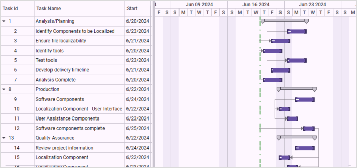

# DateTime Indicator Customization in WPF Gantt

Essential Gantt provides support for indicating the current date or time in the Gantt chart region. You can choose the following positions in the Gantt chart region for the DateTime indicator:

* Today
* Loaded Time
* Dynamic Time 
* Absolute

These are all included in the CurrentDateLinePositions enum.

Essential Gantt allows you to customize the appearance of the DateTime indicator by using the [CurrentDateLine](https://help.syncfusion.com/cr/wpf/Syncfusion.Windows.Controls.Gantt.GanttControl.html#Syncfusion_Windows_Controls_Gantt_GanttControl_CurrentDateLine) property.

* Today: DateTime indicator will be positioned at the current date.
* LoadedTime: DateTime indicator will be positioned at the Gantt control loaded time.
* DynamicTime: DateTime indicator will be positioned at the Gantt control loaded time. The position of the DateTime indicator will change based on the system time change.
* Absolute: The DateTime indicator will be positioned at a user-defined position.

## Use Case Scenarios

1. The DateTime indicator enables you to find the current date or time in a scheduled timeline.
2. You can customize the DateTime indicator to give a similar look and feel to your product.
3. You can change the style of DateTime indicator to differentiate the DateTime indicator from other vertical lines.

#### Properties

<table>
<tr>
<th>
Property</th><th>
Description</th><th>
Type</th><th>
Data Type</th></tr>
<tr>
<td>
[CurrentDateLine](https://help.syncfusion.com/cr/wpf/Syncfusion.Windows.Controls.Gantt.GanttControl.html#Syncfusion_Windows_Controls_Gantt_GanttControl_CurrentDateLine) </td><td>
Get the user-defined line for the DateTime indicator.</td><td>
Dependency Property</td><td>
Line</td></tr>
<tr>
<td>
[StickCurrentDateLineTo](https://help.syncfusion.com/cr/wpf/Syncfusion.Windows.Controls.Gantt.GanttControl.html#Syncfusion_Windows_Controls_Gantt_GanttControl_StickCurrentDateLineTo)</td><td>
Get/sets the StickCurrentDateLineTo property of the Gantt control.By default this is set to Today.</td><td>
Dependency Property</td><td>
EnumNoneTodayDynamic TimeLoaded TimeAbsolute</td></tr>
</table>

## Adding the DateTime Indicator to an Application

Adding the DateTime indicator customization will change the appearance and position of the DateTime indicator. By default, the DateTime indicator will appear in the current date. The following steps explain how to add a customized DateTime indicator:

1. Set the [StickCurrentDateLineTo](https://help.syncfusion.com/cr/wpf/Syncfusion.Windows.Controls.Gantt.GanttControl.html#Syncfusion_Windows_Controls_Gantt_GanttControl_StickCurrentDateLineTo) value for positioning the DateTime indicator. By default this is set as Today.
2. Customize the appearance of the DateTime indicator using the [CurrentDateLine](https://help.syncfusion.com/cr/wpf/Syncfusion.Windows.Controls.Gantt.GanttControl.html#Syncfusion_Windows_Controls_Gantt_GanttControl_CurrentDateLine) API in the Gantt control.

The following code samples illustrate how to customize the DateTime indicator.



<syncfusion:GanttControl x:Name="ganttControl"
                         ItemsSource="{Binding TaskCollection}"
                         StickCurrentDateLineTo="Today">
    <syncfusion:GanttControl.CurrentDateLine>
        <Line Stroke="Green"
              StrokeDashArray="5 1 5"
              StrokeThickness="2" />
    </syncfusion:GanttControl.CurrentDateLine>
    <syncfusion:GanttControl.TaskAttributeMapping>
        <syncfusion:TaskAttributeMapping TaskIdMapping="TaskId"
                                         TaskNameMapping="TaskName"
                                         StartDateMapping="StartDate"
                                         ChildMapping="Child"
                                         FinishDateMapping="FinishDate"
                                         DurationMapping="Duration"
                                         MileStoneMapping="IsMileStone"
                                         PredecessorMapping="Predecessor"
                                         ProgressMapping="Progress"  />
    </syncfusion:GanttControl.TaskAttributeMapping>
    <syncfusion:GanttControl.DataContext>
        <local:ViewModel/>
    </syncfusion:GanttControl.DataContext>
 </syncfusion:GanttControl>





 this.ganttControl.ItemsSource = new ViewModel().TaskCollection;
 this.ganttControl.StickCurrentDateLineTo = CurentDateLinePositions.Today;

// Task attribute mapping
TaskAttributeMapping taskAttributeMapping = new TaskAttributeMapping();
taskAttributeMapping.TaskIdMapping = "TaskId";
taskAttributeMapping.TaskNameMapping = "TaskName";
taskAttributeMapping.StartDateMapping = "StartDate";
taskAttributeMapping.ChildMapping = "Child";
taskAttributeMapping.FinishDateMapping = "FinishDate";
taskAttributeMapping.DurationMapping = "Duration";
taskAttributeMapping.MileStoneMapping = "IsMileStone";
taskAttributeMapping.PredecessorMapping = "Predecessor";
taskAttributeMapping.ProgressMapping = "Progress";
taskAttributeMapping.ResourceInfoMapping = "Resource";
this.ganttControl.TaskAttributeMapping = taskAttributeMapping;

//StrokeDashArray will change the style of Line
DoubleCollection strokeArray = new DoubleCollection();
strokeArray.Add(5);
strokeArray.Add(1);
strokeArray.Add(5);

this.ganttControl.CurrentDateLine.Stroke = Brushes.Green;
this.ganttControl.CurrentDateLine.StrokeDashArray = strokeArray;
this.ganttControl.CurrentDateLine.StrokeThickness = 1;





 public class ViewModel
 {
    /// 

    /// Holds the task collections.
    /// 

    private ObservableCollection<TaskDetails> taskCollections;

    /// 

    /// Initializes a new instance of the <see cref="ViewModel"/> class.
    /// 

    public ViewModel()
    {
        this.taskCollections = GetData();
    }
    
    /// 

    /// Gets or sets the appointment item source.
    /// 

    /// <value>The appointment item source.</value>
    public ObservableCollection<TaskDetails> TaskCollection
    {
        get
        {
            return this.taskCollections;
        }
        set
        {
            this.taskCollections = value;
        }
    }

    /// 

    /// Gets the data.
    /// 

    /// <returns>The task details</returns>
    public  ObservableCollection<TaskDetails> GetData()
    {
        var taskDetails = new ObservableCollection<TaskDetails>();

        taskDetails.Add(new TaskDetails() { TaskId = 1, TaskName = "Analysis/Planning", StartDate = new DateTime(2011, 7, 3), FinishDate = new DateTime(2011, 7, 14), Progress = 40d });
        taskDetails[0].Child.Add((new TaskDetails() { TaskId = 2, TaskName = "Identify Components to be Localized", StartDate = new DateTime(2011, 7, 3), FinishDate = new DateTime(2011, 7, 5), Progress = 20d }));
        taskDetails[0].Child.Add((new TaskDetails() { TaskId = 3, TaskName = "Ensure file localizability", StartDate = new DateTime(2011, 7, 6), FinishDate = new DateTime(2011, 7, 7), Progress = 20d }));
        taskDetails[0].Child.Add((new TaskDetails() { TaskId = 4, TaskName = "Identify tools", StartDate = new DateTime(2011, 7, 10), FinishDate = new DateTime(2011, 7, 14), Progress = 10d }));
        taskDetails[0].Child.Add((new TaskDetails() { TaskId = 5, TaskName = "Test tools", StartDate = new DateTime(2011, 7, 14), FinishDate = new DateTime(2011, 8, 1), Progress = 10d }));
        taskDetails[0].Child.Add((new TaskDetails() { TaskId = 6, TaskName = "Develop delivery timeline", StartDate = new DateTime(2011, 7, 10), FinishDate = new DateTime(2011, 8, 1), Progress = 10d }));
        taskDetails[0].Child.Add((new TaskDetails() { TaskId = 7, TaskName = "Analysis Complete", StartDate = new DateTime(2011, 7, 14), FinishDate = new DateTime(2011, 8, 10), Progress = 10d }));

        taskDetails.Add(new TaskDetails() { TaskId = 8, TaskName = "Production", StartDate = new DateTime(2011, 7, 3), FinishDate = new DateTime(2011, 7, 14), Progress = 40d });
        taskDetails[1].Child.Add((new TaskDetails() { TaskId = 9, TaskName = "Software Components", StartDate = new DateTime(2011, 7, 3), FinishDate = new DateTime(2011, 7, 5), Progress = 20d }));
        taskDetails[1].Child.Add((new TaskDetails() { TaskId = 10, TaskName = "Localization Component - User Interface", StartDate = new DateTime(2011, 7, 6), FinishDate = new DateTime(2011, 7, 7), Progress = 20d }));
        taskDetails[1].Child.Add((new TaskDetails() { TaskId = 11, TaskName = "User Assistance Components", StartDate = new DateTime(2011, 7, 10), FinishDate = new DateTime(2011, 7, 14), Progress = 10d }));
        taskDetails[1].Child.Add((new TaskDetails() { TaskId = 12, TaskName = "Software components complete", StartDate = new DateTime(2011, 7, 14), FinishDate = new DateTime(2011, 7, 19), Progress = 10d }));

        taskDetails.Add(new TaskDetails() { TaskId = 13, TaskName = "Quality Assurance", StartDate = new DateTime(2011, 7, 3), FinishDate = new DateTime(2011, 7, 12), Progress = 40d, });
        taskDetails[2].Child.Add((new TaskDetails() { TaskId = 14, TaskName = "Review project information", StartDate = new DateTime(2011, 7, 3), FinishDate = new DateTime(2011, 7, 15), Progress = 20d }));
        taskDetails[2].Child.Add((new TaskDetails() { TaskId = 15, TaskName = "Localization Component", StartDate = new DateTime(2011, 7, 6), FinishDate = new DateTime(2011, 7, 8), Progress = 20d }));
        taskDetails[2].Child.Add((new TaskDetails() { TaskId = 16, TaskName = "Localization Component", StartDate = new DateTime(2011, 7, 10), FinishDate = new DateTime(2011, 7, 14), Progress = 10d }));
        taskDetails[2].Child.Add((new TaskDetails() { TaskId = 17, TaskName = "Localization Component", StartDate = new DateTime(2011, 7, 14), FinishDate = new DateTime(2011, 7, 18), Progress = 10d }));

        taskDetails.Add(new TaskDetails() { TaskId = 18, TaskName = "Beta Testing", StartDate = new DateTime(2011, 7, 3), FinishDate = new DateTime(2011, 7, 14), Progress = 40d });
        taskDetails[3].Child.Add((new TaskDetails() { TaskId = 19, TaskName = "Disseminate completed product", StartDate = new DateTime(2011, 7, 3), FinishDate = new DateTime(2011, 7, 5), Progress = 20d }));
        taskDetails[3].Child.Add((new TaskDetails() { TaskId = 20, TaskName = "Obtain feedback", StartDate = new DateTime(2011, 7, 6), FinishDate = new DateTime(2011, 7, 7), Progress = 20d }));
        taskDetails[3].Child.Add((new TaskDetails() { TaskId = 21, TaskName = "Modify", StartDate = new DateTime(2011, 7, 10), FinishDate = new DateTime(2011, 7, 19), Progress = 10d }));
        taskDetails[3].Child.Add((new TaskDetails() { TaskId = 22, TaskName = "Test", StartDate = new DateTime(2011, 7, 14), FinishDate = new DateTime(2011, 7, 19), Progress = 10d }));
        taskDetails[3].Child.Add((new TaskDetails() { TaskId = 23, TaskName = "Complete", StartDate = new DateTime(2011, 7, 10), FinishDate = new DateTime(2011, 7, 19), Progress = 10d }));

        taskDetails.Add(new TaskDetails() { TaskId = 24, TaskName = "Post-Project Review", StartDate = new DateTime(2011, 7, 3), FinishDate = new DateTime(2011, 7, 18), Progress = 40d, });
        taskDetails[4].Child.Add((new TaskDetails() { TaskId = 25, TaskName = "Finalize cost analysis", StartDate = new DateTime(2011, 7, 3), FinishDate = new DateTime(2011, 7, 5), Progress = 20d }));
        taskDetails[4].Child.Add((new TaskDetails() { TaskId = 26, TaskName = "Analyze performance", StartDate = new DateTime(2011, 7, 6), FinishDate = new DateTime(2011, 7, 7), Progress = 20d }));
        taskDetails[4].Child.Add((new TaskDetails() { TaskId = 27, TaskName = "Archive files", StartDate = new DateTime(2011, 7, 10), FinishDate = new DateTime(2011, 7, 14), Progress = 10d }));
        taskDetails[4].Child.Add((new TaskDetails() { TaskId = 28, TaskName = "Document lessons learned", StartDate = new DateTime(2011, 7, 14), FinishDate = new DateTime(2011, 7, 18), Progress = 10d }));
        taskDetails[4].Child.Add((new TaskDetails() { TaskId = 29, TaskName = "Distribute to team members", StartDate = new DateTime(2011, 7, 10), FinishDate = new DateTime(2011, 7, 14), Progress = 10d }));
        taskDetails[4].Child.Add((new TaskDetails() { TaskId = 30, TaskName = "Post-project review complete", StartDate = new DateTime(2011, 7, 10), FinishDate = new DateTime(2011, 7, 14), Progress = 10d }));

        taskDetails[0].Resources = new ObservableCollection<Resource>() { new Resource { ID = 1, Name = "John" }, new Resource { ID = 2, Name = "Neil" } };
        taskDetails[0].Child[3].Resources = new ObservableCollection<Resource>() { new Resource() { ID = 3, Name = "Peter" } };
        taskDetails[1].Resources = new ObservableCollection<Resource>() { new Resource() { ID = 4, Name = "David" } };

        taskDetails[0].Child[1].Predecessor.Add(new Predecessor() { GanttTaskIndex = 2, GanttTaskRelationship = GanttTaskRelationship.StartToStart });
        taskDetails[0].Child[2].Predecessor.Add(new Predecessor() { GanttTaskIndex = 3, GanttTaskRelationship = GanttTaskRelationship.StartToStart });
        taskDetails[0].Child[3].Predecessor.Add(new Predecessor() { GanttTaskIndex = 3, GanttTaskRelationship = GanttTaskRelationship.StartToStart });

        taskDetails[1].Child[1].Predecessor.Add(new Predecessor() { GanttTaskIndex = 9, GanttTaskRelationship = GanttTaskRelationship.StartToStart });
        taskDetails[1].Child[2].Predecessor.Add(new Predecessor() { GanttTaskIndex = 10, GanttTaskRelationship = GanttTaskRelationship.StartToStart });
        taskDetails[1].Child[3].Predecessor.Add(new Predecessor() { GanttTaskIndex = 7, GanttTaskRelationship = GanttTaskRelationship.StartToStart });

        taskDetails[2].Child[1].Predecessor.Add(new Predecessor() { GanttTaskIndex = 12, GanttTaskRelationship = GanttTaskRelationship.FinishToFinish });
        taskDetails[2].Child[2].Predecessor.Add(new Predecessor() { GanttTaskIndex = 12, GanttTaskRelationship = GanttTaskRelationship.FinishToFinish });
        taskDetails[2].Child[3].Predecessor.Add(new Predecessor() { GanttTaskIndex = 12, GanttTaskRelationship = GanttTaskRelationship.FinishToFinish });

        taskDetails[3].Child[1].Predecessor.Add(new Predecessor() { GanttTaskIndex = 18, GanttTaskRelationship = GanttTaskRelationship.StartToStart });
        taskDetails[3].Child[2].Predecessor.Add(new Predecessor() { GanttTaskIndex = 18, GanttTaskRelationship = GanttTaskRelationship.StartToStart });
        taskDetails[3].Child[3].Predecessor.Add(new Predecessor() { GanttTaskIndex = 19, GanttTaskRelationship = GanttTaskRelationship.StartToStart });

        taskDetails[4].Child[1].Predecessor.Add(new Predecessor() { GanttTaskIndex = 25, GanttTaskRelationship = GanttTaskRelationship.StartToStart });
        taskDetails[4].Child[2].Predecessor.Add(new Predecessor() { GanttTaskIndex = 28, GanttTaskRelationship = GanttTaskRelationship.StartToStart });
        taskDetails[4].Child[3].Predecessor.Add(new Predecessor() { GanttTaskIndex = 30, GanttTaskRelationship = GanttTaskRelationship.StartToStart });
        taskDetails[4].Child[4].Predecessor.Add(new Predecessor() { GanttTaskIndex = 27, GanttTaskRelationship = GanttTaskRelationship.StartToStart });
        return taskDetails;
    }
}





#### Output

The following image shows the resultant output:

Customized DateTime Indicator
{:.caption}

## Sample Link

To view samples:

1. Go to the Syncfusion Essential Studio installed location. 
    Location: Installed Location\Syncfusion\Essential Studio\{{ site.releaseversion }}\Infrastructure\Launcher\Syncfusion Control Panel 
2. Open the Syncfusion Control Panel in the above location (or) Double click on the Syncfusion Control Panel desktop shortcut menu.
3. Click Run Samples forWPF under the User Interface Edition panel.
4. Select Gantt.
5. Expand the Styles category in the Sample Browser.
6. Choose the Gantt Style Properties sample.
7. The sample contains different styles of the DateTime indicator.