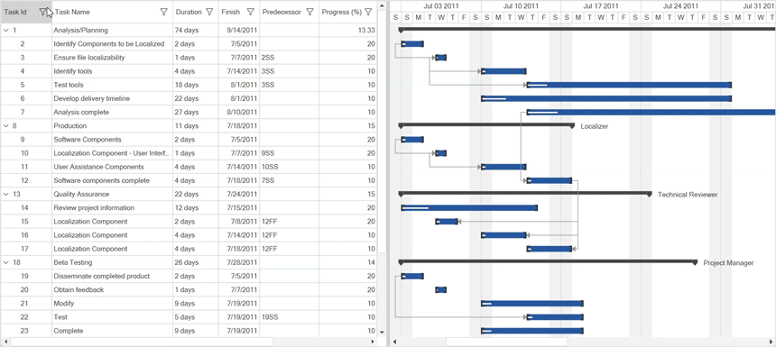
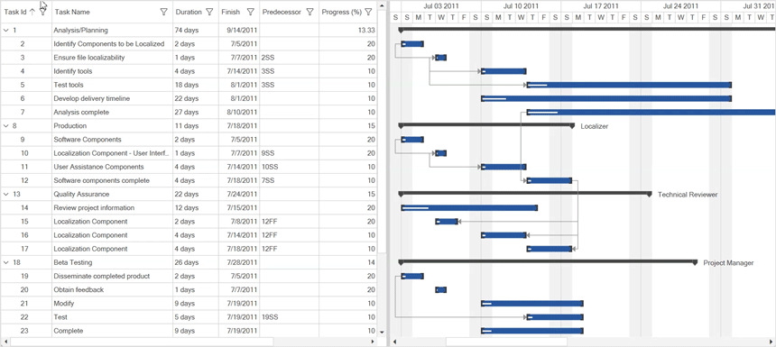

# Filtering and sorting support in GanttControl
`Filtering` is the process of retrieving values from a collection that satisfy specified conditions. In the `GanttControl`, filtering can be applied through the user interface, allowing users to narrow down the displayed data based on their criteria.
Additionally, the `GanttControl` enables sorting of data against one or more columns in either ascending or descending order. When sorting is applied, the rows are rearranged based on the specified sort criteria, providing users with organized and easily navigable data views.

## Filtering
The `GanttControl` provides an Excel-inspired filtering UI with various options to easily filter data. Filtering can be enabled by setting the `AllowFiltering` property of `GanttControl` to `true`. This allows users to open the filter UI by clicking the filter icon on the column header to filter the nodes. The default value of the `AllowFiltering` property is `false`.



<syncfusion:GanttControl x:Name="ganttControl" 
                         AllowFiltering="True">
</syncfusion:GanttControl>


this.ganttControl.AllowFiltering = true;



N> By default, the WPF GanttControl uses the `Extended` filter level. This setting ensures that all parent nodes of any node that meets the filter criteria are shown.

## Sorting
The `GanttControl` allows you to sort column data in either ascending or descending order. When sorting is applied, the rows are rearranged based on the specified sort criteria. You can sort the data by touching or clicking the column header. Sorting can be enabled by setting the `AllowSorting` property to `true`.



<syncfusion:GanttControl x:Name="ganttControl"
                         AllowSorting="True">
</syncfusion:GanttControl>


this.ganttControl.AllowSorting = true;

