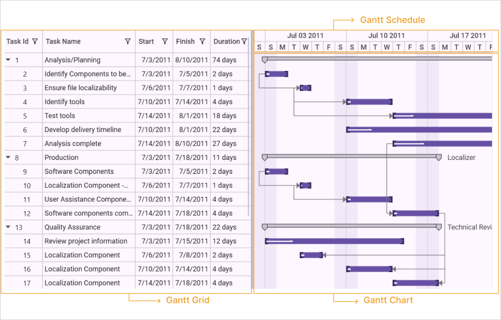
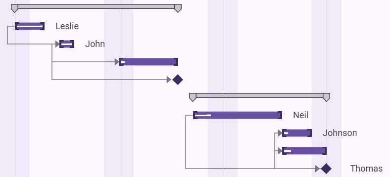
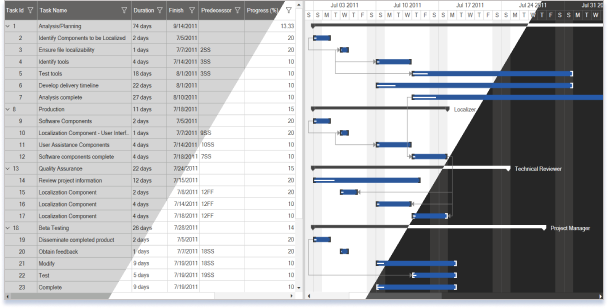

# Getting Started with WPF Gantt

## Appearance and structure of Gantt

Gantt control is composed of three controls. They are:

* GanttGrid
* ScheduleHeader  
* GanttChartVisualControl

#### Gantt grid

Gantt Grid is a table view control which displays the scheduled tasks/activities of the project with its hierarchy. You can edit the fields of the bounded tasks using this grid.

* Header— Header represents the table header which contains the field name of the task.
* Parent Task—Parent task represents the summary of the child tasks. This is an activity which will be further split into various child tasks.
* Child Task—Child task represents an individual task. This contains only the information about the specific task. The Child task is a part of parent task.
* Expand/Collapse Button—Expand/Collapse button allows you to expand or collapse the particular hierarchy.

#### Gantt chart

Gantt Chart is an items control which provides a graphically representation of the task/activity that are currently scheduled. Gantt Chart have different components to represent the type of Task, Progress of the Task and Relationship between Tasks.

* Node— Node represents an individual or child task.
* Header Node—HeaderNode represents the parent or summary task of the projects.
* Milestone—Milestone represents the target to be completed in a day.
* Progress Indicator—Progress indicator represents the percentage of work completed for the task.
* Connector—Connector represents the dependency relationship between the tasks.

#### Gantt schedule 

Gantt Schedule is a medium to measure the progress in the Gantt control. Using this you can track or measure the progress of the task or activity.

## Class diagram

## Feature summary

The following features are available in the Essential Gantt for WPF:

* Data Binding
* TaskDetails Binding
* External Property Binding
* Dependency relationship
* CustomToolTip
* Calendar customization
* Custom Node style
* VisualStyle
* XML Import/Export

## Adding GanttControl to an application

You can create a project management application using Essential Gantt WPF. 

You can create Gantt control in two methods. They are:

* Programmatically
* Through Designer 

### Programmatically creating GanttControl 

The following are the steps to create GanttControl programmatically: 

#### Adding GanttControl

You can add Gantt control to the application using the following code:




<syncfusion:GanttControl x:Name="ganttControl" />


GanttControl ganttControl = new GanttControl();




When the code runs, an empty Gantt with in-built TaskDetails collection will be displayed.

#### Binding data to GanttControl

Create a collection of tasks and bind it to the newly created GanttControl as given in the following code:





<syncfusion:GanttControl x:Name="ganttControl" 
                         ItemsSource="{Binding TaskDetails}">
    <syncfusion:GanttControl.DataContext>
        <local:ViewModel></local:ViewModel>
    </syncfusion:GanttControl.DataContext>
</syncfusion:GanttControl>





GanttControl ganttControl = new GanttControl();
ViewModel viewModel = new ViewModel();
ganttControl.DataContext = viewModel;
ganttControl.ItemsSource = viewModel.TaskDetails;
this.Content = ganttControl;





public class ViewModel
{
    public ViewModel()
    {
        taskDetails = this.GetTaskDetails();
    }

    private ObservableCollection<TaskDetails> taskDetails;

    /// 

    /// Gets or sets the task collection.
    /// 

    /// <value>The task collection.</value>
    public ObservableCollection<TaskDetails> TaskDetails
    {
        get
        {
            return taskDetails;
        }
        set
        {
            taskDetails = value;
        }
    }

    /// 

    /// Gets the task details.
    /// 

    /// <returns></returns>
    ObservableCollection<TaskDetails> GetTaskDetails()
    {
        ObservableCollection<TaskDetails> task = new ObservableCollection<TaskDetails>();
        task.Add(new TaskDetails { TaskId = 1, TaskName = "Scope", StartDate = new DateTime(2011, 7, 3), FinishDate = new DateTime(2011, 7, 14), Progress = 40d });
        task[0].Child.Add(new TaskDetails { TaskId = 2, TaskName = "Determine project office scope", StartDate = new DateTime(2011, 7, 3), FinishDate = new DateTime(2011, 7, 5), Progress = 20d });
        task[0].Child.Add(new TaskDetails { TaskId = 3, TaskName = "Justify Project Offfice via business model", StartDate = new DateTime(2011, 7, 3), FinishDate = new DateTime(2011, 7, 7), Progress = 20d });
        task[0].Child.Add(new TaskDetails { TaskId = 4, TaskName = "Secure executive sponsorship", StartDate = new DateTime(2011, 7, 3), FinishDate = new DateTime(2011, 7, 14), Progress = 20d });
        task[0].Child.Add(new TaskDetails { TaskId = 5, TaskName = "Secure complete", StartDate = new DateTime(2011, 7, 14), FinishDate = new DateTime(2011, 7, 14), Progress = 20d });

        task.Add(new TaskDetails { TaskId = 6, TaskName = "Risk Assessment", StartDate = new DateTime(2011, 7, 8), FinishDate = new DateTime(2011, 7, 24), Progress = 30d });

        task[1].Child.Add(new TaskDetails { TaskId = 7, TaskName = "Perform risk assessment", StartDate = new DateTime(2011, 7, 8), FinishDate = new DateTime(2011, 7, 21), Progress = 20d });
        task[1].Child.Add(new TaskDetails { TaskId = 8, TaskName = "Evaluate risk assessment", StartDate = new DateTime(2011, 7, 8), FinishDate = new DateTime(2011, 7, 23), Progress = 30d });
        task[1].Child.Add(new TaskDetails { TaskId = 9, TaskName = "Prepare contingency plans", StartDate = new DateTime(2011, 7, 12), FinishDate = new DateTime(2011, 7, 24), Progress = 30d });
        task[1].Child.Add(new TaskDetails { TaskId = 10, TaskName = "Risk Assessment complete", StartDate = new DateTime(2011, 7, 15), FinishDate = new DateTime(2011, 7, 24), Progress = 30d });

        task.Add(new TaskDetails { TaskId = 11, TaskName = "Monitoring", StartDate = new DateTime(2011, 7, 13), FinishDate = new DateTime(2011, 8, 6), Progress = 40d });
        task[2].Child.Add(new TaskDetails { TaskId = 12, TaskName = "Prepare Meeting agenda", StartDate = new DateTime(2011, 7, 13), FinishDate = new DateTime(2011, 7, 26), Progress = 30d });
        task[2].Child.Add(new TaskDetails { TaskId = 13, TaskName = "Conduct review meeting", StartDate = new DateTime(2011, 7, 13), FinishDate = new DateTime(2011, 7, 30), Progress = 30d });
        task[2].Child.Add(new TaskDetails { TaskId = 14, TaskName = "Migrate critical issues", StartDate = new DateTime(2011, 7, 18), FinishDate = new DateTime(2011, 8, 2), Progress = 30d });
        task[2].Child.Add(new TaskDetails { TaskId = 15, TaskName = "Estabilish change mgmt Control", StartDate = new DateTime(2011, 8, 3), FinishDate = new DateTime(2011, 8, 6), Progress = 30d });
        task[2].Child.Add(new TaskDetails { TaskId = 16, TaskName = "Monitoring Complete", StartDate = new DateTime(2011, 8, 6), FinishDate = new DateTime(2011, 8, 6), Progress = 30d });

        task.Add(new TaskDetails { TaskId = 17, TaskName = "Post Implementation", StartDate = new DateTime(2011, 8, 7), FinishDate = new DateTime(2011, 8, 19), Progress = 40d });
        task[3].Child.Add(new TaskDetails { TaskId = 18, TaskName = "Obtain User feedback", StartDate = new DateTime(2011, 8, 7), FinishDate = new DateTime(2011, 8, 10), Progress = 30d });
        task[3].Child.Add(new TaskDetails { TaskId = 19, TaskName = "Evaluate lessons learned", StartDate = new DateTime(2011, 8, 7), FinishDate = new DateTime(2011, 8, 17), Progress = 30d });
        task[3].Child.Add(new TaskDetails { TaskId = 20, TaskName = "Modify items as necessary", StartDate = new DateTime(2011, 8, 7), FinishDate = new DateTime(2011, 8, 19), Progress = 30d });
        task[3].Child.Add(new TaskDetails { TaskId = 21, TaskName = "Post Implementation complete", StartDate = new DateTime(2011, 8, 19), FinishDate = new DateTime(2011, 8, 19), Progress = 30d });

        task[0].Resources = new ObservableCollection<Resource>() { new Resource { ID = 1, Name = "John" }, new Resource { ID = 2, Name = "Neil" } };
        task[0].Child[3].Resources = new ObservableCollection<Resource>() { new Resource() { ID = 3, Name = "Peter" } };
        task[1].Resources = new ObservableCollection<Resource>() { new Resource() { ID = 4, Name = "David" } };
        return task;
    }
}
 



### Adding GanttControl through designer

The following are the steps to create Gantt control through designer.

1. Open the XAML page of the application.

2. Select GanttControl from ToolBox.

3. Drag-and-drop the GanttControl to Designer View.

4. Gantt control is added to the window. Assembly reference will also be added to Project file.

5. Now you can customize the properties of Gantt control in the Properties Window.

## Adjusting chart and grid size

The GanttControl allows users to set the width for GanttChart and GanttGrid  using the [`ChartWidth`](https://help.syncfusion.com/cr/wpf/Syncfusion.Windows.Controls.Gantt.GanttControl.html#Syncfusion_Windows_Controls_Gantt_GanttControl_ChartWidth) and [`GridWidth`](https://help.syncfusion.com/cr/wpf/Syncfusion.Windows.Controls.Gantt.GanttControl.html#Syncfusion_Windows_Controls_Gantt_GanttControl_GridWidth) properties. The following code sample demonstrates how to set width for chart and grid.




<syncfusion:GanttControl x:Name="ganttControl"
                         GridWidth="200"
                         ChartWidth="800">
</syncfusion:GanttControl>




this.ganttControl.GridWidth = new GridLength(200);
this.ganttControl.ChartWidth = new GridLength(800);


   

## Schedule padding 

Gantt schedule view can be extended by using the [`ScheduleRangePadding`](https://help.syncfusion.com/cr/wpf/Syncfusion.Windows.Controls.Gantt.GanttControl.html#Syncfusion_Windows_Controls_Gantt_GanttControl_ScheduleRangePadding) property in GanttControl. This property extends the schedule with number of lower schedule units in starting position to improve the user experience.




<syncfusion:GanttControl x:Name="ganttControl"
                         ScheduleRangePadding="5">
</syncfusion:GanttControl>




this.ganttControl.ScheduleRangePadding = 5;




## ScheduleType

By using the [`ScheduleType`](https://help.syncfusion.com/cr/wpf/Syncfusion.Windows.Controls.Gantt.GanttControl.html#Syncfusion_Windows_Controls_Gantt_GanttControl_ScheduleType) enum in the GanttControl, you can define the specific schedule range. The [`ScheduleType`](https://help.syncfusion.com/cr/wpf/Syncfusion.Windows.Controls.Gantt.GanttControl.html#Syncfusion_Windows_Controls_Gantt_GanttControl_ScheduleType) is an enum, which contains the following schedule types: 

* HoursWithSeconds
* MinutesWithSeconds
* WeekWithDays
* DayWithHours
* DayWithMinutes
* MonthWithHours
* MonthWithDays
* YearWithDays
* YearWithMonths
* CustomDateTime
* CustomNumeric

The following code sample demonstrates how to set **ScheduleType** for GanttControl.




<syncfusion:GanttControl x:Name="ganttControl" 
                         ScheduleType="YearWithMonths">
</syncfusion:GanttControl>




this.ganttControl.ScheduleType = ScheduleType.YearWithMonths;




## Showing date with time in GanttGrid

To show the date with time in the GanttGrid, enable the ShowDateWithTime property as shown in the following code sample.




<syncfusion:GanttControl x:Name="ganttControl"
                         ShowDateWithTime="True"
                         ItemsSource="{Binding TaskDetails}">
    <syncfusion:GanttControl.DataContext>
        <local:ViewModel/>
    </syncfusion:GanttControl.DataContext>
</syncfusion:GanttControl>




GanttControl ganttControl = new GanttControl();
ganttControl.ShowDateWithTime = true;
ViewModel viewModel = new ViewModel();
ganttControl.DataContext = viewModel;
ganttControl.ItemsSource = viewModel.TaskDetails;
this.Content = ganttControl;




N> By default, GanttGrid will show the date alone.

## Auto expand mode
By default, the `GanttGrid` items will be in expanded state. You can define how the nodes to be expanded while loading the `GanttControl` by using `AutoExpandMode` property.

* `None` : All items are collapsed when loaded.
* `RootNodesExpanded` : Expands only the root item when loaded.
* `AllNodesExpanded` : Expands all the items when loaded.




<syncfusion:GanttControl x:Name="ganttControl"
                         AutoExpandMode="None"> 
</syncfusion:GanttControl>




this.ganttControl.AutoExpandMode = GanttAutoExpandMode.None;



## Theme
The WPF GanttControl supports various built-in themes. Refer to the below links to apply themes for the Gantt control,

  * [Apply theme using SfSkinManager](https://help.syncfusion.com/wpf/themes/skin-manager)
	
  * [Create a custom theme using ThemeStudio](https://help.syncfusion.com/wpf/themes/theme-studio#creating-custom-theme)

  

## see also

[How to show horizontal and vertical grid lines in WPF gantt control](https://support.syncfusion.com/kb/article/10135/how-to-show-horizontal-and-vertical-grid-lines-in-wpf-gantt-control)

[How to enable horizontal lines for gantt chart rows](https://support.syncfusion.com/kb/article/3380/how-to-enable-horizontal-lines-for-ganttcharts-rows)

[How to create gantt chart control in C# WPF](https://support.syncfusion.com/kb/article/9598/how-to-create-gantt-chart-control-in-c-wpf)

[How to create a gantt chart by hiding the gantt grid](https://support.syncfusion.com/kb/article/8961/how-to-create-a-ganttchart-by-hiding-the-ganttgrid)

[How to wrap WPF gantt in Windows Forms](https://support.syncfusion.com/kb/article/8200/how-to-wrap-wpf-gantt-in-windows-forms)
