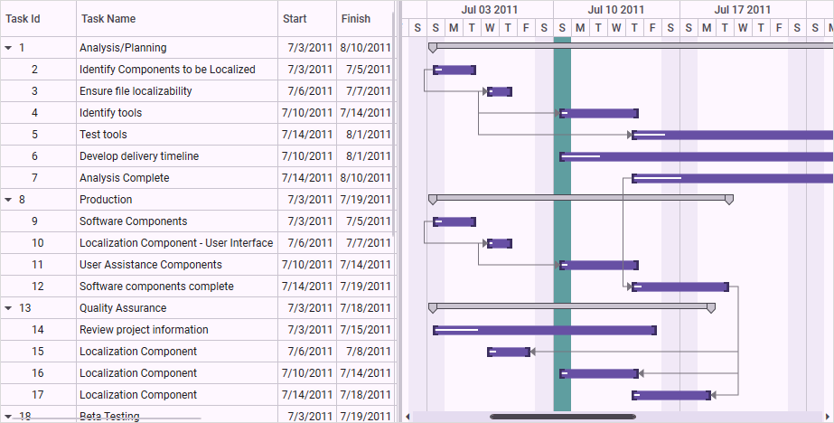

# Holidays Customization in WPF Gantt

The GanttControl allows customers to differentiate the dates of holidays. This support is used to highlight the holidays in the Gantt chart.

The holidays can be specified using the [Holidays](https://help.syncfusion.com/cr/wpf/Syncfusion.Windows.Controls.Gantt.GanttControl.html#Syncfusion_Windows_Controls_Gantt_GanttControl_Holidays) property in the SfGantt, which holds a collection of [GanttHoliday](https://help.syncfusion.com/cr/wpf/Syncfusion.Windows.Controls.Gantt.GanttHoliday.html).

The following properties in the GanttHoliday are used to define the holidays:

* [Day](https://help.syncfusion.com/cr/wpf/Syncfusion.Windows.Controls.Gantt.GanttHoliday.html#Syncfusion_Windows_Controls_Gantt_GanttHoliday_Day): Specifies the holiday date.

* [Background](https://help.syncfusion.com/cr/wpf/Syncfusion.Windows.Controls.Gantt.GanttHoliday.html#Syncfusion_Windows_Controls_Gantt_GanttHoliday_Background): Specifies the brush to highlight the holiday.

N> If the background is not defined, then the Non-WorkingDays background will be applied.

The following properties in the GanttControl are used to customize the holiday feature:

* [ShowHolidays](https://help.syncfusion.com/cr/wpf/Syncfusion.Windows.Controls.Gantt.GanttControl.html#Syncfusion_Windows_Controls_Gantt_GanttControl_ShowHolidays): Indicates whether to enable or disable the holidays in the Gantt chart.

* [ExcludeHolidays](https://help.syncfusion.com/cr/wpf/Syncfusion.Windows.Controls.Gantt.GanttControl.html#Syncfusion_Windows_Controls_Gantt_GanttControl_ExcludeHolidays): Indicates whether to include or exclude the holidays in duration calculation.

The following code sample demonstrates how to define the holidays.




<syncfusion:GanttControl x:Name="Gantt"
                         ItemsSource="{Binding TaskCollection}"
                         ShowHolidays="True"
                         ExcludeHolidays="False">
    <syncfusion:GanttControl.Holidays>
        <syncfusion:GanttHolidayCollection>
            <syncfusion:GanttHoliday Day="6/10/2011" Background="CadetBlue"/>
            <syncfusion:GanttHoliday Day="7/8/2011" Background="CadetBlue"/>
            <syncfusion:GanttHoliday Day="8/3/2011" Background="CadetBlue"/>
            <syncfusion:GanttHoliday Day="9/20/2011" Background="CadetBlue"/>
        </syncfusion:GanttHolidayCollection>
    </syncfusion:GanttControl.Holidays>
    <syncfusion:GanttControl.TaskAttributeMapping>
        <syncfusion:TaskAttributeMapping TaskIdMapping="TaskId"
                                         TaskNameMapping="TaskName"
                                         StartDateMapping="StartDate"
                                         ChildMapping="Child"
                                         FinishDateMapping="FinishDate"
                                         DurationMapping="Duration"
                                         MileStoneMapping="IsMileStone"
                                         PredecessorMapping="Predecessor"
                                         ProgressMapping="Progress"/>
    </syncfusion:GanttControl.TaskAttributeMapping>
     <syncfusion:GanttControl.DataContext>
        <local:ViewModel/>
    </syncfusion:GanttControl.DataContext>
</syncfusion:GanttControl>




this.ganttControl.ItemsSource = new ViewModel().TaskCollection;
this.ganttControl.ShowHolidays = true;
this.ganttControl.ExcludeHolidays = false;

// Task attribute mapping
TaskAttributeMapping taskAttributeMapping = new TaskAttributeMapping();
taskAttributeMapping.TaskIdMapping = "TaskId";
taskAttributeMapping.TaskNameMapping = "TaskName";
taskAttributeMapping.StartDateMapping = "StartDate";
taskAttributeMapping.ChildMapping = "Child";
taskAttributeMapping.FinishDateMapping = "FinishDate";
taskAttributeMapping.DurationMapping = "Duration";
taskAttributeMapping.MileStoneMapping = "IsMileStone";
taskAttributeMapping.ProgressMapping = "Progress";
taskAttributeMapping.PredecessorMapping = "Predecessor";
taskAttributeMapping.ResourceInfoMapping = "Resource";
this.ganttControl.TaskAttributeMapping = taskAttributeMapping;

public partial class MainWindow : Window
{
    ViewModel viewModel;

    /// 

    /// Initializes a new instance of the <see cref="MainWindow"/> class.
    /// 

    public MainWindow()
    {
        InitializeComponent();
        viewModel = new ViewModel();

        GanttControl gantt = new GanttControl();
        gantt.ItemsSource = this.viewModel.TaskCollection;
        gantt.VisualStyle = VisualStyle.Metro;
        gantt.ShowHolidays = true;
        gantt.ExcludeHolidays = false;
        gantt.Holidays = new GanttHolidayCollection
        {
            new GanttHoliday { Day = new DateTime(2011, 6, 10), Background = Brushes.CadetBlue },
            new GanttHoliday { Day = new DateTime(2011, 7, 8), Background = Brushes.CadetBlue },
            new GanttHoliday { Day = new DateTime(2011, 8, 3), Background = Brushes.CadetBlue },
            new GanttHoliday { Day = new DateTime(2011, 9, 20), Background = Brushes.CadetBlue }
        };

        this.AddChild(gantt);
    }
}





 public class ViewModel
 {
    /// 

    /// Holds the task collections.
    /// 

    private ObservableCollection<TaskDetails> taskCollections;

    /// 

    /// Initializes a new instance of the <see cref="ViewModel"/> class.
    /// 

    public ViewModel()
    {
        this.taskCollections = GetData();
    }

    /// 

    /// Gets or sets the appointment item source.
    /// 

    /// <value>The appointment item source.</value>
    public ObservableCollection<TaskDetails> TaskCollection
    {
        get
        {
            return this.taskCollections;
        }
        set
        {
            this.taskCollections = value;
        }
    }

    /// 

    /// Method to gets the data.
    /// 

    /// <returns></returns>
    public  ObservableCollection<TaskDetails> GetData()
    {
        var taskDetails = new ObservableCollection<TaskDetails>();

        taskDetails.Add(new TaskDetails() { TaskId = 1, TaskName = "Analysis/Planning", StartDate = new DateTime(2011, 7, 3), FinishDate = new DateTime(2011, 7, 14), Progress = 40d });
        taskDetails[0].Child.Add((new TaskDetails() { TaskId = 2, TaskName = "Identify Components to be Localized", StartDate = new DateTime(2011, 7, 3), FinishDate = new DateTime(2011, 7, 5), Progress = 20d }));
        taskDetails[0].Child.Add((new TaskDetails() { TaskId = 3, TaskName = "Ensure file localizability", StartDate = new DateTime(2011, 7, 6), FinishDate = new DateTime(2011, 7, 7), Progress = 20d }));
        taskDetails[0].Child.Add((new TaskDetails() { TaskId = 4, TaskName = "Identify tools", StartDate = new DateTime(2011, 7, 10), FinishDate = new DateTime(2011, 7, 14), Progress = 10d }));
        taskDetails[0].Child.Add((new TaskDetails() { TaskId = 5, TaskName = "Test tools", StartDate = new DateTime(2011, 7, 14), FinishDate = new DateTime(2011, 8, 1), Progress = 10d }));
        taskDetails[0].Child.Add((new TaskDetails() { TaskId = 6, TaskName = "Develop delivery timeline", StartDate = new DateTime(2011, 7, 10), FinishDate = new DateTime(2011, 8, 1), Progress = 10d }));
        taskDetails[0].Child.Add((new TaskDetails() { TaskId = 7, TaskName = "Analysis Complete", StartDate = new DateTime(2011, 7, 14), FinishDate = new DateTime(2011, 8, 10), Progress = 10d }));

        taskDetails.Add(new TaskDetails() { TaskId = 8, TaskName = "Production", StartDate = new DateTime(2011, 7, 3), FinishDate = new DateTime(2011, 7, 14), Progress = 40d });
        taskDetails[1].Child.Add((new TaskDetails() { TaskId = 9, TaskName = "Software Components", StartDate = new DateTime(2011, 7, 3), FinishDate = new DateTime(2011, 7, 5), Progress = 20d }));
        taskDetails[1].Child.Add((new TaskDetails() { TaskId = 10, TaskName = "Localization Component - User Interface", StartDate = new DateTime(2011, 7, 6), FinishDate = new DateTime(2011, 7, 7), Progress = 20d }));
        taskDetails[1].Child.Add((new TaskDetails() { TaskId = 11, TaskName = "User Assistance Components", StartDate = new DateTime(2011, 7, 10), FinishDate = new DateTime(2011, 7, 14), Progress = 10d }));
        taskDetails[1].Child.Add((new TaskDetails() { TaskId = 12, TaskName = "Software components complete", StartDate = new DateTime(2011, 7, 14), FinishDate = new DateTime(2011, 7, 19), Progress = 10d }));

        taskDetails.Add(new TaskDetails() { TaskId = 13, TaskName = "Quality Assurance", StartDate = new DateTime(2011, 7, 3), FinishDate = new DateTime(2011, 7, 12), Progress = 40d, });
        taskDetails[2].Child.Add((new TaskDetails() { TaskId = 14, TaskName = "Review project information", StartDate = new DateTime(2011, 7, 3), FinishDate = new DateTime(2011, 7, 15), Progress = 20d }));
        taskDetails[2].Child.Add((new TaskDetails() { TaskId = 15, TaskName = "Localization Component", StartDate = new DateTime(2011, 7, 6), FinishDate = new DateTime(2011, 7, 8), Progress = 20d }));
        taskDetails[2].Child.Add((new TaskDetails() { TaskId = 16, TaskName = "Localization Component", StartDate = new DateTime(2011, 7, 10), FinishDate = new DateTime(2011, 7, 14), Progress = 10d }));
        taskDetails[2].Child.Add((new TaskDetails() { TaskId = 17, TaskName = "Localization Component", StartDate = new DateTime(2011, 7, 14), FinishDate = new DateTime(2011, 7, 18), Progress = 10d }));

        taskDetails.Add(new TaskDetails() { TaskId = 18, TaskName = "Beta Testing", StartDate = new DateTime(2011, 7, 3), FinishDate = new DateTime(2011, 7, 14), Progress = 40d });
        taskDetails[3].Child.Add((new TaskDetails() { TaskId = 19, TaskName = "Disseminate completed product", StartDate = new DateTime(2011, 7, 3), FinishDate = new DateTime(2011, 7, 5), Progress = 20d }));
        taskDetails[3].Child.Add((new TaskDetails() { TaskId = 20, TaskName = "Obtain feedback", StartDate = new DateTime(2011, 7, 6), FinishDate = new DateTime(2011, 7, 7), Progress = 20d }));
        taskDetails[3].Child.Add((new TaskDetails() { TaskId = 21, TaskName = "Modify", StartDate = new DateTime(2011, 7, 10), FinishDate = new DateTime(2011, 7, 19), Progress = 10d }));
        taskDetails[3].Child.Add((new TaskDetails() { TaskId = 22, TaskName = "Test", StartDate = new DateTime(2011, 7, 14), FinishDate = new DateTime(2011, 7, 19), Progress = 10d }));
        taskDetails[3].Child.Add((new TaskDetails() { TaskId = 23, TaskName = "Complete", StartDate = new DateTime(2011, 7, 10), FinishDate = new DateTime(2011, 7, 19), Progress = 10d }));

        taskDetails.Add(new TaskDetails() { TaskId = 24, TaskName = "Post-Project Review", StartDate = new DateTime(2011, 7, 3), FinishDate = new DateTime(2011, 7, 18), Progress = 40d, });
        taskDetails[4].Child.Add((new TaskDetails() { TaskId = 25, TaskName = "Finalize cost analysis", StartDate = new DateTime(2011, 7, 3), FinishDate = new DateTime(2011, 7, 5), Progress = 20d }));
        taskDetails[4].Child.Add((new TaskDetails() { TaskId = 26, TaskName = "Analyze performance", StartDate = new DateTime(2011, 7, 6), FinishDate = new DateTime(2011, 7, 7), Progress = 20d }));
        taskDetails[4].Child.Add((new TaskDetails() { TaskId = 27, TaskName = "Archive files", StartDate = new DateTime(2011, 7, 10), FinishDate = new DateTime(2011, 7, 14), Progress = 10d }));
        taskDetails[4].Child.Add((new TaskDetails() { TaskId = 28, TaskName = "Document lessons learned", StartDate = new DateTime(2011, 7, 14), FinishDate = new DateTime(2011, 7, 18), Progress = 10d }));
        taskDetails[4].Child.Add((new TaskDetails() { TaskId = 29, TaskName = "Distribute to team members", StartDate = new DateTime(2011, 7, 10), FinishDate = new DateTime(2011, 7, 14), Progress = 10d }));
        taskDetails[4].Child.Add((new TaskDetails() { TaskId = 30, TaskName = "Post-project review complete", StartDate = new DateTime(2011, 7, 10), FinishDate = new DateTime(2011, 7, 14), Progress = 10d }));

        taskDetails[0].Resources = new ObservableCollection<Resource>() { new Resource { ID = 1, Name = "John" }, new Resource { ID = 2, Name = "Neil" } };
        taskDetails[0].Child[3].Resources = new ObservableCollection<Resource>() { new Resource() { ID = 3, Name = "Peter" } };
        taskDetails[1].Resources = new ObservableCollection<Resource>() { new Resource() { ID = 4, Name = "David" } };

        taskDetails[0].Child[1].Predecessor.Add(new Predecessor() { GanttTaskIndex = 2, GanttTaskRelationship = GanttTaskRelationship.StartToStart });
        taskDetails[0].Child[2].Predecessor.Add(new Predecessor() { GanttTaskIndex = 3, GanttTaskRelationship = GanttTaskRelationship.StartToStart });
        taskDetails[0].Child[3].Predecessor.Add(new Predecessor() { GanttTaskIndex = 3, GanttTaskRelationship = GanttTaskRelationship.StartToStart });

        taskDetails[1].Child[1].Predecessor.Add(new Predecessor() { GanttTaskIndex = 9, GanttTaskRelationship = GanttTaskRelationship.StartToStart });
        taskDetails[1].Child[2].Predecessor.Add(new Predecessor() { GanttTaskIndex = 10, GanttTaskRelationship = GanttTaskRelationship.StartToStart });
        taskDetails[1].Child[3].Predecessor.Add(new Predecessor() { GanttTaskIndex = 7, GanttTaskRelationship = GanttTaskRelationship.StartToStart });

        taskDetails[2].Child[1].Predecessor.Add(new Predecessor() { GanttTaskIndex = 12, GanttTaskRelationship = GanttTaskRelationship.FinishToFinish });
        taskDetails[2].Child[2].Predecessor.Add(new Predecessor() { GanttTaskIndex = 12, GanttTaskRelationship = GanttTaskRelationship.FinishToFinish });
        taskDetails[2].Child[3].Predecessor.Add(new Predecessor() { GanttTaskIndex = 12, GanttTaskRelationship = GanttTaskRelationship.FinishToFinish });

        taskDetails[3].Child[1].Predecessor.Add(new Predecessor() { GanttTaskIndex = 18, GanttTaskRelationship = GanttTaskRelationship.StartToStart });
        taskDetails[3].Child[2].Predecessor.Add(new Predecessor() { GanttTaskIndex = 18, GanttTaskRelationship = GanttTaskRelationship.StartToStart });
        taskDetails[3].Child[3].Predecessor.Add(new Predecessor() { GanttTaskIndex = 19, GanttTaskRelationship = GanttTaskRelationship.StartToStart });

        taskDetails[4].Child[1].Predecessor.Add(new Predecessor() { GanttTaskIndex = 25, GanttTaskRelationship = GanttTaskRelationship.StartToStart });
        taskDetails[4].Child[2].Predecessor.Add(new Predecessor() { GanttTaskIndex = 28, GanttTaskRelationship = GanttTaskRelationship.StartToStart });
        taskDetails[4].Child[3].Predecessor.Add(new Predecessor() { GanttTaskIndex = 30, GanttTaskRelationship = GanttTaskRelationship.StartToStart });
        taskDetails[4].Child[4].Predecessor.Add(new Predecessor() { GanttTaskIndex = 27, GanttTaskRelationship = GanttTaskRelationship.StartToStart });
        return taskDetails;

    }
}





The following screenshot illustrates the customized holidays sample.

You can download the holiday customization sample from the following link:
[Holiday customization sample](https://github.com/SyncfusionExamples/WPF-Gantt-holiday-customization-).
