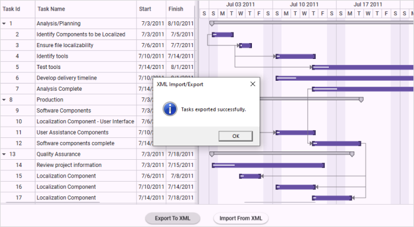

# Import and Export Support in WPF Gantt

Essential Gantt allows you to export and import the task details. You can export the task details as XML files and import them again when needed. You can open the exported XML files in MS Project too. The XML file, exported from MS Project can also be opened in Gantt control. You can import and export the details using the provided APIs.

## Properties

<table>
<tr>
<th>
Property </th><th>
Description </th><th>
Type </th><th>
Data Type </th></tr>
<tr>
<td>
{{'[ImportFromXMLCommand](https://help.syncfusion.com/cr/wpf/Syncfusion.Windows.Controls.Gantt.GanttControl.html#Syncfusion_Windows_Controls_Gantt_GanttControl_ImportFromXMLCommand)'| markdownify }}</td><td>
Command binding used to import the XML file generated from MS Project to populate data’s in Gantt control.</td><td>
Command</td><td>
DelegateCommand</td></tr>
<tr>
<td>
{{'[ExportToXMLCommand](https://help.syncfusion.com/cr/wpf/Syncfusion.Windows.Controls.Gantt.GanttControl.html#Syncfusion_Windows_Controls_Gantt_GanttControl_ExportToXMLCommand)'| markdownify }}</td><td>
Command binding used to export the XML file generated from Gantt control to populate data’s in MS Project.</td><td>
Command</td><td>
DelegateCommand</td></tr>
</table>

## Methods

<table>
<tr>
<th>
Method </th><th>
Description </th><th>
Parameters </th><th>
Type </th><th>
Return Type </th></tr>
<tr>
<td>
{{'[ExportToXML()](https://help.syncfusion.com/cr/wpf/Syncfusion.Windows.Controls.Gantt.GanttControl.html#Syncfusion_Windows_Controls_Gantt_GanttControl_ExportToXML)'| markdownify }}</td><td>
Responsible for exporting the GanttControl to MSProject XML File.</td><td>
-</td><td>
-</td><td>
bool</td></tr>
<tr>
<td>
{{'[ImportFromXML()](https://help.syncfusion.com/cr/wpf/Syncfusion.Windows.Controls.Gantt.GanttControl.html#Syncfusion_Windows_Controls_Gantt_GanttControl_ImportFromXML)'| markdownify }}</td><td>
Responsible for importing the data from MS Project XML file to GanttControl.</td><td>
-</td><td>
-</td><td>
bool</td></tr>
</table>

## Importing and Exporting tasks from/to XML

### Using default model (TaskDetails)

The following code illustrates how to Import and Export Task Details from or to XML.




<Grid>
<Grid.RowDefinitions>
    <RowDefinition Height="0.9*" />
    <RowDefinition Height="0.1*" />
</Grid.RowDefinitions>

<StackPanel Grid.Row="1"     
            Orientation="Horizontal"
            HorizontalAlignment="Center">
         <Button Height="25"
                 HorizontalAlignment="Center"
                 VerticalAlignment="Center"
                 Margin="0,10,0,0"
                 Width="200"
                 Click="OnSaveButtonClick"
                 Content="Export To XML" />
         <Button Height="25"
                 HorizontalAlignment="Center"
                 VerticalAlignment="Center"
                 Margin="0,10,0,0"
                 Width="200"
                 Click="OnOpenButtonClick"
                 Content="Import From XML" />
</StackPanel>

<syncfusion:GanttControl x:Name="ganttControl" 
                         Grid.Row="0"
                         ItemsSource="{Binding TaskCollection}">
    <syncfusion:GanttControl.DataContext>
        <local:ViewModel/>
    </syncfusion:GanttControl.DataContext>
</syncfusion:GanttControl>
</Grid>





//Initializing Gantt
this.ganttControl.ItemsSource = new ViewModel().TaskCollection;

private void OnSaveButtonClick(object sender, System.Windows.RoutedEventArgs e)
{
    if (this.ganttControl.ExportToXML())
    {
        MessageBox.Show("Tasks exported successfully.", 
        "XML Import/Export", 
        MessageBoxButton.OK, 
        MessageBoxImage.Information);
    }
}

private void OnOpenButtonClick(object sender, System.Windows.RoutedEventArgs e)
{
    if (this.ganttControl.ImportFromXML())
    {
        MessageBox.Show("Tasks imported successfully.", 
        "XML Import/Export", 
        MessageBoxButton.OK, 
        MessageBoxImage.Information);
    }
}

 

 

 public class ViewModel
 {
    /// 

    /// Holds the task collections.
    /// 

    private ObservableCollection<TaskDetails> taskCollections;

    /// 

    /// Initializes a new instance of the <see cref="ViewModel"/> class.
    /// 

    public ViewModel()
    {
        this.taskCollections = GetData();
    }
    
    /// 

    /// Gets or sets the appointment item source.
    /// 

    /// <value>The appointment item source.</value>
    public ObservableCollection<TaskDetails> TaskCollection
    {
        get
        {
            return this.taskCollections;
        }
        set
        {
            this.taskCollections = value;
        }
    }

    /// 

    /// Gets the data.
    /// 

    /// <returns>The task details</returns>
    public  ObservableCollection<TaskDetails> GetData()
    {
        var taskDetails = new ObservableCollection<TaskDetails>();

        taskDetails.Add(new TaskDetails() { TaskId = 1, TaskName = "Analysis/Planning", StartDate = new DateTime(2011, 7, 3), FinishDate = new DateTime(2011, 7, 14), Progress = 40d });
        taskDetails[0].Child.Add((new TaskDetails() { TaskId = 2, TaskName = "Identify Components to be Localized", StartDate = new DateTime(2011, 7, 3), FinishDate = new DateTime(2011, 7, 5), Progress = 20d }));
        taskDetails[0].Child.Add((new TaskDetails() { TaskId = 3, TaskName = "Ensure file localizability", StartDate = new DateTime(2011, 7, 6), FinishDate = new DateTime(2011, 7, 7), Progress = 20d }));
        taskDetails[0].Child.Add((new TaskDetails() { TaskId = 4, TaskName = "Identify tools", StartDate = new DateTime(2011, 7, 10), FinishDate = new DateTime(2011, 7, 14), Progress = 10d }));
        taskDetails[0].Child.Add((new TaskDetails() { TaskId = 5, TaskName = "Test tools", StartDate = new DateTime(2011, 7, 14), FinishDate = new DateTime(2011, 8, 1), Progress = 10d }));
        taskDetails[0].Child.Add((new TaskDetails() { TaskId = 6, TaskName = "Develop delivery timeline", StartDate = new DateTime(2011, 7, 10), FinishDate = new DateTime(2011, 8, 1), Progress = 10d }));
        taskDetails[0].Child.Add((new TaskDetails() { TaskId = 7, TaskName = "Analysis Complete", StartDate = new DateTime(2011, 7, 14), FinishDate = new DateTime(2011, 8, 10), Progress = 10d }));

        taskDetails.Add(new TaskDetails() { TaskId = 8, TaskName = "Production", StartDate = new DateTime(2011, 7, 3), FinishDate = new DateTime(2011, 7, 14), Progress = 40d });
        taskDetails[1].Child.Add((new TaskDetails() { TaskId = 9, TaskName = "Software Components", StartDate = new DateTime(2011, 7, 3), FinishDate = new DateTime(2011, 7, 5), Progress = 20d }));
        taskDetails[1].Child.Add((new TaskDetails() { TaskId = 10, TaskName = "Localization Component - User Interface", StartDate = new DateTime(2011, 7, 6), FinishDate = new DateTime(2011, 7, 7), Progress = 20d }));
        taskDetails[1].Child.Add((new TaskDetails() { TaskId = 11, TaskName = "User Assistance Components", StartDate = new DateTime(2011, 7, 10), FinishDate = new DateTime(2011, 7, 14), Progress = 10d }));
        taskDetails[1].Child.Add((new TaskDetails() { TaskId = 12, TaskName = "Software components complete", StartDate = new DateTime(2011, 7, 14), FinishDate = new DateTime(2011, 7, 19), Progress = 10d }));

        taskDetails.Add(new TaskDetails() { TaskId = 13, TaskName = "Quality Assurance", StartDate = new DateTime(2011, 7, 3), FinishDate = new DateTime(2011, 7, 12), Progress = 40d, });
        taskDetails[2].Child.Add((new TaskDetails() { TaskId = 14, TaskName = "Review project information", StartDate = new DateTime(2011, 7, 3), FinishDate = new DateTime(2011, 7, 15), Progress = 20d }));
        taskDetails[2].Child.Add((new TaskDetails() { TaskId = 15, TaskName = "Localization Component", StartDate = new DateTime(2011, 7, 6), FinishDate = new DateTime(2011, 7, 8), Progress = 20d }));
        taskDetails[2].Child.Add((new TaskDetails() { TaskId = 16, TaskName = "Localization Component", StartDate = new DateTime(2011, 7, 10), FinishDate = new DateTime(2011, 7, 14), Progress = 10d }));
        taskDetails[2].Child.Add((new TaskDetails() { TaskId = 17, TaskName = "Localization Component", StartDate = new DateTime(2011, 7, 14), FinishDate = new DateTime(2011, 7, 18), Progress = 10d }));

        taskDetails.Add(new TaskDetails() { TaskId = 18, TaskName = "Beta Testing", StartDate = new DateTime(2011, 7, 3), FinishDate = new DateTime(2011, 7, 14), Progress = 40d });
        taskDetails[3].Child.Add((new TaskDetails() { TaskId = 19, TaskName = "Disseminate completed product", StartDate = new DateTime(2011, 7, 3), FinishDate = new DateTime(2011, 7, 5), Progress = 20d }));
        taskDetails[3].Child.Add((new TaskDetails() { TaskId = 20, TaskName = "Obtain feedback", StartDate = new DateTime(2011, 7, 6), FinishDate = new DateTime(2011, 7, 7), Progress = 20d }));
        taskDetails[3].Child.Add((new TaskDetails() { TaskId = 21, TaskName = "Modify", StartDate = new DateTime(2011, 7, 10), FinishDate = new DateTime(2011, 7, 19), Progress = 10d }));
        taskDetails[3].Child.Add((new TaskDetails() { TaskId = 22, TaskName = "Test", StartDate = new DateTime(2011, 7, 14), FinishDate = new DateTime(2011, 7, 19), Progress = 10d }));
        taskDetails[3].Child.Add((new TaskDetails() { TaskId = 23, TaskName = "Complete", StartDate = new DateTime(2011, 7, 10), FinishDate = new DateTime(2011, 7, 19), Progress = 10d }));

        taskDetails.Add(new TaskDetails() { TaskId = 24, TaskName = "Post-Project Review", StartDate = new DateTime(2011, 7, 3), FinishDate = new DateTime(2011, 7, 18), Progress = 40d, });
        taskDetails[4].Child.Add((new TaskDetails() { TaskId = 25, TaskName = "Finalize cost analysis", StartDate = new DateTime(2011, 7, 3), FinishDate = new DateTime(2011, 7, 5), Progress = 20d }));
        taskDetails[4].Child.Add((new TaskDetails() { TaskId = 26, TaskName = "Analyze performance", StartDate = new DateTime(2011, 7, 6), FinishDate = new DateTime(2011, 7, 7), Progress = 20d }));
        taskDetails[4].Child.Add((new TaskDetails() { TaskId = 27, TaskName = "Archive files", StartDate = new DateTime(2011, 7, 10), FinishDate = new DateTime(2011, 7, 14), Progress = 10d }));
        taskDetails[4].Child.Add((new TaskDetails() { TaskId = 28, TaskName = "Document lessons learned", StartDate = new DateTime(2011, 7, 14), FinishDate = new DateTime(2011, 7, 18), Progress = 10d }));
        taskDetails[4].Child.Add((new TaskDetails() { TaskId = 29, TaskName = "Distribute to team members", StartDate = new DateTime(2011, 7, 10), FinishDate = new DateTime(2011, 7, 14), Progress = 10d }));
        taskDetails[4].Child.Add((new TaskDetails() { TaskId = 30, TaskName = "Post-project review complete", StartDate = new DateTime(2011, 7, 10), FinishDate = new DateTime(2011, 7, 14), Progress = 10d }));

        taskDetails[0].Resources = new ObservableCollection<Resource>() { new Resource { ID = 1, Name = "John" }, new Resource { ID = 2, Name = "Neil" } };
        taskDetails[0].Child[3].Resources = new ObservableCollection<Resource>() { new Resource() { ID = 3, Name = "Peter" } };
        taskDetails[1].Resources = new ObservableCollection<Resource>() { new Resource() { ID = 4, Name = "David" } };

        taskDetails[0].Child[1].Predecessor.Add(new Predecessor() { GanttTaskIndex = 2, GanttTaskRelationship = GanttTaskRelationship.StartToStart });
        taskDetails[0].Child[2].Predecessor.Add(new Predecessor() { GanttTaskIndex = 3, GanttTaskRelationship = GanttTaskRelationship.StartToStart });
        taskDetails[0].Child[3].Predecessor.Add(new Predecessor() { GanttTaskIndex = 3, GanttTaskRelationship = GanttTaskRelationship.StartToStart });

        taskDetails[1].Child[1].Predecessor.Add(new Predecessor() { GanttTaskIndex = 9, GanttTaskRelationship = GanttTaskRelationship.StartToStart });
        taskDetails[1].Child[2].Predecessor.Add(new Predecessor() { GanttTaskIndex = 10, GanttTaskRelationship = GanttTaskRelationship.StartToStart });
        taskDetails[1].Child[3].Predecessor.Add(new Predecessor() { GanttTaskIndex = 7, GanttTaskRelationship = GanttTaskRelationship.StartToStart });

        taskDetails[2].Child[1].Predecessor.Add(new Predecessor() { GanttTaskIndex = 12, GanttTaskRelationship = GanttTaskRelationship.FinishToFinish });
        taskDetails[2].Child[2].Predecessor.Add(new Predecessor() { GanttTaskIndex = 12, GanttTaskRelationship = GanttTaskRelationship.FinishToFinish });
        taskDetails[2].Child[3].Predecessor.Add(new Predecessor() { GanttTaskIndex = 12, GanttTaskRelationship = GanttTaskRelationship.FinishToFinish });

        taskDetails[3].Child[1].Predecessor.Add(new Predecessor() { GanttTaskIndex = 18, GanttTaskRelationship = GanttTaskRelationship.StartToStart });
        taskDetails[3].Child[2].Predecessor.Add(new Predecessor() { GanttTaskIndex = 18, GanttTaskRelationship = GanttTaskRelationship.StartToStart });
        taskDetails[3].Child[3].Predecessor.Add(new Predecessor() { GanttTaskIndex = 19, GanttTaskRelationship = GanttTaskRelationship.StartToStart });

        taskDetails[4].Child[1].Predecessor.Add(new Predecessor() { GanttTaskIndex = 25, GanttTaskRelationship = GanttTaskRelationship.StartToStart });
        taskDetails[4].Child[2].Predecessor.Add(new Predecessor() { GanttTaskIndex = 28, GanttTaskRelationship = GanttTaskRelationship.StartToStart });
        taskDetails[4].Child[3].Predecessor.Add(new Predecessor() { GanttTaskIndex = 30, GanttTaskRelationship = GanttTaskRelationship.StartToStart });
        taskDetails[4].Child[4].Predecessor.Add(new Predecessor() { GanttTaskIndex = 27, GanttTaskRelationship = GanttTaskRelationship.StartToStart });
        return taskDetails;
    }
}




### Using Custom model

The following code illustrates how to Import and Export custom model from or to XML.




 <Grid>
     <Grid.RowDefinitions>
         <RowDefinition Height="0.9*" />
         <RowDefinition Height="0.1*"/>
     </Grid.RowDefinitions>
<StackPanel Grid.Row="1"     
            Orientation="Horizontal"
            HorizontalAlignment="Center">
         <Button Height="25"
                 HorizontalAlignment="Center"
                 VerticalAlignment="Center"
                 Margin="0,10,0,0"
                 Width="200"
                 Click="OnSaveButtonClick"
                 Content="Export To XML" />
         <Button Height="25"
                 HorizontalAlignment="Center"
                 VerticalAlignment="Center"
                 Margin="0,10,0,0"
                 Width="200"
                 Click="OnOpenButtonClick"
                 Content="Import From XML" />
</StackPanel>
<syncfusion:GanttControl x:Name="ganttControl" 
                         Grid.Row="0"
                         ItemsSource="{Binding TaskCollection}">
                         <syncfusion:GanttControl.TaskAttributeMapping>
    <syncfusion:TaskAttributeMapping TaskIdMapping="ID"
                             TaskNameMapping="Name"
                             StartDateMapping="StartDate"
                             ChildMapping="ChildCollection"
                             FinishDateMapping="EndDate"
                             DurationMapping="Duration"
                             ProgressMapping="Progress"
                             PredecessorMapping="Predecessor"
                             ResourceInfoMapping="Resource">
    </syncfusion:TaskAttributeMapping>
</syncfusion:GanttControl.TaskAttributeMapping>
    <syncfusion:GanttControl.DataContext>
        <local:ViewModel/>
    </syncfusion:GanttControl.DataContext>
</syncfusion:GanttControl>
</Grid>





this.ganttControl.ItemsSource = new ViewModel().TaskCollection;

private void OnSaveButtonClick(object sender, System.Windows.RoutedEventArgs e)
{
    if (this.ganttControl.ExportToXML())
    {
        MessageBox.Show("Tasks exported successfully.", 
        "XML Import/Export", 
        MessageBoxButton.OK, 
        MessageBoxImage.Information);
    }
}

private void OnOpenButtonClick(object sender, System.Windows.RoutedEventArgs e)
{
    if (this.ganttControl.ImportFromXML())
    {
        MessageBox.Show("Tasks imported successfully.", 
        "XML Import/Export", 
        MessageBoxButton.OK, 
        MessageBoxImage.Information);
    }
}





  public class Task : INotifyPropertyChanged
  {
      /// 

      /// Holds the start date and end date value.
      /// 

      private DateTime startDate, endDate;

      /// 

      /// Holds the duration value.
      /// 

      private TimeSpan duration;

      /// 

      /// Holds the progress value.
      /// 

      private double progress;

      /// 

      /// Holds the id value.
      /// 

      private int id;

      /// 

      /// Holds the name value.
      /// 

      private string name;

      /// 

      /// Holds the collection value.
      /// 

      private ObservableCollection<Task> childCollection;

      /// 

      /// Holds the resource value.
      /// 

      private ObservableCollection<Resource> resource;

      /// 

      /// Holds the predecessor value.
      /// 

      private ObservableCollection<Predecessor> predecessor;

      public Task()
      {
          this.ChildCollection = new ObservableCollection<Task>();
          this.Predecessor = new ObservableCollection<Predecessor>();
          this.Resource = new ObservableCollection<Resource>();
      }

      /// 

      /// Gets or sets the start date.
      /// 

      public DateTime StartDate
      {
          get
          {
              return this.startDate;
          }
          set
          {
              this.startDate = value;
              OnPropertyChanged("StartDate");
          }
      }

      /// 

      /// Gets or sets the finish date.
      /// 

      public DateTime EndDate
      {
          get
          {
              return this.endDate;
          }
          set
          {
              this.endDate = value;
              OnPropertyChanged("EndDate");
          }
      }

      /// 

      /// Gets or sets the duration value.
      /// 

      public TimeSpan Duration
      {
          get
          {
              return this.duration;
          }
          set
          {
              this.duration = value;
              OnPropertyChanged("Duration");
          }
      }

      /// 

      /// Gets or sets the id value.
      /// 

      public int ID
      {
          get
          {
              return this.id;
          }
          set
          {
              this.id = value;
              OnPropertyChanged("ID");
          }
      }

      /// 

      /// Gets or sets the Name.
      /// 

      public string Name
      {
          get
          {
              return this.name;
          }
          set
          {
              this.name = value;
              OnPropertyChanged("Name");
          }
      }

      /// 

      /// Gets or sets the progress value.
      /// 

      public double Progress
      {
          get
          {
              return this.progress;
          }
          set
          {
              this.progress = value;
              OnPropertyChanged("Progress");
          }
      }

      /// 

      /// Gets or sets the child collection.
      /// 

      public ObservableCollection<Task> ChildCollection
      {
          get
          {
              return this.childCollection;
          }
          set
          {
              this.childCollection = value;
              OnPropertyChanged("ChildCollection");
          }
      }

      /// 

      /// Gets or sets the resource value.
      /// 

      public ObservableCollection<Resource> Resource
      {
          get
          {
              return this.resource;
          }
          set
          {
              this.resource = value;
              OnPropertyChanged("Resource");
          }
      }

      /// 

      /// Gets or sets the predecessor value.
      /// 

      public ObservableCollection<Predecessor> Predecessor
      {
          get
          {
              return this.predecessor;
          }
          set
          {
              this.predecessor = value;
              OnPropertyChanged("Predecessor");
          }
      }

      /// 

      /// Method for property changed.
      /// 

      private void OnPropertyChanged(string propName)
      {
          if (this.PropertyChanged != null)
          {
              PropertyChanged(this, new PropertyChangedEventArgs(propName));
          }
      }

      public event PropertyChangedEventHandler PropertyChanged;
  }

  

  

   public class ViewModel
   {
     /// 

     /// Property to add task collection.
     /// 

     public ObservableCollection<Task> TaskCollection { get; set; }

     public ViewModel()
     {
         this.TaskCollection = this.GetDataSource();
     }

     private ObservableCollection<Task> GetDataSource()
     {

         var taskInfo = new ObservableCollection<Task>();
         taskInfo.Add(new Task() { ID = 1, Name = "Scope", StartDate = new DateTime(2011, 7, 3), EndDate = new DateTime(2011, 7, 14), Progress = 40d });
         taskInfo[0].ChildCollection.Add((new Task() { ID = 2, Name = "Determine project office scope", StartDate = new DateTime(2011, 7, 3), EndDate = new DateTime(2011, 7, 5), Progress = 20d, }));
         taskInfo[0].ChildCollection.Add((new Task() { ID = 3, Name = "Justify Project Offfice via business model", StartDate = new DateTime(2011, 7, 6), EndDate = new DateTime(2011, 7, 7), Progress = 20d }));
         taskInfo[0].ChildCollection.Add((new Task() { ID = 4, Name = "Secure executive sponsorship", StartDate = new DateTime(2011, 7, 10), EndDate = new DateTime(2011, 7, 14), Progress = 10d, }));
         taskInfo[0].ChildCollection.Add((new Task() { ID = 5, Name = "Secure Progress", StartDate = new DateTime(2011, 7, 14), EndDate = new DateTime(2011, 7, 14), Progress = 10d }));

         taskInfo.Add(new Task() { ID = 6, Name = "Risk Assessment", StartDate = new DateTime(2011, 7, 15), EndDate = new DateTime(2011, 7, 24) });
         taskInfo[1].ChildCollection.Add((new Task() { ID = 7, Name = "Perform risk assessment", StartDate = new DateTime(2011, 7, 15), EndDate = new DateTime(2011, 7, 21), Progress = 20d, }));
         taskInfo[1].ChildCollection.Add((new Task() { ID = 8, Name = "Evaluate risk assessment", StartDate = new DateTime(2011, 7, 21), EndDate = new DateTime(2011, 7, 23), Progress = 20d, }));
         taskInfo[1].ChildCollection.Add((new Task() { ID = 9, Name = "Prepare contingency plans", StartDate = new DateTime(2011, 7, 21), EndDate = new DateTime(2011, 7, 24), Progress = 20d, }));
         taskInfo[1].ChildCollection.Add((new Task() { ID = 10, Name = "Risk Assessment Progress", StartDate = new DateTime(2011, 7, 24), EndDate = new DateTime(2011, 7, 24), Progress = 30d }));

         taskInfo.Add(new Task() { ID = 11, Name = "Monitoring", StartDate = new DateTime(2011, 7, 25), EndDate = new DateTime(2011, 8, 6), Duration = new TimeSpan(1, 0, 0, 0) });
         taskInfo[2].ChildCollection.Add((new Task() { ID = 12, Name = "Prepare Meeting agenda", StartDate = new DateTime(2011, 7, 25), EndDate = new DateTime(2011, 7, 26), Progress = 20d, }));
         taskInfo[2].ChildCollection.Add((new Task() { ID = 13, Name = "Conduct review meeting", StartDate = new DateTime(2011, 7, 27), EndDate = new DateTime(2011, 7, 30), Progress = 20d, }));
         taskInfo[2].ChildCollection.Add((new Task() { ID = 14, Name = "Migrate critical issues", StartDate = new DateTime(2011, 7, 31), EndDate = new DateTime(2011, 8, 2), Progress = 20d, }));
         taskInfo[2].ChildCollection.Add((new Task() { ID = 15, Name = "Estabilish change mgmt Control", StartDate = new DateTime(2011, 8, 3), EndDate = new DateTime(2011, 8, 6), Progress = 30d, }));
         taskInfo[2].ChildCollection.Add((new Task() { ID = 16, Name = "Monitoring Progress", StartDate = new DateTime(2011, 8, 6), EndDate = new DateTime(2011, 8, 6), Progress = 30d }));

         taskInfo.Add(new Task() { ID = 17, Name = "Post Implementation", StartDate = new DateTime(2011, 7, 25), EndDate = new DateTime(2011, 8, 12) });
         taskInfo[3].ChildCollection.Add((new Task() { ID = 18, Name = "Obtain User feedback", StartDate = new DateTime(2011, 7, 25), EndDate = new DateTime(2011, 7, 29), Progress = 20d, }));
         taskInfo[3].ChildCollection.Add((new Task() { ID = 19, Name = "Evaluate lessons learned", StartDate = new DateTime(2011, 7, 29), EndDate = new DateTime(2011, 8, 5), Progress = 20d, }));
         taskInfo[3].ChildCollection.Add((new Task() { ID = 20, Name = "Modify items as necessary", StartDate = new DateTime(2011, 8, 2), EndDate = new DateTime(2011, 8, 8), Progress = 20d, }));
         taskInfo[3].ChildCollection.Add((new Task() { ID = 21, Name = "Post Implementation Progress", StartDate = new DateTime(2011, 8, 8), EndDate = new DateTime(2011, 8, 12), Progress = 30d }));

         taskInfo[0].ChildCollection[0].Resource.Add(new Resource() { ID = 1, Name = "Leslie" });
         taskInfo[0].ChildCollection[1].Resource.Add(new Resource() { ID = 2, Name = "John" });
         taskInfo[0].ChildCollection[2].Resource.Add(new Resource() { ID = 3, Name = "DavID" });
         taskInfo[0].ChildCollection[3].Resource.Add(new Resource() { ID = 4, Name = "Peter" });

         taskInfo[1].ChildCollection[0].Resource.Add(new Resource() { ID = 5, Name = "Neil" });
         taskInfo[1].ChildCollection[1].Resource.Add(new Resource() { ID = 7, Name = "Johnson" });
         taskInfo[1].ChildCollection[1].Resource.Add(new Resource() { ID = 8, Name = "Julie" });
         taskInfo[1].ChildCollection[2].Resource.Add(new Resource() { ID = 9, Name = "Peterson" });
         taskInfo[1].ChildCollection[3].Resource.Add(new Resource() { ID = 10, Name = "Thomas" });

         taskInfo[3].ChildCollection[1].Resource.Add(new Resource() { ID = 5, Name = "DavID" });
         taskInfo[3].ChildCollection[2].Resource.Add(new Resource() { ID = 7, Name = "Peter" });
         taskInfo[3].ChildCollection[3].Resource.Add(new Resource() { ID = 8, Name = "Thomas" });

         taskInfo[0].ChildCollection[1].Predecessor.Add(new Predecessor() { GanttTaskIndex = 2, GanttTaskRelationship = GanttTaskRelationship.StartToStart });
         taskInfo[0].ChildCollection[2].Predecessor.Add(new Predecessor() { GanttTaskIndex = 3, GanttTaskRelationship = GanttTaskRelationship.StartToStart });
         taskInfo[0].ChildCollection[3].Predecessor.Add(new Predecessor() { GanttTaskIndex = 3, GanttTaskRelationship = GanttTaskRelationship.StartToStart });

         taskInfo[1].ChildCollection[1].Predecessor.Add(new Predecessor() { GanttTaskIndex = 9, GanttTaskRelationship = GanttTaskRelationship.StartToStart });
         taskInfo[1].ChildCollection[2].Predecessor.Add(new Predecessor() { GanttTaskIndex = 10, GanttTaskRelationship = GanttTaskRelationship.StartToStart });
         taskInfo[1].ChildCollection[3].Predecessor.Add(new Predecessor() { GanttTaskIndex = 7, GanttTaskRelationship = GanttTaskRelationship.StartToStart });

         taskInfo[2].ChildCollection[1].Predecessor.Add(new Predecessor() { GanttTaskIndex = 12, GanttTaskRelationship = GanttTaskRelationship.FinishToFinish });
         taskInfo[2].ChildCollection[2].Predecessor.Add(new Predecessor() { GanttTaskIndex = 12, GanttTaskRelationship = GanttTaskRelationship.FinishToFinish });
         taskInfo[2].ChildCollection[3].Predecessor.Add(new Predecessor() { GanttTaskIndex = 12, GanttTaskRelationship = GanttTaskRelationship.FinishToFinish });

         taskInfo[3].ChildCollection[1].Predecessor.Add(new Predecessor() { GanttTaskIndex = 18, GanttTaskRelationship = GanttTaskRelationship.StartToStart });
         taskInfo[3].ChildCollection[2].Predecessor.Add(new Predecessor() { GanttTaskIndex = 18, GanttTaskRelationship = GanttTaskRelationship.StartToStart });
         taskInfo[3].ChildCollection[3].Predecessor.Add(new Predecessor() { GanttTaskIndex = 19, GanttTaskRelationship = GanttTaskRelationship.StartToStart });
         return taskInfo;
      }
    }

 
 

The following image shows XML Export Import:

XML Export Import
{:.caption}

The following image shows Importing the exported document in MS Project: 

Exported document opened in MS Project
{:caption}

#### Samples Link

To view samples: 

1. Go to the Syncfusion Essential Studio installed location. 
    Location: Installed Location\Syncfusion\Essential Studio\{{ site.releaseversion }}\Infrastructure\Launcher\Syncfusion Control Panel 
2. Open the Syncfusion Control Panel in the above location (or) Double click on the Syncfusion Control Panel desktop shortcut menu.
3. Click Run Samples for WPF under User Interface Edition panel .
4. Select Gantt.
5. Expand the Import Export Features item in the Sample Browser.
6. Choose the Import Export Demo sample to launch.