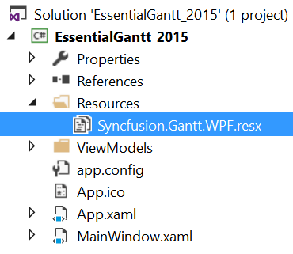
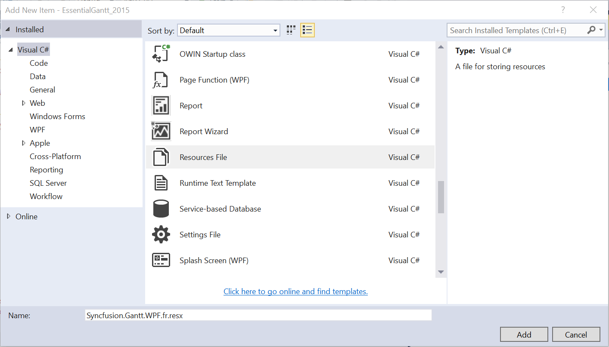
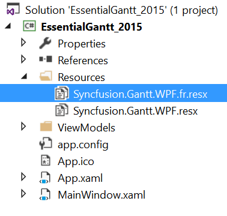
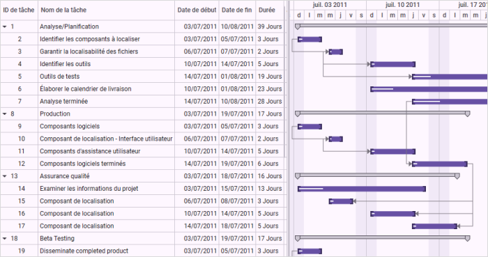

# Localization in WPF Gantt

Localization is the process of translating the application resources into different languages for the specific cultures. You can localize the [GanttControl](https://help.syncfusion.com/cr/wpf/Syncfusion.Windows.Controls.Gantt.GanttControl.html) by [adding a resource file](https://docs.microsoft.com/en-us/previous-versions/visualstudio/visual-studio-2010/aa992030(v=vs.100)). The application culture can be changed by setting `CurrentUICulture` and `CurrentCulture` before the `InitializeComponent()` method.

In the application below, the culture is configured to French language.



public MainWindow()
{
    System.Threading.Thread.CurrentThread.CurrentUICulture = new System.Globalization.CultureInfo("fr");

    System.Threading.Thread.CurrentThread.CurrentCulture = new System.Globalization.CultureInfo("fr");

    InitializeComponent();
}    



To localize the [GanttControl](https://help.syncfusion.com/cr/wpf/Syncfusion.Windows.Controls.Gantt.GanttControl.html) based on `CurrentUICulture` using resource files, follow the steps below.

1. Create a new folder named **Resources** in your application.
2. Add the default resource file of `GanttControl` into the **Resources** folder. You can download the Syncfusion.Gantt.WPF.resx [here](http://www.syncfusion.com/downloads/support/directtrac/general/ze/Resources-2137559261.zip).

3. Right-click on the Resources folder, select **Add** and then **NewItem**.

4. In the `Add New Item` wizard, select the **Resource File** option and name the file as **Syncfusion.Gantt.WPF.&lt;culture name&gt;.resx**.

For example, you have to give the name as **Syncfusion.Gantt.WPF.fr.resx** for the French culture.
 
5. The culture name indicates the name of the language and country.

6. Now, select the `Add` option to add the resource file in the **Resources** folder.

7. Add the Name/Value pair in Resource Designer of the **Syncfusion.Gantt.WPF.fr.resx** file and change its corresponding value to the corresponding culture.

You can download the sample for localization of the Gantt control from [here](http://www.syncfusion.com/downloads/support/directtrac/general/ze/Localization_Gantt-1030234357.zip)
