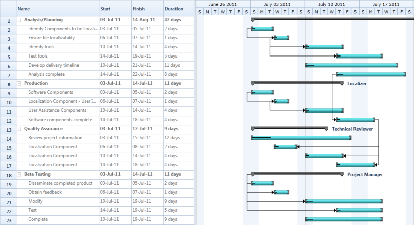

# WPF Gantt control Overview

Essential Gantt for WPF is a MS Project-like Project Viewer with built-in grid, schedule and resource assignment constraints. It is designed to assist project managers in developing plans, assigning resources to the task, tracking task progress and so on. Some of the key features of Gantt control are: drag support for increasing and decreasing the Start and Finish Date of the Task , Drag and Drop support for  the task within a row and automatic data synchronization between Grid and Chart. This also supports to import and export the Task Details as XML file.

## Real World Scenario

Research scholars, IT companies or any organization that following work breakdown structure can use Gantt control to schedule and track their tasks/ activities. This helps tracking the progress of an assignment. By tracking the progress one can change or reschedule the plan to achieve the goal.

