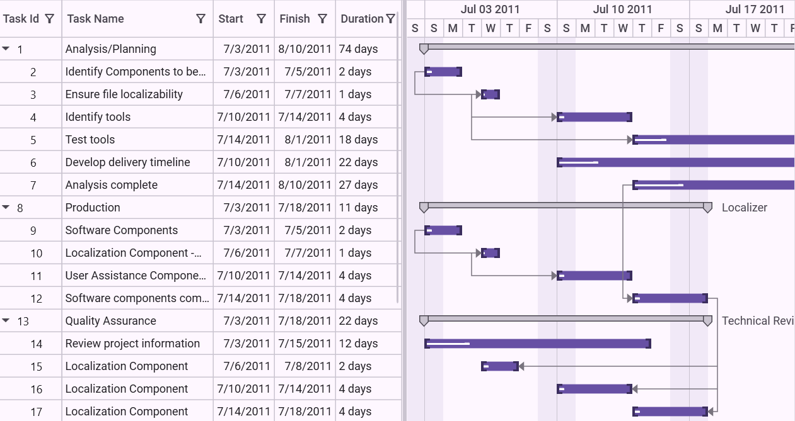

# About Syncfusion WPF Gantt Control

Essential Gantt for WPF is an MS Project-like Project Viewer with a built-in grid, schedule, and resource assignment constraints. It is designed to assist project managers in developing plans, assigning resources to tasks, tracking task progress, and more. Some of the key features of the Gantt control are: drag support for increasing and decreasing the start and finish dates of a task, drag-and-drop support for moving a task within a row, and automatic data synchronization between the grid and chart. It also supports importing and exporting task details as XML files.

## Real-World Scenario

Research scholars, IT companies, and any organization following a work breakdown structure can use the Gantt control to schedule and track their tasks and activities. This helps in tracking the progress of an assignment. By tracking the progress, one can change or reschedule the plan to achieve the goal.

