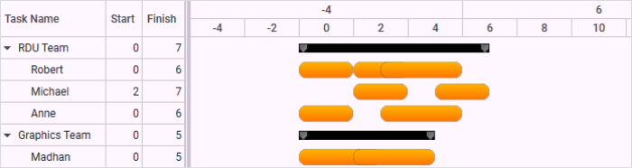
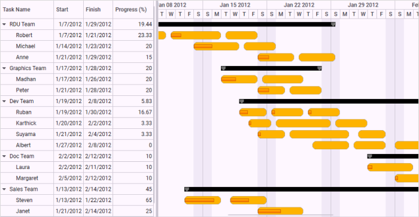

# Resource View Gantt Inline Items in WPF Gantt

By default, the Gantt chart will display a single node in a row. This helps you to manage the project. When you want to manage the resources in a project, you need multiple nodes in a single row. A Resource view Gantt enables you to manage the resources involved in a project.

In a normal Gantt, a node represents a task or activity of the project. In a resource view Gantt, the node represents task assigned to a resource. Multiple tasks assigned to a resource can be displayed in a single row. You can achieve this by using the mapping attribute of the [InLineTaskMapping](https://help.syncfusion.com/cr/wpf/Syncfusion.Windows.Controls.Gantt.TaskAttributeMapping.html#Syncfusion_Windows_Controls_Gantt_TaskAttributeMapping_InLineTaskMapping). 

Essential Gantt will listen to the dynamic inclusion of inline items and refresh the chart region.

The following code illustrates how to add inline items dynamically to the underlying collection.



//To add dynamic inline items
Item item = new Item() 
{ 
    StartDate = new DateTime(2012, 01, 19), 
    FinishDate = new DateTime(2012, 01, 25) 
};

viewModel.GanttItemSource[0].SubItems[0].InLineItems.Add(item);



## Use Case Scenarios

A resource view is very useful when you need to manage the resources in a project.

Example: A very big development project that contains multiple phases to complete the project. The management needs to track the status of the project. In this scenario, they can manage the project with a Resource view Gantt easily. The Resource view Gantt will show all the tasks in a single row that are assigned to a particular resource.

## Adding Inline Items to an Application 

You can populate a resource view Gantt by populating the collection of tasks in a single row by mapping the corresponding field in the underlying source to the [InLineTaskMapping](https://help.syncfusion.com/cr/wpf/Syncfusion.Windows.Controls.Gantt.TaskAttributeMapping.html#Syncfusion_Windows_Controls_Gantt_TaskAttributeMapping_InLineTaskMapping). 

You can populate a Resource view Gantt for both date-time schedules and numeric schedules. 

#### Resource View Gantt in a Custom Numeric Schedule

To populate a Resource view Gantt in a Custom Numeric Schedule:

1. Define the Gantt with a custom numeric schedule source. For more information about custom numeric schedules, visit the following link: <https://help.syncfusion.com/wpf/gantt/custom-schedule#custom-numeric>
2. You can populate the collection of tasks in a single row by mapping the corresponding field in the underlying source to the [InLineTaskMapping](https://help.syncfusion.com/cr/wpf/Syncfusion.Windows.Controls.Gantt.TaskAttributeMapping.html#Syncfusion_Windows_Controls_Gantt_TaskAttributeMapping_InLineTaskMapping).




<syncfusion:GanttControl x:Name="ganttControl"
                         ScheduleType="CustomNumeric"
                         CustomScheduleSource="{Binding CustomScheduleInfo}"
                         ItemsSource="{Binding Items}">
     <syncfusion:GanttControl.TaskAttributeMapping>
         <syncfusion:TaskAttributeMapping TaskNameMapping="Name"
                                          StartPointMapping="Start"
                                          ChildMapping="SubItems"
                                          FinishPointMapping="End"
                                          InLineTaskMapping="InLineItems" />
     </syncfusion:GanttControl.TaskAttributeMapping>
     <syncfusion:GanttControl.Resources>
     

    <!-- Task Node style-->
    
         

 <!-- Task Node style-->
 
        <Style TargetType="chart:GanttNode" BasedOn="{StaticResource TaskNode}" />
        <Style TargetType="chart:MileStone" BasedOn="{StaticResource MileStone}" />
    </syncfusion:GanttControl.Resources>
    <syncfusion:GanttControl.DataContext>
        <local:ViewModel/>
    </syncfusion:GanttControl.DataContext>
</syncfusion:GanttControl>





this.ganttControl.ItemsSource = new ViewModel().Items;

// Task attribute mapping
TaskAttributeMapping taskAttributeMapping = new TaskAttributeMapping();
taskAttributeMapping.TaskNameMapping = "Name";
taskAttributeMapping.StartPointMapping = "StartDate";
taskAttributeMapping.ChildMapping = "SubItems";
taskAttributeMapping.FinishPointMapping = "End";
taskAttributeMapping.InLineTaskMapping = "InLineItems";
this.ganttControl.TaskAttributeMapping = taskAttributeMapping;





 public class Item : NotificationObject
 {
    /// 

    /// Holds the name value.
    /// 

    string _name;

    /// 

    /// Holds the start date value.
    /// 

    DateTime _startDate;

    /// 

    /// Holds the end date value.
    /// 

    DateTime _finishDate;

    /// 

    /// Holds the progress value.
    /// 

    double _progress;

    /// 

    /// Holds the sub items.
    /// 

     ObservableCollection<Item> _subItems = new ObservableCollection<Item>();

    /// 

    /// Holds the inline items.
    /// 

     ObservableCollection<Item> _inLineItems = new ObservableCollection<Item>();

     /// 

     /// Initializes a new instance of the <see cref="Item"/> class.
     /// 

     public Item()
     {
        _subItems.CollectionChanged += ItemsCollectionChanged;
        _inLineItems.CollectionChanged += ItemsCollectionChanged;
     }

     /// 

     /// Gets or sets the name.
     /// 

     /// <value>The name.</value>
     public string Name
     {
         get
         {
             return this._name;
         }
         set
         {
             this._name = value;
             RaisePropertyChanged("Name");
         }
     }

     /// 

     /// Gets or sets the start date.
     /// 

     /// <value>The start date.</value>
     public DateTime StartDate
     {
         get
         {
             return this._startDate;
         }
         set
         {
             this._startDate = value;
             RaisePropertyChanged("StartDate");
         }
     }

     /// 

     /// Gets or sets the finish date.
     /// 

     /// <value>The finish date.</value>
     public DateTime FinishDate
     {
         get
         {
             return this._finishDate;
         }
         set
         {
             this._finishDate = value;
             RaisePropertyChanged("FinishDate");
         }
     }

     /// 

     /// Gets or sets the progress.
     /// 

     /// <value>The progress.</value>
     public double Progress
     {
         get
         {
             return Math.Round(this._progress, 2);
         }
         set
         {
             this._progress = value;
             RaisePropertyChanged("Progress");
         }
     }

     /// 

     /// Gets or sets the sub items.
     /// 

     /// <value>The sub items.</value>
     public ObservableCollection<Item> SubItems
     {
         get
         {
             return this._subItems;
         }
         set
         {
             this._subItems = value;

             this._subItems.CollectionChanged += ItemsCollectionChanged;

             if (value.Count > 0)
             {
                 this._subItems.ToList().ForEach(n =>
                 {
                     /// To listen the changes occuring in child task.
                     n.PropertyChanged += ItemPropertyChanged;
                 });
                 UpdateDates();
             }

             this.RaisePropertyChanged("SubItems");
         }
     }

     /// 

     /// Gets or sets the in line items.
     /// 

     /// <value>The in line items.</value>
     public ObservableCollection<Item> InLineItems
     {
         get
         {
             return this._inLineItems;
         }
         set
         {
             this._inLineItems = value;

             this._inLineItems.CollectionChanged += ItemsCollectionChanged;

             if (value.Count > 0)
             {
                 this._inLineItems.ToList().ForEach(n =>
                 {
                     /// To listen the changes occuring in child task.
                     n.PropertyChanged += ItemPropertyChanged;
                 });
                 UpdateDates();
             }

             this.RaisePropertyChanged("InLineItems");
         }
     }

     /// 

     /// Itemses the collection changed.
     /// 

     /// <param name="sender">The sender.</param>
     /// <param name="e">The <see cref="System.Collections.Specialized.NotifyCollectionChangedEventArgs"/> instance containing the event data.</param>
     void ItemsCollectionChanged(object sender, System.Collections.Specialized.NotifyCollectionChangedEventArgs e)
     {
         if (e.Action == NotifyCollectionChangedAction.Add)
         {
             foreach (Item item in e.NewItems)
             {
                 item.PropertyChanged += ItemPropertyChanged;
             }
         }
         else
         {
             foreach (Item item in e.OldItems)
             {
                 item.PropertyChanged -= ItemPropertyChanged;
             }
         }

         this.UpdateDates();
     }

     /// 

     /// Items the property changed.
     /// 

     /// <param name="sender">The sender.</param>
     /// <param name="e">The <see cref="System.ComponentModel.PropertyChangedEventArgs"/> instance containing the event data.</param>
     void ItemPropertyChanged(object sender, PropertyChangedEventArgs e)
     {
         if (e.PropertyName != null)
             if (e.PropertyName == "StartDate" || e.PropertyName == "FinishDate" || e.PropertyName == "Progress")
             {
                 UpdateDates();
             }
     }

     /// 

     /// Updates the dates.
     /// 

     private void UpdateDates()
     {
         var tempCal = 0d;

         if (_subItems.Count > 0)
         {
             /// Updating the start and end date based on the chagne occur in the date of child task
             StartDate = _subItems.Select(c => c.StartDate).Min();
             FinishDate = _subItems.Select(c => c.FinishDate).Max();
             Progress = (_subItems.Aggregate(tempCal, (cur, task) => cur + task.Progress)) / _subItems.Count;
         }

         if (_inLineItems.Count > 0)
         {
             /// Updating the start and end date based on the chagne occur in the date of child task
             StartDate = _inLineItems.Select(c => c.StartDate).Min();
             FinishDate = _inLineItems.Select(c => c.FinishDate).Max();
             Progress = (_inLineItems.Aggregate(tempCal, (cur, task) => cur + task.Progress)) / _inLineItems.Count;
         }
     }
 }





public class ViewModel
{
    /// 

    /// Holds the team details.
    /// 

    private ObservableCollection<Item> _teamDetails;

    /// 

    /// Initializes a new instance of the <see cref="ViewModel"/> class.
    /// 

    public ViewModel()
    {
        this._teamDetails = GetTeamInfo();
    }

    /// 

    /// Gets or sets the appointment item source.
    /// 

    /// <value>The appointment item source.</value>
    public ObservableCollection<Item> TeamDetails
    {
        get
        {
            return this._teamDetails;
        }
        set
        {
            this._teamDetails = value;
        }
    }

    /// 

    /// Gets the team info.
    /// 

    /// <returns>The teams</returns>
    public ObservableCollection<Item> GetTeamInfo()
    {
        DateTime dateTime = DateTime.Today;
        ObservableCollection<Item> teams = new ObservableCollection<Item>();

        teams.Add(new Item() { Name = "RDU Team" });
        Item person = new Item() { Name = "Robert" };
        person.InLineItems.Add(new Item() { StartDate = new DateTime(2012, 01, 07), FinishDate = new DateTime(2012, 01, 11), Name = "Market Analysis", Progress = 50d });
        person.InLineItems.Add(new Item() { StartDate = new DateTime(2012, 01, 11, 12, 0, 0), FinishDate = new DateTime(2012, 01, 17), Name = "Competitor Analysis", Progress = 20d });
        person.InLineItems.Add(new Item() { StartDate = new DateTime(2012, 01, 17, 12, 0, 0), FinishDate = new DateTime(2012, 01, 21), Name = "Design Spec" });
        teams[0].SubItems.Add(person);

        person = new Item() { Name = "Michael" };
        person.InLineItems.Add(new Item() { StartDate = new DateTime(2012, 01, 14), FinishDate = new DateTime(2012, 01, 19), Name = "Basic Requirement Analysis", Progress = 40 });
        person.InLineItems.Add(new Item() { StartDate = new DateTime(2012, 01, 19, 12, 0, 0), FinishDate = new DateTime(2012, 01, 23), Name = "Requirement Spec" });
        teams[0].SubItems.Add(person);

        person = new Item() { Name = "Anne" };
        person.InLineItems.Add(new Item() { StartDate = new DateTime(2012, 01, 21), FinishDate = new DateTime(2012, 01, 25), Name = "Estimation", Progress = 30 });
        person.InLineItems.Add(new Item() { StartDate = new DateTime(2012, 01, 25, 12, 0, 0), FinishDate = new DateTime(2012, 01, 29, 12, 0, 0), Name = "Budget & Plan Spec" });
        teams[0].SubItems.Add(person);

        teams.Add(new Item() { Name = "Graphics Team" });
        person = new Item() { Name = "Madhan" };
        person.InLineItems.Add(new Item() { StartDate = new DateTime(2012, 01, 17), FinishDate = new DateTime(2012, 01, 21), Name = "Identifying UI modules", Progress = 40 });
        person.InLineItems.Add(new Item() { StartDate = new DateTime(2012, 01, 21, 12, 0, 0), FinishDate = new DateTime(2012, 01, 26), Name = "Defining UI Design" });
        teams[1].SubItems.Add(person);

        person = new Item() { Name = "Peter" };
        person.InLineItems.Add(new Item() { StartDate = new DateTime(2012, 01, 21), FinishDate = new DateTime(2012, 01, 24), Name = "Designing Animagions", Progress = 40 });
        person.InLineItems.Add(new Item() { StartDate = new DateTime(2012, 01, 24, 12, 0, 0), FinishDate = new DateTime(2012, 01, 28), Name = "Completing Overall Graphics design" });
        teams[1].SubItems.Add(person);

        teams.Add(new Item() { Name = "Dev Team" });
        person = new Item() { Name = "Ruban" };
        person.InLineItems.Add(new Item() { StartDate = new DateTime(2012, 01, 19), FinishDate = new DateTime(2012, 01, 22), Name = "Analysis", Progress = 30 });
        person.InLineItems.Add(new Item() { StartDate = new DateTime(2012, 01, 22, 12, 0, 0), FinishDate = new DateTime(2012, 01, 26), Name = "Defining Modules", Progress = 10 });
        person.InLineItems.Add(new Item() { StartDate = new DateTime(2012, 01, 26, 12, 0, 0), FinishDate = new DateTime(2012, 01, 30), Name = "Development Plan", Progress = 10 });
        teams[2].SubItems.Add(person);

        person = new Item() { Name = "Karthick" };
        person.InLineItems.Add(new Item() { StartDate = new DateTime(2012, 01, 20), FinishDate = new DateTime(2012, 01, 22, 12, 0, 0), Name = "Analysis", Progress = 10 });
        person.InLineItems.Add(new Item() { StartDate = new DateTime(2012, 01, 23), FinishDate = new DateTime(2012, 1, 29), Name = "Module Development" });
        person.InLineItems.Add(new Item() { StartDate = new DateTime(2012, 01, 29, 12, 0, 0), FinishDate = new DateTime(2012, 02, 2), Name = "Self Testing" });
        teams[2].SubItems.Add(person);

        person = new Item() { Name = "Suyama" };
        person.InLineItems.Add(new Item() { StartDate = new DateTime(2012, 01, 21), FinishDate = new DateTime(2012, 01, 24), Name = "Analysis", Progress = 10 });
        person.InLineItems.Add(new Item() { StartDate = new DateTime(2012, 01, 24, 12, 0, 0), FinishDate = new DateTime(2012, 01, 31), Name = "Module Development" });
        person.InLineItems.Add(new Item() { StartDate = new DateTime(2012, 02, 1), FinishDate = new DateTime(2012, 02, 4), Name = "Self Testing" });
        teams[2].SubItems.Add(person);

        person = new Item() { Name = "Albert" };
        person.InLineItems.Add(new Item() { StartDate = new DateTime(2012, 01, 27), FinishDate = new DateTime(2012, 01, 31), Name = "Modules Integration" });
        person.InLineItems.Add(new Item() { StartDate = new DateTime(2012, 01, 31, 12, 0, 0), FinishDate = new DateTime(2012, 02, 4), Name = "Integration Testing" });
        person.InLineItems.Add(new Item() { StartDate = new DateTime(2012, 02, 5), FinishDate = new DateTime(2012, 02, 8, 12, 0, 0), Name = "Completeness" });
        teams[2].SubItems.Add(person);

        teams.Add(new Item() { Name = "Doc Team" });
        person = new Item() { Name = "Laura" };
        person.InLineItems.Add(new Item() { StartDate = new DateTime(2012, 02, 02), FinishDate = new DateTime(2012, 02, 07), Name = "User Guide Development", Progress = 10 });
        person.InLineItems.Add(new Item() { StartDate = new DateTime(2012, 02, 08), FinishDate = new DateTime(2012, 02, 11), Name = "Publishing User Guide", Progress = 10 });
        teams[3].SubItems.Add(person);

        person = new Item() { Name = "Margaret" };
        person.InLineItems.Add(new Item() { StartDate = new DateTime(2012, 02, 05), FinishDate = new DateTime(2012, 02, 08), Name = "Web Conetent Development", Progress = 10 });
        person.InLineItems.Add(new Item() { StartDate = new DateTime(2012, 02, 08, 12, 0, 0), FinishDate = new DateTime(2012, 02, 12), Name = "Publishing Web Conetent", Progress = 10 });
        teams[3].SubItems.Add(person);

        teams.Add(new Item() { Name = "Sales Team" });
        person = new Item() { Name = "Steven" };
        person.InLineItems.Add(new Item() { StartDate = new DateTime(2012, 01, 13), FinishDate = new DateTime(2012, 01, 17), Name = "Defining Target", Progress = 80 });
        person.InLineItems.Add(new Item() { StartDate = new DateTime(2012, 01, 18), FinishDate = new DateTime(2012, 01, 22), Name = "Defining Startegy", Progress = 50 });
        teams[4].SubItems.Add(person);

        person = new Item() { Name = "Janet" };
        person.InLineItems.Add(new Item() { StartDate = new DateTime(2012, 01, 21), FinishDate = new DateTime(2012, 01, 26), Name = "Collect Customers list", Progress = 50 });
        person.InLineItems.Add(new Item() { StartDate = new DateTime(2012, 02, 09), FinishDate = new DateTime(2012, 02, 14), Name = "Contacting Customer" });
        teams[4].SubItems.Add(person);
        return teams;
    }
}




Output

The following image shows the resultant output:

## Data Structure

The following is the data structure used to build a Resource view Gantt: 

* team holds information about the team. 
* SubItems of Team will hold the list of Resources in that particular team.
* InLineItems of each Resource will hold the tasks assigned to the particular resource.

## Information Displayed in Gantt

Grid Region:The grid will display only the information about the team and its resources (SubItems). It will not display the information about assigned tasks (InLineItems).

Chart Region: The chart will display only the information about the team and the tasks assigned to each resource in the team (InLineItems). It will not display the information about resources (SubItems).

## Sample Link

To view samples: 

1. Go to the Syncfusion Essential Studio installed location. 
    Location: Installed Location\Syncfusion\Essential Studio\{{ site.releaseversion }}\Infrastructure\Launcher\Syncfusion Control Panel 
2. Open the Syncfusion Control Panel in the above location (or) Double click on the Syncfusion Control Panel desktop shortcut menu.
3. Click Run Samples for WPF under User Interface Edition panel.
4. Select Gantt.
5. Expand the Data Binding item in the Sample Browser.
6. Choose the Resource View Gantt sample to launch. 

