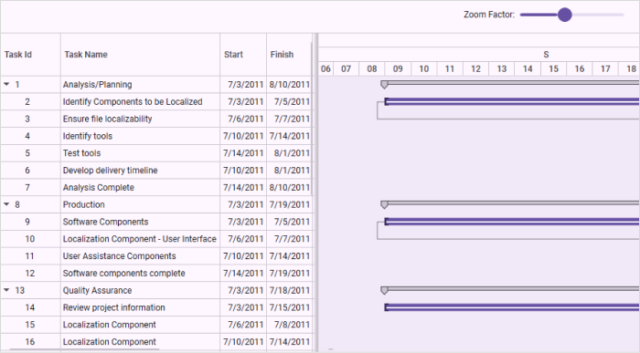
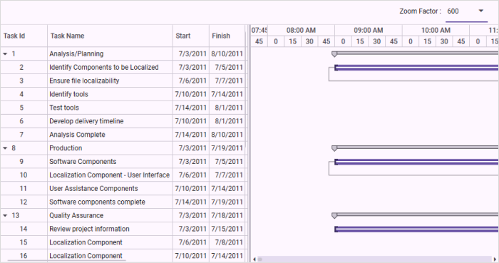

# Zooming in WPF Gantt

Zooming allows you to zoom in and zoom out of the schedule and chart of the Gantt control between year and minute time units. On zooming, the schedule’s time unit and schedule cell size will be dynamically changed based on the zoom factor. You can increase/decrease the width of the tasks in the chart based on the schedule’s time unit. Zooming can be categorized into two types: 

* Built-in zooming 
* Custom zooming

## Built-in Zooming

Built-in zooming allows you to zoom in and zoom out of the schedule rows. The built-in zoom options are handled by the Gantt control. The zoom operations take place dynamically based on the following zoom factors:

* Zoom-in: Zoom-in increases the cell size dynamically. When the cell size exceeds the specified range, it will split the schedule cells. When a cell cannot be split further, a new schedule row with the next time unit is added beneath the last row of the current schedule. The cell split-up and adding a new row inclusion is based on the zoom factor. 
* Zoom-out: Zoom-out decreases the cell size dynamically. When the cell size is within the specified range, it will merge the schedule cells. When the cells cannot be merged further, the last row of the current schedule is removed. Merging and removing a row is based on the zoom factor.

#### Adding Built-in Zooming to an Application

To add the built-in zooming:

1. Define the Gantt with initial values.
2. Set the [UseOnDemandSchedule](https://help.syncfusion.com/cr/wpf/Syncfusion.Windows.Controls.Gantt.GanttControl.html#Syncfusion_Windows_Controls_Gantt_GanttControl_UseOnDemandSchedule) API value as _true_. If need to set [BaseCellMinLength](https://help.syncfusion.com/cr/wpf/Syncfusion.Windows.Controls.Gantt.GanttControl.html#Syncfusion_Windows_Controls_Gantt_GanttControl_BaseCellMinLength) and [BaseCellMaxLength](https://help.syncfusion.com/cr/wpf/Syncfusion.Windows.Controls.Gantt.GanttControl.html#Syncfusion_Windows_Controls_Gantt_GanttControl_BaseCellMaxLength), the default value of these APIs are 20 and 40 respectively.
3. Use a slider or any control to provide the zoom factor dynamically. Bind the Gantt’s [ZoomFactor](https://help.syncfusion.com/cr/wpf/Syncfusion.Windows.Controls.Gantt.GanttControl.html#Syncfusion_Windows_Controls_Gantt_GanttControl_ZoomFactor) to that control value.





<Grid>
 <Grid.RowDefinitions>
     <RowDefinition Height="0.1*" />
     <RowDefinition Height="0.9*" />
 </Grid.RowDefinitions>

 <StackPanel Grid.Row="0"
             Orientation="Horizontal"
             HorizontalAlignment="Right"
             VerticalAlignment="Center">
     <Label Content="Zoom Factor:"
            VerticalAlignment="Center"
            FontSize="12" />
     <Slider x:Name="ZoomSlider"
             VerticalAlignment="Center"
             Margin="0,0,20,0"
             Minimum="80"
             Maximum="600"
             Value="100"
             Width="150"
             ValueChanged="OnSliderValueChanged" />
 </StackPanel>

 <syncfusion:GanttControl x:Name="ganttControl"
                          Grid.Row="1"
                          ItemsSource="{Binding TaskCollection}" 
                          UseOnDemandSchedule="True"
                          ZoomFactor="{Binding ElementName=ZoomSlider, Path=Value}">
     <syncfusion:GanttControl.TaskAttributeMapping>
         <syncfusion:TaskAttributeMapping TaskIdMapping="TaskId"
                                          TaskNameMapping="TaskName"
                                          StartDateMapping="StartDate"
                                          ChildMapping="Child"
                                          FinishDateMapping="FinishDate"
                                          DurationMapping="Duration"
                                          MileStoneMapping="IsMileStone"
                                          PredecessorMapping="Predecessor"
                                          ProgressMapping="Progress"/>
     </syncfusion:GanttControl.TaskAttributeMapping>
     <syncfusion:GanttControl.DataContext>
        <local:ViewModel/>
    </syncfusion:GanttControl.DataContext>
 </syncfusion:GanttControl>
 </Grid>





this.ganttControl.ItemsSource = new ViewModel().TaskCollection;
this.ganttControl.UseOnDemandSchedule = true;

// Task attribute mapping
TaskAttributeMapping taskAttributeMapping = new TaskAttributeMapping();
taskAttributeMapping.TaskIdMapping = "TaskId";
taskAttributeMapping.TaskNameMapping = "TaskName";
taskAttributeMapping.StartDateMapping = "StartDate";
taskAttributeMapping.ChildMapping = "Child";
taskAttributeMapping.FinishDateMapping = "FinishDate";
taskAttributeMapping.DurationMapping = "Duration";
taskAttributeMapping.MileStoneMapping = "IsMileStone";
taskAttributeMapping.PredecessorMapping = "Predecessor";
taskAttributeMapping.ProgressMapping = "Progress";
taskAttributeMapping.ResourceInfoMapping = "Resource";
this.ganttControl.TaskAttributeMapping = taskAttributeMapping;

/// Defining the Slider
Slider slider = new Slider();
slider.Minimum = 1;
slider.Minimum = 600;

//Hooking the value changed event of the slider
slider.ValueChanged += OnSliderValueChanged;

/// 

/// Handles the ValueChanged event of the slider control.
/// 

void OnSliderValueChanged(object sender, RoutedPropertyChangedEventArgs<double> e)
{
    //Changing the value of zoom factor
    this.ganttControl.ZoomFactor = (sender as Slider).Value;
}





 public class ViewModel
 {
    /// 

    /// Holds the task collections.
    /// 

    private ObservableCollection<TaskDetails> taskCollections;

    /// 

    /// Initializes a new instance of the <see cref="ViewModel"/> class.
    /// 

    public ViewModel()
    {
        this.taskCollections = GetData();
    }
    
    /// 

    /// Gets or sets the appointment item source.
    /// 

    /// <value>The appointment item source.</value>
    public ObservableCollection<TaskDetails> TaskCollection
    {
        get
        {
            return this.taskCollections;
        }
        set
        {
            this.taskCollections = value;
        }
    }

    /// 

    /// Gets the data.
    /// 

    /// <returns>The task details</returns>
    public  ObservableCollection<TaskDetails> GetData()
    {
        var taskDetails = new ObservableCollection<TaskDetails>();

        taskDetails.Add(new TaskDetails() { TaskId = 1, TaskName = "Analysis/Planning", StartDate = new DateTime(2011, 7, 3), FinishDate = new DateTime(2011, 7, 14), Progress = 40d });
        taskDetails[0].Child.Add((new TaskDetails() { TaskId = 2, TaskName = "Identify Components to be Localized", StartDate = new DateTime(2011, 7, 3), FinishDate = new DateTime(2011, 7, 5), Progress = 20d }));
        taskDetails[0].Child.Add((new TaskDetails() { TaskId = 3, TaskName = "Ensure file localizability", StartDate = new DateTime(2011, 7, 6), FinishDate = new DateTime(2011, 7, 7), Progress = 20d }));
        taskDetails[0].Child.Add((new TaskDetails() { TaskId = 4, TaskName = "Identify tools", StartDate = new DateTime(2011, 7, 10), FinishDate = new DateTime(2011, 7, 14), Progress = 10d }));
        taskDetails[0].Child.Add((new TaskDetails() { TaskId = 5, TaskName = "Test tools", StartDate = new DateTime(2011, 7, 14), FinishDate = new DateTime(2011, 8, 1), Progress = 10d }));
        taskDetails[0].Child.Add((new TaskDetails() { TaskId = 6, TaskName = "Develop delivery timeline", StartDate = new DateTime(2011, 7, 10), FinishDate = new DateTime(2011, 8, 1), Progress = 10d }));
        taskDetails[0].Child.Add((new TaskDetails() { TaskId = 7, TaskName = "Analysis Complete", StartDate = new DateTime(2011, 7, 14), FinishDate = new DateTime(2011, 8, 10), Progress = 10d }));

        taskDetails.Add(new TaskDetails() { TaskId = 8, TaskName = "Production", StartDate = new DateTime(2011, 7, 3), FinishDate = new DateTime(2011, 7, 14), Progress = 40d });
        taskDetails[1].Child.Add((new TaskDetails() { TaskId = 9, TaskName = "Software Components", StartDate = new DateTime(2011, 7, 3), FinishDate = new DateTime(2011, 7, 5), Progress = 20d }));
        taskDetails[1].Child.Add((new TaskDetails() { TaskId = 10, TaskName = "Localization Component - User Interface", StartDate = new DateTime(2011, 7, 6), FinishDate = new DateTime(2011, 7, 7), Progress = 20d }));
        taskDetails[1].Child.Add((new TaskDetails() { TaskId = 11, TaskName = "User Assistance Components", StartDate = new DateTime(2011, 7, 10), FinishDate = new DateTime(2011, 7, 14), Progress = 10d }));
        taskDetails[1].Child.Add((new TaskDetails() { TaskId = 12, TaskName = "Software components complete", StartDate = new DateTime(2011, 7, 14), FinishDate = new DateTime(2011, 7, 19), Progress = 10d }));

        taskDetails.Add(new TaskDetails() { TaskId = 13, TaskName = "Quality Assurance", StartDate = new DateTime(2011, 7, 3), FinishDate = new DateTime(2011, 7, 12), Progress = 40d, });
        taskDetails[2].Child.Add((new TaskDetails() { TaskId = 14, TaskName = "Review project information", StartDate = new DateTime(2011, 7, 3), FinishDate = new DateTime(2011, 7, 15), Progress = 20d }));
        taskDetails[2].Child.Add((new TaskDetails() { TaskId = 15, TaskName = "Localization Component", StartDate = new DateTime(2011, 7, 6), FinishDate = new DateTime(2011, 7, 8), Progress = 20d }));
        taskDetails[2].Child.Add((new TaskDetails() { TaskId = 16, TaskName = "Localization Component", StartDate = new DateTime(2011, 7, 10), FinishDate = new DateTime(2011, 7, 14), Progress = 10d }));
        taskDetails[2].Child.Add((new TaskDetails() { TaskId = 17, TaskName = "Localization Component", StartDate = new DateTime(2011, 7, 14), FinishDate = new DateTime(2011, 7, 18), Progress = 10d }));

        taskDetails.Add(new TaskDetails() { TaskId = 18, TaskName = "Beta Testing", StartDate = new DateTime(2011, 7, 3), FinishDate = new DateTime(2011, 7, 14), Progress = 40d });
        taskDetails[3].Child.Add((new TaskDetails() { TaskId = 19, TaskName = "Disseminate completed product", StartDate = new DateTime(2011, 7, 3), FinishDate = new DateTime(2011, 7, 5), Progress = 20d }));
        taskDetails[3].Child.Add((new TaskDetails() { TaskId = 20, TaskName = "Obtain feedback", StartDate = new DateTime(2011, 7, 6), FinishDate = new DateTime(2011, 7, 7), Progress = 20d }));
        taskDetails[3].Child.Add((new TaskDetails() { TaskId = 21, TaskName = "Modify", StartDate = new DateTime(2011, 7, 10), FinishDate = new DateTime(2011, 7, 19), Progress = 10d }));
        taskDetails[3].Child.Add((new TaskDetails() { TaskId = 22, TaskName = "Test", StartDate = new DateTime(2011, 7, 14), FinishDate = new DateTime(2011, 7, 19), Progress = 10d }));
        taskDetails[3].Child.Add((new TaskDetails() { TaskId = 23, TaskName = "Complete", StartDate = new DateTime(2011, 7, 10), FinishDate = new DateTime(2011, 7, 19), Progress = 10d }));

        taskDetails.Add(new TaskDetails() { TaskId = 24, TaskName = "Post-Project Review", StartDate = new DateTime(2011, 7, 3), FinishDate = new DateTime(2011, 7, 18), Progress = 40d, });
        taskDetails[4].Child.Add((new TaskDetails() { TaskId = 25, TaskName = "Finalize cost analysis", StartDate = new DateTime(2011, 7, 3), FinishDate = new DateTime(2011, 7, 5), Progress = 20d }));
        taskDetails[4].Child.Add((new TaskDetails() { TaskId = 26, TaskName = "Analyze performance", StartDate = new DateTime(2011, 7, 6), FinishDate = new DateTime(2011, 7, 7), Progress = 20d }));
        taskDetails[4].Child.Add((new TaskDetails() { TaskId = 27, TaskName = "Archive files", StartDate = new DateTime(2011, 7, 10), FinishDate = new DateTime(2011, 7, 14), Progress = 10d }));
        taskDetails[4].Child.Add((new TaskDetails() { TaskId = 28, TaskName = "Document lessons learned", StartDate = new DateTime(2011, 7, 14), FinishDate = new DateTime(2011, 7, 18), Progress = 10d }));
        taskDetails[4].Child.Add((new TaskDetails() { TaskId = 29, TaskName = "Distribute to team members", StartDate = new DateTime(2011, 7, 10), FinishDate = new DateTime(2011, 7, 14), Progress = 10d }));
        taskDetails[4].Child.Add((new TaskDetails() { TaskId = 30, TaskName = "Post-project review complete", StartDate = new DateTime(2011, 7, 10), FinishDate = new DateTime(2011, 7, 14), Progress = 10d }));

        taskDetails[0].Resources = new ObservableCollection<Resource>() { new Resource { ID = 1, Name = "John" }, new Resource { ID = 2, Name = "Neil" } };
        taskDetails[0].Child[3].Resources = new ObservableCollection<Resource>() { new Resource() { ID = 3, Name = "Peter" } };
        taskDetails[1].Resources = new ObservableCollection<Resource>() { new Resource() { ID = 4, Name = "David" } };

        taskDetails[0].Child[1].Predecessor.Add(new Predecessor() { GanttTaskIndex = 2, GanttTaskRelationship = GanttTaskRelationship.StartToStart });
        taskDetails[0].Child[2].Predecessor.Add(new Predecessor() { GanttTaskIndex = 3, GanttTaskRelationship = GanttTaskRelationship.StartToStart });
        taskDetails[0].Child[3].Predecessor.Add(new Predecessor() { GanttTaskIndex = 3, GanttTaskRelationship = GanttTaskRelationship.StartToStart });

        taskDetails[1].Child[1].Predecessor.Add(new Predecessor() { GanttTaskIndex = 9, GanttTaskRelationship = GanttTaskRelationship.StartToStart });
        taskDetails[1].Child[2].Predecessor.Add(new Predecessor() { GanttTaskIndex = 10, GanttTaskRelationship = GanttTaskRelationship.StartToStart });
        taskDetails[1].Child[3].Predecessor.Add(new Predecessor() { GanttTaskIndex = 7, GanttTaskRelationship = GanttTaskRelationship.StartToStart });

        taskDetails[2].Child[1].Predecessor.Add(new Predecessor() { GanttTaskIndex = 12, GanttTaskRelationship = GanttTaskRelationship.FinishToFinish });
        taskDetails[2].Child[2].Predecessor.Add(new Predecessor() { GanttTaskIndex = 12, GanttTaskRelationship = GanttTaskRelationship.FinishToFinish });
        taskDetails[2].Child[3].Predecessor.Add(new Predecessor() { GanttTaskIndex = 12, GanttTaskRelationship = GanttTaskRelationship.FinishToFinish });

        taskDetails[3].Child[1].Predecessor.Add(new Predecessor() { GanttTaskIndex = 18, GanttTaskRelationship = GanttTaskRelationship.StartToStart });
        taskDetails[3].Child[2].Predecessor.Add(new Predecessor() { GanttTaskIndex = 18, GanttTaskRelationship = GanttTaskRelationship.StartToStart });
        taskDetails[3].Child[3].Predecessor.Add(new Predecessor() { GanttTaskIndex = 19, GanttTaskRelationship = GanttTaskRelationship.StartToStart });

        taskDetails[4].Child[1].Predecessor.Add(new Predecessor() { GanttTaskIndex = 25, GanttTaskRelationship = GanttTaskRelationship.StartToStart });
        taskDetails[4].Child[2].Predecessor.Add(new Predecessor() { GanttTaskIndex = 28, GanttTaskRelationship = GanttTaskRelationship.StartToStart });
        taskDetails[4].Child[3].Predecessor.Add(new Predecessor() { GanttTaskIndex = 30, GanttTaskRelationship = GanttTaskRelationship.StartToStart });
        taskDetails[4].Child[4].Predecessor.Add(new Predecessor() { GanttTaskIndex = 27, GanttTaskRelationship = GanttTaskRelationship.StartToStart });
        return taskDetails;
    }
}




{{ codesnippet1 | OrderList_Indent_Level_1 }}

The following image shows Built-in Zooming in Gantt:

#### Samples Link

To view samples:

1. Go to the Syncfusion Essential Studio installed location. 
    Location: Installed Location\Syncfusion\Essential Studio\{{ site.releaseversion }}\Infrastructure\Launcher\Syncfusion Control Panel 
2. Open the Syncfusion Control Panel in the above location (or) Double click on the Syncfusion Control Panel desktop shortcut menu.
3. Click Run Samples for WPF under the User Interface Edition panel.
4. Select Gantt.
5. Expand the Interactive Features item in the Sample Browser.
6. Choose the Built-in Zooming to launch the sample.

## Custom Zooming

In custom zooming, everything is handled at the application level. You can change the schedule row information and cell size dynamically by handling the provided event handler. While the zooming is handled at the application level, built-in zooming will not work. You cannot use built-in zooming and custom zooming together. 

#### Use Case Scenarios

When you like to view tasks that are scheduled on a month unit in the day/hours unit, you have to restart the application by changing the schedule type to day/hours unit. Zooming allows you to easily zoom in on the day/hours unit by providing the zoom factor without restarting the application.

#### Adding Custom Zooming to an Application

To add custom zooming:

1. Define the Gantt with initial values.
2. Set the [UseOnDemandSchedule](https://help.syncfusion.com/cr/wpf/Syncfusion.Windows.Controls.Gantt.GanttControl.html#Syncfusion_Windows_Controls_Gantt_GanttControl_UseOnDemandSchedule) API value as true.
3. If needed, set [BaseCellMinLength](https://help.syncfusion.com/cr/wpf/Syncfusion.Windows.Controls.Gantt.GanttControl.html#Syncfusion_Windows_Controls_Gantt_GanttControl_BaseCellMinLength) and [BaseCellMaxLength](https://help.syncfusion.com/cr/wpf/Syncfusion.Windows.Controls.Gantt.GanttControl.html#Syncfusion_Windows_Controls_Gantt_GanttControl_BaseCellMaxLength). The default value of these APIs are 20 and 40 respectively.
4. Use any control to provide the zoom factor dynamically. Bind the Gantt’s [ZoomFactor](https://help.syncfusion.com/cr/wpf/Syncfusion.Windows.Controls.Gantt.GanttControl.html#Syncfusion_Windows_Controls_Gantt_GanttControl_ZoomFactor) to that control value.
5. Handle the [ZoomChanged](https://help.syncfusion.com/cr/wpf/Syncfusion.Windows.Controls.Gantt.GanttControl.html#Syncfusion_Windows_Controls_Gantt_GanttControl_ZoomChanged) event handler in code behind and change the schedule row information in that event handler as illustrated in the following code example:





<Grid>
 <Grid.RowDefinitions>
     <RowDefinition Height="0.1*" />
     <RowDefinition Height="0.9*" />
 </Grid.RowDefinitions>

<StackPanel Grid.Row="0" 
            HorizontalAlignment="Right" 
            Margin="0,0,20,0" 
            Orientation="Horizontal">
     <Label Content="Zoom Factor : " 
            VerticalAlignment="Center" 
            FontSize="12"/>
  <ComboBox x:Name="ZoomBox" 
            Width="75" 
            Height="40"
            ItemsSource="{Binding ZoomFactors}"
            SelectedItem="{Binding ZoomFactor}" />
</StackPanel>

 <syncfusion:GanttControl x:Name="ganttControl"
                          Grid.Row="1" 
                          ItemsSource="{Binding TaskCollection}" 
                          UseOnDemandSchedule="True"
                          ZoomFactor="{Binding ZoomFactor}"
                          ZoomChanged="OnGanttZoomChanged">
     <syncfusion:GanttControl.TaskAttributeMapping>
         <syncfusion:TaskAttributeMapping  TaskIdMapping="TaskId"
                                           TaskNameMapping="TaskName"
                                           StartDateMapping="StartDate"
                                           ChildMapping="Child"
                                           FinishDateMapping="FinishDate"
                                           DurationMapping="Duration"
                                           MileStoneMapping="IsMileStone"
                                           PredecessorMapping="Predecessor"
                                           ProgressMapping="Progress"/>
     </syncfusion:GanttControl.TaskAttributeMapping>
      <syncfusion:GanttControl.DataContext>
        <local:ViewModel/>
    </syncfusion:GanttControl.DataContext>
 </syncfusion:GanttControl>
 </Grid>




this.ganttControl.ItemsSource = new ViewModel().TaskCollection;
this.ganttControl.UseOnDemandSchedule = true;

// Task attribute mapping
TaskAttributeMapping taskAttributeMapping = new TaskAttributeMapping();
taskAttributeMapping.TaskIdMapping = "TaskId";
taskAttributeMapping.TaskNameMapping = "TaskName";
taskAttributeMapping.StartDateMapping = "StartDate";
taskAttributeMapping.ChildMapping = "Child";
taskAttributeMapping.FinishDateMapping = "FinishDate";
taskAttributeMapping.DurationMapping = "Duration";
taskAttributeMapping.MileStoneMapping = "IsMileStone";
taskAttributeMapping.PredecessorMapping = "Predecessor";
taskAttributeMapping.ProgressMapping = "Progress";
taskAttributeMapping.ResourceInfoMapping = "Resource";
this.ganttControl.TaskAttributeMapping = taskAttributeMapping;

private List<double> _zoomFactors  = new List<double> { 100d, 200d, 300d, 400d, 600d, 800d, 1000d };

/// 

/// Gets or sets the zoom factors.
/// 

/// <value>The zoom factors.</value>
public List<double> ZoomFactors
{
    get
    {
        return _zoomFactors;
    }
    set
    {
        _zoomFactors = value;
        this.OnPropertyChanged("ZoomFactors");
    }
}

private double _zoomFactor;

/// 

/// Gets or sets the zoom factor.
/// 

/// <value>The zoom factor.</value>
public double ZoomFactor
{
    get
    {
        return _zoomFactor;
    }
    set
    {
        _zoomFactor = value;
        this.OnPropertyChanged("ZoomFactor");
    }
}

/// Event Handler in code behind
/// 

/// Handles the ZoomChanged event of the Gantt control.
/// 

/// <param name="sender">The source of the event.</param>
/// <param name="args">The <see cref="Syncfusion.Windows.Controls.Gantt.ZoomChangedEventArgs"/> instance containing the event data.</param>
private void OnGanttZoomChanged(object sender, ZoomChangedEventArgs args)
{
    if (args.ZoomFactor == 100)
    {
        args.ScheduleHeaderInfo = new List<GanttScheduleRowInfo> 
        {
            new GanttScheduleRowInfo{ CellsPerUnit=1, TimeUnit= TimeUnit.Weeks },
            new GanttScheduleRowInfo{CellsPerUnit=1,TimeUnit = TimeUnit.Days, PixelsPerUnit= 20}
        };
    }
    else if (args.ZoomFactor == 200)
    {
        args.ScheduleHeaderInfo = new List<GanttScheduleRowInfo> 
        {
            new GanttScheduleRowInfo{ CellsPerUnit=1, TimeUnit= TimeUnit.Days, CellTextFormat ="ddd d MMM" },
            new GanttScheduleRowInfo{CellsPerUnit=12,TimeUnit = TimeUnit.Hours, PixelsPerUnit= 4, CellTextFormat="hh tt"}
        };
    }
    else if (args.ZoomFactor == 300)
    {
        args.ScheduleHeaderInfo = new List<GanttScheduleRowInfo> 
        {
            new GanttScheduleRowInfo{ CellsPerUnit=1, TimeUnit= TimeUnit.Days, CellTextFormat ="ddd d MMM"  },
            new GanttScheduleRowInfo{CellsPerUnit=6,TimeUnit = TimeUnit.Hours, PixelsPerUnit= 8, CellTextFormat="hh tt"}
        };
    }
    else if (args.ZoomFactor == 400)
    {
        args.ScheduleHeaderInfo = new List<GanttScheduleRowInfo> 
        {
            new GanttScheduleRowInfo{ CellsPerUnit=1, TimeUnit= TimeUnit.Days, CellTextFormat ="ddd d MMM"  },
            new GanttScheduleRowInfo{CellsPerUnit=1,TimeUnit = TimeUnit.Hours, PixelsPerUnit= 69, CellTextFormat="hh tt"}
        };
    }
    else if (args.ZoomFactor == 600)
    {
        args.ScheduleHeaderInfo = new List<GanttScheduleRowInfo> 
        {
            new GanttScheduleRowInfo{ CellsPerUnit=1, TimeUnit= TimeUnit.Hours, CellTextFormat="hh:mm tt" },
            new GanttScheduleRowInfo{CellsPerUnit=15,TimeUnit = TimeUnit.Minutes, PixelsPerUnit= 2}
        };
    }
    else if (args.ZoomFactor == 800)
    {
        args.ScheduleHeaderInfo = new List<GanttScheduleRowInfo> 
        {
            new GanttScheduleRowInfo{ CellsPerUnit=1, TimeUnit= TimeUnit.Hours, CellTextFormat="hh:mm tt" },
            new GanttScheduleRowInfo{CellsPerUnit=5,TimeUnit = TimeUnit.Minutes, PixelsPerUnit= 4}
        };
    }
    else if (args.ZoomFactor == 1000)
    {
        args.ScheduleHeaderInfo = new List<GanttScheduleRowInfo> 
        {
            new GanttScheduleRowInfo{ CellsPerUnit=1, TimeUnit= TimeUnit.Hours, CellTextFormat="hh:mm tt" },
            new GanttScheduleRowInfo{CellsPerUnit=1,TimeUnit = TimeUnit.Minutes, PixelsPerUnit= 20}
        };
    }

    args.Handled = true;
}





 public class ViewModel
 {
    /// 

    /// Holds the task collections.
    /// 

    private ObservableCollection<TaskDetails> taskCollections;

    /// 

    /// Initializes a new instance of the <see cref="ViewModel"/> class.
    /// 

    public ViewModel()
    {
        this.taskCollections = GetData();
    }
    
    /// 

    /// Gets or sets the appointment item source.
    /// 

    /// <value>The appointment item source.</value>
    public ObservableCollection<TaskDetails> TaskCollection
    {
        get
        {
            return this.taskCollections;
        }
        set
        {
            this.taskCollections = value;
        }
    }

    /// 

    /// Gets the data.
    /// 

    /// <returns>The task details</returns>
    public  ObservableCollection<TaskDetails> GetData()
    {
        var taskDetails = new ObservableCollection<TaskDetails>();

        taskDetails.Add(new TaskDetails() { TaskId = 1, TaskName = "Analysis/Planning", StartDate = new DateTime(2011, 7, 3), FinishDate = new DateTime(2011, 7, 14), Progress = 40d });
        taskDetails[0].Child.Add((new TaskDetails() { TaskId = 2, TaskName = "Identify Components to be Localized", StartDate = new DateTime(2011, 7, 3), FinishDate = new DateTime(2011, 7, 5), Progress = 20d }));
        taskDetails[0].Child.Add((new TaskDetails() { TaskId = 3, TaskName = "Ensure file localizability", StartDate = new DateTime(2011, 7, 6), FinishDate = new DateTime(2011, 7, 7), Progress = 20d }));
        taskDetails[0].Child.Add((new TaskDetails() { TaskId = 4, TaskName = "Identify tools", StartDate = new DateTime(2011, 7, 10), FinishDate = new DateTime(2011, 7, 14), Progress = 10d }));
        taskDetails[0].Child.Add((new TaskDetails() { TaskId = 5, TaskName = "Test tools", StartDate = new DateTime(2011, 7, 14), FinishDate = new DateTime(2011, 8, 1), Progress = 10d }));
        taskDetails[0].Child.Add((new TaskDetails() { TaskId = 6, TaskName = "Develop delivery timeline", StartDate = new DateTime(2011, 7, 10), FinishDate = new DateTime(2011, 8, 1), Progress = 10d }));
        taskDetails[0].Child.Add((new TaskDetails() { TaskId = 7, TaskName = "Analysis Complete", StartDate = new DateTime(2011, 7, 14), FinishDate = new DateTime(2011, 8, 10), Progress = 10d }));

        taskDetails.Add(new TaskDetails() { TaskId = 8, TaskName = "Production", StartDate = new DateTime(2011, 7, 3), FinishDate = new DateTime(2011, 7, 14), Progress = 40d });
        taskDetails[1].Child.Add((new TaskDetails() { TaskId = 9, TaskName = "Software Components", StartDate = new DateTime(2011, 7, 3), FinishDate = new DateTime(2011, 7, 5), Progress = 20d }));
        taskDetails[1].Child.Add((new TaskDetails() { TaskId = 10, TaskName = "Localization Component - User Interface", StartDate = new DateTime(2011, 7, 6), FinishDate = new DateTime(2011, 7, 7), Progress = 20d }));
        taskDetails[1].Child.Add((new TaskDetails() { TaskId = 11, TaskName = "User Assistance Components", StartDate = new DateTime(2011, 7, 10), FinishDate = new DateTime(2011, 7, 14), Progress = 10d }));
        taskDetails[1].Child.Add((new TaskDetails() { TaskId = 12, TaskName = "Software components complete", StartDate = new DateTime(2011, 7, 14), FinishDate = new DateTime(2011, 7, 19), Progress = 10d }));

        taskDetails.Add(new TaskDetails() { TaskId = 13, TaskName = "Quality Assurance", StartDate = new DateTime(2011, 7, 3), FinishDate = new DateTime(2011, 7, 12), Progress = 40d, });
        taskDetails[2].Child.Add((new TaskDetails() { TaskId = 14, TaskName = "Review project information", StartDate = new DateTime(2011, 7, 3), FinishDate = new DateTime(2011, 7, 15), Progress = 20d }));
        taskDetails[2].Child.Add((new TaskDetails() { TaskId = 15, TaskName = "Localization Component", StartDate = new DateTime(2011, 7, 6), FinishDate = new DateTime(2011, 7, 8), Progress = 20d }));
        taskDetails[2].Child.Add((new TaskDetails() { TaskId = 16, TaskName = "Localization Component", StartDate = new DateTime(2011, 7, 10), FinishDate = new DateTime(2011, 7, 14), Progress = 10d }));
        taskDetails[2].Child.Add((new TaskDetails() { TaskId = 17, TaskName = "Localization Component", StartDate = new DateTime(2011, 7, 14), FinishDate = new DateTime(2011, 7, 18), Progress = 10d }));

        taskDetails.Add(new TaskDetails() { TaskId = 18, TaskName = "Beta Testing", StartDate = new DateTime(2011, 7, 3), FinishDate = new DateTime(2011, 7, 14), Progress = 40d });
        taskDetails[3].Child.Add((new TaskDetails() { TaskId = 19, TaskName = "Disseminate completed product", StartDate = new DateTime(2011, 7, 3), FinishDate = new DateTime(2011, 7, 5), Progress = 20d }));
        taskDetails[3].Child.Add((new TaskDetails() { TaskId = 20, TaskName = "Obtain feedback", StartDate = new DateTime(2011, 7, 6), FinishDate = new DateTime(2011, 7, 7), Progress = 20d }));
        taskDetails[3].Child.Add((new TaskDetails() { TaskId = 21, TaskName = "Modify", StartDate = new DateTime(2011, 7, 10), FinishDate = new DateTime(2011, 7, 19), Progress = 10d }));
        taskDetails[3].Child.Add((new TaskDetails() { TaskId = 22, TaskName = "Test", StartDate = new DateTime(2011, 7, 14), FinishDate = new DateTime(2011, 7, 19), Progress = 10d }));
        taskDetails[3].Child.Add((new TaskDetails() { TaskId = 23, TaskName = "Complete", StartDate = new DateTime(2011, 7, 10), FinishDate = new DateTime(2011, 7, 19), Progress = 10d }));

        taskDetails.Add(new TaskDetails() { TaskId = 24, TaskName = "Post-Project Review", StartDate = new DateTime(2011, 7, 3), FinishDate = new DateTime(2011, 7, 18), Progress = 40d, });
        taskDetails[4].Child.Add((new TaskDetails() { TaskId = 25, TaskName = "Finalize cost analysis", StartDate = new DateTime(2011, 7, 3), FinishDate = new DateTime(2011, 7, 5), Progress = 20d }));
        taskDetails[4].Child.Add((new TaskDetails() { TaskId = 26, TaskName = "Analyze performance", StartDate = new DateTime(2011, 7, 6), FinishDate = new DateTime(2011, 7, 7), Progress = 20d }));
        taskDetails[4].Child.Add((new TaskDetails() { TaskId = 27, TaskName = "Archive files", StartDate = new DateTime(2011, 7, 10), FinishDate = new DateTime(2011, 7, 14), Progress = 10d }));
        taskDetails[4].Child.Add((new TaskDetails() { TaskId = 28, TaskName = "Document lessons learned", StartDate = new DateTime(2011, 7, 14), FinishDate = new DateTime(2011, 7, 18), Progress = 10d }));
        taskDetails[4].Child.Add((new TaskDetails() { TaskId = 29, TaskName = "Distribute to team members", StartDate = new DateTime(2011, 7, 10), FinishDate = new DateTime(2011, 7, 14), Progress = 10d }));
        taskDetails[4].Child.Add((new TaskDetails() { TaskId = 30, TaskName = "Post-project review complete", StartDate = new DateTime(2011, 7, 10), FinishDate = new DateTime(2011, 7, 14), Progress = 10d }));

        taskDetails[0].Resources = new ObservableCollection<Resource>() { new Resource { ID = 1, Name = "John" }, new Resource { ID = 2, Name = "Neil" } };
        taskDetails[0].Child[3].Resources = new ObservableCollection<Resource>() { new Resource() { ID = 3, Name = "Peter" } };
        taskDetails[1].Resources = new ObservableCollection<Resource>() { new Resource() { ID = 4, Name = "David" } };

        taskDetails[0].Child[1].Predecessor.Add(new Predecessor() { GanttTaskIndex = 2, GanttTaskRelationship = GanttTaskRelationship.StartToStart });
        taskDetails[0].Child[2].Predecessor.Add(new Predecessor() { GanttTaskIndex = 3, GanttTaskRelationship = GanttTaskRelationship.StartToStart });
        taskDetails[0].Child[3].Predecessor.Add(new Predecessor() { GanttTaskIndex = 3, GanttTaskRelationship = GanttTaskRelationship.StartToStart });

        taskDetails[1].Child[1].Predecessor.Add(new Predecessor() { GanttTaskIndex = 9, GanttTaskRelationship = GanttTaskRelationship.StartToStart });
        taskDetails[1].Child[2].Predecessor.Add(new Predecessor() { GanttTaskIndex = 10, GanttTaskRelationship = GanttTaskRelationship.StartToStart });
        taskDetails[1].Child[3].Predecessor.Add(new Predecessor() { GanttTaskIndex = 7, GanttTaskRelationship = GanttTaskRelationship.StartToStart });

        taskDetails[2].Child[1].Predecessor.Add(new Predecessor() { GanttTaskIndex = 12, GanttTaskRelationship = GanttTaskRelationship.FinishToFinish });
        taskDetails[2].Child[2].Predecessor.Add(new Predecessor() { GanttTaskIndex = 12, GanttTaskRelationship = GanttTaskRelationship.FinishToFinish });
        taskDetails[2].Child[3].Predecessor.Add(new Predecessor() { GanttTaskIndex = 12, GanttTaskRelationship = GanttTaskRelationship.FinishToFinish });

        taskDetails[3].Child[1].Predecessor.Add(new Predecessor() { GanttTaskIndex = 18, GanttTaskRelationship = GanttTaskRelationship.StartToStart });
        taskDetails[3].Child[2].Predecessor.Add(new Predecessor() { GanttTaskIndex = 18, GanttTaskRelationship = GanttTaskRelationship.StartToStart });
        taskDetails[3].Child[3].Predecessor.Add(new Predecessor() { GanttTaskIndex = 19, GanttTaskRelationship = GanttTaskRelationship.StartToStart });

        taskDetails[4].Child[1].Predecessor.Add(new Predecessor() { GanttTaskIndex = 25, GanttTaskRelationship = GanttTaskRelationship.StartToStart });
        taskDetails[4].Child[2].Predecessor.Add(new Predecessor() { GanttTaskIndex = 28, GanttTaskRelationship = GanttTaskRelationship.StartToStart });
        taskDetails[4].Child[3].Predecessor.Add(new Predecessor() { GanttTaskIndex = 30, GanttTaskRelationship = GanttTaskRelationship.StartToStart });
        taskDetails[4].Child[4].Predecessor.Add(new Predecessor() { GanttTaskIndex = 27, GanttTaskRelationship = GanttTaskRelationship.StartToStart });
        return taskDetails;
    }
}




{{ codesnippet2 | OrderList_Indent_Level_1 }}

The following image shows Custom Zooming in Gantt:

#### Samples Link

To view samples:

1. Go to the Syncfusion Essential Studio installed location. 
    Location: Installed Location\Syncfusion\Essential Studio\{{ site.releaseversion }}\Infrastructure\Launcher\Syncfusion Control Panel 
2. Open the Syncfusion Control Panel in the above location (or) Double click on the Syncfusion Control Panel desktop shortcut menu.
3. Click Run Samples for WPF under the User Interface Edition panel.
4. Select Gantt.
5. Expand the Interactive Features item in the Sample Browser.
6. Choose the Custom Zooming to launch the sample.

## Tables for Zooming Properties and Events

#### Properties

<table>
<tr>
<th>
Property </th><th>
Description </th><th>
Type </th><th>
Data Type </th></tr>
<tr>
<td>
{{'[UseOnDemandSchedule](https://help.syncfusion.com/cr/wpf/Syncfusion.Windows.Controls.Gantt.GanttControl.html#Syncfusion_Windows_Controls_Gantt_GanttControl_UseOnDemandSchedule)'| markdownify }}</td><td>
To get the expected performance you need to use dynamic schedule rendering. </td><td>
Dependency</td><td>
boolean</td></tr>
<tr>
<td>
{{'[BaseCellMaxLength](https://help.syncfusion.com/cr/wpf/Syncfusion.Windows.Controls.Gantt.GanttControl.html#Syncfusion_Windows_Controls_Gantt_GanttControl_BaseCellMaxLength)'| markdownify }}</td><td>
Splits the schedule cells by comparing the cell size with the API value on zooming-in </td><td>
Dependency</td><td>
double</td></tr>
<tr>
<td>
{{'[BaseCellMinLength](https://help.syncfusion.com/cr/wpf/Syncfusion.Windows.Controls.Gantt.GanttControl.html#Syncfusion_Windows_Controls_Gantt_GanttControl_BaseCellMinLength)'| markdownify }}</td><td>
Merges schedule cells by comparing the cell size with the API value on zooming-out</td><td>
Dependency</td><td>
double</td></tr>
<tr>
<td>
{{'[ZoomFactor](https://help.syncfusion.com/cr/wpf/Syncfusion.Windows.Controls.Gantt.GanttControl.html#Syncfusion_Windows_Controls_Gantt_GanttControl_ZoomFactor)'| markdownify }}</td><td>
Zooming takes place based on the ZoomFactor. The ZoomFactor should be greater than zero.</td><td>
Dependency</td><td>
double</td></tr>
</table>

#### Events

<table>
<tr>
<th>
Event </th><th>
Description </th><th>
Arguments </th><th>
Type </th></tr>
<tr>
<td>
{{'[ZoomChanged](https://help.syncfusion.com/cr/wpf/Syncfusion.Windows.Controls.Gantt.GanttControl.html#Syncfusion_Windows_Controls_Gantt_GanttControl_ZoomChanged)'| markdownify }}</td><td>
Event triggers when the zoom factor is changed. This can be handled in application level.</td><td>
ZoomChangedEventArgs</td><td>
Simple event </td></tr>
</table>