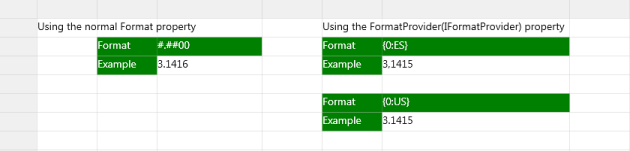
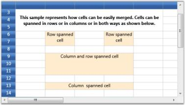

# Appearance

You can customize the appearance of the grid to the cell-level using our Grid properties. The following topics will guide in using those features:

* Cell Styles-This section discusses on various cell styles available with the grid
* Covered Ranges-This section elaborates on the adding covered ranges to the grid
* Banner Cells-This section discusses on steps to create banner cells

## Cell Styles

The EssentialGrid's cell style architecture plays an integral role in almost every aspect of Essential Grid. The display system hosts a powerful and complete Styles architecture. Settings can be specified at the cell level or at higher levels using parent styles that are referred to as Base Styles. Base Styles can affect a groups of cells. Cell level settings override any higher-level settings and enable easy customization to cell level. With this initial version, Syncfusion's core focus has been on the underlying architecture for displaying cells with virtualized cell editors to enable good performance characteristics.

Following are the two cell styles available:

### Volatile Cell Styles

QueryCellInfo will be raised the first time you access the contents of a cell with a call to Grid.Model[rowIndex, columnIndex] or when the grid calls this indexer internally before painting cells. The indexer returns an object of type GridStyleInfo. After querying the cell contents they remain cached in a volatile cache that holds weak references to the cell styles. This ensures that this data is available for reuse when needed. At the same time it does not stand in the way of the garbage collector if memory needs to be freed. Once a style gets garbage collected it will be removed from the volatile cache. You can manually force QueryCellInfo to be called again when you call GridControl.InvalidateCell(cell) or GridModel.VolatileCellStyles.Clear(cell). 

### Render Cell Styles

Prior to display of a cell, the PrepareRenderCell event is raised. This event is not raised from the Model. Instead it is raised from the GridControlBase directly. This has the advantage that if you want multiple grids to display the same Model, individual grids can override the cell contents individually.



// view specific cell color
grid.PrepareRenderCell += new GridPrepareRenderCellEventHandler(grid_PrepareRenderCell);
void grid_PrepareRenderCell(object sender, GridPrepareRenderCellEventArgs e)
{

    if (e.Cell.RowIndex > 0 && e.Cell.ColumnIndex > 0)
    {

        if (e.Cell.RowIndex % 2 == 0)
            e.Style.Background = Brushes.LightSkyBlue;
    }
}



PrepareRenderCell is used to initialize the so called RenderStyles. RenderStyles are of type GridRenderStyleInfo and derive from GridStyleInfo. GridRenderStyleInfo are tied to a GridControlBase instance. The render style provides additional properties to obtain access to the associated GridControl , CellRenderer and the underlying ModelStyle instance from the volatile cells cache described earlier.

To access the render style for a cell you can call GridControlBase.GetRenderStyleInfo.

Render Styles are created only for the cells that are visible and will be discarded the moment a cell is scrolled out of view (with the exception being if the current cell is scrolled out of view; they are retained in such case alone).

In contrast, Volatile Cell Styles from the GridModel are often also created for cells outside the viewable area and can stay in the cache even when a cell is scrolled out of view.

A basic understanding of this layered cell style architecture will help you understand and learn grid behaviors. This is particularly important when you are trying to modify or extend some existing functionality.

### GridStyleInfo class Overview

An EssentialGrid can be thought of as a rectangular table of grid cells. Each cell will contain distinct information and that can be displayed independently of other cells. Essential Grid uses GridStyleInfo object to store state information about the appearance of a grid cell. So attributes like the type of font, background color, cell value and cell type are all reflected in a single GridStyleInfo object.

Every cell in a grid may have such an object associated with it, giving the individual cell its unique appearance. It is not necessary that all cells should require fully populated GridStyleInfo objects stored in memory to function. And, for a given GridStyleInfo object, not all possible properties need to be populated in the object. So for example, a particular cell may or may not have a stored GridStyleInfo object, and if it does, this GridStyleInfo object may, or may not, contain a particular property such as font.

In general, when Essential Grid needs a cell's state information, usually to draw the cell, it uses an inheritance process to generate a GridStyleInfo from several parent styles. These parent styles are GridStyleInfo objects associated with particular grid entities:

* TableStyle is a single GridStyleInfo object associated with the entire grid. 
* RowStyles are GridStyleInfo objects associated with each row. 
* ColumnStyles are GridStyleInfo objects associated with each column. 

These three GridStyleInfo objects may not be fully populated, meaning that some properties may not have been set. However, there is a fourth parent style referred to as the StandardStyle, which is a fully populated style object comprising settings for every property.

Hence, when Essential Grid needs to generate a composite GridStyleInfo object for a particular cell, it first looks at any property that may be specifically set in the GridStyleInfo (if one exists) for the current cell. If properties are not set in the cell-specific GridStyleInfo object, Essential Grid will then pick up the RowStyles for the cell and will populate any property that was explicitly set in the RowStyle and not set in the cell-specific GridStyleInfo object. After adding unset properties to the composite GridStyleInfo from the RowStyle, it does the same for the ColumnStyle, the TableStyle and finally the StandardStyle. In this manner, Essential Grid comes up with a fully populated composite GridStyleInfo object to use.

The following graphic illustrates the effect of using the GridStyleInfo inheritance to come up with the appearance of a cell. Even though the BackColor property is set in each of the table style, RowStyle and ColumnStyle objects, it is the cell specific style that determines the background color of cell.

### Style Properties

Property settings for individual/groups of cells are stored in a GridStyleInfo property. The style allows you to set properties such as background, cell value, and cell type for a particular cell.

Essential Grid for WPF holds two different style caches that depend upon how the cell style is being used:

Volatile style-cache-Is maintained for styles populated through calls made to the QueryCellInfo (the virtual grid event that provides the cell values to the grid on demand) event. This volatile style-cache uses weak references to interact with the .NET Framework's Garbage collection to ensure optimal memory use. These styles remain cached as long as they are not garbage collected by the Framework.

Render style-cache-Is maintained for styles needed to draw the grid and are disposed of as soon as the cell scrolls out of view.
The combination of these two caches makes Essential Grid for WPF highly efficient. This section elaborates on important style properties.

#### Base Styles

Base Styles, otherwise named as Parent Styles, define the style information for individual cell groups such that all the cells belonging to a group will share the same Base style. On changing the common base style, the dependent cells styles also get updated automatically.

Following code snippet illustrates the effect of various Base styles.



//Defines the base styles named PinkStyle and GreenStyle.
GridBaseStyle baseStyle1 = new GridBaseStyle();
baseStyle1.Name = "PinkStyle";
baseStyle1.StyleInfo.Background = Brushes.LightPink;
baseStyle1.StyleInfo.Foreground = Brushes.Maroon;

GridBaseStyle baseStyle2 = new GridBaseStyle();
baseStyle2.Name = "GreenStyle";
baseStyle2.StyleInfo.Background = Brushes.PaleGreen;
baseStyle2.StyleInfo.Foreground = Brushes.Olive;

//Add the above styles to the grid base styles collection.
grid.Model.BaseStylesMap.Add(baseStyle1);
grid.Model.BaseStylesMap.Add(baseStyle2);

//Applying base styles.

for (int i = 1; i <= grid.Model.RowCount; i++)
{

   for (int j = 1; j <= grid.Model.ColumnCount; j++)
   {

        if(j ==2)
           grid.Model[i, j].BaseStyle = "PinkStyle";

        else
           grid.Model[i,j].BaseStyle = "GreenStyle";
   }
}



Output

The code above displays the following output:

#### Background

The Background property specifies a background brush for the grid cell. The cell’s background can be painted with either a solid brush or a gradient brush.

N> * Gradient-A gradient brush uses two colors. These colors merge to create a transition or fading effect. * Solid-A solid brush is equipped with only one color.

#### Setting Background Brush Type



this.grid.Model[2, 1].Background = Brushes.Aquamarine;
this.grid.Model[2, 2].Background = Brushes.Violet ;
this.grid.Model[2, 3].Background = Brushes.LawnGreen;
this.grid.Model[2, 4].Background = Brushes.LavenderBlush  ;
this.grid.Model[2, 5].Background = Brushes.CadetBlue ;
this.grid.Model[2, 6].Background = Brushes.LemonChiffon;
this.grid.Model[3, 1].Background = GetLinerBrush();
this.grid.Model[3, 2].Background = new LinearGradientBrush(Colors.Turquoise, Colors.White, 90.0);
this.grid.Model[3, 3].Background = new LinearGradientBrush(Colors.Firebrick, Colors.Orange, 90.0);
this.grid.Model[3, 4].Background = new LinearGradientBrush(Colors.CornflowerBlue, Colors.White, 0.0);
this.grid.Model[3, 5].Background = new LinearGradientBrush(Colors.Olive, Colors.PaleGreen, 0.0);
this.grid.Model[3, 6].Background = new LinearGradientBrush(Colors.Gold, Colors.Yellow, 90.0);



#### Output

The following output is generated using the code above.

#### Visual properties

The visual aspects of the cell text can be controlled by the following properties.

<table>
<tr>
<th>
Property Name</th><th>
Description</th></tr>
<tr>
<td>
Text</td><td>
Holds the text to be displayed in the cell</td></tr>
<tr>
<td>
Foreground</td><td>
Specifies text color</td></tr>
<tr>
<td>
Font</td><td>
Controls the font properties for the text in the cell</td></tr>
<tr>
<td>
Orientation</td><td>
Determines the angle of rotation of the text</td></tr>
</table>

1. Setting Text, Foreground and Font Properties




//Setting text, foreground and fonts
this.grid.Model[6, 1].Font.FontSize = 10;
this.grid.Model[6, 1].Text = "The quick brown fox jumps over the lazy dog";
this.grid.Model[6, 1].Foreground = Brushes.Gray;

this.grid.Model[7, 1].Font.FontSize = 12;
this.grid.Model[7, 1].Text = "The quick brown fox jumps over the lazy dog";
this.grid.Model[7, 1].Foreground = Brushes.Red;

this.grid.Model[8, 1].Font.FontSize = 14;
this.grid.Model[8, 1].Text = "The quick brown fox jumps over the lazy dog";
this.grid.Model[8, 1].Foreground = Brushes.Blue;

this.grid.Model[9, 1].Font.FontSize = 16;
this.grid.RowHeights[9] = 30d;
this.grid.Model[9, 1].Text = "The quick brown fox jumps over the lazy dog";
this.grid.Model[9, 1].Foreground = Brushes.Green;

//Setting font weights
this.grid.Model[6, 5].Font.FontWeight = FontWeights.Bold;
this.grid.Model[6, 5].HorizontalAlignment = HorizontalAlignment.Center;
this.grid.Model[6, 5].CellValue = "Font weight is Bold";

this.grid.Model[7, 5].Font.FontStyle  = FontStyles.Italic;
this.grid.Model[7, 5].HorizontalAlignment = HorizontalAlignment.Center;
this.grid.Model[7, 5].CellValue = "Font style is Italic";

this.grid.Model[8, 5].Font.FontStyle = FontStyles.Normal;
this.grid.Model[8, 5].HorizontalAlignment = HorizontalAlignment.Center;
this.grid.Model[8, 5].CellValue = "Font style is Normal";



#### Output

   The following output is generated using the code above.

   

2. Setting Cell Orientation



this.grid.Model[12, 1].Font.Orientation = 45;
this.grid.Model[12, 1].CellValue = "Angle 45";
this.grid.Model[12, 1].HorizontalAlignment = HorizontalAlignment.Center;
this.grid.Model[12, 1].VerticalAlignment = VerticalAlignment.Center;

this.grid.Model[12, 2].Font.Orientation = 90;
this.grid.Model[12, 2].CellValue = "Angle 90";
this.grid.Model[12, 2].HorizontalAlignment = HorizontalAlignment.Center;
this.grid.Model[12, 2].VerticalAlignment = VerticalAlignment.Center;

this.grid.Model[12, 3].Font.Orientation = 180;
this.grid.Model[12, 3].CellValue = "Angle 180";
this.grid.Model[12, 3].HorizontalAlignment = HorizontalAlignment.Center;
this.grid.Model[12, 3].VerticalAlignment = VerticalAlignment.Center;

this.grid.Model[12, 4].Font.Orientation = 270;
this.grid.Model[12, 4].CellValue = "Angle 270";
this.grid.Model[12, 4].HorizontalAlignment = HorizontalAlignment.Center;
this.grid.Model[12, 4].VerticalAlignment = VerticalAlignment.Center;

this.grid.Model[12, 5].Font.Orientation = 320;
this.grid.Model[12, 5].CellValue = "Angle 320";
this.grid.Model[12, 5].HorizontalAlignment = HorizontalAlignment.Center;
this.grid.Model[12, 5].VerticalAlignment = VerticalAlignment.Center;
this.grid.Model.RowHeights[12] = 50;



#### Output

   The following output is generated using the code above.

   

#### Borders

   Cell borders can be customized to have different color, thickness and style. It is possible to have different border styles for top, bottom, left and right borders for the same cell.

#### Setting Borders



this.grid.Model[15, 1].Borders.Bottom = new Pen(Brushes.Blue, 1);
this.grid.Model[15, 1].Borders.Top = new Pen(Brushes.Red, 1);
this.grid.Model[15, 1].Borders.Right = new Pen(Brushes.Purple,3);
this.grid.Model[15, 1].Borders.Left = new Pen(Brushes.RoyalBlue,1);

this.grid.Model[15, 2].Borders.Bottom = new Pen(Brushes.Turquoise, 1);
this.grid.Model[15, 2].Borders.Bottom.Thickness = 5;
this.grid.Model[15, 2].Borders.Top = new Pen(Brushes.LawnGreen, 1);
this.grid.Model[15, 2].Borders.Top.DashCap = PenLineCap.Round;
this.grid.Model[15, 2].Borders.Top.Thickness = 5;
this.grid.Model[15, 2].Borders.Right = new Pen(Brushes.SteelBlue, 3);
this.grid.Model[15, 2].Borders.Right.Thickness = 5;

this.grid.Model[15, 3].Borders.Bottom = new Pen(Brushes.IndianRed, 2);
this.grid.Model[15, 3].Borders.Bottom.DashStyle = DashStyles.DashDot;
this.grid.Model[15, 3].Borders.Top = new Pen(Brushes.Indigo, 2);
this.grid.Model[15, 3].Borders.Top.DashStyle = DashStyles.DashDot;
this.grid.Model[15, 3].Borders.Right = new Pen(Brushes.Gray, 3);
this.grid.Model[15, 3].Borders.Right.DashStyle = DashStyles.DashDot;

this.grid.Model[15, 4].Borders.Bottom = new Pen(Brushes.HotPink, 2);
this.grid.Model[15, 4].Borders.Top = new Pen(Brushes.DeepSkyBlue, 2);
this.grid.Model[15, 4].Borders.Right = new Pen(Brushes.Magenta, 3);
this.grid.Model[15, 4].Borders.Bottom.DashStyle = DashStyles.Dash;
this.grid.Model[15, 4].Borders.Top.DashStyle = DashStyles.Dash;
this.grid.Model[15, 4].Borders.Right.DashStyle = DashStyles.Dash;

this.grid.Model[15, 5].Borders.Bottom = new Pen(Brushes.Maroon, 2);
this.grid.Model[15, 5].Borders.Top = new Pen(Brushes.Olive, 2);
this.grid.Model[15, 5].Borders.Right = new Pen(Brushes.CadetBlue, 2);
this.grid.Model[15, 5].Borders.Bottom.DashStyle = DashStyles.Dot;
this.grid.Model[15, 5].Borders.Top.DashStyle = DashStyles.Dot;
this.grid.Model[15, 5].Borders.Right.DashStyle = DashStyles.Dot;

this.grid.Model[15, 6].Borders.Bottom = new Pen(Brushes.Chocolate, 4);
this.grid.Model[15, 6].Borders.Top = new Pen(Brushes.Crimson, 4);
this.grid.Model[15, 6].Borders.Right = new Pen(Brushes.DarkGoldenrod, 4);
this.grid.Model[15, 6].Borders.Bottom.DashStyle = DashStyles.DashDotDot;
this.grid.Model[15, 6].Borders.Top.DashStyle = DashStyles.DashDotDot;
this.grid.Model[15, 6].Borders.Right.DashStyle = DashStyles.DashDotDot;



#### Output

   The following output is generated using the code above.

   

   {:.prettyprint}

### Data Formats

Essential Grid allows the user to specify the format string for Text and DateTime cell values. The following table lists the various format strings supported.

<table>
<tr>
<th>
Text Formats</th><th>
Example with Cell Value = Math.PI</th></tr>
<tr>
<td>
0.00</td><td>
3.14</td></tr>
<tr>
<td>
C</td><td>
$3.14</td></tr>
<tr>
<td>
0.00;(0.00)</td><td>
3.14</td></tr>
<tr>
<td>
###0.##%</td><td>
314.16%</td></tr>
<tr>
<td>
#0.#E+00</td><td>
3L4E-01</td></tr>
<tr>
<td>
10:##,##0.#</td><td>
10.00,003.1</td></tr>
</table>

<table>
<tr>
<th>
DateTime</th><th>
Example with Cell Value = DateTime.Now</th></tr>
<tr>
<td>
d</td><td>
8/10/2009</td></tr>
<tr>
<td>
D</td><td>
Monday, August 10, 2009</td></tr>
<tr>
<td>
f</td><td>
Monday, August 10, 2009 7.00 AM</td></tr>
<tr>
<td>
dddd</td><td>
Monday, 10 August 2009</td></tr>
<tr>
<td>
t</td><td>
7.00 AM</td></tr>
<tr>
<td>
s</td><td>
2009-08-10T07:00:15</td></tr>
</table>

1. Setting text format



//Setting Text formats            
int rowIndex = 3;
int colIndex = 1;
GridModel model =  this.grid.Model; 

foreach (string format in new string[] 
{
	"0.00",
	"C",
	"0.00;(0.00)",
	"###0.##%",
	"#0.#E+00",
    "10:##,##0.#"
})
{
model[rowIndex - 1, colIndex].Text = format;
model[rowIndex  , colIndex].Format = format;
model[rowIndex , colIndex].CellValue = Math.PI;
model[rowIndex , colIndex].CellValueType = typeof(double);
rowIndex += 3;
}



2.Setting DateTime format



//Setting DateTime formats            
rowIndex = 2;
colIndex = 3;

foreach (string format in new string[] 
{
	"d",
	"D",
	"f",
	"dddd, dd MMMM yyyy",
	"t",
	"s"
})
{
	model[rowIndex - 1, colIndex].Text = format;
	grid.Model.ColumnWidths[colIndex] = 150d;
	model[rowIndex, colIndex].Format = format;
	model[rowIndex, colIndex].CellValue = DateTime.Now;
	model[rowIndex, colIndex].CellValueType = typeof(DateTime);
	rowIndex += 3;
}

   

#### Output

The following output is generated using the code above.

#### FormatProvider

The FormatProvider in GridStyleInfo is used to format the display text in the cells. The FormatProvider property supplies an object that provides formatting information for formatting operations. The formatting operations convert the value of a type to its string representation. The FormatProvider property allows the user to control the formatting of a particular cell.

#### Format using FormatProvider Property

In the Grid control, you can set the FormatProvider property as shown in the following code snippet.



this.grid.Model[row, col].CellValue = Math.PI;
this.grid.Model[row, col].Format = "{0:ES}";
this.grid.Model[row, col].FormatProvider = new CustomNumberFormat();

this.grid.Model[row, col].CellValue = Math.PI;
this.grid.Model[row, col].Format = "{0:US}";
this.grid.Model[row, col].FormatProvider = new CustomNumberFormat();


Me.grid.Model(row, col).CellValue = Math.PI
Me.grid.Model(row, col).Format = "{0:ES}"
Me.grid.Model(row, col).FormatProvider = new CustomNumberFormat()

Me.grid.Model(row, col).CellValue = Math.PI
Me.grid.Model(row, col).Format = "{0:US}"
Me.grid.Model(row, col).FormatProvider = new CustomNumberFormat()



The following example illustrates the use of a class that implements the IFormatProvider interface. 



public class CustomNumberFormat : IFormatProvider, ICustomFormatter
{
    private const int ACCT_LENGTH = 6;

    public object GetFormat(Type formatType)
    {

    if (formatType == typeof(ICustomFormatter))
        return this;

    else
        return null;
    }

    public string Format(string fmt, object arg, IFormatProvider formatProvider)
    {

        // Provide default formatting, if arg is not double.

        if (arg.GetType() != typeof(double))
            return HandleOtherFormats(fmt, arg);

        // Provide default formatting for unsupported format strings.
        string ufmt = fmt.ToUpper(CultureInfo.InvariantCulture);

        if (!(ufmt == "US" || ufmt == "ES"))
            return HandleOtherFormats(fmt, arg);

        // Convert argument to a string.
        string result = arg.ToString();

        if (ufmt == "ES")
        {
            CultureInfo esESCulture = CultureInfo.GetCultureInfo("es-ES");
            result = Convert.ToString(arg, esESCulture);
        }

        else
        {
            CultureInfo esUSCulture = CultureInfo.GetCultureInfo("es-US");
            result = Convert.ToString(arg, esUSCulture);
        }

        // If number is less than 6 characters, pad with leading zeroes.

        if (result.Length < ACCT_LENGTH)
            result = result.PadRight(ACCT_LENGTH, '0');

        // If number is more than 6 characters, truncate to 6 characters.

        if (result.Length > ACCT_LENGTH)
            result = result.Substring(0, ACCT_LENGTH);
            return result;
        }

    private string HandleOtherFormats(string format, object arg)
    {

        if (arg is IFormattable)
            return ((IFormattable)arg).ToString(format, CultureInfo.CurrentCulture);

        else if (arg != null)
            return arg.ToString();

        else
            return String.Empty;
    }
}



The CustomNumberFormat class converts the double value to string based on the culture specified in the format property.

The output is shown in the following screenshot:

## Covered Ranges

Covered Cells are cells that span over neighboring cells. The combined cells will act as if they are one single cell visually and programmatically. There are different possible options to form a covered range. You can combine the cells in adjacent rows or columns or both.

### Creating Covered Range



this.grid.Model.CoveredCells.Add (new CoveredCellInfo (6, 4, 7, 4));            
this.grid.Model.CoveredCells.Add (new CoveredCellInfo (6, 6, 7, 6));

cell = this.grid.Model[6, 4];
cell.CellValue = "Row spanned cell";
cell.Background = Brushes.BlanchedAlmond;
cell.HorizontalAlignment = HorizontalAlignment.Center;

cell = this.grid.Model[6, 6];
cell.CellValue = "Row spanned cell";
cell.HorizontalAlignment = HorizontalAlignment.Center;
cell.Background = Brushes.BlanchedAlmond;            

this.grid.Model.CoveredCells.Add (new CoveredCellInfo (9, 4, 11, 6));            

cell = this.grid.Model[9, 4];
cell.CellValue = "Column and row spanned cell";            
cell.HorizontalAlignment = HorizontalAlignment.Center;
cell.Background = Brushes.BlanchedAlmond;            

this.grid.Model.CoveredCells.Add (new CoveredCellInfo (13, 4, 13, 6));            

cell = this.grid.Model[13, 4];
cell.CellValue = "Column spanned cell";
cell.Background = Brushes.BlanchedAlmond;
cell.HorizontalAlignment = HorizontalAlignment.Center;



### Output

The following output is generated using the code above.



QueryCoveredRange event



## Banner Cells

You can create custom range of cells inside a Grid, which is termed as banner cells. Let us see how to create Banner Cells

### Cell Spanned Backgrounds

Essential Grid lets you span the given background across multiple cells either row-wise, column-wise or both. The information about all the cell spans for a given grid is maintained by the GridModel.CellSpanBackgrounds. Each entry represents an object of CellSpanBackgroundInfo class that defines a cell span. This class exposes properties such as background, border, and more to customize the cell span.

You can also trigger QueryCellSpanBackgrounds event to create and customize cell spans.

### Creating Cell Spans

This example creates three cell spans with gradient backgrounds and a fourth cell span with an image background created through the QueryCellSpanBackgrounds event.



CellSpanBackgroundInfo cellspan1 = new CellSpanBackgroundInfo(6, 2, 7, 4);
cellspan1.Background = new LinearGradientBrush(Colors.IndianRed, Colors.Orange, 90);
grid.Model.CellSpanBackgrounds.Add(cellspan1);

CellSpanBackgroundInfo cellspan2 = new CellSpanBackgroundInfo(6, 6, 7, 8);
cellspan2.Background = new LinearGradientBrush(Colors.Magenta, Colors.LightPink, 90);
grid.Model.CellSpanBackgrounds.Add(cellspan2);

CellSpanBackgroundInfo cellspan3 = new CellSpanBackgroundInfo(9, 4, 13, 6);
cellspan3.Background = new LinearGradientBrush(Colors.SteelBlue, Colors.LightSteelBlue, 90);
grid.Model.CellSpanBackgrounds.Add(cellspan3);

grid.QueryCellSpanBackgrounds += new GridQueryCellSpanBackgroundsEventHandler (grid_QueryCellSpanBackgrounds);

void grid_QueryCellSpanBackgrounds(object sender, GridQueryCellSpanBackgroundsEventArgs e)
{

    if (e.CellRowColumnIndex.ColumnIndex == 4 && e.CellRowColumnIndex.RowIndex == 15)
    {
        CellSpanBackgroundInfo item = new CellSpanBackgroundInfo(e.CellRowColumnIndex.RowIndex, e.CellRowColumnIndex.ColumnIndex, 20, 6);
        item.Background = new ImageBrush(GetImage(@"common\Images\Grid\BannerCells\back2.jpg"));
        e.Range = new List<CellSpanBackgroundInfo>();
        e.Range.Add(item);
        e.Handled = true;
    }
}



### Output

The following output is generated using the code above.



QueryCellSpanBackgrounds event



## Overlapping Cells 

Overlapping cells behavior occurs when the text exceeds the length of the cell and will float to the adjacent cell in non-editing mode. Flooding behavior specifies whether a previous cell can be allowed to float over the corresponding cell even if it is empty. Floating cell is to enable the cell to float over the next cell while editing despite of the flooding or overlapping behavior.

To assign the FloatingCell behavior to one particular cell or a certain range of cells

The FloatingCell behavior can be assigned to one particular cell or a certain range of cells as follows:



//Provided as CellStyle
grid.Model[4, 1].EnableFloatingCell = true;
grid.Model[4, 1].FloatCellMode = GridFloatCellsMode.OnDemandCalculation;
grid

//Provided as ColumnStyle
grid.Model.ColStyles[2].EnableFloatingCell = true;
grid.Model.ColStyles[2].FloatCellMode = GridFloatCellsMode.OnDemandCalculation;
grid.Model.ColStyles[2].FloodCell = false;

//Provided as TableStyle
grid.Model.Options.EnableFloatingCell = true;
grid.Model.Options.FloatCellMode = GridFloatCellsMode.OnDemandCalculation;
grid.Model.Options.FloodCell = false;



Properties, Methods and Events tables

### Properties

<table>
<tr>
<th>
Property </th><th>
Description </th><th>
Type </th><th>
Data Type </th><th>
Reference links </th></tr>
<tr>
<td>
EnableFloatCellFloatCellModeFloodCell</td><td>
This allows the user to float the cell while typing.This floats the cell in non-editing mode.When the user specifies the property as false it will not allow the previous cell to float over it.</td><td>
Static PropertyStatic PropertyStatic Property</td><td>
BooleanGridFloatCellsMode (enum type)Boolean</td><td>
</td></tr>
</table>

### Features of Overlapping Cells

### Overlapping Cells

To overlap the cell when it is not in edit mode and calculate according to the flooding and length of the text.



this.grid.Model.Options.FloatCellMode = GridFloatCellsMode.OnDemandCalculation; 



### Flooding

To prevent the overlapping of previous cells.



this.grid.Model.Options.FloodCell = false;



### Floating

To enable floating cell behavior by calculating while editing the text.



this.grid.Model.Options.EnableFloatingCell = true; 


