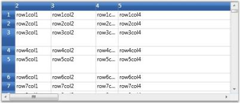
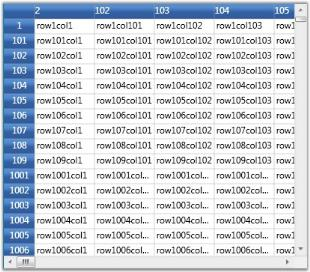
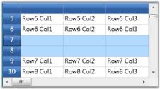
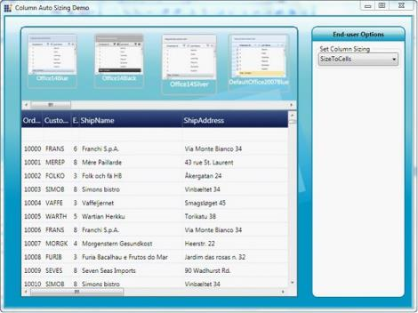
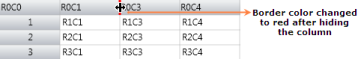
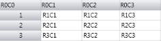

# Working with Grid

This section deals with essential features of Grid control, which are listed below:

* Controlling Rows and Columns-Discusses on row and column settings
* Drag-and-Drop Support-Describes drag-and-drop support available with the grid
* Clipboard Support-Elaborates on different clipboard operations
* Selection Modes-Discusses on different selection modes in a grid

## Controlling Rows and Columns

Each Grid instance is tied to a model, which contains the data represented by the Grid control. The grid model exposes properties that allow the user to manipulate grid rows and columns.

Setting Rows and Columns count

The grid model has RowCount and ColumnCount properties. These can be set to change the number of rows and columns in the grid control, as shown below:



// Set Row count
grid.Model.RowCount = 10;

// Set Column count
grid.Model.ColumnCount = 20;



### Setting Row Heights and Column Widths

The grid model also stores information on row heights and column widths. Its ColumnWidths and RowHeights properties can be changed using indexers as shown below:



// Setting column widths
grid.Model.ColumnWidths[0] = 30;
grid.Model.ColumnWidths[1] = 80;
grid.Model.ColumnWidths[2] = 100;
grid.Model.ColumnWidths[3] = 50;
grid.Model.ColumnWidths[4] = 250;

// Setting row heights
grid.Model.RowHeights[5] = 40;
grid.Model.RowHeights[3] = 40;



Setting Row heights and Column widths
{:.caption}

You can also specify the DefaultLineSize setting on ColumnWidths and RowHeights in order to set the default width or height.



grid.Model.RowHeights.DefaultLineSize = 20;
grid.Model.ColumnWidths.DefaultLineSize = 100;



### Hiding Rows and Columns

Essential Grid supports efficient hiding of rows and columns. You can hide and unhide ranges of rows and columns using SetHidden method on ColumnWidths and RowHeights.

N> SetHidden method accepts the following three parameters: 

* The first parameter is an integer, which specifies the starting row/column to hide/unhide_
* The second parameter is an integer, which specifies the ending row/column to hide/unhide_
* Third is a boolean parameter that determines whether to hide or unhide the specified number of rows or columns. The 
  rows/columns will be hidden when this parameter is set to true._

The following code illustrates the usage of SetHidden method:



// Hide rows
grid.Model.RowHeights.SetHidden(2, 100, true);
grid.Model.RowHeights.SetHidden(110, 1000, true);

// Unhide rows
grid.Model.RowHeights.SetHidden(1010, 10000, false);

//Hide columns
grid.Model.ColumnWidths.SetHidden(2, 100, true);
grid.Model.ColumnWidths.SetHidden(110, 150, true);

// Unhide columns
grid.Model.ColumnWidths.SetHidden(1010, 10000, false);



Hiding rows and columns
{:.caption}

### Freeze Rows and Columns

It is possible to fix any number of rows and columns so that they are still visible when a grid is scrolled. This feature is called as freezing. It can be achieved in the Grid by setting the FrozenRows and FrozenColumns properties of grid model, as shown below:



// Freeze rows and columns
grid.Model.FrozenRows = 4;
grid.Model.FrozenColumns = 3;



Frozen rows and columns
{:.caption}

You can also fix rows to the right of the grid and columns to the bottom. Such fixed rows and columns are referred to as Footer rows and Footer columns. The properties FooterRows and FooterColumns determine the number of footer rows and footer columns. The footer row or column can be customized by using the FooterStyle property.

The following code illustrates the usage of FooterRows, FooterColumns and FooterStyle properties:



// Footer rows and columns
grid.Model.FooterRows = 3;
grid.Model.FooterColumns = 1;
grid.Model.FooterStyle.Background = Brushes.LightCoral;



Footer rows and footer columns
{:.caption}

### Header Rows and Columns

Grid allows the user to have any number of header rows and columns. It is done by using the HeaderRows and HeaderColumns properties of the grid model. The HeaderStyle property of the grid model controls the appearance of these header rows and header columns.

The following code illustrates the usage of HeaderRows, HeaderColumns and HeaderStyle properties:



// Header rows and columns
grid.Model.HeaderRows = 3;
grid.Model.HeaderColumns = 2;
grid.Model.HeaderStyle.Font.FontStyle = FontStyles.Italic;



Header rows and header columns
{:.caption}

### Resize Rows and Columns

Grid allows the user to resize the rows and columns at run time. When this feature is enabled and if you move the mouse over the row or column divider, it will show a resize cursor using which you can resize the row or column to the required level. The following images illustrate the resizing of a column and a row:

Column Resizing
{:.caption}

Row Resizing
{:.caption}

This feature is turned on by default. To disable column or row resizing, you need to detach the corresponding mouse controllers from grid, as shown below:



IMouseController controller = grid.MouseControllerDispatcher.Find ("ResizeRowsMouseController");
grid.MouseControllerDispatcher.Remove(controller);
controller = grid.MouseControllerDispatcher.Find  ("ResizeColumnsMouseController");
grid.MouseControllerDispatcher.Remove(controller);



N> To prevent resizing of specific row or column, it is required to handle ResizingRows and ResizingColumns events.

### Inserting Rows and Columns

New columns and rows can be inserted at run time by using the following APIs:

* InsertColumns()
* InsertRows()

Both these methods accept the following two parameters: 

1. Position index 
2.  Number of rows or columns to insert

The following code illustrates the usage of InsertColumns and InsertRows methods:



//Insert a column at position 2.
grid.Model.InsertColumns(2, 1);

//Insert 2 rows at position 5.
grid.Model.InsertRows(5, 2);



Inserted new Column at index 2
{:.caption}

Inserted new Row at index 7
{:.caption}

N> You can track the moment the rows or columns are inserted by handling the RowsInserted and ColumnsInserted events.

### Moving Rows and Columns

The rows and columns can be rearranged dynamically by moving them from one position to another using the following APIs: 

* MoveRows()
* MoveColumns()

These methods accept the following three parameters: 

* Position from which the rows or columns should be removed
* Number of rows or columns
* The new position at which these rows or columns should be inserted

You can also achieve this by a simple drag-and-drop action on the desired rows and columns.

The following code illustrates the usage of MoveColumns and MoveRows methods:



//Move 3 rows from index 2 to index 5.
grid.Model.MoveRows(2, 3, 5);

//Move 2 columns from index 1 to index 4.
grid.Model.MoveColumns(1, 2, 4);



Moving rows and columns
{:.caption}

N> You can track the moment the rows or columns are moved by handling the RowsMoved and  ColumnsMoved event.

### Removing Rows and Columns

It is possible to remove a range of rows and columns from the grid. The APIs RemoveRows() and RemoveColumns() are used to achieve this. They accept two parameters:

1. An index, from which the rows or columns should be removed 
2. Total number of rows or columns to be removed

The following code illustrates the usage of RemoveColumns and RemoveRows methods:



//Remove 4 rows from position 3.
grid.Model.RemoveRows(3, 4);

//Remove 3 columns from position 2.
grid.Model.RemoveColumns(2, 3);



Removing columns 2, 3 and 4
{:.caption}

You can track the moment the rows or columns are inserted by handling the RowsRemoved and ColumnsRemoved events.

### AutoFit content

The rows heights and column widths can be made to adjust themselves automatically to fit the content by using the methods ResizeRowsToFit() and ResizeColumnsToFit(), which accept the following two parameters:

1. A range of rows or columns whose size should be adjusted 
2. A GridResizeToFitOptions enumeration value. 

The GridResizeToFitOptions enum value specifies how the resizing action should be performed; whether to include covered cells, hidden cells, headers, and whether or not to shrink size, and the like.

The following code illustrates the usage of ResizeRowsToFit and ResizeColumnsToFit methods:



//Auto fit column 3
grid.Model.ResizeColumnsToFit(GridRangeInfo.Col(3), GridResizeToFitOptions.NoShrinkSize);

//Auto fit row 2
grid.Model.ResizeRowsToFit(GridRangeInfo.Row(2), GridResizeToFitOptions.NoShrinkSize);



Auto fit Column 3
{:.caption}

Auto fit Row 2
{:.caption}

## Drag-and-Drop Support

Essential Grid for WPF provides support for drag-and-drop functionality. This feature enables the user to just click a column header and drag it to a new position. It is not required to select the column header for dragging. This is an easy way of rearranging the columns dynamically. You can enable or disable this feature using AllowDragColumns property of the Grid as follows:



//Allow column dragging
this.grid.AllowDragColumns = true;



The following image illustrates this feature:

Drag and Drop support
{:.caption}

In the above image, you can see the column header 1 being dragged to be placed before column 3.

## Clipboard Support

Essential Grid provides complete support for clipboard operations. End users can copy/cut & paste any data inside the grid and to or from other OLE [Object Linking and Embedding]-enabled applications such as Notepad. The built-in source allows us to copy the text data along with the style information and also provides hooks that let us customize the clipboard operation of pasting the custom formatted data.

### Copy Paste Options

CopyPasteOption property defines the list of clipboard operations supported by the grid. It exposes the following options:

* CopyText–Copies only the text from the grid selection to clipboard
* CopyCellData–Copies both text and style information from grid cells to clipboard
* PasteText–Pastes only the text from clipboard
* PasteCell–Pastes the cell text along with its style information from the clipboard
* CutText–Moves only the text from grid to clipboard
* CutCell–Moves the text and the style information from grid to clipboard
* ExcludeCurrentCell–Skips current cell while doing clipboard operations
* XmlCopyPaste – Copy the cell value along with basic styles in  XML format and supported to paste in Microsoft Excel. This also supports to copy the Formula value from the Grid Control and Paste in Microsoft Excel

### Example

Here are the sample code snippets that define certain copy paste behaviors.  



//Copy cell data with style
gridControl.Model.Options.CopyPasteOption |= CopyPaste.CopyCellData;

//Cut cell data with style
gridControl.Model.Options.CopyPasteOption |= CopyPaste.CutCell;

//Paste cell data with style
gridControl.Model.Options.CopyPasteOption |= CopyPaste.PasteCell;

//Code to cut copy paste cell text (excluding style)
gridControl.Model.Options.CopyPasteOption = (CopyPaste)(0);
gridControl.Model.Options.CopyPasteOption |= CopyPaste.CopyText;
gridControl.Model.Options.CopyPasteOption |= CopyPaste.CutText;
gridControl.Model.Options.CopyPasteOption |= CopyPaste.PasteText;



Pasting the grid data in Notepad
{:.caption}

### Text Data Exchange

GridModel.TextDataExchange helps you in customizing the clipboard operations. It is used as an interface that exposes the following property and methods.  

* Property-TabDelimiter
* Method-CopyTextToBuffer(), PasteTextFromBuffer()

The above attributes are discussed below in detail:

### TabDelimiter Property

This property specifies a delimiter for the text to be pasted. It can be used when you want to paste the cell data in CSV (Comma-Separated Values) format.



gridControl.Model.TextDataExchange.TabDelimiter = ",";



Pasting the grid data in CSV format
{:.caption}

### CopyTextToBuffer() Method

This method lets you place the cell data into an intermediate buffer, which can be customized. The method performs clipboard cut or copy operation depending on the third parameter given to it. This method accepts the following parameters:

* String buffer 
* Selected range of cells 
* Boolean value-This should be set to true for cut operation and should be set to false for copy operation.

The following code illustrates the CopyTextToBuffer method:



gridControl.Model.TextDataExchange.CopyTextToBuffer(out buffer, gridControl.Model.SelectedRanges, out row, out col, false);



### Result of this Method Call

It returns the following values:

* Cell text 
* No. of rows affected 
* No. of columns affected

### PasteTextFromBuffer() Method

The values returned by the CopyTextToBuffer method is passed as parameter to the PasteTextFromBuffer method using the below code: 



gridControl.Model.TextDataExchange.PasteTextFromBuffer(buffer, gridControl.Model.SelectedRanges);



### Result of this Method Call

It pastes the text from the given buffer into specified range of grid cells.

### Events

Grid provides the following events which are available for the end user to customize the clipboard data.

* ClipboardCanCopy
* ClipboardCanCut
* ClipboardCanPaste
* ClipboardCopy
* ClipboardCut
* ClipboardPaste

### IGridCopyPaste

Essential Grid defines an interface called IGridCopyPaste that exposes some methods, namely Copy(), Cut() and Paste(). Here the users can write custom code to perform cut copy or paste operations with any kind of user-defined data. Thereby, it extends its clipboard support behavior to perform clipboard operations in various forms.

For instance, let us consider performing the copy and paste operations in HTML format. The respective implementation of IGridCopyPaste is as follows:



class HtmlCopy : IGridCopyPaste
{

public void Copy(GridCellData gridData, GridRangeInfoList rangeList)
{
    IDataObject iData = null;
    iData = Clipboard.GetDataObject();
    string buffer = iData.GetData(DataFormats.UnicodeText) as string;
    int top = rangeList[0].Top;
    int left = rangeList[0].Left;
    int right = rangeList[0].Right;
    int bottom = rangeList[0].Bottom;
    string stylesheet = string.Empty;
	StringBuilder sb = new StringBuilder();
    GridStyleInfoStore gsis;
    GridStyleInfo style;
	sb.Append("<html><body><table border=1>");

    for (int row = top; row <= bottom; row++)
    {
        sb.Append("<tr>");

        for (int col = left; col <= right; col++)
        {
            gsis = gridData[row - top, col - left];
            style = new GridStyleInfo(gsis);
			stylesheet = "\"";

            if (style.HasBackground)
            {
                string backgroundColor = style.Background.ToString();
                backgroundColor = backgroundColor.Substring(3, backgroundColor.Length - 3);
                stylesheet = "\"background-color:" + backgroundColor;
            }

            if (style.HasForeground)
            {
                string foregroundColor = style.Foreground.ToString();
                foregroundColor = foregroundColor.Substring(3, foregroundColor.Length - 3);
                stylesheet = stylesheet + ";color:" + foregroundColor;
            }

            if (style.HasHorizontalAlignment)
            {
                stylesheet = stylesheet + ";text-align:" + style.HorizontalAlignment;
            }

            if (style.HasVerticalAlignment)
            {
                stylesheet = stylesheet + ";vertical-align:" + style.VerticalAlignment;
            }

           if (style.HasBorders)
            {
                string borderBrush;
                borderBrush = style.Borders.Left.Brush.ToString();
                borderBrush = borderBrush.Substring(3, borderBrush.Length - 3);
                stylesheet = stylesheet + ";border-left:solid  #" + borderBrush;
                borderBrush = style.Borders.Right.Brush.ToString();
                borderBrush = borderBrush.Substring(3, borderBrush.Length - 3);
                stylesheet = stylesheet + ";border-right:solid  #" + borderBrush;
                borderBrush = style.Borders.Bottom.Brush.ToString();
                borderBrush = borderBrush.Substring(3, borderBrush.Length - 3);
                stylesheet = stylesheet + ";border-bottom:solid  #" + borderBrush;
                borderBrush = style.Borders.Top.Brush.ToString();
                borderBrush = borderBrush.Substring(3, borderBrush.Length - 3);
                stylesheet = stylesheet + ";border-top:solid  #" + borderBrush;
            }
            stylesheet = stylesheet + "\"";

            if (!stylesheet.Equals("\"\""))
            {
                sb.Append(@"<td style=" + stylesheet + ">");
            }

            else
            {
                sb.Append(@"<td>");
            }

            if (!style.CellValue.ToString().Equals(""))
            {
                sb.Append(style.CellValue.ToString());
            }

            else
            {
                sb.Append("<pre>       </pre>");
            }
            sb.Append("</td>");
            stylesheet = string.Empty;
            }
            sb.Append("</tr>");
        }
        sb.Append("</table></body></html>");
        DataObject dataObject = new DataObject();
        dataObject.SetData(DataFormats.UnicodeText, sb.ToString());
        Clipboard.SetDataObject(dataObject);
    }

    public void Cut(GridCellData grodCellData, GridRangeInfoList rangeList)
    {
    }

    public DataObject Paste(GridRangeInfoList rangeList)
    {
        return new DataObject();
    }
}



The next step is to attach the above custom copy and paste operations to the grid control.



HtmlCopy htmlCopy = new HtmlCopy();
gridControl.Model.GridCopyPaste = htmlCopy;



Pasting the grid data in HTML format
{:.caption}



* [ClipboardCanCopy event](http://help.syncfusion.com/wpf/grid/events#clipboardcancopy)
* [ClipboardCanCut event](http://help.syncfusion.com/wpf/grid/events#clipboardcancut)
* [ClipboardCanPaste event](http://help.syncfusion.com/wpf/grid/events#clipboardcanpaste)
* [ClipboardCopy event](http://help.syncfusion.com/wpf/grid/events#clipboardcopy)
* [ClipboardCut event](http://help.syncfusion.com/wpf/grid/events#clipboardcut)
* [ClipboardPaste event](http://help.syncfusion.com/wpf/grid/events#clipboardpaste)



## Selection Modes

There are two modes of selection available in the Grid. They are,

* Model-Based Selection
* Record-Based Selection 

### Model-Based Selection

1. In Model-based selection, you will be able to select cell ranges; but the selections will have no knowledge of nested tables, grouping or sorting and hence the functionality is limited like a data bound grid (GridData control). 
2. To use the model selection capability, set AllowSelections to any flag except none.
3. Selection can be made through keyboard and mouse.

### Record-Based Selection 

1. It is designed specifically for the data bound grids.
2. In Record-based selection, the complete grid records (rows) will be selected and these selections function properly with nested tables, sorting, and so on. 
3. To use the record selections, you must set AllowSelections to none and then set ListBoxSelectionMode to any flag except none.
4. Selection can be made through keyboard and mouse with some restriction. For more details, see Record-based Selection in this topic.

Let us know more about these selection Modes.

### Model-Based Selection

Model-based selection is cell-based selection mode that allows you to do a selection across the cell, which is not possible with record-based selection. It can be set by initializing AllowSelection property to a Flag value, say, Row. 

N> Setting the Flag to None will disable selecting of cells.

The possible values for this type of selection are defined by the enum GridSelectionFlags. To control the selection behavior of the grid, set any of the following flags to the AllowSelection property. 

### Selection Flags

<table>
<tr>
<th>
Flag</th><th>
Description</th></tr>
<tr>
<td>
None</td><td>
Disables selecting of cells.</td></tr>
<tr>
<td>
Row</td><td>
Allows selection of rows.</td></tr>
<tr>
<td>
Column</td><td>
Allows selection of columns.</td></tr>
<tr>
<td>
Table</td><td>
Allows selection of the whole table.</td></tr>
<tr>
<td>
Cell</td><td>
Allows selection of an individual cell.</td></tr>
<tr>
<td>
Multiple</td><td>
Allows selection of multiple ranges of cells. The user has to press CTRL Key to select multiple ranges.</td></tr>
<tr>
<td>
Shift</td><td>
Allows extending existing selection when user holds SHIFT Key and clicks on a cell.</td></tr>
<tr>
<td>
Keyboard</td><td>
Allows extending existing selection when user holds SHIFT Key and presses arrow keys.</td></tr>
<tr>
<td>
MixRangeType</td><td>
Allows both rows and columns to be selected at the same time when Multiple is specified. By default, the grid does not allow row and column ranges to be selected at the same time.</td></tr>
<tr>
<td>
Any</td><td>
Allows selection of rows, columns, table, cell and multiple ranges of cells; also extends SHIFT Key support and alpha blending.</td></tr>
</table>

You can combine more than one flag to customize the current selection behavior.

### Example

Here is an example code snippet that sets the selection mode for selecting multiple columns.



grid.Model.Options.AllowSelection = GridSelectionFlags.Multiple | GridSelectionFlags.Column;



Selecting multiple Columns
{:.caption}

### Format Selections

It is possible to modify the appearance of the selection through property settings. The following properties work in combinations to produce some special effects.

<table>
<tr>
<th>
Property</th><th>
Description</th></tr>
<tr>
<td>
DrawSelectionOptions</td><td>
Defines the selection behavior for the grid. Important options are:AlphaBlendReplaceBackgroundReplaceTextColor</td></tr>
<tr>
<td>
HighlightSelectionAlphaBlend</td><td>
Specifies the alpha blend color used for selection.</td></tr>
<tr>
<td>
HighlightSelectionBackground</td><td>
Specifies the background color for selection.</td></tr>
<tr>
<td>
HighlightSelectionForeground</td><td>
Specifies the foreground color for selection.</td></tr>
</table>

Below code provides alpha blended selection:



LinearGradientBrush brush = new LinearGradientBrush(new GradientStopCollection()
{  
   new GradientStop(GridUtil.GetXamlConvertedValue<Color>("#A0E01020"), 0d),
   new GradientStop(GridUtil.GetXamlConvertedValue<Color>("#A0E01020"), 0.318681d),
   new GradientStop(GridUtil.GetXamlConvertedValue<Color>("#A0E08000"), 0.604396d),
   new GradientStop(GridUtil.GetXamlConvertedValue<Color>("#A0E08000"), 1d)
});
brush.StartPoint = new Point(0.5, -0.0430693);
brush.EndPoint = new Point(0.5, 0.928826);
grid.Model.Options.HighlightSelectionAlphaBlend = brush;
grid.Model.Options.DrawSelectionOptions = GridDrawSelectionOptions.AlphaBlend;



Alpha-blended selection
{:.caption}

Below code lets you set the background of the selection:



grid.Model.Options.DrawSelectionOptions = GridDrawSelectionOptions.ReplaceBackground;
grid.Model.Options.HighlightSelectionBackground = Brushes.LightBlue;



Selection Background set to blue
{:.caption}

Below code lets you set the foreground of the selection:



grid.Model.Options.DrawSelectionOptions = GridDrawSelectionOptions.ReplaceTextColor;
grid.Model.Options.HighlightSelectionForeground = Brushes.Red;



Foreground of the selection set to pink
{:.caption}

### Record-Based Selection

This type of selection mechanism allows selection in terms of record (entire row). It is not cell-based. This selection mode is specifically designed for a data-bound grid in which the grid data can be organized as a collection of record rows. 

Grid offers the following three types of record-based selections which are together called as List Box Selection Modes. 

* SelectionMode–One
* SelectionMode–MultiSimple
* SelectionMode-MultiExtended

To enable record-based selection, set the ListBoxSelectionMode property to any of the above specified List Box Selection Mode values. To enable list box selection, turn off the model-based selection by setting the AllowSelection property to Row. Below is a detailed description of List Box Selection Modes.

#### SelectionMode-One

It allows you to select only one item (record). Say, you have selected a record. Now if you select some other record, the previous record selection will be cleared. Hence it is a one record selection mode. The following code is used to set this mode:



grid.AllowSelection = GridSelectionFlags.Row;
grid.Model.Options.ListBoxSelectionMode = GridSelectionMode.One;



SelectionMode-one
{:.caption}

N> Record can be selected using a single mouse click or using UP or DOWN Arrow Keys

#### SelectionMode - MultiSimple

In this selection mode, you will be able to select multiple items individually. Say, you have selected a record using mouse and you want to select one more record. Click another record and you will notice that the previous selection is not cleared. You can hence select multiple records without the need of SHIFT or CTRL keys.

The following code is used to set this mode:



grid.AllowSelection = GridSelectionFlags.Row;
grid.Model.Options.ListBoxSelectionMode = GridSelectionMode.MultiSimple;



SelectionMode – MultiSimple
{:.caption}

N> It does not support the use of SHIFT, CTRL and arrow keys to extend the selection.

#### SelectionMode - MultiExtended

This selection type allows multiple items selection through SHIFT, CTRL and arrow keys. 

You can do any of the following when this selection mode is enabled:

* Select a record, hold down the SHIFT key and select fourth record, for example. You will notice all the records in between 1st and the 4th record are also selected. 
* You can make random selection by holding down the CTRL key. 
* Hold down the Shift key and select the records using the UP or DOWN ARROW keys.

The following code is used to set this mode:



grid.AllowSelection = GridSelectionFlags.Row;
grid.Model.Options.ListBoxSelectionMode = GridSelectionMode.MultiExtended;



SelectionMode - MultiExtended
{:.caption}

### The Model.Selections Collection

The entire grid selections are managed by the GridModel.Selections collection. It exposes several APIs that let you add, remove and operate on different grid selections. Below is the description of some important properties and APIs:

<table>
<tr>
<th>
Property/Method</th><th>
Description</th></tr>
<tr>
<td>
Add(), Remove()</td><td>
Adds or removes the specified range to/from the collection.</td></tr>
<tr>
<td>
InsertRows(), InsertColumns()</td><td>
Inserts new rows or columns into the collection.</td></tr>
<tr>
<td>
RemoveRows(), RemoveColumns()</td><td>
Removes the specified rows or columns from the collection.</td></tr>
<tr>
<td>
Ranges</td><td>
A GridRangeInfoList collection that stores all the selected ranges for the grid.</td></tr>
<tr>
<td>
SelectRange()</td><td>
Adds or removes a range to/from the collection.</td></tr>
<tr>
<td>
GetSelectedRanges()</td><td>
Retrieves a list of selected ranges and if there are no selected ranges, returns the current cell.</td></tr>
<tr>
<td>
GetSelectedRows()</td><td>
Returns the number of selected rows.</td></tr>
<tr>
<td>
GetSelectedCols()</td><td>
Returns the number of selected columns.</td></tr>
</table>

## ColumnBasedSizing

ColumnBasedSizing enables you to set width of visible columns based on available width. This feature is useful when column sizing is required for columns based on available width, cell content. Feature can be used when GridDataControl VisibleColumns are set individually with specific widths.

### Applying Width Value  

Columns are sized based on values users set. 

Allowed width values are:

* SizeToCells
* SizeToHeader
* Auto

N> You can also provide numeric values for *, where * can be preceded by any double value.

The following code illustrates how to set the Width property of GridDataVisibleColumn.



Width Value set to Star:
<syncfusion:GridDataVisibleColumn MappingName="OrderID" Binding="{Binding OrderID}" Width="1.2*"/>

Width value set to “Double”
<syncfusion:GridDataVisibleColumn MappingName="CustomerID" Width="40" >
</syncfusion:GridDataVisibleColumn>

Width value set to “SizeToCells”                   
<syncfusion:GridDataVisibleColumn MappingName="EmployeeID" Width="SizeToCells" Binding="{Binding EmployeeID}"/>

Width value set to "SizeToHeader”
<syncfusion:GridDataVisibleColumn MappingName="ShipName" Width="SizeToHeader" Binding="{Binding ShipName}"/>
</syncfusion:GridDataControl.VisibleColumns>



Define the Width, by using the following code.



Width = new GridDataControlLength(value, GridControlLengthUnitType.Star); 

//(or)
Width = new GridDataControlLength(value); 



Customized width of GridDataVisibleColumn
{:.caption}

### Property Details

The following table consists of the property details.

<table>
<tr>
<th>
Name of the Property</th><th>
Description</th><th>
Type of Property</th><th>
Value It Accepts</th><th>
Property Syntax</th></tr>
<tr>
<td>
ActualWidth</td><td>
GridDataVisibleColumn’s actual width in double value. Users can only get the value.</td><td>
Normal</td><td>
Double</td><td>
VisibleColumn.ActualWidth  </td></tr>
<tr>
<td>
Width</td><td>
Holds the width value for GridDataVisibleColumn  in units of GridDataControlLength  </td><td>
Dependency property</td><td>
GridDataControlLength</td><td>
visibleColumn.Width=new GridDataControlLength(value, GridControlLengthUnitType);</td></tr>
<tr>
<td>
MaxLength</td><td>
Holds the value for maximum records to be considered while calculating cell content size. Default value is 1000. Set as -1 to consider all values.</td><td>
Normal</td><td>
int</td><td>
MaxLength</td></tr>
</table>

## Excel Like Drag and Drop

The Excel-like Drag and Drop feature enables dragging content with their styles from cells to different locations and grids.

You can use this feature to copy data to one or more locations.

You can use this feature by using the following code:



this.grid.AllowDragDrop = true;
this.grid.Model.Options.DataObjectConsumerOptions = GridDataObjectConsumerOptions.Styles;



Excel Like Drag and Drop has the following features:

* Uses IDataObject to copy, store, and retrieve data. 
* Uses DragDrop API, which is available in WPF, to initiate drag-and-drop.

### Property

<table>
<tr>
<th>
Name of the Property</th><th>
Description</th><th>
Type of Property </th><th>
Value it Accepts</th><th>
PropertySyntax</th></tr>
<tr>
<td>
AllowDragDrop</td><td>
Allows dragging and dropping content and enables ExcelLike MouseController, which helps in the drag-and-drop operation.</td><td>
Normal</td><td>
Boolean</td><td>
 this.grid.AllowDragDrop = true;</td></tr>
<tr>
<td>
GridDataObjectConsumerOptions</td><td>
Gets or sets the enum value for the DragDrop Consumer Option.</td><td>
Normal</td><td>
Enum</td><td>
this.grid.Model.Options.DataObjectConsumerOptions = GridDataObjectConsumerOptions.Styles;</td></tr>
<tr>
<td>
DragDropDropTargetFlags</td><td>
Gets or sets the enum value for values that can be copied or moved and provides other options for DragDropTargetFlags.</td><td>
Normal</td><td>
Enum</td><td>
this.grid.Model.Options.DragDropDropTargetFlags</td></tr>
</table>

### Event

<table>
<tr>
<th>
When is the event triggered?</th><th>
How is it handled?</th><th>
Method (event handler) that handles the event?</th><th>
What are the event args associated?</th><th>
Purpose of the Event</th></tr>
<tr>
<td>
Occurs when the user releases the mouse over a cell at the end of an OLE drag-and-drop operation and before the data is applied to the grid.</td><td>
Handled by setting the Handled flag as True.</td><td>
GridOleDropAtRowColEventHandler</td><td>
GridOleDropAtRowColEventArgs</td><td>
This event allows you to customize the paste data behavior.</td></tr>
<tr>
<td>
The event is initiated when the user rolls the mouse over the edge of a selected range.</td><td>
You can disallow the specified range to be used as the OLE Data Source when assigning true to “Cancel” flag.</td><td>
GridExcelLikeDragRangeEventHandler</td><td>
GridQueryCanDragRangeEventArgs</td><td>
GridQueryCanOleDragRangeEventArgs is a custom event argument class used by the GridControlBase.QueryCanOleDragRange event to determine if a specified range can serve as an OLE drag source.</td></tr>
<tr>
<td>
This event is initiated when a user drags a range of selected cells by using the OLE drag-and-drop.</td><td>
Handled by setting the Handled flag as True.</td><td>
GridQueryOleDataSourceDataEventHandler</td><td>
GridQueryOleDataSourceDataEventArgs</td><td>
This event allows you to provide customized clipboard formats or add support for pasting the additional clipboard content.</td></tr>
</table>

## Excel like Resizing Support

Essential Grid control supports Excel like resizing to hide or unhide columns. It also acts as a visual marker to indicate hidden columns.

### Use Case Scenarios

This feature can be implemented for application which contains more rows and columns. You can also make some rows and columns to be hidden.

### Adding Resizing Support to an Application 

This topic explains how to implement the Resizing support to an application. The following steps explain the implementation of the Resizing support to an application. 

1. Set the Resizing border properties
2. Resizing is a built-in property and there is no need to set any special property to enable it. But there are options to 
   set the hidden border color and thickness. Set the HiddenBorderBrush property to any color of the brush for the Model object.  The assigned color will be brushed in the border color of the hidden column or row. Set the HiddenBorderThickness property to an int value say 3. 

The following code snippet explains the implementation of the HiddenBorderBrush and HiddenBorderThickness properties.



this.gridControl.Model.HiddenBorderBrush = Brushes.Red ;
this.gridControl.Model.HiddenBorderThikness = 3; 


Me.gridControl.Model.HiddenBorderBrush = Brushes.Red
Me.gridControl.Model.HiddenBorderThikness = 3



### Run the application

To set the rows or columns as hidden by code, you can use the SetHidden() method. It has two int type parameters to get “from Index” and “to Index”, a Boolean type which sets True for hide and False for unhide. Run the application and you will find the given rows or columns to be hidden. 

The following code snippet explains the implementation of the SetHidden() method of ColumnWidths and RowHeights property.



// To hide columns and rows.
this.gridControl.ColumnWidths.SetHidden(3, 4, true);
this.gridControl.RowHeights.SetHidden(3, 4, true);

// To unhide columns and rows.
this.gridControl.ColumnWidths.SetHidden(3, 4, false);
this.gridControl.RowHeights.SetHidden(3, 4, false);


// To hide columns and rows.
Me.gridControl.ColumnWidths.SetHidden(3, 4, True)
Me.gridControl.RowHeights.SetHidden(3, 4, True)

// To unhide columns and rows.
Me.gridControl.ColumnWidths.SetHidden(3, 4, False)
Me.gridControl.RowHeights.SetHidden(3, 4, False)



The following is a sample output of Resizing support implementation.

Row index and Column index for 3 and 4 are hidden
{:.caption}

### Hide and unhide a rows or Columns during run-time.

To hide a column or a row, hover at the line of the column or row. It shows a resizing cursor with a single bar so that you can drag the line to its next header cell. After joining to the neighbor Header Cell, the line will be darkened which means that a column or a row is hidden. To unhide the hidden rows or columns, hover on the dark marked line. The cursor will then be changed to a double bar and by double clicking, l the hidden rows or columns can be resized to its original size.

The following screenshot explains how to hide and unhide a Column.

Hover over the header cell’s border line. The cursor will be changed to single bar, as like in the following screenshot.

Hover on the border line of a header
{:.caption}

Drag it to Column 2 so that the Border color changes as like in the following screenshot.

After dragging and joining the border line to the neighbor cell
{:.caption}

The following image shows the output after hiding the row by Mouse Dragging.

Output of the hidden column to the neighbor cell
{:.caption}

To unhide the hidden row, hover the mouse on the hidden column border line. A double bar cursor will then be displayed as in the following screenshot.

Hover on the hidden Column the Cursor changes to double bar
{:.caption}

Double clicking on it will unhide all the hidden columns in that particular hidden column.

After double clicking the hidden column it unhide all the hidden Columns
{:.caption}

### Tables for Properties, Methods, and Events

### Properties

<table>
<tr>
<th>
Property</th><th>
Description</th><th>
Data Type</th><th>
Default value</th><th>
Class Name</th></tr>
<tr>
<td>
HiddenBorderBrush</td><td>
Sets the border brush color for the hidden rows or columns.</td><td>
Brush</td><td>
Black</td><td>
GridModel</td></tr>
<tr>
<td>
HiddenBorderThickness</td><td>
Sets the border thickness for the hidden rows or columns.</td><td>
int</td><td>
1</td><td>
GridModel</td></tr>
</table>

### Methods

<table>
<tr>
<th>
Method</th><th>
Description</th><th>
Parameters</th><th>
Available inside the Property</th><th>
Return Type</th></tr>
<tr>
<td>
SetHidden()</td><td>
Sets the specified “from” rows to “to” rows as hidden. </td><td>
int from, int to, bool hide</td><td>
RowHeights</td><td>
void</td></tr>
<tr>
<td>
SetHidden()</td><td>
Sets the specified “from” rows to “to” rows as hidden. </td><td>
int from, int to, bool hide</td><td>
ColumnWidths</td><td>
void</td></tr>
</table>

### Sample Link

Refer to the sample in the shipped Sample Browser. 

Go to Essential Studio WPF Sample Browser  Grid  GridDataControl-Advanced HiddenRowColDemo.

## Undo/Redo

Essential Grid supports undo/redo functionalities similar to those achieved with Microsoft Office-type applications. To handle this functionality, a stack is maintained internally in Essential Grid to save the changes that occur through which the following tasks can be accomplished by the users:

* Control of the stack: when to save or discard changes, and when to rollback changes
* Create new transactions and control each individual transaction (like canceling, rollback) without affecting others

The undo/redo architecture is extensible, thereby allowing users to derive the base class and add some more functionality to the grid.

### The Basics

Essential Grid has a GridModelCommandManager class that implements support for the undo/redo commands in the Grid control. Depending upon the grid settings, as a user makes changes to the grid these changes will be tracked in stack structures which will be found in the GridModelCommandManager class. This class has methods that allow you to undo the last action, redo the last undone action, and batch transactions so that a series of actions can be undone or redone in a single step.

The CommandStack property of the GridControl class will return a reference to the GridCommandStack object that is associated with a grid. It is through this property that you can access the undo/redo support in Essential Grid. For example, you can use the enabled property of the CommandStack to control whether or not the grid supports undo/redo at any given moment. The following code samples show you some CommandStack properties.



// Turn off the Undo buffer. 
this.grid.Model.CommandStack.Enabled = false;

// Turn on the Undo buffer.
this.grid.Model.CommandStack.Enabled = true;

// Execute the latest command from the undo stack.
this.grid.Model.CommandStack.Undo();

// Execute the latest command from the redo stack.
this.grid.Model.CommandStack.Redo();

// Clear the Undo buffer.
this.grid.Model.CommandStack.UndoStack.Clear();

// Clear the Redo buffer.
this.grid.Model.CommandStack.RedoStack.Clear();

// Clear both the Undo and Redo buffers.
this.grid.Model.CommandStack.Clear();


'Turn off the Undo buffer. 
Me.grid.Model.CommandStack.Enabled = False

'Turn on the Undo buffer.
Me.grid.Model.CommandStack.Enabled = True

'Execute the latest command from the undo stack.
this.grid.Model.CommandStack.Undo()

'Execute the latest command from the redo stack.
this.grid.Model.CommandStack.Redo()

'Clear the Undo buffer.
Me.grid.Model.CommandStack.UndoStack.Clear()

'Clear the Redo buffer.
Me.grid.Model.CommandStack.RedoStack.Clear()

'Clear both the Undo and Redo buffers.
Me.grid.Model.CommandStack.Clear()



### Transactions

A transaction is a series of steps that should be treated as a single action in the undo/redo architecture. For example, you may have a record-oriented grid where you may want to group any changes in the current row as one transaction. This way, when the user wants to undo the last change, all the changes in the row are undone. It is possible to group a series of actions into a single undo/redo step through the use of these three GridCommandStack methods: BeginTrans, CommitTrans and RollBack. 

A call to BeginTrans will mark the start of a series of actions that are to be treated as a single undo/redo step. Once BeginTrans has begun, all the changes are marked as being a member of a single transaction until either CommitTrans or RollBack is called. CommitTrans signals a successful end to the transaction. A call to RollBack will cause all the changes in the current transaction to be undone and will end the transaction processing. A RollBack call will return the grid in the same state that it was in, immediately prior to the call to BeginTrans.



// Begin the transaction. 
this.grid.Model.CommandStack.BeginTrans("Transaction beginning");

// Commit the transaction.
this.grid.Model.CommandStack.CommitTrans();

// Rollback the current transaction.
this.grid.Model.CommandStack.Rollback();


'Begin the transaction.
Me.grid.Model.CommandStack.BeginTrans("Transaction beginning")

'Commit the transaction.
Me.grid.Model.CommandStack.CommitTrans()

'Rollback the current transaction.
Me.grid.Model.CommandStack.UndoStack.Rollback()



It is also possible to nest transactions. If you are in the middle of a transaction, it is okay to call BeginTrans again. But, when such nested transactions are undone, they are treated as part of a single parent transaction.

Undo/Redo Stack in Essential Grid
{:.caption}

### Derived Commands

The undo/redo architecture of Essential Grid is complete as shipped with the product. If, for some reason, you need to handle special grid requirements that cannot be performed with the standard implementation, the undo/redo architecture is extensible. To extend it, you need to derive custom command classes from either the abstract class SyncfusionCommand or the abstract class GridModelCommand. In your derived class, you will need to add whatever members you need in order to track enough state information that will allow you to undo or redo the action that is being done. Then you have to implement an execute method and other abstract members of the base class. If you do a search in the Essential Grid source code for GridModelCommand, you will see many examples of the derived command classes.

 Once you have your derived SyncfusionCommand class, whenever the action is taken, you will have to create a proper instance of your derived SyncfusionCommand class and add it to the GridControl.Model.CommandStack.UndoStack. Thus, when Essential Grid needs to undo this action, your command will be popped from the UndoStack, and its execute method will be called indicating that this action needs to be undone (also at this point, Essential Grid will add this same instance to the RedoStack so that the action can later be redone if necessary).

The following code snippet demonstrates how to implement support for current cell activated action in undo/redo operations.



public class GridCellActivatedCommand : GridModelCommand
{
    private RowColumnIndex cell;

	public GridCellActivatedCommand(GridModel model, RowColumnIndex cell)
        : base(model)
    {
        this.cell = cell;
    }

	public override void Execute()
    {
        this.Grid.ActiveGridView.CurrentCell.MoveTo(cell);
    }
}

void grid_CurrentCellActivated(object sender, SyncfusionRoutedEventArgs args)
{

    if (this.grid.Model.CommandStack.ShouldGenerateUndoInfo)
    {
        this.grid.Model.CommandStack.Push(new GridCellActivatedCommand(this.grid.Model, this.grid.CurrentCell.CellRowColumnIndex));
    }
}



Public Class GridCellActivatedCommand
Inherits GridModelCommand
Private cell As RowColumnIndex

Public Sub New(ByVal model As GridModel, ByVal cell As RowColumnIndex)
MyBase.New(model)
Me.cell = cell
End Sub

Public Overrides Sub Execute()
Me.Grid.ActiveGridView.CurrentCell.MoveTo(cell)
End Sub
End Class

Private Sub grid_CurrentCellActivated(ByVal sender As Object, ByVal args As SyncfusionRoutedEventArgs)

If Me.grid.Model.CommandStack.ShouldGenerateUndoInfo Then
Me.grid.Model.CommandStack.Push(New GridCellActivatedCommand(Me.grid.Model, Me.grid.CurrentCell.CellRowColumnIndex))
End If
End Sub



### Tables for Properties, Methods, and Events

#### Properties

<table>
<tr>
<th>
Property </th><th>
Description </th><th>
Type </th><th>
Data Type </th></tr>
<tr>
<td>
Enabled</td><td>
Enable undo/redo support in the Grid Control.</td><td>
CLR Property </td><td>
bool</td></tr>
<tr>
<td>
UndoStack</td><td>
Stack for undo commands.</td><td>
CLR Property</td><td>
Stack</td></tr>
<tr>
<td>
RedoStack</td><td>
Stack for redo commands.</td><td>
CLR Property</td><td>
Stack</td></tr>
<tr>
<td>
InTransaction</td><td>
Indicates whether BeginTrans has been called.</td><td>
CLR Property</td><td>
bool</td></tr>
<tr>
<td>
IsRecording</td><td>
Indicates whether the grid is in the default mode that records undo information.</td><td>
CLR Property</td><td>
bool</td></tr>
<tr>
<td>
Mode</td><td>
Indicates the Grid control’s regular operation.</td><td>
CLR Property</td><td>
GridCommandMode</td></tr>
<tr>
<td>
ShouldGenerateUndoInfo</td><td>
Temporarily suspended undo.</td><td>
CLR Property</td><td>
bool</td></tr>
</table>

#### Methods

<table>
<tr>
<th>
Method </th><th>
Description </th><th>
Parameters </th><th>
Return Type </th></tr>
<tr>
<td>
BeginTrans</td><td>
Combines several subsequent commands into one transaction.</td><td>
BeginTrans(string Name)</td><td>
void</td></tr>
<tr>
<td>
Clear</td><td>
Clear both the undo and redo stacks.</td><td>
Clear()</td><td>
void</td></tr>
<tr>
<td>
CommitTrans</td><td>
Ends a transaction that was started with a previous BeginTrans call.</td><td>
CommitTrans()</td><td>
void</td></tr>
<tr>
<td>
Push</td><td>
Pushes a command onto the undo stack.</td><td>
Push(SyncfusionCommand cmd)Push(SyncfusionCommand cmd, SyncfusionCommand selectionStateCommand)</td><td>
void</td></tr>
<tr>
<td>
Redo</td><td>
Execute the latest command from the redo stack.</td><td>
Redo()</td><td>
void</td></tr>
<tr>
<td>
Rollback</td><td>
Rolls back a transaction in progress that was started with a previous BeginTrans call.</td><td>
Rollback()</td><td>
void</td></tr>
<tr>
<td>
Undo</td><td>
Execute the latest command from the undo stack.</td><td>
Undo()</td><td>
void</td></tr>
</table>

#### Sample Link

To view samples: 

1. Select Start > Programs > Syncfusion > Essential Studio XX.X.X.XX > Dashboard.
2. Select Run Locally Installed Samples button in the WPF panel.
3. Expand the Excel-like Features item in the sample browser.
4. Choose the Undo Redo Demo sample to launch.

## Graphic Cell

A graphic cell is a special type of cell that helps users render any content over the Grid control regardless of the underlying cell. Graphic cells have a separate style info class and model (GraphicModel) which is used to decide the styles and behaviors of graphic cells and their content.

### GraphicStyleInfo Properties

You can get the GraphicStyleInfo object from the GraphicModel class by passing the index position or starting row and column index of the graphic cell as shown in the following code sample.



GraphicStyleInfo style = this.grid.Model.GraphicModel[Row, Column];



Graphic cells have the following properties.

#### Properties

<table>
<tr>
<th>
Property </th><th>
Description </th><th>
Type </th><th>
Data Type </th></tr>
<tr>
<td>
Background</td><td>
Specifies a background brush for the graphic cell.</td><td>
CLR Property </td><td>
Brush</td></tr>
<tr>
<td>
BorderBrush </td><td>
Specifies a border brush for the graphic cell.</td><td>
CLR Property</td><td>
Brush</td></tr>
<tr>
<td>
BorderThickness </td><td>
Specifies a border thickness.</td><td>
CLR Property</td><td>
Thickness</td></tr>
<tr>
<td>
CellType</td><td>
Specifies which controls are loaded in the graphic cells.</td><td>
CLR Property</td><td>
string</td></tr>
<tr>
<td>
CellValue </td><td>
Specifies values that need to load in the control.</td><td>
CLR Property</td><td>
object</td></tr>
<tr>
<td>
Foreground </td><td>
Specifies text color.</td><td>
CLR Property</td><td>
Brush</td></tr>
<tr>
<td>
HorizontalAlignment </td><td>
Specifies the horizontal alignment of the control.</td><td>
CLR Property</td><td>
HorizontalAlignment</td></tr>
<tr>
<td>
ReadOnly</td><td>
Specifies whether the cell is editable.</td><td>
CLR Property</td><td>
Bool</td></tr>
<tr>
<td>
VerticalAlignment</td><td>
Specifies the vertical alignment of the control.</td><td>
CLR Property</td><td>
VerticalAlignment</td></tr>
</table>

### Cell Types

The Grid control allows any controls to be loaded inside graphic cells. This greatly improves the usability and appearance of the Grid control. This attribute of a grid cell is referred to as its cell type.

#### Built-in Cell Types

Graphic cells have built-in support for the following cell types:

* Image Cells
* RichTextBox Cell

### Image Cell

The image cell type is used to load images inside graphic cells. To load the graphic image cell in the Grid control you have to set the CellType as ImageCell and the CellValue as BitmapImage as shown in the following code sample.



var style = this.grid.Model.GraphicModel[cellspan.RowIndex, cellspan.ColumnIndex];
style.CellType = "ImageCell";
BitmapImage bi = new BitmapImage(new Uri(@"..\..\Resources\Sunset.jpg", UriKind.RelativeOrAbsolute));
style.CellValue = bi;



Image Graphic Cell
{:.caption}

### RichTextBox Cell

The RichTextBox cell type is used to load a rich text box inside graphic cells. To load the rich text box over the Grid control, you have to set the CellType as RichTextBox and the CellValue as FlowDocument as shown in the following code sample.



FlowDocument _flowDocument = new FlowDocument();
Paragraph _paragraph = new Paragraph();
Run _run1 = new Run();
_run1.Text = "This is RichText box Cell Type";
_run1.TextDecorations = TextDecorations.Underline;

Run _run2 = new Run();
_run2.Text = "Various formatting can be done in Single Cell.";
_run1.FontWeight = FontWeights.Bold;
_run2.Foreground = Brushes.Green;

Run _run3 = new Run();
_run3.Text = "Rich Text cell type also supports Images";
_run3.FontSize = 16;
_run3.FontStyle = FontStyles.Italic;
_paragraph.Inlines.Add(_run1);
_paragraph.Inlines.Add(_run2);
_paragraph.Inlines.Add(_run3);
_flowDocument.Blocks.Add(_paragraph);

//Cell type as RichTextBox and Cell Value as FlowDocument
var style = this.grid.Model.GraphicModel[cellspan.RowIndex, cellspan.ColumnIndex];
style.CellType = "RichTextBox";
style.CellValue = _flowDocument;



RichTextBox Graphic Cell
{:.caption}

### Custom Cell Types

The graphic cell model allows you to create custom derived controls to use additional cell types. This requires a cell model class and a cell renderer class. The cell model class creates the actual cell control while the cell renderer class handles the UI requirements of the cell control. The custom cell type can be created by registering the cell model to the corresponding GraphicModel by naming this cell type. It can be enabled by assigning its name to the style.CellType property.

The following code can be used to register the chart cell type in the graphic model.



this.grid.Model.GraphicModel.CellModels.Add("Chart", new GraphicChartCellModel());



In general, the built-in cell types are also constructed only in this way. Every such cell type has its own cell model and renderer classes in the code base. These cell model and renderer classes originate from the GraphicCellModelBase and GraphicCellRendererBase classes. These two classes define the basic functionality for a cell type.

The GraphicCellRendererBase class has the following virtual methods you can override in you custom cell render class.

#### Methods

<table>
<tr>
<th>
Method </th><th>
Description </th><th>
Parameters </th><th>
Return Type </th></tr>
<tr>
<td>
CreateUIElement</td><td>
Create the UI element that needs to be loaded inside the graphic cell.</td><td>
CreateUIElement(GraphicStyleInfo cellInfo)</td><td>
Generic</td></tr>
<tr>
<td>
OnArrange</td><td>
Arrange the graphic cell in a particular rectangle.</td><td>
OnArrange(UIElement uiElement, Rect rect, GraphicStyleInfo style)</td><td>
void</td></tr>
<tr>
<td>
OnInitializeContent</td><td>
Initialize the properties from style info to the UI element.</td><td>
OnInitializeContent(T element, GraphicStyleInfo style)</td><td>
void</td></tr>
<tr>
<td>
ShouldTryToHandlePreviewKeyDown</td><td>
Handles KeyDown.</td><td>
ShouldTryToHandlePreviewKeyDown(KeyEventArgs e)</td><td>
bool</td></tr>
<tr>
<td>
UnloadUIElements</td><td>
When the control unloads, this method is executed.</td><td>
UnloadUIElements(int index, T uiElement)</td><td>
void</td></tr>
<tr>
<td>
UnWireEvents</td><td>
Unwire the wired events from the graphic cell control.</td><td>
UnWireEvents(T element)</td><td>
void</td></tr>
<tr>
<td>
WireEvents</td><td>
Wire the events in graphic cell.</td><td>
WireEvents(T element)</td><td>
void</td></tr>
</table>

### Custom Graphic Chart Cell Renderer

This cell displays a chart control over the grid cells as seen in Microsoft Excel when importing an Excel file to the Grid control. To render the Chart control over the Grid control, you need to derive from the GraphicCellModel and GraphicCellRendererBase classes.

#### CellModel class



public class GraphicChartCellModel:GraphicCellModel<GraphicChartCellRenderer>
{

    public GraphicChartCellModel()
    {
    }
}



#### CellRenderer Class



public class GraphicChartCellRenderer : GraphicCellRendererBase<Chart>
{

    public GraphicChartCellRenderer()
    {
    }

    // Create the chart by using the style info.

    protected override Chart CreateUIElement(GraphicStyleInfo cellInfo)
    {

        if (cellInfo.CellValue != null && cellInfo.CellValue is IChartShape)
        {
            IChartShape chartShape = cellInfo.CellValue as IChartShape;
            return chartShape.CreateChart();
        }
        return base.CreateUIElement(cellInfo);
    }

    // Initialize the Chart control.
    protected override void OnInitializeContent(Chart element, GraphicStyleInfo style)
    {
        element.Background = style.Background;
        element.BorderBrush = style.BorderBrush;
        element.BorderThickness = style.BorderThickness;
        base.OnInitializeContent(element, style);
    }
}



The ChartExtensions class is used to create the Chart control (Syncfusion.Windows.Chart) from the IChartShape object (Syncfusion.XlsIO.IChartShape). While importing the Excel file to the Grid control, the chart in the Excel file is added to the graphic cell collection and the cell value is set as IChartShape.



public static class ChartExtensions
{

    // Create the chart Control.

    public static Chart CreateChart(this IChartShape chartShape)
    {
        Chart chart = new Chart();
        ChartArea chartArea = new ChartArea();
        CreateChartSeries(chartArea, chartShape);
        chart.Areas.Add(chartArea);
        return chart;
    }

    // Create chart series.

    private static void CreateChartSeries(ChartArea chartArea, IChartShape chartShape)
    {

        for (int count = 0; count < chartShape.Series.Count; count++)
        {
            IChartSerie XlsIOChartSerie = chartShape.Series[count];
            ChartSeries UIChartSeries = new ChartSeries();

            switch (XlsIOChartSerie.SerieType)
            {

                case ExcelChartType.Column_Clustered:
                UIChartSeries.Type = ChartTypes.Column;
                break;

                case ExcelChartType.Column_Stacked:
                UIChartSeries.Type = ChartTypes.StackingColumn;
                break;

                case ExcelChartType.Column_Stacked_100:
                UIChartSeries.Type = ChartTypes.StackingColumn100;
                break;

                case ExcelChartType.Line:
                UIChartSeries.Type = ChartTypes.Line;
                break;

                case ExcelChartType.Line_Markers:
                UIChartSeries.Type = ChartTypes.Line;
                UIChartSeries.EnableEffects = true;
                break;

                case ExcelChartType.Pie:
                UIChartSeries.Type = ChartTypes.Pie;
                break;

                case ExcelChartType.Pie_Exploded:
                UIChartSeries.Type = ChartTypes.Pie;
                ChartPieType.SetExplodedAll(UIChartSeries, true);
                break;

                case ExcelChartType.Bar_Clustered:
                UIChartSeries.Type = ChartTypes.Bar;
                break;

                case ExcelChartType.Bar_Stacked:
                UIChartSeries.Type = ChartTypes.StackingBar;
                break;

                case ExcelChartType.Bar_Stacked_100:
                UIChartSeries.Type = ChartTypes.StackingBar100;
                break;

                case ExcelChartType.Area:
                UIChartSeries.Type = ChartTypes.Area;
                break;

                case ExcelChartType.Area_Stacked:
                UIChartSeries.Type = ChartTypes.StackingArea;
                break;

                case ExcelChartType.Scatter_Markers:
                UIChartSeries.Type = ChartTypes.Scatter;
                break;

                case ExcelChartType.Stock_HighLowClose:
                UIChartSeries.Type = ChartTypes.HiLo;
                break;

                case ExcelChartType.Stock_OpenHighLowClose:
                UIChartSeries.Type = ChartTypes.HiLoOpenClose;
                break;

                case ExcelChartType.Stock_VolumeHighLowClose:
                UIChartSeries.Type = ChartTypes.Candle;
                break;

                case ExcelChartType.Doughnut:
                UIChartSeries.Type = ChartTypes.Doughnut;
                break;

                case ExcelChartType.Doughnut_Exploded:
                UIChartSeries.Type = ChartTypes.Doughnut;
                ChartPieType.SetExplodedAll(UIChartSeries, true);
                break;

                case ExcelChartType.Bubble:
                UIChartSeries.Type = ChartTypes.Bubble;
                break;

                case ExcelChartType.Radar:
                UIChartSeries.Type = ChartTypes.Radar;
                break;

                default:
                return;
            }
            DataTable ct = XlsIOChartSerie.CategoryLabels.Worksheet.ExportDataTable(XlsIOChartSerie.CategoryLabels, ExcelExportDataTableOptions.ComputedFormulaValues);
            DataTable vt = XlsIOChartSerie.Values.Worksheet.ExportDataTable(XlsIOChartSerie.Values, ExcelExportDataTableOptions.ComputedFormulaValues);
            List<ChartDataPoint> data = ConvertDataTableToDataPoints(ct, vt, chartShape.IsSeriesInRows);
            UIChartSeries.DataSource = data;
            UIChartSeries.BindingPathX = "X";
            UIChartSeries.BindingPathsY = new List<string> { "Y" };
            UIChartSeries.Label = XlsIOChartSerie.Name;
            chartArea.Series.Add(UIChartSeries);
        }

        if (chartShape.HasLegend)
        {
            ChartLegend cl = new ChartLegend();
            chartArea.Legend = cl;

            switch (chartShape.Legend.Position)
            {

                case ExcelLegendPosition.Bottom:
                Chart.SetDock(cl, ChartDock.Bottom);
                break;

                case ExcelLegendPosition.Corner:
                Chart.SetDock(cl, ChartDock.Floating);
                break;

                case ExcelLegendPosition.Left:
                Chart.SetDock(cl, ChartDock.Left);
                break;

                case ExcelLegendPosition.NotDocked:
                Chart.SetDock(cl, ChartDock.Floating);
                break;

                case ExcelLegendPosition.Right:
                Chart.SetDock(cl, ChartDock.Right);
                break;

                case ExcelLegendPosition.Top:
                Chart.SetDock(cl, ChartDock.Top);
                break;

                default:
                Chart.SetDock(cl, ChartDock.Right);
                break;
            }
        }
        chartArea.PrimaryAxis.Interval = 1;
    }

    // Create the itemsource for chart series.

    private static List<ChartDataPoint> ConvertDataTableToDataPoints(DataTable CategoryTable, DataTable ValuesTable, bool IsSeriesInRows)
    {
        List<ChartDataPoint> data = new List<ChartDataPoint>();

        if (IsSeriesInRows)
        {

            for (int col = 0; col < CategoryTable.Columns.Count; col++)
            {
                double y = 0;
                string x = CategoryTable.Rows[0][col].ToString();
                double.TryParse(ValuesTable.Rows[0][col].ToString(), out y);
                data.Add(new ChartDataPoint(x, y));
            }
        }

        else
        {

            for (int row = 0; row < CategoryTable.Rows.Count; row++)
            {
                double y = 0;
                string x = CategoryTable.Rows[row][0].ToString();
                double.TryParse(ValuesTable.Rows[row][0].ToString(), out y);
                data.Add(new ChartDataPoint(x, y));
            }
        }
        return data;
    }
}

public class ChartDataPoint
{

    public ChartDataPoint(string x, double y)
    {
        X = x;
        Y = y;
    }
    public string X { get; set; }
    public double Y { get; set; }
}



### Graphic Cell Events

The GraphicModel class has the following two events for customizing the graphic cells. 

#### Events

<table>
<tr>
<th>
Event</th><th>
Parameters</th><th>
Description</th></tr>
<tr>
<td>
GraphicQueryCellInfo</td><td>
 GraphicQueryCellInfoEventArgs</td><td>
This event is similar to the QueryCellInfo event in GridModel. It is used to provide the cell values on demand.</td></tr>
<tr>
<td>
GraphicCommittedCellInfo</td><td>
GraphicCommitCellInfoEventArgs</td><td>
This event is similar to the CommittedCellInfo event in GridModel. The changes made in the graphic cell will be saved by the GraphicCommittedCellInfo event.</td></tr>
</table>

### Adding Graphic Cell to the Grid Control

To add the graphic cell to the Grid control, you have to create the instance for GraphicCellSpanInfo and add that object to the GraphicCells collection in the GraphicModel. For the GraphicCellSpanInfo constructor you have to pass the row index and column index (which will decide the starting point of the graphic cell) along with the height and width of the graphic cell. 

The following code sample demonstrates adding GraphicCell to the Grid control through GraphicModel.



GraphicCellSpanInfo cellspan = new GraphicCellSpanInfo(rowIndex, colIndex, 300, 300);
this.grid.Model.GraphicModel.GraphicCells.Add(cellspan);



Graphic Cell
{:.caption}

#### Setting Cell Type to the Graphic Cell

After adding the graphic cell to GraphicModel you can see the empty cell over the Grid control in the specified position. Now you have set the CellType, CellValue, and other style information by accessing the GraphicStyleInfo from GraphicModel. You can get the graphic cell style from the GraphicModel by passing the row and column index. Then by using that style you can set the cell type, cell values and other customization options for the Graphic cell, as shown in the following code sample.



var style = this.grid.Model.GraphicModel[cellspan.RowIndex, cellspan.ColumnIndex];
style.CellType = "ImageCell";
BitmapImage bi = new BitmapImage(new Uri(@"..\..\Resources\Sunset.jpg", UriKind.RelativeOrAbsolute));
style.CellValue = bi;



Image Graphic Cell
{:.caption}

If you do not set the offset value in the GraphicCellSpanInfo object, the control inside the graphic cells will be loaded in the starting position of the row and column index. By setting the offset value in the GraphicCellSpanInfo you can place the control anywhere in the cell.
