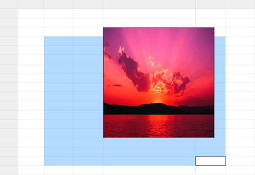

# Cell Layout Customization in WPF GridControl

This section explains the Covered Cells, Banner Cells, Overlapping Cells and Graphic cell of the WPF GridControl.

## Covered Cells

Covered Cells are cells that span over neighboring cells. The combined cells will act as if they are one single cell visually and programmatically. There are different possible options to form a covered range. You can combine the cells in adjacent rows or columns or both.

### Creating Covered Range



this.grid.Model.CoveredCells.Add (new CoveredCellInfo (6, 4, 7, 4));            
this.grid.Model.CoveredCells.Add (new CoveredCellInfo (6, 6, 7, 6));

cell = this.grid.Model[6, 4];
cell.CellValue = "Row spanned cell";
cell.Background = Brushes.BlanchedAlmond;
cell.HorizontalAlignment = HorizontalAlignment.Center;

cell = this.grid.Model[6, 6];
cell.CellValue = "Row spanned cell";
cell.HorizontalAlignment = HorizontalAlignment.Center;
cell.Background = Brushes.BlanchedAlmond;            

this.grid.Model.CoveredCells.Add (new CoveredCellInfo (9, 4, 11, 6));            

cell = this.grid.Model[9, 4];
cell.CellValue = "Column and row spanned cell";            
cell.HorizontalAlignment = HorizontalAlignment.Center;
cell.Background = Brushes.BlanchedAlmond;            

this.grid.Model.CoveredCells.Add (new CoveredCellInfo (13, 4, 13, 6));            

cell = this.grid.Model[13, 4];
cell.CellValue = "Column spanned cell";
cell.Background = Brushes.BlanchedAlmond;
cell.HorizontalAlignment = HorizontalAlignment.Center;



### Output

The following output is generated using the code above.

## Banner Cells

You can create custom range of cells inside a Grid, which is termed as banner cells. Let us see how to create Banner Cells.

### Cell Spanned Backgrounds

Essential Grid lets you span the given background across multiple cells either row-wise, column-wise or both. The information about all the cell spans for a given grid is maintained by the GridModel.CellSpanBackgrounds. Each entry represents an object of CellSpanBackgroundInfo class that defines a cell span. This class exposes properties such as background, border, and more to customize the cell span.

You can also trigger QueryCellSpanBackgrounds event to create and customize cell spans.

### Creating Cell Spans

This example creates three cell spans with gradient backgrounds and a fourth cell span with an image background created through the QueryCellSpanBackgrounds event.



CellSpanBackgroundInfo cellspan1 = new CellSpanBackgroundInfo(6, 2, 7, 4);
cellspan1.Background = new LinearGradientBrush(Colors.IndianRed, Colors.Orange, 90);
grid.Model.CellSpanBackgrounds.Add(cellspan1);

CellSpanBackgroundInfo cellspan2 = new CellSpanBackgroundInfo(6, 6, 7, 8);
cellspan2.Background = new LinearGradientBrush(Colors.Magenta, Colors.LightPink, 90);
grid.Model.CellSpanBackgrounds.Add(cellspan2);

CellSpanBackgroundInfo cellspan3 = new CellSpanBackgroundInfo(9, 4, 13, 6);
cellspan3.Background = new LinearGradientBrush(Colors.SteelBlue, Colors.LightSteelBlue, 90);
grid.Model.CellSpanBackgrounds.Add(cellspan3);

grid.QueryCellSpanBackgrounds += new GridQueryCellSpanBackgroundsEventHandler (grid_QueryCellSpanBackgrounds);

void grid_QueryCellSpanBackgrounds(object sender, GridQueryCellSpanBackgroundsEventArgs e)
{
    if (e.CellRowColumnIndex.ColumnIndex == 4 && e.CellRowColumnIndex.RowIndex == 15)
    {
        CellSpanBackgroundInfo item = new CellSpanBackgroundInfo(e.CellRowColumnIndex.RowIndex, e.CellRowColumnIndex.ColumnIndex, 20, 6);
        item.Background = new ImageBrush(GetImage(@"common\Images\Grid\BannerCells\back2.jpg"));
        e.Range = new List<CellSpanBackgroundInfo>();
        e.Range.Add(item);
        e.Handled = true;
    }
}



### Output

The following output is generated using the code above.

## Overlapping Cells 

Overlapping cells behavior occurs when the text exceeds the length of the cell and will float to the adjacent cell in non-editing mode. Flooding behavior specifies whether a previous cell can be allowed to float over the corresponding cell even if it is empty. Floating cell is to enable the cell to float over the next cell while editing despite of the flooding or overlapping behavior.

To assign the FloatingCell behavior to one particular cell or a certain range of cells. The FloatingCell behavior can be assigned to one particular cell or a certain range of cells as follows:



//Provided as CellStyle
grid.Model[4, 1].EnableFloatingCell = true;
grid.Model[4, 1].FloatCellMode = GridFloatCellsMode.OnDemandCalculation;

//Provided as ColumnStyle
grid.Model.ColStyles[2].EnableFloatingCell = true;
grid.Model.ColStyles[2].FloatCellMode = GridFloatCellsMode.OnDemandCalculation;
grid.Model.ColStyles[2].FloodCell = false;

//Provided as TableStyle
grid.Model.Options.EnableFloatingCell = true;
grid.Model.Options.FloatCellMode = GridFloatCellsMode.OnDemandCalculation;
grid.Model.Options.FloodCell = false;



### Properties

<table>
<tr>
<th>
Property </th><th>
Description </th><th>
Type </th><th>
Data Type </th><th>
Reference links </th></tr>
<tr>
<td>
EnableFloatCellFloatCellModeFloodCell</td><td>
This allows the user to float the cell while typing.This floats the cell in non-editing mode.When the user specifies the property as false it will not allow the previous cell to float over it.</td><td>
Static PropertyStatic PropertyStatic Property</td><td>
BooleanGridFloatCellsMode (enum type)Boolean</td><td>
</td></tr>
</table>

### Features of Overlapping Cells

### Overlapping Cells

To overlap the cell when it is not in edit mode and calculate according to the flooding and length of the text.



this.grid.Model.Options.FloatCellMode = GridFloatCellsMode.OnDemandCalculation; 



### Flooding

To prevent the overlapping of previous cells.



this.grid.Model.Options.FloodCell = false;



### Floating

To enable floating cell behavior by calculating while editing the text.



this.grid.Model.Options.EnableFloatingCell = true; 



## Graphic Cell

A graphic cell is a special type of cell that helps users render any content over the Grid control regardless of the underlying cell. Graphic cells have a separate style info class and model (GraphicModel) which is used to decide the styles and behaviors of graphic cells and their content.

### GraphicStyleInfo Properties

You can get the GraphicStyleInfo object from the GraphicModel class by passing the index position or starting row and column index of the graphic cell as shown in the following code sample.



GraphicStyleInfo style = this.grid.Model.GraphicModel[Row, Column];



Graphic cells have the following properties.

#### Properties

<table>
<tr>
<th>
Property </th><th>
Description </th><th>
Type </th><th>
Data Type </th></tr>
<tr>
<td>
Background</td><td>
Specifies a background brush for the graphic cell.</td><td>
CLR Property </td><td>
Brush</td></tr>
<tr>
<td>
BorderBrush </td><td>
Specifies a border brush for the graphic cell.</td><td>
CLR Property</td><td>
Brush</td></tr>
<tr>
<td>
BorderThickness </td><td>
Specifies a border thickness.</td><td>
CLR Property</td><td>
Thickness</td></tr>
<tr>
<td>
CellType</td><td>
Specifies which controls are loaded in the graphic cells.</td><td>
CLR Property</td><td>
string</td></tr>
<tr>
<td>
CellValue </td><td>
Specifies values that need to load in the control.</td><td>
CLR Property</td><td>
object</td></tr>
<tr>
<td>
Foreground </td><td>
Specifies text color.</td><td>
CLR Property</td><td>
Brush</td></tr>
<tr>
<td>
HorizontalAlignment </td><td>
Specifies the horizontal alignment of the control.</td><td>
CLR Property</td><td>
HorizontalAlignment</td></tr>
<tr>
<td>
ReadOnly</td><td>
Specifies whether the cell is editable.</td><td>
CLR Property</td><td>
Bool</td></tr>
<tr>
<td>
VerticalAlignment</td><td>
Specifies the vertical alignment of the control.</td><td>
CLR Property</td><td>
VerticalAlignment</td></tr>
</table>

### Cell Types

The Grid control allows any controls to be loaded inside graphic cells. This greatly improves the usability and appearance of the Grid control. This attribute of a grid cell is referred to as its cell type.

#### Built-in Cell Types

Graphic cells have built-in support for the following cell types:

* Image Cells
* RichTextBox Cell

### Image Cell

The image cell type is used to load images inside graphic cells. To load the graphic image cell in the Grid control you have to set the CellType as ImageCell and the CellValue as BitmapImage as shown in the following code sample.



var style = this.grid.Model.GraphicModel[cellspan.RowIndex, cellspan.ColumnIndex];
style.CellType = "ImageCell";
BitmapImage bi = new BitmapImage(new Uri(@"..\..\Resources\Sunset.jpg", UriKind.RelativeOrAbsolute));
style.CellValue = bi;



### RichTextBox Cell

The RichTextBox cell type is used to load a rich text box inside graphic cells. To load the rich text box over the Grid control, you have to set the CellType as RichTextBox and the CellValue as FlowDocument as shown in the following code sample.



FlowDocument _flowDocument = new FlowDocument();
Paragraph _paragraph = new Paragraph();
Run _run1 = new Run();
_run1.Text = "This is RichText box Cell Type";
_run1.TextDecorations = TextDecorations.Underline;

Run _run2 = new Run();
_run2.Text = "Various formatting can be done in Single Cell.";
_run1.FontWeight = FontWeights.Bold;
_run2.Foreground = Brushes.Green;

Run _run3 = new Run();
_run3.Text = "Rich Text cell type also supports Images";
_run3.FontSize = 16;
_run3.FontStyle = FontStyles.Italic;
_paragraph.Inlines.Add(_run1);
_paragraph.Inlines.Add(_run2);
_paragraph.Inlines.Add(_run3);
_flowDocument.Blocks.Add(_paragraph);

//Cell type as RichTextBox and Cell Value as FlowDocument
var style = this.grid.Model.GraphicModel[cellspan.RowIndex, cellspan.ColumnIndex];
style.CellType = "RichTextBox";
style.CellValue = _flowDocument;



### Custom Cell Types

The graphic cell model allows you to create custom derived controls to use additional cell types. This requires a cell model class and a cell renderer class. The cell model class creates the actual cell control while the cell renderer class handles the UI requirements of the cell control. The custom cell type can be created by registering the cell model to the corresponding GraphicModel by naming this cell type. It can be enabled by assigning its name to the style.CellType property.

The following code can be used to register the chart cell type in the graphic model.



this.grid.Model.GraphicModel.CellModels.Add("Chart", new GraphicChartCellModel());



In general, the built-in cell types are also constructed only in this way. Every such cell type has its own cell model and renderer classes in the code base. These cell model and renderer classes originate from the GraphicCellModelBase and GraphicCellRendererBase classes. These two classes define the basic functionality for a cell type.

The GraphicCellRendererBase class has the following virtual methods you can override in you custom cell render class.

#### Methods

<table>
<tr>
<th>
Method </th><th>
Description </th><th>
Parameters </th><th>
Return Type </th></tr>
<tr>
<td>
CreateUIElement</td><td>
Create the UI element that needs to be loaded inside the graphic cell.</td><td>
CreateUIElement(GraphicStyleInfo cellInfo)</td><td>
Generic</td></tr>
<tr>
<td>
OnArrange</td><td>
Arrange the graphic cell in a particular rectangle.</td><td>
OnArrange(UIElement uiElement, Rect rect, GraphicStyleInfo style)</td><td>
void</td></tr>
<tr>
<td>
OnInitializeContent</td><td>
Initialize the properties from style info to the UI element.</td><td>
OnInitializeContent(T element, GraphicStyleInfo style)</td><td>
void</td></tr>
<tr>
<td>
ShouldTryToHandlePreviewKeyDown</td><td>
Handles KeyDown.</td><td>
ShouldTryToHandlePreviewKeyDown(KeyEventArgs e)</td><td>
bool</td></tr>
<tr>
<td>
UnloadUIElements</td><td>
When the control unloads, this method is executed.</td><td>
UnloadUIElements(int index, T uiElement)</td><td>
void</td></tr>
<tr>
<td>
UnWireEvents</td><td>
Unwire the wired events from the graphic cell control.</td><td>
UnWireEvents(T element)</td><td>
void</td></tr>
<tr>
<td>
WireEvents</td><td>
Wire the events in graphic cell.</td><td>
WireEvents(T element)</td><td>
void</td></tr>
</table>

### Custom Graphic Chart Cell Renderer

This cell displays a chart control over the grid cells as seen in Microsoft Excel when importing an Excel file to the Grid control. To render the Chart control over the Grid control, you need to derive from the GraphicCellModel and GraphicCellRendererBase classes.

#### CellModel class



public class GraphicChartCellModel:GraphicCellModel<GraphicChartCellRenderer>
{
    public GraphicChartCellModel()
    {
    }
}



#### CellRenderer Class



public class GraphicChartCellRenderer : GraphicCellRendererBase<Chart>
{
    public GraphicChartCellRenderer()
    {
    }
    // Create the chart by using the style info.
    protected override Chart CreateUIElement(GraphicStyleInfo cellInfo)
    {
        if (cellInfo.CellValue != null && cellInfo.CellValue is IChartShape)
        {
            IChartShape chartShape = cellInfo.CellValue as IChartShape;
            return chartShape.CreateChart();
        }
        return base.CreateUIElement(cellInfo);
    }
    // Initialize the Chart control.
    protected override void OnInitializeContent(Chart element, GraphicStyleInfo style)
    {
        element.Background = style.Background;
        element.BorderBrush = style.BorderBrush;
        element.BorderThickness = style.BorderThickness;
        base.OnInitializeContent(element, style);
    }
}



The ChartExtensions class is used to create the Chart control (Syncfusion.Windows.Chart) from the IChartShape object (Syncfusion.XlsIO.IChartShape). While importing the Excel file to the Grid control, the chart in the Excel file is added to the graphic cell collection and the cell value is set as IChartShape.



public static class ChartExtensions
{
    // Create the chart Control.
    public static Chart CreateChart(this IChartShape chartShape)
    {
        Chart chart = new Chart();
        ChartArea chartArea = new ChartArea();
        CreateChartSeries(chartArea, chartShape);
        chart.Areas.Add(chartArea);
        return chart;
    }
    // Create chart series.
    private static void CreateChartSeries(ChartArea chartArea, IChartShape chartShape)
    {
        for (int count = 0; count < chartShape.Series.Count; count++)
        {
            IChartSerie XlsIOChartSerie = chartShape.Series[count];
            ChartSeries UIChartSeries = new ChartSeries();
            switch (XlsIOChartSerie.SerieType)
            {
                case ExcelChartType.Column_Clustered:
                UIChartSeries.Type = ChartTypes.Column;
                break;

                case ExcelChartType.Column_Stacked:
                UIChartSeries.Type = ChartTypes.StackingColumn;
                break;

                case ExcelChartType.Column_Stacked_100:
                UIChartSeries.Type = ChartTypes.StackingColumn100;
                break;

                case ExcelChartType.Line:
                UIChartSeries.Type = ChartTypes.Line;
                break;

                case ExcelChartType.Line_Markers:
                UIChartSeries.Type = ChartTypes.Line;
                UIChartSeries.EnableEffects = true;
                break;

                case ExcelChartType.Pie:
                UIChartSeries.Type = ChartTypes.Pie;
                break;

                case ExcelChartType.Pie_Exploded:
                UIChartSeries.Type = ChartTypes.Pie;
                ChartPieType.SetExplodedAll(UIChartSeries, true);
                break;

                case ExcelChartType.Bar_Clustered:
                UIChartSeries.Type = ChartTypes.Bar;
                break;

                case ExcelChartType.Bar_Stacked:
                UIChartSeries.Type = ChartTypes.StackingBar;
                break;

                case ExcelChartType.Bar_Stacked_100:
                UIChartSeries.Type = ChartTypes.StackingBar100;
                break;

                case ExcelChartType.Area:
                UIChartSeries.Type = ChartTypes.Area;
                break;

                case ExcelChartType.Area_Stacked:
                UIChartSeries.Type = ChartTypes.StackingArea;
                break;

                case ExcelChartType.Scatter_Markers:
                UIChartSeries.Type = ChartTypes.Scatter;
                break;

                case ExcelChartType.Stock_HighLowClose:
                UIChartSeries.Type = ChartTypes.HiLo;
                break;

                case ExcelChartType.Stock_OpenHighLowClose:
                UIChartSeries.Type = ChartTypes.HiLoOpenClose;
                break;

                case ExcelChartType.Stock_VolumeHighLowClose:
                UIChartSeries.Type = ChartTypes.Candle;
                break;

                case ExcelChartType.Doughnut:
                UIChartSeries.Type = ChartTypes.Doughnut;
                break;

                case ExcelChartType.Doughnut_Exploded:
                UIChartSeries.Type = ChartTypes.Doughnut;
                ChartPieType.SetExplodedAll(UIChartSeries, true);
                break;

                case ExcelChartType.Bubble:
                UIChartSeries.Type = ChartTypes.Bubble;
                break;

                case ExcelChartType.Radar:
                UIChartSeries.Type = ChartTypes.Radar;
                break;

                default:
                return;
            }
            DataTable ct = XlsIOChartSerie.CategoryLabels.Worksheet.ExportDataTable(XlsIOChartSerie.CategoryLabels, ExcelExportDataTableOptions.ComputedFormulaValues);
            DataTable vt = XlsIOChartSerie.Values.Worksheet.ExportDataTable(XlsIOChartSerie.Values, ExcelExportDataTableOptions.ComputedFormulaValues);
            List<ChartDataPoint> data = ConvertDataTableToDataPoints(ct, vt, chartShape.IsSeriesInRows);
            UIChartSeries.DataSource = data;
            UIChartSeries.BindingPathX = "X";
            UIChartSeries.BindingPathsY = new List<string> { "Y" };
            UIChartSeries.Label = XlsIOChartSerie.Name;
            chartArea.Series.Add(UIChartSeries);
        }
        if (chartShape.HasLegend)
        {
            ChartLegend cl = new ChartLegend();
            chartArea.Legend = cl;
            switch (chartShape.Legend.Position)
            {
                case ExcelLegendPosition.Bottom:
                Chart.SetDock(cl, ChartDock.Bottom);
                break;

                case ExcelLegendPosition.Corner:
                Chart.SetDock(cl, ChartDock.Floating);
                break;

                case ExcelLegendPosition.Left:
                Chart.SetDock(cl, ChartDock.Left);
                break;

                case ExcelLegendPosition.NotDocked:
                Chart.SetDock(cl, ChartDock.Floating);
                break;

                case ExcelLegendPosition.Right:
                Chart.SetDock(cl, ChartDock.Right);
                break;

                case ExcelLegendPosition.Top:
                Chart.SetDock(cl, ChartDock.Top);
                break;

                default:
                Chart.SetDock(cl, ChartDock.Right);
                break;
            }
        }
        chartArea.PrimaryAxis.Interval = 1;
    }
    // Create the itemsource for chart series.
    private static List<ChartDataPoint> ConvertDataTableToDataPoints(DataTable CategoryTable, DataTable ValuesTable, bool IsSeriesInRows)
    {
        List<ChartDataPoint> data = new List<ChartDataPoint>();
        if (IsSeriesInRows)
        {
            for (int col = 0; col < CategoryTable.Columns.Count; col++)
            {
                double y = 0;
                string x = CategoryTable.Rows[0][col].ToString();
                double.TryParse(ValuesTable.Rows[0][col].ToString(), out y);
                data.Add(new ChartDataPoint(x, y));
            }
        }
        else
        {

            for (int row = 0; row < CategoryTable.Rows.Count; row++)
            {
                double y = 0;
                string x = CategoryTable.Rows[row][0].ToString();
                double.TryParse(ValuesTable.Rows[row][0].ToString(), out y);
                data.Add(new ChartDataPoint(x, y));
            }
        }
        return data;
    }
}
public class ChartDataPoint
{
    public ChartDataPoint(string x, double y)
    {
        X = x;
        Y = y;
    }
    public string X { get; set; }
    public double Y { get; set; }
}



### Graphic Cell Events

The GraphicModel class has the following two events for customizing the graphic cells. 

#### Events

<table>
<tr>
<th>
Event</th><th>
Parameters</th><th>
Description</th></tr>
<tr>
<td>
GraphicQueryCellInfo</td><td>
 GraphicQueryCellInfoEventArgs</td><td>
This event is similar to the QueryCellInfo event in GridModel. It is used to provide the cell values on demand.</td></tr>
<tr>
<td>
GraphicCommittedCellInfo</td><td>
GraphicCommitCellInfoEventArgs</td><td>
This event is similar to the CommittedCellInfo event in GridModel. The changes made in the graphic cell will be saved by the GraphicCommittedCellInfo event.</td></tr>
</table>

### Adding Graphic Cell to the Grid Control

To add the graphic cell to the Grid control, you have to create the instance for GraphicCellSpanInfo and add that object to the GraphicCells collection in the GraphicModel. For the GraphicCellSpanInfo constructor you have to pass the row index and column index (which will decide the starting point of the graphic cell) along with the height and width of the graphic cell. 

The following code sample demonstrates adding GraphicCell to the Grid control through GraphicModel.



GraphicCellSpanInfo cellspan = new GraphicCellSpanInfo(rowIndex, colIndex, 300, 300);
this.grid.Model.GraphicModel.GraphicCells.Add(cellspan);



#### Setting Cell Type to the Graphic Cell

After adding the graphic cell to GraphicModel you can see the empty cell over the Grid control in the specified position. Now you have set the CellType, CellValue, and other style information by accessing the GraphicStyleInfo from GraphicModel. You can get the graphic cell style from the GraphicModel by passing the row and column index. Then by using that style you can set the cell type, cell values and other customization options for the Graphic cell, as shown in the following code sample.



var style = this.grid.Model.GraphicModel[cellspan.RowIndex, cellspan.ColumnIndex];
style.CellType = "ImageCell";
BitmapImage bi = new BitmapImage(new Uri(@"..\..\Resources\Sunset.jpg", UriKind.RelativeOrAbsolute));
style.CellValue = bi;



If you do not set the offset value in the GraphicCellSpanInfo object, the control inside the graphic cells will be loaded in the starting position of the row and column index. By setting the offset value in the GraphicCellSpanInfo you can place the control anywhere in the cell.
