# Cell Types in WPF GridControl

Essential Grid allows the inclusion of some special controls in the grid cells. This greatly improves the usability and appearance of the grid control. This attribute of a grid cell is referred to as its Cell Type. This section lists out various cell controls that can be placed inside the grid cells. Essential Grid currently supports 20+ cell types. It also provides support to create and use custom cell types.

Following is the list of built-in cell types:

<table>
<tr>
<th>
Cell Type</th><th>
Cell Type String</th><th>
Usage</th></tr>
<tr>
<td>
Header</td><td>
“Header”</td><td>
Used as row and column headers</td></tr>
<tr>
<td>
Static</td><td>
“Static”</td><td>
Cannot be edited</td></tr>
<tr>
<td>
Check Box</td><td>
“CheckBox”</td><td>
Used for toggling options </td></tr>
<tr>
<td>
Button</td><td>
“Button”</td><td>
Provides Click event, which can be triggered to perform required action</td></tr>
<tr>
<td>
Image</td><td>
“ImageCell”</td><td>
Used to display pictures</td></tr>
<tr>
<td>
ComboBox</td><td>
“ComboBox”</td><td>
Used to choose the value</td></tr>
<tr>
<td>
DropdownList</td><td>
“DropDownList”</td><td>
Used to display the multi column drop-down</td></tr>
<tr>
<td>
CurrencyEdit</td><td>
“CurrencyEdit”</td><td>
Used to display the currency value</td></tr>
<tr>
<td>
DateTimeEdit</td><td>
“DateTimeEdit”</td><td>
Used to display the date and time</td></tr>
<tr>
<td>
DoubleEdit</td><td>
“DoubleEdit”</td><td>
Used to display the group separators and decimal digits</td></tr>
<tr>
<td>
IntegerEdit</td><td>
“IntegerEdit”</td><td>
Used to display the group separators and decimal digits</td></tr>
<tr>
<td>
MaskEdit</td><td>
“MaskEdit”</td><td>
Used to edit the cells</td></tr>
<tr>
<td>
PercentEdit</td><td>
“PercentEdit”</td><td>
Used to display the percent values</td></tr>
<tr>
<td>
RichTextBox</td><td>
“RichText”</td><td>
Used to format the cells</td></tr>
<tr>
<td>
UpDownEdit</td><td>
“UpDownEdit”</td><td>
Used to increase or decrease the cell values</td></tr>
<tr>
<td>
DataTemplate</td><td>
“DataBoundTemplate”</td><td>
used for cell cannot be changed or edited</td></tr>
<tr>
<td>
Hyperlink</td><td>
“Hyperlink”</td><td>
Used to navigate to another cell</td></tr>
<tr>
<td>
NestedGrid</td><td>
“ScrollGrid”</td><td>
Used to display the multiple scroller in row and column</td></tr>
</table>

## Setting Cell Type

This section elaborates you on how to employ basic controls like Check Box, Radio Button and more in a grid cell.

To set up desired cell type, the [Style.CellType](https://help.syncfusion.com/cr/wpf/Syncfusion.Windows.Controls.Grid.GridStyleInfo.html#Syncfusion_Windows_Controls_Grid_GridStyleInfo_CellType) property must be assigned with the corresponding format string. The list of cell types and their usages are described below.

## Header cell type

A header cell type is used as row and column headers in the grid cell.





var style = gridcontrol.Model[1, 2];
style.CellType = "Header";

//Using QueryCellInfo event
private void Gridcontrol_QueryCellInfo(object sender, GridQueryCellInfoEventArgs e)
{
    e.Style.GridModel[1, 2].CellType = "Header";
}





## Static cell type

The cell is specified as ' Static', that cell can not be changed or edited.





var style = gridcontrol.Model[1, 2];
style.CellType = "Static";

//Using QueryCellInfo event
private void Gridcontrol_QueryCellInfo(object sender, GridQueryCellInfoEventArgs e)
{
    e.Style.GridModel[1, 2].CellType = "Static";
}





## CheckBox cell type

The Checkbox cell type is used for toggling options. For instance, if you want to display a Checkbox control in the cell (2, 2), then you have to use the code below.





var style = gridControl1.Model[1, 2];
style.CellType = "CheckBox";

//Using QueryCellInfo event
private void Gridcontrol_QueryCellInfo(object sender, GridQueryCellInfoEventArgs e)
{
    e.Style.GridModel[1, 2].CellType = "CheckBox";
}





Likewise, you can also add other controls from the table above. A sample output is displayed below.

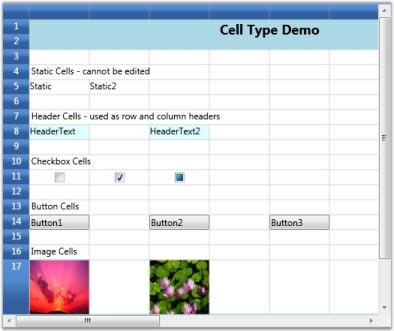

## Button cell type

The cell type is used to the cell is changed as a button. It provides click event that can be triggered to perform the required option.





var style = gridControl1.Model[1, 2];
style.CellType = "Button";
gridcontrol.CellButtonClick += Gridcontrol_CellButtonClick;

private void Gridcontrol_CellButtonClick(object sender, GridCellButtonClickEventArgs e)
{
    MessageBox.Show("Clicked");
}

//Using QueryCellInfo event
private void Gridcontrol_QueryCellInfo(object sender, GridQueryCellInfoEventArgs e)
{
    e.Style.GridModel[1, 2].CellType = "Button";
}





## Image cell type

The cell type is used to display the image in the specified cell.





var style = gridControl1.Model[1, 2];
style.CellType = "Image";
style.GridModel.RowHeights[1] = 80;
Uri fileuri = new Uri(@"..\..\images\Avatar.jpeg", UriKind.Relative);
Image image = new System.Windows.Controls.Image();
image.Source = new BitmapImage(fileuri);            
style.ImageList = new System.Collections.ObjectModel.ObservableCollection<Image>() { image };
style.GridModel.ColumnWidths[5] = 120;
style.ImageIndex = 0;





N> Download demo application from [GitHub](https://github.com/syncfusion/wpf-demos/tree/master/GridControl/Cell%20Types/Basic%20Cell%20Type)

## ComboBox cell type

A combo box is a component with a drop-down arrow that users click to display an associated list of choices. The user displays the list by clicking or dragging the drop-down arrow.

This cell type allows you to choose the cell value from a drop-down list. You can customize this list in many ways by setting the appropriate GridStyleInfo property. Some interesting options are Autocomplete, associate a string collection, associate LINQ source etc. You can also use this drop-down like a foreign key– for example, displaying one column in the drop-down while saving the cell value from another column in the data source.

N> A foreign key is a field in a relational table that matches the primary key column of another table. The foreign key can be used to cross-reference tables.

The table below lists various properties that can affect combo box cells.

<table>
<tr>
<th>
GridStyleInfo Property</th><th>
Description</th></tr>
<tr>
<td>
CellType</td><td>
Set to “ComboBox” for a Combo box control</td></tr>
<tr>
<td>
ChoiceList</td><td>
String collection for the drop-down</td></tr>
<tr>
<td>
DropDownStyle</td><td>
Determines the drop-down cell behavior.Editable Autocomplete Exclusive </td></tr>
<tr>
<td>
ItemsSource</td><td>
Specifies the binding source for the Combo box.</td></tr>
<tr>
<td>
Display Member</td><td>
String that names the public property from the data source object to be displayed in the cell.</td></tr>
<tr>
<td>
Value Member</td><td>
String that names the public property from the data source object to be used as the value for this cell.</td></tr>
</table>

Before we proceed further the following note provides more information on the drop-down styles:

N> * Editable-Editable combo boxes combine an editable text field and provide users the additional option of typing an item that might or might not be on the list. The item to be typed in the text field need not be case-sensitive. * _Autocomplete-Autocomplete combo boxes predict a word or phrase that the user wants to type in the associated text box without the user actually typing it completely. * Exclusive-This is a non-editable combo box where user is allowed to select only the options available from the drop-down list.

Combo-boxes can be added to the Grid in two different ways as follows:

1. Using ChoiceList
2. Using ItemsSource

#### Using ChoiceList

Let us see how to build different kinds of combo boxes using ChoiceList. This allows you to customize the options to be displayed in a drop-down.

**Setting Up an Editable ComboBox** 




StringCollection list = new StringCollection();
list.Add("One");
list.Add("Two");
list.Add("Three");
list.Add("Four");
list.Add("Five");

//Editable Combo
var combo1 = this.grid.Model[1, 2];
combo1.CellType = "ComboBox";
combo1.ChoiceList = list;
combo1.DropDownStyle = GridDropDownStyle.Editable;

//Using QueryCellInfo event
private void Gridcontrol_QueryCellInfo(object sender, GridQueryCellInfoEventArgs e)
{
    StringCollection collection = new StringCollection();
    collection.Add("list1");
    collection.Add("list2");
    collection.Add("list3");
    
    //Editable ComboBox
    var combo = e.Style.GridModel[1, 2];
    combo.CellType = "ComboBox";
    combo.ChoiceList = collection;
    combo.DropDownStyle = GridDropDownStyle.Editable;
}




**Setting Up Autocomplete ComboBox** 




//Autocomplete combo
var combo2 = this.grid.Model[1, 2];
combo2.CellType = "ComboBox";
combo2.ChoiceList = list;
combo2.DropDownStyle = GridDropDownStyle.AutoComplete;

//Using QueryCellInfo event
private void Gridcontrol_QueryCellInfo(object sender, GridQueryCellInfoEventArgs e)
{
    //AutoComplete ComboBox
    var combo = e.Style.GridModel[1, 2];
    combo.CellType = "ComboBox";
    combo.ChoiceList = collection;
    combo.DropDownStyle = GridDropDownStyle.AutoComplete;
}




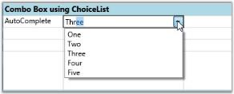

**Setting Up Exclusive ComboBox** 




//Exclusive Combo
var combo3 = this.grid.Model[1, 2];
combo3.CellType = "ComboBox";
combo3.ChoiceList = list;
combo3.DropDownStyle = GridDropDownStyle.Exclusive;

//Using QueryCellInfo event
private void Gridcontrol_QueryCellInfo(object sender, GridQueryCellInfoEventArgs e)
{ 
    //Exclusive ComboBox
    var combo = e.Style.GridModel[1, 2];
    combo.CellType = "ComboBox";
    combo.ChoiceList = collection;
    combo.DropDownStyle = GridDropDownStyle.Exclusive;
}




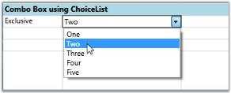

#### Using ItemsSource

The combo boxes created using ItemsSource class ensure that the options available in the drop-down list are populated from the data source the combo box is bound to. The user cannot customize the list unlike combo boxes created using ChoiceList class. The combo boxes in the following examples are bound to Northwind Employee table. The values of the FirstName column form the ItemsSource. The FirstName column is used as the display member of the combo box whose value member is EmployeeID.

Setting up editable combo box



//Editable Combo bound to the “FirstName” column of Northwind Employee Table.
var combo1 = this.grid.Model[4, 2];
combo1.CellType = "ComboBox";
combo1.ItemsSource = northWind.Employees.Select(emp => emp.FirstName).ToList();
combo1.DropDownStyle = GridDropDownStyle.Editable;



Setting Up an Autocomplete Combo Box



//Autocomplete Combo bound to the “FirstName” column of Northwind Employee Table.
var combo2 = this.grid.Model[5, 2];
combo2.CellType = "ComboBox";
combo2.ItemsSource = northWind.Employees.Select(emp => emp.FirstName).ToList();
combo2.DropDownStyle = GridDropDownStyle.AutoComplete;
combo2.DisplayMember = "FirstName";
combo2.ValueMember = "EmployeeID";



Setting Up an Exclusive Combo Box



//Exclusive Combo bound to the “FirstName” column of Northwind Employee Table.
var combo3 = this.grid.Model[6, 2];
combo3.CellType = "ComboBox";
combo3.ItemsSource = northWind.Employees.Select(emp => emp.FirstName).ToList();
combo3.DropDownStyle = GridDropDownStyle.Exclusive;



N> Download demo application from [GitHub](https://github.com/syncfusion/wpf-demos/tree/master/GridControl/Cell%20Types/Combo%20Box%20Cell)

## DropdownList cell type

This cell type serves the same purpose as combo box control. The difference is that it will associate a multicolumn drop-down to the owner cell. The other common features like DropDownStyle, ItemsSource, DisplayMember and ValueMember are applicable to this cell too.

The code snippets below allow the user to construct different List Control Cells and their output. To set up drop-down List cell, set its CellType to “DropDownList”.

Creating Editable Drop-down List Bound to LINQ Source with ‘FirstName’ as its Display Member.



var dropdown1 = this.grid.Model[7, 2];
dropdown1.CellType = "DropDownList";
dropdown1.ItemsSource = northWind.Employees.Select(emp =>
new
{
    EmployeeID = emp.EmployeeID,
    FirstName = emp.FirstName,
    LastName = emp.LastName,
    Phone = emp.HomePhone
}).ToList();
dropdown1.DisplayMember = "FirstName";
dropdown1.DropDownStyle = GridDropDownStyle.Editable;



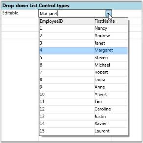

Autocomplete Drop-down List Bound to LINQ source with ‘FirstName’ as its Display Member and ‘EmployeeID’ as its ValueMember.



var dropdown2 = this.grid.Model[8, 2];
dropdown2.CellType = "DropDownList";
dropdown2.ItemsSource = northWind.Employees.Select(emp =>
new
{
    EmployeeID = emp.EmployeeID,
    FirstName = emp.FirstName,
    LastName = emp.LastName,
    Phone = emp.HomePhone
}).ToList();
dropdown2.DisplayMember = "FirstName";
dropdown2.ValueMember = "EmployeeID";
dropdown2.DropDownStyle = GridDropDownStyle.AutoComplete;



Exclusive Drop-down List Bound to LINQ Source with FirstName as its DisplayMember.



var dropdown3 = this.grid.Model[9, 2];
dropdown3.CellType = "DropDownList";
dropdown3.ItemsSource = northWind.Employees.Select(emp =>
new
{
EmployeeID = emp.EmployeeID,
FirstName = emp.FirstName,
LastName = emp.LastName,
Phone = emp.HomePhone
}).ToList();
dropdown3.DisplayMember = "FirstName";
dropdown3.DropDownStyle = GridDropDownStyle.Exclusive;



N> Download demo application from [GitHub](https://github.com/syncfusion/wpf-demos/tree/master/GridControl/Cell%20Types/Combo%20Box%20Cell)

## DateTimeEdit cell type

The Date Time cells incorporate DateTimeEdit controls in grid cells that will help you to interactively set a date and time value. The style properties below are applicable to this cell type.

<table>
<tr>
<th>
GridStyleInfo Property</th><th>
Description</th></tr>
<tr>
<td>
CellType</td><td>
Set to “DateTimeEdit”</td></tr>
<tr>
<td>
DateTimePattern</td><td>
Sets the date-time pattern. The table below lists the available patterns with examples.</td></tr>
<tr>
<td>
MaxDateTime, MinDateTime</td><td>
Sets the maximum and minimum values for a DateTime cell.</td></tr>
<tr>
<td>
IsCalendarEnabled</td><td>
When true, enables the calendar popup</td></tr>
<tr>
<td>
IsWatchEnabled</td><td>
When true, enables the watch popup</td></tr>
<tr>
<td>
NoneDateText</td><td>
Specifies the text to be displayed when no date is set</td></tr>
</table>

<table>
<tr>
<th>
Date and Time Pattern</th><th>
Example</th></tr>
<tr>
<td>
Short Date</td><td>
8/6/2009</td></tr>
<tr>
<td>
Long Date</td><td>
Thursday, August 06, 2009</td></tr>
<tr>
<td>
Long Time</td><td>
7:01:33 AM</td></tr>
<tr>
<td>
Short Time</td><td>
7:01 AM</td></tr>
<tr>
<td>
Full Date Time</td><td>
Thursday, August 06, 2009 7:01:33 AM</td></tr>
<tr>
<td>
MonthDay</td><td>
August 06</td></tr>
<tr>
<td>
RFC1123</td><td>
Thu, 06 Aug 2009 07:01:33 GMT</td></tr>
<tr>
<td>
Sortable Date Time</td><td>
2009-08-06T07:01:33</td></tr>
<tr>
<td>
Universal Sortable Date Time</td><td>
2009-08-06 07:01:33Z</td></tr>
<tr>
<td>
Year Month</td><td>
(August, 2009 is correct)August, 2009</td></tr>
</table>

Setting Date and Time Cells with Different Date Time Patterns.




grid.Model[5, 1].CellType = "DateTimeEdit";
grid.Model[5, 1].DateTimeEdit.DateTimePattern = DateTimePattern.LongTime;
grid.Model[5, 1].CellValue = DateTime.Now;

grid.Model[7, 1].CellType = "DateTimeEdit";
grid.Model[7, 1].DateTimeEdit.DateTimePattern = DateTimePattern.FullDateTime;
grid.Model[7, 1].CellValue = DateTime.Now;

grid.Model[9, 1].CellType = "DateTimeEdit";
grid.Model[9, 1].DateTimeEdit.DateTimePattern = DateTimePattern.ShortDate;
grid.Model[9, 1].CellValue = DateTime.Now;

grid.Model[11, 1].CellType = "DateTimeEdit";
grid.Model[11, 1].DateTimeEdit.DateTimePattern = DateTimePattern.YearMonth;
grid.Model[11, 1].CellValue = DateTime.Now;

//Using QueryCellInfo event
private void Gridcontrol_QueryCellInfo(object sender, GridQueryCellInfoEventArgs e)
{ 
    e.Style.GridModel[5, 1].CellType = "DateTimeEdit";
    e.Style.GridModel[5, 1].DateTimeEdit.DateTimePattern = DateTimePattern.LongTime;
    e.Style.GridModel[5, 1].CellValue = DateTime.Now;

    e.Style.GridModel[7, 1].CellType = "DateTimeEdit";
    e.Style.GridModel[7, 1].DateTimeEdit.DateTimePattern = DateTimePattern.FullDateTime;
    e.Style.GridModel[7, 1].CellValue = DateTime.Now;

    e.Style.GridModel[9, 1].CellType = "DateTimeEdit";
    e.Style.GridModel[9, 1].DateTimeEdit.DateTimePattern = DateTimePattern.ShortDate;
    e.Style.GridModel[9, 1].CellValue = DateTime.Now;

    e.Style.GridModel[11, 1].CellType = "DateTimeEdit";
    e.Style.GridModel[11, 1].DateTimeEdit.DateTimePattern = DateTimePattern.YearMonth;
    e.Style.GridModel[11, 1].CellValue = DateTime.Now;
}




N> Download demo application from [GitHub](https://github.com/syncfusion/wpf-demos/tree/master/GridControl/Cell%20Types/Date%20Time%20Cell)

## IntegerEdit cell type

IntegerEdit is a specialized cell type that restricts the data entry to integers. The table below lists the style properties specific to this cell type.

<table>
<tr>
<th>
GridStyleInfo Property</th><th>
Description</th></tr>
<tr>
<td>
Cell Type</td><td>
Set to “IntegerEdit”</td></tr>
<tr>
<td>
NumberGroupSeparator</td><td>
String that separates groups of digits</td></tr>
<tr>
<td>
NumberGroupSizes</td><td>
Number of digits in each group</td></tr>
<tr>
<td>UseNullOption</td>
<td>By default, the value of IntegerEdit cells is "0". Set {{'[UseNullOption](https://help.syncfusion.com/cr/wpf/Syncfusion.Windows.Controls.Grid.GridIntegerEditStyleInfo.html#Syncfusion_Windows_Controls_Grid_GridIntegerEditStyleInfo_UseNullOption)'| markdownify}} as "True" to hide or delete the default value in IntegerEdit cells.</td>
</tr>
</table>

For example, setting up Three Different Integer Edit Cells. 




int[] sizes = { 2, 3, 4 };
grid.Model[12, 2].CellType = "IntegerEdit";
grid.Model[12, 2].IsEditable = true;
grid.Model[12, 2].NumberFormat = new NumberFormatInfo { NumberGroupSeparator = ","};
grid.Model[12, 2].NumberFormat.NumberGroupSizes = sizes;
grid.Model[12, 2].CellValue = 1;

grid.Model[8, 2].CellType = "IntegerEdit";
grid.Model[8, 2].IsEditable = true;
grid.Model[8, 2].NumberFormat = new NumberFormatInfo { NumberGroupSeparator = ";"};
grid.Model[8, 2].NumberFormat.NumberGroupSizes = sizes;
grid.Model[8, 2].CellValue = 222222;

grid.Model[10, 2].CellType = "IntegerEdit";
grid.Model[10, 2].IsEditable = true;
grid.Model[10, 2].NumberFormat = new NumberFormatInfo { NumberGroupSeparator = "@"};
grid.Model[10, 2].NumberFormat.NumberGroupSizes = sizes;
grid.Model[10, 2].CellValue = 1000;

grid.Model.ColStyles[3].CellType = "IntegerEdit";
grid.Model.ColStyles[3].IntegerEdit.UseNullOption = true;

//Using QueryCellInfo event
private void Gridcontrol_QueryCellInfo(object sender, GridQueryCellInfoEventArgs e)
{ 
    int[] sizes = { 2, 3, 4 };
    e.Style.GridModel[12, 2].CellType = "IntegerEdit";
    e.Style.GridModel[12, 2].IsEditable = true;
    e.Style.GridModel[12, 2].NumberFormat = new NumberFormatInfo { NumberGroupSeparator = "," };
    e.Style.GridModel[12, 2].NumberFormat.NumberGroupSizes = sizes;
    e.Style.GridModel[12, 2].CellValue = 1;

    e.Style.GridModel[8, 2].CellType = "IntegerEdit";
    e.Style.GridModel[8, 2].IsEditable = true;
    e.Style.GridModel[8, 2].NumberFormat = new NumberFormatInfo { NumberGroupSeparator = ";" };
    e.Style.GridModel[8, 2].NumberFormat.NumberGroupSizes = sizes;
    e.Style.GridModel[8, 2].CellValue = 222222;

    e.Style.GridModel[10, 2].CellType = "IntegerEdit";
    e.Style.GridModel[10, 2].IsEditable = true;
    e.Style.GridModel[10, 2].NumberFormat = new NumberFormatInfo { NumberGroupSeparator = "@" };
    e.Style.GridModel[10, 2].NumberFormat.NumberGroupSizes = sizes;
    e.Style.GridModel[10, 2].CellValue = 1000;

    e.Style.GridModel.ColStyles[3].CellType = "IntegerEdit";
    e.Style.GridModel.ColStyles[3].IntegerEdit.UseNullOption = true;
}




N> Download demo application from [GitHub](https://github.com/syncfusion/wpf-demos/tree/master/GridControl/Cell%20Types/Integer%20Edit%20Cell)

## DoubleEdit cell type

Using DoubleEdit cell type will restrict the user to enter only double (value type) values into the cell. Thus it can be used to display System.Double type values. Below are the style properties that affect this cell.

<table>
<tr>
<th>
GridStyleInfo Property</th><th>
Description</th></tr>
<tr>
<td>
Cell Type</td><td>
Set to “DoubleEdit”</td></tr>
<tr>
<td>
NumberGroupSeparator</td><td>
String that separates groups of digits to the left of the decimal</td></tr>
<tr>
<td>
NumberDecimalSeparator</td><td>
String to use as decimal separator</td></tr>
<tr>
<td>
NumberDecimalDigits</td><td>
Number of decimal places</td></tr>
</table>

For example, setting up four Double Edit cells using different group separators and decimal digits.




int[] sizes = { 2, 3, 4 };
grid.Model[6, 2].CellType = "DoubleEdit";
grid.Model[6, 2].NumberFormat = new NumberFormatInfo 
{ 
    NumberGroupSeparator = ";", 
    NumberDecimalSeparator = ".", 
    NumberDecimalDigits = 4 
};

grid.Model[6, 2].NumberFormat.NumberGroupSizes = sizes;
grid.Model[6, 2].CellValue = 2345.00; 

grid.Model[8, 2].CellType = "DoubleEdit";
grid.Model[8, 2].NumberFormat = new NumberFormatInfo 
{ 
    NumberGroupSeparator = ",", 
    NumberDecimalSeparator = ".", 
    NumberDecimalDigits = 4 
};

grid.Model[8, 2].NumberFormat.NumberGroupSizes = sizes;
grid.Model[8, 2].CellValue = 12;

grid.Model[10, 2].CellType = "DoubleEdit";
grid.Model[10, 2].NumberFormat = new NumberFormatInfo 
{ 
    NumberGroupSeparator = ",", 
    NumberDecimalSeparator = ".", 
    NumberDecimalDigits = 1 
};

grid.Model[10, 2].NumberFormat.NumberGroupSizes = sizes;
grid.Model[10, 2].CellValue = 100;

grid.Model[12, 2].CellType = "DoubleEdit";
grid.Model[12, 2].NumberFormat = new NumberFormatInfo 
{ 
    NumberGroupSeparator = "@", 
    NumberDecimalSeparator = ".", 
    NumberDecimalDigits = 0 
};
grid.Model[12, 2].NumberFormat.NumberGroupSizes = sizes;
grid.Model[12, 2].CellValue = 12345678.00;

//Using QueryCellInfo event
private void Gridcontrol_QueryCellInfo(object sender, GridQueryCellInfoEventArgs e)
{ 
    int[] sizes = { 2, 3, 4 };
    e.Style.GridModel[6, 2].CellType = "DoubleEdit";
    e.Style.GridModel[6, 2].NumberFormat.NumberGroupSizes = sizes;
    e.Style.GridModel[6, 2].CellValue = 2345.00;
    e.Style.GridModel[6, 2].NumberFormat = new NumberFormatInfo
    {
        NumberGroupSeparator = ";",
        NumberDecimalSeparator = ".",
        NumberDecimalDigits = 4
    };
    e.Style.GridModel[8, 2].CellType = "DoubleEdit";
    e.Style.GridModel[8, 2].NumberFormat.NumberGroupSizes = sizes;
    e.Style.GridModel[8, 2].CellValue = 12;
    e.Style.GridModel[8, 2].NumberFormat = new NumberFormatInfo
    {
        NumberGroupSeparator = ",",
        NumberDecimalSeparator = ".",
        NumberDecimalDigits = 4
    };

    e.Style.GridModel[10, 2].CellType = "DoubleEdit";
    e.Style.GridModel[10, 2].NumberFormat.NumberGroupSizes = sizes;
    e.Style.GridModel[10, 2].CellValue = 100;
    e.Style.GridModel[10, 2].NumberFormat = new NumberFormatInfo
    {
        NumberGroupSeparator = ",",
        NumberDecimalSeparator = ".",
        NumberDecimalDigits = 1
    };
    e.Style.GridModel[12, 2].CellType = "DoubleEdit";
    e.Style.GridModel[12, 2].NumberFormat = new NumberFormatInfo
    {
        NumberGroupSeparator = "@",
        NumberDecimalSeparator = ".",
        NumberDecimalDigits = 0
    };
    e.Style.GridModel[12, 2].NumberFormat.NumberGroupSizes = sizes;
    e.Style.GridModel[12, 2].CellValue = 12345678.00;
}




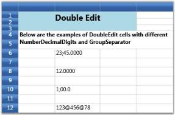

N> Download demo application from [GitHub](https://github.com/syncfusion/wpf-demos/tree/master/GridControl/Cell%20Types/Double%20Edit%20Cell)

## CurrencyEdit cell type

This cell type can be used to represent monetary values to achieve accuracy in the calculations. It will stripe the currency sign in the cell and attempt to parse only the number from the input. Use the GridStyleInfo properties below to customize these cells.

<table>
<tr>
<th>
GridStyleInfo Property</th><th>
Description</th></tr>
<tr>
<td>
Cell Type</td><td>
Set to “CurrencyEdit”.</td></tr>
<tr>
<td>
CurrencyDecimalDigits</td><td>
Number of decimal places in currency value.</td></tr>
<tr>
<td>
CurrencyDecimalSeparator</td><td>
String to use as decimal separator.</td></tr>
<tr>
<td>
CurrencyNegativePattern</td><td>
Format pattern for negative currency values.</td></tr>
<tr>
<td>
CurrencyPositivePattern</td><td>
Format pattern for positive currency values.</td></tr>
<tr>
<td>
CurrencySymbol</td><td>
String to use as currency symbol.</td></tr>
<tr>
<td>
CurrencyGroupSizes</td><td>
Number of digits in each group to the left of the decimal.</td></tr>
</table>

Creating a Currency Cell with a Negative Currency Value with ‘.’ as the Decimal Separator. 




int[] sizes = { 2, 3, 4 };   
grid.Model[6, 2].CellType = "CurrencyEdit";
grid.Model[6, 2].IsEditable = true;
grid.Model[6, 2].NumberFormat = new NumberFormatInfo 
{ 
    CurrencyDecimalDigits = 4, 
    CurrencyDecimalSeparator = ".", 
    CurrencyNegativePattern = 0, 
    CurrencyPositivePattern = 0, 
    CurrencySymbol = "$" 
};

grid.Model[6, 2].NumberFormat.CurrencyGroupSizes = sizes;
grid.Model[6, 2].CellValue = -4.0;

//Using QueryCellInfo event
private void Gridcontrol_QueryCellInfo(object sender, GridQueryCellInfoEventArgs e)
{ 
    int[] sizes = { 2, 3, 4 };
    e.Style.GridModel[6, 2].CellType = "CurrencyEdit";
    e.Style.GridModel[6, 2].IsEditable = true;
    e.Style.GridModel[6, 2].NumberFormat = new NumberFormatInfo
    {
        CurrencyDecimalDigits = 4,
        CurrencyDecimalSeparator = ".",
        CurrencyNegativePattern = 0,
        CurrencyPositivePattern = 0,
        CurrencySymbol = "$"
    };
    e.Style.GridModel[6, 2].NumberFormat.CurrencyGroupSizes = sizes;
    e.Style.GridModel[6, 2].CellValue = -4.0;
}




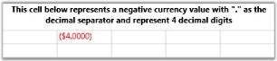

Currency Cell with a Negative Currency Value and a Different Negative Pattern




int[] sizes = { 2, 3, 4 };   
grid.Model[10, 2].CellType = "CurrencyEdit";
grid.Model[10, 2].IsEditable = true;
grid.Model[10, 2].NumberFormat = new NumberFormatInfo 
{ 
    CurrencyDecimalDigits = 2, 
    CurrencyDecimalSeparator = ".", 
    CurrencyNegativePattern = 5, 
    CurrencyPositivePattern = 1, 
    CurrencySymbol = "$" 
};

grid.Model[10, 2].NumberFormat.CurrencyGroupSizes = sizes;
grid.Model[10, 2].CellValue = -14.0;

//Using QueryCellInfo event
private void Gridcontrol_QueryCellInfo(object sender, GridQueryCellInfoEventArgs e)
{ 
    int[] sizes = { 2, 3, 4 };
    e.Style.GridModel[10, 2].CellType = "CurrencyEdit";
    e.Style.GridModel[10, 2].IsEditable = true;
    e.Style.GridModel[10, 2].NumberFormat = new NumberFormatInfo
    {
        CurrencyDecimalDigits = 2,
        CurrencyDecimalSeparator = ".",
        CurrencyNegativePattern = 5,
        CurrencyPositivePattern = 1,
        CurrencySymbol = "$"
    };
    e.Style.GridModel[10, 2].NumberFormat.CurrencyGroupSizes = sizes;
    e.Style.GridModel[10, 2].CellValue = -14.0;
}




Currency Cell with a Positive Currency Value with ‘.’ as the Decimal Separator and ‘$’ as Currency Symbol




int[] sizes = { 2, 3, 4 };   
grid.Model[14, 2].CellType = "CurrencyEdit";
grid.Model[14, 2].IsEditable = true;
grid.Model[14, 2].NumberFormat = new NumberFormatInfo 
{
    CurrencyDecimalDigits = 4, 
    CurrencyDecimalSeparator = ".", 
    CurrencyNegativePattern = 11, 
    CurrencyPositivePattern = 2, 
    CurrencySymbol = "$"
};
grid.Model[14, 2].NumberFormat.CurrencyGroupSizes = sizes;
grid.Model[14, 2].CellValue = 36.0;

//Using QueryCellInfo event
private void Gridcontrol_QueryCellInfo(object sender, GridQueryCellInfoEventArgs e)
{ 
    int[] sizes = { 2, 3, 4 };
    e.Style.GridModel[14, 2].CellType = "CurrencyEdit";
    e.Style.GridModel[14, 2].IsEditable = true;
    e.Style.GridModel[14, 2].NumberFormat = new NumberFormatInfo
    {
        CurrencyDecimalDigits = 4,
        CurrencyDecimalSeparator = ".",
        CurrencyNegativePattern = 11,
        CurrencyPositivePattern = 2,
        CurrencySymbol = "$"
    };
    e.Style.GridModel[6, 2].NumberFormat.CurrencyGroupSizes = sizes;
    e.Style.GridModel[6, 2].CellValue = 36.0;
}




N> Download demo application from [GitHub](https://github.com/syncfusion/wpf-demos/tree/master/GridControl/Cell%20Types/Currency%20Cell)

## PercentEdit cell type

The PercentEdit cell type restricts the data entry to percentage values only. The following are the style properties used with this cell type.

<table>
<tr>
<th>
GridStyleInfo Property</th><th>
Description</th></tr>
<tr>
<td>
Cell Type</td><td>
Set to “PercentEdit”.</td></tr>
<tr>
<td>
PercentEditMode</td><td>
Indicates the way of editing the text in percent edit cells. Possible values – PercentMode and DoubleMode</td></tr>
<tr>
<td>
PercentSymbol</td><td>
String to use as the percent symbol.</td></tr>
<tr>
<td>
PercentGroupSizes</td><td>
Number of digits in each group to the left of the decimal.</td></tr>
<tr>
<td>
PercentGroupSeparator</td><td>
String that separates group of digits to the left of the decimal.</td></tr>
<tr>
<td>
PercentDecimalDigits</td><td>
Number of digits that appear after the decimal.</td></tr>
</table>

For example, setting up two Percent Edit cells with different group sizes and decimal digits. 

The first cell operates in Percent mode of editing while the second cell follows Double mode.

Double mode displays the values in System.Double format and Percent mode adds a percent sign next to the numbers. 




var percentStyleInfo = this.grid.Model[7, 2];
percentStyleInfo.CellType = "PercentEdit";

percentStyleInfo.NumberFormat = new NumberFormatInfo()
{
    PercentSymbol = "%",
    PercentGroupSizes = new int[] { 1, 2,  3 },
    PercentDecimalDigits = 2,
    PercentGroupSeparator = ",",
};
percentStyleInfo.PercentEditMode = PercentEditMode.PercentMode;
percentStyleInfo.CellValue = 19;
var percentStyleInfo2 = this.grid.Model[9, 2];
percentStyleInfo2.CellType = "PercentEdit";

percentStyleInfo2.NumberFormat = new NumberFormatInfo()
{
    PercentSymbol = "%",
    PercentGroupSizes = new int[] { 3 },
    PercentDecimalDigits = 4,
    PercentGroupSeparator = ",",
};
percentStyleInfo2.PercentEditMode = PercentEditMode.DoubleMode;
percentStyleInfo2.CellValue = 91;

//Using QueryCellInfo event
private void Gridcontrol_QueryCellInfo(object sender, GridQueryCellInfoEventArgs e)
{
    var percentStyleInfo = e.Style.GridModel[7, 2];
    percentStyleInfo.CellType = "PercentEdit";
    percentStyleInfo.NumberFormat = new NumberFormatInfo()
    {
        PercentSymbol = "%",
        PercentGroupSizes = new int[] { 1, 2, 3 },
        PercentDecimalDigits = 2,
        PercentGroupSeparator = ",",
    };
    percentStyleInfo.PercentEditMode = PercentEditMode.PercentMode;
    percentStyleInfo.CellValue = 19;

    var percentStyleInfo2 = e.Style.GridModel[9, 2];
    percentStyleInfo2.CellType = "PercentEdit";
    percentStyleInfo2.NumberFormat = new NumberFormatInfo()
    {
        PercentSymbol = "%",
        PercentGroupSizes = new int[] { 3 },
        PercentDecimalDigits = 4,
        PercentGroupSeparator = ",",
    };
    percentStyleInfo2.PercentEditMode = PercentEditMode.DoubleMode;
    percentStyleInfo2.CellValue = 91;
}




N> Download demo application from [GitHub](https://github.com/syncfusion/wpf-demos/tree/master/GridControl/Cell%20Types/Percent%20Edit%20Cell)

## MaskEdit cell type

MaskEdit cell type allows you to create specially formatted text cells that confirm to an edit mask that you specify. The Style.MaskEdit.Mask property holds the mask string, which will control the format of the input text being entered. The Mask Edit cells are useful when the user wants to display some formatted text such as Social Security Number (SSN), telephone number etc.

For example, setting up Mask Edit cells with different mask string.




var maskStyleInfo = this.grid.Model[6, 2];
maskStyleInfo.CellType = "MaskEdit";
maskStyleInfo.MaskEdit = GridMaskEditInfo.Default;
maskStyleInfo.MaskEdit.Mask = "00/00/0000";
maskStyleInfo.CellValue = 1232313;

var maskStyleInfo1 = this.grid.Model[8, 2];
maskStyleInfo1.CellType = "MaskEdit";
maskStyleInfo1.MaskEdit = GridMaskEditInfo.Default;
maskStyleInfo1.MaskEdit.Mask = "00:00:00";
maskStyleInfo1.CellValue = 1232313;

var maskStyleInfo2 = this.grid.Model[10, 2];
maskStyleInfo2.CellType = "MaskEdit";
maskStyleInfo2.MaskEdit = GridMaskEditInfo.Default;
maskStyleInfo2.MaskEdit.Mask = "00/00/0000";
maskStyleInfo2.CellValue = "12012007";

//Using QueryCellInfo event
private void Gridcontrol_QueryCellInfo(object sender, GridQueryCellInfoEventArgs e)
{
    var maskStyleInfo = e.Style.GridModel[6, 2];
    maskStyleInfo.CellType = "MaskEdit";
    maskStyleInfo.MaskEdit = GridMaskEditInfo.Default;
    maskStyleInfo.MaskEdit.Mask = "00/00/0000";
    maskStyleInfo.CellValue = 1232313;

    var maskStyleInfo1 = e.Style.GridModel[8, 2];
    maskStyleInfo1.CellType = "MaskEdit";
    maskStyleInfo1.MaskEdit = GridMaskEditInfo.Default;
    maskStyleInfo1.MaskEdit.Mask = "00:00:00";
    maskStyleInfo1.CellValue = 1232313;

    var maskStyleInfo2 = e.Style.GridModel[10, 2];
    maskStyleInfo2.CellType = "MaskEdit";
    maskStyleInfo2.MaskEdit = GridMaskEditInfo.Default;
    maskStyleInfo2.MaskEdit.Mask = "00/00/0000";
    maskStyleInfo2.CellValue = "12012007";
}




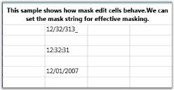

N> Download demo application from [GitHub](https://github.com/syncfusion/wpf-demos/tree/master/GridControl/Cell%20Types/Mask%20Edit%20Cell)

## UpDownEdit cell type

UpDownEdit cell type makes the grid cell to host an Up and Down edit control which contains a pair of arrow buttons that increase or decrease the cell value. The style properties applicable to this cell type are provided below.

<table>
<tr>
<th>
GridStyleInfo Property</th><th>
Description</th></tr>
<tr>
<td>
Cell Type</td><td>
Set to “UpDownEdit”</td></tr>
<tr>
<td>
NumberGroupSeparator</td><td>
String that separates group of digits to the left of the decimal</td></tr>
<tr>
<td>
NumberDecimalDigits</td><td>
Number of digits that appear after the decimal</td></tr>
<tr>
<td>
MaxValue</td><td>
Upper limit in the range of applicable values</td></tr>
<tr>
<td>
MinValue</td><td>
Lower limit in the range of applicable values</td></tr>
<tr>
<td>
Step</td><td>
Unit value that is to be increased or decreased when the spin buttons are clicked</td></tr>
<tr>
<td>
FocusedBorderBrush</td><td>
Border brush; applied only when the cell is in focus</td></tr>
<tr>
<td>
FocusedForeground</td><td>
Foreground brush; applied only when the cell is in focus</td></tr>
<tr>
<td>
FocusedBackground</td><td>
Background brush; applied only when the cell is in focus</td></tr>
</table>

For example, the code below sets up two different Up and Down controls in grid cells.




var updownStyleInfo = this.grid.Model[6, 2];
updownStyleInfo.CellType = "UpDownEdit";
updownStyleInfo.NumberFormat = new NumberFormatInfo { NumberGroupSeparator = " ", NumberDecimalDigits = 3 };
updownStyleInfo.UpDownEdit.FocusedBackground = Brushes.Tan;
updownStyleInfo.UpDownEdit.FocusedBorderBrush = Brushes.Red;
updownStyleInfo.UpDownEdit.FocusedForeground = Brushes.Yellow;
updownStyleInfo.UpDownEdit.MaxValue = 10.00;
updownStyleInfo.UpDownEdit.MinValue = 0;
updownStyleInfo.CellValue = 10.000;

var updownStyleInfo1 = this.grid.Model[8 , 2];
updownStyleInfo1.CellType = "UpDownEdit";
updownStyleInfo1.NumberFormat = new NumberFormatInfo { NumberGroupSeparator = " ", NumberDecimalDigits = 3 };
updownStyleInfo1.UpDownEdit.FocusedBackground = Brushes.BlueViolet ;
updownStyleInfo1.UpDownEdit.FocusedBorderBrush = Brushes.Red;
updownStyleInfo1.UpDownEdit.FocusedForeground = Brushes.Bisque ;
updownStyleInfo1.UpDownEdit.MaxValue = 100.00;
updownStyleInfo1.UpDownEdit.MinValue = 0;
updownStyleInfo1.CellValue = 10.000;

var updownStyleInfo2 = this.grid.Model[10, 2];
updownStyleInfo2.CellType = "UpDownEdit";
updownStyleInfo2.NumberFormat = new NumberFormatInfo { NumberGroupSeparator = " ", NumberDecimalDigits = 3 };
updownStyleInfo2.UpDownEdit.FocusedBackground = Brushes.BurlyWood;
updownStyleInfo2.UpDownEdit.FocusedBorderBrush = Brushes.Red;
updownStyleInfo2.UpDownEdit.FocusedForeground = Brushes.Yellow;
updownStyleInfo2.UpDownEdit.MaxValue = 10.00;
updownStyleInfo2.UpDownEdit.MinValue = 0;
updownStyleInfo2.CellValue = 10.000;

//Using QueryCellInfo event
private void Gridcontrol_QueryCellInfo(object sender, GridQueryCellInfoEventArgs e)
{
    var updownStyleInfo = e.Style.GridModel[6, 2];
    updownStyleInfo.CellType = "UpDownEdit";
    updownStyleInfo.NumberFormat = new NumberFormatInfo { NumberGroupSeparator = " ", NumberDecimalDigits = 3 };
    updownStyleInfo.UpDownEdit.FocusedBackground = Brushes.Tan;
    updownStyleInfo.UpDownEdit.FocusedBorderBrush = Brushes.Red;
    updownStyleInfo.UpDownEdit.FocusedForeground = Brushes.Yellow;
    updownStyleInfo.UpDownEdit.MaxValue = 10.00;
    updownStyleInfo.UpDownEdit.MinValue = 0;
    updownStyleInfo.CellValue = 10.000;

    var updownStyleInfo1 = e.Style.GridModel[8, 2];
    updownStyleInfo1.CellType = "UpDownEdit";
    updownStyleInfo1.NumberFormat = new NumberFormatInfo { NumberGroupSeparator = " ", NumberDecimalDigits = 3 };
    updownStyleInfo1.UpDownEdit.FocusedBackground = Brushes.BlueViolet;
    updownStyleInfo1.UpDownEdit.FocusedBorderBrush = Brushes.Red;
    updownStyleInfo1.UpDownEdit.FocusedForeground = Brushes.Bisque;
    updownStyleInfo1.UpDownEdit.MaxValue = 100.00;
    updownStyleInfo1.UpDownEdit.MinValue = 0;
    updownStyleInfo1.CellValue = 10.000;

    var updownStyleInfo2 = e.Style.GridModel[10, 2];
    updownStyleInfo2.CellType = "UpDownEdit";
    updownStyleInfo2.NumberFormat = new NumberFormatInfo { NumberGroupSeparator = " ", NumberDecimalDigits = 3 };
    updownStyleInfo2.UpDownEdit.FocusedBackground = Brushes.BurlyWood;
    updownStyleInfo2.UpDownEdit.FocusedBorderBrush = Brushes.Red;
    updownStyleInfo2.UpDownEdit.FocusedForeground = Brushes.Yellow;
    updownStyleInfo2.UpDownEdit.MaxValue = 10.00;
    updownStyleInfo2.UpDownEdit.MinValue = 0;
    updownStyleInfo2.CellValue = 10.000;
}




N> Download demo application from [GitHub](https://github.com/syncfusion/wpf-demos/tree/master/GridControl/Cell%20Types/Up%20Down%20Cell)

## RichText cell type

RichTextBox CellType is used to format the cells, where each character, word or a line can be given different formats. RichTextBox cell type also supports Printing, Importing and Exporting.

RichTextBox CellType can be defined in the Grid using the following code snippet:



//Cell type as RichText and Cell Value as FlowDocument
this.grid.Model[rowIndex, colIndex].CellType = "RichText";
this.grid.Model[rowIndex, colIndex].CellValue = _flowDocument;

//The Cell Value for RichTextBox must be in FlowDocument as shown below. 

// Flow document type is supported for Rich Text Cell Type.
FlowDocument _flowDocument = new FlowDocument();
Paragraph _paragraph = new Paragraph();

Run _run1 = new Run();
_run1.Text = "This is RichText box Cell Type";
_run1.TextDecorations = TextDecorations.Underline;

Run _run2 = new Run();
_run2.Text = "Various formatting can be done in Single Cell.";
_run1.FontWeight = FontWeights.Bold;
_run2.Foreground = Brushes.Green;

Run _run3 = new Run();
_run3.Text = "Rich Text cell type also supports Images";
_run3.FontSize = 16;
_run3.FontStyle = FontStyles.Italic;
_paragraph.Inlines.Add(_run1);
_paragraph.Inlines.Add(_run2);
_paragraph.Inlines.Add(_run3);
_flowDocument.Blocks.Add(_paragraph);

//Cell type as RichText and Cell Value as FlowDocument
this.grid.Model[rowIndex, colIndex].CellType = "RichText";
this.grid.Model[rowIndex, colIndex].CellValue = _flowDocument;



N> Download demo application from [GitHub](https://github.com/syncfusion/wpf-demos/tree/master/GridControl/Cell%20Types/RichTextBox%20Cell)

## DataTemplate cell type

The cell is specified as "DataBoundTemplate", that cell can not be changed or edited. You can show the cell information or text by setting the `DataTemplate` key to [GridStyleInfo.CellItemTemplateKey](https://help.syncfusion.com/cr/wpf/Syncfusion.Windows.Controls.Grid.GridStyleInfo.html#Syncfusion_Windows_Controls_Grid_GridStyleInfo_CellItemTemplateKey) property.





<Window.Resources>
    <DataTemplate x:Key="TextTemplate">
        <Border BorderBrush="LightSlateGray"
            BorderThickness="2"
            CornerRadius="2">
            <TextBlock Text="{Binding CellBoundValue}" ToolTip="{Binding CellBoundValue}" />
        </Border>
    </DataTemplate>
</Window.Resources>





gridcontrol.Model[2, 2].CellType = "DataBoundTemplate";
gridcontrol.Model[2, 2].CellItemTemplateKey = "TextTemplate";
gridcontrol.Model[2, 2].CellValue = gridcontrol.Model[2, 2].RowIndex;            





N> Download demo application from [GitHub](https://github.com/syncfusion/wpf-demos/tree/master/GridControl/Cell%20Types/Data%20Template%20Cell)

## Nested grid cell type

The Nested grid's can be added inside a row, column or covered range. When you nest a grid inside a covered range you can specify whether the rows or columns derive their state from the parent control. You have multiple independent options for both rows and columns.

The Nested grid cell type of WPF [GridControl](https://help.syncfusion.com/cr/wpf/Syncfusion.Windows.Controls.Grid.GridControl.html) allows to host the one grid into another grid control. When you scroll within the parent grid, the nested grid also scrolls based on the parent grid scroller.

You can add the nested grids within the other grid control by the following ways.

* Nested grid inside a row or column
* Multiple nested grid inside a covered range with its rows using row layout
* Multiple nested grid inside a covered range with its columns using column layout
* Nested grid inside a covered with its rows and columns independent of parent grid

N> The nested grid will have no separate scrollbars and shared with the parent grid.

### Nested grid inside a row or column

You can add the nested grid into the parent grid row by using [grid.Model.CellModels.Add()](https://help.syncfusion.com/cr/wpf/Syncfusion.Windows.Controls.Grid.GridCellModelCollection.html#Syncfusion_Windows_Controls_Grid_GridCellModelCollection_Add_System_String_Syncfusion_Windows_Controls_Grid_GridCellModelBase_) method and need to specify the cell type as **ScrollGrid** in the first parameter and set the nested scroll grid model ([GridCellNestedScrollGridModel](https://help.syncfusion.com/cr/wpf/Syncfusion.Windows.Controls.Grid.GridCellNestedScrollGridModel.html)) in the second parameter of this collection method. Before that, you must add a row and column to the nested grid and set the cell range for adding the nested grid to the row of parent grid.

Refer the below code for your reference.





// Add Nested Scroll Grid cell model and set the cell type.
GridCellNestedScrollGridModel scrollGridModel = new GridCellNestedScrollGridModel();
gridControl.Model.CellModels.Add("ScrollGrid", scrollGridModel);
gridControl.Model[2, 2].CellType = "ScrollGrid";

// Create a nested grid.
GridModel nestedGrid = new GridModel();
nestedGrid.Options.AllowSelection = GridSelectionFlags.Cell;
nestedGrid.RowHeights.DefaultLineSize = 20;
nestedGrid.RowCount = 20;
nestedGrid.ColumnWidths.DefaultLineSize = 50;
nestedGrid.ColumnCount = 15;
Brush headerBrush = ColorHelper.CreateFrozenSolidColorBrush(128, Colors.DarkGray);
nestedGrid.BaseStylesMap["Header"].StyleInfo.Background = headerBrush;

for (int i = 0; i < nestedGrid.RowCount; i++)
{
    for (int j = 0; j < nestedGrid.ColumnCount; j++)
    {
        GridStyleInfo style = new GridStyleInfo();
        style.CellType = "TextBox";
        style.CellValue = String.Format("{0}:{1}", i, j);
        nestedGrid.Data[i, j] = style.Store;
    }
}

//Set the range and cell value for nested grid.
gridControl.Model[2, 2].CellValue = nestedGrid;
gridControl.CoveredCells.Add(new Syncfusion.Windows.Controls.Cells.CoveredCellInfo(2, 2, 9, 5));





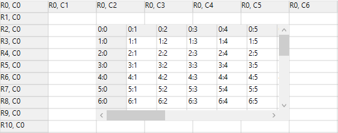

N> Similarly, you can also create a nested grid inside a whole column.

### Nested grid layout of row and column

[GridCellNestedGridModel](https://help.syncfusion.com/cr/wpf/Syncfusion.Windows.Controls.Grid.GridCellNestedGridModel.html) is the class to be used as model class for this cell type. Its constructor accepts two objects of type [GridNestedAxisLayout](https://help.syncfusion.com/cr/wpf/Syncfusion.Windows.Controls.Grid.GridNestedAxisLayout.html) enum, where the first parameter corresponds to row and second parameter corresponds to grid column. This enum value determines whether to share the row layout or column layout or the rows and columns are independent of parent grid.

### Multiple nested grid inside a covered range with its rows using row layout

You can add the multiple number of nested grid into the parent grid row using row layout. You can achieve this requirement by the following way.

First, You can add the nested grid into the parent grid row by using [grid.Model.CellModels.Add()](https://help.syncfusion.com/cr/wpf/Syncfusion.Windows.Controls.Grid.GridCellModelCollection.html#Syncfusion_Windows_Controls_Grid_GridCellModelCollection_Add_System_String_Syncfusion_Windows_Controls_Grid_GridCellModelBase_) method and need to specify the cell type as **ScrollGrid** in the first parameter and set the nested cell grid model ([GridCellNestedGridModel](https://help.syncfusion.com/cr/wpf/Syncfusion.Windows.Controls.Grid.GridCellNestedGridModel.html)) in the second parameter of this collection method. Before that, you must add a row and column to the nested grid and set the cell range for adding the nested grid to the row of parent grid.

N> You need to specify the row layout, use [GridNestedAxisLayout.Shared](https://help.syncfusion.com/cr/wpf/Syncfusion.Windows.Controls.Grid.GridNestedAxisLayout.html) enum in the first parameter and the [GridNestedAxisLayout.Normal](https://help.syncfusion.com/cr/wpf/Syncfusion.Windows.Controls.Grid.GridNestedAxisLayout.html) enum in the second parameter of `GridCellNestedGridModel`.

Next, you can add another nested grid inside the first nested grid by setting the specific range of first nested grid and again do this for adding another nested grid.

N> The nested grid will have its own unique column widths. But the row heights are shared with the parent grid.

For example, the below codes show a grid whose cell contains a nested grid, which again contains a nested grid in its cell, and this second nested grid again contains a nested grid in its cell.





// Add Nested Grid cell model.
GridCellNestedGridModel shareRow = new GridCellNestedGridModel(GridNestedAxisLayout.Shared, GridNestedAxisLayout.Normal);
gridControl.Model.CellModels.Add("ScrollGrid", shareRow);

// Setup nested grid with shared row layout
gridControl.Model.RowCount = 200;
gridControl.Model.ColumnCount = 12;
gridControl.Model[2, 2].CellType = "ScrollGrid";
gridControl.Model[2, 2].Background = SystemColors.InactiveCaptionBrush;
GridModel nestedGridWithSharedRowsModel = GetNestedGridWithSharedRowsModel();
gridControl.Model[2, 2].CellValue = nestedGridWithSharedRowsModel;
gridControl.CoveredCells.Add(new CoveredCellInfo(2, 2, 2 + nestedGridWithSharedRowsModel.RowCount - 1, 9));

// Setup the top level(parent) nested grid
private GridModel GetNestedGridWithSharedRowsModel()
{
    GridModel model = new GridModel();
    Pen gridLinePen = new Pen(Brushes.DarkGray, 1);
    gridLinePen.Freeze();
    model.Options.AllowSelection = GridSelectionFlags.Cell;           
    model.ColumnWidths.DefaultLineSize = 50;
    model.ColumnWidths.HeaderLineCount = 1;
    model.ColumnCount = 13;
    model.RowHeights.HeaderLineCount = 1;
    model.RowHeights.FooterLineCount = 1;
    model.RowCount = 151;
    Color clr = Color.FromArgb(128, 0, 0, 0);
    Brush headerBrush = new SolidColorBrush(clr);
    headerBrush.Freeze();
    Color clr2 = Color.FromArgb(128, 128, 0, 0);
    Brush footerBrush = new SolidColorBrush(clr2);
    footerBrush.Freeze();
    for (int i = 0; i < model.RowCount; i++)
    {
        for (int j = 0; j < model.ColumnCount; j++)
        {
            GridStyleInfo style = new GridStyleInfo();
            style.CellType = "TextBox";
            style.CellValue = String.Format("{0}:{1}", i, j);
            style.BorderMargins.Top = gridLinePen.Thickness;
            style.BorderMargins.Left = gridLinePen.Thickness;
            style.BorderMargins.Right = gridLinePen.Thickness / 2;
            style.BorderMargins.Bottom = gridLinePen.Thickness / 2;
            style.Borders.Right = gridLinePen;
            style.Background = null;
            style.Borders.Bottom = gridLinePen;
            model.Data[i, j] = style.Store;
            if (j == 0 || i == 0)
            {
                style.CellType = "Static";
                style.Background = headerBrush;
            }
            if (i == model.RowCount - 1)
            {
                style.CellType = "Static";
                style.Background = footerBrush;
            }
        }
    }
    model[5, 2].CellType = "ScrollGrid";
    model[5, 2].BorderMargins.Top = 0;
    model[5, 2].BorderMargins.Left = 0;
    model[5, 2].BorderMargins.Right = 0;
    model[5, 2].BorderMargins.Bottom = 0;
    model[5, 2].Background = SystemColors.InactiveCaptionBrush;        
    model.SelectedCells = GridRangeInfo.Empty;

    // Creates a nested grid for second level.
    GridModel nestedGridWithSharedRowsModel = GetSecondNestedGridWithSharedRowsModel();
    model[5, 2].CellValue = nestedGridWithSharedRowsModel;
    model.CoveredCells.Add(new CoveredCellInfo(5, 2, 5 + nestedGridWithSharedRowsModel.RowCount - 1, 7));
    return model;
}

// Setup the second level nested grid

private GridModel GetSecondNestedGridWithSharedRowsModel()
{
    GridModel model = new GridModel();
    Pen gridLinePen = new Pen(Brushes.DarkGray, 1);
    gridLinePen.Freeze();
    model.Options.AllowSelection = GridSelectionFlags.Cell;
    model.ColumnWidths.DefaultLineSize = 40;
    model.ColumnWidths.HeaderLineCount = 1;
    model.ColumnCount = 8;
    model.RowHeights.HeaderLineCount = 1;
    model.RowHeights.FooterLineCount = 1;
    model.RowCount = 121;
    Color clr = Color.FromArgb(128, 0, 0, 128);
    Brush headerBrush = new SolidColorBrush(clr);
    headerBrush.Freeze();
    Color clr2 = Color.FromArgb(128, 0, 128, 0);
    Brush footerBrush = new SolidColorBrush(clr2);
    footerBrush.Freeze();
    for (int i = 0; i < model.RowCount; i++)
    {
        for (int j = 0; j < model.ColumnCount; j++)
        {
            GridStyleInfo style = new GridStyleInfo();
            style.CellType = "TextBox";
            style.CellValue = String.Format("{0}:{1}", i, j);
            style.BorderMargins.Top = gridLinePen.Thickness;
            style.BorderMargins.Left = gridLinePen.Thickness;
            style.BorderMargins.Right = gridLinePen.Thickness / 2;
            style.BorderMargins.Bottom = gridLinePen.Thickness / 2;
            style.Borders.Right = gridLinePen;
            style.Background = null;// Brushes.White;
            style.Borders.Bottom = gridLinePen;
            model.Data[i, j] = style.Store;
            if (i == 0 || j == 0)
            {
                style.CellType = "Static";
                style.Background = headerBrush;
            }
            if (i == model.RowCount - 1)
            {
                style.CellType = "Static";
                style.Background = footerBrush;
            }           
        }
    }
    model[4, 2].CellType = "ScrollGrid";
    model[4, 2].BorderMargins.Top = 0;
    model[4, 2].BorderMargins.Left = 0;
    model[4, 2].BorderMargins.Right = 0;
    model[4, 2].BorderMargins.Bottom = 0;
    model[4, 2].Background = Brushes.Wheat;
    model.SelectedCells = GridRangeInfo.Empty;

    //Creates a nested grid for third level.
    GridModel nestedGridWithSharedRowsModel = GetThirdNestedGridWithSharedRowsModel();
    model[4, 2].CellValue = nestedGridWithSharedRowsModel;
    model.CoveredCells.Add(new CoveredCellInfo(4, 2, 4 + nestedGridWithSharedRowsModel.RowCount - 1, 5));
    return model;
}

// Setup the third level nested grid
private GridModel GetThirdNestedGridWithSharedRowsModel()
{
    GridModel model = new GridModel();
    Pen gridLinePen = new Pen(Brushes.DarkGray, 1);
    gridLinePen.Freeze();
    model.Options.AllowSelection = GridSelectionFlags.Cell;
    model.ColumnWidths.DefaultLineSize = 35;
    model.ColumnWidths.HeaderLineCount = 1;
    model.ColumnCount = 5;
    model.RowHeights.HeaderLineCount = 1;
    model.RowHeights.FooterLineCount = 1;
    model.RowCount = 31;
    Color clr = Color.FromArgb(128, 0, 128, 128);
    Brush headerBrush = new SolidColorBrush(clr);
    headerBrush.Freeze();
    Color clr2 = Color.FromArgb(128, 128, 128, 0);
    Brush footerBrush = new SolidColorBrush(clr2);
    footerBrush.Freeze();
    for (int i = 0; i < model.RowCount; i++)
    {
        for (int j = 0; j < model.ColumnCount; j++)
        {
            GridStyleInfo style = new GridStyleInfo();
            style.CellType = "TextBox";
            style.CellValue = String.Format("{0}:{1}", i, j);
            style.BorderMargins.Top = gridLinePen.Thickness;
            style.BorderMargins.Left = gridLinePen.Thickness;
            style.BorderMargins.Right = gridLinePen.Thickness / 2;
            style.BorderMargins.Bottom = gridLinePen.Thickness / 2;
            style.Borders.Right = gridLinePen;
            style.Background = null;
            style.Borders.Bottom = gridLinePen;
            model.Data[i, j] = style.Store;
            if (i == 0 || j == 0)
            {
                style.CellType = "Static";
                style.Background = headerBrush;
            }
            if (i == model.RowCount - 1)
            {
                style.CellType = "Static";
                style.Background = footerBrush;
            }
        }
    }
    model.SelectedCells = GridRangeInfo.Empty;
    return model;
}





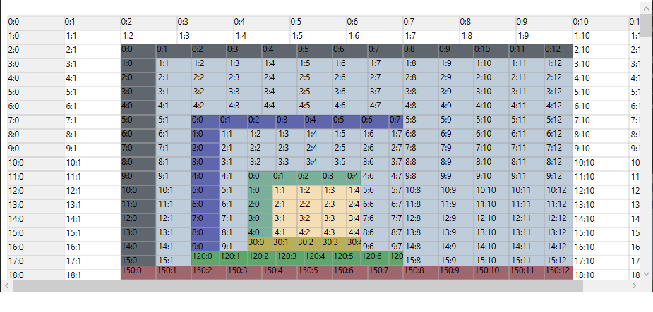

### Multiple nested grid inside a covered range with its columns using column layout

You can add the multiple number of nested grid into the parent grid column using column layout. You can achieve this requirement by the following way.

First, You can add the nested grid into the parent grid column by using [grid.Model.CellModels.Add()](https://help.syncfusion.com/cr/wpf/Syncfusion.Windows.Controls.Grid.GridCellModelCollection.html#Syncfusion_Windows_Controls_Grid_GridCellModelCollection_Add_System_String_Syncfusion_Windows_Controls_Grid_GridCellModelBase_) method and need to specify the cell type as **ScrollGrid** in the first parameter and set the nested cell grid model ([GridCellNestedGridModel](https://help.syncfusion.com/cr/wpf/Syncfusion.Windows.Controls.Grid.GridCellNestedGridModel.html)) in the second parameter of this collection method. Before that, you must add a row and column to the nested grid and set the cell range for adding the nested grid to the column of parent grid.

N> You need to specify the column layout, use [GridNestedAxisLayout.Shared](https://help.syncfusion.com/cr/wpf/Syncfusion.Windows.Controls.Grid.GridNestedAxisLayout.html) enum in the second parameter and [GridNestedAxisLayout.Normal](https://help.syncfusion.com/cr/wpf/Syncfusion.Windows.Controls.Grid.GridNestedAxisLayout.html) enum in the first parameter of `GridCellNestedGridModel`.

Next, you can add another nested grid inside the first nested grid by setting the specific range of first nested grid and again do this for adding another nested grid.

N> The nested grid will have its own unique row height. But the column widths are shared with the parent grid.

For example, the below codes show a grid whose cell contains a nested grid, which again contains a nested grid in its cell.





// Add the appropriate nested grid cell model.
GridCellNestedGridModel shareColumnLayoutGridModel = new GridCellNestedGridModel(GridNestedAxisLayout.Normal, GridNestedAxisLayout.Shared);
gridControl.Model.CellModels.Add("ScrollGrid", shareColumnLayoutGridModel);

gridControl.Model[2, 2].CellType = "ScrollGrid";
gridControl.Model[2, 2].BorderMargins.Top = 0;
gridControl.Model[2, 2].BorderMargins.Left = 0;
gridControl.Model[2, 2].BorderMargins.Right = 0;
gridControl.Model[2, 2].BorderMargins.Bottom = 0;
gridControl.Model[2, 2].Background = SystemColors.InactiveCaptionBrush;
GridModel nestedGridWithSharedColumnsModel = GetNestedGridWithSharedColumnsModel();

// Creates a nested grid with shared column layout.
gridControl.Model[2, 2].CellValue = nestedGridWithSharedColumnsModel;
gridControl.CoveredCells.Add(new CoveredCellInfo(2, 2, 20, 1 + nestedGridWithSharedColumnsModel.ColumnCount - 1));

// Sets up a nested grid with column layout shared
private GridModel GetNestedGridWithSharedColumnsModel()
{
    GridModel model = new GridModel();
    Pen gridLinePen = new Pen(Brushes.DarkGray, 1);
    gridLinePen.Freeze();
    model.Options.AllowSelection = GridSelectionFlags.Cell;
    model.ColumnWidths.HeaderLineCount = 1;
    model.ColumnCount = 10;
    model.RowHeights.HeaderLineCount = 1;
    model.RowHeights.FooterLineCount = 1;
    model.RowCount = 13;
    model.RowHeights.DefaultLineSize = 30;
    Color clr = Color.FromArgb(128, 0, 0, 0);
    Brush headerBrush = new SolidColorBrush(clr);
    headerBrush.Freeze();
    Color clr2 = Color.FromArgb(128, 128, 0, 0);
    Brush footerBrush = new SolidColorBrush(clr2);
    footerBrush.Freeze();
    for (int i = 0; i < model.RowCount; i++)
    {
        for (int j = 0; j < model.ColumnCount; j++)
        {
            GridStyleInfo style = new GridStyleInfo();
            style.CellType = "TextBox";
            style.CellValue = String.Format("{0}:{1}", i, j);
            style.BorderMargins.Top = gridLinePen.Thickness;
            style.BorderMargins.Left = gridLinePen.Thickness;
            style.BorderMargins.Right = gridLinePen.Thickness / 2;
            style.BorderMargins.Bottom = gridLinePen.Thickness / 2;
            style.Borders.Right = gridLinePen;
            style.Background = null;
            style.Borders.Bottom = gridLinePen;
            model.Data[i, j] = style.Store;
            if (j == 0 || i == 0)
            {
                style.CellType = "Static";
                style.Background = headerBrush;
            }
            if (j == 3 || i == 3)
            {
                style.CellType = "CheckBox";
                style.CellValue = false;
            }
            if (j == 4 || i == 4)
            {
                style.CellType = "Static";
                style.CellValue = "Static";
            }
            if (i == model.RowCount - 1)
            {
                style.CellType = "Static";
                style.Background = footerBrush;
            }
        }
    }
    model[4, 2].CellType = "ScrollGrid";
    model[4, 2].BorderMargins.Top = 0;
    model[4, 2].BorderMargins.Left = 0;
    model[4, 2].BorderMargins.Right = 0;
    model[4, 2].BorderMargins.Bottom = 0;
    model[4, 2].Background = SystemColors.InactiveCaptionBrush;
    model.SelectedCells = GridRangeInfo.Empty;

    // Creates a nested grid for second level.
    GridModel nestedGridWithSharedColumnsModel = GetSecondNestedGridWithSharedColumnssModel();
    model[4, 2].CellValue = nestedGridWithSharedColumnsModel;
    model.CoveredCells.Add(new CoveredCellInfo(4, 2, 10, 1 + nestedGridWithSharedColumnsModel.ColumnCount - 1));

    return model;
}

private GridModel GetSecondNestedGridWithSharedColumnssModel()
{
    GridModel model = new GridModel();
    Pen gridLinePen = new Pen(Brushes.DarkGray, 1);
    gridLinePen.Freeze();
    model.Options.AllowSelection = GridSelectionFlags.Cell;
    model.ColumnWidths.HeaderLineCount = 1;
    model.ColumnCount = 10;
    model.RowHeights.HeaderLineCount = 1;
    model.RowHeights.FooterLineCount = 1;
    model.RowCount = 13;
    model.RowHeights.DefaultLineSize = 30;
    Color clr = Color.FromArgb(128, 0, 128, 128);
    Brush headerBrush = new SolidColorBrush(clr);
    headerBrush.Freeze();
    Color clr2 = Color.FromArgb(128, 128, 128, 0);
    Brush footerBrush = new SolidColorBrush(clr2);
    footerBrush.Freeze();
    for (int i = 0; i < model.RowCount; i++)
    {
        for (int j = 0; j < model.ColumnCount; j++)
        {
            GridStyleInfo style = new GridStyleInfo();
            style.CellType = "TextBox";
            style.CellValue = String.Format("{0}:{1}", i, j);
            style.BorderMargins.Top = gridLinePen.Thickness;
            style.BorderMargins.Left = gridLinePen.Thickness;
            style.BorderMargins.Right = gridLinePen.Thickness / 2;
            style.BorderMargins.Bottom = gridLinePen.Thickness / 2;
            style.Borders.Right = gridLinePen;
            style.Background = null;
            style.Borders.Bottom = gridLinePen;
            model.Data[i, j] = style.Store;
            if (j == 0 || i == 0)
            {
                style.CellType = "Static";
                style.Background = headerBrush;
            }
            if (i == model.RowCount - 1)
            {
                style.CellType = "Static";
                style.Background = footerBrush;
            }
        }
    }
    model.SelectedCells = GridRangeInfo.Empty;
    return model;
}





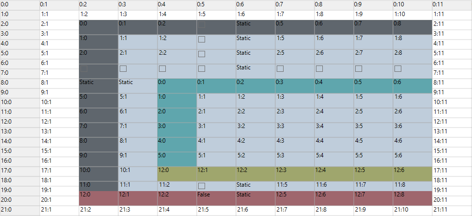

### Nested grid inside a covered with its rows and columns independent of parent grid

You can add the nested grid into the parent grid row and column by using [grid.Model.CellModels.Add()](https://help.syncfusion.com/cr/wpf/Syncfusion.Windows.Controls.Grid.GridCellModelCollection.html#Syncfusion_Windows_Controls_Grid_GridCellModelCollection_Add_System_String_Syncfusion_Windows_Controls_Grid_GridCellModelBase_) method and need to specify the cell type as **ScrollGrid** in the first parameter and set the nested cell grid model ([GridCellNestedGridModel](https://help.syncfusion.com/cr/wpf/Syncfusion.Windows.Controls.Grid.GridCellNestedGridModel.html)) in the second parameter of this collection method. Before that, you must add a row and column to the nested grid and set the cell range for adding the nested grid to the row of parent grid.

N> You need to specify the row and column layout, use `Normal` option of [GridNestedAxisLayout](https://help.syncfusion.com/cr/wpf/Syncfusion.Windows.Controls.Grid.GridNestedAxisLayout.html) enum in both parameter of `GridCellNestedGridModel`.

In this case, The nested grid maintains its own row heights and column widths. You can scroll through this grid without scrolling the parent grid. You can resize the rows and columns in the nested grid without affect the parent grid.

For example, the below code is how to make rows and columns independent of parent grid.





// Add Nested Grid cell model.
GridCellNestedGridModel gridModel = new GridCellNestedGridModel(GridNestedAxisLayout.Normal, GridNestedAxisLayout.Normal);
gridControl.Model.CellModels.Add("ScrollGrid", gridModel);
gridControl.Model[3, 2].CellType = "ScrollGrid";

// Create a simple nested grid.
GridModel model = new GridModel();
model.Options.AllowSelection = GridSelectionFlags.Cell;
model.RowHeights.DefaultLineSize = 20;
model.RowCount = 20;
model.ColumnWidths.DefaultLineSize = 50;
model.ColumnCount = 8;
model.HeaderRows = 0;
model.FrozenRows = 0;
model.HeaderColumns = 1;
model.FrozenColumns = 1;
for (int i = 0; i < model.RowCount; i++)
{
    for (int j = 0; j < model.ColumnCount; j++)
    {
        GridStyleInfo style = new GridStyleInfo();
        style.CellType = "TextBox";
        style.CellValue = String.Format("{0}:{1}", i, j);
        model.Data[i, j] = style.Store;
    }
}
gridControl.Model[3, 2].CellValue = model;
gridControl.CoveredCells.Add(new CoveredCellInfo(3, 2, 5, 4));





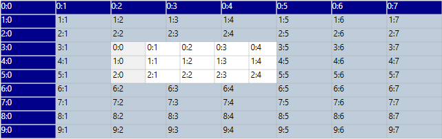

N> [View sample in GitHub](https://github.com/SyncfusionExamples/nestedgird-in-wpf-girdcontrol)

##  Creating custom cell type

Essential Grid allows you to create custom derived controls to use additional cell types. This requires a cell model class and a cell renderer class. The cell model class creates the actual cell control while the cell renderer class handles the UI requirements of the cell control. The custom cell type can be created by  registering the cell model to the corresponding grid by naming this cell type. It can be enabled by assigning its name to the style.CellType property.

In general, the built-in cell types are also constructed only in this way. Every such cell type has its own cell model and renderer classes in the code base. These cell model and renderer classes originate from GridCellModelBase and GridCellRendererBase classes. These two classes define the basic functionality for a cell type.

Examples of custom cell types are discussed in later sections.

### Custom Drop-down Cells

This cell displays customized drop-downs in grid cells. To attach a drop-down to a grid cell, you need to derive from GridCellDropDownCellModel and GridCellDropDownCellRenderer classes.

For example, let us create a custom drop-down which lists an image alongside text in each entry and sets the text of the current drop-down selection as the cell value. The cell model class just creates the cell type by calling the cell renderer. The cell renderer then loads the cell with ImageTextListBoxItem (a custom control having two properties, Image and Text) to show image alongside text. The renderer then overrides the ArrangeUIElement method in order to bind the drop down to the data source, which is a collection of ImageTextListBoxItem and sets its current selection based on current cell value. It triggers the ComboBoxSelectionChanged event to set the new cell value based on the current drop-down selection. 

#### CellModel class



public class CustomeDropDownCellModel : GridCellDropDownCellModel<CustomDropDownRenderer>
{
}



#### CellRenderer Class



public class CustomDropDownRenderer : GridCellDropDownCellRenderer<CustomeDropDown>
{

    private CustomeDropDownCellModel CustomDropDownModel
    {
        get
        {
            return this.CellModel as CustomeDropDownCellModel;
        }
    }

    public override void OnInitializeContent(CustomeDropDown dropDownControl, GridRenderStyleInfo style)
    {

        if (dropDownControl.ListBoxPart != null)
        {
            dropDownControl.ListBoxPart.SelectionChanged -= this.OnComboBoxSelectionChanged;
        }
        base.OnInitializeContent(dropDownControl, style);
    }

    protected override void ArrangeUIElement(Syncfusion.Windows.Controls.Cells.ArrangeCellArgs aca, CustomeDropDown uiElement, GridRenderStyleInfo style)
    {
        base.ArrangeUIElement(aca, uiElement, style);
        var dropDownControl = uiElement;

        if (style.ItemsSource != null)
        {
            dropDownControl.ListBoxPart.ItemsSource = this.CustomDropDownModel.GetDataSource(style);
            dropDownControl.ListBoxPart.DisplayMemberPath = style.HasDisplayMember ? style.DisplayMember : string.Empty;
            dropDownControl.ListBoxPart.SelectedValue = this.GetControlValue(style);

            if (style.HasValueMember)
            {
                dropDownControl.ListBoxPart.SelectedValuePath = style.ValueMember;
            }
        }
        uiElement.ListBoxPart.SelectionChanged += this.OnComboBoxSelectionChanged;
    }

    protected override void SetSelectedIndex(int index)
    {

        if (index != this.CurrentCellUIElement.ListBoxPart.SelectedIndex)
        {
            this.CurrentCellUIElement.ListBoxPart.SelectedIndex = index;
        }
    }

    private void OnComboBoxSelectionChanged(object sender, SelectionChangedEventArgs e)
    {

        if (e.AddedItems.Count > 0)
        {
            var item = e.AddedItems[0].ToString();
            this.CustomDropDownModel.ListModel.CurrentIndex = this.CustomDropDownModel.FindValue(this.CurrentStyle, item);

            if (!this.AlreadyTextChanged)
            {
                this.CurrentCellUIElement.TextBoxPart.Text = item;
            }
        }
    }
}



#### Custom Drop-down control



public class CustomeDropDown : GridCellDropDownControlBase
{

    public ImageTextListBox ListBoxPart
    {
        get
        {
            if (this.PopupContent != null)
            {
                return this.PopupContent.Content as ImageTextListBox;
            }
            return null;
        }
    }

    public override void OnApplyTemplate()
    {
        base.OnApplyTemplate();
    }

    protected override void OnContentLoaded(ContentControl popupContent)
    {
        ImageTextListBox l = new ImageTextListBox(this);
        l.Height = 200;
        popupContent.Content = l;

        // this will wire the events in the base implementation
        base.OnContentLoaded(popupContent);
    }
}



#### Associate this Cell Type to the Grid



// Registering the cell model
this.grid.Model.CellModels.Add("CustomDropDown", new CustomeDropDownCellModel());

// Binding the celltype
var dropdown1 = this.grid.Model[7, 2];
dropdown1.CellType = "CustomDropDown";
dropdown1.ItemsSource = GenerateListBoxContent();
dropdown1.DisplayMember = "Text";
dropdown1.DropDownStyle = GridDropDownStyle.Editable;



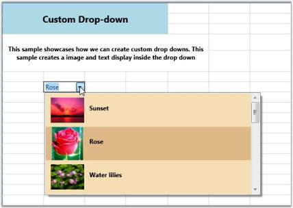

N> Download demo application from [GitHub](https://github.com/syncfusion/wpf-demos/tree/master/GridControl/Cell%20Types/Custom%20Drop%20Down)

### Data Template Cells

This cell builds a custom data template that can be used to set enriched styles for associated cells. The DataTemplateCellModel creates the cell type with a Content Control (a WPF control) by calling the renderer. 

N> To create a cell type that hosts a WPF control, you should derive it from GridVirtualizingCellRenderer. The most important method to override is the OnInitializeContent method. It will be called for every UI element created for cells displaying this renderer. You can get access to the cell style from this method.

The DataTemplateCellRenderer is derived from GridVirtualizingCellRenderer and overrides OnInitializeContent and sets the Content Control template to Style.CellItemTemplate value.

#### CellModel Class



public class DataTemplateCellModel : GridCellModel<DataTemplateCellRenderer>
{
}



#### CellRenderer Class



public class DataTemplateCellRenderer : GridVirtualizingCellRenderer<ContentControl>
{

    public DataTemplateCellRenderer()
    {
        IsFocusable = true;
        AllowRecycle = true;
    }

    public override void OnInitializeContent(ContentControl uiElement, GridRenderStyleInfo style)
    {
        base.OnInitializeContent(uiElement, style);
        bool found = false;

    if (style.CellItemTemplateKey != null)
        {
            DataTemplate dt = (DataTemplate)style.GridControl.TryFindResource(style.CellItemTemplateKey);
            found = dt != null;

            if (found)
                uiElement.ContentTemplate = dt;
        }

        if (!found)
            uiElement.ContentTemplate = style.CellItemTemplate;

        uiElement.Content = style.CellValue;
    }

    public override void CreateRendererElement(ContentControl uiElement, GridRenderStyleInfo style)
    {

        bool found = false;

        if (style.CellItemTemplateKey != null)
        {
            DataTemplate dt = (DataTemplate)style.GridControl.TryFindResource(style.CellItemTemplateKey);
            found = dt != null;
            if (found)
                uiElement.ContentTemplate = dt;
        }

        if (!found)
            uiElement.ContentTemplate = style.CellItemTemplate;

        uiElement.Content = style.CellValue;
        base.CreateRendererElement(uiElement, style);
    }
	
    protected override string GetControlTextFromEditorCore(ContentControl uiElement)
    {
        return uiElement.Content.ToString();
    }
}



#### Data Template Definition



<DataTemplate x:Key="editableEmployee">
<StackPanel Margin="8,0"  Orientation="Horizontal">
<TextBlock FontWeight="Bold" syncfusion:VisualContainer.WantsMouseInput="False" Text="{Binding Path=Name}" Width="70" />
<TextBox Text="{Binding Path=Title}" BorderThickness="0"  Padding="0" Margin="0" Width="130" x:Name="tb"/>
</StackPanel>
</DataTemplate>



#### Setting up the Data Template Cell and assigning the Cell Template



grid.Model.CellModels.Add("DataTemplate", new DataTemplateCellModel());
grid.Model.QueryCellInfo += new Syncfusion.Windows.Controls.Grid.GridQueryCellInfoEventHandler(Model_QueryCellInfo);

void Model_QueryCellInfo(object sender, Syncfusion.Windows.Controls.Grid.GridQueryCellInfoEventArgs e)
{

    if (e.Cell.RowIndex > 1 && e.Cell.ColumnIndex == 2)
    {
        e.Style.CellType = "DataTemplate";
        e.Style.CellItemTemplateKey = "editableEmployee";
        e.Style.CellValue = employeesSource.Employees[e.Cell.RowIndex % employeesSource.Employees.Count];
        e.Style.Background = Brushes.Linen;
    }
}



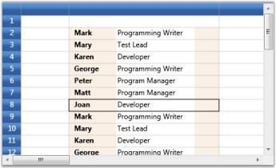

N> Download demo application from [GitHub](https://github.com/syncfusion/wpf-demos/tree/master/GridControl/Cell%20Types/Data%20Template%20Cell)

### Rich Text Box Cells

The Rich Text control will allow you to display and edit rich text in grid cells. The control will allow you to modify the rich text through in-place editing.

For example, It can be built by hosting the Rich Text Box control in grid cells. To host this control, the cell renderer must be derived from GridVirtualizingCellRenderer, whose OnInitializeContent should be overridden to provide the content (as Flow Document) for the rich text box. 

#### CellModel class



public class RichTextBoxCellModel : GridCellModel<RichTextBoxCellRenderer>
{
}



#### CellRenderer class



public class RichTextBoxCellRenderer : GridVirtualizingCellRenderer<RichTextBox>
{

    public RichTextBoxCellRenderer()
    {
        IsControlTextShown = false;
        IsFocusable = true;
    }

    public override void OnInitializeContent(RichTextBox textBox, GridRenderStyleInfo style)
    {
        textBox.Padding = new Thickness(0);
        FlowDocument document = GetControlValue(style) as FlowDocument;

        if (document == null)
            textBox.Document = new FlowDocument();

        if (document.Parent != null)
        {
            var parentTextBox = document.Parent as RichTextBox;

            parentTextBox.Document = new FlowDocument();
        }
        textBox.Document = document;
        VirtualizingCellsControl.SetWantsMouseInput(textBox, true);
    }

    protected override void OnUnwireUIElement(RichTextBox uiElement)
    {
        uiElement.Document = new FlowDocument();
        base.OnUnwireUIElement(uiElement);
    }

    protected override object GetControlValueFromEditorCore(RichTextBox uiElement)
    {
        return uiElement.Document;
    }

    protected override void OnGridPreviewTextInput(TextCompositionEventArgs e)
    {
        CurrentCell.ScrollInView();
        CurrentCell.BeginEdit(true);
    }

    protected override bool ShouldGridTryToHandlePreviewKeyDown(KeyEventArgs e)
    {

        if (CurrentCellUIElement.IsFocused && e.Key != Key.Escape)
            return false;
        return true;
    }
}



#### Setting up Rich Text Box Cell



grid.Model.CellModels.Add("RichText", new RichTextBoxCellModel());
grid.Model.CellModels.Add("FlowDocumentReader", new FlowDocumentReaderCellModel());
{

// Create a FlowDocument to contain content for the RichTextBox.
FlowDocument myFlowDoc = new FlowDocument();

// Add paragraphs to the FlowDocument.
myFlowDoc.Blocks.Add(new Paragraph(new Run("Paragraph 1")));
myFlowDoc.Blocks.Add(new Paragraph(new Run("Paragraph 2")));
myFlowDoc.Blocks.Add(new Paragraph(new Run("Paragraph 3")));
grid.Model[2, 2].CellType = "RichText";
grid.Model[2, 2].CellValue = myFlowDoc;
grid.Model.CoveredCells.Add(new CoveredCellInfo(2, 2, 8, 8));
}
{
Paragraph myParagraph = new Paragraph();

// Add some Bold text to the paragraph
myParagraph.Inlines.Add(new Bold(new Run("Some bold text in the paragraph.")));

// Add some plain text to the paragraph
myParagraph.Inlines.Add(new Run(" Some text that is not bold."));

// Create a List and populate with three list items.
List myList = new List();

// First create paragraphs to go into the list item.
Paragraph paragraphListItem1 = new Paragraph(new Run("ListItem 1"));
Paragraph paragraphListItem2 = new Paragraph(new Run("ListItem 2"));
Paragraph paragraphListItem3 = new Paragraph(new Run("ListItem 3"));

// Add ListItems with paragraphs in them.
myList.ListItems.Add(new ListItem(paragraphListItem1));
myList.ListItems.Add(new ListItem(paragraphListItem2));
myList.ListItems.Add(new ListItem(paragraphListItem3));

// Create a FlowDocument with the paragraph and list.
FlowDocument myFlowDocument = new FlowDocument();
myFlowDocument.Blocks.Add(myParagraph);
myFlowDocument.Blocks.Add(myList);

grid.Model[10, 2].CellType = "RichText";
grid.Model[10, 2].CellValue = myFlowDocument;
}



### Chart Cells

Grid provides inherent support to host chart controls. This is achieved by using Data Template cells. 

1.Define the Data Template that creates a chart. The template below illustrates the creation of a chart control with a single series and defines its attributes. 



<local:MyDataCollection x:Key="SeriesData1"/>
<DataTemplate x:Key="DataChart">
<!--Hosting Chart control in second Row of the Grid-->
<syncfusion:Chart   x:Name="Chart1" Grid.Row="1" Margin="15">
<!--Chart Legend declaration-->
<syncfusion:Chart.Legends>
<syncfusion:ChartLegend />
</syncfusion:Chart.Legends>
<!--Chart area to present chart segments-->
<syncfusion:ChartArea IsContextMenuEnabled="True" >
<!--Primary Axis(X)-->
<syncfusion:ChartArea.PrimaryAxis>
<!--X axis declaration with required property settings-->
<syncfusion:ChartAxis Header="Year" Interval="2" >
</syncfusion:ChartAxis>
</syncfusion:ChartArea.PrimaryAxis>
<!--Secondary Axis(Y)-->
<syncfusion:ChartArea.SecondaryAxis>
<!--Y axis declaration with required property settings-->
<syncfusion:ChartAxis Header="Profit" SmallTicksPerInterval="0"  LabelFormat="0.00">
</syncfusion:ChartAxis>
</syncfusion:ChartArea.SecondaryAxis>
<!--Chart 1st series declaration-->
<syncfusion:ChartSeries Name="series1" Label="Profit in $"  Type="Spline" StrokeThickness=" 3" Interior="Green"  DataSource="{StaticResource SeriesData1}" 
BindingPathX="Year" BindingPathsY="Y1" IsIndexed="False">
</syncfusion:ChartSeries>
</syncfusion:ChartArea>
</syncfusion:Chart>
</DataTemplate >



Here is the data source definition that is used to define the chart series.



public class MyData
{
    public int Year { get; set; }
    public double Y1 { get; set; }
    public double Y2 { get; set; }
    public double Y3 { get; set; }
    public double Y4 { get; set; }
}

public class MyDataCollection : ObservableCollection<MyData>
{

    public MyDataCollection()
    {
        Random rand = new Random(DateTime.Now.Millisecond);
        DateTime cdate = DateTime.Today.AddYears(-6);

        for (int i = 0; i < 5; i++)
        {
            this.Add(new MyData()
            {
                Year = cdate.AddYears(i).Year,
                Y1 = rand.Next(700, 1200),
            });
        }
    }
}



2.Bind the above template to the grid cell to form a chart cell.



var cell = grid.Model[2, 2];
cell.CellType = "DataTemplate";
cell.CellItemTemplateKey = "DataChart";
grid.Model.RowHeights[2] = 400d;



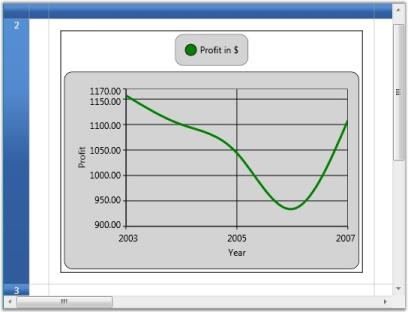

## Inserting Images into Grid Cells

Grid provides inherent support to add images into grid cells. There are two possible ways to achieve this.

* Style.Image property—Used to insert an image alongside the text in the grid cells.
* Style.ImageList property—It serves the same purpose as the Image property, points to a collection of images and lets you share the same ImageSource for a group of cells. Once you have selected the images by using the ImageList property, you must set the ImageIndex property for individual cells, to indicate the specific image (from the ImageList) to be inserted into the cell.

N> If you use both Image and ImageList properties, then the most recent property applied will be considered.

The following code example illustrates how to use these properties.



// Using Vector Images.
ResourceDictionary dictionary = new ResourceDictionary();
dictionary.Source = new Uri(vectorImgSrcUri, UriKind.RelativeOrAbsolute);
ObservableCollection<Image> imgList = new ObservableCollection<Image>();

// Loading ImageList.

foreach (string key in dictionary.Keys)
{
   Image img = new Image();
   img.Source = (DrawingImage)dictionary["Technology"];
   imgList.Add(img);   
}

// Setting ImageList.
grid.Model.TableStyle.ImageList = imgList;

// Image property setting.
grid.Model[0, 2].Text = "Technology";
Image img = new Image();
img.Source = new BitmapImage(new Uri("Technology.png", UriKind.Absolute));
grid.Model[0, 2].Image = img;

// Setting ImageIndex.
grid.Model[1, 2].Text = "Business";
grid.Model[1, 2].ImageIndex = 0;
grid.Model[2, 2].Text = "Software";
grid.Model[2, 2].ImageIndex = 1;



The following output is generated using the code above.

