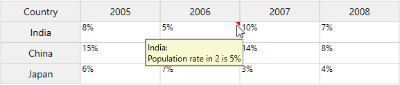
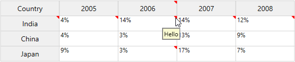
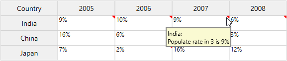
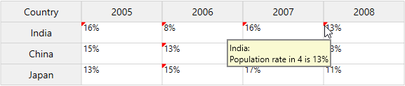
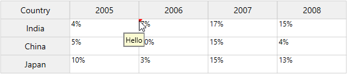
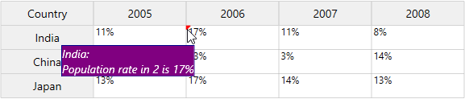

# Comment Tip in WPF GridControl

Comment Tip can be added to individual cells, rows and columns to show more information about the particular cell on mouse hover. You can set the comment indicator at any position (TopLeft, TopRight, BottomLeft and BottomRight) in a specific cell or row or column by using [GridCommentStyleInfo](https://help.syncfusion.com/cr/wpf/Syncfusion.Windows.Controls.Grid.GridCommentStyleInfo.html). Comment Tip service can be enabled by setting [GridCommentService.SetShowComment](https://help.syncfusion.com/cr/wpf/Syncfusion.Windows.Controls.Grid.GridCommentService.html#Syncfusion_Windows_Controls_Grid_GridCommentService_SetShowComment_System_Windows_DependencyObject_System_Boolean_) attached property to `true`.

## Comment Tip for specific cell

The comment tip can be added to the specific cell by setting the [Comment](https://help.syncfusion.com/cr/wpf/Syncfusion.Windows.Controls.Grid.GridStyleInfo.html#Syncfusion_Windows_Controls_Grid_GridStyleInfo_Comment) property. The comment indicator will be shown at the top right corner of the cell.





grid.Model[1, 2].Comment = grid.Model[1, 0].CellValue + ":\nPopulation rate in " + grid.Model[1, 2].ColumnIndex + " is " + grid.Model[1, 2].CellValue;





## Comment Tip for row and column

The Comment tip can be added to specific row or column by setting the [Comment](https://help.syncfusion.com/cr/wpf/Syncfusion.Windows.Controls.Grid.GridStyleInfo.html#Syncfusion_Windows_Controls_Grid_GridStyleInfo_Comment) property. The comment indicator will be shown at the top right corner of the cell.





//Adding comment tip to the specific row
grid.Model.RowStyles[1].Comment = "Hello";

//Adding comment tip to the specific column
grid.Model.ColStyles[2].Comment = "Hello";





An another way to set the comment tip for specific row and column,





//Add CommentTip for specific row
for (int i = 1; i <= 4; i++)
{
    string comment = grid.Model[1, 0].CellValue + " :\nPopulate rate in " + grid.Model[1, i].ColumnIndex + " is " + grid.Model[1, i].CellValue;
    grid.Model[1, i].Comment = comment;
}

//Add CommentTip for specific column
for (int i = 1; i < 4; i++)
{
    string comment = grid.Model[i, 0].CellValue + " :\nPopulate rate in " + grid.Model[i, 2].RowIndex + " is " + grid.Model[i, 2].CellValue;
    grid.Model[i, 2].Comment = comment;
}





N> [View sample in GitHub](https://github.com/SyncfusionExamples/WPF-GridControl-CommentTip/tree/master/commenttip_simple)

## Change comment indicator position

Setting [Comment](https://help.syncfusion.com/cr/wpf/Syncfusion.Windows.Controls.Grid.GridStyleInfo.html#Syncfusion_Windows_Controls_Grid_GridStyleInfo_Comment) property always displays comment indicator at top right corner of the cell. You can change the comment indicator position for a specific cell by using [GridCommentStyleInfo](https://help.syncfusion.com/cr/wpf/Syncfusion.Windows.Controls.Grid.GridCommentStyleInfo.html). For example, you can set the comment indicator at top position for any cell by setting [GridCommentStyleInfo.TopLeftComment](https://help.syncfusion.com/cr/wpf/Syncfusion.Windows.Controls.Grid.GridCommentStyleInfo.html#Syncfusion_Windows_Controls_Grid_GridCommentStyleInfo_TopLeftComment) or [GridCommentStyleInfo.TopRightComment](https://help.syncfusion.com/cr/wpf/Syncfusion.Windows.Controls.Grid.GridCommentStyleInfo.html#Syncfusion_Windows_Controls_Grid_GridCommentStyleInfo_TopRightComment) properties.

N> You can display comment for all four corners at the same time. 





GridCommentStyleInfo styleInfo = new GridCommentStyleInfo();

// set the comment for specific cell
grid.Model[1, 2].GridCommentStyleInfo.TopLeftCommentBrush = Brushes.Red;
grid.Model[1, 2].GridCommentStyleInfo.TopLeftCommentBrush = Brushes.Red;
grid.Model[1, 2].GridCommentStyleInfo.TopLeftComment = grid.Model[1, 0].CellValue + ": \nPopulation rate in " + grid.Model[1, 2].ColumnIndex + " is " + grid.Model[1, 2].CellValue;

//Set comment tip for specific row
for (int i = 1; i <= 4; i++)
{
    //Set comment tip for specific row
    if (grid.Model[1, i].RowIndex == 1 && grid.Model[1, i].ColumnIndex > 0)
    {
        grid.Model[1, i].GridCommentStyleInfo.TopLeftCommentBrush = Brushes.Red;
        grid.Model[1, i].GridCommentStyleInfo.TopLeftComment = grid.Model[1, 0].CellValue + ": \nPopulation rate in " + grid.Model[1, i].ColumnIndex + " is " + grid.Model[1, i].CellValue;
    }
}

//Set comment tip for specific column
for (int i = 1; i < 4; i++)
{
    if (grid.Model[i, 2].ColumnIndex == 2 && grid.Model[i, 2].RowIndex > 0)
    {
        grid.Model[i, 2].GridCommentStyleInfo.TopLeftCommentBrush = Brushes.Red;
        grid.Model[i, 2].GridCommentStyleInfo.TopLeftComment = grid.Model[i, 0].CellValue + ": \nPopulation rate in " + grid.Model[i, 2].RowIndex + " is " + grid.Model[i, 2].CellValue;
    }
}





N> [View sample in GitHub](https://github.com/SyncfusionExamples/WPF-GridControl-CommentTip/tree/master/commenttip)

N> Similarly, You can also set the comment indicator at bottom position for any cell or row or column by setting the [BottomLeftComment](https://help.syncfusion.com/cr/wpf/Syncfusion.Windows.Controls.Grid.GridCommentStyleInfo.html#Syncfusion_Windows_Controls_Grid_GridCommentStyleInfo_BottomLeftComment) and [BottomRightComment](https://help.syncfusion.com/cr/wpf/Syncfusion.Windows.Controls.Grid.GridCommentStyleInfo.html#Syncfusion_Windows_Controls_Grid_GridCommentStyleInfo_BottomRightComment) properties.

## Set CommentTip using QueryCellInfo

You can set the comment tip to a specific cell or row or column by using [QueryCellInfo](https://help.syncfusion.com/cr/wpf/Syncfusion.Windows.Controls.Grid.GridModel.html) event.





private void Model_QueryCellInfo(object sender, GridQueryCellInfoEventArgs e)
{
    GridCommentStyleInfo gridStyleInfo = new GridCommentStyleInfo();

    //Set comment tip for specific cell
    if (e.Style.RowIndex == 1 && e.Style.ColumnIndex == 2)
    {
        e.Style.GridCommentStyleInfo.TopLeftCommentBrush = Brushes.Red;
        e.Style.GridCommentStyleInfo.TopLeftComment = e.Style.GridModel[1, 0].CellValue + ": \nPopulation rate in " + e.Style.ColumnIndex + " is " + e.Style.CellValue.ToString();
    }

    //set comment tip for specific row
    if (e.Style.RowIndex == 1 && e.Style.ColumnIndex > 0)
    {
        e.Style.GridCommentStyleInfo.TopLeftCommentBrush = Brushes.Red;
        e.Style.GridCommentStyleInfo.TopLeftComment = e.Style.GridModel[1, 0].CellValue + ": \nPopulation rate in " + e.Style.ColumnIndex + " is " + e.Style.CellValue.ToString();
    }

    //Set comment tip for specific column
    if (e.Style.ColumnIndex == 2)
    {
        e.Style.GridCommentStyleInfo.TopLeftCommentBrush = Brushes.Red;
        e.Style.GridCommentStyleInfo.TopLeftComment = e.Style.GridModel[e.Style.RowIndex, 0].CellValue + ": \nPopulation rate in " + e.Style.RowIndex + " is " + e.Style.CellValue.ToString();
    }
}





N> [View sample in GitHub](https://github.com/SyncfusionExamples/WPF-GridControl-CommentTip/tree/master/commenttip_using_querycellinfo)

## Handling CommentTip opening event

The [CellCommentOpening](https://help.syncfusion.com/cr/wpf/Syncfusion.Windows.Controls.Grid.GridControlBase.html) event will be triggered when the mouse hover on the cell has a comment indicator.





//CellCommentOpening event
grid.CellCommentOpening += Grid_CellCommentOpening;

grid.CellCommentOpening += Grid_CellCommentOpening;
private void Grid_CellCommentOpening(object sender, GridCellCommentOpeningEventArgs e)
{
    var grids = sender as GridControl;
    if (e.Cell.RowIndex == 1 && e.Cell.ColumnIndex == 2)
        grids.Model[e.Cell.RowIndex, e.Cell.ColumnIndex].GridCommentStyleInfo.TopLeftComment = "Hello";
}





## Customize the CommentTip

The comment tip appearance can be customized by defining DataTemplate. The DataTemplate can be assigned to [GridStyleInfo.CommentTemplateKey](https://help.syncfusion.com/cr/wpf/Syncfusion.Windows.Controls.Grid.GridStyleInfo.html#Syncfusion_Windows_Controls_Grid_GridStyleInfo_CommentTemplateKey). If you are using [TopLeftComment](https://help.syncfusion.com/cr/wpf/Syncfusion.Windows.Controls.Grid.GridCommentStyleInfo.html#Syncfusion_Windows_Controls_Grid_GridCommentStyleInfo_TopLeftComment), [TopRightComment](https://help.syncfusion.com/cr/wpf/Syncfusion.Windows.Controls.Grid.GridCommentStyleInfo.html#Syncfusion_Windows_Controls_Grid_GridCommentStyleInfo_TopRightComment), [BottomRightComment](https://help.syncfusion.com/cr/wpf/Syncfusion.Windows.Controls.Grid.GridCommentStyleInfo.html#Syncfusion_Windows_Controls_Grid_GridCommentStyleInfo_BottomRightComment), or [BottomLeftComment](https://help.syncfusion.com/cr/wpf/Syncfusion.Windows.Controls.Grid.GridCommentStyleInfo.html#Syncfusion_Windows_Controls_Grid_GridCommentStyleInfo_BottomLeftComment) then you need to assign template to its corresponding template key property namely [GridCommentStyleInfo.TopLeftCommentTemplateKey](https://help.syncfusion.com/cr/wpf/Syncfusion.Windows.Controls.Grid.GridCommentStyleInfo.html#Syncfusion_Windows_Controls_Grid_GridCommentStyleInfo_TopLeftCommentTemplateKey), [GridCommentStyleInfo.TopRightCommentTemplateKey](https://help.syncfusion.com/cr/wpf/Syncfusion.Windows.Controls.Grid.GridCommentStyleInfo.html#Syncfusion_Windows_Controls_Grid_GridCommentStyleInfo_TopRightCommentTemplateKey), [GridCommentStyleInfo.BottomLeftCommentTemplateKey](https://help.syncfusion.com/cr/wpf/Syncfusion.Windows.Controls.Grid.GridCommentStyleInfo.html#Syncfusion_Windows_Controls_Grid_GridCommentStyleInfo_BottomLeftCommentTemplateKey) or [GridCommentStyleInfo.BottomRightCommentTemplateKey](https://help.syncfusion.com/cr/wpf/Syncfusion.Windows.Controls.Grid.GridCommentStyleInfo.html#Syncfusion_Windows_Controls_Grid_GridCommentStyleInfo_BottomRightCommentTemplateKey).

[GridStyleInfo](https://help.syncfusion.com/cr/wpf/Syncfusion.Windows.Controls.Grid.GridStyleInfo.html) which holds cell information is the `DataContext` for data template of comment. 

In the below code TopLeft comment is customized.





<Window.Resources>
    <DataTemplate x:Key="TopLeftComment">
        <Border x:Name="border" BorderThickness="1" BorderBrush="DarkBlue">
            <TextBlock Background="Purple" Foreground="White" FontSize="14" FontStyle="Italic" Text="{Binding Comment}" />
        </Border>
    </DataTemplate>
</Window.Resources>





//Assign the template to TopLeftCommentTemplateKey
grid.Model[1, 2].GridCommentStyleInfo.TopLeftCommentTemplateKey = "TopLeftComment";

//Using QueryCellInfo event
 private void Model_QueryCellInfo(object sender, GridQueryCellInfoEventArgs e)
{            
    if (e.Style.RowIndex == 1 && e.Style.ColumnIndex == 2)
    {
        //Assign the template to TopLeftCommentTemplateKey
        e.Style.GridCommentStyleInfo.TopLeftCommentTemplateKey = "TopLeftComment";
    }
}





N> [View sample in GitHub](https://github.com/SyncfusionExamples/WPF-GridControl-CommentTip/tree/master/commenttip_customization)
