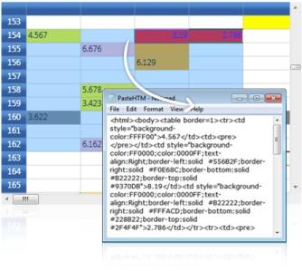

# Editing in WPF GridControl

This section explains the clipboard and undo redo support of Grid control.

* Clipboard Support - Elaborates on different clipboard operations
* Undo or Redo support - Grid supports undo or redo operation to those achieved with Microsoft Office-type applications.

## Clipboard Support

Essential Grid provides complete support for clipboard operations. End users can copy/cut & paste any data inside the grid and to or from other OLE [Object Linking and Embedding]-enabled applications such as Notepad. The built-in source allows us to copy the text data along with the style information and also provides hooks that let us customize the clipboard operation of pasting the custom formatted data.

### Copy Paste Options

CopyPasteOption property defines the list of clipboard operations supported by the grid. It exposes the following options:

* CopyText – Copies only the text from the grid selection to clipboard.
* CopyCellData – Copies both text and style information from grid cells to clipboard.
* PasteText – Pastes only the text from clipboard.
* PasteCell – Pastes the cell text along with its style information from the clipboard.
* CutText – Moves only the text from grid to clipboard.
* CutCell – Moves the text and the style information from grid to clipboard.
* ExcludeCurrentCell – Skips current cell while doing clipboard operations.
* XmlCopyPaste – Copy the cell value along with basic styles in  XML format and supported to paste in Microsoft Excel. This also supports to copy the Formula value from the Grid Control and Paste in Microsoft Excel.

### Example

Here are the sample code snippets that define certain copy paste behaviors.  



//Copy cell data with style
gridControl.Model.Options.CopyPasteOption |= CopyPaste.CopyCellData;

//Cut cell data with style
gridControl.Model.Options.CopyPasteOption |= CopyPaste.CutCell;

//Paste cell data with style
gridControl.Model.Options.CopyPasteOption |= CopyPaste.PasteCell;

//Code to cut copy paste cell text (excluding style)
gridControl.Model.Options.CopyPasteOption = (CopyPaste)(0);
gridControl.Model.Options.CopyPasteOption |= CopyPaste.CopyText;
gridControl.Model.Options.CopyPasteOption |= CopyPaste.CutText;
gridControl.Model.Options.CopyPasteOption |= CopyPaste.PasteText;



### Text Data Exchange

GridModel.TextDataExchange helps you in customizing the clipboard operations. It is used as an interface that exposes the following property and methods.  

* Property - TabDelimiter
* Method - CopyTextToBuffer(), PasteTextFromBuffer()

The above attributes are discussed below in detail:

### TabDelimiter Property

This property specifies a delimiter for the text to be pasted. It can be used when you want to paste the cell data in CSV (Comma-Separated Values) format.



gridControl.Model.TextDataExchange.TabDelimiter = ",";



### CopyTextToBuffer() Method

This method lets you place the cell data into an intermediate buffer, which can be customized. The method performs clipboard cut or copy operation depending on the third parameter given to it. This method accepts the following parameters:

* String buffer 
* Selected range of cells 
* Boolean value-This should be set to true for cut operation and should be set to false for copy operation.

The following code illustrates the CopyTextToBuffer method:



gridControl.Model.TextDataExchange.CopyTextToBuffer(out buffer, gridControl.Model.SelectedRanges, out row, out col, false);



### Result of this Method Call

It returns the following values:

* Cell text 
* Number of rows affected 
* Number of columns affected

### PasteTextFromBuffer() Method

The values returned by the CopyTextToBuffer method is passed as parameter to the PasteTextFromBuffer method using the below code: 



gridControl.Model.TextDataExchange.PasteTextFromBuffer(buffer, gridControl.Model.SelectedRanges);



### Result of this Method Call

It pastes the text from the given buffer into specified range of grid cells.

### Events

Grid provides the following events which are available for the end user to customize the clipboard data.

* ClipboardCanCopy
* ClipboardCanCut
* ClipboardCanPaste
* ClipboardCopy
* ClipboardCut
* ClipboardPaste

### IGridCopyPaste

Essential Grid defines an interface called IGridCopyPaste that exposes some methods, namely Copy(), Cut() and Paste(). Here the users can write custom code to perform cut copy or paste operations with any kind of user-defined data. Thereby, it extends its clipboard support behavior to perform clipboard operations in various forms.

For instance, let us consider performing the copy and paste operations in HTML format. The respective implementation of IGridCopyPaste is as follows:



class HtmlCopy : IGridCopyPaste
{

public void Copy(GridCellData gridData, GridRangeInfoList rangeList)
{
    IDataObject iData = null;
    iData = Clipboard.GetDataObject();
    string buffer = iData.GetData(DataFormats.UnicodeText) as string;
    int top = rangeList[0].Top;
    int left = rangeList[0].Left;
    int right = rangeList[0].Right;
    int bottom = rangeList[0].Bottom;
    string stylesheet = string.Empty;
	StringBuilder sb = new StringBuilder();
    GridStyleInfoStore gsis;
    GridStyleInfo style;
    sb.Append("<html><body><table border=1>");
    for (int row = top; row <= bottom; row++)
    {
        sb.Append("<tr>");
        for (int col = left; col <= right; col++)
        {
            gsis = gridData[row - top, col - left];
            style = new GridStyleInfo(gsis);
			stylesheet = "\"";
            if (style.HasBackground)
            {
                string backgroundColor = style.Background.ToString();
                backgroundColor = backgroundColor.Substring(3, backgroundColor.Length - 3);
                stylesheet = "\"background-color:" + backgroundColor;
            }
            if (style.HasForeground)
            {
                string foregroundColor = style.Foreground.ToString();
                foregroundColor = foregroundColor.Substring(3, foregroundColor.Length - 3);
                stylesheet = stylesheet + ";color:" + foregroundColor;
            }
            if (style.HasHorizontalAlignment)
            {
                stylesheet = stylesheet + ";text-align:" + style.HorizontalAlignment;
            }
            if (style.HasVerticalAlignment)
            {
                stylesheet = stylesheet + ";vertical-align:" + style.VerticalAlignment;
            }
           if (style.HasBorders)
            {
                string borderBrush;
                borderBrush = style.Borders.Left.Brush.ToString();
                borderBrush = borderBrush.Substring(3, borderBrush.Length - 3);
                stylesheet = stylesheet + ";border-left:solid  #" + borderBrush;
                borderBrush = style.Borders.Right.Brush.ToString();
                borderBrush = borderBrush.Substring(3, borderBrush.Length - 3);
                stylesheet = stylesheet + ";border-right:solid  #" + borderBrush;
                borderBrush = style.Borders.Bottom.Brush.ToString();
                borderBrush = borderBrush.Substring(3, borderBrush.Length - 3);
                stylesheet = stylesheet + ";border-bottom:solid  #" + borderBrush;
                borderBrush = style.Borders.Top.Brush.ToString();
                borderBrush = borderBrush.Substring(3, borderBrush.Length - 3);
                stylesheet = stylesheet + ";border-top:solid  #" + borderBrush;
            }
            stylesheet = stylesheet + "\"";
            if (!stylesheet.Equals("\"\""))
            {
                sb.Append(@"<td style=" + stylesheet + ">");
            }
            else
            {
                sb.Append(@"<td>");
            }
            if (!style.CellValue.ToString().Equals(""))
            {
                sb.Append(style.CellValue.ToString());
            }
            else
            {
                sb.Append("<pre> </pre>");
            }
            sb.Append("</td>");
            stylesheet = string.Empty;
            }
            sb.Append("</tr>");
        }
        sb.Append("</table></body></html>");
        DataObject dataObject = new DataObject();
        dataObject.SetData(DataFormats.UnicodeText, sb.ToString());
        Clipboard.SetDataObject(dataObject);
    }

    public void Cut(GridCellData grodCellData, GridRangeInfoList rangeList)
    {
    }

    public DataObject Paste(GridRangeInfoList rangeList)
    {
        return new DataObject();
    }
}



The next step is to attach the above custom copy and paste operations to the grid control.



HtmlCopy htmlCopy = new HtmlCopy();
gridControl.Model.GridCopyPaste = htmlCopy;





* [ClipboardCanCopy event](http://help.syncfusion.com/wpf/grid/events#clipboardcancopy)
* [ClipboardCanCut event](http://help.syncfusion.com/wpf/grid/events#clipboardcancut)
* [ClipboardCanPaste event](http://help.syncfusion.com/wpf/grid/events#clipboardcanpaste)
* [ClipboardCopy event](http://help.syncfusion.com/wpf/grid/events#clipboardcopy)
* [ClipboardCut event](http://help.syncfusion.com/wpf/grid/events#clipboardcut)
* [ClipboardPaste event](http://help.syncfusion.com/wpf/grid/events#clipboardpaste)



## Undo/Redo

Essential Grid supports undo/redo functionalities similar to those achieved with Microsoft Office-type applications. To handle this functionality, a stack is maintained internally in Essential Grid to save the changes that occur through which the following tasks can be accomplished by the users:

* Control of the stack: when to save or discard changes, and when to rollback changes
* Create new transactions and control each individual transaction (like canceling, rollback) without affecting others

The undo/redo architecture is extensible, thereby allowing users to derive the base class and add some more functionality to the grid.

### The Basics

Essential Grid has a GridModelCommandManager class that implements support for the undo/redo commands in the Grid control. Depending upon the grid settings, as a user makes changes to the grid these changes will be tracked in stack structures which will be found in the GridModelCommandManager class. This class has methods that allow you to undo the last action, redo the last undone action, and batch transactions so that a series of actions can be undone or redone in a single step.

The CommandStack property of the GridControl class will return a reference to the GridCommandStack object that is associated with a grid. It is through this property that you can access the undo/redo support in Essential Grid. For example, you can use the enabled property of the CommandStack to control whether or not the grid supports undo/redo at any given moment. The following code samples show you some CommandStack properties.



// Turn off the Undo buffer. 
this.grid.Model.CommandStack.Enabled = false;

// Turn on the Undo buffer.
this.grid.Model.CommandStack.Enabled = true;

// Execute the latest command from the undo stack.
this.grid.Model.CommandStack.Undo();

// Execute the latest command from the redo stack.
this.grid.Model.CommandStack.Redo();

// Clear the Undo buffer.
this.grid.Model.CommandStack.UndoStack.Clear();

// Clear the Redo buffer.
this.grid.Model.CommandStack.RedoStack.Clear();

// Clear both the Undo and Redo buffers.
this.grid.Model.CommandStack.Clear();


'Turn off the Undo buffer. 
Me.grid.Model.CommandStack.Enabled = False

'Turn on the Undo buffer.
Me.grid.Model.CommandStack.Enabled = True

'Execute the latest command from the undo stack.
this.grid.Model.CommandStack.Undo()

'Execute the latest command from the redo stack.
this.grid.Model.CommandStack.Redo()

'Clear the Undo buffer.
Me.grid.Model.CommandStack.UndoStack.Clear()

'Clear the Redo buffer.
Me.grid.Model.CommandStack.RedoStack.Clear()

'Clear both the Undo and Redo buffers.
Me.grid.Model.CommandStack.Clear()



### Transactions

A transaction is a series of steps that should be treated as a single action in the undo/redo architecture. For example, you may have a record-oriented grid where you may want to group any changes in the current row as one transaction. This way, when the user wants to undo the last change, all the changes in the row are undone. It is possible to group a series of actions into a single undo/redo step through the use of these three GridCommandStack methods: BeginTrans, CommitTrans and RollBack. 

A call to BeginTrans will mark the start of a series of actions that are to be treated as a single undo/redo step. Once BeginTrans has begun, all the changes are marked as being a member of a single transaction until either CommitTrans or RollBack is called. CommitTrans signals a successful end to the transaction. A call to RollBack will cause all the changes in the current transaction to be undone and will end the transaction processing. A RollBack call will return the grid in the same state that it was in, immediately prior to the call to BeginTrans.



// Begin the transaction. 
this.grid.Model.CommandStack.BeginTrans("Transaction beginning");

// Commit the transaction.
this.grid.Model.CommandStack.CommitTrans();

// Rollback the current transaction.
this.grid.Model.CommandStack.Rollback();


'Begin the transaction.
Me.grid.Model.CommandStack.BeginTrans("Transaction beginning")

'Commit the transaction.
Me.grid.Model.CommandStack.CommitTrans()

'Rollback the current transaction.
Me.grid.Model.CommandStack.UndoStack.Rollback()



It is also possible to nest transactions. If you are in the middle of a transaction, it is okay to call BeginTrans again. But, when such nested transactions are undone, they are treated as part of a single parent transaction.

### Derived Commands

The undo or redo architecture of Essential Grid is complete as shipped with the product. If, for some reason, you need to handle special grid requirements that cannot be performed with the standard implementation, the undo/redo architecture is extensible. To extend it, you need to derive custom command classes from either the abstract class SyncfusionCommand or the abstract class GridModelCommand. In your derived class, you will need to add whatever members you need in order to track enough state information that will allow you to undo or redo the action that is being done. Then you have to implement an execute method and other abstract members of the base class. If you do a search in the Essential Grid source code for GridModelCommand, you will see many examples of the derived command classes.

 Once you have your derived SyncfusionCommand class, whenever the action is taken, you will have to create a proper instance of your derived SyncfusionCommand class and add it to the GridControl.Model.CommandStack.UndoStack. Thus, when Essential Grid needs to undo this action, your command will be popped from the UndoStack, and its execute method will be called indicating that this action needs to be undone (also at this point, Essential Grid will add this same instance to the RedoStack so that the action can later be redone if necessary).

The following code snippet demonstrates how to implement support for current cell activated action in undo/redo operations.



public class GridCellActivatedCommand : GridModelCommand
{
    private RowColumnIndex cell;
	public GridCellActivatedCommand(GridModel model, RowColumnIndex cell)
        : base(model)
    {
        this.cell = cell;
    }
	public override void Execute()
    {
        this.Grid.ActiveGridView.CurrentCell.MoveTo(cell);
    }
}
void grid_CurrentCellActivated(object sender, SyncfusionRoutedEventArgs args)
{

    if (this.grid.Model.CommandStack.ShouldGenerateUndoInfo)
    {
        this.grid.Model.CommandStack.Push(new GridCellActivatedCommand(this.grid.Model, this.grid.CurrentCell.CellRowColumnIndex));
    }
}




Public Class GridCellActivatedCommand
    Inherits GridModelCommand
    Private cell As RowColumnIndex
    Public Sub New(ByVal model As GridModel, ByVal cell As RowColumnIndex)
        MyBase.New(model)
        Me.cell = cell
    End Sub
    Public Overrides Sub Execute()
        Me.Grid.ActiveGridView.CurrentCell.MoveTo(cell)
    End Sub
End Class
Private Sub grid_CurrentCellActivated(ByVal sender As Object, ByVal args As SyncfusionRoutedEventArgs)
    If Me.grid.Model.CommandStack.ShouldGenerateUndoInfo Then
        Me.grid.Model.CommandStack.Push(New GridCellActivatedCommand(Me.grid.Model, Me.grid.CurrentCell.CellRowColumnIndex))
    End If
End Sub



### Tables for Properties, Methods, and Events

#### Properties

<table>
<tr>
<th>
Property </th><th>
Description </th><th>
Type </th><th>
Data Type </th></tr>
<tr>
<td>
Enabled</td><td>
Enable undo/redo support in the Grid Control.</td><td>
CLR Property </td><td>
bool</td></tr>
<tr>
<td>
UndoStack</td><td>
Stack for undo commands.</td><td>
CLR Property</td><td>
Stack</td></tr>
<tr>
<td>
RedoStack</td><td>
Stack for redo commands.</td><td>
CLR Property</td><td>
Stack</td></tr>
<tr>
<td>
InTransaction</td><td>
Indicates whether BeginTrans has been called.</td><td>
CLR Property</td><td>
bool</td></tr>
<tr>
<td>
IsRecording</td><td>
Indicates whether the grid is in the default mode that records undo information.</td><td>
CLR Property</td><td>
bool</td></tr>
<tr>
<td>
Mode</td><td>
Indicates the Grid control’s regular operation.</td><td>
CLR Property</td><td>
GridCommandMode</td></tr>
<tr>
<td>
ShouldGenerateUndoInfo</td><td>
Temporarily suspended undo.</td><td>
CLR Property</td><td>
bool</td></tr>
</table>

#### Methods

<table>
<tr>
<th>
Method </th><th>
Description </th><th>
Parameters </th><th>
Return Type </th></tr>
<tr>
<td>
BeginTrans</td><td>
Combines several subsequent commands into one transaction.</td><td>
BeginTrans(string Name)</td><td>
void</td></tr>
<tr>
<td>
Clear</td><td>
Clear both the undo and redo stacks.</td><td>
Clear()</td><td>
void</td></tr>
<tr>
<td>
CommitTrans</td><td>
Ends a transaction that was started with a previous BeginTrans call.</td><td>
CommitTrans()</td><td>
void</td></tr>
<tr>
<td>
Push</td><td>
Pushes a command onto the undo stack.</td><td>
Push(SyncfusionCommand cmd)Push(SyncfusionCommand cmd, SyncfusionCommand selectionStateCommand)</td><td>
void</td></tr>
<tr>
<td>
Redo</td><td>
Execute the latest command from the redo stack.</td><td>
Redo()</td><td>
void</td></tr>
<tr>
<td>
Rollback</td><td>
Rolls back a transaction in progress that was started with a previous BeginTrans call.</td><td>
Rollback()</td><td>
void</td></tr>
<tr>
<td>
Undo</td><td>
Execute the latest command from the undo stack.</td><td>
Undo()</td><td>
void</td></tr>
</table>

N> [View sample in GitHub](https://github.com/syncfusion/wpf-demos/tree/master/GridControl/Excel%20Like%20Features/Undo%20Redo)

## See also

[How to exclude header while copying](https://www.syncfusion.com/kb/11194)

[How to invoke CommitCellInfo event](https://www.syncfusion.com/kb/11193)
