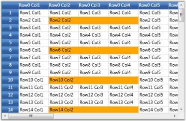
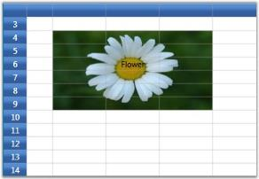
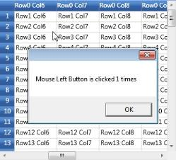

# Events in WPF GridControl

Grid control declares a number of events that it can raise in response to an activity either by the user or by the system. An Event is a message that is triggered to notify an object or a class of the occurrence of an action. When an event is triggered, all the event handlers are notified. Following are the Grid control events:

Let us look on each event and its event handler in detail in the following topics.

## QueryCellInfo and CommitCellInfo

These events are widely used to allow customization of each and every cell in the required format. QueryCellInfo accepts an argument of type GridQueryCellInfoEventArgs and CommitCellInfo accepts an argument of type GridCommitCellInfoEventArgs. The table below lists the customization properties exposed by these two event arguments.

<table>
<tr>
<th>
Property</th><th>
Description</th></tr>
<tr>
<td>
Cell</td><td>
Gives the cell co-ordinates.</td></tr>
<tr>
<td>
Style</td><td>
Specifies the style for the cell represented by the above Cell property.</td></tr>
</table>

These events are essential to operate the grid in virtual mode, where:

* QueryCellInfo is used to provide the cell values on demand and,
* Changes made in the grid will be saved back by the CommitCellInfo event.

The QueryCellInfo is used to completely customize the grid cells. The code  below sets up a Virtual Grid by applying these events and also paints alternate rows using QueryCellInfo event. The QueryCellInfo event is raised for each cell that requires redrawing.

### Example

These events can be triggered using the following code:



this.grid.QueryCellInfo += new GridQueryCellInfoEventHandler(grid_QueryCellInfo);
this.grid.CommitCellInfo += new GridCommitCellInfoEventHandler(grid_CommitCellInfo);



### Event Handlers 



Dictionary<RowColumnIndex, object> committedValues = new Dictionary<RowColumnIndex, object>();

void grid_QueryCellInfo(object sender, GridQueryCellInfoEventArgs e)
{

    if (e.Cell.ColumnIndex > 0 && e.Cell.RowIndex > 0)

        if (e.Cell.RowIndex % 2 == 0)
            e.Style.Background = Brushes.LightGreen;

    if (e.Cell.RowIndex == 0)
    {

        if (e.Cell.ColumnIndex > 0)
            e.Style.CellValue = e.Cell.ColumnIndex;
    }

    else if (e.Cell.RowIndex > 0)
    {

        if (e.Cell.ColumnIndex == 0)
            e.Style.CellValue = e.Cell.RowIndex;

        else if (e.Cell.ColumnIndex > 0)
        {

            if (committedValues.ContainsKey(e.Cell))
                e.Style.CellValue = committedValues[e.Cell];

            else
                e.Style.CellValue = String.Format("{0}/{1}", e.Cell.RowIndex, e.Cell.ColumnIndex);
        }
    }
}

void grid_CommitCellInfo(object sender, GridCommitCellInfoEventArgs e)
{

    if (e.Style.HasCellValue)
    {
        committedValues[e.Cell] = e.Style.CellValue;
        e.Handled = true;
    }
}



### Output

The following output is generated using the code above.

## QueryBaseStyles



void grid_QueryBaseStyles(object sender, GridQueryBaseStylesEventArgs e)
{

    if (ColumnRowIndex.Text != "")
    {

       if (e.Cell.RowIndex == 3)
       {
            e.BaseStyles.Add(new GridStyleInfo() { Background = new SolidColorBrush(Colors.Maroon) });
       }

       if (e.Cell.ColumnIndex == 3)
       {
            e.BaseStyles.Add(new GridStyleInfo() { Background = new SolidColorBrush(Colors.Orange) });
       }
    }
}



This event is used to provide base styles for desired grid cells. It receives an argument of type GridQueryBaseStylesEventArgs that contains the following parameters.

<table>
<tr>
<th>
Property</th><th>
Description</th></tr>
<tr>
<td>
BaseStyles</td><td>
Holds a list of base styles applicable for current cell co-ordinates.</td></tr>
<tr>
<td>
Cell</td><td>
Represent the cell co-ordinates.</td></tr>
<tr>
<td>
Style</td><td>
Gives cell style information.</td></tr>
</table>

### Example

This event can be triggered using the following code:



this.grid.QueryBaseStyles += new GridQueryBaseStylesEventHandler(grid_QueryBaseStyles);



### Event Handler

### Output

The following output is generated using the code above.

## QueryCoveredRange

This event is used to define covered ranges in the required cells. It receives an argument of type GridQueryCoveredRangeEventArgs containing the following information about the event.

<table>
<tr>
<th>
Property</th><th>
Description</th></tr>
<tr>
<td>
CellRowColumnIndex</td><td>
Represents the cell row and column indices.</td></tr>
<tr>
<td>
Range</td><td>
Defines the covered range for the cell.</td></tr>
</table>

### Example

This event can be triggered using the following code:



grid.QueryCoveredRange += new GridQueryBaseStylesEventArgs (grid_QueryCoveredRange);



### Event Handler



void grid_QueryCoveredRange(object sender, GridQueryBaseStylesEventArgs e)
{

    // Combine column 2 to 4 on every 4th row.

    if (e.CellRowColumnIndex.RowIndex % 4 == 2)
    {

        if (e.CellRowColumnIndex.ColumnIndex >= 2 && e.CellRowColumnIndex.ColumnIndex <= 4)
        {
            e.Range = new CoveredCellInfo (e.CellRowColumnIndex.RowIndex, 2, e.CellRowColumnIndex.RowIndex, 4);
            e.Handled = true;
        }
    }
}



### Output

The following output is generated using the code above.

## QueryCellSpanBackgrounds

This event lets you create cell spans and customize their backgrounds. It receives an argument of type GridQueryCellSpanBackgroundsEventArgs containing the following properties.

<table>
<tr>
<th>
Property</th><th>
Description</th></tr>
<tr>
<td>
CellRowColumnIndex</td><td>
Represents the cell row and column indices.</td></tr>
<tr>
<td>
Range</td><td>
Defines the covered range for the cell.</td></tr>
</table>

### Example

This event can be triggered using the following code:



grid.QueryCellSpanBackgrounds += new GridQueryCellSpanBackgroundsEventHandler (grid_QueryCellSpanBackgrounds);



### Event Handler



void grid_QueryCellSpanBackgrounds(object sender, GridQueryCellSpanBackgroundsEventArgs e)
{

    if (e.CellRowColumnIndex.ColumnIndex == 2 && e.CellRowColumnIndex.RowIndex == 4)
    {
        CellSpanBackgroundInfo item = new CellSpanBackgroundInfo(e.CellRowColumnIndex.RowIndex, e.CellRowColumnIndex.ColumnIndex, 9, 4);
        item.Background = new ImageBrush(GetImage(@"common\Images\Grid\BannerCells\back2.jpg"));
        e.Range = new List<CellSpanBackgroundInfo>();
        e.Range.Add(item);
        e.Handled = true;
    }
}



### Output

The following output is generated using the code above.

## ResizingRows and ResizingColumns

These events are used to control over resizing of specific rows or columns. They are triggered when a row or column is being resized. The event handler receives an argument of type GridResizingRowsEventArgs or GridResizingColumnsEventArgs containing data related to the event. The following properties of the event arguments provide information specific to these events.

Properties of GridResizingRowsEventArgs

<table>
<tr>
<th>
Property</th><th>
Description</th></tr>
<tr>
<td>
AllowResize</td><td>
Boolean property; When false, disallow the resizing action.</td></tr>
<tr>
<td>
Rows</td><td>
Used to get or set the index of range of rows being resized.</td></tr>
<tr>
<td>
Reason</td><td>
Gives a hint about user action and reason for this event.Accepts a value of type GridResizeCellsReason enumeration:* CancelMode–Indicates current operation was canceled.* DoubleClick–Indicates user double-clicked.* HitTest–Indicates this is a Hit-Test query.* MouseDown–Indicates user pressed mouse down.* MouseMove–Indicates user is moving the mouse.* MouseUp–Indicates user released the mouse.* ResetDefault–Indicates changed row heights will be reset back to default value.* ResetHide–Indicates hidden rows will be made visible.</td></tr>
<tr>
<td>
 Height</td><td>
Specifies the row height.</td></tr>
<tr>
<td>
Point </td><td>
Indicates the point at which the mouse hits the row before resizing.</td></tr>
</table>

Properties of GridResizingColumnsEventArgs

<table>
<tr>
<th>
Property</th><th>
Description</th></tr>
<tr>
<td>
AllowResize</td><td>
Boolean property; When false, disallow the resizing action.</td></tr>
<tr>
<td>
Columns</td><td>
Used to get or set the index of range of columns being resized.</td></tr>
<tr>
<td>
Reason</td><td>
Gives a hint about user action and reason for this event.Accepts a value of type GridResizeCellsReason enumeration:* CancelMode–Indicates current operation was canceled.* DoubleClick–Indicates user double-clicked.* HitTest–Indicates this is a Hit-Test query.* MouseDown–Indicates user pressed mouse down.* MouseMove–Indicates user is moving the mouse.* MouseUp–Indicates user released the mouse.* ResetDefault–Indicates changed column widths will be reset back to default value.* ResetHide–Indicates hidden columns will be made visible. </td></tr>
<tr>
<td>
Width</td><td>
Specifies the column width.</td></tr>
<tr>
<td>
Point</td><td>
Indicates the point at which the mouse hits the column before resizing.</td></tr>
</table>

### Example

These events can be invoked as follows:



grid.ResizingRows += new GridResizingRowsEventHandler(grid_ResizingRows);
grid.ResizingColumns += new GridResizingColumnsEventHandler(grid_ResizingColumns);



### Event Handlers:



// Disallow resizing of row 2.      

void grid_ResizingRows(object sender, GridResizingRowsEventArgs args)
{

if (args.Rows.Top == 2)
args.AllowResize = false;
}

// Disallow resizing of column 3.

void grid_ResizingColumns(object sender, GridResizingColumnsEventArgs args)
{

if (args.Columns.Left == 3)
args.AllowResize = false;
}



## GridResizingRowsEventArgs

The following table provides information on the properties of the event:

<table>
<tr>
<th>
Property</th><th>
Description</th></tr>
<tr>
<td>
AllowResize</td><td>
Boolean property;  When false, disallow the resizing action.</td></tr>
<tr>
<td>
Rows</td><td>
Used to get or set the index of range of rows being resized.</td></tr>
<tr>
<td>
Reason</td><td>
Gives a hint about user action and reason for this event.Accepts a value of type GridResizeCellsReason enumeration:CancelMode – Indicates current operation was canceled.DoubleClick – Indicates user double-clicked.HitTest – Indicates this is a Hit-Test query.MouseDown – Indicates user pressed mouse down.MouseMove – Indicates user is moving the mouse.MouseUp – Indicates user released the mouse.ResetDefault – Indicates changed row heights will be reset back to default value.ResetHide – Indicates hidden rows will be made visible.</td></tr>
<tr>
<td>
Height</td><td>
Specifies the row height.</td></tr>
<tr>
<td>
Point </td><td>
Indicates the point at which the mouse hits the row before resizing.</td></tr>
</table>

## GridResizingColumnsEventArgs

The following table provides information on the properties of the event:

<table>
<tr>
<th>
Property</th><th>
Description</th></tr>
<tr>
<td>
AllowResize</td><td>
Boolean property;  When false, disallow the resizing action.</td></tr>
<tr>
<td>
Columns</td><td>
Used to get or set the index of range of columns being resized.</td></tr>
<tr>
<td>
Reason</td><td>
Gives a hint about user action and reason for this event.Accepts a value of type GridResizeCellsReason enumeration:CancelMode – Indicates current operation was canceled.DoubleClick – Indicates user double-clicked.HitTest – Indicates this is a Hit-Test query.MouseDown – Indicates user pressed mouse down.MouseMove – Indicates user is moving the mouse.MouseUp – Indicates user released the mouse.ResetDefault – Indicates changed column widths will be reset back to default value.ResetHide – Indicates hidden columns will be made visible.</td></tr>
<tr>
<td>
Width</td><td>
Specifies the column width.</td></tr>
<tr>
<td>
Point </td><td>
Indicates the point at which the mouse hits the column before resizing.</td></tr>
</table>

### Example

This event can be triggered using the following code:



grid.ResizingRows += new GridResizingRowsEventHandler(grid_ResizingRows);
grid.ResizingColumns += new GridResizingColumnsEventHandler (grid_ResizingColumns);



### Event Handlers



//Disallow resizing of row 2.      

void grid_ResizingRows(object sender, GridResizingRowsEventArgs args)
{

    if (args.Rows.Top == 2)
       args.AllowResize = false;
}

//Disallow resizing of column 3.

void grid_ResizingColumns(object sender, GridResizingColumnsEventArgs args)
{

 if (args.Columns.Left == 3)
    args.AllowResize = false;
}



## RowsInserted and ColumnsInserted

These events are triggered when one or more rows or columns are inserted. The event handler receives an argument of type GridRangeInsertedEventArgs containing data related to this event. The following GridRangeInsertedEventArgs properties provide information specific to these events.

<table>
<tr>
<th>
Property</th><th>
Description</th></tr>
<tr>
<td>
Count</td><td>
The number of rows or columns.</td></tr>
<tr>
<td>
InsertAt</td><td>
The row or column index where the cells should be inserted before.</td></tr>
</table>

### Example

This event can be triggered using the following code:



grid.Model.RowsInserted += new GridRangeInsertedEventHandler (Model_RowsInserted);
grid.Model.ColumnsInserted += new GridRangeInsertedEventHandler (Model_ColumnsInserted);



### Event Handlers



void Model_ColumnsInserted(object sender, GridRangeInsertedEventArgs e)
{
     Console.WriteLine(e.Count + " columns are inserted at " + e.InsertAt);
}

void Model_RowsInserted(object sender, GridRangeInsertedEventArgs e)
{
     Console.WriteLine(e.Count + " rows are inserted at " + e.InsertAt);
}



## RowsMoved and ColumnsMoved

These events are raised when a range of rows or columns are moved from one position to another. Their event handlers receive an argument of type GridRangeMovedEventArgs containing data related to these events. Following are the event argument properties information about the rows or columns migration.

<table>
<tr>
<th>
Property</th><th>
Description</th></tr>
<tr>
<td>
Count</td><td>
The index of the last row or column that was removed.</td></tr>
<tr>
<td>
InsertAt</td><td>
The row or column index where the cells should be inserted before.</td></tr>
<tr>
<td>
RemoveAt</td><td>
The index of the first row or column that was removed.</td></tr>
</table>

### Example

This event can be triggered using the following code:



grid.Model.RowsMoved += new GridRangeMovedEventHandler(Model_RowsMoved);
grid.Model.ColumnsMoved += new GridRangeMovedEventHandler (Model_ColumnsMoved);



### Event Handlers



void Model_RowsMoved(object sender, GridRangeMovedEventArgs e)
{
    Console.WriteLine(e.RemoveAt + 1 - e.Count + " row(s) are moved from position " + e.RemoveAt + " to position " + e.InsertAt);
}

void Model_ColumnsMoved(object sender, GridRangeMovedEventArgs e)
{
    Console.WriteLine(e.RemoveAt+ 1 - e.Count + " column(s) are moved from position " + e.RemoveAt + " to position " + e.InsertAt);
}



## RowsRemoved and ColumnsRemoved

These events are triggered when a range of rows or columns are removed from the grid. Their event handlers receive an argument of type GridRangeRemovedEventArgs containing data related to these events. Following are the event argument properties that provides information about the rows or columns removal.

<table>
<tr>
<th>
Property</th><th>
Description</th></tr>
<tr>
<td>
Count</td><td>
The index of the last row or column that was removed.</td></tr>
<tr>
<td>
RemoveAt</td><td>
The index of the first row or column that was removed.</td></tr>
</table>

### Example

This event can be triggered using the following code:



grid.Model.RowsRemoved += new GridRangeRemovedEventHandler (Model_RowsRemoved);
grid.Model.ColumnsRemoved += new GridRangeRemovedEventHandler (Model_ColumnsRemoved);



### Event Handlers



void Model_RowsRemoved(object sender, GridRangeRemovedEventArgs e)
{
    Console.WriteLine(e.RemoveAt + 1 - e.Count + " row(s) are removed from position " + e.RemoveAt);
}

void Model_ColumnsRemoved(object sender, GridRangeRemovedEventArgs e)
{
    Console.WriteLine(e.RemoveAt + 1 - e.Count + " column(s) are removed from position " + e.RemoveAt);
}



## ClipboardCanCopy

This event is triggered when some grid data is about to be copied to the clipboard. Inside this event handler, you can check for the data and range of cells that are going to be copied, and cancel the operation if you don’t want to copy those data. 

1. The grid cell data and range of cells that is going to be moved to the clipboard can be accessed by DataObject and RangeList properties (refer to the Table below).
2. If you don’t want to move the data to the clipboard, you can cancel the operation by setting e.Cancel to true.

It receives an argument of type GridCutCopyPasteEventArgs containing data related to this event. The following are the event argument properties.

<table>
<tr>
<th>
Property</th><th>
Description</th></tr>
<tr>
<td>
DataObject</td><td>
Data to be copied.</td></tr>
<tr>
<td>
RangeList</td><td>
List of cell ranges that are selected for copying.</td></tr>
<tr>
<td>
Handled</td><td>
When true, indicates that the event has been handled and no further processing of the event should happen.</td></tr>
</table>

### Example

This event can be triggered using the following code:



gridControl.Model.ClipboardCanCopy += new GridCutPasteEventHandler(Model_ClipboardCanCopy);



### Event Handler

The following event handler prevents the data in row 2 from getting copied.



void Model_ClipboardCanCopy(object sender, GridCutPasteEventArgs e)
{

    if(e.RangeList.Contains(GridRangeInfo.Row(2)))
    {
        e.Handled = true;
    }
}



## ClipboardCanCut

This event is triggered when some grid data is about to be moved to the clipboard. Inside this event handler, you can check for the data and range of cells going to be moved and cancel the operation if you do not want to move the data. It receives an argument of type GridCutCopyPasteEventArgs containing data related to this event. The following are the event argument properties.

<table>
<tr>
<th>
Property</th><th>
Description</th></tr>
<tr>
<td>
DataObject</td><td>
Data to be moved.</td></tr>
<tr>
<td>
RangeList</td><td>
List of cell ranges that are selected for moving.</td></tr>
<tr>
<td>
Handled</td><td>
When true, indicates that the event has been handled and no further processing of the event should happen.</td></tr>
</table>

### Example

This event can be triggered using the following code:



gridControl.Model.ClipboardCanCut += new GridCutPasteEventHandler(Model_ClipboardCanCut);



Event Handler

The following event handler prevents the data in row 2 from getting cut.



void Model_ClipboardCanCut(object sender, GridCutPasteEventArgs e)
{

    if (e.RangeList.Contains(GridRangeInfo.Row(2)))
    {
        e.Handled = true;
    }
}



## ClipboardCanPaste

This event gets fired when some grid data is about to be pasted from the clipboard. Inside this event handler, you can check for the data and range of cells going to be pasted and cancel the operation if you don’t want to paste the data. It receives an argument of type GridCutCopyPasteEventArgs containing data related to this event. The following are the event argument properties.

<table>
<tr>
<th>
Property</th><th>
Description</th></tr>
<tr>
<td>
DataObject</td><td>
Data to be pasted.</td></tr>
<tr>
<td>
RangeList</td><td>
List of cell ranges that are selected for pasting.</td></tr>
<tr>
<td>
Handled</td><td>
When true, indicates that the event has been handled and no further processing of the event should happen.</td></tr>
</table>

### Example

This event can be triggered using the following code:



gridControl.Model.ClipboardCanPaste += new GridCutPasteEventHandler(Model_ClipboardCanPaste);



### Event Handler

The following event handler prevents the data in row 2 from getting pasted.



void Model_ClipboardCanPaste(object sender, GridCutPasteEventArgs e)
{

    if (e.RangeList.Contains(GridRangeInfo.Row(2)))
    {
        e.Handled = true;
    }
}



## ClipboardCopy

This event gets fired when some grid data is being copied to the clipboard. Inside this event handler, you can check for the data and range of cells being copied and cancel the operation if you don’t want to copy the data. You can also provide custom formatted data for copying to clipboard. It receives an argument of type GridCutCopyPasteEventArgs containing data related to this event. The following are the event argument properties.

<table>
<tr>
<th>
Property</th><th>
Description</th></tr>
<tr>
<td>
DataObject</td><td>
Data being copied.</td></tr>
<tr>
<td>
RangeList</td><td>
List of cell ranges that are selected for copying.</td></tr>
<tr>
<td>
Handled</td><td>
When true, indicates that the event has been handled and no further processing of the event should happen.</td></tr>
</table>

### Example

This event can be triggered using the following code:



gridControl.Model.ClipboardCopy += new GridCutPasteEventHandler(Model_ClipboardCopy);



### Event Handler

The following event handler sets up new data for clipboard copy.



void Model_ClipboardCopy(object sender, GridCutPasteEventArgs e)
{

    if (e.RangeList.Contains(GridRangeInfo.Row(2)))
    {
        string newData = "Data for Row2";
        e.DataObject = new DataObject(newData);
        e.Handled = true;
    }
}



## ClipboardCut

This event gets fired when some grid data is being moved to the clipboard. Inside this event handler, you can check for the data and range of cells being moved and cancel the operation if you don’t want to move the data. You can also provide custom formatted data for moving to clipboard. It receives an argument of type GridCutCopyPasteEventArgs containing data related to this event. The following are the event argument properties.

<table>
<tr>
<th>
Property</th><th>
Description</th></tr>
<tr>
<td>
DataObject</td><td>
Data being moved.</td></tr>
<tr>
<td>
RangeList</td><td>
List of cell ranges that are selected for transfer.</td></tr>
<tr>
<td>
Handled</td><td>
When true, indicates that the event has been handled and no further processing of the event should happen.</td></tr>
</table>

### Example

This event can be triggered using the following code:



gridControl.Model.ClipboardCut += new GridCutPasteEventHandler(Model_ClipboardCut);



### Event Handler

The following event handler sets up new data for clipboard cut operation.



void Model_ClipboardCut(object sender, GridCutPasteEventArgs e)
{

    if (e.RangeList.Contains(GridRangeInfo.Row(2)))
    {
        string newData = "Data for Row2";
        e.DataObject = new DataObject(newData);
        e.Handled = true;
    }
}



## ClipboardPaste

This event gets fired when some grid data is being pasted from the clipboard. Inside this event handler, you can check for the data and range of cells being pasted and cancel the operation if you don’t want to paste the data. You can also provide custom formatted data for saving into grid cells. It receives an argument of type GridCutCopyPasteEventArgs containing data related to this event. The following are the event argument properties.

<table>
<tr>
<th>
Property</th><th>
Description</th></tr>
<tr>
<td>
DataObject</td><td>
Data being pasted.</td></tr>
<tr>
<td>
RangeList</td><td>
List of cell ranges that are selected for pasting.</td></tr>
<tr>
<td>
Handled</td><td>
When true, indicates that the event has been handled and no further processing of the event should happen.</td></tr>
</table>

### Example

This event can be triggered using the following code:



gridControl.Model.ClipboardPaste += new GridCutPasteEventHandler(Model_ClipboardPaste);



### Event Handler

The following event handler sets up new data for clipboard paste.



void Model_ClipboardPaste(object sender, GridCutPasteEventArgs e)
{

    if (e.RangeList.Contains(GridRangeInfo.Row(2)))
    {
        string newData = "Data for Row2";
        e.DataObject = new DataObject(newData);
        e.Handled = true;
    }
}



## CellButtonClick

This event is triggered when a cell button is clicked. It receives an argument of type GridCellButtonClickEventArgs, which helps display the row and column indices of the cell whose button is clicked. For example: If the cell button clicked is placed in the second row and second column, the display message will be- ”Button clicked at cell [2,2]”.

### Example

This event can be triggered using the following code:



grid.CellButtonClick += new GridCellButtonClickEventHandler(grid_CellButtonClick);



### Event Handler

The following event handler sets up new data for clipboard paste.



void grid_CellButtonClick(object sender, GridCellButtonClickEventArgs e)
{
    MessageBox.Show("Button clicked at cell[" + e.RowIndex + "," + e.ColumnIndex + "]");
}



### Output

The following output is generated using the code above.

## CellClick

This event is triggered when a cell is clicked. It receives an argument of type GridCellClickEventArgs  which helps display the row and column indices of the cell that is clicked with its click count. For example: If the cell clicked is placed in the third row and second column and clicked once, the display message will be- ”Cell [3,2] is clicked 1 times”.

### Example

This event can be triggered using the following code:



grid.CellClick += new GridCellClickEventHandler(grid_CellClick);



### Event Handler



void grid_CellClick(object sender, GridCellClickEventArgs e)
{
    MessageBox.Show("Cell[" + e.RowIndex + ", " + e.ColumnIndex + "] is clicked " + e.ClickCount + " times.");
}



### Output

The following output is generated using the code above.

## Cell Mouse Events

### The following are the cell mouse events:

* CellMouseDown-Occurs when a mouse button is pressed in a grid cell with the click count.
* CellMouseUP–Occurs when a mouse button is released in a grid cell with the click count.
* CellMouseHover – Occurs when the mouse is hovered over a grid cell.
* CellMouseMove – Occurs when the mouse is moved around the grid cell.

These events receive an argument of type GridCellMouseControllerEventArgs that provides information related to mouse events including the click position.

### Example

These events can be triggered using the following code:



grid.CellMouseDown += new GridCellMouseControllerEventHandler(grid_CellMouseDown);
grid.CellMouseHover += new GridCellMouseControllerEventHandler(grid_CellMouseHover);
grid.CellMouseMove += new GridCellMouseControllerEventHandler(grid_CellMouseMove);
grid.CellMouseUp += new GridCellMouseControllerEventHandler(grid_CellMouseUp);



### Event Handlers



void grid_CellMouseUp(object sender, GridCellMouseControllerEventArgs args)
{
    MessageBox.Show("Mouse " + args.MouseControllerEventArgs.Button + " Button is clicked " + args.MouseControllerEventArgs.ClickCount + " times");
}

void grid_CellMouseMove(object sender, GridCellMouseControllerEventArgs args)
{
    RowColumnIndex cell = grid.PointToCellRowColumnIndex(args.MouseControllerEventArgs.Location);
    MessageBox.Show("Mouse is at cell[" + cell.RowIndex + ", " + cell.ColumnIndex + "]");
}

void grid_CellMouseHover(object sender, GridCellMouseControllerEventArgs args)
{
    RowColumnIndex cell = grid.PointToCellRowColumnIndex(args.MouseControllerEventArgs.Location);
    MessageBox.Show("Mouse is hovering the cell["+cell.RowIndex+", "+cell.ColumnIndex+"]");
}

void grid_CellMouseDown(object sender, GridCellMouseControllerEventArgs args)
{
    MessageBox.Show("Mouse " + args.MouseControllerEventArgs.Button + " Button is clicked " + args.MouseControllerEventArgs.ClickCount + " times");
}



### Output

The following outputs are generated using the code above.

## CurrentCellActivating

When you click a grid cell at run time, it becomes the CurrentCell (activated/designated as CurrentCell). This event is fired while activating this cell. It occurs before the grid activates the specified cell as current cell. It receives an argument of type GridCurrentCellActivatingEventArgs that let you specify – ActivateCurrentCellOptions for the given cell.

### Example

This event can be triggered using the following code:



grid.CurrentCellActivating += new GridCurrentCellActivatingEventHandler(grid_CurrentCellActivating);



### Event Handler



void grid_CurrentCellActivating(object sender, GridCurrentCellActivatingEventArgs args)
{
    args.ActivateOptions.SetCurrentCellOptions = GridSetCurrentCellOptions.ScrollInView;
}



## CurrentCellActivated

It occurs after the grid activates the specified cell as current cell. It receives an argument of type SyncfusionRoutedEventArgs that provides the cell co-ordinates, hence the location of the cell.

### Example

This event can be triggered using the following code:



grid.CurrentCellActivated += new GridRoutedEventHandler(grid_CurrentCellActivated);



### Event Handler



void grid_CurrentCellActivated(object sender, SyncfusionRoutedEventArgs args)
{
    MessageBox.Show("CurrentCell is " + grid.CurrentCell.RowIndex + ", " + grid.CurrentCell.ColumnIndex);
}



## CurrentCellDeactivating	

It occurs before the grid deactivates the specified cell as current cell. It receives an argument of type SyncfusionCancelRoutedEventArgs that let you cancel this event. When you click a second cell, it first deactivates the first(current) cell and then designates the second cell as current cell.

### Example

This event can be triggered using the following code:



grid.CurrentCellDeactivating += new GridCancelRoutedEventHandler(grid_CurrentCellDeactivating);



### Event Handler



void grid_CurrentCellDeactivating(object sender, SyncfusionCancelRoutedEventArgs args)
{
    args.Cancel = true;
}



## CurrentCellDeactivated

It occurs after the grid activates the specified cell as current cell. It receives an argument of type GridCurrentCellDeactivatedEventArgs that gives the cell co-ordinates.

### Example

This event can be triggered using the following code:



grid.CurrentCellDeactivated += new GridCurrentCellDeactivatedEventHandler(grid_CurrentCellDeactivated);



### Event Handler



void grid_CurrentCellDeactivated(object sender, GridCurrentCellDeactivatedEventArgs args)
{
    MessageBox.Show("Cell deactivated:" + args.CellRowColumnIndex.RowIndex + ", " + args.CellRowColumnIndex.ColumnIndex);
}



## CurrentCellStartEditing

It occurs before the current cell switches into editing mode (when the cell is double-clicked). It receives an argument of type SyncfusionCancelRoutedEventArgs that provides an option to cancel this event.

### Example

This event can be triggered using the following code:



grid.CurrentCellStartEditing += new GridCancelRoutedEventHandler(grid_CurrentCellStartEditing);



### Event Handler



void grid_CurrentCellStartEditing(object sender, SyncfusionCancelRoutedEventArgs args)
{
    args.Cancel = true;
}



## CurrentCellEditingComplete

It occurs when the grid completes the editing mode for active current cell. [After editing the cell, when you click to next cell or when you click any other form control or when you press escape, the cell editing mode gets stopped. This event is fired at that time.]

### Example

This event can be triggered using the following code:



grid.CurrentCellEditingComplete += new GridRoutedEventHandler(grid_CurrentCellEditingComplete);



### Event Handler



void grid_CurrentCellEditingComplete(object sender, SyncfusionRoutedEventArgs args)
{
    Console.WriteLine(grid.CurrentCell.ToString());
}



### CurrentCellValidating

It occurs when the grid validates the contents of active current cell. It receives an argument of type SyncfusionCancelRoutedEventArgs that provides an option to cancel this event.[After editing completes, the text you entered will be checked for validity before getting applied to the cell. You can place your validation code here and if the text is invalid, you can cancel the operation by setting args.Cancel to true, which in turn will ignore the new text and will keep the old text. This event is fired during the validation operation.

### Example

This event can be triggered using the following code:



grid.CurrentCellValidating += new GridCancelRoutedEventHandler(grid_CurrentCellValidating);



### Event Handler



void grid_CurrentCellValidating(object sender, SyncfusionCancelRoutedEventArgs args)
{
    args.Cancel = true;
}



## CurrentCellValidated

It occurs when the grid has successfully validated the contents of active current cell.

### Example

This event can be triggered using the following code:



grid.CurrentCellValidated += new GridRoutedEventHandler(grid_CurrentCellValidated);



### Event Handler



void grid_CurrentCellValidated(object sender, SyncfusionRoutedEventArgs args)
{
    Console.WriteLine(grid.CurrentCell.ToString());
}



## CurrentCellChanging

It occurs when the user wants to modify the contents of current cell. It receives an argument of type SyncfusionCancelRoutedEventArgs that provides an option to cancel this event.

### Example

This event can be triggered using the following code:



grid.CurrentCellChanging += new GridCancelRoutedEventHandler(grid_CurrentCellChanging);


### Event Handler



void grid_CurrentCellChanging(object sender, SyncfusionCancelRoutedEventArgs args)
{
    args.Cancel = true;
}



## CurrentCellChanged

It occurs when the user changes the contents of active current cell.

### Example

This event can be triggered using the following code:



grid.CurrentCellChanged += new GridRoutedEventHandler(grid_CurrentCellChanged);



### Event Handler



void grid_CurrentCellChanged(object sender, SyncfusionRoutedEventArgs args)
{
    Console.WriteLine(grid.CurrentCell.ToString());
}


