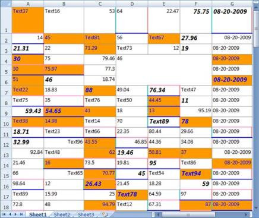
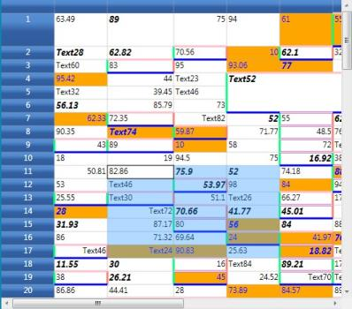
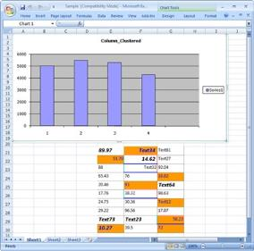
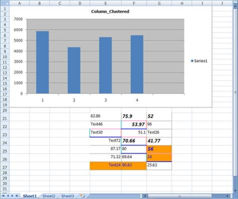
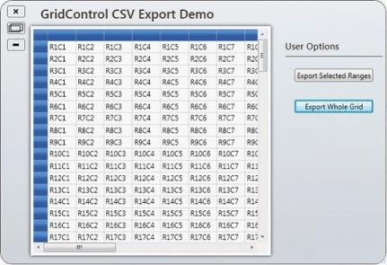
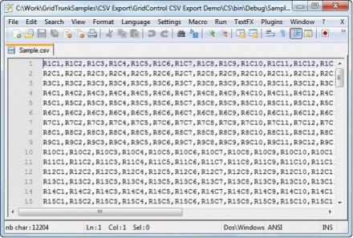
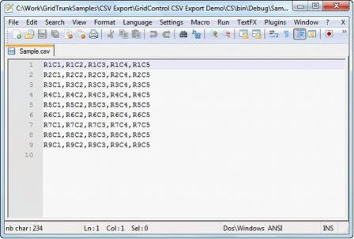

# Export to Excel in WPF GridControl

This section explains about Exporting to Excel and its features of WPF GridControl

## Exporting to Excel

The GridExcelConverter class provides support for exporting data from a Grid control to an Excel spreadsheet for verification and/or computation. This control copies the Grid's styles and formats to Excel automatically. The GridExcelConverter class is derived from GridExcelConverterBase. The XlsIO libraries are used to support the conversion of the grid contents to Excel. Following assembly files must be added along with the default assembly files in the reference folder:

* Syncfusion.XlsIO.Base
* Syncfusion.XlsIO.WPF  
* Syncfusion.GridConverter.Wpf

### Features

There are three options for exporting a Grid control: 

* Converting the entire content of a grid
* Converting a selected content of the grid
* Pass the Excel Engine

### Entire Content

You can convert the entire content of a GridData control to an Excel Spreadsheet. You can also avail the option for specifying the version of the Excel file using the ExcelVersion enum. The version can be one of the following: 

* ExcelVersion.Excel97to2003  
* ExcelVersion.Excel2007

The following code illustrates the conversion of the entire Grid content to an Excel Spreadsheet:



gridControl.Model.ExportToExcel(@"Sample.xls", ExcelVersion.Excel97to2003);

//(or)
gridControl.Model.ExportToExcel(@"Sample.xlsx", ExcelVersion.Excel2007);



The images above show how the entire content of the Grid control is exported to an Excel spreadsheet.

### Selected Content

You can convert a selected content of the grid to the specified range in an Excel spreadsheet. It will be very useful, when you have some data like picture, chart, etc., in your spreadsheet and you want to fill a particular range, for example-the remaining part of the spreadsheet using the Grid cell data. 

#### Use-Case Scenario

Consider that you have a chart in a spreadsheet in the range [A1:I19] and you wish to populate a part of the Spreadsheet starting from E21, with the selected cell data of Grid control. You can use the following code, to achieve the scenario above mentioned:



ExcelEngine excelEngine = new ExcelEngine();
IApplication application = excelEngine.Excel;
IWorkbook myWorkbook = excelEngine.Excel.Workbooks.Add();
IWorksheet mySheet = myWorkbook.Worksheets[1];
IChart chartShape = mySheet.Charts.Add();
IChartSeries series1 = chartShape.Series.Add();
series1.SerieType = ExcelChartType.Column_Clustered;
chartShape.ChartTitle = "Column_Clustered";
series1.Values = mySheet.Range["B1:B5"];
series1.CategoryLabels = mySheet.Range["A1:A5"];
Random r = new Random();

for (int i = 1; i <= 4; i++)
{
    mySheet.Range[i, 1].Number = i;
    mySheet.Range[i, 2].Number = r.Next(4000, 6000);
}

for (int i = 1; i <= 4; i++)
{
    mySheet.Range[i + 5, 1].Number = i;
    mySheet.Range[i + 5, 2].Number = r.Next(4000, 6000);
}
IRange excelRange = mySheet.Range[21, 5];
GridRangeInfoList rangeList = gridControl.Model.SelectedRanges;
GridRangeInfo range = rangeList[0];
gridControl.Model.ExportToExcel(range, mySheet, excelRange, @"Sample2.xls", ExcelVersion.Excel97to2003);



The above images shows how a part of the Grid control is exported to a specific range on an Excel Spreadsheet. 

### Using the Excel Engine (XlsIO)

You can also pass the Excel Engine with the worksheet number, as illustrated by the code below:



ExcelEngine excelEngine = new ExcelEngine();
IApplication application = excelEngine.Excel;
IWorkbook myWorkbook = excelEngine.Excel.Workbooks.Add();
IWorksheet  mySheet = myWorkbook.Worksheets[0];
gridControl.Model.ExportToExcel(range, excelEngine, 0, mySheet.Range[5,5], @"Sample.xlsx", ExcelVersion.Excel2007);



N> Download demo application from [GitHub](https://github.com/syncfusion/wpf-demos/tree/master/GridControl/Export/Excel%20Export)

## Exporting to CSV

The ExportToCSV method of the GridModelExportExtensions class enables a grid control to be easily exported to CSV format.

To enable exporting, the following .dll files must be added along with the default .dll files in the reference folder:

* Syncfusion.XlsIO.Base
* Syncfusion.XlsIO.WPF 
* Syncfusion.GridConverter.Wpf

### Export Options

There are two options for exporting a grid control:

1. Export Whole Grid – which exports an entire grid to CSV format.
2. Export Selected Range – which exports only a selected range to CSV format.

### Export Whole Grid 

You can convert the entire content of a grid control to a CSV file by using the following code:



this.gc.Model.ExportToCSV("Sample.csv");


Me.gc.Model.ExportToCSV("Sample.csv")



When the code runs, the following output displays.

When you are ready to export the entire grid, click Export Whole Grid; the grid content will then be converted to CSV format. 

### Export Selected Range

You can convert selected grid content to CSV format by using the following code:



GridRangeInfoList rangeList = gc.Model.SelectedRanges;
if (rangeList.Count > 0)
{
    GridRangeInfo range = rangeList[0];
    gc.Model.ExportToCSV(range, "Sample.csv");
}


Dim rangeList As GridRangeInfoList = gc.Model.SelectedRanges
If rangeList.Count > 0 Then
    Dim range As GridRangeInfo = rangeList(0)
    gc.Model.ExportToCSV(range, "Sample.csv")
End If



When the code runs, the following output displays.

To export a selection, highlight the portion of the grid you want to export, and then click Export Selected Range; the selected grid content will then be exported to a CSV file.

