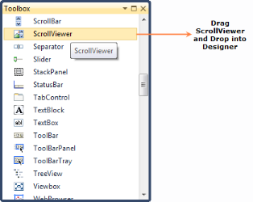
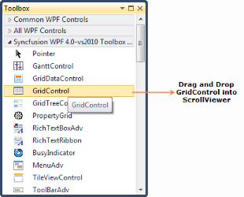
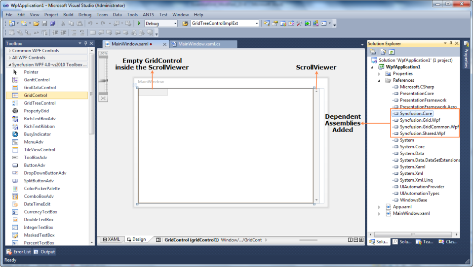
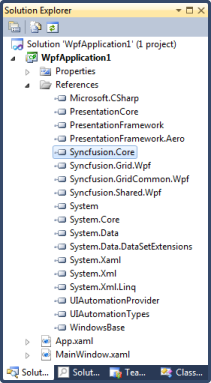

# Getting Started with WPF Excel-like Grid

This section is designed to help you understand and quickly get started using Essential® Grid in your WPF application.

Syncfusion® WPF suite comes up with a package of powerful grid controls that provides cell-oriented features and acts as an efficient display engine for tabular data that can be customized down to the cell level. It also offers excellent performance characteristics, such as a virtual mode and high-frequency updates, which makes the grid suitable for real-time applications.

The Essential Studio® for WPF is comprised of following three types of grid controls:

* [Excel-like Grid](https://www.syncfusion.com/wpf-controls/excel-like-grid)
* [SfDataGrid](https://www.syncfusion.com/wpf-controls/datagrid) and GridDataControl (classic)
* [SfTreeGrid](https://www.syncfusion.com/wpf-controls/treegrid) and GridTreeControl (classic)

N> Refer [Choose between different Grid's](https://help.syncfusion.com/wpf/datagrid/overview#choose-between-different-grids) to take closer look at the characteristics of each of these controls. 

## Adding the Excel-like Grid to a WPF Application

In this section, we will see how to add the Excel-like Grid to a WPF application and load random data. The grid can be added to an application through one of the following methods: through a designer or programmatically.

### Adding the Excel-like Grid through a Designer

Please follow the steps below to add the Excel-like Grid through a designer.

1. Create new WPF application.

2. Open the Designer window.

3. Drag ScrollViewer from the Toolbox and drop it in the Designer window (Since the Excel-like Grid doesn’t have a built-in ScrollViewer, to make the grid flow based on data, the grid should be placed inside the ScrollViewer control.

   

4. Drag the Excel-like Grid from the Toolbox and drop it inside the ScrollViewer.

   

5. Once you drop it in the ScrollViewer, the grid will be added to the designer and its dependent assemblies will be added to the project.

   

### Programmatically Adding the Excel-like Grid

Instead of adding it through a designer such a Visual Studio, you can add the Excel-like Grid programmatically.

1. Create a new WPF application.

2. Add the following Syncfusion® assemblies to the project.
   * Syncfusion.Core.dll
   * Syncfusion.Grid.Wpf.dll
   * Syncfusion.GridCommon.Wpf.dll
   * Syncfusion.Shared.Wpf.dll

    

3. Name the root Grid as layoutRoot in the application’s XAML page.




<Window xmlns="http://schemas.microsoft.com/winfx/2006/xaml/presentation"
        xmlns:x="http://schemas.microsoft.com/winfx/2006/xaml"
        xmlns:syncfusion="http://schemas.syncfusion.com/wpf" 
        x:Class="WpfApplication1.MainWindow"
        Title="MainWindow" Height="350" Width="525">
   <Grid Name="layoutRoot" />  
</Window>



{{ codesnippet1 | OrderList_Indent_Level_1 }}
      
4. Create ScrollViewer and GridControl in code. 

5. To add the grid to the view, add Excel-like Grid as content of ScrollViewer and then add the ScrollViewer as a child of layoutRoot (Grid).




//ScrollViewer defined here
ScrollViewer ScrollViewer = new ScrollViewer();
//GridControl defined here
GridControl gridControl = new GridControl();
//Excel-like Grid set as the content of the ScrollViewer
ScrollViewer.Content = gridControl;     
//To bring the Grid control to the view, ScrollViewer should be set as a child of LayoutRoot      
this.layoutRoot.Children.Add(ScrollViewer);           



{{ codesnippet2 | OrderList_Indent_Level_1 }}

## Populating the Excel-like Grid with Data

The Excel-like Grid is a cell-based control, so to populate it, RowCount and ColumnCount are mandatory. Once ColumnCount and RowCount are specified, data can be populated by using one of the following methods. 

1. You can populate data by looping through the cells. The following code explains this scenario.




//Specifying row and column count
gridControl.Model.RowCount = 100;
gridControl.Model.ColumnCount = 20;

//Looping through the cells and assigning the values based on row and column index
for (int i = 0; i < 100; i++)
{
    for (int j = 0; j < 20; j++)
    {
        gridControl.Model[i, j].CellValue = string.Format("{0}/{1}", i, j);
    }
}



{{ codesnippet3 | OrderList_Indent_Level_1 }}

2. You can populate data by handling the QueryCellInfo event of Excel-like Grid. This will load the data in and on-demand basis, ensuring optimized performance.




//Specifying row and column count
gridControl.Model.RowCount = 100;
gridControl.Model.ColumnCount = 20;
this.gridControl.QueryCellInfo += new Syncfusion.Windows.Controls.Grid.GridQueryCellInfoEventHandler(gridControl_QueryCellInfo);

//Assigning values by handling the QueryCellInfo event
void gridControl_QueryCellInfo(object sender, Syncfusion.Windows.Controls.Grid.GridQueryCellInfoEventArgs e)
{
    e.Style.CellValue=string.Format("{0}/{1}", e.Cell.RowIndex, e.Cell.ColumnIndex);
    
}   



{{ codesnippet4 | OrderList_Indent_Level_1 }}

3.Now, run the application. The grid will appear as follows. 

   

