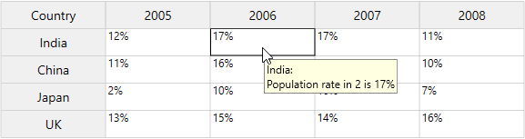
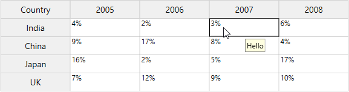
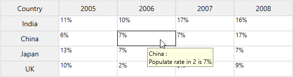
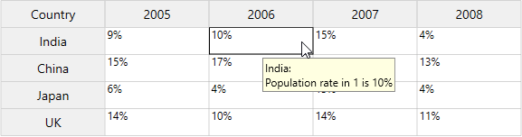
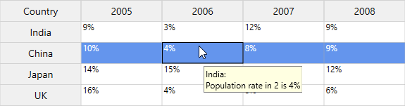
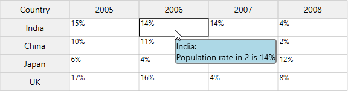

# Input Message Tip in WPF GridControl

The input message tip can be added to individual cells, rows and columns to show external message of a specific cell when the cell is activated. The input message tip service can be enabled by setting the [GridTooltipService.SetShowTooltips](https://help.syncfusion.com/cr/wpf/Syncfusion.Windows.Controls.Grid.GridTooltipService.html#Syncfusion_Windows_Controls_Grid_GridTooltipService_SetShowTooltips_System_Windows_DependencyObject_System_Boolean_) attached property to `true`. Tooltip for particular cell or row or column can be enabled by setting the [GridStyleInfo.ShowDataValidationTooltip](https://help.syncfusion.com/cr/wpf/Syncfusion.Windows.Controls.Grid.GridStyleInfo.html#Syncfusion_Windows_Controls_Grid_GridStyleInfo_ShowDataValidationTooltip) property.

## Input Message Tip for particular cell

The input message tip displayed for any cell by setting the [ShowDataValidationTooltip](https://help.syncfusion.com/cr/wpf/Syncfusion.Windows.Controls.Grid.GridStyleInfo.html#Syncfusion_Windows_Controls_Grid_GridStyleInfo_ShowDataValidationTooltip) and the message tip can be customized by setting [DataValidationTooltip](https://help.syncfusion.com/cr/wpf/Syncfusion.Windows.Controls.Grid.GridStyleInfo.html#Syncfusion_Windows_Controls_Grid_GridStyleInfo_DataValidationTooltip) property.





<syncfusion:GridControl Name="grid" syncfusion:GridTooltipService.ShowTooltips="True" />





//To enable input message tip for GridControl
GridTooltipService.SetShowTooltips(grid, true);

grid.Model[1, 2].DataValidationTooltip = grid.Model[1, 0].CellValue + ":\nPopulation rate in " + grid.Model[1, 2].ColumnIndex + " is " + grid.Model[1, 2].CellValue;
grid.Model[1, 2].ShowDataValidationTooltip = true;





## Input Message Tip for row and column

The input message tip can be displayed for any row or column by setting the [ShowDataValidationTooltip](https://help.syncfusion.com/cr/wpf/Syncfusion.Windows.Controls.Grid.GridStyleInfo.html#Syncfusion_Windows_Controls_Grid_GridStyleInfo_ShowDataValidationTooltip) and the message tip can be customized by setting [DataValidationTooltip](https://help.syncfusion.com/cr/wpf/Syncfusion.Windows.Controls.Grid.GridStyleInfo.html#Syncfusion_Windows_Controls_Grid_GridStyleInfo_DataValidationTooltip) property.





//Adding input message tip for specific row
grid.Model.RowStyles[1].DataValidationTooltip = "Hello";
grid.Model.RowStyles[1].ShowDataValidationTooltip = true;

//Adding input message tip for specific column
grid.Model.ColStyles[1].DataValidationTooltip = "Hello";
grid.Model.ColStyles[1].ShowDataValidationTooltip = true;





An another way to set the input message tip for specific row and column.





//Add input message tip for specific row
for (int i = 1; i <= 4; i++)
{
    string comment = grid.Model[1, 0].CellValue + " :\nPopulation rate in " + grid.Model[1, i].ColumnIndex + " is " + grid.Model[1, i].CellValue;
    grid.Model[1, i].DataValidationTooltip = comment;
    grid.Model[1, i].ShowDataValidationTooltip = true;
}

//Add input message tip for specific column
for (int i = 1; i <= 4; i++)
{
    string comment = grid.Model[i, 0].CellValue + " :\nPopulation rate in " + grid.Model[i, 2].RowIndex + " is " + grid.Model[i, 2].CellValue;
    grid.Model[i, 2].DataValidationTooltip = comment;
    grid.Model[i, 2].ShowDataValidationTooltip = true;
}





N> [View sample in GitHub](https://github.com/SyncfusionExamples/wpf-gridcontrol-input-message)

## Set Input Message Tip using QueryCellInfo event

You can set the input message tip for specific cell or row or column by using [QueryCellInfo](https://help.syncfusion.com/cr/wpf/Syncfusion.Windows.Controls.Grid.GridModel.html) event.





private void Grid_QueryCellInfo(object sender, Syncfusion.Windows.Controls.Grid.GridQueryCellInfoEventArgs e)
{
    e.Style.ShowDataValidationTooltip = true;

    //Show message tip for specific cell
    if (e.Cell.RowIndex == 1 && e.Cell.ColumnIndex == 1)
        e.Style.DataValidationTooltip = e.Style.GridModel[1, 0].CellValue + ": \nPopulation rate in " + e.Style.ColumnIndex + " is " + e.Style.CellValue.ToString();
    
    // Show message tip for row.
    if (e.Cell.ColumnIndex > 0 && e.Cell.RowIndex == 1)
        e.Style.DataValidationTooltip = e.Style.GridModel[1, 0].CellValue + ": \nPopulation rate in " + e.Style.ColumnIndex + " is " + e.Style.CellValue.ToString();
        
    // Show message tip for column.
    if (e.Cell.RowIndex > 0 && e.Cell.ColumnIndex == 2)
        e.Style.DataValidationTooltip = e.Style.GridModel[e.Style.RowIndex, 0].CellValue + ": \nPopulation rate in " + e.Style.RowIndex + " is " + e.Style.CellValue.ToString();
}





N> [View sample in GitHub](https://github.com/SyncfusionExamples/wpf-gridcontrol-input-message)

## Show or hide Input Message Tip

You can show or hide the input message tip for specific cell or row or column by setting the [ShowDataValidationTooltip](https://help.syncfusion.com/cr/wpf/Syncfusion.Windows.Controls.Grid.GridStyleInfo.html#Syncfusion_Windows_Controls_Grid_GridStyleInfo_ShowDataValidationTooltip) property to `false`.





grid.Model[1, 2].ShowDataValidationTooltip = false;





## Identify whether cell has Input Message Tip

The [HasShowDataValidationTooltip](https://help.syncfusion.com/cr/wpf/Syncfusion.Windows.Controls.Grid.GridStyleInfo.html#Syncfusion_Windows_Controls_Grid_GridStyleInfo_HasShowDataValidationTooltip) property is used to identify whether the cell has an input message tip in a cell or row or column in GridControl. You can also highlight the cell or row or column applied to the input message tip.





private void Grid_QueryCellInfo(object sender, Syncfusion.Windows.Controls.Grid.GridQueryCellInfoEventArgs e)
{
    if (e.Cell.ColumnIndex > 0 && e.Cell.RowIndex == 2)
    {
        e.Style.DataValidationTooltip = e.Style.GridModel[1, 0].CellValue + ": \nPopulation rate in " + e.Style.ColumnIndex + " is " + e.Style.CellValue.ToString();
        if(e.Style.HasShowDataValidationTooltip)
        {
            e.Style.Background = Brushes.CornflowerBlue;
            e.Style.Foreground = Brushes.White;
        }
    }
}





## Customize the Input Message Tip

The input message tip can be customized by defining DataTemplate. The DataTemplate can be assigned to the [GridStyleInfo.DataValidationTooltipTemplateKey](https://help.syncfusion.com/cr/wpf/Syncfusion.Windows.Controls.Grid.GridStyleInfo.html#Syncfusion_Windows_Controls_Grid_GridStyleInfo_DataValidationTooltipTemplateKey) property. If you are using inputTextmessage1 then you need to assign template to its corresponding template key property namely `GridStyleInfo.DataValidationTooltipTemplateKey`.

[GridStyleInfo](https://help.syncfusion.com/cr/wpf/Syncfusion.Windows.Controls.Grid.GridStyleInfo.html) which holds cell information is the `DataContext` for data template of input message tip.





<Window.Resources>
    <DataTemplate x:Key="inputTextmessage1">
        <Border BorderBrush="Gray" BorderThickness="2.5" CornerRadius="5">
            <TextBlock Width="Auto" Height="Auto" HorizontalAlignment="Left" VerticalAlignment="Center"
                    Background="LightBlue" FontSize="14" Foreground="Black" Text="{Binding DataValidationTooltip}" />
        </Border>
    </DataTemplate>
</Window.Resources>





// Set template key to a particular index 
grid.Model[1, 2].DataValidationTooltipTemplateKey = "inputTextmessage1";

// Using QueryCellInfo event
private void Grid_QueryCellInfo(object sender, Syncfusion.Windows.Controls.Grid.GridQueryCellInfoEventArgs e)
{
    if(e.Cell.RowIndex == 1 && e.Cell.ColumnIndex == 2)
    {
        e.Style.DataValidationTooltip = e.Style.GridModel[1, 0].CellValue + ": \nPopulation rate in " + e.Style.ColumnIndex + " is " + e.Style.CellValue.ToString();
        e.Style.ShowDataValidationTooltip = true;
        e.Style.DataValidationTooltipTemplateKey = "inputTextmessage1";
    }
}





N> [View sample in GitHub](https://github.com/SyncfusionExamples/wpf-gridcontrol-input-message)

## Remove the Input Message Tip

The `ResetValue()` method is used to remove the input message tip for specific cell or row or column in GridControl and to reset the input message value to the default values.





grid.Model[1, 2].DataValidationTooltip = grid.Model[1, 0].CellValue + ":\nPopulation rate in " + grid.Model[1, 2].ColumnIndex + " is " + grid.Model[1, 2].CellValue;
grid.Model[1, 2].ShowDataValidationTooltip = true;
grid.Model[1, 2].ResetValue(GridStyleInfoStore.DataValidationTooltipProperty);




