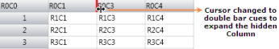

# Interactive Features in WPF GridControl

This section explains the Resizing the columns, Drag and drop the columns and cells of WPF GridControl.

## Drag-and-Drop columns

Essential Grid for WPF provides support for drag-and-drop functionality. This feature enables the user to just click a column header and drag it to a new position. It is not required to select the column header for dragging. This is an easy way of rearranging the columns dynamically. You can enable or disable this feature using AllowDragColumns property of the Grid as follows:



//Allow column dragging
this.grid.AllowDragColumns = true;



The following image illustrates this feature:

In the above image, you can see the column header 1 being dragged to be placed before column 3.

## Excel like - Cell drag and drop

The Excel-like Drag and Drop feature enables dragging content with their styles from cells to different locations and grids. You can use this feature to copy data to one or more locations.



this.grid.AllowDragDrop = true;
this.grid.Model.Options.DataObjectConsumerOptions = GridDataObjectConsumerOptions.Styles;



### Excel Like Drag and Drop has the following features:

* Uses IDataObject to copy, store, and retrieve data. 
* Uses DragDrop API, which is available in WPF, to initiate drag-and-drop.

### Property

<table>
<tr>
<th>
Name of the Property</th><th>
Description</th><th>
Type of Property </th><th>
Value it Accepts</th><th>
PropertySyntax</th></tr>
<tr>
<td>
AllowDragDrop</td><td>
Allows dragging and dropping content and enables ExcelLike MouseController, which helps in the drag-and-drop operation.</td><td>
Normal</td><td>
Boolean</td><td>
 this.grid.AllowDragDrop = true;</td></tr>
<tr>
<td>
GridDataObjectConsumerOptions</td><td>
Gets or sets the enum value for the DragDrop Consumer Option.</td><td>
Normal</td><td>
Enum</td><td>
this.grid.Model.Options.DataObjectConsumerOptions = GridDataObjectConsumerOptions.Styles;</td></tr>
<tr>
<td>
DragDropDropTargetFlags</td><td>
Gets or sets the enum value for values that can be copied or moved and provides other options for DragDropTargetFlags.</td><td>
Normal</td><td>
Enum</td><td>
this.grid.Model.Options.DragDropDropTargetFlags</td></tr>
</table>

### Event

<table>
<tr>
<th>
When is the event triggered?</th><th>
How is it handled?</th><th>
Method (event handler) that handles the event?</th><th>
What are the event args associated?</th><th>
Purpose of the Event</th></tr>
<tr>
<td>
Occurs when the user releases the mouse over a cell at the end of an OLE drag-and-drop operation and before the data is applied to the grid.</td><td>
Handled by setting the Handled flag as True.</td><td>
GridOleDropAtRowColEventHandler</td><td>
GridOleDropAtRowColEventArgs</td><td>
This event allows you to customize the paste data behavior.</td></tr>
<tr>
<td>
The event is initiated when the user rolls the mouse over the edge of a selected range.</td><td>
You can disallow the specified range to be used as the OLE Data Source when assigning true to “Cancel” flag.</td><td>
GridExcelLikeDragRangeEventHandler</td><td>
GridQueryCanDragRangeEventArgs</td><td>
GridQueryCanOleDragRangeEventArgs is a custom event argument class used by the GridControlBase.QueryCanOleDragRange event to determine if a specified range can serve as an OLE drag source.</td></tr>
<tr>
<td>
This event is initiated when a user drags a range of selected cells by using the OLE drag-and-drop.</td><td>
Handled by setting the Handled flag as True.</td><td>
GridQueryOleDataSourceDataEventHandler</td><td>
GridQueryOleDataSourceDataEventArgs</td><td>
This event allows you to provide customized clipboard formats or add support for pasting the additional clipboard content.</td></tr>
</table>

## Excel like - Resizing

Essential Grid control supports Excel like resizing to hide or unhide columns. It also acts as a visual marker to indicate hidden columns.

### Use Case Scenarios

This feature can be implemented for application which contains more rows and columns. You can also make some rows and columns to be hidden.

### Adding Resizing Support to an Application 

This topic explains how to implement the Resizing support to an application. The following steps explain the implementation of the Resizing support to an application. 

1. Set the Resizing border properties
2. Resizing is a built-in property and there is no need to set any special property to enable it. But there are options to 
   set the hidden border color and thickness. Set the HiddenBorderBrush property to any color of the brush for the Model object.  The assigned color will be brushed in the border color of the hidden column or row. Set the HiddenBorderThickness property to an int value say 3. 

The following code snippet explains the implementation of the HiddenBorderBrush and HiddenBorderThickness properties.



this.gridControl.Model.HiddenBorderBrush = Brushes.Red ;
this.gridControl.Model.HiddenBorderThikness = 3; 


Me.gridControl.Model.HiddenBorderBrush = Brushes.Red
Me.gridControl.Model.HiddenBorderThikness = 3



### Run the application

To set the rows or columns as hidden by code, you can use the SetHidden() method. It has two int type parameters to get “from Index” and “to Index”, a Boolean type which sets True for hide and False for unhide. Run the application and you will find the given rows or columns to be hidden. 

The following code snippet explains the implementation of the SetHidden() method of ColumnWidths and RowHeights property.



// To hide columns and rows.
this.gridControl.ColumnWidths.SetHidden(3, 4, true);
this.gridControl.RowHeights.SetHidden(3, 4, true);

// To unhide columns and rows.
this.gridControl.ColumnWidths.SetHidden(3, 4, false);
this.gridControl.RowHeights.SetHidden(3, 4, false);


// To hide columns and rows.
Me.gridControl.ColumnWidths.SetHidden(3, 4, True)
Me.gridControl.RowHeights.SetHidden(3, 4, True)

// To unhide columns and rows.
Me.gridControl.ColumnWidths.SetHidden(3, 4, False)
Me.gridControl.RowHeights.SetHidden(3, 4, False)



The following is a sample output of Resizing support implementation.

### Hide and unhide a rows or Columns during run-time.

To hide a column or a row, hover at the line of the column or row. It shows a resizing cursor with a single bar so that you can drag the line to its next header cell. After joining to the neighbor Header Cell, the line will be darkened which means that a column or a row is hidden. To unhide the hidden rows or columns, hover on the dark marked line. The cursor will then be changed to a double bar and by double clicking, l the hidden rows or columns can be resized to its original size.

The following screenshot explains how to hide and unhide a Column.

Hover over the header cell’s border line. The cursor will be changed to single bar, as like in the following screenshot.

Drag it to Column 2 so that the Border color changes as like in the following screenshot.

The following image shows the output after hiding the row by Mouse Dragging.

To unhide the hidden row, hover the mouse on the hidden column border line. A double bar cursor will then be displayed as in the following screenshot.

Double clicking on it will unhide all the hidden columns in that particular hidden column.

### Tables for Properties, Methods, and Events

### Properties

<table>
<tr>
<th>
Property</th><th>
Description</th><th>
Data Type</th><th>
Default value</th><th>
Class Name</th></tr>
<tr>
<td>
HiddenBorderBrush</td><td>
Sets the border brush color for the hidden rows or columns.</td><td>
Brush</td><td>
Black</td><td>
GridModel</td></tr>
<tr>
<td>
HiddenBorderThickness</td><td>
Sets the border thickness for the hidden rows or columns.</td><td>
int</td><td>
1</td><td>
GridModel</td></tr>
</table>

### Methods

<table>
<tr>
<th>
Method</th><th>
Description</th><th>
Parameters</th><th>
Available inside the Property</th><th>
Return Type</th></tr>
<tr>
<td>
SetHidden()</td><td>
Sets the specified “from” rows to “to” rows as hidden. </td><td>
int from, int to, bool hide</td><td>
RowHeights</td><td>
void</td></tr>
<tr>
<td>
SetHidden()</td><td>
Sets the specified “from” rows to “to” rows as hidden. </td><td>
int from, int to, bool hide</td><td>
ColumnWidths</td><td>
void</td></tr>
</table>

N> Download demo application from [GitHub](https://github.com/syncfusion/wpf-demos/tree/master/GridControl/Excel%20Like%20Features/Hidden%20Row%20Column%20Resizing)
