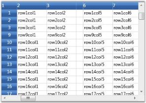
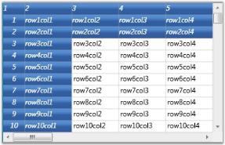
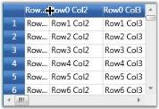
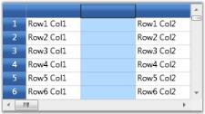
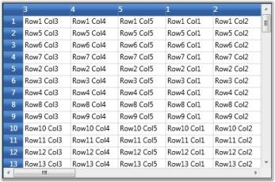

# Managing Rows and Columns in WPF GridControl

This section explains about Managing the rows and columns of WPF GridControl.

Each Grid instance is tied to a model, which contains the data represented by the Grid control. The grid model exposes properties that allow the user to manipulate grid rows and columns.

## Rows and columns count

The grid model has RowCount and ColumnCount properties. These can be set to change the number of rows and columns in the grid control, as shown below:



// Set Row count
grid.Model.RowCount = 10;

// Set Column count
grid.Model.ColumnCount = 20;



## Row heights and column widths

The grid model also stores information on row heights and column widths. Its ColumnWidths and RowHeights properties can be changed using indexers as shown below:



// Setting column widths
grid.Model.ColumnWidths[0] = 30;
grid.Model.ColumnWidths[1] = 80;
grid.Model.ColumnWidths[2] = 100;
grid.Model.ColumnWidths[3] = 50;
grid.Model.ColumnWidths[4] = 250;

// Setting row heights
grid.Model.RowHeights[5] = 40;
grid.Model.RowHeights[3] = 40;



You can also specify the DefaultLineSize setting on ColumnWidths and RowHeights in order to set the default width or height.



grid.Model.RowHeights.DefaultLineSize = 20;
grid.Model.ColumnWidths.DefaultLineSize = 100;



## Hiding rows and columns

Essential Grid supports efficient hiding of rows and columns. You can hide and unhide ranges of rows and columns using SetHidden method on ColumnWidths and RowHeights.

N> SetHidden method accepts the following three parameters: 

* The first parameter is an integer, which specifies the starting row/column to hide/unhide_
* The second parameter is an integer, which specifies the ending row/column to hide/unhide_
* Third is a boolean parameter that determines whether to hide or unhide the specified number of rows or columns. The 
  rows/columns will be hidden when this parameter is set to true._

The following code illustrates the usage of SetHidden method:



// Hide rows
grid.Model.RowHeights.SetHidden(2, 100, true);
grid.Model.RowHeights.SetHidden(110, 1000, true);

// Unhide rows
grid.Model.RowHeights.SetHidden(1010, 10000, false);

//Hide columns
grid.Model.ColumnWidths.SetHidden(2, 100, true);
grid.Model.ColumnWidths.SetHidden(110, 150, true);

// Unhide columns
grid.Model.ColumnWidths.SetHidden(1010, 10000, false);



## Freeze rows and columns

It is possible to fix any number of rows and columns so that they are still visible when a grid is scrolled. This feature is called as freezing. It can be achieved in the Grid by setting the FrozenRows and FrozenColumns properties of grid model, as shown below:



// Freeze rows and columns
grid.Model.FrozenRows = 4;
grid.Model.FrozenColumns = 3;



You can also fix rows to the right of the grid and columns to the bottom. Such fixed rows and columns are referred to as Footer rows and Footer columns. The properties FooterRows and FooterColumns determine the number of footer rows and footer columns. The footer row or column can be customized by using the FooterStyle property.

The following code illustrates the usage of FooterRows, FooterColumns and FooterStyle properties:



// Footer rows and columns
grid.Model.FooterRows = 3;
grid.Model.FooterColumns = 1;
grid.Model.FooterStyle.Background = Brushes.LightCoral;



## Header rows and columns

Grid allows the user to have any number of header rows and columns. It is done by using the HeaderRows and HeaderColumns properties of the grid model. The HeaderStyle property of the grid model controls the appearance of these header rows and header columns.

The following code illustrates the usage of HeaderRows, HeaderColumns and HeaderStyle properties:



// Header rows and columns
grid.Model.HeaderRows = 3;
grid.Model.HeaderColumns = 2;
grid.Model.HeaderStyle.Font.FontStyle = FontStyles.Italic;



## Resize rows and columns

Grid allows the user to resize the rows and columns at run time. When this feature is enabled and if you move the mouse over the row or column divider, it will show a resize cursor using which you can resize the row or column to the required level. The following images illustrate the resizing of a column and a row:

This feature is turned on by default. To disable column or row resizing, you need to detach the corresponding mouse controllers from grid, as shown below:



IMouseController controller = grid.MouseControllerDispatcher.Find ("ResizeRowsMouseController");
grid.MouseControllerDispatcher.Remove(controller);
controller = grid.MouseControllerDispatcher.Find  ("ResizeColumnsMouseController");
grid.MouseControllerDispatcher.Remove(controller);



N> To prevent resizing of specific row or column, it is required to handle ResizingRows and ResizingColumns events.

## Inserting rows and columns

New columns and rows can be inserted at run time by using the following APIs:

* InsertColumns()
* InsertRows()

Both these methods accept the following two parameters: 

1. Position index 
2. Number of rows or columns to insert

The following code illustrates the usage of InsertColumns and InsertRows methods:



//Insert a column at position 2.
grid.Model.InsertColumns(2, 1);

//Insert 2 rows at position 5.
grid.Model.InsertRows(5, 2);



N> You can track the moment the rows or columns are inserted by handling the RowsInserted and ColumnsInserted events.

## Moving rows and columns

The rows and columns can be rearranged dynamically by moving them from one position to another using the following APIs: 

* MoveRows()
* MoveColumns()

These methods accept the following three parameters: 

* Position from which the rows or columns should be removed
* Number of rows or columns
* The new position at which these rows or columns should be inserted

You can also achieve this by a simple drag-and-drop action on the desired rows and columns.

The following code illustrates the usage of MoveColumns and MoveRows methods:



//Move 3 rows from index 2 to index 5.
grid.Model.MoveRows(2, 3, 5);

//Move 2 columns from index 1 to index 4.
grid.Model.MoveColumns(1, 2, 4);



N> You can track the moment the rows or columns are moved by handling the RowsMoved and  ColumnsMoved event.

## Removing rows and columns

It is possible to remove a range of rows and columns from the grid. The APIs RemoveRows() and RemoveColumns() are used to achieve this. They accept two parameters:

1. An index, from which the rows or columns should be removed 
2. Total number of rows or columns to be removed

The following code illustrates the usage of RemoveColumns and RemoveRows methods:



//Remove 4 rows from position 3.
grid.Model.RemoveRows(3, 4);

//Remove 3 columns from position 2.
grid.Model.RemoveColumns(2, 3);



You can track the moment the rows or columns are inserted by handling the RowsRemoved and ColumnsRemoved events.

