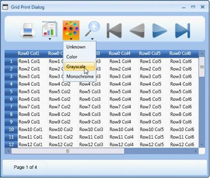
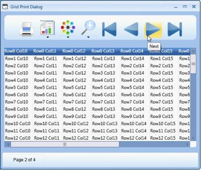
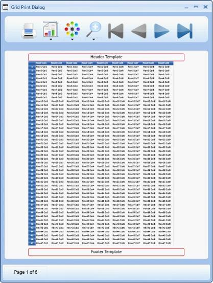

# Printing in WPF GridControl

Essential Grid for WPF provides an in-built support for printing and print preview.  This feature populates a print dialog that allows you to preview the output and make required modifications if necessary, before sending the grid content for printing.

The GridPrintDialog class plays a vital role in the implementation of printing support. It is built based on Microsoft PrintDialog class that will handle the internal operations for GridPrintDialog. The GridPrintDialog class defines the designer for the Print dialog and exposes a number of properties and APIs to handle the UI requirements and define the interaction logic for the Print Dialog. The users can use these properties to configure the Print and Print Preview options.

### Example

Enabling the printing feature is like invoking an API – ShowPrintDialog() on the instances of the grid.



this.grid.ShowPrintDialog();



### Output

## Print Dialog Options

The Print Dialog provides numerous options to configure the output.

### Print Button

Clicking the Print button allows the user to send the grid content to the printer for printing.

### Page Size Drop-down

This drop down lists out various available paper sizes for printing. For example: ISOA4, ISOA1, ISOA3etc. Selecting the required paper size allows the user to print the grid data in the paper of same size.

N> The paper sizes are also marked in the following way:

* Extra-Extra increases the space in addition to the predefined size of the paper, for example- A3._
* Rotated -The output is rotated by a defined angle for the selected page size._

For more information, check the following link: [http://msdn.microsoft.com/en-us/library/system.printing.pagemediasizename.aspx](http://msdn.microsoft.com/en-us/library/system.printing.pagemediasizename.aspx)

### Color Drop-down

The options in this drop-down allow you select the color for the data to be printed. Following are the options provided:

* Monochrome—Selecting this option allows the user to print the grid data in the shades of a single color or hue.
* Color—Selecting this option allows the user to print the grid data in the selected color.
* Gray scale—Selecting this option allows the user to print the grid data in a range of shades of gray without apparent color, the darkest shade being black and the lightest shade being white.
* Unknown—This option can be selected in cases where you receive any print configuration settings which does not fall within the other 3 options. The application that is using this configuration will internally set the color option as unknown in such cases.

### Zoom Drop-down

The options in this drop-down allow you select the required percentage magnification for viewing the grid data to be printed. Selecting the required option allows you to magnify the preview to various preset zoom levels like 50%, 100%, 200% and 400%. 

### Navigation Options

The Print dialog provides four navigational buttons to navigate the grid preview:

-This button allows you to move to the first page 

-This button allows you to move to the last page 

-This button allows you to move to the previous page 

-This button allows you to move to the next page 

The following image shows the next button highlighted for an example.

## Printing Header and Footer

Headers and Footers can be added to the document to be printed. 

* GridControl.PrintHeaderTemplate determines the content for the print header. It is a property of GridControl and any value assigned to this property will be provided as an output in the Header section of the print output. For example: A text block outlined with a border is assigned to this property and hence the header also is printed with a border. 
* GridControl.PrintFooterTemplate defines the print footer. The content represented by the print header will appear at the top of each printed page and likewise, the content represented by the print footer will appear at the bottom of each printed page. 
* The height of the header and footer can be adjusted using the GridControl properties- PrintHeaderHeight and PrintFooterHeight.



<syncfusion:GridControl x:Name="grid" PrintHeaderHeight="40" PrintFooterHeight="40">
<syncfusion:GridControl.PrintHeaderTemplate>
<DataTemplate>
<Border CornerRadius="5" BorderBrush="Crimson" BorderThickness="2" HorizontalAlignment="Stretch">
<TextBlock Text="Header Template" FontSize="24" FontFamily="Calibri" HorizontalAlignment="Center" />
</Border>
</DataTemplate>
</syncfusion:GridControl.PrintHeaderTemplate>
<syncfusion:GridControl.PrintFooterTemplate>

<DataTemplate>
<Border CornerRadius="5" BorderBrush="Red" BorderThickness="2" HorizontalAlignment="Stretch"
<TextBlock Text="Footer Template" FontSize="24" FontFamily="Calibri" HorizontalAlignment="Center" />
</Border>
</DataTemplate>
</syncfusion:GridControl.PrintFooterTemplate>



### Output

The following image is the output of the code above. 

