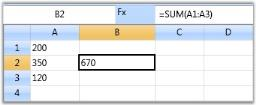
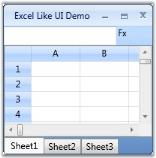
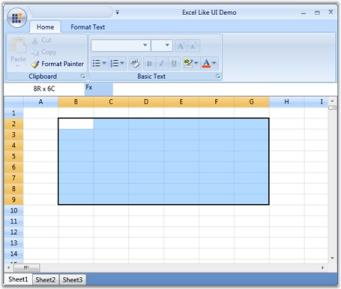

# Real Time Applications in WPF GridControl

Grids can be adopted in many real time applications where the database is of crucial importance. As such applications are widely spread; the grids are indispensably used world-wide.  This section elaborates on some of the real time applications which can use Essential Grid.

## Applications with High Frequency Updates 

Grid can be used in applications with frequent updates, for example stock values in share market. When grid is switched over to virtual mode, it reforms itself as a light weight control that consumes a very little memory and processing power, and provides a very small latency under heavy load. Such virtual grids are typically useful when there is a need to display enormous data very quickly.  

N> Download demo application from [GitHub](https://github.com/syncfusion/wpf-demos/tree/master/GridControl/Performance/TraderGrid%20Test)

## Excel-like UI Applications

Another important application is Excel like UI that simulates Microsoft Excel 2007 and gives an appearance that resembles excel. This application exhibits the following excel characteristics:

   * Excel like Current Cell
   * Formula Cells
   * Excel like Selection Frame
   * Markup Headers
   * Workbook of sheets

a. Excel-like Current Cell

You can select a current cell in the Grid, similar to the current cell behavior in Microsoft Excel. This feature can be enabled, by setting GridModelOptions.ExcelLikeCurrentCell property to _true_, as follows:  



grid.Model.Options.ExcelLikeCurrentCell = true;



N>  If you have selected a current cell within a specified range, and when you move the current cell selection out of this range, the range will be cleared.

b. Excel-like Selection Frame

The active selection can be outlined with a selection frame by setting the GridModelOptions.ExcelLikeSelectionFrame property to true, as follows:



grid.Model.Options.ExcelLikeSelectionFrame = true;



c. Formula Cells

As we discussed in the previous chapter, Grid control provides complete support to formula cells. It can be enabled for the grid by setting the format string, FormulaCell to the TableStyle.CellType property, as follows: 



grid.Model.TableStyle.CellType = "FormulaCell";



d. Markup Headers

In Excel, whenever a selection is made, the headers of those rows and columns which are involved in the selection will be highlighted. You can get a similar behavior in the Grid using the OnPrepareRenderCell event.  

OnPrepareRenderCell event-This event will be triggered for every cell when they are about to be rendered. Hence, using this event, the cells that are going to be rendered are identified and their headers are highlighted.

The following code illustrates how to handle this event:



protected override void OnPrepareRenderCell(GridPrepareRenderCellEventArgs e)
{
    base.OnPrepareRenderCell(e);

    if (e.Cell.RowIndex == 0 && Model.SelectedRanges.AnyRangeIntersects(GridRangeInfo.Col(e.Cell.ColumnIndex)))
    {
        e.Style.Background = this.excelOrange;
    }

    else if (e.Cell.ColumnIndex == 0 && Model.SelectedRanges.AnyRangeIntersects(GridRangeInfo.Row(e.Cell.RowIndex)))
    {
        e.Style.Background = this.excelOrange;
    }
}



e. Workbook of Sheets

You can create a workbook with multiple sheets similar to excel, using a Tab control, where individual tab represents a worksheet embedded within a Grid control.

N> Download demo application from [GitHub](https://github.com/syncfusion/wpf-demos/tree/master/GridControl/Product%20Showcase/Excel%20Like%20UI)

