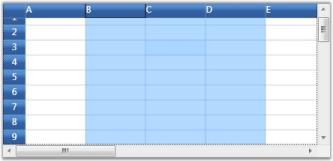
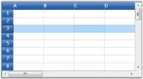
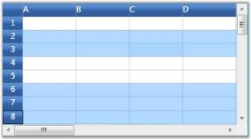
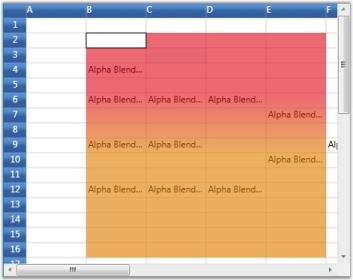
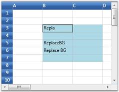

# Selection in WPF GridControl

WPF Grid Control supports for range and record selection modes. Selection will highlight the specified range. 

* Range Selection
* Record Selection 

## Range Selection

Range selection is a cell-based selection mode that allows you to do a selection across the cell by using the [AllowSelection](https://help.syncfusion.com/cr/wpf/Syncfusion.Grid.Wpf~Syncfusion.Windows.Controls.Grid.GridModelOptions~AllowSelection.html) property. It accepts value from [GridSelectionFlags](https://help.syncfusion.com/cr/wpf/Syncfusion.Grid.Wpf~Syncfusion.Windows.Controls.Grid.GridSelectionFlags.html) enumeration. Default value for `AllowSelection` is `Any` and the specified range of Cell/Row/Column or Table can be highlighted using the range section.

The possible values for this type of selection are defined by the enum GridSelectionFlags. To control the selection behavior of the grid, set any of the following flags to the AllowSelection property. 

### Selection Flags

<table>
<tr>
<th>
Flag</th><th>
Description</th></tr>
<tr>
<td>
None</td><td>
Disables selecting of cells.</td></tr>
<tr>
<td>
Row</td><td>
Allows selection of rows.</td></tr>
<tr>
<td>
Column</td><td>
Allows selection of columns.</td></tr>
<tr>
<td>
Table</td><td>
Allows selection of the whole table.</td></tr>
<tr>
<td>
Cell</td><td>
Allows selection of an individual cell.</td></tr>
<tr>
<td>
Multiple</td><td>
Allows selection of multiple ranges of cells. The user has to press CTRL Key to select multiple ranges.</td></tr>
<tr>
<td>
Shift</td><td>
Allows extending existing selection when user holds SHIFT Key and clicks on a cell.</td></tr>
<tr>
<td>
Keyboard</td><td>
Allows extending existing selection when user holds SHIFT Key and presses arrow keys.</td></tr>
<tr>
<td>
MixRangeType</td><td>
Allows both rows and columns to be selected at the same time when Multiple is specified. By default, the grid does not allow row and column ranges to be selected at the same time.</td></tr>
<tr>
<td>
Any</td><td>
Allows selection of rows, columns, table, cell and multiple ranges of cells; also extends SHIFT Key support and alpha blending.</td></tr>
</table>

N> You can combine more than one flag to customize the current selection behavior.



grid.Model.Options.AllowSelection = GridSelectionFlags.Multiple | GridSelectionFlags.Column;



## Record Selection

This type of selection mechanism allows selection in terms of record (entire row). It is not cell-based. This selection mode is specifically designed for a data-bound grid, in which the grid data can be organized as a collection of record rows. 

Grid offers the following three types of record selections which are together called as ListBoxSelectionMode. 

* SelectionMode–One
* SelectionMode–MultiSimple
* SelectionMode-MultiExtended

To enable record selection, set the [ListBoxSelectionMode](https://help.syncfusion.com/cr/wpf/Syncfusion.Grid.Wpf~Syncfusion.Windows.Controls.Grid.GridModelOptions~ListBoxSelectionMode.html) property to any of the above specified List Box Selection Mode values. To enable list box selection, turn off the range selection by setting the `AllowSelection` property to `Row`. Below is a detailed description of list box selection modes.

### SelectionMode-One

It allows you to select only one item (record). For example, you have selected a record. Now if you select some other record, the previous record selection will be cleared. Hence it is a `One` record selection mode. The following code is used to set this mode:



grid.AllowSelection = GridSelectionFlags.Row;
grid.Model.Options.ListBoxSelectionMode = GridSelectionMode.One;



N> Record can be selected using a single mouse click or using UP or DOWN Arrow Keys

### SelectionMode - MultiSimple

In this selection mode, you will be able to select multiple items individually. For instance, you have selected a record using mouse and you want to select one more record. Click another record and you will notice that the previous selection is not cleared. Hence You can select multiple records without the need of SHIFT or CTRL keys.

The following code is used to set this mode:



grid.AllowSelection = GridSelectionFlags.Row;
grid.Model.Options.ListBoxSelectionMode = GridSelectionMode.MultiSimple;



N> It does not support the use of SHIFT, CTRL and arrow keys to extend the selection.

### SelectionMode - MultiExtended

This selection type allows multiple items selection through SHIFT, CTRL and arrow keys. 

You can do any of the following when this selection mode is enabled:

* Select a record, hold down the SHIFT key and select fourth record, for example. You will notice all the records in between 1st and the 4th records are also selected. 
* You can make random selection by holding down the CTRL key. 
* Hold down the Shift key and select the records using the UP or DOWN ARROW keys.

The following code is used to set this mode:



grid.AllowSelection = GridSelectionFlags.Row;
grid.Model.Options.ListBoxSelectionMode = GridSelectionMode.MultiExtended;



## Selecting rows and columns programmatically

The entire grid selections are managed by the [GridModel.Selections](https://help.syncfusion.com/cr/wpf/Syncfusion.Grid.Wpf~Syncfusion.Windows.Controls.Grid.GridModelSelections.html) collection. It exposes several APIs that let you to add, remove and operate on different grid selections. Below is the description of some important properties and APIs:

<table>
<tr>
<th>
Property/Method</th><th>
Description</th></tr>
<tr>
<td>
{{'[Add](https://help.syncfusion.com/cr/wpf/Syncfusion.Grid.Wpf~Syncfusion.Windows.Controls.Grid.GridModelSelections~Add.html)'| markdownify }}, {{'[Remove](https://help.syncfusion.com/cr/wpf/Syncfusion.Grid.Wpf~Syncfusion.Windows.Controls.Grid.GridModelSelections~Remove.html)'| markdownify }}</td><td>
Adds or removes the specified range to/from the collection.</td></tr>
<tr>
<td>
{{'[InsertRows](https://help.syncfusion.com/cr/wpf/Syncfusion.Grid.Wpf~Syncfusion.Windows.Controls.Grid.GridModelSelections~InsertRows.html)'| markdownify }}, {{'[InsertColumns](https://help.syncfusion.com/cr/wpf/Syncfusion.Grid.Wpf~Syncfusion.Windows.Controls.Grid.GridModelSelections~InsertColumns.html)'| markdownify }}</td><td>
Inserts new rows or columns into the collection.</td></tr>
<tr>
<td>
{{'[RemoveRows](https://help.syncfusion.com/cr/wpf/Syncfusion.Grid.Wpf~Syncfusion.Windows.Controls.Grid.GridModelSelections~RemoveRows.html)'| markdownify }}, {{'[RemoveColumns](https://help.syncfusion.com/cr/wpf/Syncfusion.Grid.Wpf~Syncfusion.Windows.Controls.Grid.GridModelSelections~RemoveColumns.html)'| markdownify }}</td><td>
Removes the specified rows or columns from the collection.</td></tr>
<tr>
<td>
{{'[Ranges](https://help.syncfusion.com/cr/wpf/Syncfusion.Grid.Wpf~Syncfusion.Windows.Controls.Grid.GridModelSelections~Ranges.html)'| markdownify }}</td><td>
A GridRangeInfoList collection that stores all the selected ranges for the grid.</td></tr>
<tr>
<td>
{{'[SelectRange](https://help.syncfusion.com/cr/wpf/Syncfusion.Grid.Wpf~Syncfusion.Windows.Controls.Grid.GridModelSelections~SelectRange.html)'| markdownify }}</td><td>
Adds or removes a range to/from the collection.</td></tr>
<tr>
<td>
{{'[GetSelectedRanges](https://help.syncfusion.com/cr/wpf/Syncfusion.Grid.Wpf~Syncfusion.Windows.Controls.Grid.GridModelSelections~GetSelectedRanges.html)'| markdownify }}</td><td>
Retrieves a list of selected ranges and if there are no selected ranges, returns the current cell.</td></tr>
<tr>
<td>
{{'[GetSelectedRows](https://help.syncfusion.com/cr/wpf/Syncfusion.Grid.Wpf~Syncfusion.Windows.Controls.Grid.GridModelSelections~GetSelectedRows.html)'| markdownify }}</td><td>
Returns the number of selected rows.</td></tr>
<tr>
<td>
{{'[GetSelectedCols](https://help.syncfusion.com/cr/wpf/Syncfusion.Grid.Wpf~Syncfusion.Windows.Controls.Grid.GridModelSelections~GetSelectedCols.html)'| markdownify }}</td><td>
Returns the number of selected columns.</td></tr>
</table>

## Selection appearance Customization

It is possible to modify the appearance of the selection through property settings. The following properties work in combinations to produce some special effects.

<table>
<tr>
<th>
Property</th><th>
Description</th></tr>
<tr>
<td>
{{'[DrawSelectionOptions](https://help.syncfusion.com/cr/wpf/Syncfusion.Grid.Wpf~Syncfusion.Windows.Controls.Grid.GridModelOptions~DrawSelectionOptions.html)'| markdownify }}</td><td>
Defines the selection behavior for the grid. Important options are:AlphaBlendReplaceBackgroundReplaceTextColor</td></tr>
<tr>
<td>
{{'[HighlightSelectionAlphaBlend](https://help.syncfusion.com/cr/wpf/Syncfusion.Grid.Wpf~Syncfusion.Windows.Controls.Grid.GridModelOptions~HighlightSelectionAlphaBlend.html)'| markdownify }}</td><td>
Specifies the alpha blend color used for selection.</td></tr>
<tr>
<td>
{{'[HighlightSelectionBackground](https://help.syncfusion.com/cr/wpf/Syncfusion.Grid.Wpf~Syncfusion.Windows.Controls.Grid.GridModelOptions~HighlightSelectionBackground.html)'| markdownify }}</td><td>
Specifies the background color for selection.</td></tr>
<tr>
<td>
{{'[HighlightSelectionForeground](https://help.syncfusion.com/cr/wpf/Syncfusion.Grid.Wpf~Syncfusion.Windows.Controls.Grid.GridModelOptions~HighlightSelectionForeground.html)'| markdownify }}</td><td>
Specifies the foreground color for selection.</td></tr>
</table>

Below code provides alpha blended selection:



LinearGradientBrush brush = new LinearGradientBrush(new GradientStopCollection()
{  
   new GradientStop(GridUtil.GetXamlConvertedValue<Color>("#A0E01020"), 0d),
   new GradientStop(GridUtil.GetXamlConvertedValue<Color>("#A0E01020"), 0.318681d),
   new GradientStop(GridUtil.GetXamlConvertedValue<Color>("#A0E08000"), 0.604396d),
   new GradientStop(GridUtil.GetXamlConvertedValue<Color>("#A0E08000"), 1d)
});
brush.StartPoint = new Point(0.5, -0.0430693);
brush.EndPoint = new Point(0.5, 0.928826);
grid.Model.Options.HighlightSelectionAlphaBlend = brush;
grid.Model.Options.DrawSelectionOptions = GridDrawSelectionOptions.AlphaBlend;



Below code lets you set the background of the selection:



grid.Model.Options.DrawSelectionOptions = GridDrawSelectionOptions.ReplaceBackground;
grid.Model.Options.HighlightSelectionBackground = Brushes.LightBlue;



Below code lets you set the foreground of the selection:



grid.Model.Options.DrawSelectionOptions = GridDrawSelectionOptions.ReplaceTextColor;
grid.Model.Options.HighlightSelectionForeground = Brushes.Red;



## Excel-like Selection Frame

The active selection can be outlined with a selection frame by setting the [GridModelOptions.ExcelLikeSelectionFrame](https://help.syncfusion.com/cr/wpf/Syncfusion.Grid.Wpf~Syncfusion.Windows.Controls.Grid.GridModelOptions~ExcelLikeSelectionFrame.html) property to `true`, as follows:



grid.Model.Options.ExcelLikeSelectionFrame = true;



## CurrentCell

By default the CurrentCell cell borders are rendered when a cell is activated. The [ShowCurrentCell](https://help.syncfusion.com/cr/wpf/Syncfusion.Grid.Wpf~Syncfusion.Windows.Controls.Grid.GridModelOptions~ShowCurrentCell.html) property is used to show or hide current cell borders.



//To disable the current cell.
this.gridControl.Model.Options.ShowCurrentCell = false; 



## Excel-like CurrentCell

You can select a current cell in the Grid, similar to the current cell behavior in Microsoft Excel(borders with thickness). This feature can be enabled by setting [GridModelOptions.ExcelLikeCurrentCell](https://help.syncfusion.com/cr/wpf/Syncfusion.Grid.Wpf~Syncfusion.Windows.Controls.Grid.GridModelOptions~ExcelLikeCurrentCell.html) property to `true` as follows:  



grid.Model.Options.ExcelLikeCurrentCell = true;



N>  If you have selected a current cell within a specified range, the range will be cleared, when you move the current cell selection out of this range.

## Highlighting row and column header based on selection

In Excel, whenever a selection is made, the headers of those rows and columns which are involved in the selection will be highlighted. You can get a similar behavior in the Grid by overriding the [OnPrepareRenderCell](https://help.syncfusion.com/cr/wpf/Syncfusion.Grid.Wpf~Syncfusion.Windows.Controls.Grid.GridControlBase~OnPrepareRenderCell.html) method.

`OnPrepareRenderCell` method will be invoked for every cell in the grid, when they are about to be rendered. Hence, using this method, the cells which are going to be rendered are identified and their headers are highlighted.

The following code illustrates how to handle this event:



protected override void OnPrepareRenderCell(GridPrepareRenderCellEventArgs e)
{
    base.OnPrepareRenderCell(e);

    if (e.Cell.RowIndex == 0 && Model.SelectedRanges.AnyRangeIntersects(GridRangeInfo.Col(e.Cell.ColumnIndex)))
    {
        e.Style.Background = this.excelOrange;
    }

    else if (e.Cell.ColumnIndex == 0 && Model.SelectedRanges.AnyRangeIntersects(GridRangeInfo.Row(e.Cell.RowIndex)))
    {
        e.Style.Background = this.excelOrange;
    }
}



Demo to [highlight row/column headers based on selection](https://github.com/SyncfusionExamples/Row-and-column-header-highlighting-based-on-selection-in-WPF-Grid-Control)