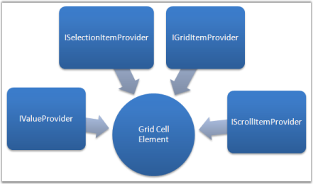
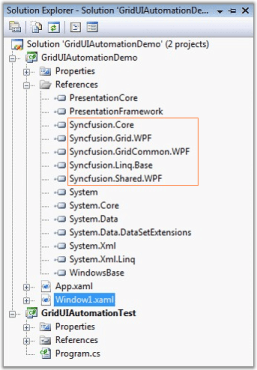
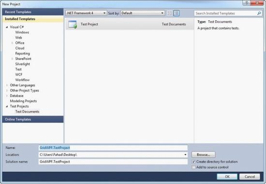
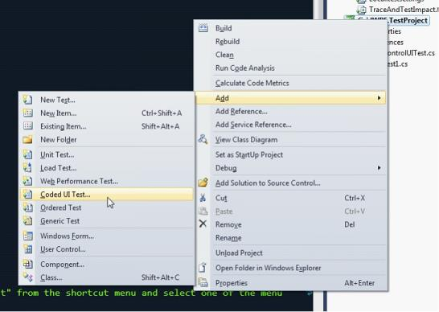
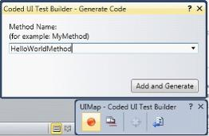
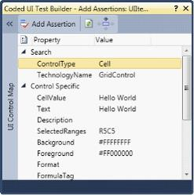
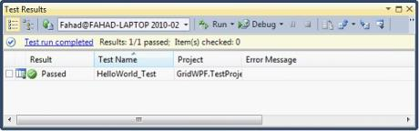

# Testing in WPF GridControl

GridControl provides support for UI Automation and VS2010 Coded UI testing. This section provides the detailed description about using them with the Grid.

##  Grid Control UI Automation Support

Microsoft UI Automation provides a single, generalized interface that automation clients can examine or use to operate the user interfaces of a variety of platforms and frameworks. For more information, see [http://msdn.microsoft.com/en-us/library/cc165614.aspx](http://msdn.microsoft.com/en-us/library/cc165614.aspx).

With the Grid control, UI Automation is enabled for writing testable applications. It involves the patterns below.

Grid control is customized for maximum performance, and thus the visuals are always virtualized. Automation Elements are generated for these live visuals alone. The different sets of automation providers implemented, provide access to the inner elements.

Following are the different sets of identifiers that can be obtained for the Grid:

* GridPattern
* TablePattern
* SelectionPattern
* ScrollPattern

Each cell in the grid is considered as an Automation Element, which in itself has some providers implemented. The following figure displays the different sets of identifiers for a Grid Cell Element.

Following are the different set of identifiers that can be obtained for each Grid Cell Element:

* GridItemPattern
* ValuePattern
* SelectionItemPattern
* ScrollItemPattern

N> With NUnit or any other test frameworks, using TestApi from codeplex.com makes it quite easy to write unit tests. We are not recommending/fixing any issues with TestApi, it is an open source library from Microsoft.

### Using UI Automation Patterns

Let us walkthrough the following sample application that demonstrates the usage of UI Automation using a Console application.

### API Usage

Setting up an Automation Sample is very useful to understand the usage of API for Automation Peer in Grid control. Automation Elements are run on a different thread from the main GUI thread.

The following set of instructions illustrates the same.

1. Create a WPF sample application with references added up for Syncfusion assemblies.

   

2.Create a console project as shown below.



<Grid>
<ScrollViewer CanContentScroll="True" HorizontalScrollBarVisibility="Auto" VerticalScrollBarVisibility="Auto">
    <syncfusion:GridControl x:Name="grid" />
</ScrollViewer>
</Grid>


private void InitGrid()
{
    var model = this.grid.Model;
    model.RowCount = 10;
    model.ColumnCount = 10;
    model.QueryCellInfo += (s, e) =>
    {
        e.Style.CellValue = string.Format("Cell {0} / {1}", e.Cell.RowIndex, e.Cell.ColumnIndex);
    };
}



3.Enter the path where the output of the Window sample has to be saved, in the Output path field.

N> Mention the output path as the Console application's bin\Debug directory.

The following sample code uses TestApi assemblies.



// Initialization Code.

private static AutomationElement GetGridAut(out AutomatedApplication app)
{
    string sampleAppPath = "GridUIAutomationDemo.exe";
    app = new OutOfProcessApplication(new OutOfProcessApplicationSettings
    {
        ProcessStartInfo = new ProcessStartInfo(sampleAppPath),
        ApplicationImplementationFactory = new UIAutomationOutOfProcessApplicationFactory()
    });
    app.Start();
    app.WaitForMainWindow(TimeSpan.FromSeconds(15));
    var rootElement = app.MainWindow as AutomationElement;
    var grid = rootElement.AsQueryable(TreeScope.Descendants).First(o => o.ClassName == "GridControl" && o.ControlType ==                     ControlType.DataGrid);
    return grid;
}



N> We have added minimal set of LINQ-to-UIAutomation classes that would translate the LINQ query for searching the AutomationElement from the root hierarchy. With LINQ-To-UIAutomation library, only First method is supported now.

The Grid Automation element is obtained.

### Obtaining the Automation Pattern

Once you get the actual Grid's Automation Element, you can then make use of different Patterns supported by the control. The following code example illustrates the same.



var gridPattern = grid.GetCurrentPattern(GridPatternIdentifiers.Pattern) as GridPattern;
var item = gridPattern.GetItem(1, 1);

if (item != null)
{
    object value = null;
    item.TryGetCurrentPattern(ValuePatternIdentifiers.Pattern, out value);
    var valueProvider = value as ValuePattern;
    var cellValue = valueProvider.Current.Value;
    Console.WriteLine("Item at [1,1] - {0}", cellValue);
}



## VS 2010 Coded UI Testing

Essential Grid WPF now supports automated UI testing with VS 2010 Coded UI technology. The Grid Test plugin blends in with the automated UI Testing Framework in VS 2010 by implementing the following classes:

* UITechnologyManager
* UITestPropertyProvider
* UIActionFilter

You can get the Extension Project of Coded UI from [this](http://www.syncfusion.com/downloads/support/directtrac/general/CODEDU~1-2042805459.ZIP) location.

The architectural diagram is as follows:

* Grid Test Plugin implements the necessary details to communicate with the VS 2010 Test Framework.
* The Grid application host runs with a .NET Remoting channel hosted internally to communicate with the Test plugin through an interface. The data is then channeled across to the VS 2010 Test Framework to identify the Cells.

### Properties 

Following are the properties exposed in Coded UI Testing:

* CellValue
* Text
* Description
* SelectedRanges
* Background
* Foreground
* Borders
* Format
* FormulaTag

### Creating a Coded UI Test With Essential Grid WPF

Initial steps before creating the Coded UI Test project:

* Prepare the Grid sample application.
* Write Unit tests using VS 2010.
* Testing the application with generated Coded UI Tests.

### Preparing the Grid application

1. Syncfusion.VisualStudio.TestTools.UITest.GridExtensions.dll contains implementation to easily change an existing 
   application to the test application that the plugin would require. Add a reference to this assembly.
2. Open App.xaml.

N> The following code appears.



<Application x:Class="WpfApplication3.App"
    xmlns="http://schemas.microsoft.com/winfx/2006/xaml/presentation"
    xmlns:x="http://schemas.microsoft.com/winfx/2006/xaml"
    StartupUri="Window1.xaml">
    <Application.Resources>
	</Application.Resources>
</Application>



3.Change Application to Syncfusion:GridControlTestApplication as follows.


<syncfusion:GridControlTestApplication x:Class="WpfApplication3.App"
    xmlns="http://schemas.microsoft.com/winfx/2006/xaml/presentation"
    xmlns:syncfusion="http://schemas.syncfusion.com/wpf"
    xmlns:x="http://schemas.microsoft.com/winfx/2006/xaml"
    StartupUri="Window1.xaml">
    <syncfusion:GridControlTestApplication.Resources>
		</syncfusion:GridControlTestApplication.Resources>
</syncfusion:GridControlTestApplication>



4.For the code behind file (App.xaml.cs), make sure to inherit from GridControlTestApplication.



namespace WpfApplication3
{
    /// 

    /// Interaction logic for App.xaml
    /// 

    public partial class App : GridControlTestApplication
    {
    }
}



5.Build the application to make it ready for testing.

N> The GridControlTestApplication works only with a single Grid instance in the window. For multiple instances the IGridInteropService interface has to be implemented.

### Creating Unit Tests with VS2010

1. Create a new Test Project in VS2010,

   
   
2. Add a new Coded UI Test item for the project.

   
   
3. Add a TestMethod called HelloWorld_Test.

The following code illustrates this.


 
public void HelloWorld_Test()
{
}
 


4.Build and run the Grid application that you configured.

  * Right-click on the TestMethod body and then select as below,

  
    
5.Click on the record button to perform actions, you can add a Hello World text in a grid cell [x, y] in this scenario.

  
    
  
    
6.Click on Generate code in the Coded UI Test Builder.

  
    
7.You can assert the cell value using the cross-hair present in the Coded UI Test builder. 

8.Click on the cross-hair and hover to the Hello World cell.

  N> The assert window is displayed as below.
  
  
    
9.Add asserts to the properties displayed in the assert window and generate the assert method.

10.Close the Coded UI Test builder. 

   N> Coded UI Unit Test is created.

The following code generates automatically. 



public void HelloWorld_Test()
{
     this.UIMap.HelloWorldMethod();
     this.UIMap.HelloWorldAssert();
}



### Testing the Application with Generated Coded UI Test

1. Build and run the Grid WPF application.
2. Build the test project and run the Unit tests using VS 2010.

   
   
3. Run the test HelloWorld_Test.

   * This will automatically focus the running Grid application and perform automated testing.
   
   N> The sample test procedure mentioned above requires the sample to be run individually, in normal automated testing, this would be included in the TestInitialize method to start the application.

   
   
