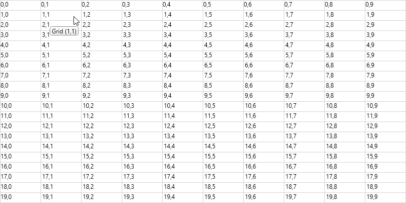
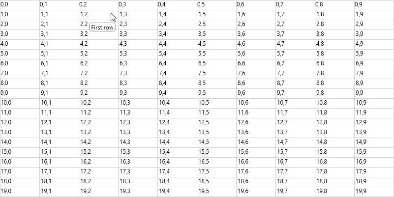
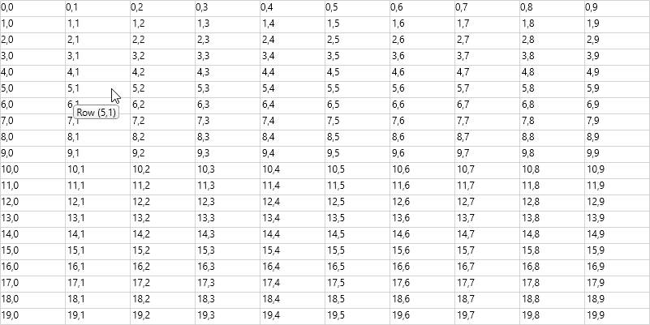
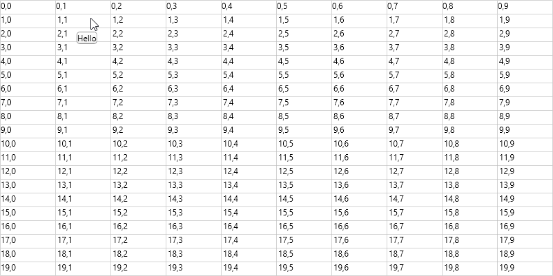
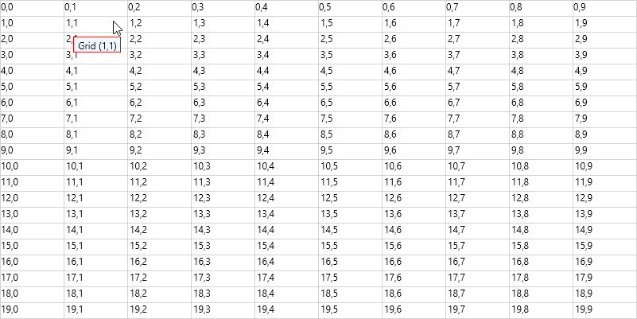

# ToolTip in WPF GridControl

Tooltip can be added to individual cells, rows and columns to show more information about the particular cell on mouse hover. ToolTip services can be enabled by setting [GridTooltipService.SetShowTooltips](https://help.syncfusion.com/cr/wpf/Syncfusion.Windows.Controls.Grid.GridTooltipService.html#Syncfusion_Windows_Controls_Grid_GridTooltipService_SetShowTooltips_System_Windows_DependencyObject_System_Boolean_) attached property to `true`. ToolTip for particular cell or row or column can be enabled by setting the [ShowToolTip](https://help.syncfusion.com/cr/wpf/Syncfusion.Windows.Controls.Grid.GridStyleInfo.html#Syncfusion_Windows_Controls_Grid_GridStyleInfo_ShowTooltip) property of [GridStyleInfo](https://help.syncfusion.com/cr/wpf/Syncfusion.Windows.Controls.Grid.GridStyleInfo.html).

## ToolTip for specific cell

ToolTip can be displayed for any cell by setting [ShowToolTip](https://help.syncfusion.com/cr/wpf/Syncfusion.Windows.Controls.Grid.GridStyleInfo.html#Syncfusion_Windows_Controls_Grid_GridStyleInfo_ShowTooltip) and ToolTip text can be customized by setting [ToolTip](https://help.syncfusion.com/cr/wpf/Syncfusion.Windows.Controls.Grid.GridStyleInfo.html#Syncfusion_Windows_Controls_Grid_GridStyleInfo_ToolTip) property.





//To enable tooltip for GridControl
<syncfusion:GridControl Name="grid" syncfusion:GridTooltipService.ShowTooltips="True" />





//To enable tooltip for GridControl.
GridTooltipService.SetShowTooltips(gridcontrol, true);

//Set tooltip for particular cell.
gridcontrol.Model[1, 1].ToolTip = " Grid (" + gridcontrol.Model[1, 1].CellValue +") ";
gridcontrol.Model[1, 1].ShowTooltip = true;





## ToolTip for row and column

ToolTip can be displayed for any row or column by setting the [ShowToolTip](https://help.syncfusion.com/cr/wpf/Syncfusion.Windows.Controls.Grid.GridStyleInfo.html#Syncfusion_Windows_Controls_Grid_GridStyleInfo_ShowTooltip) and ToolTip text can be customized by setting the [ToolTip](https://help.syncfusion.com/cr/wpf/Syncfusion.Windows.Controls.Grid.GridStyleInfo.html#Syncfusion_Windows_Controls_Grid_GridStyleInfo_ToolTip).





//Adding tooltip to the specific row
gridcontrol.Model.RowStyles[1].ToolTip = "First row";
gridcontrol.Model.RowStyles[1].ShowTooltip = true;

//Adding tooltip to the specific column
gridcontrol.Model.ColStyles[1].ToolTip = "First column";
gridcontrol.Model.ColStyles[1].ShowTooltip = true;





N> [View sample in GitHub](https://github.com/SyncfusionExamples/WPF-GridControl-ToolTip/tree/master/ToolTip_simple)

## Set ToolTip in QueryCellInfo event

You can set the ToolTip to a specific cell or row or column by using the [QueryCellInfo](https://help.syncfusion.com/cr/wpf/Syncfusion.Windows.Controls.Grid.GridControlBase.html) event.





private void Gridcontrol_QueryCellInfo(object sender, GridQueryCellInfoEventArgs e)
{            
    e.Style.ShowTooltip = true;
    //Show tooltip for specific index
    if (e.Cell.RowIndex == 1 && e.Cell.ColumnIndex == 1)
        e.Style.ToolTip = " Grid (" + gridcontrol.Model[1, 1].CellValue +") ";
    // Show tooltip for row.
    if (e.Cell.ColumnIndex > 0 && e.Cell.RowIndex == 5)
        e.Style.ToolTip = " Row " + "(" + e.Cell.RowIndex + "," + e.Cell.ColumnIndex + ") ";
    // Show tooltip for column.
    if (e.Cell.RowIndex > 0 && e.Cell.ColumnIndex == 4)
        e.Style.ToolTip = " Column " + "(" + e.Cell.RowIndex + "," + e.Cell.ColumnIndex + ") ";
}





N> [View sample in GitHub](https://github.com/SyncfusionExamples/WPF-GridControl-ToolTip/tree/master/ToolTip_using_querycellinfo)

## Show or hide the ToolTip

You can show or hide the ToolTip in a specific cell or row or column by setting the [ShowToolTip](https://help.syncfusion.com/cr/wpf/Syncfusion.Windows.Controls.Grid.GridStyleInfo.html#Syncfusion_Windows_Controls_Grid_GridStyleInfo_ShowTooltip) property to `false`.





gridcontrol.Model[1, 1].ShowTooltip = false;





## Setting ToolTip delay

The [SetToolTipDelay](https://help.syncfusion.com/cr/wpf/Syncfusion.Windows.Controls.Grid.GridTooltipService.html#Syncfusion_Windows_Controls_Grid_GridTooltipService_SetTooltipDelay_System_Windows_DependencyObject_System_Int32_) method allows you to increase or decrease the time that the ToolTip waits before displaying the ToolTip.





GridTooltipService.SetTooltipDelay(gridcontrol, 5000);





## Handling ToolTip opening event

The [CellToolTipOpening](https://help.syncfusion.com/cr/wpf/Syncfusion.Windows.Controls.Grid.GridControlBase.html) event will be triggered when the mouse hover on a cell has valid the ToolTip text.





gridcontrol.Model[1, 1].ShowTooltip = true;
gridcontrol.Model[1, 1].ToolTip = " Grid (" + gridcontrol.Model[1, 1].CellValue + ") ";

//CellToolTipOpening event
gridcontrol.CellToolTipOpening += Gridcontrol_CellToolTipOpening;

private void Gridcontrol_CellToolTipOpening(object sender, GridCellToolTipOpeningEventArgs e)
{
    var grids = sender as GridControl;
    if (e.Cell.RowIndex == 1 && e.Cell.ColumnIndex == 1)
        grids.Model[e.Cell.RowIndex, e.Cell.ColumnIndex].ToolTip = "Hello";
}





## Hide ToolTip for disabled cell

You can disable the cell by setting `Enabled` property to `false`. If you want to hide the tooltip for this disabled cell, you need to set the [ShowToolTip](https://help.syncfusion.com/cr/wpf/Syncfusion.Windows.Controls.Grid.GridStyleInfo.html#Syncfusion_Windows_Controls_Grid_GridStyleInfo_ShowTooltip) property to `false`.





gridcontrol.Model[1, 1].Enabled = false;
gridcontrol.Model[1, 1].ToolTip = " Grid (" + gridcontrol.Model[1, 1].CellValue + ") ";
gridcontrol.Model[1, 1].ShowTooltip = false;

//Using QueryCellInfo
private void Gridcontrol_QueryCellInfo(object sender, GridQueryCellInfoEventArgs e)
{
    if (e.Cell.RowIndex == 1 && e.Cell.ColumnIndex == 1)
    {
        e.Style.Enabled = false;
        e.Style.ToolTip = " Grid (" + e.Cell.RowIndex + "," + e.Cell.ColumnIndex + ") ";        
        e.Style.ShowTooltip = false;
    }
}





N> [View sample in GitHub](https://github.com/SyncfusionExamples/WPF-GridControl-ToolTip/tree/master/Tooltip_event)

## Identify whether cell has ToolTip

The [HasToolTip](https://help.syncfusion.com/cr/wpf/Syncfusion.Windows.Controls.Grid.GridStyleInfo.html#Syncfusion_Windows_Controls_Grid_GridStyleInfo_HasToolTip) property is used to identify whether a cell has ToolTip or not in a cell or row or column in GridControl. You can also highlight the row or column or cell applied to the ToolTip.





gridcontrol.QueryCellInfo += Gridcontrol_QueryCellInfo;

private void Gridcontrol_QueryCellInfo(object sender, GridQueryCellInfoEventArgs e)
{
    if (e.Cell.ColumnIndex > 0 && e.Cell.RowIndex == 5)
        e.Style.ToolTip = " Row " + "(" + e.Cell.RowIndex + "," + e.Cell.ColumnIndex + ") ";
    if(e.Style.HasToolTip)
    {
        e.Style.Background = Brushes.Green;
        e.Style.Foreground = Brushes.White;
    }
}





## Customize the ToolTip

The tooltip appearance can be customized by defining DataTemplate. The DataTemplate can be assigned to the [GridStyleInfo.ToolTipTemplateKey](https://help.syncfusion.com/cr/wpf/Syncfusion.Windows.Controls.Grid.GridStyleInfo.html#Syncfusion_Windows_Controls_Grid_GridStyleInfo_TooltipTemplateKey) or [GridStyleInfo.ToolTipTemplate](https://help.syncfusion.com/cr/wpf/Syncfusion.Windows.Controls.Grid.GridStyleInfo.html#Syncfusion_Windows_Controls_Grid_GridStyleInfo_TooltipTemplate) property. If you are using tooltipTemplate1 then you need to assign template to its corresponding template key property namely `GridStyleInfo.ToolTipTemplate` or `GridStyleInfo.ToolTipTemplateKey`.

[GridStyleInfo](https://help.syncfusion.com/cr/wpf/Syncfusion.Windows.Controls.Grid.GridStyleInfo.html) which holds cell information is the `DataContext` for data template of ToolTip.

**Using ToolTipTemplateKey**





<Window.Resources>
    <DataTemplate x:Key="tooltipTemplate1">
        <Border Name="Border"
                Background="Green"
                BorderBrush="Black"
                BorderThickness="1" Width="60" Height="20"
                CornerRadius="0">
            <TextBlock Background="Transparent" Text="{Binding Path=ToolTip}" Padding="2" />
        </Border>
    </DataTemplate>
</Window.Resources>





//Set the template key to a particular index
gridcontrol.Model[1, 1].TooltipTemplateKey = "tooltipTemplate1";

//Using QueryCellInfo event
private void Gridcontrol_QueryCellInfo(object sender, GridQueryCellInfoEventArgs e)
{
    if (e.Cell.RowIndex == 1 && e.Cell.ColumnIndex == 1)
    {
        e.Style.ToolTip = " Grid (" + e.Cell.RowIndex + "," + e.Cell.ColumnIndex + ") ";
        e.Style.TooltipTemplateKey = "tooltipTemplate1";
    }
}





**Using ToolTipTemplate**





<Window.Resources>
    <DataTemplate x:Key="tooltipTemplate1">
        <Border Name="Border"
                Background="Green"
                BorderBrush="Black"
                BorderThickness="1" Width="60" Height="20"
                CornerRadius="0">
            <TextBlock Background="Transparent" Text="{Binding Path=ToolTip}" Padding="2" />
        </Border>
    </DataTemplate>
</Window.Resources>





//Set the template key to a particular index
gridcontrol.Model[1, 1].TooltipTemplate = (DataTemplate)this.Resources["tooltipTemplate1"];

//Using QueryCellInfo event
private void Gridcontrol_QueryCellInfo(object sender, GridQueryCellInfoEventArgs e)
{    
    if (e.Cell.RowIndex == 1 && e.Cell.ColumnIndex == 1)
    {
        e.Style.ToolTip = " Grid (" + e.Cell.RowIndex + "," + e.Cell.ColumnIndex + ") ";    
        e.Style.TooltipTemplate = (DataTemplate)this.Resources["tooltipTemplate1"];
    }
}





N> [View sample in GitHub](https://github.com/SyncfusionExamples/WPF-GridControl-ToolTip/tree/master/ToolTip_customization)

## Remove the ToolTip

The `ResetValue` method is used to remove the ToolTip for any cell or row or column in GridControl and to reset the ToolTip value to the default values.





gridcontrol.Model[1, 1].ResetValue(GridStyleInfoStore.ToolTipProperty);




