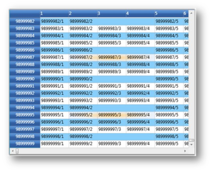

# Virtualization in WPF GridControl

This section covers the below grid virtualization topics:

* Virtual Mode-This section discusses how grid works in a virtual mode
* Virtual Cells-This section discusses about virtual cells in a grid when under virtual mode

## Virtual Mode

Essential Grid for WPF supports virtual mode, which lets you dynamically provide data to the grid by handling an event, QueryCellInfo. This means that the grid does not store any data in its internal data structures. A virtual grid can display millions of rows as easily as it displays a dozen. The grid also exposes a second event, CommitCellInfo that lets you save the changes made in the UI, to the external data source.

### Example

In this example, the Grid Control displays 99,000,000 x 1,000,000 cells (i.e., 99 million rows and 1 million columns). It is also possible to resize millions of rows instantly without any performance hits. The data is loaded only on demand through the QueryCellInfo event and the changes are saved back to the data source by the CommitCellInfo event.



// a really large row and column count.
grid.Model.RowCount = 99000000; // 99 million
grid.Model.ColumnCount = 1000000; // 1 million

//Resize millions of rows instantly - pixel scrolling is updated accordingly.
grid.Model.RowHeights.SetRange(10, 1999999, 28);
grid.Model.RowHeights.SetRange(21111111, 21999999, 36);

// fill cell contents on demand.
grid.Model.QueryCellInfo += new GridQueryCellInfoEventHandler(Model_QueryCellInfo);

// save back cell value into dictionary
grid.Model.CommitCellInfo += new GridCommitCellInfoEventHandler(Model_CommitCellInfo);
Dictionary<RowColumnIndex, object> committedValues = new Dictionary<RowColumnIndex, object>();

void Model_CommitCellInfo(object sender, GridCommitCellInfoEventArgs e)
{

    if (e.Style.HasCellValue)
    {
        committedValues[e.Cell] = e.Style.CellValue;
        e.Handled = true;
    }
}

void Model_QueryCellInfo(object sender, GridQueryCellInfoEventArgs e)
{

    if (e.Cell.RowIndex == 0)
    {
        if (e.Cell.ColumnIndex > 0)
            e.Style.CellValue = e.Cell.ColumnIndex;
    }

        else if (e.Cell.RowIndex > 0)
        {

            if (e.Cell.ColumnIndex == 0)
                e.Style.CellValue = e.Cell.RowIndex;

            else if (e.Cell.ColumnIndex > 0)
            {

                if (committedValues.ContainsKey(e.Cell))
                    e.Style.CellValue = committedValues[e.Cell];

                else
                    e.Style.CellValue = String.Format("{0}/{1}", e.Cell.RowIndex, e.Cell.ColumnIndex);
                }
            }
}



### Output

## Virtual Cells

The Grid control supports virtual cell architecture where the cell contents are drawn statically until a live cell is required. For example, when you move the mouse over the grid, the cells under the mouse pointer needs to handle mouse inputs. Dynamically, the static cells are turned into live cells that can handle those mouse interactions, as required. These live cells stay in scope until they are no longer needed (which is usually when they are scrolled off the screen). Using static drawing for cells, and thus minimizing the need for large numbers of live cells, provides an optimal way to display large data sources very quickly.

### Example

The given cell model and the renderer hosts a virtual cell editor inside the grid cell and this cell type is used or activated only when you move your mouse over any grid cell. By default, a grid cell displays a text that is set in OnRender overridden method. When you move the mouse over this cell, it will become a live UIElement editor and not render the cell anymore. This cell is now a virtual cell that will display the cell value stored in the internal cell structure, say, “Edit Me”.

But, when you scroll the cell outside the view port, it will switch back to a normal renderer cell. When you move the mouse over this cell again, it will display “Edit Me”. 

Placing a UIElement as soon as a cell becomes visible is a time consuming process, while static rendering of a text is faster. The UI element which is required to edit the cell will be placed only on demand (that is when you hover or click a cell for editing). Hence, this approach will greatly improve the scrolling speed.

This mechanism will be enabled only if you set SupportsRenderOptimization property to true in the constructor.



public class VirtualizedCellModel : GridCellModel<VirtualizedCellRenderer>
{
}
public class VirtualizedCellRenderer : GridVirtualizingCellRenderer<TextBox>
{
    public VirtualizedCellRenderer()
    {
        SupportsRenderOptimization = true;
        AllowRecycle = true;
        IsControlTextShown = true;
        IsFocusable = true;
    }
    protected override void OnRender(DrawingContext dc, RenderCellArgs rca, GridRenderStyleInfo cellInfo)
    {

        if (rca.CellUIElements != null)
            return;
        // Only if SupportsRenderOptimization is true, otherwise rca.CellVisuals is never null.
        string s = String.Format("Render{0}/{1}", rca.RowIndex, rca.ColumnIndex);
        GridTextBoxPaint.DrawText(dc, rca.CellRect, s, cellInfo);
    }
    public override void OnInitializeContent(TextBox textBox, GridRenderStyleInfo style)
    {
        base.OnInitializeContent(textBox, style);
        Thickness margins = style.TextMargins.ToThickness();

        // TextBoxView always has a minimum margin of 2 for left and right.
        // Margin is hard coded below so that text box behavior is properly emulated.
        margins.Left = Math.Max(0, margins.Left - 2);
        margins.Right = Math.Max(0, margins.Right - 2);
        textBox.Padding = margins;
        textBox.BorderThickness = new Thickness(0);
        VirtualizingCellsControl.SetWantsMouseInput(textBox, true);
        textBox.Text = GetControlText(style);
    }
    protected override string GetControlTextFromEditorCore(TextBox uiElement)
    {
        return uiElement.Text;
    }
    protected override void OnInitialize()
    {
        base.OnInitialize();
        ControlText = GetControlText(CurrentStyle);
    }
    protected override void OnWireUIElement(TextBox textBox)
    {
        base.OnWireUIElement(textBox);
        textBox.TextChanged += new TextChangedEventHandler(textBox_TextChanged);
    }
    protected override void OnUnwireUIElement(TextBox textBox)
    {
        base.OnUnwireUIElement(textBox);
        textBox.TextChanged -= new TextChangedEventHandler(textBox_TextChanged);
    }
    void textBox_TextChanged(object sender, TextChangedEventArgs e)
    {
        TextBox textBox = (TextBox)sender;
        if (!this.IsInArrange && IsCurrentCell(textBox))
        {
            TraceUtil.TraceCurrentMethodInfo(textBox.Text);

            if (!SetControlText(textBox.Text))
                RefreshContent(); // reverses change.
        }
    }
    protected override void OnGridPreviewTextInput(TextCompositionEventArgs e)
    {
        CurrentCell.ScrollInView();
        CurrentCell.BeginEdit(true);
    }
    protected override bool ShouldGridTryToHandlePreviewKeyDown(KeyEventArgs e)
    {
        if (CurrentCellUIElement.IsFocused && e.Key != Key.Escape)
            return false;
        return true;
    }
}



Here is the code to bind the above virtual cell to the grid:



grid.Model.CellModels.Add("VirtualizedCell", new VirtualizedCellModel());
grid.Model.TableStyle.CellType = "VirtualizedCell";
grid.Model.TableStyle.CellValue = "Edit Me!";



