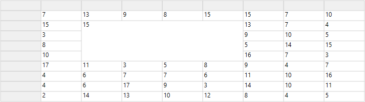
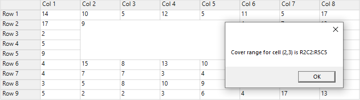
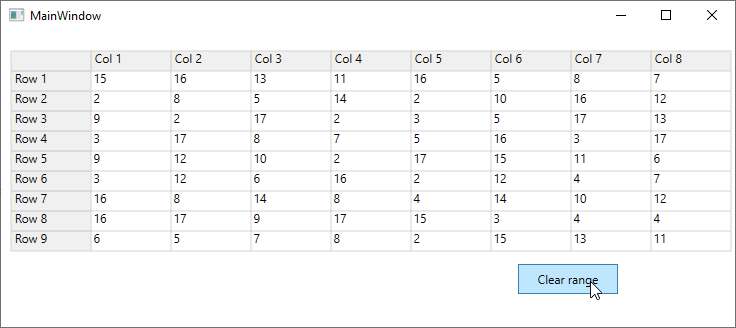
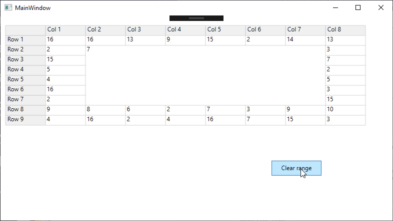

# Covered Ranges in WPF GridControl

This section explains the covered range of cells in WPF GridControl.

## Creating covered cells

The range of cells can be covered by adding the [CoveredCellInfo](https://help.syncfusion.com/cr/wpf/Syncfusion.UI.Xaml.CellGrid.CoveredCellInfo.html) to the [CoveredRanges](https://help.syncfusion.com/cr/wpf/Syncfusion.Windows.Controls.Grid.GridModel.html#Syncfusion_Windows_Controls_Grid_GridModel_CoveredRanges) collection. The `CoveredRanges` will be maintained in the [GridCoveredCellInfoCollection](https://help.syncfusion.com/cr/wpf/Syncfusion.Windows.Controls.Grid.GridCoveredCellInfoCollection.html) collection.





grid.Model.CoveredRanges.Add(new CoveredCellInfo(2, 2, 5, 5));





### Creating covered cells using QueryCoveredRange event

You can also covered the range of cells by using [QueryCoveredRange](https://help.syncfusion.com/cr/wpf/Syncfusion.Windows.Controls.Grid.GridControlBase.html) event. This event will be raised for all the cells and you can set the range of cells by using [Range](https://help.syncfusion.com/cr/wpf/Syncfusion.Windows.Controls.Grid.GridQueryCoveredRangeEventArgs.html#Syncfusion_Windows_Controls_Grid_GridQueryCoveredRangeEventArgs_Range) property.





//Triggering the QueryCoveredRange event
grid.QueryCoveredRange += Grid_QueryCoveredRange;

private void Grid_QueryCoveredRange(object sender, Syncfusion.Windows.Controls.Grid.GridQueryCoveredRangeEventArgs e)
{
    //Checking the cell to start covered range.
    if(e.CellRowColumnIndex.RowIndex == 2 && e.CellRowColumnIndex.ColumnIndex == 2)
    {
        //Set the range to be covered.
        e.Range = new CoveredCellInfo(2, 2, 5, 5);

        //Handled property has to be enabled to perform this customization.
        e.Handled = true;
    }
}





N> [View sample in GitHub](https://github.com/SyncfusionExamples/wpf-gridcontrol-coveredcells)

## Find whether a cell in covered range

When you want to find a cell in covered ranges, you can use the [GetCoveredCell()](https://help.syncfusion.com/cr/wpf/Syncfusion.Windows.Controls.Grid.GridCoveredCellInfoCollection.html#Syncfusion_Windows_Controls_Grid_GridCoveredCellInfoCollection_GetCoveredCell_System_Int32_System_Int32_) method. If the specified cell with row index and column index is inside in `GetCoveredCell`, a range will be returned.





// Adding covered ranges
grid.Model.CoveredRanges.Add(new CoveredCellInfo(2, 2, 5, 5));

//Find the covered ranges
CoveredCellInfo coverRanges = grid.Model.CoveredRanges.GetCoveredCell(2, 3);
MessageBox.Show("Cover range for cell (2,3) is " + "R" + coverRanges.Left + "C" + coverRanges.Top + ":" + "R" + coverRanges.Bottom + "C" + coverRanges.Right);





N> [View sample in GitHub](https://github.com/SyncfusionExamples/wpf-gridcontrol-coveredcells)

## Remove covered range at run time

You can remove the covered range at run time by using [Clear()](https://help.syncfusion.com/cr/wpf/Syncfusion.UI.Xaml.CellGrid.CellSpanInfoCollection-1.html#Syncfusion_UI_Xaml_CellGrid_CellSpanInfoCollection_1_Clear) method.





//Removing the covered range from GridControl.
grid.Model.CoveredRanges.Clear();





For example, If you want to remove the covered range at run time, create one button and set the `Clear()` method for covered range in click event of button.





<Grid>
    <syncfusion:GridControl Name="grid" Margin="10,20,0,0" />
    
    <Button Height="50" Width="100" Margin="400,200,0,0" Click="Button_Click" />
</Grid>





grid.Model.CoveredRanges.Add(new CoveredCellInfo(2, 2, 5, 5));

private void Button_Click(object sender, RoutedEventArgs e)
{
    grid.Model.CoveredRanges.Clear();
    grid.InvalidateCells();
}





The below image provides covered range at run time before removing

The below image provides covered range at run time after removing

N> [View sample in GitHub](https://github.com/SyncfusionExamples/wpf-gridcontrol-coveredcells)

## Extend covered range at run time

You can extend the covered range at run time by using [Add()](https://help.syncfusion.com/cr/wpf/Syncfusion.UI.Xaml.CellGrid.CellSpanInfoCollection-1.html#Syncfusion_UI_Xaml_CellGrid_CellSpanInfoCollection_1_Add__0_) method.

For example, Create one button. Next, clear the current covered cell collection using `Clear()` method and create new covered cell ranges by using `Add()` method in this click event.

N> Before extend the covered cell range, you need to clear the covered range.





//Remove the current covered cell range
grid.Model.CoveredRanges.Clear();
grid.InvalidateCells();

//Add new covered cell range
grid.Model.CoveredRanges.Add(new CoveredCellInfo(2, 2, 7, 7));





The below image provides covered range at run time before extending.

The below image provides covered range at run time after extending.

N> [View sample in GitHub](https://github.com/SyncfusionExamples/wpf-gridcontrol-coveredcells)
