# Getting Started	

This section is designed to help you understand and quickly get started using Essential Grid in your WPF application. Control appearance and structure are defined and the Essential Grid’s relevant classes are depicted.

The following sections comprise the Getting Started section:

## Appearance and Structure of the Grid

EssentialGrid for WPF is a package of powerful grid controls that provides cell-oriented features and acts as an efficient display engine for tabular data that can be customized down to the cell level. It also offers excellent performance characteristics, such as a virtual mode and high-frequency updates, which makes the grid suitable for real-time applications.

The EssentialGrid package is comprised of following three types of grid controls:

* Grid Control
* GridData Control
* GridTree Control

Now, take closer look at the characteristics of each of these controls. 

Grid Control

This is a general-purpose grid that can be used in any form, either holding its own data or virtually bound to an external data source. It acts as a base grid for the other two types of grids (the GridData and GridTree controls). Most features are shared among the three grid types. 

In the Grid control, each cell acts as a single entity, which is suitable for applications such as Excel simulator, where the data in the grid cells are not interrelated and need to be maintained in the specific cells themselves. You can also operate this control in virtual mode, where data is not stored in the grid’s internal data structure but comes from an external source like a data table, for example. In virtual mode, data is dynamically loaded into the grid on demand or when users need to view the data.

{  | markdownify }
{:.image }

GridData Control

The GridData control is designed to be bound with a data source. In the GridData control, each column behaves as a single entity. This grid is more column-centric and can be used to display interrelated tabular data. Unlike the base grid, this grid does not store data values in its data structures; instead, it is connected to an external data source.

For more detailed information about data source connections, refer to the Data Binding section. 

{  | markdownify }
{:.image }

GridTree Control

The GridTree control serves as a multicolumn tree control that is optimized to display thousands of items. This control uses a load-on-demand architecture to quickly generate a tree view. You can toggle the view of the underlying nodes by clicking the plus-minus glyphs of a root node. This control provides complete customization options such as custom level styles, glyphs, node images, and more.

{  | markdownify }
{:.image }

## Class Diagram 

The following illustration depicts the Class Diagram for Essential Grid for WPF.

Control Hierarchy

{  | markdownify }
{:.image }

Model Hierarchy

{  | markdownify }
{:.image }

## Add Essential Grid to an Application

This section serves as a guide on how to deploy EssentialGrid in an application.

### Add the Grid Control to a WPF Application

In this section, you can see how to add the Grid control to a WPF application and load random data. The Grid control can be added to an application through one of the following methods: through a designer or programmatically.

Adding the Grid Control through a Designer

Please follow the steps below to add the Grid control through a designer.

1. Create new WPF application.
2. Open the Designer window.
3. Drag ScrollViewer from the Toolbox and drop it in the Designer window (Since the Grid control doesn’t have a built-in ScrollViewer, to make the grid flow based on data, the grid should be placed inside the ScrollViewer control.

{  | markdownify }
{:.image }

4. Drag GridControl from the Toolbox and drop it inside the ScrollViewer.

{  | markdownify }
{:.image }

5. Once you drag GridControl and drop it in ScrollViewer, the grid control is added to the designer and its dependent assemblies are added to the project.

{  | markdownify }
{:.image }

Programmatically Adding the Grid Control

Instead of adding it through a designer such a Visual Studio, you can add the Grid control programmatically.

1. Create a new WPF application.
2. Add the following Syncfusion assemblies to the project.
1. Syncfusion.Core.dll
2. Syncfusion.Grid.Wpf.dll
3. Syncfusion.GridCommon.Wpf.dll
4. Syncfusion.Shared.Wpf.dll

{  | markdownify }
{:.image }

3. Name the root Grid as layoutRoot in the application’s XAML page.

[XAML]

 &lt;Grid Name="layoutRoot"/&gt;        

4. Create ScrollViewer and GridControl in code. 
5. To add the grid to the view, add GridControl as content of ScrollViewer and then add the ScrollViewer as a child of layoutRoot (Grid).

[C#]

//ScrollViewer defined here

ScrollViewer ScrollViewer = new ScrollViewer();

//GridControl defined here

GridControl gridControl = new GridControl();

//GridControl set as the content of the ScrollViewer

ScrollViewer.Content = gridControl;     

//To bring the Grid control to the view, ScrollViewer should be set as a child of LayoutRoot      

this.layoutRoot.Children.Add(ScrollViewer);           

Populating the Grid control

The Grid control is a cell-based control, so to populate it, RowCount and ColumnCount are mandatory. Once ColumnCount and RowCount are specified, data can be populated by using one of the following methods. 

1. You can populate data by looping through the cells in the Grid control. The following code explains this scenario.

[C#]

//Specifying row and column count

gridControl.Model.RowCount = 100;

gridControl.Model.ColumnCount = 20;

//Looping through the cells and assigning the values based on row and column index

for (int i = 0; i < 100; i++)

{

    for (int j = 0; j < 20; j++)

    {

        gridControl.Model[i, j].CellValue = string.Format("{0}/{1}", i, j);

    }

}

2. You can populate data by handling the QueryCellInfo event of gridControl. This loads the data in and on-demand basis, ensuring optimized performance.

[C#]

//Specifying row and column count

gridControl.Model.RowCount = 100;

gridControl.Model.ColumnCount = 20;

this.gridControl.QueryCellInfo += new Syncfusion.Windows.Controls.Grid.GridQueryCellInfoEventHandler(gridControl_QueryCellInfo);

//Assigning values by handling the QueryCellInfo event

 void gridControl_QueryCellInfo(object sender, Syncfusion.Windows.Controls.Grid.GridQueryCellInfoEventArgs e)

        {

            e.Style.CellValue=string.Format("{0}/{1}", e.Cell.RowIndex, e.Cell.ColumnIndex);

        }   

3. Now, run the application. The grid appears as follows. 

{  | markdownify }
{:.image }

### Add the GridData Control to a WPF Application

This section shows you how to add a GridData control to a WPF application and how to bind data from a database and an IEnumerable Collection to the GridData control. The GridData control can be added to an application through a designer, or it can be added programmatically.

Adding the GridData Control through a Designer 

Please follow the steps below to add the GridData control through a designer such as Visual Studio.

1. Create a new WPF application.
2. Open the designer window.
3. Drag GridDataControl from the Toolbox and drop it in the designer window.

{  | markdownify }
{:.image }

4. Once you’ve dragged GridDataControl to the designer from the Toolbox, it is added to the designer, and its dependent DLLs are added to the project.

{  | markdownify }
{:.image }

Programmatically Adding the GridData Control:

1. Create a new WPF application.
2. Add the following Syncfusion assemblies to the project.
1. Syncfusion.Core.dll
2. Syncfusion.Grid.Wpf.dll
3. Syncfusion.Linq.Base.dll
4. Syncfusion.GridCommon.Wpf.dll
5. Syncfusion.Shared.Wpf.dll

{  | markdownify }
{:.image }

3.  Name the root grid as layoutRoot in the application’s XAML page.

[XAML]

 &lt;Grid Name="layoutRoot"/&gt;        

4. Create a new GridDataControl in code and add it as a child of layoutRoot (Grid). This adds GridDataControl to the view.

[C#]

//GridDataControl defined here

GridDataControl dataGrid = new GridDataControl();

//To bring GridDataControl to the view, it should be added to the children of 

layoutRoot.

layoutRoot.Children.Add(dataGrid); 

Binding a Data Source to the GridData Control

The previous section explained how to add a GridData control to an application. This section explains how to bind a data source with the GridData control after it is added.

The GridData control supports all popular data sources including observable collections, data tables, collection view sources, business objects generated by the ADO.NET Entity Framework, LINQ to SQL or any other ORM.ADO.NET, data views, ICollection views, object data providers, IEnumerable, IList, IBindingList, IQueryable, and ITypedList. 

This section explains how to bind data tables and IEnumerable collections to the GridData control.

Binding Data Tables to the GridData Control

This section explains how to bind a data table from a database to the GridData control.

1. Connect a database to the current application. The database can be connected several ways, such as ADO.NET, LNQ to SQL, classes, etc. In this example, we have directly established a connection to a simple Northwind.sdf database.
2. Once the connection is established, fetch the required data table from the database. Below, a data table has been fetched from the connected Northwind.sdf by using SQL DataAdapter.

> _Note: Check that System.data.SqlServerCe.dll has been added to your project before using this procedure._

[C#]

public class Data

{

   public static DataTable GetDataTable()

   {

      //Connection string 

    using (SqlCeConnection con = new SqlCeConnection(string.Format(@"Data Source = {0}", "C:\\Northwind.sdf")))//Path where .sdf file is placed.

     {

       //Establish the connection

        con.Open();                    

        SqlCeDataAdapter sda = new SqlCeDataAdapter("SELECT * FROM Customers", con);

        DataTable dt = new DataTable();

        sda.Fill(dt);

        return dt;                   

       }

     }

}

3. Now bind the data table as an ItemsSource of GridDataControl, either in XAML or in code.

Binding in XAML

[XAML]

<syncfusion:GridDataControl Name="dataGrid"

                            HorizontalAlignment="Left"

                            VerticalAlignment="Top"

                            ItemsSource="{Binding GDCSource}"/>

 [C#]

public MainWindow()

{

    InitializeComponent();

    this.DataContext = this;

}

public DataTable GDCSource

{

    get

    {

       return Data.GetDataTable();

    }

}

Assigning the Items’ Source in Code

[C#]

public MainWindow()

{

    InitializeComponent();

//ItemsSource set to GridDataControl

    this.dataGrid.ItemsSource = Data.GetDataTable();

}

Once the application runs, the following output is generated.

{  | markdownify }
{:.image }

Samples

To view samples, follow these steps: 

1. Select Start > Programs > Syncfusion > Essential Studio xx.x.x.xx > Dashboard.
2. Click Run Samples for WPF under the User Interface Edition panel.
3. Select GridDataControl.
4. Expand the Data Binding Features item in the Sample Browser.
5. Choose the Data Table Demo sample to launch.

Binding an IEnumerable Collection of GridDataControl

1. Create a collection of objects to bind with the GridData control. In this sample, we have created a collection of objects containing personnel information.

[C#]

 //The following is used to create a simple list collection

public class PersonDetails : List<Person>

    {

        public PersonDetails()

        {

            this.Add(new Person() { CustomerID = "ALKI", CompanyName = "Alfreds Futterkiste", ContactName = "Maria Anders", ContactTitle = "Sales Representative" });

            this.Add(new Person() { CustomerID = "ANATR", CompanyName = "Ana Trujillo Emparedado", ContactName = "Ana Trujillo", ContactTitle = "Owner" });

            this.Add(new Person() { CustomerID = "ANTON", CompanyName = "Antonio Moreno Taqurea", ContactName = "Antonio Moreno", ContactTitle = "Owner" });

            this.Add(new Person() { CustomerID = "ALKI", CompanyName = "Alfreds Futterkiste", ContactName = "Maria Anders", ContactTitle = "Sales Representative" });

            this.Add(new Person() { CustomerID = "AROUT", CompanyName = "Around the Horn", ContactName = "Thomas Hardy", ContactTitle = "Sales Representative" });

            this.Add(new Person() { CustomerID = "BERGS", CompanyName = "Berglunds snabbkop", ContactName = "christinaBerglund", ContactTitle = "Sales Representative" });

            this.Add(new Person() { CustomerID = "BLONP", CompanyName = "Blondel pere et fils", ContactName = "Frederique Citeaux", ContactTitle = "Marketing Manager" });

            this.Add(new Person() { CustomerID = "BOLID", CompanyName = "BOlido Comidas preparad", ContactName = "Martin Sommer", ContactTitle = "Owner" });

            this.Add(new Person() { CustomerID = "BONAP", CompanyName = "Bon app", ContactName = "Laurence Lebihan", ContactTitle = "Owner" });

        }

    }

    public class Person

    {

        public string CustomerID

        { get; set; }

        public string CompanyName

        { get; set; }

        public string ContactName

        { get; set; }

        public string ContactTitle

        { get; set; }

        public string Address

        { get; set; }

        public string City

        { get; set; }

        public string Region

        { get; set; }

    }

2. Bind the collection as item sources of GridDataControl, either in XAML or in code.

Binding in XAML

[XAML]

<syncfusion:GridDataControl 

            Name="dataGrid" 

            AutoPopulateColumns="True" 

            ItemsSource="{Binding GDCSource}"/>

[C#]

public MainWindow()

{

    InitializeComponent();

    this.DataContext = this;

}

private PersonDetails _gdcSource = new PersonDetails();

//This property sets as ItemsSource of GridDataControl

public PersonDetails GDCSource

{

   get

   {

      return _gdcSource;

   }

   set

   {

       _gdcSource = value;

   }

}

Assigning the Items Source in Code 

[C#]

public MainWindow()

{

    InitializeComponent();

    //ItemsSource set to GridDataControl

    this.dataGrid.ItemsSource = this.GDCSource;

}

When the application runs, the following output is generated.

{  | markdownify }
{:.image }

### Add the GridTree Control to a WPF Application

This section demonstrates how to add a GridTree control to a WPF application and how to load the grid with a data source. The GridTree control can be added to an application either through a designer or programmatically.

Adding GridTreeControl through a Designer

Please follow the steps below to add the GridTree control through a designer such as Visual Studio.

1. Create a new WPF application.
2. Open the designer window.
3. Drag GridTreeControl from the Toolbox and drop it in the designer window.

{ 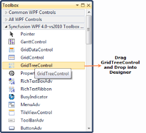 | markdownify }
{:.image }

4. Once GridTreeControl has been dragged to the designer window, the control is added to the designer and its dependent DLLs are added to the project.

{ 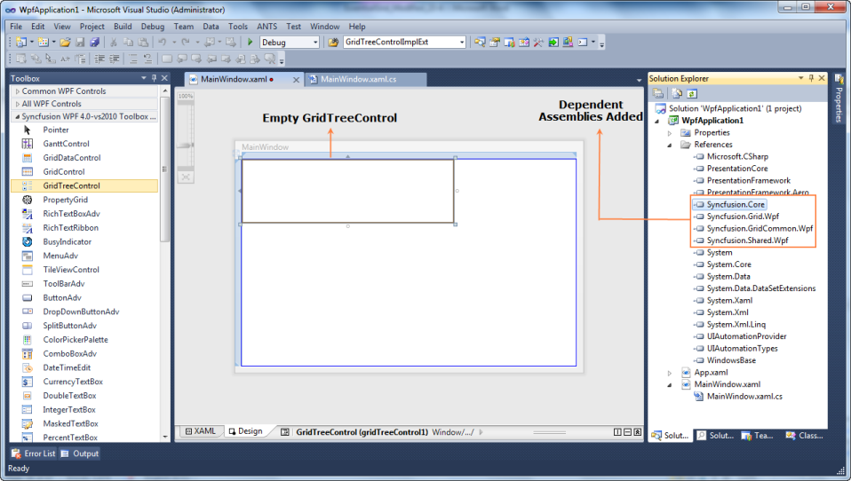 | markdownify }
{:.image }

Programmatically Adding GridTree Control

1. Create a new WPF application.
2. Add the following Syncfusion assemblies to the project.
1. Syncfusion.Core.dll
2. Syncfusion.Grid.Wpf.dll
3. Syncfusion.GridCommon.Wpf.dll
4. Syncfusion.Shared.Wpf.dll

{  | markdownify }
{:.image }

3. Name the root grid as layoutRoot in the application’s XAML page.		

[XAML]

 &lt;Grid Name="layoutRoot"/&gt; 

4. Create a new GridTreeControl in code and add it as a child of layoutRoot (Grid). Now GridTreeControl is added to the view.

[C#]

//GridTreeControl defined here

GridTreeControl treeGrid = new GridTreeControl();

//To bring the GridTreeControl to the view, GridTreeControl should be added to the children of layoutRoot.

layoutRoot.Children.Add(treeGrid);

Data Population in the GridTree Control

The previous section explained how to add the GridTree control to an application. This section explains how to populate data in the GridTree control. There are three approaches to populating data:

* With the RequestTreeItems event.
* By self-relational collection binding.
* Using data-view binding.

The RequestTreeItems Event

The GridTree control can populate data on demand by handling the RequestTreeItems event. GridTreeControl receives the source of root and child nodes through this event handler. This event is triggered when initially loading and expanding nodes.

To populate data using this event, follow these steps:

1. Create a collection of objects to bind with the GridTree control. In this example, a collection of objects containing employee information has been created.

[C#]

public class EmployeesCollection:List<Employee>

    {

        public EmployeesCollection()

        {          

            this.Add(new Employee() { Title = "Management", ReportsTo = -1, ID = 2 });

            this.Add(new Employee() { Title = "Accounts", ReportsTo = -1, ID = 3 });

            this.Add(new Employee() { Title = "Sales", ReportsTo = -1, ID = 4 });            

            //Management

            this.Add(new Employee() { FirstName = "Andrew", LastName = "Fuller",Department = "Management", EmpID = 1001, ID = 9, Salary = 1200000, ReportsTo = 2, Title = "Vice President" });

            this.Add(new Employee() { FirstName = "Janet", LastName = "Leverling", Department = "Management", EmpID = 1002, ID = 10, Salary = 1000000, ReportsTo = 2, Title = "GM" });           

            //Accounts

            this.Add(new Employee() { FirstName = "Nancy", LastName = "Davolio",Department = "Accounts", EmpID = 1004, ID = 12,  Salary = 850000, ReportsTo = 3, Title = "Accounts Manager" });

            this.Add(new Employee() { FirstName = "Margaret", LastName = "Peacock", Department = "Accounts", EmpID = 1008, ID = 13, Salary = 700000, ReportsTo = 3, Title = "Accountant" });

            //Sales

            this.Add(new Employee() { FirstName = "Laura", LastName = "Callahan", Department = "Sales", EmpID = 1005, ID = 16, Salary = 900000, ReportsTo = 4, Title = "Sales Manager" });

            this.Add(new Employee() { FirstName = "Anne", LastName = "Dodsworth",  Department = "Sales", EmpID = 1011, ID = 17, Salary = 800000, ReportsTo = 4, Title = "Sales Representative" });                  

        }

    }

    public class Employee

    {

        int id;       

        public int ID

        {

            get { return id; }

            set { id = value; }

        }

        int? empId;

        public int? EmpID

        {

            get { return empId; }

            set { empId = value; }

        }

        string firstName;

        public string FirstName

        {

            get { return firstName; }

            set { firstName = value; }

        }

        string lastName;

        public string LastName

        {

            get { return lastName; }

            set { lastName = value; }

        }

        string department;

        public string Department

        {

            get { return department; }

            set { department = value; }

        }

        private string title;

        public string Title

        {

            get { return title; }

            set { title = value; }

        }

        double? salary;

        public double? Salary

        {

            get { return salary; }

            set { salary = value; }

        }

        int reportsTo;        

        public int ReportsTo

        {

            get { return reportsTo; }

            set { reportsTo = value; }

        }       

    }

2.  The RequestTreeItems event can hook in either XAML or code.

Hooking RequestTreeItems Event in XAML

[XAML] 

<syncfusion:GridTreeControl Name="treeGrid" 

   RequestTreeItems="treeGrid_RequestTreeItems" 

   EnableNodeSelection="False"  

   AutoPopulateColumns="True"  

   PercentSizingBehavior="SizeUntouchedColumns" >  

Hooking RequestTreeItems Event in Code

[C#] 

this.treeGrid.RequestTreeItems+=new GridTreeRequestTreeItemsHandler(treeGrid_RequestTreeItems);

3. Handle the RequestTreeItems event to pass the source to the root and child nodes dynamically.

[C#]

EmployeesCollection employees;

public MainWindow()

{

  InitializeComponent();         

  this.gridTreeControl1.RequestTreeItems += new Syncfusion.Windows.Controls.Grid.GridTreeRequestTreeItemsHandler(treeGrid_RequestTreeItems);

  employees = new EmployeesCollection();          

}

private void treeGrid_RequestTreeItems(object sender, GridTreeRequestTreeItemsEventArgs args)

{

    //When ParentItem is null, you need to set args.ChildList to be the root items

    if (args.ParentItem == null)

    {

        //Get the root list-get all employees who have no boss 

        //Get all employees whose boss' id is -1 (no boss)

        args.ChildList = employees.Where(x => x.ReportsTo == -1);

    }

    else //If ParentItem not null, then set args.ChildList to the child items for the given ParentItem.

    {   //Get the children of the parent object

        Employee emp = args.ParentItem as Employee;

        if (emp != null)

        {

            //Get all employees that report to the parent employee

            args.ChildList = employees.Where(x => x.ReportsTo == emp.ID);

        }

    }

} 

When the application runs, the following output is generated.

{  | markdownify }
{:.image }

Samples

To view samples: 

1. Select Start > Programs > Syncfusion > Essential Studio xx.x.x.xx > Dashboard.
2. Click Run Samples for WPF under the User Interface Edition panel.
3. Select GridTreeControl.
4. Expand the Data Population Features item in the Sample Browser.
5. Select On-Demand Loading Demo to launch the sample.

Binding a Self-Relational Collection to the GridTree Control

A self-relational collection is a collection of objects in which each object has a hierarchy within. Each object acts as a parent and hold its children in an attribute. Each child acts as the next-level parent and holds children in an attribute, and so on. In this example, both child and parent are of the same type (data type/object type). Specifying the child attribute name in ChildPropertyName of GridTreeControl automatically fetches the hierarchy and populate it.

1. Create a self-relational collection of objects to bind with the GridTree control. In this example, we have created a collection of objects containing employee information.

[C#]

 //This code is used to create a list collection of hierarchical data

 public class EmployeeDetails : List<Employee>

    {

        public EmployeeDetails()

        {        

            //Management

 //The child list is the ChildCollection of the node

            List<Employee> childList = new List<Employee>();

            childList.Add(new Employee() { FirstName = "Andrew", LastName = "Fuller", Department = "Management", EmpID = 1001, ID = 9, Salary = 1200000, ReportsTo = 2, Title = "Vice President" });

            childList.Add(new Employee() { FirstName = "Janet", LastName = "Leverling", Department = "Management", EmpID = 1002, ID = 10, Salary = 1000000, ReportsTo = 2, Title = "GM" });

            childList.Add(new Employee() { FirstName = "Steven", LastName = "Buchanan", Department = "Management", EmpID = 1003, ID = 11, Salary = 900000, ReportsTo = 2, Title = "Manager" });

            this.Add(new Employee() { Title = "Management", ReportsTo = 1, ID = 2, Child = childList });

            //Accounts

            childList = new List<Employee>();

            childList.Add(new Employee() { FirstName = "Nancy", LastName = "Davolio", Department = "Accounts", EmpID = 1004, ID = 12, Salary = 850000, ReportsTo = 3, Title = "Accounts Manager" });

            childList.Add(new Employee() { FirstName = "Margaret", LastName = "Peacock", Department = "Accounts", EmpID = 1008, ID = 13, Salary = 700000, ReportsTo = 3, Title = "Accountant" });

            childList.Add(new Employee() { FirstName = "Michael", LastName = "Suyama", Department = "Accounts", EmpID = 1009, ID = 14, Salary = 700000, ReportsTo = 3, Title = "Accountant" });

            childList.Add(new Employee() { FirstName = "Robert", LastName = "King", Department = "Accounts", EmpID = 1010, ID = 15, Salary = 650000, ReportsTo = 3, Title = "Accountant" });

            this.Add(new Employee() { Title = "Accounts", ReportsTo = 1, ID = 3, Child=childList });

        }

    }

    public class Employee

    {

        int id;

        public int ID

        {

            get { return id; }

            set { id = value; }

        }

        int? empId;

        public int? EmpID

        {

            get { return empId; }

            set { empId = value; }

        }

        string firstName;

        public string FirstName

        {

            get { return firstName; }

            set { firstName = value; }

        }

        string lastName;

        public string LastName

        {

            get { return lastName; }

            set { lastName = value; }

        }

        string department;

        public string Department

        {

            get { return department; }

            set { department = value; }

        }

        private string title;

        public string Title

        {

            get { return title; }

            set { title = value; }

        }

        double? salary;

        public double? Salary

        {

            get { return salary; }

            set { salary = value; }

        }

        int reportsTo;

        public int ReportsTo

        {

            get { return reportsTo; }

            set { reportsTo = value; }

        }

        public List<Employee> Child

        {

            get;

            set;

        } 

    }

2. Bind ItemsSource of GridTreeControl and assign ChilPropertyName—these can be set in either XAML or code.

Binding in XAML

[XAML]

<syncfusion:GridTreeControl 

       Name="treeGrid" 

       AutoPopulateColumns="True" 

       ExpandStateAtStartUp="AllNodesExpanded" 

       ChildPropertyName="Child" 

       ItemsSource="{Binding GTCSource}"/>

[C#]

public MainWindow()

{

   InitializeComponent();   

   this.DataContext = this;

   _gtcSource = new EmployeeDetails();

}

 //This property is set as ItemsSource of GridTreeControl

private EmployeeDetails _gtcSource;

public EmployeeDetails GTCSource

{

   get

   {

       return _gtcSource;

   }

   set

   {

        _gtcSource = value;

   }

}

Assigning Items’ Source Code 

[C#]

public MainWindow()

{

    InitializeComponent();    

    //ItemsSource set to GridTreeControl

    this.treeGrid.ItemsSource = new EmployeeDetails();

}

When the application runs, the following output is generated.

{  | markdownify }
{:.image }

Samples

To view samples: 

1. Select Start > Programs > Syncfusion > Essential Studio xx.x.x.xx > Dashboard.
2. Click Run Samples for WPF under User Interface Edition panel.
3. Select GridTreeControl.
4. Expand the Data Population Features item in the Sample Browser.
5. Select Self-Relational Data Binding Demo to launch the sample.

Binding a Data View to the GridTree Control

The following steps explain how to bind a data view from a database to the GridTree control.

1. Connect a database to the current application. The database can be connected several ways, such as ADO.NET, LINQ to SQL, classes, and so on. In this example, a connection has been directly established to a simple northwind.sdf database.
2. Once the connection is established, fetch the required data table from the database. In this example, the data table has been fetched from the northwind.sdf by using SQL DataAdapter.

> _Note: Before using this procedure, check that System.data.SqlServerCe.dll has been added to your project._

[C#] 

// Connect to a data table

public DataTable GetDataTable()

{

   DataSet ds = new DataSet();            

   if (!LayoutControl.IsInDesignMode)

   {

     using (SqlCeConnection con = new SqlCeConnection(connectionString))

     {

        con.Open();

        SqlCeDataAdapter sda = new SqlCeDataAdapter("SELECT * FROM Employees", con);    

         sda.Fill(ds, "Employee");

     }  

//The following line is used to create the hierarchical relations

     ds.Relations.Add(new DataRelation("Employee_Relation", ds.Tables["Employee"].Columns["Employee ID"], ds.Tables["Employee"].Columns["Reports To"],false));

   }

   if (ds.Tables.Count > 0)

     return ds.Tables[0];

   else

     return null;

}

3. Now bind the data table as an ItemsSource of GridTreeControl in either XAML or code.

Binding in XAML

[XAML]

<syncfusion:GridTreeControl Name="treeGrid" 

                            AutoPopulateColumns="True"

                            ItemsSource="{Binding GTCSource}" 

                            ExpandStateAtStartUp="AllNodesExpanded" 

                            ChildPropertyName="Employee_Relation" />

[C#]

public MainWindow()

{

   InitializeComponent();           

   this.DataContext = this;

   dataTable = GetDataTable();

}

DataTable dataTable;

public DataView GTCSource

{

   get

   {

     if (dataTable == null)

       return null;

     DataView dataView = new DataView(dataTable);

     //RowFilter is applied to form the hierarchy

     dataView.RowFilter = "[Reports To] Is NULL";

     return dataView;            

   }

}

 Assigning the Items’ Source in Code 

[C#]

public MainWindow()

{

    InitializeComponent();

    //Relation name set as ChildPropertyName

    this.treeGrid.ChildPropertyName = "Employee_Relation";

    dataTable = GetDataTable();    

    //ItemsSource set to GridTreeControl

    this.treeGrid.ItemsSource = GTCSource;

}

DataTable dataTable;

public DataView GTCSource

{

   get

   {

     if (dataTable == null)

       return null;

     DataView dataView = new DataView(dataTable);

     dataView.RowFilter = "[Reports To] Is NULL";

     return dataView;

     }

}

When the application runs, the following output is generated.

{  | markdownify }
{:.image }

Sample

To view samples: 

1. Select Start > Programs > Syncfusion > Essential Studio xx.x.x.xx > Dashboard.
2. Click Run Samples for WPF under User Interface Edition panel.
3. Select GridTreeControl.
4. Expand the Data Population Features item in the Sample Browser.
5. Select Data View Binding Demo to launch the sample.
## GridData Control

The GridData control is specifically designed for the scenarios, where you need to bound the grid to an external data source and customize the data view by performing the operations such as grouping, sorting, summarizing, filtering, conditional formats and unbound fields. It attains the fundamental features by deriving from the GridControlBaseclass and hence adapts most of the features of Grid control, which are discussed in the previous sections. It can display nested grids with hierarchical data and can also display multiple unrelated tables in one grid.

Major Control Classes

* GridDataControl (GDC) is the main control class of this control. It is templated with GridDataControlBaseImpl class thatis based on GridControlBase class. GDC exposes numerous properties and methods that are available for the end-user to setup the grid in the desired manner.
* The GridDataTableModelserves as the model class for GDC. It stores all the data information of the grid and provides methods to completely initialize the grid.  It also provides methods to attach the grid later to the GDC, for rendering.
* The GridDataTableProperties defines property values for the Grid Table that lets you customize the appearance and behavior of the GDC.
* As a data bound grid, GDC displays tabular data where each row corresponds to a data record and every column stands for data field of the data source. You wrap all the columns in a group together and manipulate them. The GridDataVisibleColumn class is used for this purpose. It groups the columns that are visible in the screen and holds information about each column.
* The GridDataStyleInfo class, which is derived from GridStyleInfo, provides user-friendly access to all the cell level properties that control the appearance of the cell. It holds all the information  of the cell.
* GridDataTable provides the virtual representation of the entity set and manages all the underlying records in the data source.
* GridDataGroupDropAreaGridImpl is the class that defines the group drop area for a GDC. It displays a panel on the top of the GDC, where the user can drag-and-drop any column header in order to group the grid against that column. GridDataGroupDropAreaModel is the model class for this purpose.

> _Note: There are several other classes that assist the user in creating groups, summaries, filters, sorted columns, etc._

The following sections elaborate the properties of the GridData control:

* Data Binding-Elaborates on the data binding concept in GDC
* Data Presentation-Discusses different data presentation techniques
* Events- Events that are handled in GDC are discusses here
* Look and Feel-Different appearance settings are elaborated here
* Exporting GDC to Excel-Discusses the steps to export a GDC into the Excel
* Performance-High performance of the Grid with large amount of data is discussed in this section
* Real Time Application-Illustrates how to employ the grid in portfolio applications
### Data Model

This section has the following topics:

#### ICollectionViewAdv

The ICollectionViewAdv interface is an extended ICollectionView interface that includes support for the following:

* Grouping structure—Binary tree data structure to maintain the groups.
* Group summaries—Collection to specify group summaries.
* Caption summary—Specifies caption summary row.
* Records structure—Flat data structure to maintain the list of internal records.
* Table summaries—Collection to specify table summaries.
* Filter definitions—Collection to specify filter descriptors.

ICollectionViewAdv interface implements the following:

{  | markdownify }
{:.image }

ICollectionViewAdv is implemented as two parts in Syncfusion.Linq.Base library, as shown below:

{ 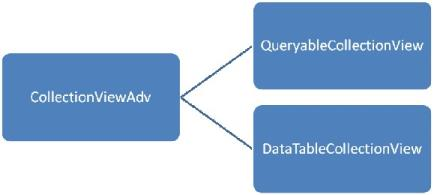 | markdownify }
{:.image }

The CollectionViewAdv is an abstract class implementing ICollectionViewAdv. By sub-classing the CollectionViewAdv, the specific actions for the following can be defined:

* Sorting
* Filtering
* Grouping
* Summaries

QueryableCollectionView - Implements an IQueryable way to provide Sorting, Filtering, Grouping and Summaries.

DataTableCollectionView – Uses the DataView to provide Sorting/Filtering and uses custom logics to implement grouping and calculating summaries.

##### Grouping in ICollectionViewAdv

To specify groups, add GroupDescriptions to ICollectionViewAdv.GroupDescriptions. The following code example shows adding groups to Northwind database.

[C#]

var northwind = new Northwind("Data Source = Northwind.sdf");

var orders = northwind.Orders;

var queryableCollectionView = new QueryableCollectionView(orders);

queryableCollectionView.GroupDescriptions.Add(new PropertyGroupDescription("ShipCountry"));

queryableCollectionView.GroupDescriptions.Add(new PropertyGroupDescription("ShipCity"));

The grouping values are stored in a binary tree structure in the ICollectionViewAdv.TopLevelGroup. The visual graph of the TopLevelGroup is as follows:

{  | markdownify }
{:.image }

The class diagram for the structure above is as follows:

{  | markdownify }
{:.image }

* NodeEntry – It is the base class for all the nodes in the binary tree.
* GroupEntry – Contains a list of groups. 
* GroupRecordEntry – Contains a list of records.
* Group – Extended Group entry that has implementation for populating and structuring the groups and its sub- groups. It can store both a list of Groups or Records. If the Group is a BottomLevelGroup then the Group.Details would contain the GroupRecordEntry.

Iterating through the whole structure

The TopLevelGroup is an extended Group class. Iteration through the whole structure can be performed by looping through the structure using a foreach loop, since the Group already has an Enumerator implemented.

[C#]

var northwind = new Northwind("Data Source = Northwind.sdf");

var orders = northwind.Orders;

var queryableCollectionView = new QueryableCollectionView(orders);

queryableCollectionView.GroupDescriptions.Add(new PropertyGroupDescription("ShipCountry"));

foreach (var nodeEntry in queryableCollectionView.TopLevelGroup)

{

    Console.WriteLine(nodeEntry);

}

##### Summaries in Grouping

The ICollectionViewAdv interface exposes an ObservableCollection<ISummaryRow> and CaptionSummary.

{  | markdownify }
{:.image }

Any class implementing this interface should be able to interact with the TopLevelGroup for specifying summaries. 

> _Note: The ICollectionViewAdv interface was made as an interface since the WPF properties had to be DependencyProperties to enable binding in XAML. With ICollectionViewAdv, we can specify two kinds of summaries:_

* Group summaries.
* Caption summary.

Group Summaries

Specifies summaries added for each bottom level group. Access each summary node from GridRecordEntry.Summaries.

Caption Summary

Specifies a caption summary row required by an UI control to display the group caption. Access the caption summary as Group.SummaryRecordEntry.

##### Sorting in ICollectionViewAdv

Adding SortDescriptions to the ICollectionView would sort the internal data.

[C#]

var orders = northwind.Orders;

var queryableCollectionView = new QueryableCollectionView(orders);

queryableCollectionView.SortDescriptions.Add(new System.ComponentModel.SortDescription("CustomerID", System.ComponentModel.ListSortDirection.Descending));

foreach (var record in queryableCollectionView.Records)

{

    var order = (Orders)record.Data;

    Console.WriteLine("OrderID - {0} / CustomerID - {1}", order.OrderID, order.CustomerID);

}

Sorting with Grouping

The TopLevelGroup works in conjunction with the sort descriptions present in the ICollectionView. It would automatically sort the groups and its bottom level group (records).

[C#]

var orders = northwind.Orders;

var queryableCollectionView = new QueryableCollectionView(orders);

queryableCollectionView.SortDescriptions.Add(new System.ComponentModel.SortDescription("CustomerID", System.ComponentModel.ListSortDirection.Descending));

queryableCollectionView.GroupDescriptions.Add(new PropertyGroupDescription("ShipCountry"));

queryableCollectionView.GroupDescriptions.Add(new PropertyGroupDescription("ShipCity"));

foreach (var nodeEntry in queryableCollectionView.TopLevelGroup)

{

    Console.WriteLine(nodeEntry);

}

foreach (var record in queryableCollectionView.Records)

{

    var order = (Orders)record.Data;

    Console.WriteLine("OrderID - {0} / CustomerID - {1}", order.OrderID, order.CustomerID);

}

> _Note: When applying sorting with grouping, both the ICollectionViewAdv.TopLevelGroup and the ICollectionViewAdv.Records is in sync._

### Data Binding

Data binding is the master feature of the GridData control. Grid must be bound to an external data source to display the data. GDC supports the following data sources such as, Data Tables, Data Sets or Custom collections of type List, Binding List, Observable Collection or Collection View Source. These data source can have multiple nested tables that is displayed hierarchically by the grouping grid. 

Data Binding mechanisms

Following are the data binding mechanisms:

* Using Data Providers-Object Data Provider,  XML Data Provider and usage of Data Context
* Using ADO.NET Data-Data Table,  Data Set  and Data Row
* Using Business Objects-List, Binding List, Observable Collection, Collection View Source
* XAML Binding-Elaborates on data binding using XAML code
* Notify Property Changes-Elaborates on notifying the underlying data source changes to the grid
* Data Error Validation-Discusses on the support to validate the grid data and display error information
* Synchronize Current Selection-Discusses about synchronization of changes in the current with another control
* Unbound Columns-Discusses on the addition of unbound columns to the grid

Important Data Binding Properties

The following table contains some data binding properties and their corresponding descriptions:

_Property_

<table>
<tr>
<td>
Property</td><td>
Description</td></tr>
<tr>
<td>
DataContext</td><td>
Gets or sets the data context for binding. It simplifies the data binding. </td></tr>
<tr>
<td>
ItemsSource</td><td>
Binds the grid to a collection object.</td></tr>
<tr>
<td>
AutoPopulateColumns</td><td>
When set to true, it extracts the column from the data set and populates the Grid automatically.</td></tr>
<tr>
<td>
AutoPopulateRelations</td><td>
When set to true, it extracts the relation from the data set and populates the Grid automatically.</td></tr>
<tr>
<td>
AutoGenerateColumnsInfo</td><td>
When set to true, this property assigns the cell editor to the column depending on the content. For example, some types and its corresponding cell types are listed below:String – Text BoxBool – CheckboxUri – HyperlinkDouble – DoubleEditDatetime – DateTimeEditEnums – ComboBoxTimespan – TimeSpanEdit</td></tr>
</table>
#### Data Providers

An ObjectDataProvider is a class which creates an object that you can use as a binding source. The GridData control supports this class (offered by WPF platform) that creates an object in the XAML code and can be used for data binding. The ObjectDataProvider allows you to specify binding expressions against an object and its methods. You can also write custom data providers, if required.

Example 

Here is an example that illustrates how to use Object Data Provider with GDC. 

Say, your data source is defined in C# class named Order, and it queries the records from Northwind Orders table. Then the respective Object Data Provider definition is given by the code below: 

> _Note: The ObjectType attribute of ObjectDataProvider should point to the data source you defined._ 

[XAML]

&lt;Window.Resources&gt;        

&lt;ObjectDataProvider x:Key="order" ObjectType="{x:Type local:Order}" &lt;/Window.Resources&gt;

&lt;syncfusion:GridDataControl x:Name="dataGrid" AutoPopulateColumns="True"    AutoPopulateRelations="False" ItemsSource="{StaticResource order}" &gt;

> 

> _Note: The following line in the above code references the Object (Order), which returns the data for binding._

[XAML]

<ObjectDataProvider x:Key="order" ObjectType="{x:Type local:Order}"

Defining the Order Class

The Order class returns the data to be bound to the Grid as shown in the following code:

[C#]

public class Order : ObservableCollection<Orders>

{        

  Northwind northWind;

  public Order()        

  {            

    string connectionString = string.Format(@"Data Source = {0}", "Northwind.sdf"));            

    northWind = new Northwind(connectionString);            

    var order = northWind.Orders;            

    foreach (var o in order)            

    {                

      this.Add(o);            

    }        

  }    

}

The following screenshot shows a GDC which bound with an Object data using the Object Data Provider.

{  | markdownify }
{:.image }

The GDC is bound with a data source provided by an object.

#### Database Data

ADO.NET is an object-oriented set of libraries that allows you to interact with different types of data sources and different types of databases. It is used by data-oriented applications for connecting to the data sources and manipulating data. It owns a set of data providers that retrieves data from the underlying sources and place it in an ADO.NET DataSet object. The DataSet object, which holds a collection of ADO.NET DataTable objects (represents the tables of data source), is created to populate a data-aware control like the grid with database data. These DataSet objects can operate independent of the .NET data providers. 

Here is an example that illustrates the binding of ADO.NET Data Table with the GridData control.

Code that Sets Up a DataTable

[C#]

public class Data

{

        public static DataTable

 GetDataTable()

        {

            using (SqlCeConnection con = new SqlCeConnection(string.Format(@"Data Source = {0}", LayoutControl.FindFile("Northwind.sdf"))))

            {

                con.Open();

                SqlCeDataAdapter sda = new SqlCeDataAdapter("SELECT * FROM Customers", con);

                DataSet ds = new DataSet();

                sda.Fill(ds);

                return ds.Tables[0];

            }

            return new DataTable();

        }

}

Code to Bind the Above DataTable to GDC.

[XAML]

&lt;Window.Resources&gt;

        &lt;ObjectDataProvider x:Key="CustomerTable" MethodName="GetDataTable" ObjectType="{x:Type local:Data}" /&gt;

        &lt;CollectionViewSource x:Key="orderSource" Source="{StaticResource CustomerTable}" &gt;

        &lt;/CollectionViewSource&gt;

    &lt;/Window.Resources&gt;

&lt;syncfusion:GridDataControl x:Name="dataGrid" AutoPopulateColumns="True" AutoPopulateRelations="False" ShowAddNewRow="False" ItemsSource="{StaticResource orderSource}"&gt;            

&lt;/syncfusion:GridDataControl&gt;

{  | markdownify }
{:.image }

The GDC is bound with a data source provided by Data Table.

#### Business Objects

The grid can be bound to user-defined collections that let you store arbitrary objects in a structured fashion.  The data binding is based on a set of interfaces that differ in the context of accessing and navigating through data and of course manipulating the data. These interfaces set up a two-way communication between the bound grid and the objects collection used by the same grid. Such object collections are called as custom business collections.

The data binding interfaces allow you to create collection of custom objects where you want to present those collection of objects together, through the grid. You can also navigate through the objects to view them through the same grid and interact with them. Some of these interfaces are IList, IBindingList, and so on. For ease of use, .NET provides built-in, ready-to-use collection classes that internally implements these collection interfaces. 

Some of the collection classes are as follows:

* List that implements IList 
* BindingList that implements IBindingList 
* ObservableCollection.

Of the above classes, the ObservableCollection is widely preferred as it is more user-friendly to use in a WPF application, and can be easily created by using XAML.  

Let us see an example usage of this collection class with our GridData control.

Example

Defining Observable Collection

[C#]

public class Customer : ObservableCollection<Customers>

{        

Northwind northWind;        

public Customer()        

{            

string connectionString = string.Format(@"Data Source = {0}", Northwind.sdf");            

northWind = new Northwind(connectionString);            

var customer = northWind.Customers.Skip(0).Take(100).ToList();            

foreach (var o in customer)            

{                

this.Add(o);            

}        

}    

}

Binding the Above Collection to GDC.

[XAML]

&lt;Window.Resources&gt;        

&lt;ObjectDataProvider x:Key="customer" ObjectType="{x:Type local:Customer}" /&gt;

&lt;/Window.Resources&gt;

&lt;syncfusion:GridDataControl x:Name="grid"  AutoPopulateColumns="True"    AutoPopulateRelations="False" ItemsSource="{StaticResource customer}"&gt;            

&lt;/syncfusion:GridDataControl&gt;

The following image shows a Grid bound with an Observable collection.

{  | markdownify }
{:.image }

The GDC is bound with a data source provided by Observable Collection.

Collection View Source

The CollectionViewSource[CVS] serves as a wrapper for the custom collections. It acts as a filter between the source collection (ObservableCollection or List or BindingList) and the grid. Once your grid is bound to CollectionViewSource-driven source list, the CVS manages all the data related operations such as grouping, sorting, filtering and so on. This relieves you of writing custom code for these operations. CVS does this by internally implementing the ICollectionView interface that understands the source type and manages the data operations. It also implements INotifyCollectionChanged interface. This means that if CVS is linked to a source collection (ObservableCollection), then all the updates to the source list is transmitted to the grid.

Example

Let us see an example usage of this Collection View Source with our GDC.

[XAML]

&lt;Window.Resources&gt;        

&lt;ObjectDataProvider x:Key="customer" ObjectType="{x:Type local:Customer}" /&gt;        

&lt;CollectionViewSource x:Key="customerSource" Source="{StaticResource customer}" &gt;        

&lt;/CollectionViewSource&gt;    

&lt;/Window.Resources&gt;

&lt;syncfusion:GridDataControl x:Name="grid"  AutoPopulateColumns="True"    AutoPopulateRelations="False" ItemsSource="{StaticResource customerSource}"&gt;            

&lt;/syncfusion:GridDataControl&gt;

Defining the Source Collection

[C#]

public class Customer : ObservableCollection<Customers>    

{        

Northwind northWind;        

public Customer()        

{            

string connectionString = string.Format(@"Data Source = {0}", "Northwind.sdf");            

northWind = new Northwind(connectionString);            

var customer = northWind.Customers.Skip(0).Take(100).ToList();            

foreach (var o in customer)            

{                

this.Add(o);            

}        

}    

}

The following image shows the output of the above given code:

{  | markdownify }
{:.image }

The GDC is bound with a data source provided by Collection View Source.

Entity Collection

GridDataControl confirms that it is an EntityFramework-aware control by providing support to EF-driven data sources. The EF model offers several architectural benefits that can be experienced in the networking applications.

To bind your grid to an EF-driven data source, use the below code.

[C#]

string connectionString = string.Format(@"Data Source = {0}", LayoutControl.FindFile("NorthwindGrid.sdf"));            

EntityConnectionStringBuilder entityBuilder = new EntityConnectionStringBuilder();            

entityBuilder.Metadata = "res://*/NorthWind.csdl|res://*/NorthWind.ssdl|res://*/NorthWind.msl";            

entityBuilder.Provider = "System.Data.SqlServerCe.3.5";            

entityBuilder.ProviderConnectionString = connectionString;

NorthWind northwind = new NorthWind(entityBuilder.ToString());            

this.gridDataControl1.ItemsSource = northwind.Orders;

{  | markdownify }
{:.image }

#### XAML Binding

Essential Grid allows you to specify the data source in XAML. XAML binding can be established with the help of Binding class, which provides high level access to the definition of binding to connect the properties of the target binding object to any data source. The specification of a binding in XAML is referred to as Binding Expression. Each binding typically has four components:

* Target object-It corresponds to GridDataControl object
* Target Property-It corresponds to GridDataControl.ItemsSource property
* Binding Source-It can be  a list object, a UI element  or an object data provider
* Path-It specifies a value in the binding source to be used

Binding Modes

The Binding class also provides you with various modes that let you control how source and target objects of the binding can update each other. Following are the different modes of binding:

* OneWay-Updates the target property only when the source property changes
* TwoWay-Updates the target property when the source property changes and vice versa
* OneTime-Updates the target property only when the application starts or when the Data Context undergoes a change
* OneWayToSource-Updates the source property when the target property changes

Example

Following is a simple XAML binding code that specifies a data source for the grid. It binds the GridDataControl.ItemsSource property to a CollectionViewSource object, which in turn points to an ObservableCollection.

1. Code behind to Create an Observable Collection

[C#]

public class Customer : ObservableCollection<Customers>

{

        Northwind northWind;

        public Customer()

        {

            string connectionString = string.Format(@"Data Source = {0}", LayoutControl.FindFile("Northwind.sdf"));

            northWind = new Northwind(connectionString);

            var customer = northWind.Customers.Skip(0).Take(100).ToList();

            foreach (var o in customer)

            {

                this.Add(o);

            }

        }

}

2. Data Source Definition

[XAML]

&lt;Window.Resources&gt;

        &lt;ObjectDataProvider x:Key="customer" ObjectType="{x:Type local:Customer}" /&gt;

        &lt;CollectionViewSource x:Key="customerSource" Source="{StaticResource customer}" &gt;

        &lt;/CollectionViewSource&gt;

&lt;/Window.Resources&gt;

3. XAML Binding

[XAML]

<syncfusion:GridDataControl x:Name="grid"  AutoPopulateColumns="True"    AutoPopulateRelations="False" 

                                         ItemsSource="{Binding Source={StaticResource customerSource}}">

&lt;/syncfusion:GridDataControl&gt;

The following image shows the output of the above given code:

{  | markdownify }
{:.image }

The GDC is bound with data using XAML code.

#### Complex Property Binding

GridData control provides support to bind to complex properties through the Complex Property Binding feature. A Complex Property is one that contains multiple values, for example, an object of type "size" which contains two values – Width and Height, is represented as one property. Such complex properties are displayed in grid columns in the "Property.Member" format. For Size property, for example, the grid populates two columns namely, "Size.Width" and "Size.Height".

Complex Property Binding feature is useful when the user has nested data, i.e., when data of one table is mapped to another table.

Example

You can bind data columns from multiple data tables which are inter-related to the same grid. The following code example illustrates how to bind 'OrderID' and 'CustomerID' columns from the 'Orders' table, and 'CompanyName' and 'ContactTitle' columns from the 'Customers' table.

[XAML]

&lt;syncfusion:GridDataControl.VisibleColumns&gt;

    &lt;syncfusion:GridDataVisibleColumn MappingName="OrderID" HeaderText="Order ID"&gt;

    &lt;/syncfusion:GridDataVisibleColumn&gt;

    &lt;syncfusion:GridDataVisibleColumn MappingName="CustomerID" HeaderText="Customer ID"&gt;

    &lt;/syncfusion:GridDataVisibleColumn&gt;

    &lt;syncfusion:GridDataVisibleColumn MappingName="Customers.CompanyName" HeaderText="Customers.CompanyName"/&gt;

    &lt;syncfusion:GridDataVisibleColumn MappingName="Customers.ContactTitle" HeaderText="Customers.ContactTitle"/&gt;

&lt;/syncfusion:GridDataControl.VisibleColumns&gt;

{  | markdownify }
{:.image }

{  | markdownify }
{:.image }

You can also apply grouping, sorting, filtering, summaries and conditional formats to these complex property bound columns. The following code example illustrates this.

[XAML]

// Applying Conditional Formats.

&lt;syncfusion:GridDataControl.ConditionalFormats&gt;

    &lt;syncfusion:GridDataConditionalFormat Name="C1" ApplyStyleToColumn="Customers.ContactTitle"&gt;

        &lt;syncfusion:GridDataConditionalFormat.Style&gt;

            &lt;syncfusion:GridDataStyleInfo Background="Crimson" Foreground="White"/&gt;

        &lt;/syncfusion:GridDataConditionalFormat.Style&gt;

        &lt;syncfusion:GridDataConditionalFormat.Conditions&gt;

            &lt;syncfusion:GridDataCondition ColumnName="Customers.ContactTitle" ConditionType="Equals" Value="Sales Representative"                     PredicateType="Or"/&gt;

        &lt;/syncfusion:GridDataConditionalFormat.Conditions&gt;

    &lt;/syncfusion:GridDataConditionalFormat&gt;

&lt;/syncfusion:GridDataControl.ConditionalFormats&gt;

// Adding Summaries.

&lt;syncfusion:GridDataControl.TableSummaryRows&gt;

    &lt;syncfusion:GridDataSummaryRow ShowSummaryInRow="True" Title="Total : {CountSummary} Items" TitleColumnCount="2"&gt;

        &lt;syncfusion:GridDataSummaryRow.SummaryColumns&gt;

            <syncfusion:GridDataSummaryColumn Name="CountSummary" MappingName="Customers.CustomerID" SummaryType="CountAggregate"

            Format="'{Count:d}'"/>

        &lt;/syncfusion:GridDataSummaryRow.SummaryColumns&gt;

    &lt;/syncfusion:GridDataSummaryRow&gt;

&lt;/syncfusion:GridDataControl.TableSummaryRows&gt;

{ 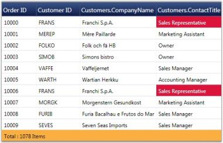 | markdownify }
{:.image }

#### Notify Property changes

You can keep the grid notified of the underlying data source changes by setting a Boolean property called NotifyPropertyChanges. When it is set to true, the grid continues to listen to the data source changes and gets its field values updated accordingly. For this feature to take effect, the data source should implement the INotifyPropertyChanged interface.

The following code illustrates this property:

[XAML]

&lt;syncfusion:GridDataControl x:Name="grid" AutoPopulateColumns="True" AutoPopulateRelations="False" NotifyPropertyChanges="True"&gt;

The following image corresponds to the output of the above given code:

{ 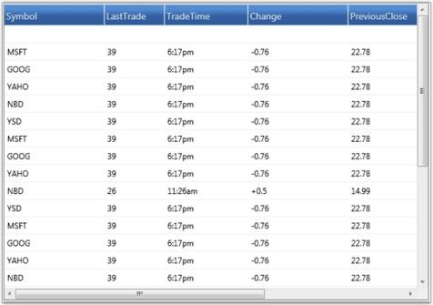 | markdownify }
{:.image }

#### Data Error Validation

Essential Grid now provides support to validate the grid data and display error information. This is achieved by subscribing to the IDataErrorInfo, an interface that provides the functionality to display custom error information in any control.

To validate data errors, follow the steps below:

1. Ensure that your data source implements the IDataErrorInfo interface, in which two of the properties, Error (which we can be left empty optionally) and Indexer (where the validation code is placed) must be defined.
2. Then display the error information by setting the ShowErrorToolTips property of the GridData control to true.

[C#]

dataGrid.ShowErrorTooltips = true;

The following code example illustrates how the GridData control throws an error message when the Freight value becomes lesser than 10.

[C#]

partial class Orders : IDataErrorInfo

{

public string Error

{

get

{ 

throw new NotImplementedException();

}

}

public string this[string columnName]

{

get

{

var result = string.Empty;

if (columnName == "Freight")

{

if (this.Freight.Value < 10)

{

result = "Freight is very low";

}

}

return result;

}

}

}

The following screenshot illustrates Data Error Validation in the GridData control.

{ 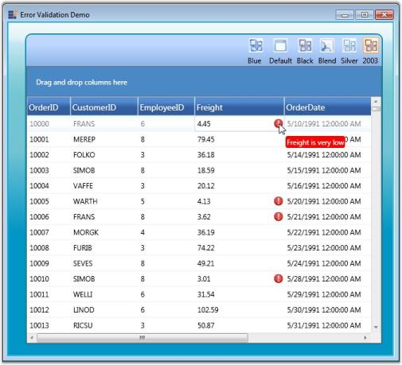 | markdownify }
{:.image }

#### Custom Data Error Validation

The GridData control supports two types of custom error validation methods. They are:

* Cell Level  Validation
* Row Level  Validation

Cell Level Validation

This validation takes place while the current cell editing completes. This type of validation is achieved by the CurrentCellValidating event.

Events

_Events_

<table>
<tr>
<th>
Event </th><th>
Description </th><th>
Arguments </th><th>
Type </th></tr>
<tr>
<th>
CurrentCellValidating</th><th>
It triggered while editing complete </th><th>
CurrentCellValidatingEventArgsCancel: Boolean property to cancel the commit.NewValue: Values that we have edited.OldVaue: Values before editing.Style: Style for the current editing cell.</th><th>
CurrentCellValidatingEventHandler. </th></tr>
</table>

> _Note: Once Cancel is set as true, the current cell doesn’t leave from edit mode until Cancel is set to false._

Adding CurrentCellValidating Event to an Application

To add the CurrentCellValidating event to an application:

1. Add the GridData control to the application. Refer to the following section to add the GridData control to an application [http://help.syncfusion.com/User%20Interface/WPF/Grid](http://help.syncfusion.com/User%20Interface/WPF/Grid).
2. In the following code example, we have set ProductList as ItemsSource. Hooking the CurrentCellValidating event follows. 

[XAML]

<syncfusion:GridDataControl x:Name="dataGrid"                                                       

AutoPopulateColumns="False"

                       AutoPopulateRelations="False"

                       ItemsSource="{Binding ProductList}"

                       ShowErrorTooltips="True"

                       CurrentCellValidating="dataGrid_CurrentCellValidating"

                       syncfusion:GridTooltipService.ShowTooltips="True"

                       UpdateMode="PropertyChanged"

                       VisualStyle="Metro">

[C#]

 this.dataGrid.CurrentCellValidating += new CurrentCellValidatingEventHandler(dataGrid_CurrentCellValidating);

3. The QueryCellInfo event is used to show the error icon in the cells while loading.

[C#]

this.dataGrid.Model.QueryCellInfo += new GridQueryCellInfoEventHandler(Model_QueryCellInfo);

void Model_QueryCellInfo(object sender, GridQueryCellInfoEventArgs e)

{

   if (e.Cell.RowIndex <= 0 || e.Cell.ColumnIndex <=0)

      return; 

   IsValid(e.Style, e.Style.CellValue);

}

private bool IsValid(GridStyleInfo style, object CellValue)

{

    string column = this.grid.VisibleColumns[style.ColumnIndex].MappingName;

    bool isInError = false; 

    style.ErrorInfo.ErrorContentAlignment = ImageContentAlignment.Left;

    style.ErrorInfo.ErrorType = ErrorType.ErrorMessage; 

    if (column == "SupplierID")

    {

       if (CellValue is DBNull || CellValue == null || (int)CellValue <= 0)

       {

         style.ErrorInfo.ErrorMessage = "Supplier ID cannot be null or less than 0.";

          isInError = true;

        } 

     }

     if (column == "CategoryID")

     {

        if (CellValue is DBNull || CellValue == null || (int)CellValue <= 0)

        {

           style.ErrorInfo.ErrorMessage = "Category ID cannot be null or 0.";

           isInError = true;

        }

      }

      return !isInError;

}  

4. Data validation is performed in the CurrentCellValidating event as shown in the following code example.

[C#]

void grid_CurrentCellValidating(object sender, CurrentCellValidatingEventArgs e)

{

  /// To validate the new value

  if(!this.IsValid(e.Style,e.NewValue))

     e.Cancel = true;     

}

Output

{  | markdownify }
{:.image }

Row Level Validation

This validation takes place while the focus moves from the current row to any other row. This type of validation is achieved by the RowValidation event.

Events

_Events_

<table>
<tr>
<th>
Event </th><th>
Description </th><th>
Arguments </th><th>
Type </th></tr>
<tr>
<th>
RowValidating</th><th>
Triggers while focus moves from current row to any other row.</th><th>
GridDataRowValidatingEventArgs contains the following arguments:IsValid: Boolean property to validate the row values.NewValues: Values which are edited in current row.Record: Current row record.RowIndex: Index of current row.</th><th>
GridDataRowValidatingEventHandler</th></tr>
</table>
> 

> _Note: Once IsValid is set as false, the current cell doesn’t leave from edit mode until IsValid is set as true._

Adding RowValidating Event to an Application

To add the RowValidating event to an application:

1. Add the GridData control to the application. Refer to the following section to add the GridData control to an application: [http://help.syncfusion.com/User%20Interface/WPF/Grid](http://help.syncfusion.com/User%20Interface/WPF/Grid).

In the following code we have set ProductList as ItemsSource. Hooking the RowValidating event follows.

[XAML]

<syncfusion:GridDataControl x:Name="dataGrid"                                                            AutoPopulateColumns="False"

                            AutoPopulateRelations="False"

                            ItemsSource="{Binding ProductList}"

                                                            ShowErrorTooltips="True"

                            RowValidating="dataGrid_RowValidating"

                            syncfusion:GridTooltipService.ShowTooltips="True"

                            UpdateMode="PropertyChanged">

[C#]

 this.dataGrid.RowValidating += new GridDataRowValidatingEventHandler(dataGrid_RowValidating);

2. The QueryCellInfo event is used to show the error icon in the cells while loading.

[C#]

this.dataGrid.Model.QueryCellInfo += new GridQueryCellInfoEventHandler(Model_QueryCellInfo);

void Model_QueryCellInfo(object sender, GridQueryCellInfoEventArgs e)

{

 if (e.Style.RowIndex > 0 && e.Style.RowIndex != errorRowIndex)

 {

  var recordIdx = this.dataGrid.Model.ResolveIndexToRecordPosition(e.Style.RowIndex);

  var record = this.dataGrid.Model.View.Records[recordIdx] as GridDataRecord;

  Products currentRecord = (Products)record.Data;

  if (Validate(e.Style, currentRecord))

  {

     e.Style.ShowTooltip = true;     

   e.Style.Tag = "Some fields in this record are having invalid data";     

     if (e.Style.ColumnIndex > 0)

       e.Style.Background = new SolidColorBrush(GridUtil.GetXamlConvertedValue<Color>("#FFCDD3F1"));

     this.dataGrid.Model[e.Style.RowIndex, 0].ErrorInfo = new GridErrorStyleInfo

     {

      ErrorMessage = "Some fields in this record are having invalid data",  

     };

   }

  }

}

 public bool Validate(GridStyleInfo style, Products product)

 { 

   bool isInError = false;

   object checkValue1 =  product.UnitPrice;

   if (checkValue1 is DBNull || checkValue1 == null || (double.Parse(checkValue1.ToString()) < 10))

    {

       ErrorMsg = "Unit price cannot be less than 10.";

       isInError = true;

    }

    object checkValue2 =  product.UnitsOnOrder;

    if (checkValue2 is DBNull || checkValue2 == null || (short)checkValue2 > 100)

    {

       ErrorMsg = "Units in order cannot be more than 100.";

       isInError = true;

     }

    object checkValue3 = product.ReorderLevel;

    if (checkValue3 is DBNull || checkValue3 == null || (short)checkValue3 > 50)

    {

      ErrorMsg= "Reorder level cannot cannot be more than 50.";

      isInError = true;

     }

  return isInError;

}

3. Data validation is performed in the RowValidating event as shown in the following code example.

[C#]

void OnRowValidating(object sender, GridDataRowValidatingEventArgs args)

{

  if (this.Validate(null, args.Record as Products))

  {

      this.SetErrorInformation(args.RowIndex, ErrorMessageforRowValidation);

      //To Change the Background and set the error tooltip.

      this.dataGrid.Model.RowStyles[args.RowIndex].Background = new SolidColorBrush(GridUtil.GetXamlConvertedValue<Color>("#FFFFD0D0"));

      this.dataGrid.Model.RowStyles[args.RowIndex].Tag = ErrorMessageforRowValidation;

      this.dataGrid.Model.RowStyles[args.RowIndex].ShowTooltip = true;

      this.Grid.Model.InvalidateCell(GridRangeInfo.Row(args.RowIndex));

      errorRowIndex = args.RowIndex;

      args.IsValid = false;

  }

  else

  {

     errorRowIndex = -1;

     ErrorMsg = "";

     args.IsValid = true;

    //Need to revert the color once error cleared in the row.

     this.dataGrid.Model.RowStyles[args.RowIndex].ShowTooltip = false;

     this.dataGrid.Model.RowStyles[args.RowIndex].Background = Brushes.Transparent;

     this.dataGrid.Model.InvalidateCell(GridRangeInfo.Row(args.RowIndex));

   }

}

Output

{  | markdownify }
{:.image }

#### Synchronize Current Selection

The GridData control provides support to keep any Selector-derived control synchronized with its current selection. If you change the current record in the grid, then the current selection of the other control also shifts to this new position and vice versa. It is obvious that the controls should be bound to the same data source.

The IsSynchronizedWithCurrentItem property does this work for you. It is a dependency property of Boolean type. You have to associate this property to the control that should be in sync. When this property is set to true, it keeps the controls synchronized and relieve this behavior, when set to false.

Technically, this synchronization is achieved through CollectionView, by binding its CurrentItem property to the current record position of the grid and hence, when another control binds to the same Collection View, its current selection is bound indirectly to the grid’s current record position. Therefore, when you change this control’s current selection, it affects the CollectionView.CurrentItem property, which in turn affects the current record's position of the grid too.

Example

Following is the code example that synchronizes GridData control with a ListView control.

ListView Implementation with IsSynchronizedWithCurrentItem Set to True

[XAML]

<ListView IsSynchronizedWithCurrentItem="True" ItemsSource="{Binding Source={StaticResource ordersSource}}"

HorizontalContentAlignment="Stretch"

ScrollViewer.HorizontalScrollBarVisibility="Disabled" Background="Transparent" Name="lstShelvedOrders" Height="300">

    &lt;ListView.View&gt;

        &lt;GridView&gt;

            &lt;GridViewColumn DisplayMemberBinding="{Binding Path=OrderID}" Header="Shelve ID"  /&gt;

            &lt;GridViewColumn DisplayMemberBinding="{Binding Path=CustomerID}" Header="Customer" /&gt;

            &lt;GridViewColumn DisplayMemberBinding="{Binding Path=EmployeeID}" Header="PO Number" /&gt;

            &lt;GridViewColumn DisplayMemberBinding="{Binding Path=OrderDate, StringFormat=MMM dd\, yyyy}" Header="Date"  /&gt;

            &lt;GridViewColumn DisplayMemberBinding="{Binding Path=ShipCountry}" Header="Ship Country"  /&gt;

        &lt;/GridView&gt;

    &lt;/ListView.View&gt;

&lt;/ListView&gt;

GridData Control Implementation

[XAML]

<syncfusion:GridDataControl x:Name="dataGrid" ShowAddNewRow="False" ShowFilters="False" AutoPopulateColumns="False"

AutoPopulateRelations="False"

ItemsSource="{StaticResource ordersSource}" ShowGroupDropArea="True" Height="300">

    &lt;syncfusion:GridDataControl.VisibleColumns&gt;

        &lt;syncfusion:GridDataVisibleColumn MappingName="OrderID" IsReadOnly="True" HeaderText="Order ID" Width="90" /&gt;

        &lt;syncfusion:GridDataVisibleColumn MappingName="CustomerID" HeaderText="Customer ID" Width="90" /&gt;

        &lt;syncfusion:GridDataVisibleColumn MappingName="EmployeeID" HeaderText="Employee ID" Width="90" /&gt;

        &lt;syncfusion:GridDataVisibleColumn MappingName="OrderDate" HeaderText="Order Date" Width="120"/&gt;

        &lt;syncfusion:GridDataVisibleColumn MappingName="ShipCountry" HeaderText="Ship Country" Width="100" /&gt;

    &lt;/syncfusion:GridDataControl.VisibleColumns&gt;

&lt;/syncfusion:GridDataControl&gt;

Following are the sample outputs with IsSynchronizedWithCurrentItem set to true and false.

{  | markdownify }
{:.image }

{  | markdownify }
{:.image }

####  Unbound Columns

Essential Grid supports addition of extra columns to the data source columns. Such additional columns are called unbound columns as they do not belong to the data source. These unbound fields can be used, when you want to add some additional or custom information for each record.  

You can create an unbound column by instantiating the class GridDataUnboundVisibleColumn, which is a derivative of GridDataVisibleColumn. It contains a property named Format, which is used to specify a format for the unbound column. Given a visible column, it is possible to check whether it is an unbound column or not, using the IsUnbound property of that visible column.

> _Note: Sorting and filtering operations does not work with an unbound column unless the column is associated with the item source that is bound.  So, it is good to turn off the filters wherever applicable._

The following example adds an unbound column and displays the record values in the format {Frieght:c} for {ShipCity}. 

[XAML]

<syncfusion:GridDataControl x:Name="dataGrid2" AutoPopulateColumns="True" AutoPopulateRelations="False" ItemsSource="{StaticResource ordersSource}"  

ShowFilters="False"                                                                      

ShowAddNewRow="False"                                    

>                

&lt;syncfusion:GridDataControl.VisibleColumns&gt;                    

&lt;syncfusion:GridDataVisibleColumn MappingName="OrderID" IsReadOnly="True" IsIdentity="True" HeaderText="Order ID" /&gt;

&lt;syncfusion:GridDataVisibleColumn MappingName="ShipCountry" HeaderText="Ship Country"/&gt;

&lt;syncfusion:GridDataVisibleColumn MappingName="ShipCity" HeaderText="Ship City" /&gt;

&lt;syncfusion:GridDataUnboundVisibleColumn HeaderText="UnboundCol1" Format="'{Freight:c} for {ShipCity}'" /&gt;                

&lt;/syncfusion:GridDataControl.VisibleColumns&gt;            

&lt;/syncfusion:GridDataControl&gt;

The following screenshot shows the output of the above given code:

{  | markdownify }
{:.image }

GDC is added with the unbound column, "UnboundCol1".

Accessing Unbound Column Values

The Grid Table exposes an API named GetUnboundValue that can be used to retrieve the unbound value of a specific unbound cell. Given the record index and the respective Unbound Column object, it returns the unbound field value for the specified record. It is overloaded to accept row and column indices as parameters using which it fetches the corresponding unbound visible column and yields its value as output.

[C#]

//Retrieve the unbound value using record index and the unbound column instance.

object value = this.dataGrid.Model.Table.GetUnboundValue(recordIndex, unboundColumn);

//Retrieve the unbound value using row and column indices.

object value = this.dataGrid.Model.Table.GetUnboundValue(5, 5);

##### Operations on Unbound Columns	

Unbound columns allow association of related values that are bound to an expression in the unbound column or through handling the QueryUnboundColumnValue event. Operations like sorting, filtering, grouping, summaries and conditional formatting can now be applied on these dynamic values bound to the underlying source. It uses LINQ Functional Expressions to be dynamically evaluated at run time, and thus only strongly-typed source can be used with this feature.

{  | markdownify }
{:.image }

Sorting Operation

Sorting can be done interactively by clicking the header or can be declared by using XAML code as follows.

[XAML]

&lt;syncfusion:GridDataControl.SortColumns&gt;

    &lt;syncfusion:GridDataSortColumn ColumnName="Multiply" SortDirection="Descending" /&gt;

&lt;/syncfusion:GridDataControl.SortColumns&gt;

&lt;syncfusion:GridDataControl.VisibleColumns&gt;

    &lt;syncfusion:GridDataVisibleColumn MappingName="CustomerID" HeaderText="Customer ID" /&gt;

    &lt;syncfusion:GridDataVisibleColumn MappingName="OrderDate" HeaderText="Order Date" /&gt;

    &lt;syncfusion:GridDataVisibleColumn MappingName="Freight" HeaderText="Freight" AllowFilter="True"&gt;

        &lt;syncfusion:GridDataVisibleColumn.FilterPane&gt;

            &lt;syncfusion:GridDataTextFilteringPane IsThemed="False" Foreground="Black" PredicateType="And" /&gt;

        &lt;/syncfusion:GridDataVisibleColumn.FilterPane&gt;

    &lt;/syncfusion:GridDataVisibleColumn&gt;

    <syncfusion:GridDataUnboundVisibleColumn MappingName="Multiply" HeaderText="Freight * 100" Expression="Freight * 100"

    AllowFilter="True" AllowDrag="True" AllowGroup="True">

    &lt;/syncfusion:GridDataUnboundVisibleColumn&gt;

    <syncfusion:GridDataUnboundVisibleColumn MappingName="FreightSqr" HeaderText="Freight Square" Expression="Freight ^ 2"

    AllowFilter="True">

    &lt;/syncfusion:GridDataUnboundVisibleColumn&gt;

&lt;/syncfusion:GridDataControl.VisibleColumns&gt;

{  | markdownify }
{:.image }

Filtering Operation

We have two modes of filtering in the WPF GridData control: Excel-like Filtering and Advanced Filtering. Both these modes are supported by unbound columns.

Excel-like Filtering Mode

Excel-like filtering can be enabled in unbound columns by setting AllowFilter property to true.

[XAML]

&lt;syncfusion:GridDataUnboundVisibleColumn MappingName="Multiply" HeaderText="Freight * 100" Expression="Freight * 100" AllowFilter="True" AllowDrag="True" AllowGroup="True"&gt;

&lt;/syncfusion:GridDataUnboundVisibleColumn&gt;

{  | markdownify }
{:.image }

Advanced Filtering Mode

Advanced Filtering mode can be enabled by adding the following code.

[XAML]

&lt;syncfusion:GridDataUnboundVisibleColumn MappingName="Multiply" HeaderText="Freight * 100" Expression="Freight * 100" AllowFilter="True" AllowDrag="True" AllowGroup="True"&gt;

    &lt;syncfusion:GridDataVisibleColumn.FilterPane&gt;

        &lt;syncfusion:GridDataTextFilteringPane IsThemed="False" Foreground="Black" PredicateType="And" /&gt;

    &lt;/syncfusion:GridDataVisibleColumn.FilterPane&gt;

&lt;/syncfusion:GridDataUnboundVisibleColumn&gt;

{ 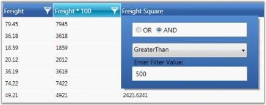 | markdownify }
{:.image }

Grouping Operation

Grouping can be performed interactively or declaratively on the Unbound Columns by using XAML code.

[XAML]

&lt;syncfusion:GridDataControl.GroupedColumns&gt;

    &lt;syncfusion:GridDataGroupColumn ColumnName="Multiply" /&gt;

&lt;/syncfusion:GridDataControl.GroupedColumns&gt;

{ 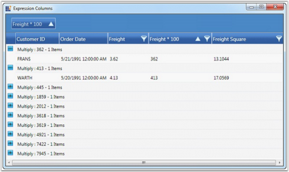 | markdownify }
{:.image }

Summary Operations

The default summaries work much the same way as summaries with bound columns. Following is the list of different types of Summary declaration in XAML.

Table Summary

[XAML]

&lt;syncfusion:GridDataControl.TableSummaryRows&gt;

    &lt;syncfusion:GridDataSummaryRow ShowSummaryInRow="False" Title="Total : {FreightMultiplySummary}" TitleColumnCount="3"&gt;

        &lt;syncfusion:GridDataSummaryRow.SummaryColumns&gt;

            <syncfusion:GridDataSummaryColumn Name="FreightMultiplySummary" MappingName="Multiply" SummaryType="Int32Aggregate"

            Format="'{Max:d}'" />

        &lt;/syncfusion:GridDataSummaryRow.SummaryColumns&gt;

    &lt;/syncfusion:GridDataSummaryRow&gt;

&lt;/syncfusion:GridDataControl.TableSummaryRows&gt;

Caption Summary

[XAML]

&lt;syncfusion:GridDataControl.CaptionSummaryRow&gt;

    &lt;syncfusion:GridDataSummaryRow ShowSummaryInRow="False" Title="'{CountSummary}'" TitleColumnCount="4"&gt;

        &lt;syncfusion:GridDataSummaryRow.SummaryColumns&gt;

            <syncfusion:GridDataSummaryColumn Name="CountSummary" MappingName="Multiply" SummaryType="DoubleAggregate"

            Format="Total - '{Sum:###.00}'" >

            &lt;/syncfusion:GridDataSummaryColumn&gt;

        &lt;/syncfusion:GridDataSummaryRow.SummaryColumns&gt;

    &lt;/syncfusion:GridDataSummaryRow&gt;

&lt;/syncfusion:GridDataControl.CaptionSummaryRow&gt;

Group Summary

[XAML]

&lt;syncfusion:GridDataControl.CaptionSummaryRow&gt;

    &lt;syncfusion:GridDataSummaryRow ShowSummaryInRow="False" Title="'{CountSummary}'" TitleColumnCount="4"&gt;

        &lt;syncfusion:GridDataSummaryRow.SummaryColumns&gt;

            <syncfusion:GridDataSummaryColumn Name="CountSummary" MappingName="Multiply" SummaryType="DoubleAggregate"

            Format="Total - '{Sum:###.00}'" >

            &lt;/syncfusion:GridDataSummaryColumn&gt;

        &lt;/syncfusion:GridDataSummaryRow.SummaryColumns&gt;

    &lt;/syncfusion:GridDataSummaryRow&gt;

&lt;/syncfusion:GridDataControl.CaptionSummaryRow&gt;

{  | markdownify }
{:.image }

Custom Summary Operations

Summary calculation differs for unbound columns. It has an additional parameter to supply a dynamic lambda delegate for invoking the unbound values at run time.

[C#]

public interface ISummaryExpressionAggregate : ISummaryAggregate

{

Action<IEnumerable, string, Expression<Func<string, object, object>>, PropertyDescriptor> CalculateAggregateExpressionFunc();

}

All the default Summary Aggregates now implement ISummaryExpressionAggregate interface. This typically informs the ICollectionViewAdv to expect an Expression to evaluate at run time.

Expression Trees Evaluation for Aggregate Methods

A return value is required for any LINQ Aggregate method to be implemented. In order to invoke an unbound column through the lambda delegate, you have an internal wrapper lambda that is generic.

[C#]

private static Expression GetInvokeExpressionAggregateFunc<TResult>(ParameterExpression paramExp, string propertyName, Expression<Func<string, object, object>> expressionFunc)

{

// Constructing a wrapper function that would return a generic value.

Func<Expression<Func<string, object, object>>, string, object, TResult> fun = (func, prop, rec) =>

{

var lambda = func.Compile();

TResult val = (TResult)lambda.DynamicInvoke(new object[] { prop, rec });

return val;

};

Expression<Func<Expression<Func<string, object, object>>, string, object, TResult>> eIFunc = (func, prop, rec) => fun(func, prop, rec);

var invokeExp = Expression.Invoke(Expression.Constant(fun), new Expression[] { Expression.Constant(expressionFunc),

Expression.Constant(propertyName), paramExp });

return invokeExp;

}

The above method wraps the unbound column's lambda expression into an expression that would return typed value, thus enabling direct calls to Sum<TResult>(Expression<Func<T,TResult>>, where TResult can be any numeric data type.

Selected Items Collection

GridData control allows you to select the required records and retrieve selected record values. Once a record is selected, it is added to the GridDataControl.SelectedItems collection and GridDataControl.SelectedItem highlights the current record in selection.

Following is the code example that iterates through the SelectedItems collections and prints the values of those records that are in selection.

[C#]

Console.WriteLine("Current record key : "+ ((Orders)this.gdc.SelectedItem).OrderID);

Console.WriteLine("OrderID" + "\t" + "CustomerID" + "\t" + "Freight");

Console.WriteLine();

foreach (object obj in gdc.SelectedItems)

{

    Orders c = (Orders)obj;

    Console.WriteLine(c.OrderID + "\t" + c.CustomerID + "\t" + c.Freight);

}

Output

{  | markdownify }
{:.image }

{  | markdownify }
{:.image }

Dynamic Keyword Support

C# 4.0 introduces a new type of object: dynamic. More information can be found in MSDN. The dynamic object offers a way to get or set values dynamically using CallSites and binders from the C# language service. Using this service, we are able to generate dynamic compile-time execution and representing that acts as an object to GridDataControl. By enabling it to work with dynamic objects, the grid seamlessly allows working with any DLR-based language.

The IDynamicMetaObjectProvider interface defines the interface between the dynamic run-time types.

{  | markdownify }
{:.image }

Usage Scenarios

Define a List<dynamic> object to be set as ItemsSource for the grid.

[C#] 

 var list = new List<dynamic>();

            dynamic d = new ExpandoObject();

            d.Name = "Robert";

            d.Age = 24;

            d.Occupation = "Software Engineer";

            d.HasCar = true;

            dynamic d1 = new ExpandoObject();

            d1.Name = "James";

            d1.Age = 25;

            d1.Occupation = "Business";

            d1.HasCar = false;

            list.Add(d);

            list.Add(d1);

            this.dataGrid.ItemsSource = list;

Features that work with dynamic objects

* Sorting
* Filtering
* Grouping
* Summaries
* Conditional formatting

The internal view uses LINQ expression syntax to generate operations, this works well for including custom LINQ expressions inside operations such as sorting, filtering, grouping, etc.

Specific Dynamic Type Handling

Column Type

Since the collections are dynamic, we need to specify the proper type for the column to work properly in all scenarios. GridDataVisibleColumn provides a DataType property to specify the type for the column.

[XAML]

     &lt;syncfusion:GridDataVisibleColumn MappingName="OrderDate" DataType="DateTime" /&gt;

Handling Relations

Relations have to be handled in XAML or C#. The AutoPopulateRelations property does not work on dynamic object types.

<table>
<tr>
<td>
[XAML]                     &lt;syncfusion:GridDataControl.Relations&gt;                        &lt;syncfusion:GridDataRelation RelationalColumn="OrderDetails" /&gt;                    &lt;/syncfusion:GridDataControl.Relations&gt;</td></tr>
<tr>
<td>
</td></tr>
</table>
#### UnboundRows

Essential Grid supports addition of extra rows in the view that does not affect the DataSource. Such additional rows are called UnboundRows as they do not belong to the data source. These unbound fields can be used, when you want to add some additional or custom information for GridDataControl 

You can create an UnboundRow by just setting the UnboundRowCount. It contains a property named Format, which is used to specify a format for the UnboundRow. Given an UnboundRow we can check if this is an UnboundRow or not using IsInUnboundRow(int Rowindex) method in Grid Model.

    this.grid.Model.UnboundRowsCount = 5;

    this.grid.UnboundRowPosition = Position.Top;

{  | markdownify }
{:.image }

{  | markdownify }
{:.image }

Properties, Methods and Events tables

Properties

_Properties_

<table>
<tr>
<th>
Properties</th><th>
Description</th><th>
Type Of Property</th><th>
Acceptable Value</th><th>
Reference Link</th></tr>
<tr>
<td>
UnboundRowPosition</td><td>
Gets or sets a value, which represents the position of the Unbound Rows.</td><td>
Position</td><td>
Top/Bottom</td><td>
NA</td></tr>
</table>

Methods

_Methods_

<table>
<tr>
<th>
Method </th><th>
Description </th><th>
Parameters </th><th>
Type </th><th>
Return Type </th></tr>
<tr>
<th>
IsInUnboundRows(int RowIndex)</th><th>
This method checks if the rows provided is an unbound row or not.This can be accessed from Grid Model as grid.Model.IsInUnboundRows(row);</th><th>
(int RowIndex) </th><th>
Integer</th><th>
Boolean  </th></tr>
</table>
### Data Presentation

GridData control data can be presented in several ways. 

This section illustrates those data presentation techniques in the following topics:

* Grouping—This topic discusses on grouping feature in the grid.
* Sorting—This topic discusses on sorting feature in the grid.
* Filters—This topic discusses on applying filters in the grid.
* Summaries—This topic describes on adding summaries in the grid.
* Column Drag and Drop—This topic discusses on column-level drag-and-drop support.
* Hierarchy—This topic discusses on nested table hierarchy.
* Stacked Headers—This topic discusses on the addition of unbound header rows called stacked headers.
* Expression Fields—This topic discusses how to create expression columns that hold calculated values based on other fields in the same record.
* ToolTips—This topic describes the addition of tooltips for the grid cells.

#### Grouping

This section elaborates the grouping feature of Essential Grid. By using this feature, you can wrap a set of records that belong to the same category into a separate block, called Group. Grid enables you to group data by one or more columns. When grouping is applied, the records having identical values for the grouped columns are combined together forming a hierarchical structure.

Each group is identified by its Group Caption Section that can be expanded to bring the underlying records into view. This Group Caption Section contains the information about a particular group such as group name, number of records in the group, and so on.

This section comprises the following:

##### Creating Groups

Grid groups can be created at design-time as well as run time. They are managed by the GroupedColumns collection which holds one entry for every grouped column. A group can be created programmatically by adding the desired column into this collection. The records are sorted in the ascending (default) or descending order of their Grouped Column values. The GroupedColumns collection can have more than one entry to form Nested Groups.

[XAML]

<syncfusion:GridDataControl x:Name="dataGrid" ShowAddNewRow="False" ShowFilters="False" AutoPopulateColumns="True"

AutoPopulateRelations="True" ItemsSource="{StaticResource ordersSource}" ShowGroupDropArea="True">

&lt;syncfusion:GridDataControl.GroupedColumns &gt;

&lt;syncfusion:GridDataGroupColumn ColumnName="ShipCountry"&gt;&lt;/syncfusion:GridDataGroupColumn&gt;

&lt;/syncfusion:GridDataControl.GroupedColumns&gt;

&lt;/syncfusion:GridDataControl&gt;

[C#]

GridDataGroupColumn groupedCol = new GridDataGroupColumn();

groupedCol.ColumnName = "ShipCountry";

dataGridControl.GroupedColumns.Add(groupedCol);

{  | markdownify }
{:.image }

Run Time Grouping

Run time grouping is enabled by displaying the group drop area, a placeholder to store the current groups. Such groups can be created interactively through the drag-and-drop operation. For example, to group data against a particular column, drag the desired column header and drop it into the group drop area.

{  | markdownify }
{:.image }

See Also

Nested Groups and Custom Groups 

##### Nested Groups

When you have the grid data grouped against more than one column, the groups are nested in different levels forming a hierarchical, multilevel structure. You can expand or collapse the underlying groups and records from a parent group by clicking the PlusMinus button preceding its group caption.

MultiColumn (Nested) groups can be easily created by simply adding multiple columns into the GroupedColumns collection. You can also generate multilevel groups by just dragging multiple column headers into the group drop area.

[C#]

GridDataGroupColumn groupedCol1 = new GridDataGroupColumn();

groupedCol1.ColumnName = "ShipCountry";

dataGrid.GroupedColumns.Add(groupedCol1);

GridDataGroupColumn groupedCol2 = new GridDataGroupColumn();

groupedCol2.ColumnName = "EmployeeID";

dataGrid.GroupedColumns.Add(groupedCol2);

{  | markdownify }
{:.image }

See Also

Creating Groups

##### Group Events

The following table lists the events that are associated with Grid Groups.

_Events_

<table>
<tr>
<td>
Event</td><td>
Description</td></tr>
<tr>
<td>
GroupExpanding</td><td>
This event is raised when a group is about to be expanded. This operation can be optionally canceled.</td></tr>
<tr>
<td>
GroupExpanded</td><td>
This event is raised when a group is expanded.</td></tr>
<tr>
<td>
GroupCollapsing</td><td>
This event is raised when a group is about to be collapsed. This operation can be optionally canceled.</td></tr>
<tr>
<td>
GroupCollapsed</td><td>
This event is raised when a group is collapsed.</td></tr>
</table>

GroupExpanding Event

The following code example illustrates how to handle the GroupExpanding event.

[C#]

// Subscribe to the event.

dataGrid.Model.Table.GroupExpanding+=new GroupExpandingEventHandler(Table_GroupExpanding);

// Handle the event.

void Table_GroupExpanding(object sender, GroupExpandingEventArgs args)

{

args.Cancel = true;

}

GroupExpanded Event

The following code example illustrates how to handle the GroupExpanded event.

[C#]

// Subscribe to the event.

dataGrid.Model.Table.GroupExpanded += new GroupExpandedEventHandler(Table_GroupExpanded);

// Handle the event.

void Table_GroupExpanded(object sender, GroupExpandedEventArgs args)

{

// Print the group caption text.

Console.WriteLine("Expanded: "+ dataGrid.Model.Table.GroupModel.GetGroupCaptionText((GridDataGroupItem)args.Group.Item));

}

GroupCollapsing Event

The following code example illustrates how to handle the GroupCollapsing event.

[C#]

// Subscribe to the event.

dataGrid.Model.Table.GroupCollapsing+=new GroupCollapsingEventHandler(Table_GroupCollapsing);

// Handle the event.

void Table_GroupCollapsing(object sender, GroupCollapsingEventArgs args)

{

args.Cancel = true;

}

GroupCollapsed Event

The following code example illustrates how to handle the GroupCollapsed event.

[C#]

// Subscribe to the event.

dataGrid.Model.Table.GroupCollapsed+=new GroupCollapsedEventHandler(Table_GroupCollapsed);

// Handle the event.

void Table_GroupCollapsed(object sender, GroupCollapsedEventArgs args)

{

// Print the group caption text.

Console.WriteLine("Expanded: " + dataGrid.Model.Table.GroupModel.GetGroupCaptionText((GridDataGroupItem)args.Group.Item));

}

#### Sorting

Sorting arranges the records either in ascending or in descending order of the selected field values. Essential Grid allows you to sort the data against one or more columns. The number of columns on which the sorting can be applied is unlimited.

SortColumns Collection

The information about all the sorted columns for a grid is managed by Grid.SortColumns collection. It is an observable collection of type GridDataSortColumn, where each entry holds the following two properties:

* Name of the sorted column 
* SortDirection-an object of type ListSortDirection 

You can add, modify and remove any item of this collection to manage the sorted columns of a grid.

Apply Sorting

There are a couple of ways to apply sorting to the grid data. A simple one is just by clicking the column header by which the grid data needs to be sorted. Once the sorting is applied, the grid shows a sort icon in the respective column headers indicating the direction of sorting.

You can also perform sorting through the code. This requires you to define a number of GridDataSortColumn objects specifying the desired column names and sort directions and then add these objects into TableProperties.SortColumns collection. The following code illustrates this:

[XAML]

&lt;syncfusion:GridDataControl x:Name="dataGrid"  AutoPopulateColumns="True"    AutoPopulateRelations="False"  ItemsSource="{StaticResource customerSource}"&gt;

    &lt;syncfusion:GridDataControl.SortColumns&gt;

       &lt;syncfusion:GridDataSortColumn ColumnName="ContactTitle" SortDirection="Descending" /&gt;

    &lt;/syncfusion:GridDataControl.SortColumns&gt;

&lt;/syncfusion:GridDataControl&gt;

The following screenshot shows a GDC enabled with sorting feature:

{  | markdownify }
{:.image }

Sorting feature is now enabled in GridData control.

Enable/Disable Sorting

It is possible to prevent sorting on specific grid columns or all the columns at once. Grid.AllowSortproperty is set to _true_ by default. Set the Grid.AllowSort property to _false_ to disable sorting on all the columns. To disallow sorting on a particular column, set its visibleColumn.AllowSort property to _false_. The following code illustrates setting these properties:

Disable Sort on All Columns

[XAML]

&lt;syncfusion:GridDataControl x:Name="dataGrid" ItemsSource="{StaticResource customerSource}" AllowSort="False" /&gt;

Disable Sort on Single Column (Example-CustomerID)

[XAML]

&lt;syncfusion:GridDataControl x:Name="dataGrid"  AutoPopulateColumns="True"    AutoPopulateRelations="False"  ItemsSource="{StaticResource customerSource}"&gt;

   &lt;syncfusion:GridDataControl.VisibleColumns&gt;

      &lt;syncfusion:GridDataVisibleColumn MappingName="CustomerID" HeaderText="CustomerID" AllowSort="False" /&gt;

   &lt;/syncfusion:GridDataControl.VisibleColumns&gt;

&lt;/syncfusion:GridDataControl&gt;

##### Multicolumn Sorting

To apply sorting on more than one column at run time, click the desired column headers by pressing the CTRL key. 

Below is the code that sorts the grid by two columns: 

[XAML]

&lt;syncfusion:GridDataControl x:Name="dataGrid" AutoPopulateColumns="True" AutoPopulateRelations="False" ItemsSource="{StaticResource customerSource}"&gt;

    &lt;syncfusion:GridDataControl.SortColumns&gt;

         &lt;syncfusion:GridDataSortColumn ColumnName="CompanyName" SortDirection="Ascending" /&gt;

         &lt;syncfusion:GridDataSortColumn ColumnName="ContactTitle" SortDirection="Descending" /&gt;

    &lt;/syncfusion:GridDataControl.SortColumns&gt;

&lt;/syncfusion:GridDataControl&gt;

> 

> _Note: When the grid is sorted against multiple columns, the affected column headers get painted with a number that starts from 0, 1 ... representing the sort order._

> 

The following screenshot shows a multicolumn sorting enabled GDC:

{ 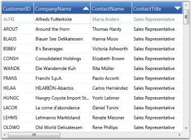 | markdownify }
{:.image }

Multicolumn sorting feature is now enabled in GridData control.

##### Custom Sorting

Custom sorting helps you to sort the records of the selected field values depending on your needs.  It also allows you to sort the data against one or more columns in the GridDataControl.

The custom sorting sorts the values using custom sorting logic. To perform the custom sorting, you need to hook the SortColumnChanging or SortColumnChangingCommand event and pass the custom sorting logic to the CustomComparer.

To create a custom comparer to implement the custom sorting logic, you need to derive the logic from _IComparer<object>_ and _ISortDirection_. The custom sorting is performed by comparing the values of particular columns. When grouping is applied, the custom sorting can be performed by comparing the Group keys.

Example Scenario

The following code examples illustrate how to perform the custom sorting for the names in the Company Name column according to the string length of the names.

To enable the custom sorting, hook the _SortColumnsChanging_ event.

[C#]

this.dataGrid.Model.Table.SortColumnsChanging += new GridDataSortColumnsChan

gingEventHandler(Table_SortColumnsChanging);

Set the comparer for the column on which the data needs to be sorted using the custom sorting logic. Here, the comparer is assigned to CompanyName.

[C#]

//This method is hooked when clicking the header 

void Table_SortColumnsChanging(object sender, GridDataSortColumnsChangingEve

ntArgs args)
{
    if (args != null)
    {
        foreach (var item in args.AddedItems)
        {
           //Choosing the column to be sorted

           if (item.ColumnName.Equals("CompanyName"))
           {

               //Passing the custom sort logic to CustomComparer

               item.CustomComparer = new CustomerInfo();
           }
        }
    }
}

Check the direction of the sorting by using the SortDirection property of the ListSortDirection class. The Compare method of the IComparer interface uses two parameters to compare the length of the string.

[C#]

public class CustomerInfo : IComparer<Object>, ISortDirection
    {
        //Implementation of ICompare method

        public int Compare(object x, object y)
        {
            int namX;
            int namY;
            //For Normal case

            if (x.GetType() == typeof(Customers))
            {
                //Calculating the length if the object is of Customers type

                namX = ((Customers)x).CompanyName.Length;
                namY = ((Customers)y).CompanyName.Length;
            }

            //While Grouping

            else if (x.GetType() == typeof(Group))
            {
                //Calculating the length if the object is of Group type

                namX = ((Group)x).Key.ToString().Length;
                namY = ((Group)y).Key.ToString().Length;
            }
            else
            {
                namX = x.ToString().Length;
                namY = y.ToString().Length;
            }
            //Object is passed through the Compare method and gets the

 SortDirection.

            if (namX.CompareTo(namY) > 0)
                return SortDirection == ListSortDirection.Ascending ? 1 : -1;
            else if (namX.CompareTo(namY) == -1)
                return SortDirection == ListSortDirection.Ascending ? -1 : 1;
            else
                return 0;
        }

        //gets or sets the SortDirection

        private ListSortDirection _SortDirection;
        public ListSortDirection SortDirection
        {
            get
            {
                return _SortDirection;
            }
            set
            {
                _SortDirection = value;
            }
        }
    }

The following screenshot displays the Company Name column with the sorted names according to their length.

{  | markdownify }
{:.image }

#### Filters

Essential Grid allows you to restrict the display of records using a mechanism called Filters. A filter lets you to extract a subset of records that meet certain filter criteria. Filters can be applied to one or more columns.

Functions

* Apply Filters
* Enable/Disable Filters
* Filters Collection

Now, let us see these functionalities one-by-one in detail.

Apply Filters

When this feature is enabled, every column header displays a filter icon. Clicking this icon opens a drop-down list, which is actually a Checked List Box control that holds the possible values for the column clicked. To filter the data by a specific value, just select the check box that prefixes the desired value. This is then reload the grid with only those records, which has the selected value on the particular column. The filter drop-down also provides a SelectAll option either to select or deselect all the values at once.

Enable/Disable Filters

It is possible to turn on and turn off the filters in specific column or in all the columns as a whole. To enable filters in all the columns, the Grid.ShowFilters must be set to true. To turn on the filters for specific column, simply set its AllowFilter property to true.

The following are the code snippets that illustrate this property:

Enable Filter for the Whole Grid

[XAML]

&lt;syncfusion:GridDataControl x:Name="dataGrid"  AutoPopulateColumns="True"    AutoPopulateRelations="False"  ItemsSource="{StaticResource customerSource}" ShowFilters="True" /&gt;

Enable Filter for Single Column

[XAML]

&lt;syncfusion:GridDataControl x:Name="dataGrid" AutoPopulateColumns="False" AutoPopulateRelations="False"  ItemsSource="{StaticResource customerSource}"&gt;

   &lt;syncfusion:GridDataControl.VisibleColumns&gt;

      &lt;syncfusion:GridDataVisibleColumn MappingName="CustomerID" HeaderText="CustomerID"/&gt;

      &lt;syncfusion:GridDataVisibleColumn MappingName="CompanyName" HeaderText="CompanyName" AllowFilter="True" /&gt;

      &lt;syncfusion:GridDataVisibleColumn MappingName="ContactTitle" HeaderText="ContactTitle" /&gt;

   &lt;/syncfusion:GridDataControl.VisibleColumns&gt;

&lt;/syncfusion:GridDataControl&gt;

The following image shows a GridData control with filter feature enabled for "CompanyName" column:

{  | markdownify }
{:.image }

CompanyName in GridData control is now enabled with filtering feature.

Here is an example code that enables filter on all the columns:

[XAML]

<syncfusion:GridDataControl x:Name="dataGrid"  AutoPopulateColumns="True"    AutoPopulateRelations="False"  ItemsSource="{StaticResource customerSource}"

ShowFilters="True" />

The following image illustrates the columns, filtered against the criteria ContactTitle=’Accounting Manager'.

{  | markdownify }
{:.image }

Filters Collection

All the filters for a particular column are managed by VisibleColumn.Filters property. You can apply or  clear any number of filters by adding or removing the appropriate entries from this collection.

The following code illustrates the addition of a filter to the column 'ContactTitle'.

[XAML]

&lt;syncfusion:GridDataVisibleColumn MappingName="ContactTitle" HeaderText="ContactTitle"&gt;

                        &lt;syncfusion:GridDataVisibleColumn.Filters&gt;

                            &lt;syncfusion:GridDataFilterPredicate FilterType="StartsWith" FilterValue="Sales" IsCaseSensitive="False" /&gt;

                        &lt;/syncfusion:GridDataVisibleColumn.Filters&gt;

&lt;/&lt;syncfusion:GridDataVisibleColumn&gt;

#### Advanced Filtering

This feature provides advanced filtering options for the end-user. It overrides the default filter and displays an advanced filter drop-down that lists the available filter operators for the respective filtering column and provides a text box, where the user is allowed to type the filter string. It exhibits a dynamic filtering mechanism by applying filter as the characters are typed.

APIs Used 

This advanced filter pane comes in following two forms. 

* GridDataTextFilteringPane, which can be used with any column type
* GridDataInt32SliderFilteringPane, which works only with integer columns

Filter Operators

The filter combo is the place where you get the available list of filter operators supported for  the corresponding column type.  The following table provides the list of filter choices for each column type.

_Filter Choices_

<table>
<tr>
<td>
Column Type</td><td>
Filter Choices</td></tr>
<tr>
<td>
String</td><td>
StartsWithEndsWithContainsEqualsNotEquals</td></tr>
<tr>
<td>
Int32 /DateTime</td><td>
LessThanLessThanOrEqualGreaterThanGreaterThanOrEqualEqualNotEqual</td></tr>
</table>

The GridDataTextFilteringPane, which is common to all column types, associate appropriate filter choice list according to the type of the column. When GridDataInt32SliderFilteringPane is used, the filter combo is always loaded with Int32 filter choices.

Clearing Filter

To clear any filter, you can simply erase the characters from filter text box. If you are using SliderFilteringPane, select the “None” option from the filter combo in order to clear the filter.

Customization Options

The Filtering Pane classes provide different customization properties that assist you to customize the filtering pane. These properties are described below:

_Properties_

<table>
<tr>
<td>
Customization Property</td><td>
Description</td></tr>
<tr>
<td>
Background</td><td>
Brush for filter pane background</td></tr>
<tr>
<td>
Foreground</td><td>
Brush for filter pane foreground</td></tr>
<tr>
<td>
PredicateType</td><td>
Specifies the predicate type: OR (or) AND</td></tr>
<tr>
<td>
CurrentFilterType</td><td>
Specifies the filter operator to be used for the filter column</td></tr>
<tr>
<td>
MatchCase</td><td>
Boolean property; when {{ '_true_' | markdownify }}, performs case-sensitive filtering</td></tr>
</table>
The filtering panes are optional. It is possible to enable the filtering panes feature in few specific columns and allow other columns to use the default filter.

To enable this feature, you can simply attach an object of the desired filtering pane to the corresponding visible column. The columns that does not have this specification use the default filtering mechanism. It is obvious that the AllowFilter property of the visible column should be set to true in both the cases.

Example

Let us see some code examples that set up the two kinds of filtering panes. 

[XAML]

<syncfusion:GridDataControl x:Name="dataGrid" ShowAddNewRow="False" AutoPopulateColumns="False" AutoPopulateRelations="False"  

ItemsSource="{StaticResource orderSource}" ShowColumnOptions="True">

    &lt;syncfusion:GridDataControl.VisibleColumns&gt;

        &lt;syncfusion:GridDataVisibleColumn MappingName="OrderID"/&gt;

        &lt;!--Frieght column using Slider Filtering Pane.--&gt;

        &lt;syncfusion:GridDataVisibleColumn MappingName="Freight" AllowFilter="True"&gt;

            &lt;syncfusion:GridDataVisibleColumn.FilterPane&gt;

                &lt;syncfusion:GridDataInt32SliderFilteringPane /&gt;

            &lt;/syncfusion:GridDataVisibleColumn.FilterPane&gt;

        &lt;/syncfusion:GridDataVisibleColumn&gt;

        &lt;!--ShipCountry column using Text Filtering Pane with the Foreground and PredicateType properties set.--&gt;

        &lt;syncfusion:GridDataVisibleColumn MappingName="ShipCountry" AllowFilter="True"&gt;

            &lt;syncfusion:GridDataVisibleColumn.FilterPane&gt;

                &lt;syncfusion:GridDataTextFilteringPane IsThemed="True" Foreground="Black" PredicateType="And" /&gt;

            &lt;/syncfusion:GridDataVisibleColumn.FilterPane&gt;

        &lt;/syncfusion:GridDataVisibleColumn&gt;

        &lt;!--ShipCountry column using Text Filtering Pane with the Background and CurrentFilterType properties set.--&gt;

        &lt;syncfusion:GridDataVisibleColumn MappingName="ShipCity" AllowFilter="True"&gt;

            &lt;syncfusion:GridDataVisibleColumn.FilterPane&gt;

                &lt;syncfusion:GridDataTextFilteringPane IsThemed="False"  Background="Orange" CurrentFilterType="GreaterThan" /&gt;

            &lt;/syncfusion:GridDataVisibleColumn.FilterPane&gt;

        &lt;/syncfusion:GridDataVisibleColumn&gt;

    &lt;/syncfusion:GridDataControl.VisibleColumns&gt;

&lt;/syncfusion:GridDataControl&gt;

{  | markdownify }
{:.image }

{  | markdownify }
{:.image }

#### Grid FilterBar

Essential Grid supports FilterBar, which filters the records with different expressions depending upon the Column type. The FilterBar is displayed at the top of the Grid below the Header Row by setting the “ShowFilterBar” property to true in GridDataControl class. The filtering tokens are tabulated in the Tokens to filter the value table.

Use Case Scenarios

FilterBar can be used for applications for which the user wants to filter the Grid at run time. 

Adding FilterBar to an Application 

This topic explains the implementation of the FilterBar in an application. The following steps explain the implementation of FilterBar support in an application. 

1. Creating an application

Create a WPF application and add GridDataControl to it. 

2. Setting the FilterBar Property

Set the FilterBar property to “true” for the GridDataControl object.  The Filter status message can be viewed by enabling the property ShowFilterStatusMessage.  The filtering mode can be set to Immediate or OnEnter by setting the Enum property GridDataFilterBarMode.  The following code snippet explains the implementation of the FilterBar.

[C#]

this.dataGrid.ShowFilterBar = true;

this.dataGrid.ShowFilterStatusMessage = true;

this.dataGrid.FilterBarMode = GridDataFilterBarMode.Immediate;

//this.dataGrid.FilterBarMode = GridDataFilterBarMode.OnEnter;

[VB]

Me.dataGrid.ShowFilterBar = True

Me.dataGrid.ShowFilterStatusMessage = True

Me.dataGrid.FilterBarMode = GridDataFilterBarMode.Immediate

'Me.dataGrid.FilterBarMode = GridDataFilterBarMode.OnEnter

3. Run the application and use the filtering tokens in the FilterBar. The valid tokens are listed in Tokens to filter the value table. The following is a sample output of FilterBar implementation.

{  | markdownify }
{:.image }

4. Clearing the Filter

The Current filter value with the column name is displayed at the bottom of the GridDataControl (just like status bar). It contains the button (red color) called “Clear Filter”, which is used to clear the entire filter and show the default level records. 

Tables for Properties, Methods, and Events

Properties

_FilterBar Support Table_

<table>
<tr>
<th>
Property</th><th>
Description</th><th>
Data Type</th><th>
Default value</th><th>
Class Name</th></tr>
<tr>
<td>
ShowFilterBar</td><td>
Shows the FilterBar, if it is true.</td><td>
Boolean </td><td>
False</td><td>
GridDataControl</td></tr>
<tr>
<td>
ShowFilterStatusMessage</td><td>
Shows the message at the bottom of the grid depending on the current Filter applied, if it is true.</td><td>
Boolean </td><td>
True</td><td>
GridDataControl</td></tr>
<tr>
<td>
FilterBarMode</td><td>
Filter result is shown immediately if "Immediately" is set and is shown on pressing the Enter key  if "OnEnter" is set</td><td>
Enum </td><td>
Immediate</td><td>
GridDataControl</td></tr>
<tr>
<td>
FilterBarMode</td><td>
 Filter result is shown immediately if "Immediately" is set and is shown on pressing the Enter key  if "OnEnter" is set</td><td>
Enum </td><td>
Immediate</td><td>
GridDataVisibleColumn</td></tr>
</table>

Tokens to Filter the Value

_FilterBar Support Table_

<table>
<tr>
<td>
Filter Token</td><td>
Examples(should be used as like below)</td><td>
Description</td><td>
Used at</td></tr>
<tr>
<td rowspan = "2">
%</td><td>
value%</td><td>
StartsWith</td><td>
AlphaNumeric</td></tr>
<tr>
<td>
%value</td><td>
EndsWith</td><td>
AlphaNumeric</td></tr>
<tr>
<td>
#</td><td>
#value</td><td>
Contains</td><td>
AlphaNumeric</td></tr>
<tr>
<td>
<</td><td>
<value</td><td>
LessThan</td><td>
Numeric & DateTime</td></tr>
<tr>
<td>
<=</td><td>
<=value</td><td>
LessThanOrEqual</td><td>
Numeric & DateTime</td></tr>
<tr>
<td>
></td><td>
>value</td><td>
GreaterThan</td><td>
Numeric & DateTime</td></tr>
<tr>
<td>
>=</td><td>
>=value</td><td>
GreaterThanOrEqual</td><td>
Numeric & DateTime</td></tr>
<tr>
<td>
=</td><td>
=value</td><td>
Equals</td><td>
Numeric & DateTime</td></tr>
<tr>
<td>
!</td><td>
!value</td><td>
Not Equals</td><td>
Numeric & DateTime</td></tr>
<tr>
<td>
and</td><td>
>value and <=value>value and <value>=value and <value>=value and <=value</td><td>
between</td><td>
Numeric & DateTime</td></tr>
<tr>
<td>
or</td><td>
>value or <=value>value or <value>=value or <value>=value or <=value</td><td>
between</td><td>
Numeric & DateTime</td></tr>
<tr>
<td>
0</td><td>
0</td><td>
Equals</td><td>
Boolean</td></tr>
<tr>
<td>
1</td><td>
1</td><td>
Equals</td><td>
Boolean</td></tr>
</table>

*values can be entered in any format (not case sensitive)

Sample Link

Refer to the samples in the shipped Sample Browser. 

Go to Essential Studio WPF Sample Browser  Grid  GridDataControl-AdvancedFilterBarDemo.

##### Dropdown FilterBar

Dropdown FilterBar feature is similar to Text Box Filter instead of entering the key word the dropdown button can be used to filter the items.

To filter items using Dropdown Filter

The Dropdown button is used to filter the required items. We have to set the FilterBarStyle to change the FilterBar cell type.

&lt;syncfusion:GridDataVisibleColumn MappingName="EmployeeID" HeaderText="Employee ID"&gt;

     &lt;syncfusion:GridDataVisibleColumn.ColumnStyle&gt;

&lt;syncfusion:GridDataColumnStyle CellType="IntegerEdit        " HorizontalAlignment="Right"&gt;

                  &lt;/syncfusion:GridDataColumnStyle&gt;

                  &lt;/syncfusion:GridDataVisibleColumn.ColumnStyle&gt;

                       &lt;syncfusion:GridDataVisibleColumn.FilterBarStyle&gt;

                           &lt;syncfusion:GridDataFilterBarStyle CellType="ComboBox" /&gt;

                       &lt;/syncfusion:GridDataVisibleColumn.FilterBarStyle&gt;

 &lt;/syncfusion:GridDataVisibleColumn&gt;

{  | markdownify }
{:.image }

Properties, Methods and Events tables

Properties

_Properties_

<table>
<tr>
<td>
Property</td><td>
Description </td><td>
Type </td><td>
Data Type </td><td>
Reference links </td></tr>
<tr>
<td>
CellType</td><td>
Used to select ComboBox or TextBox</td><td>
Dependency</td><td>
Enum</td><td>
NA</td></tr>
<tr>
<td>
ItemsSource</td><td>
Used to bind the external item source</td><td>
Dependency</td><td>
Object</td><td>
NA</td></tr>
<tr>
<td>
DisplayMember</td><td>
This decides which member should be displayed.</td><td>
Dependency</td><td>
String</td><td>
NA</td></tr>
<tr>
<td>
ValueMember</td><td>
Based on the value the items are filtered.</td><td>
Dependency</td><td>
String</td><td>
NA</td></tr>
<tr>
<td>
FilterBarStyle</td><td>
This property used to set the style of the filterbar for the corresponding visible column.</td><td>
Dependency</td><td>
GridDataFilterBarStyle</td><td>
NA</td></tr>
</table>

To Edit items in Dropdown list 

{  | markdownify }
{:.image }

The behavior is similar to Auto-complete combo box.

Property

_Property_

<table>
<tr>
<td>
Method </td><td>
Description </td><td>
Parameters</td><td>
Return Type </td></tr>
<tr>
<td>
IsEditable</td><td>
 Combine an editable text field and provide users the additional option of typing an item and predict a word or phrase that the user wants to type in the associated text box without the user actually typing it completely.</td><td>
Dependency</td><td>
Boolean</td></tr>
</table>
#### Paging Support for GridDataControl

Paging support is used to return pages of data with entries where selection of the pages can be done using the numbered buttons. There are 3 types:

* OnDemandPaging

Current page item source adding by OnDemand basis.  Using this we can fetch the data from the data source for the current page. 

* ViewLevelPaging

ItemsSource for the page load on Grid load. In this type sorting, filtering and grouping is applicable for the Current view element. Excel-like filtering is not applicable here.

* SourceLevelPaging

ItemsSource for the page load while grid load. In this type sorting, filtering and grouping is applicable for the whole collection. Excel-like filtering is not applicable here.

Use Case Scenario

Paging Support is a very useful feature to load large amount of data. We can load millions of records in an efficient way.

{  | markdownify }
{:.image }

Properties, Methods and Events tables

Properties

_Property_

<table>
<tr>
<td>
Property </td><td>
Description </td><td>
Type </td><td>
Data Type </td><td>
Reference links </td></tr>
<tr>
<td>
IsPagingOnDemand</td><td>
Loads the page based on demand</td><td>
NA</td><td>
Boolean</td><td>
NA</td></tr>
<tr>
<td>
EnablePaging</td><td>
When the property is set as true, it is loaded pagewise</td><td>
NA</td><td>
Boolean</td><td>
NA</td></tr>
<tr>
<td>
IsViewLevelPaging</td><td>
It differentiated paging as view level or source level</td><td>
NA</td><td>
Boolean</td><td>
NA</td></tr>
<tr>
<td>
PageCount</td><td>
It sets the number of pages that can be viewed. This is valid only for OnDemandPage.</td><td>
NA</td><td>
Integer</td><td>
NA</td></tr>
<tr>
<td>
PageSize</td><td>
It sets the number of items to be displayed on a page.</td><td>
Dependency</td><td>
Integer</td><td>
NA</td></tr>
</table>
Events

_Events_

<table>
<tr>
<th>
Event </th><th>
Description </th><th>
Arguments </th><th>
Type </th><th>
Reference links </th></tr>
<tr>
<th>
OnDemandDataSourceLoad</th><th>
The event is triggered when it moves to the next page or when the page changes </th><th>
PagedRowsMaximumRows</th><th>
GridDataOnDemandPageLoadingEventArgs</th><th>
NA </th></tr>
</table>
##### Features of Paging Support

###### OnDemandPaging

The GridDataControl supports paging on demand by specifying queries in order to get the paged records from a database. The records are displayed only when it is required. This sample retrieves fifty records from a database and displays them. Using this type we can fetch the data from the data source for the current page. The entire data is not needed to be fetched from the datasource. We can get high performance even if there are millions of records.

[C#]

&lt;syncfusion:DataPagerExt x:Name="dataPager" Grid.Row="1" HorizontalAlignment="Right" VerticalAlignment="Top" DisplayMode="PreviousNextNumeric" NumericButtonCount="10" AutoEllipsis="True" PageSize="25"/&gt;

[Xaml]

            pager.PageCount = 400;

            pager.IsPagingOnDemand = true;

            pager.OnDemandDataSourceLoad += new GridDataOnDemandPageLoadingEventHandler(pager_OnDemandDataSourceLoad);

        void pager_OnDemandDataSourceLoad(object sender, GridDataOnDemandPageLoadingEventArgs e)

        {

            this.grid.ItemsSource = Get_Data(e.PagedRows, e.PagedRows + e.MaximumRows);

        }

###### ViewLevelPaging

ViewLevel Sorting, grouping and filtering is provided. Allows to sort the view element. Sorting, filtering and grouping only for the Current page items. This type supports the Filter bar to filter the items. Advance filtering and Excel-like filtering is not applicable for this type.

[C#]

&lt;syncfusion:DataPagerExt x:Name="dataPager" Grid.Row="1" HorizontalAlignment="Right" VerticalAlignment="Top" DisplayMode="PreviousNextNumeric" NumericButtonCount="10" AutoEllipsis="True" PageSize="25"/&gt;

[Xaml]

                        var item = new NorthwindOrders(1000);

            var itemlist = new PagedCollectionView(item);

            pager.Source = itemlist;

            grid.ItemsSource = itemlist;

            grid.EnablePaging = true;

            grid.IsViewLevelPaging = true;

###### SourceLevelPaging

Sorting, grouping and filtering are provided at the Source level. Allows to sort the view element. Sorting, filtering and grouping only for Whole collection. This type supports the Filter bar to filter the items. Advance filtering and Excel-like filtering is not applicable for this type.

[XAML]

&lt;syncfusion:DataPagerExt x:Name="dataPager" Grid.Row="1" HorizontalAlignment="Right" VerticalAlignment="Top" DisplayMode="PreviousNextNumeric" NumericButtonCount="10" AutoEllipsis="True" PageSize="25"/&gt;

 [C#]

            var item = new NorthwindOrders(1000);

            var itemlist = new PagedCollectionView(item);

            pager.Source = itemlist;

            grid.ItemsSource = itemlist;

            grid.EnablePaging = true;

            grid.IsViewLevelPaging = false;

#### Details View

Essential Grid provides support to have a separate view for each record displayed in the grid called a details view. Every record bound to the Grid control can have some additional information about it. To display that information, you can define your own view and display it on demand whenever needed. The grid gets the view through DetailsViewTemplate and display it below every row. You can display or hide the details view of a row by using the expander available in the row header of the each row.

1. Instead of having all information in the grid initially, having abstract information initially and then displaying information on demand ensures fast performance and a compact UI look. 
2. By listening to the events, you can dynamically change the template based on the record or row.
3. By listening to the events, you can set constraints and block, expand, or collapse the view of a record or row.
4. Can create a tabbed UI to display the hierarchy information in a compact way.

Use Case Scenarios

The details view can be used to create a compact UI to display a large amount of information. Information is displayed only on an on-demand basis. This separates the detailed information and abstract information, acting as a quick view and explorer for the required information. 

##### Tables for Properties, Methods, and Events

Properties

_Properties_

<table>
<tr>
<td>
Property </td><td>
Description </td><td>
Type </td><td>
Data Type </td></tr>
<tr>
<td>
DetailsViewTemplate</td><td>
Get the user-defined UI of the details view in the form of DataTemplate. This is the core input to have the details view in the GridData control.</td><td>
Dependency property </td><td>
DataTemplate </td></tr>
</table>

Methods

> _Note: The following methods are available in GridDataControl.Model.Table._

_Methods_

<table>
<tr>
<th>
Methods </th><th>
Description </th><th>
Parameters </th><th>
Type </th><th>
Return Type </th></tr>
<tr>
<th>
ExpandAllDetailsView</th><th>
Using this method, the DetailsView of all records can be expanded. When you want to expand all the details views at the same time you can use this method.</th><th>
</th><th>
</th><th>
Void </th></tr>
<tr>
<th>
ExpandDetailsViewAt</th><th>
Using this method, the DetailsView of a particular record can be expanded.This method gets the record index as an input argument and expand the details view of the corresponding record.</th><th>
Record Index</th><th>
int</th><th>
Void</th></tr>
<tr>
<th>
CollapseAllDetailsView</th><th>
Using this method, you can collapse all expanded details view at the same time.</th><th>
</th><th>
</th><th>
Void</th></tr>
<tr>
<th>
CollapseDetailsViewAt</th><th>
Using this method, you can collapse the details view of a particular record.This method gets the record index as an input argument and collapse the details view of the corresponding record.</th><th>
Record Index</th><th>
int</th><th>
Void</th></tr>
</table>

Events

> _Note: The following events are available in GridDataControl.Model.Table._

_Events_

<table>
<tr>
<th>
Events </th><th>
Description </th><th>
Arguments </th><th>
Type </th></tr>
<tr>
<th>
DetailsViewExpanding</th><th>
This event triggers before the DetailsView is expanded.This event is a cancelable event. By canceling this event, the corresponding DetailsView remains collapsed.  </th><th>
GridDataDetailsViewExpandingEventArgs</th><th>
Routed Event </th></tr>
<tr>
<th>
DetailsViewExpanded</th><th>
This event is triggered after the DetailsView is expanded. </th><th>
GridDataDetailsViewExpandedEventArgs</th><th>
Routed Event</th></tr>
<tr>
<th>
DetailsViewCollapsing</th><th>
This event is triggered before the DetailsView is collapsed. This event is a cancelable event. By canceling this event, the corresponding DetailsView remains expanded.</th><th>
GridDataValueCancelEventArgs< GridDataRecord></th><th>
</th></tr>
<tr>
<th>
DetailsViewCollapsed</th><th>
This event gets triggered after the DetailsView get collapsed. </th><th>
GridDataValueEventArgs<GridDataRecord></th><th>
</th></tr>
</table>
#####  Sample Link

To view samples: 

1. Select Start > Programs > Syncfusion > Essential Studio x.x.xx > Dashboard.
2. Click Run Samples for WPF in the User Interface Edition panel.
3. Select GridDataControl.
4. Expand the Appearance Features item in the Sample Browser.
5. Choose the Details View Demo sample
##### Adding Details View to an Application 

One can easily add the details view to the GridData control by defining the DetailsViewTemplate and binding it to the corresponding GridData control. In the following procedure we have bound the GridData control with a list of product information and created a details view template and bound it to the GridData control.

1. Bind an items source to the grid. Refer to the following link for more information about binding items source to the grid. [[Data Binding](http://help.syncfusion.com/UG/User%20Interface/WPF/Grid/documents/422databinding.htm)]
2. Define a data template for the details view. You can bind the data by fetching it through Record.Data (data is the underlying object bound).

[XAML]

  &lt;DataTemplate x:Key="EditableView"&gt;

            &lt;Border HorizontalAlignment="Left" BorderThickness="0.5" BorderBrush="Gray" CornerRadius="2" ClipToBounds="True"&gt;

                &lt;Grid Margin="5" Width="300" HorizontalAlignment="Left"&gt;

                    &lt;Grid.ColumnDefinitions&gt;

                        &lt;ColumnDefinition Width="0.5*"/&gt;

                        &lt;ColumnDefinition Width="0.5*"/&gt;

                    &lt;/Grid.ColumnDefinitions&gt;

                    &lt;Grid.RowDefinitions&gt;

                        &lt;RowDefinition Height="Auto"/&gt;

                        &lt;RowDefinition Height="Auto"/&gt;

                        &lt;RowDefinition Height="Auto"/&gt;

                        &lt;RowDefinition Height="Auto"/&gt;

                        &lt;RowDefinition Height="Auto"/&gt;

                        &lt;RowDefinition Height="Auto"/&gt;

                        &lt;RowDefinition Height="Auto"/&gt;

                        &lt;RowDefinition Height="Auto"/&gt;

                        &lt;RowDefinition Height="Auto"/&gt;

                    &lt;/Grid.RowDefinitions&gt;

                    &lt;Label Content="Supplier Info" Grid.Row="0" Grid.Column="0" Grid.ColumnSpan="2" HorizontalAlignment="Center" VerticalAlignment="Top" Margin="2" FontSize="13" FontWeight="Bold"/&gt;

                    &lt;TextBlock Text="Company" FontWeight="Bold" Margin="0,5,5,0" Grid.Row="1" Grid.Column="0" /&gt;

                    &lt;TextBox Text="{Binding Record.Data.Suppliers.CompanyName}" Margin="0,5,0,0" Grid.Row="1" Grid.Column="1" /&gt;

                    &lt;TextBlock Text="Contact Person" FontWeight="Bold" Margin="0,5,5,0" Grid.Row="2" Grid.Column="0" /&gt;

                    &lt;TextBox Text="{Binding Record.Data.Suppliers.ContactName}" Margin="0,5,0,0" Grid.Row="2" Grid.Column="1" /&gt;

                    &lt;TextBlock Text="Title" FontWeight="Bold" Margin="0,5,5,0" Grid.Row="3" Grid.Column="0" /&gt;

                    &lt;TextBox Text="{Binding Record.Data.Suppliers.ContactTitle, Mode=OneTime}" Margin="0,5,0,0" Grid.Row="3" Grid.Column="1" /&gt;

                    &lt;TextBlock Text="Address" FontWeight="Bold" Margin="0,5,5,0" Grid.Row="4" Grid.Column="0" /&gt;

                    &lt;TextBox Text="{Binding Record.Data.Suppliers.Address}" Margin="0,5,0,0" Grid.Row="4" Grid.Column="1" /&gt;

                    &lt;TextBlock Text="City" FontWeight="Bold" Margin="0,5,5,0" Grid.Row="5" Grid.Column="0" /&gt;

                    &lt;TextBox Text="{Binding Record.Data.Suppliers.City}" Margin="0,5,0,0" Grid.Row="5" Grid.Column="1" /&gt;

                    &lt;TextBlock Text="Postal Code" FontWeight="Bold" Margin="0,5,5,0" Grid.Row="6" Grid.Column="0" /&gt;

                    &lt;TextBox Text="{Binding Record.Data.Suppliers.PostalCode}" Margin="0,5,0,0" Grid.Row="6" Grid.Column="1" /&gt;

                    &lt;TextBlock Text="Country" FontWeight="Bold" Margin="0,5,5,0" Grid.Row="7" Grid.Column="0" /&gt;

                    &lt;TextBox Text="{Binding Record.Data.Suppliers.Country}" Margin="0,5,0,0" Grid.Row="7" Grid.Column="1" /&gt;

                    &lt;TextBlock Text="Phone" FontWeight="Bold" Margin="0,5,5,0" Grid.Row="8" Grid.Column="0" /&gt;

                    &lt;TextBox Text="{Binding Record.Data.Suppliers.Phone}" Margin="0,5,0,0" Grid.Row="8" Grid.Column="1" /&gt;

                &lt;/Grid&gt;

            &lt;/Border&gt;

        &lt;/DataTemplate&gt;

3. Bind the defined data template to the GridData control.

[XAML]

  <syncfusion:GridDataControl x:Name="dataGrid"

                        Grid.Row="0"

                        UpdateMode="PropertyChanged"

                        AutoPopulateColumns="True"

                        ColumnSizer="AutoOnLoad"

                        AutoPopulateRelations="False"

                        ShowGroupDropArea="True"

                        IsGroupsExpanded="True"

                        ItemsSource="{Binding ProductList}"

                        ShowAddNewRow="False"

                        ShowFilterBar="False"

                        UnboundRowPosition="Top"

                        ShowErrorTooltips="True"

                        DetailsViewTemplate="{StaticResource EditableView}"

                        VisualStyle="Office14Blue"/>

[C#]

  /// Initializing ViewModel

ViewModel viewModel = new ViewModel();

/// Initializing GridDataControl

GridDataControl dataGrid = new GridDataControl();

/// Assigning ItemsSource

dataGrid.ItemsSource = viewModel.ProductList;

dataGrid.AutoPopulateColumns = true;

dataGrid.AutoPopulateRelations = false;

/// Assigning DetailsViewTemplate

dataGrid.DetailsViewTemplate = (DataTemplate)this.Resources["EditableView"];

4. Click on the expander cell in the grid to expand or collapse the details view of that particular record or row.

{  | markdownify }
{:.image }

{  | markdownify }
{:.image }

#### Column Drag and Drop

Grid allows you to rearrange the columns by a simple drag-and-drop. Once enabled, this feature lets you drag and drop any number of column headers from one position to another and thus lets you rearrange the grid columns.

You can turn on this feature at grid level for all the columns, by setting the grid.AllowDragColumns property to true. It is also possible to control dragging at column level. Setting the AllowDrag property of the respective visible columns to true enables column dragging on those columns. This is illustrated in the following code example.

The following code illustrates dragging at grid level:

[XAML]

&lt;syncfusion:GridDataControl x:Name="grid" AllowDragColumns="True" ItemsSource="{StaticResource orderSource}" ShowColumnOptions="True" /&gt;

The following code illustrates dragging at column level:

[XAML]

&lt;syncfusion:GridDataControl x:Name="grid" AutoPopulateColumns="False"  AutoPopulateRelations="False" ItemsSource="{StaticResource orderSource}" ShowColumnOptions="True" &gt;

    &lt;syncfusion:GridDataControl.VisibleColumns&gt;

        &lt;syncfusion:GridDataVisibleColumn MappingName="OrderID" HeaderText="Order ID" AllowDrag="True" /&gt;

        &lt;syncfusion:GridDataVisibleColumn MappingName="CustomerID" HeaderText="Customer ID" AllowDrag="False" /&gt;

        &lt;syncfusion:GridDataVisibleColumn MappingName="EmployeeID" HeaderText="Employee ID" AllowDrag="True"/&gt;

        &lt;syncfusion:GridDataVisibleColumn MappingName="ShipName" HeaderText="ShipName" AllowDrag="True"/&gt;

    &lt;/syncfusion:GridDataControl.VisibleColumns&gt;

&lt;/syncfusion:GridDataControl&gt;

The following screenshot illustrates column level dragging:

{  | markdownify }
{:.image }

Column level dragging is enabled in the GridData control.

Customizing the Drag Indicator

Grid also provides properties that let you modify the color of the drag indicators. 

The following code illustrates changing the color of drag indicator:

[C#]

dataGrid.Model.TableProperties.DragIndicatorInnerBrush = Brushes.Orange;

dataGrid.Model.TableProperties.DragIndicatorOuterBrush = Brushes.Black;

{  | markdownify }
{:.image }

The preceding screenshot shows a GDC with customized drag indicator.

#### Column Options

The GridData control provides support to customize the individual columns in the grid by using the Column Options feature. The customization options are wrapped up into a panel that pops up on clicking the ColumnOptions icon in the column header, so that the users can work with them in an interactive manner. With this feature now available, you can toggle the customization options within seconds, without writing much code.

You can enable or disable this feature by using the ShowColumnOptions property of the GridData control.

[XAML]

&lt;syncfusion:GridDataControl x:Name="dataGrid" ShowColumnOptions="True" ItemsSource="{StaticResource orderSource}" &gt;

&lt;/syncfusion:GridDataControl&gt;

[C#]

this.dataGridControl.ShowColumnOptions = true;

The following screenshot illustrates how the ColumnOptions icon is displayed for individual columns.

{ 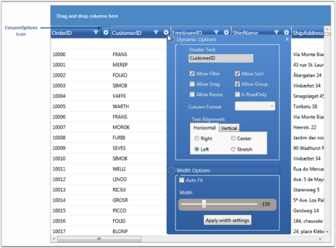 | markdownify }
{:.image }

Customization Options

The following are the column customization options provided by the GridData control.

_Column Option_

<table>
<tr>
<td>
Column Option</td><td>
Description</td></tr>
<tr>
<td>
Allow Filter</td><td>
Selecting this check box, enables filtering on the respective column. To enable "filtering" on all the columns in the grid at once, set the ShowFilters property to true.</td></tr>
<tr>
<td>
Allow Sort</td><td>
Selecting this check box, enables sorting when the user clicks on the column header of the respective column. To enable "sorting" on all the columns in the grid at once, set the AllowSort property to {{ '_true_' | markdownify }}.</td></tr>
<tr>
<td>
Allow Drag</td><td>
Selecting this check box, enables you to rearrange columns in the grid by dragging the desired column headers. Also you can group the columns by dragging the column headers onto the Group Drop Area. Note that the "Allow Group" option must be set to {{ '_true_' | markdownify }} for this to take effect.To enable "drag-and-drop" feature on all the columns in the grid at once, set the AllowDragColumns property to {{ '_true_' | markdownify }}.</td></tr>
<tr>
<td>
Allow Group</td><td>
Selecting this check box, enables you to create groups at run time by dragging column headers onto the Group Drop Area. Note that the "Allow Drag" option must be set to {{ '_true_' | markdownify }} for this to take effect.To enable "grouping" on all the columns in the grid at once, set the ShowGroupDropArea to {{ '_true_'| markdownify }}.</td></tr>
<tr>
<td>
Allow Resize</td><td>
Selecting this check box, enables you to resize columns in the grid, by pressing and dragging the "mouse-resize" pointer that is displayed over the column divider. To enable the "resizing" operation on all the columns in the grid at once, set the AllowResizeColumns property to {{ '_true_' | markdownify }}.</td></tr>
<tr>
<td>
Is ReadOnly</td><td>
Selecting this check box, makes the respective column read-only, allowing no edits to be performed on the column. To enable the "editing" operation on all the columns in the grid at once, set the AllowEdit property to {{ '_true_' | markdownify }}.</td></tr>
<tr>
<td>
Column Format</td><td>
This drop-drown menu lists the available data formats for the respective columns types.</td></tr>
<tr>
<td>
Text Alignment</td><td>
This option enables to align text both horizontally and vertically.</td></tr>
<tr>
<td>
Auto Fit</td><td>
Selecting this check box, adjusts the width of the corresponding column to fit its content and clearing it resets the column width to its default value (i.e., DefaultColumnWidth value). Note that you must click the Apply width settings button for this option to take effect.</td></tr>
<tr>
<td>
Width</td><td>
You can select the appropriate width for the respective column by pressing and dragging the slider handle with the mouse and clicking the Apply width settings button.</td></tr>
</table>

#### Summaries

GridDataControl provides support to add additional rows at the bottom of the grid table. Such rows are fixed and are used to brief information about the grid data, called Summaries. For instance, you can display the record count or maximum value as summary.

The following are the built-in summary types supported by grid. They are otherwise called as basic summaries.

* CountAggregate
* Int32Aggregate
* DoubleAggregate
* CustomAggregate (used with custom summaries)

SummaryRows Collection

Grid provides three kinds of SummaryRows collections – SummaryRows, TableSummaryRows and CaptionSummaryRows, in order to separate the summary kinds. This collection stores all the summaries for a given grid, in which each entry corresponds to a summary row holding the various summary details such as summary title, summary style, its visibility, and more importantly the SummaryColumns collection.

SummaryColumns Collection

Every summary row contains a corresponding SummaryColumns collection. This collection stores the group of columns whose values are used for the summary calculation. As this is a collection of columns, you could infer that summaries can be calculated from more than one column. This collection explores the properties that are essential for generating summary information. The following are some of the properties that are used to generate the summary information.

* MappingName: mapping name of the column used
* Format: summary format, for example, "{SUM=##.00}"
* SummaryType: built-in summary type

This section comprises the following topics:

##### Creating Summaries

The following steps illustrate how to create a Summary.

1. Define the summary column that is used to calculate the summary. 
2. Then define a summary row and associate the above summary column with this summary row.
3. Finally add the summary row into the corresponding SummaryRows collection. Make sure that the appropriate summary type is enabled.

These steps have been clearly explained for individual summary types.

See Also

Group Summaries, Table Summaries, Caption Summaries, Custom Summaries

#####  Summary Types

Essential Grid supports the following summary types.

###### Group Summaries

As the name implies, the Group Summary is associated with every grid group. The GridDataControl.SummaryRows manages summaries of this type. It provides support to add multiple summaries, i.e., you can have more than one summary row for every group. These summaries are enabled by setting the ShowGroupSummaries property to _true_.

[XAML]

<syncfusion:GridDataControl x:Name="dataGrid" ShowGroupDropArea="True" AutoPopulateRelations="False" ShowAddNewRow="False"

ItemsSource="{StaticResource ordersSource}" ShowGroupSummaries="True">

&lt;syncfusion:GridDataControl.SummaryRows&gt;

&lt;syncfusion:GridDataSummaryRow ShowSummaryInRow="True" Title="Total Freight: {FreightSummary} For {CountSummary} Items" TitleColumnCount="2"&gt;

&lt;syncfusion:GridDataSummaryRow.SummaryColumns&gt;

<syncfusion:GridDataSummaryColumn Name="FreightSummary" MappingName="Freight" SummaryType="Int32Aggregate"

Format="'{Sum:c}'"/>

<syncfusion:GridDataSummaryColumn Name="CountSummary" MappingName="OrderDate" SummaryType="CountAggregate"

Format="'{Count:d}'"/>

&lt;/syncfusion:GridDataSummaryRow.SummaryColumns&gt;

&lt;/syncfusion:GridDataSummaryRow&gt;

&lt;/syncfusion:GridDataControl.SummaryRows&gt;

&lt;/syncfusion:GridDataControl&gt;

[C#]

this.dataGrid.SummaryRows.Add(new GridDataSummaryRow()

{

    ShowSummaryInRow = true,

    Title = "Total Freight: {FreightSummary} For {CountSummary} Items",

    TitleColumnCount = 2,

    SummaryColumns = new ObservableCollection<GridDataSummaryColumn>()

    {

        new GridDataSummaryColumn()

        { 

            Name = "FreightSummary", 

            MappingName="Freight", 

            SummaryType= GridDataSummaryType.Int32Aggregate, 

            Format="{Sum:c}"

        },

        new GridDataSummaryColumn()

        {

            Name = "CountSummary", 

            MappingName="OrderDate", 

            SummaryType= GridDataSummaryType.CountAggregate, 

            Format="{Count:d}"

        }

    }

});

{ 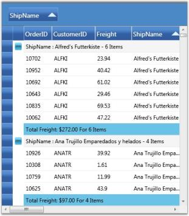 | markdownify }
{:.image }

Combining Summary Column Values in the GridDataControl

GridDataControl enables to combine summary values in summary columns and display them in a single summary row.

For example, let us consider you want to combine the summaries from all the summary columns and display them in a single row, instead of displaying them in the individual summary columns. In such a case, you must set the ShowSummaryInRow property to _true_ and provide a proper summary title string specifying the combined summary value. The following code example illustrates this.

[XAML]

&lt;syncfusion:GridDataControl.SummaryRows&gt;

    &lt;syncfusion:GridDataSummaryRow ShowSummaryInRow="True" Title="'Charges - {FreightSummary}$ for {OrderCount} Items'"&gt;

        &lt;syncfusion:GridDataSummaryRow.RowStyle&gt;

            &lt;syncfusion:GridDataStyleInfo Background="Yellow" /&gt;

        &lt;/syncfusion:GridDataSummaryRow.RowStyle&gt;

        &lt;syncfusion:GridDataSummaryRow.SummaryColumns&gt;

            <syncfusion:GridDataSummaryColumn Name="FreightSummary" MappingName="Freight" SummaryType="Int32Aggregate"

            Format="'{Sum:##.00}'" />

            <syncfusion:GridDataSummaryColumn Name="OrderCount" MappingName="OrderDate" SummaryType="CountAggregate"

            Format="'{Count}'" />

        &lt;/syncfusion:GridDataSummaryRow.SummaryColumns&gt;

    &lt;/syncfusion:GridDataSummaryRow&gt;

&lt;/syncfusion:GridDataControl.SummaryRows&gt;

{ 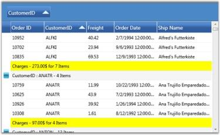 | markdownify }
{:.image }

{  | markdownify }
{:.image }

See Also

Table Summaries, Caption Summaries

###### Table Summaries

The Table Summary is associated with the whole grid table itself. The GridDataControl.TableSummaryRows collection manages summaries of this type. It provides support to add multiple summaries. These summaries are enabled by setting the ShowTableSummariesproperty to true.

[XAML]

<syncfusion:GridDataControl x:Name="dataGrid" ShowGroupDropArea="True" AutoPopulateRelations="False" ShowAddNewRow="False"

ItemsSource="{StaticResource ordersSource}" ShowTableSummaries="True">

    &lt;syncfusion:GridDataControl.TableSummaryRows&gt;

        &lt;syncfusion:GridDataSummaryRow ShowSummaryInRow="True" Title="Total Freight: {FreightSummary} For {CountSummary} Items"                   TitleColumnCount="2"&gt;

            &lt;syncfusion:GridDataSummaryRow.SummaryColumns&gt;

                <syncfusion:GridDataSummaryColumn Name="FreightSummary" MappingName="Freight" SummaryType="Int32Aggregate"

                Format="'{Sum:c}'" />

                <syncfusion:GridDataSummaryColumn Name="CountSummary" MappingName="OrderDate" SummaryType="CountAggregate"

                Format="'{Count:d}'" />

            &lt;/syncfusion:GridDataSummaryRow.SummaryColumns&gt;

        &lt;/syncfusion:GridDataSummaryRow&gt;

    &lt;/syncfusion:GridDataControl.TableSummaryRows&gt;

&lt;/syncfusion:GridDataControl&gt;

[C#]

this.dataGrid.TableSummaryRows.Add(new GridDataSummaryRow()

{

    ShowSummaryInRow = true,

    Title = "Total Freight: {FreightSummary} For {CountSummary} Items",

    TitleColumnCount = 2,

    SummaryColumns = new ObservableCollection<GridDataSummaryColumn>()

    {

        new GridDataSummaryColumn()

        { 

            Name = "FreightSummary", 

            MappingName="Freight", 

            SummaryType= GridDataSummaryType.Int32Aggregate, 

            Format="{Sum:c}"

        },

        new GridDataSummaryColumn()

        {

            Name = "CountSummary", 

            MappingName="OrderDate", 

            SummaryType= GridDataSummaryType.CountAggregate, 

            Format="{Count:d}"

        }

    }

});

{  | markdownify }
{:.image }

See Also

Group Summaries, Caption Summaries

###### Caption Summaries

Grid provides built-in support for caption summaries, where the summary values are displayed in the group caption cells. You can have only one caption summary row for a grid table. The GridDataControl.CaptionSummaryRow property is used to set up a caption summary. The caption summary is enabled by setting the ShowGroupSummaryInCaptionproperty to true.

[XAML]

<syncfusion:GridDataControl x:Name="dataGrid" ShowGroupDropArea="True" AutoPopulateRelations="False" ShowAddNewRow="False"

ItemsSource="{StaticResource ordersSource}" ShowGroupSummaryInCaption="True">

    &lt;syncfusion:GridDataControl.CaptionSummaryRow&gt;

        &lt;syncfusion:GridDataSummaryRow ShowSummaryInRow="True" Title="Total Freight: {FreightSummary} For {CountSummary} Items"                   TitleColumnCount="2"&gt;

            &lt;syncfusion:GridDataSummaryRow.SummaryColumns&gt;

                <syncfusion:GridDataSummaryColumn Name="FreightSummary" MappingName="Freight" SummaryType="Int32Aggregate"

                Format="'{Sum:c}'" />

                <syncfusion:GridDataSummaryColumn Name="CountSummary" MappingName="OrderDate" SummaryType="CountAggregate"

                Format="'{Count:d}'" />

            &lt;/syncfusion:GridDataSummaryRow.SummaryColumns&gt;

        &lt;/syncfusion:GridDataSummaryRow&gt;

    &lt;/syncfusion:GridDataControl.CaptionSummaryRow&gt;

&lt;/syncfusion:GridDataControl&gt;

[C#]

this.dataGrid.ShowGroupSummaryInCaption = true;

this.dataGrid.CaptionSummaryRow = new GridDataSummaryRow()

{

    ShowSummaryInRow = true,

    Title = "Total Freight: {FreightSummary} For {CountSummary} Items",

    TitleColumnCount = 2,

    SummaryColumns = new ObservableCollection<GridDataSummaryColumn>()

    {

        new GridDataSummaryColumn()

        { 

            Name = "FreightSummary", 

            MappingName="Freight", 

            SummaryType= GridDataSummaryType.Int32Aggregate, 

            Format="{Sum:c}"

        },

        new GridDataSummaryColumn()

        {

            Name = "CountSummary", 

            MappingName="OrderDate", 

            SummaryType= GridDataSummaryType.CountAggregate, 

            Format="{Count:d}"

        }

    }

};

{  | markdownify }
{:.image }

See Also

Group Summaries, Table Summaries

##### Custom Summaries

You can also impose custom calculation logic for deriving summary information. This is done by implementing the IGridDataSummaryAggregate interface to define the custom logic, and associating this custom logic to the SummaryColumn.CustomAggregate property. The IGridDataSummaryAggregate interface aids in building user-defined logic for summary calculation. 

The following steps illustrate the functioning of the IGridDataSummaryAggregate interface.

1. First, you need to define a custom property to get and set the summary value.
2. Then implement the CalculateAggregateFunc interface method and in-place your own logic of calculating the summary value. It returns a System.Action<T1, T2, T3> delegate for the aggregate, where T1 represents the source list of items for which the summary needs to be calculated, T2 specifies the property (summary column) and T3 is the Property Descriptor of the custom aggregate class itself. The CalculateAggregateFunc calculates the summary value using these parameters, and assigns the final summary value to the custom property defined in the first step.

The following code example illustrates the partial implementation of the built-in Int32Aggregate that implements the IGridDataSummaryAggregate. It calculates the Sum value for a specific column.

[C#]

class GridDataInt32Aggregate : IGridDataSummaryAggregate

{

public GridDataInt32Aggregate()

{

}

public int Sum

{

get;

set;

}

public Action<IEnumerable, string, PropertyDescriptor> CalculateAggregateFunc()

{

return (items, property, pd) =>

{

if(pd.Name == "Sum")

this.Sum = Convert.ToInt32(items.AsQueryable().Sum(property));

};

}

}

Example

This example uses the Stock Portfolio Database that has a column named "Change" that shows the rate of change of market value of the stocks. Let us consider, you need to display the Standard Deviation of the values of the "Change" column, industry-wise. This can be achieved by using a group summary as the grid is already grouped by Industry. Since the built-in summaries do not support this type of calculation, you have to create custom summaries and write custom code to calculate the standard deviation values. The following steps illustrate this.

1. Define the custom summary logic to calculate the standard deviation.

[C#]

public class CustomAggregate : IGridDataSummaryAggregate

{

    public CustomAggregate()

    {

    }

    public double StdDev

    {

        get;

        set;

    }

    public Action<System.Collections.IEnumerable, string, System.ComponentModel.PropertyDescriptor> CalculateAggregateFunc()

    {

        return (items, property, pd) =>

        {

            var enumerableItems = items as IEnumerable<Quotes>;

            if (pd.Name == "StdDev")

            {

                this.StdDev = enumerableItems.StdDev<Quotes>(q => q.Change);

            }

        };

    }

}

public static class LinqExtensions

{

    public static double StdDev<T>(this IEnumerable<T> values, Func<T, double?> selector)

    {

        double ret = 0;

        var count = values.Count();

        if (count > 0)

        {

            // Compute the Average

            double? avg = values.Average(selector);

            // Perform the Sum of (value-avg)^2

            double sum = values.Select(selector).Sum(d =>

            {

                if (d.HasValue)

                {

                    return Math.Pow(d.Value - avg.Value, 2);

                }

                return 0.0;

            });

            // Put it all together

            ret = Math.Sqrt((sum) / (count - 1));

        }

        return ret;

    }

}

2. Bind the custom summary instance to the grid summary calculation.

[XAML]

&lt;syncfusion:LayoutControl.LeftContent&gt;

            <syncfusion:GridDataControl 

            ItemsSource="{Binding Source={StaticResource Quotes}}" 

            Name="gridDataControl1" 

            ShowGroupSummaries="True"

            ShowGroupSummaryInCaption="False"

            AutoPopulateColumns="True"

            AutoPopulateRelations="False"

            ShowAddNewRow="False"

            AllowEdit="False"

            AllowDelete="False">

                &lt;syncfusion:GridDataControl.GroupedColumns&gt;

                    &lt;syncfusion:GridDataGroupColumn ColumnName="Industry_IndustryID"  /&gt;

                &lt;/syncfusion:GridDataControl.GroupedColumns&gt;

                &lt;syncfusion:GridDataControl.SummaryRows&gt;

                    &lt;syncfusion:GridDataSummaryRow Name="StdDev" ShowSummaryInRow="False" Title="'{Name} - {Count} Items'" TitleColumnCount="2"&gt;

                        &lt;syncfusion:GridDataSummaryRow.SummaryColumns&gt;

                            &lt;syncfusion:GridDataSummaryColumn Name="StdDevCol" MappingName="Change" SummaryType="Custom" Format="'StdDev ({StdDev})'" CustomAggregate="{Binding Source={StaticResource stdDevAggregate}}"&gt;

                                &lt;syncfusion:GridDataSummaryColumn.ColumnStyle&gt;

                                    &lt;syncfusion:GridDataStyleInfo Background="Pink" HorizontalAlignment="Center" /&gt;

                                &lt;/syncfusion:GridDataSummaryColumn.ColumnStyle&gt;

                            &lt;/syncfusion:GridDataSummaryColumn&gt;

                        &lt;/syncfusion:GridDataSummaryRow.SummaryColumns&gt;

                    &lt;/syncfusion:GridDataSummaryRow&gt;

                &lt;/syncfusion:GridDataControl.SummaryRows&gt;

        &lt;/syncfusion:GridDataControl&gt;

{  | markdownify }
{:.image }

See Also

Creating Summaries

##### Summary Style

You can customize the appearance of summary cells by applying the desired formatting settings to the GridDataSummaryColumn.ColumnStyle and GridDataSummaryRow.RowStyle properties. The following code example illustrates this.

[XAML]

&lt;syncfusion:GridDataSummaryRow&gt;

    &lt;syncfusion:GridDataSummaryRow.SummaryColumns&gt;

        &lt;syncfusion:GridDataSummaryColumn&gt;

            &lt;syncfusion:GridDataSummaryColumn.ColumnStyle&gt;

                &lt;syncfusion:GridDataStyleInfo Background="LightPink" Foreground="MidnightBlue" /&gt;

            &lt;/syncfusion:GridDataSummaryColumn.ColumnStyle&gt;

        &lt;/syncfusion:GridDataSummaryColumn&gt;

    &lt;/syncfusion:GridDataSummaryRow.SummaryColumns&gt;

    &lt;syncfusion:GridDataSummaryRow.RowStyle&gt;

        &lt;syncfusion:GridDataStyleInfo Background="LightGreen" /&gt;

    &lt;/syncfusion:GridDataSummaryRow.RowStyle&gt;

&lt;/syncfusion:GridDataSummaryRow&gt;

[C#]

GridDataSummaryColumn summaryCol = new GridDataSummaryColumn();

summaryCol.ColumnStyle = new GridDataStyleInfo();

summaryCol.ColumnStyle.Background = new SolidColorBrush(Colors.LightPink);

summaryCol.ColumnStyle.Foreground = new SolidColorBrush(Colors.MidnightBlue);

GridDataSummaryRow summaryRow = new GridDataSummaryRow();

summaryRow.SummaryColumns.Add(summaryCol);

summaryRow.RowStyle = new GridDataStyleInfo();

summaryRow.RowStyle.Background = new SolidColorBrush(Colors.LightGreen);

{  | markdownify }
{:.image }

#### Hierarchy

GridData control can display nested tables in a hierarchy using a master-detail configuration. In a hierarchical view, all the tables in the data source are inter-connected by means of relations. Generally a relation between any two tables can take one of the following forms: 

* 1:1 (One parent record to one child record) 
* 1:n (One parent record to n child records)
* n:1 (n parent records to one child record)
* n:n (n parent record to n child records)

where n is a number of records in a table

With the nested tables (one table nested inside another table), each record in the parent table has an ssociated set of records in the child table. Every record in the relation is provided with +/- button called RecordPlusMinus that can be expanded and collapsed to bring the underlying records in the child table for display. The number of tables that can be nested with relations using a GridData control is unlimited.

The Relations Collection

A relation can be created by defining a GridDataRelation and adding it into the Grid.Relations property. This property is an Observable collection of GridDataRelation objects. It manages the entire relations for a grid. The GridDataRelation instance defines a grid relation in the following properties.

_Properties_

<table>
<tr>
<td>
Property</td><td>
Description</td></tr>
<tr>
<td>
RelationalColumn</td><td>
Specifies the column that defines the relation.</td></tr>
<tr>
<td>
RelationType</td><td>
Specifies the type of relation. Currently, only MasterDetails type relation is supported.</td></tr>
<tr>
<td>
TableProperties</td><td>
Used to set the table properties of the child table.</td></tr>
</table>

Example

The following code snippet illustrates how to create a relational column: 

[C#]

//Fetching parent table.

DataSet ds = new DataSet();

            using (SqlCeConnection con = new SqlCeConnection(string.Format(@"Data Source = {0}", LayoutControl.FindFile("Northwind.sdf"))))

            {

                con.Open();

                SqlCeDataAdapter sda = new SqlCeDataAdapter("SELECT * FROM Employees", con);

                sda.Fill(ds, "Employees");

            }

//Fetching child table.

            using (SqlCeConnection con1 = new SqlCeConnection(string.Format(@"Data Source = {0}", LayoutControl.FindFile("Northwind.sdf"))))

            {

                con1.Open();

                SqlCeDataAdapter sda1 = new SqlCeDataAdapter("SELECT * FROM Orders", con1);

                sda1.Fill(ds, "Orders");

            }

//Adding relation.

            ds.Relations.Add(new DataRelation("Employee_Orders", ds.Tables[0].Columns["Employee ID"], ds.Tables[1].Columns["Employee ID"]));

The following code illustrates binding of the above relation to the grid, and also customizing the child table:

[XAML]

&lt;syncfusion:GridDataControl x:Name="dataGrid"  AutoPopulateColumns="False" AutoPopulateRelations="False" ItemsSource="{StaticResource orderSource}"&gt; ShowAddNewRow="False">

&lt;syncfusion:GridDataControl.Relations &gt;

    &lt;syncfusion:GridDataRelation RelationalColumn="Employee_Orders" RelationType="MasterDetails" &gt;

        &lt;syncfusion:GridDataRelation.TableProperties&gt;

            &lt;syncfusion:GridDataTableProperties AutoPopulateColumns="True" AlternatingRowBackground="BlanchedAlmond" RowBackground="Beige" &gt;

            &lt;/syncfusion:GridDataTableProperties&gt;

        &lt;/syncfusion:GridDataRelation.TableProperties&gt;

     &lt;/syncfusion:GridDataRelation&gt;

&lt;/syncfusion:GridDataControl.Relations&gt;        

&lt;/syncfusion:GridDataControl&gt;

The following image shows the output of the above given code:

{  | markdownify }
{:.image }

The preceding screenshot shows a GDC bound with a nested table whose child table is set with a customized background. 

Auto Generate Relations

The grid can automatically detect the data relations in a data set for display. By default, a relation is created for each such data relation found in the data set. Hence the data relations defined in a data set are sufficient enough for the grid. 

To auto-generate the relations, set the AutoPopulateRelations property of the GridData control to _true_.

[XAML]

&lt;syncfusion:GridDataControl x:Name="dataGrid"  AutoPopulateColumns="True"     AutoPopulateRelations="True" ItemsSource="{StaticResource orderSource}"&gt; ShowAddNewRow="False"/>

#### Stacked Headers

Essential Grid allows you to have additional unbound header rows, called Stacked Header Rows that span across visible grid columns. You can group one or more columns under each stacked header. 

The StackedHeaderRows Collection

Stacked Header rows for a given grid are gathered under Grid.StackedHeaderRow collection. This collection contains the property definitions that control the behavior and appearance of the Stacked Headers. A StackedHeaderRow collection can be viewed as a set of stacked header rows in which each header row contains a collection of stacked headers, which span across multiple columns. 

Every stacked header row is defined by a GridDataStackedHeaderRow. This class contains a property named Columns that is a collection of GridDataStackedHeaderColumn objects and this collection contains an entry for each stacked header. 

Following are the properties of the GridDataStackedHeaderColumn:

_Property_

<table>
<tr>
<td>
Property</td><td>
Description</td></tr>
<tr>
<td>
ColumnSpan</td><td>
Specifies the number of columns that a particular stacked header should span.</td></tr>
<tr>
<td>
ColumnStyle</td><td>
Specifies the style for the stacked header column.</td></tr>
<tr>
<td>
HeaderText</td><td>
Specifies the header text for the stacked header.</td></tr>
<tr>
<td>
VisibleColumns</td><td>
Specifies the collection of visible columns under the stacked header.</td></tr>
</table>

Example

The following code example illustrates the creation of two stacked headers:

[XAML]

<syncfusion:GridDataControl x:Name="dataGrid2" AutoPopulateColumns="True" AutoPopulateRelations="False" 

                                    ItemsSource="{StaticResource ordersSource}">

            &lt;syncfusion:GridDataControl.StackedHeaderRows&gt;

               &lt;syncfusion:GridDataStackedHeaderRow Name="Row1"&gt;

                  &lt;syncfusion:GridDataStackedHeaderRow.Columns&gt;

                      &lt;syncfusion:GridDataStackedHeaderColumn HeaderText="Header 1" Name="Header1" ColumnSpan="3" /&gt;

                      &lt;syncfusion:GridDataStackedHeaderColumn HeaderText="Header 2" Name="Header2" ColumnSpan="2" /&gt;

                   &lt;/syncfusion:GridDataStackedHeaderRow.Columns&gt;

               &lt;/syncfusion:GridDataStackedHeaderRow&gt;

            &lt;/syncfusion:GridDataControl.StackedHeaderRows &gt;

&lt;/syncfusion:GridDataControl&gt;

Output of the above given code is the following image:

{  | markdownify }
{:.image }

The preceding screenshot shows a GridData control with stacked headers.

#### Expression Fields

Expression Fields enable you to add a column that holds calculated values based on other fields in the same record. These expression columns are created in the same way as any unbound column, by using the GridDataUnboundVisibleColumn class. This contains the Expression property that needs to be set with a non-null value for an expression column. Expressions can include arithmetic, logical, relational, and few string operators that finally gets translated into LINQ expressions for evaluation.

The following table lists the supported operators and examples for each.

_Supported Operators_

<table>
<tr>
<td>
Expression</td><td>
Syntax</td><td>
Description</td><td>
Example Usage</td></tr>
<tr>
<td>
Mod</td><td>
%</td><td>
Divides first argument by second argument and returns remainder.</td><td>
[UnitPrice] % 10</td></tr>
<tr>
<td>
Multiplication, Division</td><td>
*,/</td><td>
Multiplies/Divides first argument by second argument.</td><td>
[QunatityPerUnit] * [UnitsInStock]</td></tr>
<tr>
<td>
Addition, Subtraction</td><td>
+,-</td><td>
Adds first argument with second argument/Subtracts second argument from the first one.</td><td>
[UnitsInStock]+[Quantity]</td></tr>
<tr>
<td>
Or</td><td>
OR</td><td>
Returns 1 if either the first argument or the second one returns true.</td><td>
[Val]=50 OR [Val]=100</td></tr>
<tr>
<td>
And</td><td>
AND</td><td>
Returns 1 if both parameters return true.</td><td>
[Val]< 50 AND [Val]>100</td></tr>
<tr>
<td>
Less than</td><td>
<</td><td>
Returns true if first parameter is less than the second one.</td><td>
[OrderID] < 2000</td></tr>
<tr>
<td>
Greater than</td><td>
></td><td>
Returns true if first parameter is greater than the second one.</td><td>
[OrderID] > 2500</td></tr>
<tr>
<td>
Less than Or Equal to</td><td>
<=</td><td>
Returns true if first parameter is less than or equal to the second one.</td><td>
[OrderID] <= 2050</td></tr>
<tr>
<td>
Greater than Or Equal to</td><td>
>=</td><td>
Returns true if first parameter is greater than or equal to the second one.</td><td>
[OrderID] >= 2056</td></tr>
<tr>
<td>
Equal</td><td>
=</td><td>
Returns true if both arguments have same value.</td><td>
[CustomerID] = 90</td></tr>
<tr>
<td>
Not Equal to</td><td>
&lt;&gt;</td><td>
Returns true if both arguments does not have same value.</td><td>
[CustomerID] &lt;&gt; 95</td></tr>
<tr>
<td>
StartsWith</td><td>
StartsWith</td><td>
Returns true if the value starts with the given string.</td><td>
ProductName StartsWith Chai</td></tr>
<tr>
<td>
EndsWith</td><td>
EndsWith</td><td>
Returns true if the value ends with the specified string.</td><td>
PruductName EndsWith i</td></tr>
<tr>
<td>
Contains</td><td>
Contains</td><td>
Returns true if the value contains the specified string.</td><td>
ProductName Contains hai</td></tr>
</table>
Example

1. Instantiate a GridDataControl and bind it to a data source.

[XAML]

<syncfusion:GridDataControl x:Name="dataGrid" ShowAddNewRow="False" ShowFilters="False" AutoPopulateColumns="False"

AutoPopulateRelations="False" ItemsSource="{StaticResource productsSource}" ShowGroupDropArea="True">

&lt;/syncfusion:GridDataControl&gt;

2. Add an unbound visible column and set its Expression property to the desired formula expression. The unbound visible column also contains the CaseSensitive property that makes the column names specified in the expression, case sensitive, when set to true. If necessary, you can also customize the expression like any other visible column.

[XAML]

&lt;syncfusion:GridDataControl.VisibleColumns&gt;

    &lt;syncfusion:GridDataUnboundVisibleColumn MappingName="100UnitPrice" HeaderText="Price of 100 units" Expression="UnitPrice * 100"&gt;

        &lt;syncfusion:GridDataUnboundVisibleColumn.ColumnStyle&gt;

            &lt;syncfusion:GridDataColumnStyle Background="PeachPuff"/&gt;

        &lt;/syncfusion:GridDataUnboundVisibleColumn.ColumnStyle&gt;

    &lt;/syncfusion:GridDataUnboundVisibleColumn&gt;

&lt;/syncfusion:GridDataControl.VisibleColumns&gt;

{  | markdownify }
{:.image }

Accessing Expression Values

You can use the GetUnboundValue method of Grid Table to access the computed expression value of a particular unbound cell. This is an overloaded method with the following prototypes:

* GetUnboundValue(RecordIndex, GridDataUnboundVisibleColumn)
* GetUnboundValue(RowIndex, ColumnIndex)

The following code example illustrates how to use this method.

[C#]

// Retrieve the expression value by using row and column indices.

object value = this.dataGrid.Model.Table.GetUnboundValue(5, 5);

#### ToolTips

Essential Grid provides support to associate individual cells with ToolTips. ToolTip is a small pop-up box that appears when you move the mouse over a visual element. It is used to display additional information about the elements without increasing the window size. They are mainly used to display some text data. You can also place any style content such as a group of lines of text, an image, or any control into the tooltip host.

Grid exposes a style property named TooltipTemplateKey that is the name of the template to be used for generating tooltip. You can define this template in xaml and then simply assign its name to the style.TooltipTemplateKey property. This infers that any style content that is defined in this template could be used to display the tooltip. Once the template is defined, you need to enable its display by setting the style.ShowTooltip property to true. 

> _Note: If style.ShowToolip is not set, then the default template associated with the Grid is loaded, and the default template would try to show the style.CellValue in a tooltip._

Example

The example below displays a Chart control in the tooltip host. The grid is bound to the Customers table in which the second column is assigned with a tooltip template that holds a data bound chart for tooltip display. Follow the steps below:

1. Define a Template for ToolTip as shown in the following code:

[XAML]

&lt;DataTemplate x:Key="chartTemplate"&gt;

    &lt;syncfusion:Chart Grid.Row="1" Name="Chart1" Height="400" Width="400" syncfusion:SkinStorage.VisualStyle="Office2007Blue"&gt;

        &lt;!--Chart Legend declaration--&gt;

        &lt;syncfusion:Chart.Legends&gt;

            &lt;syncfusion:ChartLegend syncfusion:ChartDockPanel.Dock="Bottom"/&gt;

        &lt;/syncfusion:Chart.Legends&gt;

        &lt;!--Chart area to present chart segments.--&gt;

        &lt;syncfusion:ChartArea FontWeight="Bold" FontSize="14" &gt;

            &lt;!--X-axis declaration with required property settings.--&gt;

            &lt;syncfusion:ChartArea.PrimaryAxis &gt;

                &lt;!--Assigning text for the labels in the Primary Axis with the Product name.--&gt;

                &lt;syncfusion:ChartAxis  Header="Category" PositionPath="CategoryID" ContentPath="CategoryName" RangePadding="None"                         LabelRotateAngle="270" LabelsSource="{Binding ItemsSource.Categories}"/&gt;

            &lt;/syncfusion:ChartArea.PrimaryAxis&gt;

            &lt;!--Y-axis declaration with required property settings.--&gt;

            &lt;syncfusion:ChartArea.SecondaryAxis&gt;

                &lt;syncfusion:ChartAxis Header="Product"  RangePadding="None" /&gt;

            &lt;/syncfusion:ChartArea.SecondaryAxis&gt;

            &lt;!-- Binding data to the series from the database.--&gt;

            <syncfusion:ChartSeries Type="Column" Label="Categories List" BindingPathsY="Count"

            Interior="{StaticResource SeriesBInterior}" DataSource="{Binding ItemsSource}" />

        &lt;/syncfusion:ChartArea&gt;

    &lt;/syncfusion:Chart&gt;

&lt;/DataTemplate&gt;

2. Associating the above template with the Grid Cell as shown in the following code:

[C#]

var style = model[1, 2];

// Enable tooltip.

style.ShowTooltip = true;

style.CellValue = customer.ContactName;

var cust = customer.Orders.Select(o => o.OrderDetails.Select(od => od.Products).Select(p => p.Categories)).ToList();

var finalList = cust.Select(c => new

{

    Count = c.Count(),

    Categories = c

}).ToList();

style.ItemsSource = finalList;

// Assign template.

style.TooltipTemplateKey = "chartTemplate";

Here is a sample screenshot.

{  | markdownify }
{:.image }

> _Note: For the complete code, refer to the following browser sample._

_...\My Documents\Syncfusion\EssentialStudio\&lt;Version Number&gt;\WPF\Grid.WPF\Samples\3.5\WindowsSamples\Product Showcase\Tooltips Demo._

#### Cell Comments

Essential Grid supports the association of individual cells with Cell Comments.

Comments are notes used to provide context to your data in grid cells. They are used to display information about a cell or range of cells. Text in the comments can be placed as rich text format to emphasize a comment for a cell. You can also place content such as a group of lines (text), an image, or a control into the comment host.

There are two properties that are used to set a Comment for the cells:

* Comment Property
* CommentTemplateKey Property

Comment Property

Comment is a string type property. You can set a comment using this property for cells. The default Data Template is displayed with the comment text.

Example

The following code example illustrates how to display a comment in the default comment Data Template.

[C#]

style.Comment = style.Text;

[VB.NET]

style.Comment = style.Text

{  | markdownify }
{:.image }

CommentTemplateKey Property

Grid exposes a style property named CommentTemplateKey that is the name of the template to be used for generating Comment. You can define this template in XAML and assign its name to the style.CommentTemplateKey property. This ensures that any style content defined in the template can be used to display the comment.

Example

The following code example illustrates how to display a Chart control in the comment host. The grid is bound to the 'Customers' table in which the second column is assigned with a comment template that holds a data bound chart for comment display.

The following steps illustrate the same:

1. Define a Template for Comments.

[XAML]

&lt;DataTemplate x:Key="chartTemplate"&gt;

    &lt;syncfusion:Chart Grid.Row="1" Name="Chart1" Height="400" Width="400" syncfusion:SkinStorage.VisualStyle="Office2007Blue"&gt;

        &lt;!--Chart Legend declaration.--&gt;

        &lt;syncfusion:Chart.Legends&gt;

            &lt;syncfusion:ChartLegend syncfusion:ChartDockPanel.Dock="Bottom"/&gt;

        &lt;/syncfusion:Chart.Legends&gt;

        &lt;!--Chart Area to present Chart Segments.--&gt;

        &lt;syncfusion:ChartArea FontWeight="Bold" FontSize="14" &gt;

            &lt;!--X-axis declaration with required property settings.--&gt;

            &lt;syncfusion:ChartArea.PrimaryAxis &gt;

                &lt;!--Assigning text for the labels in the Primary Axis with the product name.--&gt;

                &lt;syncfusion:ChartAxis Header="Category" PositionPath="CategoryID" ContentPath="CategoryName" RangePadding="None"                         LabelRotateAngle="270" LabelsSource="{Binding ItemsSource.Categories}"/&gt;

            &lt;/syncfusion:ChartArea.PrimaryAxis&gt;

            &lt;!--Y-axis declaration with required property settings.--&gt;

            &lt;syncfusion:ChartArea.SecondaryAxis&gt;

                &lt;syncfusion:ChartAxis Header="Product" RangePadding="None" /&gt;

            &lt;/syncfusion:ChartArea.SecondaryAxis&gt;

            &lt;!-- Binding data to the series from the database.--&gt;

            <syncfusion:ChartSeries Type="Column" Label="Categories List" BindingPathsY="Count"

            Interior="{StaticResource SeriesBInterior}" DataSource="{Binding ItemsSource}" />

        &lt;/syncfusion:ChartArea&gt;

    &lt;/syncfusion:Chart&gt;

&lt;/DataTemplate&gt;

2.  Associate the above template with the Grid Cell.

[C#]

var style = model[1, 2];

style.CellValue = customer.ContactName;

var cust = customer.Orders.Select(o => o.OrderDetails.Select(od => od.Products).Select(p => p.Categories)).ToList();

var finalList = cust.Select(c => new

{

Count = c.Count(),

Categories = c

}).ToList();

style.ItemsSource = finalList;

// Assign template.

style.CommentTemplateKey = "chartTemplate";

[VB.NET]

Dim style = model(1, 2)

style.CellValue = customer.ContactName

Dim cust = customer.Orders.Select(Function(o) o.OrderDetails.Select(Function(od) od.Products).Select(Function(p) p.Categories)).ToList()

Dim finalList = cust.Select(Function(c) New With {Key .Count = c.Count(), Key .Categories = c}).ToList()

style.ItemsSource = finalList

' Assign template.

style.CommentTemplateKey = "chartTemplate"

{  | markdownify }
{:.image }

Comment Alignment

By using the CommentAlignment property, you can make the cell comments appear at the top-left, top-right, bottom-left or bottom-right corners.

[C#]

style.CommentAlignment = CommentAlignment.Bottom - Left;

[VB.NET]

Style.CommentAlignment = CommentAlignment.Bottom – Left

{  | markdownify }
{:.image }

#### Column Auto Sizing

This feature allows the grid columns to resize themselves automatically to fit the column content. This resize action is performed based on the size of cells, size of header or size of parent control. According to this criterion, the column resize options are defined below in the GridControlLengthUnitType enumeration.

Resize Options

1. GridControlLengthUnitType.Auto

In Auto type, column widths of the Grid control/GridData control are adjusted with respect to the cell and header content, i.e., each column's header length and cell content length is taken into account.

[C#]

this.grid.Model.Options.ColumnSizer = GridControlLengthUnitType.Auto;

[VB.NET]

Me.grid.Model.Options.ColumnSizer = GridControlLengthUnitType.Auto

{  | markdownify }
{:.image }

2. GridControlLengthUnitType.AutoWithLastColumnFill

In AutoWithLastColumnFill type, column width of Grid Control/GridData Control is adjusted with respect to cell and header content. The last column's width fills the unoccupied space in the parent Framework element. 

[C#]

this.grid.Model.Options.ColumnSizer = GridControlLengthUnitType.AutoWithLastColumnFill;

[VB.NET]

Me.grid.Model.Options.ColumnSizer = GridControlLengthUnitType.AutoWithLastColumnFill

{  | markdownify }
{:.image }

3. GridControlLengthUnitType.SizeToCells

In SizeToCells type, column width of Grid Control/GridData Control is adjusted with respect to cell content only.

[C#]

this.grid.Model.Options.ColumnSizer = GridControlLengthUnitType.SizeToCells;

[VB.NET]

Me.grid.Model.Options.ColumnSizer = GridControlLengthUnitType.SizeToCells

{  | markdownify }
{:.image }

4. GridControlLengthUnitType.SizeToHeader

In SizeToHeader type, column widths of Grid Control/GridData Control are adjusted with respect to header content only.

[C#]

this.grid.Model.Options.ColumnSizer = GridControlLengthUnitType.SizeToHeader;

[VB.NET]

Me.grid.Model.Options.ColumnSizer = GridControlLengthUnitType.SizeToHeader

{ 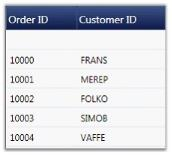 | markdownify }
{:.image }

5. GridControlLengthUnitType.Star

In Star type, column widths are equal and the control and the content occupies total space in the Parent cell. The user need not specify the width for every grid column. They can opt one of these options instead.

[C#]

this.grid.Model.Options.ColumnSizer = GridControlLengthUnitType.Star;

[VB.NET]

Me.grid.Model.Options.ColumnSizer = GridControlLengthUnitType.Star

{  | markdownify }
{:.image }

6. MaxLength

The user can specify the number of rows that should be considered for calculating column widths using MaxLength property. The following code snippet allows the grid to consider only the data of first 12 rows for calculating column widths.

[C#]

grid.Model.Options.MaxLength = 12;

[VB.NET]

grid.Model.Options.MaxLength = 12

####  Look and Feel

This section discusses different ways of enhancing the grid appearance such as, 

* Row styles are used for row-wise formatting
* Conditional Formats apply formatting only when the given criteria is met
* Table Options discuss various options available to customize the table 
* Grid Skins lists the in-built themes supported by the grid
##### Row Styles

There are two ways to format the grid rows. They are, 

* Using properties 
* By handling QueryCellInfo event

Using Properties

You can change the background of the grid rows by setting a color for the RowBackground property. To override the color of the alternative rows in the same grid use the AlternatingRowBackground property. 

The following code illustrates the properties settings.

[C#]

grid.AlternatingRowBackground = new SolidColorBrush(Colors.Orchid);

grid.RowBackground = new SolidColorBrush(Colors.Tan);

The following image corresponds to the output of the above given code:

{  | markdownify }
{:.image }

The row styles of the GDC are customized using background properties.

Using QueryCellInfo Event

QueryCellInfo event is handled whenever a grid cell needs to be redrawn or repainted. In the GDC, you can use Model.QueryCellInfo event to format the rows by checking the row and column indices on the event arguments. 

The following code illustrates this:

[C#]

grid.Model.QueryCellInfo += new GridQueryCellInfoEventHandler(Model_QueryCellInfo);

void Model_QueryCellInfo(object sender, GridQueryCellInfoEventArgs e)

        {

            if (e.Cell.RowIndex > 0)

            {

                if (e.Cell.RowIndex % 2 == 0)

                    e.Style.Background = Brushes.BlanchedAlmond;

                else

                    e.Style.Background = Brushes.LightCyan;

            }

        }

The following image corresponds to the output of the above given code:

{  | markdownify }
{:.image }

The row styles of the GDC are customized by handling the QueryCellInfo event.

##### Conditional Formatting

The GridData control has in-built support for conditional formatting. This feature allows you to format grid cells based on a certain condition. This can be achieved by defining a GridDataConditionalFormat for the grid. Using this class, you can specify the filter criteria for the cells and the style to be applied for the filtered cells. Once these specifications are defined, the given styles are applied to only those cells that satisfy the condition specified.

Conditional formatting can be specified through the GridDataControl.ConditionalFormats property. This is an observable collection, into which you can add required number of formatters of type GridDataConditionalFormat. The filter criteria are specified by the GridDataConditionalFormat.Conditions property that is a collection of GridDataCondition objects. The following table describes the important properties involved:

_Property_

<table>
<tr>
<td>
Property</td><td>
Description</td></tr>
<tr>
<td colspan = "2">
GridDataConditionalFormat</td></tr>
<tr>
<td>
Conditions</td><td>
A collection of filter conditions.</td></tr>
<tr>
<td>
Style</td><td>
A GridDataStyleInfo that should be applied when the given conditions are met.</td></tr>
<tr>
<td>
ApplyStyleToColumn</td><td>
The name of the column to apply the specified style. By default, the style is applied to the entire record row. Once this property is set, the cell corresponding to this column is applied with the style.</td></tr>
<tr>
<td colspan = "2">
GridDataCondition</td></tr>
<tr>
<td>
ColumnName</td><td>
Name of the column whose values should be checked.</td></tr>
<tr>
<td>
ConditionType</td><td>
This field corresponds to one of the following conditional operators:EqualsNot EqualsLess ThanLess Than Or EqualGreater ThanGreater Than Or Equal</td></tr>
<tr>
<td>
Value</td><td>
The value to compare.</td></tr>
<tr>
<td>
PredicateType</td><td>
Specifies the PredicateType that is used to combine more than one condition. There are two types-AND, OR.</td></tr>
</table>

Example

Now, let us consider an example for conditional formatting. The first conditional formatter in the following example specifies the filter criteria, “{Frieght} > 200 OR {Frieght} < 500” that applies Yellow background to the cells satisfying this condition. 

The second conditional formatter indicates the criteria–“{ShipCountry} Equals USA OR {ShipCountry} Equals UK”. If this condition is satisfied, then the given style, Crimson background and White foreground is applied only to the corresponding record’s ShipCountry field, instead of being applied to the entire row.

[XAML]

<syncfusion:GridDataControl x:Name="dataGrid" AutoPopulateColumns="True" 

AutoPopulateRelations="False" ItemsSource="{StaticResource ordersSource}"

ShowGroupDropArea="True" UpdateMode="PropertyChanged">

            &lt;syncfusion:GridDataControl.ConditionalFormats&gt;

                &lt;syncfusion:GridDataConditionalFormat Name="C1"&gt;

                    &lt;syncfusion:GridDataConditionalFormat.Style&gt;

                        &lt;syncfusion:GridDataStyleInfo Background="Yellow" /&gt;

                    &lt;/syncfusion:GridDataConditionalFormat.Style&gt;

                    &lt;syncfusion:GridDataConditionalFormat.Conditions&gt;

                        &lt;syncfusion:GridDataCondition ColumnName="Freight" ConditionType="GreaterThan" Value="200" PredicateType="Or"/&gt;

                        &lt;syncfusion:GridDataCondition ColumnName="Freight" ConditionType="LessThan" Value="500" PredicateType="And"/&gt;

                    &lt;/syncfusion:GridDataConditionalFormat.Conditions&gt;

                &lt;/syncfusion:GridDataConditionalFormat&gt;

                &lt;syncfusion:GridDataConditionalFormat Name="C2" ApplyStyleToColumn="ShipCountry" &gt;

                    &lt;syncfusion:GridDataConditionalFormat.Style&gt;

                        &lt;syncfusion:GridDataStyleInfo Background="Crimson" Foreground="White"  /&gt;

                    &lt;/syncfusion:GridDataConditionalFormat.Style&gt;

                    &lt;syncfusion:GridDataConditionalFormat.Conditions&gt;

                        &lt;syncfusion:GridDataCondition ColumnName="ShipCountry" ConditionType="Equals" Value="USA" PredicateType="Or"/&gt;

                        &lt;syncfusion:GridDataCondition ColumnName="ShipCountry" ConditionType="Equals" Value="UK" PredicateType="Or"/&gt;

                    &lt;/syncfusion:GridDataConditionalFormat.Conditions&gt;

                &lt;/syncfusion:GridDataConditionalFormat&gt;

           &lt;/syncfusion:GridDataControl.ConditionalFormats&gt;

&lt;/syncfusion:GridDataControl&gt;

The following image shows the output of the above given code:

{ 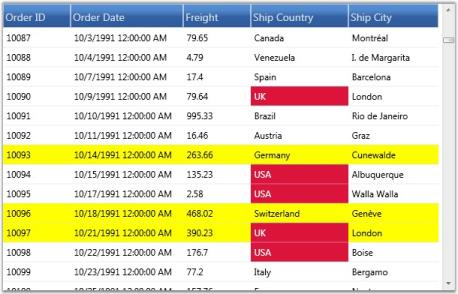 | markdownify }
{:.image }

The preceding screenshot shows a GDC applied with conditional formatting.

##### Table Options

There are numerous options to customize the appearance and behavior of the GridData control. These options are exposed in the following Grid.Model.TableProperties.

_Property_

<table>
<tr>
<td>
Property</td><td>
Description</td></tr>
<tr>
<td>
AllowNewRowPosition</td><td>
Indicates the position of the new row, to be added:TopBottom</td></tr>
<tr>
<td>
AllowDelete</td><td>
Indicates whether the data can be deleted.</td></tr>
<tr>
<td>
AllowDragColumns</td><td>
Allows the user to re-arrange columns, by dragging the headers.</td></tr>
<tr>
<td>
AllowEdit</td><td>
Indicates whether the data can be edited.</td></tr>
<tr>
<td>
AllowGroup</td><td>
Indicates whether the data can be grouped.</td></tr>
<tr>
<td>
AllowResizeColumns</td><td>
Indicates whether the columns can be resized.</td></tr>
<tr>
<td>
AllowResizeRows</td><td>
Indicates whether the rows can be resized.</td></tr>
<tr>
<td>
AllowSort</td><td>
Allows user to sort the columns by clicking the column header.</td></tr>
<tr>
<td>
AlternatingRowBackground</td><td>
Specifies a background brush for alternate rows.</td></tr>
<tr>
<td>
AlternatingRowCount</td><td>
Indicates the row count to apply alternate row styles. Default value is 1.</td></tr>
<tr>
<td>
AutoPopulateColumns</td><td>
If true, the grid is automatically populated with the data columns.</td></tr>
<tr>
<td>
AutoPopulateRelations</td><td>
If true, the grid is automatically loaded with dataset relations.</td></tr>
<tr>
<td>
CaptionSummaryRow</td><td>
Defines the caption summary.</td></tr>
<tr>
<td>
ConditionalFormats</td><td>
Defines the conditional formats for the grid.</td></tr>
<tr>
<td>
DefaultColumnWidth</td><td>
Default width for columns.</td></tr>
<tr>
<td>
DragIndicatorInnerBrush</td><td>
Specifies the inner brush for drag indicator.</td></tr>
<tr>
<td>
DragIndicatorOuterBrush</td><td>
Specifies the outline brush for drag indicator.</td></tr>
<tr>
<td>
GroupCaptionText</td><td>
Specifies the text to display as group caption.</td></tr>
<tr>
<td>
GroupedColumns</td><td>
Defines the grouped columns for the grid.</td></tr>
<tr>
<td>
IsSynchronizedWithCurrentItem</td><td>
If true, keeps any selector-driven control’s current selection synchronized with the selection of the grid.</td></tr>
<tr>
<td>
ItemsSource</td><td>
Specifies the item template to populate the grid.</td></tr>
<tr>
<td>
NotifyPropertyChanges</td><td>
When true, keeps the grid notified of data source changes.</td></tr>
<tr>
<td>
NullFilterText</td><td>
Sets a text to indicate null filter.</td></tr>
<tr>
<td>
PrimaryKeyColumns</td><td>
Holds the primary key columns.</td></tr>
<tr>
<td>
Relations</td><td>
Defines data relations for the grid.</td></tr>
<tr>
<td>
RowBackground</td><td>
Indicates a background brush for entire grid row.</td></tr>
<tr>
<td>
ShowAddNewRow</td><td>
Indicates whether the add new row should be visible.</td></tr>
<tr>
<td>
ShowColumnOptions</td><td>
Indicates whether the column options UI should be allowed.</td></tr>
<tr>
<td>
ShowFilters</td><td>
Indicates whether the filters should be allowed.</td></tr>
<tr>
<td>
ShowGroupCaptionPlusMinus</td><td>
Indicates whether a PlusMinus cell should appear next to group captions.</td></tr>
<tr>
<td>
ShowGroupDropArea</td><td>
Indicates whether the group drop area should be visible.</td></tr>
<tr>
<td>
ShowGroupSummaries</td><td>
Indicates whether the group summaries should be visible.</td></tr>
<tr>
<td>
ShowGroupSummaryInCaption</td><td>
Indicates whether the group summary should be displayed in group caption.</td></tr>
<tr>
<td>
ShowRecordPlusMinus</td><td>
Indicates whether a PlusMinus cell should appear next to the records. It is applicable only for nested tables.</td></tr>
<tr>
<td>
ShowRowHeader</td><td>
Indicates whether the row header column should be visible.</td></tr>
<tr>
<td>
ShowTableSummaries</td><td>
Indicates whether the table summaries should be visible.</td></tr>
<tr>
<td>
SortColumns</td><td>
Defines the sorted columns for the grid.</td></tr>
<tr>
<td>
StackedHeaders</td><td>
Defines the stacked headers for the grid.</td></tr>
<tr>
<td>
SummaryRows</td><td>
Defines the group summary rows for the grid.</td></tr>
<tr>
<td>
TableSummaryRows</td><td>
Defines the table summary rows for the grid.</td></tr>
<tr>
<td>
VisibleColumns</td><td>
Defines the visible columns of the grid.</td></tr>
<tr>
<td>
VisualStyle</td><td>
Specifies the skin for the grid.</td></tr>
</table>
##### Font Settings

The GridData control lets you to set the grid font properties from the root grid. By setting the font related properties in the root GridDataControl instance, you can change the font settings for entire grid cells at once.

##### Skins

GridDataControl implements visual styles that set up a common appearance to all the components in the grid. The term appearance refers not only to the way the grid elements appear but also the manner in which they behave in response to the user interactions like hovering mouse over them, clicking, and so on. Grid has in-built support for the following skins: 

* Default 
* Blend 
* Office2007Blue 
* Office2007Silver 
* Office2007Black 
* BureauBlue
* GlassyGreen
* ShinyBlue
* ShinyRed
* SunBlack 
* TwilightBlue 
* Office14Blue 
* Office14Silver 
* Office14Black 
* VS2010

Use Case Scenarios

Skin provides better look and feel for an application.

Sample Link

Blend Styling Demo sample in the sample browser is purely customized in XAML through GridDataStyleManager class. To access Blend Styling Demo:

1. Open Syncfusion Dashboard.
2. Select User Interface.
3. Select WPF drop-down list and select Run Locally Installed Samples.
4. Select GridDataControl.
5. In Visual styles menu, select Grid Visual style Demo.
###### Adding Skin to an Application 

Visual styles can be set for a grid by using the VisualStyle property. The following code illustrates this: 

[XAML]

&lt;syncfusion:GridDataControl x:Name="dataGrid2" AutoPopulateColumns="False" AutoPopulateRelations="False"  ItemsSource="{StaticResource ordersSource}" syncfusion:SkinStorage.VisualStyle="Office2007Blue" /&gt;

[C#]

SkinStorage.SetVisualStyle(dataGrid2, "Office2007Blue");

 The following images show different visual styles applied to the grid.

{  | markdownify }
{:.image }

{  | markdownify }
{:.image }

{  | markdownify }
{:.image }

{  | markdownify }
{:.image }

{ 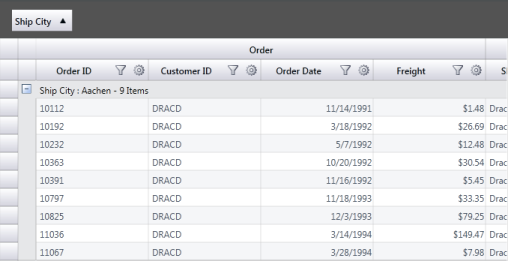 | markdownify }
{:.image }

{  | markdownify }
{:.image }

{  | markdownify }
{:.image }

{  | markdownify }
{:.image }

{  | markdownify }
{:.image }

{  | markdownify }
{:.image }

{  | markdownify }
{:.image }

{  | markdownify }
{:.image }

{  | markdownify }
{:.image }

{  | markdownify }
{:.image }

{  | markdownify }
{:.image }

{  | markdownify }
{:.image }

{  | markdownify }
{:.image }

###### Custom Skin

It is possible to define your own visual style for the GridData control. As a first step, you need to define a custom style by deriving from the IGridDataVisualStyle interface, and by defining custom brushes for various grid elements. 

You should direct the grid to use this custom style by specifying Custom option in its VisualStyle property. This can be done by using the following code: 

[C#]

this.dataGrid.CustomVisualStyle = new GridDataGlassyGreenStyle();

this.dataGrid.VisualStyle = VisualStyle.Custom;

The following screenshot shows the custom visual style set for the grid using the above given code: 

{  | markdownify }
{:.image }

Custom Visual Style can be defined for nested tables too. The following code illustrates this: 

[XAML]

&lt;Window.Resources&gt;

        <ObjectDataProvider x:Key="CustomerTable"

                            MethodName="GetDataTable" ObjectType="{x:Type local:Data}" />

        &lt;CollectionViewSource x:Key="orderSource" Source="{StaticResource CustomerTable}" &gt;

        &lt;/CollectionViewSource&gt;

        &lt;local:GridDataVisualStyleConverter x:Key="styleConverter" /&gt;

        &lt;ObjectDataProvider x:Key="GreenStyle" ObjectType="{x:Type local:GridDataGlassyGreenStyle}"/&gt;

    &lt;/Window.Resources&gt;

&lt;syncfusion:GridDataControl x:Name="dataGrid" ShowRowHeader="True" ShowColumnOptions="True" ShowGroupDropArea="True"  ShowFilters="True"  AutoPopulateColumns="True" AutoPopulateRelations="False"  ItemsSource="{StaticResource orderSource}"&gt;

                &lt;syncfusion:GridDataControl.Relations &gt;

                    &lt;syncfusion:GridDataRelation RelationalColumn="Employee_Orders" RelationType="MasterDetails" &gt;

                        &lt;syncfusion:GridDataRelation.TableProperties&gt;

                            &lt;syncfusion:GridDataTableProperties CustomVisualStyle="{Binding Source={StaticResource GreenStyle}, Converter={StaticResource styleConverter}}" VisualStyle="Custom" AutoPopulateColumns="True"&gt;

                            &lt;/syncfusion:GridDataTableProperties&gt;

                        &lt;/syncfusion:GridDataRelation.TableProperties&gt;

                    &lt;/syncfusion:GridDataRelation&gt;

                &lt;/syncfusion:GridDataControl.Relations&gt;

&lt;/syncfusion:GridDataControl&gt;

{ 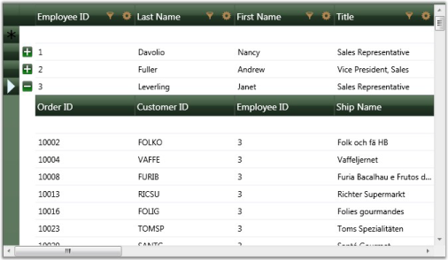 | markdownify }
{:.image }

> _Note:  IGridDataVisualStyle is deprecated and this information is provided only for legacy reasons. The recommended approach for customizing the GridDataControl is using_ [GridDataStyleManager ](http://help.syncfusion.com/ug_92/User%20Interface/WPF/Grid/Documents/42316blendsupport.htm)_class through Microsoft Expression Blend._  

###### Backward Compatibility

There are substantial differences in the implementation of the new Skins in version 9.2 (and later). To maintain backward compatibility with the Skins included in earlier versions, EnableLegacyStyle property needs to be set to true. 

Breaking Change in 9.2

Previously, AlphaBlend was set in DrawSelectionOptions by default. But currently it is turned off. If you need AlphaBlend color to be applied for selection, we need to set DrawSelectionOptions property in application as mentioned in the following code snippet:

[C#]

this.grid.DrawSelectionOptions = GridDrawSelectionOptions.AlphaBlend | GridDrawSelectionOptions.ReplaceBackground 

                | GridDrawSelectionOptions.ReplaceTextColor;

##### Blend Support

Essential GridDataControl supports the setting of its styles by XAML and supports editing styles using Microsoft Expression Blend.

Use Case Scenarios

This feature helps in customizing GridDataControl through Microsoft Expression Blend 3 or 4®.

Sample Link

Blend Styling Demo sample in the sample browser is purely customized in XAML through GridDataStyleManager class. To access Blend Styling Demo:	

1. Open Syncfusion Dashboard.
2. Select User Interface.
3. Select WPF drop-down list and select Run Locally Installed Samples.
4. Select GridDataControl. 
5. In Visual styles menu select Blend styling Demo.
###### Adding Styles to an Application

GridDataControl can be customized by using Microsoft Expression Blend 3 or 4. This can be achieved through StyleManager property of _GridDataStyleManager_ type. The properties used to customize the appearance are defined in the GridDataStyleManager class.

{  | markdownify }
{:.image }

GridDataStyleManager properties are organized under the following seven groups, each representing a specific area of the GridDataControl:

* Column Appearance
* Expander Appearance
* Group Area Appearance
* Header Appearance
* Row Appearance
* Value Cell Appearance
* Nested Grid Appearance

{ 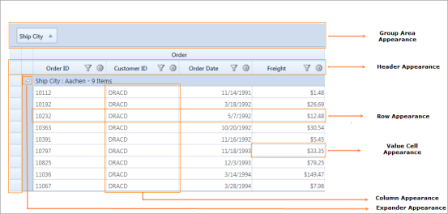 | markdownify }
{:.image }

> _Note: Previously, the appearance of the GridDataControl could be customized through the_ [IGridDataVisualStyle ](http://help.syncfusion.com/ug_92/User%20Interface/WPF/Grid/Documents/423155skins.htm)_interface; even if a visual style was set for the GridDataControl, the values set in the GridDataStyleManager would override it._

Customizing the Column Appearance

In the Column group, all the properties are of _Style_ type. These properties affect the appearance of a whole column. The following table lists each property and its corresponding target _type._

_Property_

<table>
<tr>
<td>
Property</td><td>
Description</td></tr>
<tr>
<td>
CheckBoxVisibleColumnStyle</td><td>
GridDataCheckBoxVisibleColumnControl</td></tr>
<tr>
<td>
CurrencyEditVisibleColumnStyle</td><td>
GridDataCurrencyEditVisibleColumnControl</td></tr>
<tr>
<td>
DatetimeVisibleColumnStyle</td><td>
GridDataDateTimeVisibleColumnControl</td></tr>
<tr>
<td>
DoubleEditVisibleColumnStyle</td><td>
GridDataDoubleEditVisibleColumnControl</td></tr>
<tr>
<td>
IntegerEditVisibleColumnstyle</td><td>
GridDataIntegerEditVisibleColumnControl</td></tr>
<tr>
<td>
PercentEditVisibleColumnStyle</td><td>
GridDataPercentEditVisibleColumnControl</td></tr>
<tr>
<td>
UpDownEditVisibleColumnStyle</td><td>
GridDataUpDownEditVisibleColumnControl</td></tr>
</table>

{  | markdownify }
{:.image }

Customizing the Expander Appearance

The Expander group properties are used to customize the Expand and Collapse buttons.

_Property_

<table>
<tr>
<td>
Property</td><td>
Description</td></tr>
<tr>
<td>
PlusPath</td><td>
Gets or sets the vector path of Collapsed Parent and the Group Caption rows.</td></tr>
<tr>
<td>
MinusPath</td><td>
Gets or sets the vector path of Expanded Parent and the Group Caption rows.</td></tr>
<tr>
<td>
PlusMinusButtonBackground</td><td>
Gets or sets the background color for the default Expander icon (that is, Expander icon in Collapsed state).</td></tr>
<tr>
<td>
PlusMinusButtonBorderBrush</td><td>
Gets or sets the border color for the default Expander icon.</td></tr>
<tr>
<td>
PlusMinusButtonForeground</td><td>
Gets or sets the foreground color for the default Expander icon.</td></tr>
<tr>
<td>
PlusMinusExpandedButtonBackground</td><td>
Gets or sets the background color for the default expanded Expander icon.</td></tr>
<tr>
<td>
PlusMinusExpandedButtonBorderBrush</td><td>
Gets or sets the border color for the default expanded Expander icon.</td></tr>
<tr>
<td>
PlusMinusExpandedButtonForeground</td><td>
Gets or sets the foreground color for the default expanded Expander icon.</td></tr>
<tr>
<td>
PlusMinusHoverButtonBackground</td><td>
Gets or sets the background color to be displayed for the default Expander icon when the pointer is moved over it.</td></tr>
<tr>
<td>
PlusMinusHoverButtonBorderBrush</td><td>
Gets or sets the border color to be displayed for the default Expander icon when the pointer is moved over it.</td></tr>
<tr>
<td>
PlusMinusHoverButtonForeground</td><td>
Gets or sets the foreground color to be displayed for the default Expander icon when the pointer is moved over it.</td></tr>
<tr>
<td>
PlusMinusCaptionSelectedButtonBackground</td><td>
Obsolete.</td></tr>
<tr>
<td>
PlusMinusCaptionSelectedButtonBorderBrush</td><td>
Obsolete.</td></tr>
<tr>
<td>
PlusMinusCaptionSelectedButtonForeground</td><td>
Obsolete.</td></tr>
</table>

{  | markdownify }
{:.image }

The following code example illustrates the properties in the Expander group.

[XAML]

<Path x:Key="plusPath" Width="8.666" Height="11.42" HorizontalAlignment="Left"

VerticalAlignment="Top" Data="M1.5,4.4500742 C2.3284271,4.4500742 3,5.1216469 3,5.9500742 C3,6.7785015 2.3284271,7.4500742 1.5,7.4500742 C0.67157292,7.4500742 0,6.7785015 0,5.9500742 C0,5.1216469 0.67157292,4.4500742 1.5,4.4500742 z M2.8990631,0.00036717192 C3.0453069,0.005159697 3.1827641,0.056897067 3.284497,0.15714154 L8.5183868,5.3089428 C8.6242905,5.4130292 8.6701775,5.5520487 8.6654148,5.6966238 L8.6658916,5.6966238 C8.6662092,5.7011499 8.6654148,5.7055159 8.6656513,5.710042 C8.6654148,5.714488 8.6662092,5.718854 8.6658916,5.7233 L8.6654148,5.7233 C8.6701775,5.867878 8.6242905,6.0069752 8.5183868,6.1111407 L3.284497,11.262862 C3.0519648,11.491915 2.6327903,11.467778 2.3486581,11.208635 C2.3486581,11.208635 2.2061534,11.101613 1.9369454,10.833023C1.6678151,10.56459 1.7572079,10.396356 1.9367857,10.137055 C2.1164434,9.8779926 4.7354136,6.097723 4.7354136,6.097723 C4.9301553,5.7890387 4.933569,5.630013 4.7354136,5.3222814 C4.7354136,5.3222814 2.1164434,1.5420915 1.9367857,1.2827913 C1.7572079,1.0237284 1.667151,0.85541332 1.9369454,0.58698106 C2.2061534,0.31847125 2.3486581,0.21136875 2.3486581,0.21136881 C2.5084825,0.065645903 2.711035,-0.0057947943 2.8990631,0.00036717192 z" Fill="#FFF5913F"

Stretch="Fill" />

<Path x:Key="minusPath" Width="8.666" Height="11.42" HorizontalAlignment="Left"

VerticalAlignment="Top"

Data="M1.5,4.4500742 C2.3284271,4.4500742 3,5.1216469 3,5.9500742 C3,6.7785015 2.3284271,7.4500742 1.5,7.4500742 C0.67157292,7.4500742 0,6.7785015 0,5.9500742 C0,5.1216469 0.67157292,4.4500742 1.5,4.4500742 z M2.8990631,0.00036717192 C3.0453069,0.005159697 3.1827641,0.056897067 3.284497,0.15714154 L8.5183868,5.3089428 C8.6242905,5.4130292 8.6701775,5.5520487 8.6654148,5.6966238 L8.6658916,5.6966238 C8.6662092,5.7011499 8.6654148,5.7055159 8.6656513,5.710042 C8.6654148,5.714488 8.6662092,5.718854 8.6658916,5.7233 L8.6654148,5.7233 C8.6701775,5.867878 8.6242905,6.0069752 8.5183868,6.1111407 L3.284497,11.262862 C3.0519648,11.491915 2.6327903,11.467778 2.3486581,11.208635 C2.3486581,11.208635 2.2061534,11.101613 1.9369454,10.833023 C1.6678151,10.56459 1.7572079,10.396356 1.9367857,10.137055 C2.1164434,9.8779926 4.7354136,6.097723 4.7354136,6.097723 C4.9301553,5.7890387 4.933569,5.630013 4.7354136,5.3222814 C4.7354136,5.3222814 2.1164434,1.5420915 1.9367857,1.2827913 C1.7572079,1.0237284 1.6678151,0.85541332 1.9369454,0.58698106 C2.2061534,0.31847125 2.3486581,0.21136875 2.3486581,0.21136881 C2.5084825,0.065645903 2.711035,-.0057947943 2.8990631,0.00036717192 z" Fill="#FFF5913F" RenderTransformOrigin="0.5,0.5" Stretch="Fill">

&lt;Path.RenderTransform&gt;

&lt;RotateTransform Angle="90" /&gt;

&lt;/Path.RenderTransform&gt;

&lt;/Path&gt;

&lt;syncfusion:GridDataStyleManager&gt;

   &lt;syncfusion:GridDataStyleManager.ExpanderAppearence&gt;

      <syncfusion:ExpanderAppearence MinusPath="{StaticResource minusPath}"

      PlusMinusButtonBackground="#FFA21A1E"

      PlusMinusButtonBorderBrush="#FFA21A1E"

      PlusMinusButtonForeground="#FFAAAA1E"

      PlusMinusCaptionSelectedButtonBackground="White"

      PlusMinusCaptionSelectedButtonBorderBrush="White"

      PlusMinusCaptionSelectedButtonForeground="White"

      PlusMinusExpandedButtonBackground="White"

      PlusMinusExpandedButtonBorderBrush="#FFA21A1E"

      PlusMinusExpandedButtonForeground="Gray"

      PlusPath="{StaticResource plusPath}" />

   &lt;/syncfusion:GridDataStyleManager.ExpanderAppearence&gt;

&lt;/syncfusion:GridDataStyleManager&gt;

{  | markdownify }
{:.image }

Customizing the Group Area

Group Area group properties are used to customize the Group Area.

Customizing Group Area Appearance through the GridDataStyleManager

The following properties illustrate how to customize the appearance of the Group Area through the GridDataStyleManager.

_Property_

<table>
<tr>
<td>
Property</td><td>
Description</td></tr>
<tr>
<td>
GroupAreaBackgroundBrush</td><td>
Gets or sets the background color for the Group Drop Area.</td></tr>
<tr>
<td>
GroupAreaForegroundBrush</td><td>
Gets or sets the foreground color for the text of the Group Drop Area.</td></tr>
<tr>
<td>
GroupHeaderFont</td><td>
Gets or sets the font information for the grouped header cell in the Group Drop Area.</td></tr>
<tr>
<td>
GroupCellBorders</td><td>
Gets or sets the cell border information for the grouped header cell in the Group Drop Area.</td></tr>
<tr>
<td>
GroupCellBorderMargins</td><td>
Gets or sets the cell margin information for the grouped header cell in the Group Drop Area.</td></tr>
<tr>
<td>
DragDropIndicatorBrush</td><td>
Gets or sets the background color for the Drag Drop Indicator.</td></tr>
<tr>
<td>
DragDropIndicatorOuterBrush</td><td>
Gets or sets the outer border color for the Drag Drop Indicator.</td></tr>
</table>
The following code example illustrates the properties defined in this group.

[XAML]

&lt;Pen x:Key="GroupCellBorder" Brush="#FFC2C2C2" Thickness="1" /&gt;

&lt;syncfusion:GridDataStyleManager.GroupAreaAppearence&gt;

<syncfusion:GroupAreaAppearence GroupAreaBackgroundBrush="#FFE7CD9B" 

GroupAreaForegroundBrush="White" DragDropIndicatorBrush="Peru"

DragDropIndicatorOuterBrush="Gray">

&lt;syncfusion:GroupAreaAppearence.GroupHeaderFont&gt;

&lt;syncfusion:GridFontInfo FontFamily="RockWell" FontSize="12" /&gt;

&lt;/syncfusion:GroupAreaAppearence.GroupHeaderFont&gt;

&lt;syncfusion:GroupAreaAppearence.GroupCellBorders&gt;

<syncfusion:CellBordersInfo

Bottom="{StaticResource GroupCellBorder}"

      Left="{StaticResource GroupCellBorder}"

      Right="{StaticResource GroupCellBorder}"

      Top="{StaticResource GroupCellBorder}" />

&lt;/syncfusion:GroupAreaAppearence.GroupCellBorders&gt;

&lt;/syncfusion:GroupAreaAppearence&gt;

&lt;/syncfusion:GridDataStyleManager.GroupAreaAppearence&gt;

{  | markdownify }
{:.image }

Customizing Group Area Appearance through the GridDataControl

The following properties illustrate how to customize the appearance of the Group Area through the GridDataControl.

_Property_

<table>
<tr>
<td>
Property</td><td>
Description</td></tr>
<tr>
<td>
GroupDropAreaHeight</td><td>
Specifies the height of Group Drop Area.</td></tr>
<tr>
<td>
GroupDropAreaText</td><td>
Specifies user-defined text to be displayed in the Group Drop Area.</td></tr>
<tr>
<td>
ShowGroupDropArea</td><td>
Shows or hides the Group Drop Area.</td></tr>
<tr>
<td>
DragIndicatorInnerBrush</td><td>
Gets or sets the inner background color for the Drag Indicator.</td></tr>
<tr>
<td>
DragIndicatorOuterBrush</td><td>
Gets or sets the outer border color for the Drag Indicator.</td></tr>
</table>
The following code example illustrates the properties defined in this group.

[XAML]

<syncfusion:GridDataControl x:Name="grid" ShowGroupDropArea="True"

GroupDropAreaHeight="50" GroupDropAreaText="Customized Group Area"

DragIndicatorInnerBrush="Gray" DragIndicatorOuterBrush="Brown"/>

{  | markdownify }
{:.image }

Customizing the Header Appearance

The Header Appearance group properties are used to customize the header.

Customizing Header Appearance through the GridDataStyleManager

The following properties illustrate how to customize the Header appearance through the GridDataStyleManager.

_Property_

<table>
<tr>
<td>
Property</td><td>
Description</td></tr>
<tr>
<td>
HeaderBackgroundBrush</td><td>
Gets or sets the background color for the Header cell.</td></tr>
<tr>
<td>
HeaderForegroundBrush</td><td>
Gets or sets the foreground color for the Header cell.</td></tr>
<tr>
<td>
HeaderHoverBackgroundBrush</td><td>
Gets or sets the background color to be displayed for the Header cell when the pointer is moved over it.</td></tr>
<tr>
<td>
HeaderHoverForegroundBrush</td><td>
Gets or sets the foreground color to be displayed for the Header cell when the pointer is moved over it.</td></tr>
<tr>
<td>
HeaderCellBorders</td><td>
Gets or sets the cell border information for the Header cell area.</td></tr>
<tr>
<td>
HeaderInnerBorder</td><td>
Gets the inner border color of the Header cell.</td></tr>
<tr>
<td>
HeaderInnerBorderThickness</td><td>
Gets the inner border thickness of the Header cell.</td></tr>
<tr>
<td>
HeaderFont</td><td>
Gets or sets the text font of the Header cell.</td></tr>
<tr>
<td>
HeaderTextMargins</td><td>
Gets or sets the text margin of the Header cell.</td></tr>
<tr>
<td>
SortWidgetBrush</td><td>
Gets or sets the color of the Sort icon.</td></tr>
<tr>
<td>
HeaderOptionsHoverBackground</td><td>
Gets or sets the background color for the Header cell options such as Sort icon, Filter icon and Column Options icon.</td></tr>
<tr>
<td>
HeaderOptionsBorderBrush</td><td>
Gets or sets the border color of the Header cell options such as Sort icon, Filter icon and Column Options icon.</td></tr>
<tr>
<td>
HeaderOptionsCheckedBackground</td><td>
Gets or sets the background color for Header cell options such as Sort icon, Filter icon and Column Options icon when it is checked.</td></tr>
<tr>
<td>
ColumnOptionsPopupBackground</td><td>
Gets or sets the background color for the Column Options pop up.</td></tr>
<tr>
<td>
ColumnOptionsPopupForeground</td><td>
Gets or sets the foreground color for the Column Options pop up.</td></tr>
<tr>
<td>
ColumnOptionsButtonBackground</td><td>
Gets or sets the background color for the Column Options icon.</td></tr>
<tr>
<td>
ColumnOptionsButtonBorderBrush</td><td>
Gets or sets the border color for the Column Options icon.</td></tr>
<tr>
<td>
FilterButtonInnerBrush</td><td>
Gets or sets the background color for the Filter icon.</td></tr>
<tr>
<td>
FilterButtonOuterBrush</td><td>
Gets or sets the border color for the Filter icon.</td></tr>
<tr>
<td>
FilterButtonHoverInnerBrush</td><td>
Gets or sets the background color to be displayed for the Filter icon when the pointer is moved over it.</td></tr>
<tr>
<td>
FilterButtonHoverOuterBrush</td><td>
Gets or sets the border color to be displayed for the Filter icon when the pointer is moved over it.</td></tr>
<tr>
<td>
FilterButtonAppliedBrush</td><td>
Gets or sets the background color to be displayed for the Filter icon when the filter is applied.</td></tr>
</table>
The following code example illustrates the properties defined in this group.

[XAML]

&lt;syncfusion:GridDataStyleManager.HeaderAppearence&gt;

<syncfusion:HeaderAppearence ColumnOptionsPopupBackground="#FFF2E2C4"

HeaderBackgroundBrush="#FFFFFFFF" HeaderForegroundBrush="#FF412641"

HeaderHoverBackgroundBrush="White" HeaderHoverForegroundBrush="Black"

HeaderInnerBorder="#FF674B67" HeaderInnerBorderThickness="0.18"

SortWidgetBrush="#FFF68909">

&lt;syncfusion:HeaderAppearence.HeaderFont&gt;

&lt;syncfusion:GridFontInfo FontFamily="Segoe UI" FontSize="14.73" FontWeight="SemiBold" /&gt;

&lt;/syncfusion:HeaderAppearence.HeaderFont&gt;

&lt;syncfusion:HeaderAppearence.HeaderTextMargins&gt;

&lt;syncfusion:CellMarginsInfo Left="12" /&gt;

&lt;/syncfusion:HeaderAppearence.HeaderTextMargins&gt;

&lt;syncfusion:HeaderAppearence.HeaderCellBorders&gt;

<syncfusion:CellBordersInfo

Bottom="{StaticResource ValueCellBorder}"

Left="{StaticResource ValueCellBorder}"

Right="{StaticResource ValueCellBorder}"

Top="{StaticResource ValueCellBorder}" />

&lt;/syncfusion:HeaderAppearence.HeaderCellBorders&gt;

&lt;/syncfusion:HeaderAppearence&gt;

&lt;/syncfusion:GridDataStyleManager.HeaderAppearence&gt;

{  | markdownify }
{:.image }

Customizing Header Appearance through the GridDataControl

The following properties illustrate how to customize the Header appearance through the GridDataControl.

_Property_

<table>
<tr>
<td>
Property</td><td>
Description</td></tr>
<tr>
<td>
HeaderCellTemplate</td><td>
Gets or sets the template for the Header cell.</td></tr>
<tr>
<td>
ShowFilters</td><td>
Shows or hides the filters in the Header cell.</td></tr>
<tr>
<td>
AllowSort</td><td>
Enables or disables sorting in the Header cell.</td></tr>
<tr>
<td>
DefaultHeaderRowHeight</td><td>
Gets or sets the row height of the Header cell.</td></tr>
<tr>
<td>
HeaderStyle</td><td>
Gets or sets the style for the Header cell.</td></tr>
</table>
The following code example illustrates the properties defined in this group.

[XAML]

&lt;!—HeaderTemplate--&gt;

&lt;DataTemplate x:Name="HeaderTemplate"&gt;

&lt;TextBox Height="30" Width="120"/&gt;

&lt;/DataTemplate&gt;

<syncfusion:GridDataControl x:Name="grid" ShowFilters="True" AllowSort="True"

DefaultHeaderRowHeight="50" HeaderCellTemplate="{StaticResource HeaderTemplate}"

HeaderStyle="{StaticResource GridDataHeaderCellControlStyle}"/>

&lt;!— HeaderStyle in Visible Column  --&gt;

&lt;syncfusion:GridDataVisibleColumn MappingName="OrderId"&gt;

&lt;syncfusion:GridDataVisibleColumn.HeaderStyle&gt;

<syncfusion:GridDataColumnStyle Background="White"

Foreground="Black"/>

&lt;/syncfusion:GridDataVisibleColumn.HeaderStyle&gt;

&lt;/syncfusion:GridDataVisibleColumn&gt;

{  | markdownify }
{:.image }

Customizing the Row Appearance

The Row Appearance group properties enable to customize the appearance of rows in the GridDataControl.

Customizing Row Appearance through the GridDataStyleManager

The following properties illustrate how to customize row appearance through the GridDataStyleManager.

_Property_

<table>
<tr>
<td>
Property</td><td>
Description</td></tr>
<tr>
<td>
SummaryCaptionBackground</td><td>
Gets or sets the background color for the summary caption row.</td></tr>
<tr>
<td>
SummaryCaptionForeground</td><td>
Gets or sets the foreground color for the summary caption row.</td></tr>
<tr>
<td>
SummaryCaptionFont</td><td>
Gets or sets the text font for the summary caption row.</td></tr>
<tr>
<td>
SummaryRowBackground</td><td>
Gets or sets the background color for the summary row.</td></tr>
<tr>
<td>
SummaryRowForeground</td><td>
Gets or sets the foreground color for the summary row.</td></tr>
<tr>
<td>
SummaryRowFont</td><td>
Gets or sets the text font for the summary row.</td></tr>
<tr>
<td>
GroupCaptionSelectionBackground</td><td>
Gets or sets the background color for the selected group caption row.</td></tr>
<tr>
<td>
GroupCaptionSelectionForeground</td><td>
Gets or sets the foreground color for the selected group caption row.</td></tr>
<tr>
<td>
CurrentCellSelectionForeground</td><td>
Gets or sets the foreground color for the selected cell in a row.</td></tr>
<tr>
<td>
CurrentCellSelectionBackground</td><td>
Gets or sets the background color for the selected cell in a row.</td></tr>
<tr>
<td>
RowHeaderIconPath</td><td>
Gets or sets the icon path for the row header.</td></tr>
</table>
The following code example illustrates the properties defined in this group.

[XAML]

&lt;syncfusion:GridDataStyleManager.RowAppearence&gt;

<syncfusion:RowAppearence CurrentCellSelectionBackground="#FFB31B20"

CurrentCellSelectionForeground="#FFFFFFFF"

GroupCaptionSelectionBackground="#FFB71B21"

GroupCaptionSelectionForeground="#FFFFFFFF"

HighlightSelectionBackground="#FFCDBEA3"

HighlightSelectionForeground="#FFB71B21" RowHeaderBackground="White”

RowHeaderForeground="#FFFFFFFF" SummaryCaptionBackground="#FFF2E2C4"

SummaryCaptionForeground="#FF730202" SummaryRowBackground="#FFCBB284"

SummaryRowForeground="#FFFFFFFF">

&lt;syncfusion:RowAppearence.SummaryCaptionFont&gt;

<syncfusion:GridFontInfo FontFamily="Rockwell" FontSize="13.333"

FontWeight="Normal" />

&lt;/syncfusion:RowAppearence.SummaryCaptionFont&gt;

      &lt;syncfusion:RowAppearence.SummaryRowFont&gt;

<syncfusion:GridFontInfo FontFamily="Rockwell"

FontSize="13.333" />

&lt;/syncfusion:RowAppearence.SummaryRowFont&gt;

&lt;/syncfusion:RowAppearence&gt;

&lt;/syncfusion:GridDataStyleManager.RowAppearence&gt;

{  | markdownify }
{:.image }

Customizing Row Appearance through the GridDataControl

The following properties illustrate how to customize row appearance through the GridDataControl.

_Properties_

<table>
<tr>
<td>
Property</td><td>
Description</td></tr>
<tr>
<td>
ShowGroupSummaries</td><td>
Shows or hides group summaries in Grid.</td></tr>
<tr>
<td>
ShowGroupSummaryInCaption</td><td>
Shows or hides group summaries in Caption.</td></tr>
<tr>
<td>
ShowTableSummaries</td><td>
Shows or hides table summaries.</td></tr>
<tr>
<td>
TableSummaryPosition</td><td>
Gets or sets the position of table summary in Grid.</td></tr>
<tr>
<td>
GroupCaptionText</td><td>
Gets or sets the text in the Group Caption Area.</td></tr>
<tr>
<td>
RowBackground</td><td>
Gets or sets the background color of the row.</td></tr>
<tr>
<td>
RowForeground</td><td>
Gets or sets the foreground color of the row.</td></tr>
<tr>
<td>
ShowRowHeader </td><td>
Shows or hides the row header.</td></tr>
<tr>
<td>
ShowRowHeaderArrow</td><td>
Shows or hides the icon in the row header.</td></tr>
<tr>
<td>
RowStyle</td><td>
Gets or sets the styles for the row.</td></tr>
<tr>
<td>
AlternateRowStyle</td><td>
Gets or sets the styles for alternative rows.</td></tr>
<tr>
<td>
AlternatingRowBackground</td><td>
Gets or sets the background color for alternative rows.</td></tr>
<tr>
<td>
AlternatingRowForeground</td><td>
Gets or sets the foreground color for alternative rows.</td></tr>
<tr>
<td>
UnboundRowPosition</td><td>
Gets or sets the position of the unbound row in Grid.</td></tr>
<tr>
<td>
AddNewRowPosition</td><td>
Gets or sets the position of the new row to be added in Grid.</td></tr>
</table>
The following code example illustrates this.

[XAML]

<syncfusion:GridDataControl x:Name="grid" ShowGroupSummaries="True"

ShowGroupSummaryInCaption="True" ShowTableSummaries="True"

TableSummaryPosition="Bottom" GroupCaptionText="Customized Group Caption Text" RowBackground="White"

RowForeground="Black" ShowRowHeader="True" ShowRowHeaderArrow="True"

RowStyle="{StaticResource RowStle}" AlternateRowStyle="{StaticResource alternativeRowStyle}"

AlternatingRowBackground="White" AlternatingRowBackground="Wheat"

UnboundRowPosition="Bottom" AddNewRowPosition="Top"/>

Customizing the Value Cell Appearance

The Value Cell group enables to customize cells by changing their margins, borders, and so on. 

Customizing the Value Cell Appearance through the GridDataStyleManager

The following properties illustrate how to customize the Value Cell appearance through the GridDataStyleManager.

_Properties_

<table>
<tr>
<td>
Property</td><td>
Description</td></tr>
<tr>
<td>
ValueCellBorders</td><td>
Gets or sets the cell border information of a value cell.</td></tr>
<tr>
<td>
ValueFont</td><td>
Gets or sets the font information of a value cell.</td></tr>
<tr>
<td>
ValueTextMargins</td><td>
Gets or sets the text margin of a value cell.</td></tr>
<tr>
<td>
ValueBackgroundBrush</td><td>
Gets or sets the background color of a value cell.</td></tr>
<tr>
<td>
ValueForegroundBrush</td><td>
Gets or sets the foreground color of a value cell.</td></tr>
<tr>
<td>
CurrentCellBorderWidth</td><td>
Gets or sets the border thickness for the selected cell.</td></tr>
<tr>
<td>
CurrentCellBorderBrush</td><td>
Gets or sets the border color for the selected cell.</td></tr>
<tr>
<td>
HighlightSelectionBackground</td><td>
Gets or sets the background color for the selected row.</td></tr>
<tr>
<td>
HighlightSelectionForeground</td><td>
Gets or sets the foreground color for the selected row.</td></tr>
<tr>
<td>
HoveringRecordCellBackground</td><td>
Gets or sets the background color to be displayed for the row when the pointer is moved over it.</td></tr>
<tr>
<td>
HoveringRecordCellForeground</td><td>
Gets or sets the foreground color to be displayed for the row when the pointer is moved over it.</td></tr>
</table>
The following code example illustrates the properties defined in this group.

[XAML]

&lt;syncfusion:GridDataStyleManager.ValueCellAppearance&gt;

<syncfusion:ValueCellAppearance CurrentCellBorderBrush="#FFD6BE92"

     ValueBackgroundBrush="#FFFDFBFC" ValueForegroundBrush="#FF333333">

&lt;syncfusion:ValueCellAppearance.ValueCellBorders&gt;

      <syncfusion:CellBordersInfo 

            Bottom="{StaticResource ValueCellBorder}"

            Left="{StaticResource ValueCellBorder}"

            Right="{StaticResource ValueCellBorder}"

            Top="{StaticResource ValueCellBorder}" />

      &lt;/syncfusion:ValueCellAppearance.ValueCellBorders&gt;

&lt;syncfusion:ValueCellAppearance.ValueFont&gt;

&lt;syncfusion:GridFontInfo FontFamily="Rockwell" FontSize="10" FontWeight="Normal" /&gt;

&lt;/syncfusion:ValueCellAppearance.ValueFont&gt;

&lt;syncfusion:ValueCellAppearance.ValueTextMargins&gt;

&lt;syncfusion:CellMarginsInfo Bottom="2" Left="2" Right="2"                                       Top="2" /&gt;

&lt;/syncfusion:ValueCellAppearance.ValueTextMargins&gt;

&lt;/syncfusion:ValueCellAppearance&gt;

&lt;/syncfusion:GridDataStyleManager.ValueCellAppearance&gt;

{  | markdownify }
{:.image }

Customizing the Value Cell Appearance through the GridDataControl

The following properties illustrate how to customize the Value Cell appearance through the GridDataControl.

_Properties_

<table>
<tr>
<td>
Property</td><td>
Description</td></tr>
<tr>
<td>
ExcelLikeSelectionFrame</td><td>
Enables or disables excel-like selection frame in the cells.</td></tr>
<tr>
<td>
Allow Edit</td><td>
Enables or disables editing in the cells.</td></tr>
<tr>
<td>
HighlightSelectionAlphaBlend</td><td>
Gets or sets the background color of the selected row.GridDrawSelectionOptions must be set to AlphaBlend.</td></tr>
<tr>
<td>
HighlightSelectionBackground</td><td>
Gets or sets the background color of the selected row.GridDrawSelectionOptions must be set to ReplaceBackground.</td></tr>
<tr>
<td>
HighlightSelectionBorder</td><td>
Gets or sets the border color of the selected row.</td></tr>
<tr>
<td>
HighlightSelectionBorderWidth</td><td>
Gets or sets the border width of the selected row.</td></tr>
<tr>
<td>
HighlightSelectionForeground</td><td>
Gets or sets foreground color of the selected row.</td></tr>
</table>
The following code example illustrates this.

[XAML]

<syncfusion:GridDataControl x:Name="dataGrid1" ExcelLikeSelectionFrame="True"

AllowEdit="True" HighlightSelectionAlphaBlend="WhiteSmoke"

HighlightSelectionBackground="BlanchedAlmond" HighlightSelectionBorder="Azure" HighlightSelectionBorderWidth="0.5"

HighlightSelectionForeground="Black"/>

Customizing the Nested Grid Appearance

The Nested Grid Group enables to customize the Nested cell borders by modifying the margin, borders, and so on.

> _Note: For Nested grid, Style Manager can be set by the Child Model. By default, Child inherits the styles from Parent._

The following code example illsutrates this.

[C#]

void Table_RecordExpanded(object sender, GridDataValueEventArgs<GridDataRecord>e)

{

e.Value.ChildModels[0].TableProperties.StyleManager = new GridDataStyleManager();

} 

The following properties illustrate how to customize the Nested Grid appearance through the GridDataStyleManager.

_Properties_

<table>
<tr>
<td>
Property</td><td>
Description</td></tr>
<tr>
<td>
TopLeftCellHeaderCellBorder</td><td>
Gets or sets the cell border information for the top-left header cell of the Nested grid.</td></tr>
<tr>
<td>
NestedHeaderCellBorder</td><td>
Gets or sets the cell border information for the header cells excluding the top-left header cell of the Nested grid.</td></tr>
<tr>
<td>
FirstHeaderColumnBorder</td><td>
Gets or sets the border information for the first header column of value cells of the Nested grid.</td></tr>
<tr>
<td>
LastHeaderColumnBorder</td><td>
Gets or sets the border information for the last header column of value cells of the Nested grid.</td></tr>
</table>
The following code example illustrates the properties defined in this group.

[XAML]

&lt;Pen x:Key="ValueCellBorder" Brush="#FFD6BE92" Thickness="0.25" /&gt;

&lt;syncfusion:GridDataStyleManager.NestedGridAppearance&gt;

     &lt;syncfusion:NestedGridAppearance&gt;

         &lt;syncfusion:NestedGridAppearance.FirstHeaderColumnBorder&gt;

             <syncfusion:CellBordersInfo 

             Bottom="{StaticResource ValueCellBorder}" 

             Left="{StaticResource ValueCellBorder}" 

             Right="{StaticResource ValueCellBorder}" 

             Top="{StaticResource ValueCellBorder}" />

         &lt;/syncfusion:NestedGridAppearance.FirstHeaderColumnBorder&gt;

         &lt;syncfusion:NestedGridAppearance.LastHeaderColumnBorder&gt;

             <syncfusion:CellBordersInfo 

             Bottom="{StaticResource ValueCellBorder}" 

             Left="{StaticResource ValueCellBorder}" 

             Right="{StaticResource ValueCellBorder}" 

             Top="{StaticResource ValueCellBorder}" />

         &lt;/syncfusion:NestedGridAppearance.LastHeaderColumnBorder&gt;

     &lt;syncfusion:NestedGridAppearance.NestedHeaderCellBorder&gt;

         <syncfusion:CellBordersInfo 

         Bottom="{StaticResource ValueCellBorder}" 

         Left="{StaticResource ValueCellBorder}" 

         Right="{StaticResource ValueCellBorder}" 

         Top="{StaticResource ValueCellBorder}" />

         &lt;/syncfusion:NestedGridAppearance.NestedHeaderCellBorder&gt;

         &lt;syncfusion:NestedGridAppearance.TopLeftCellHeaderCellBorder&gt;

               <syncfusion:CellBordersInfo 

               Bottom="{StaticResource ValueCellBorder}" 

               Left="{StaticResource ValueCellBorder}" 

               Right="{StaticResource ValueCellBorder}" 

               Top="{StaticResource ValueCellBorder}" />

         &lt;/syncfusion:NestedGridAppearance.TopLeftCellHeaderCellBorder&gt;

      &lt;/syncfusion:NestedGridAppearance&gt;

&lt;/syncfusion:GridDataStyleManager.NestedGridAppearance&gt;

{  | markdownify }
{:.image }

{  | markdownify }
{:.image }

###### Editing Additional Template and Styles

Apart from the properties mentioned above, template and style for ScrollViewer, ContextMenu, GridDataHeaderCellControl, GridDataColumnOptionPane can be customized using the following properties. 

_Properties_

<table>
<tr>
<td>
Property</td><td>
TargetType</td></tr>
<tr>
<td>
ContextMenuStyle</td><td>
ContextMenu</td></tr>
<tr>
<td>
ScrollViewerStyle</td><td>
ScrollViewer</td></tr>
<tr>
<td>
ColumnOptionPaneStyle</td><td>
GridDataColumnOptionsPane</td></tr>
<tr>
<td>
HeaderStyle</td><td>
GridDataHeaderCellControl</td></tr>
<tr>
<td>
RowStyle</td><td>
GridDataRowControl</td></tr>
<tr>
<td>
AlternateRowstyle</td><td>
GridDataRowControl</td></tr>
</table>
Step by step instructions for Editing Templates

1. Open the application in Microsoft Expression Blend
2. Right-click on the GridDataControl and from Object menu, select Edit Additional Templates -> Edit $PartName$Style (e.g. HeaderStyle).  

{  | markdownify }
{:.image }

3. Blend creates a copy of the Template and opens the XAML. All the “Parts” that make up the selected template can be edited to make the required styling changes.
###### RowStyle and AlternateRowStyle

RowStyle and AlternateRowStyle are FrameworkElement Styles specifies the style for alternate rows in GridDataControl. These styles support all the basic properties of controls namely Background, Foreground, FontFamily, FontSize and FontFamily.

RowStyle

RowStyle can be set using XAML by overriding the style for GridDataRowControl class. This overrides the styles for each row. RowStyle supports all the basic control styles. The following code example explains the implementation of the RowStyle.

[XAML]

&lt;Style x:Key="RowStyle1" TargetType="{x:Type local:GridDataRowControl}"&gt;

            &lt;Setter Property="Background" Value="Cornsilk"/&gt;

            &lt;Setter Property="Foreground" Value="Fuchsia" /&gt;

            &lt;Setter Property="FontFamily" Value="Monotype Corsiva"/&gt;

            &lt;Setter Property="FontSize" Value="13" /&gt;

            &lt;Setter Property="FontStretch" Value="Expanded" /&gt;

            &lt;Setter Property="FontStyle" Value="Normal"  /&gt;

            &lt;Setter Property="FontWeight" Value="Normal"  /&gt;

            &lt;Setter Property="Cursor" Value="Pen"  /&gt;

            &lt;Setter Property="FlowDirection" Value="RightToLeft" /&gt;

            &lt;Setter Property="VerticalAlignment" Value="Center"  /&gt;

            &lt;Setter Property="HorizontalAlignment" Value="Center" /&gt;

        &lt;/Style&gt;

&lt;!--Assigning the style resource to the GridDataControl--&gt;

       RowStyle="{StaticResource RowStyle1}"

 AlternateRowStyle

AlternateRowStyle defines the style for the GridDataRowControl element for alternate rows. If this is defined in XAML then the RowStyle and AlternateRowStyle applies for alternate elements. AlternateRowStyle supports all the basic control styles. The following code example explains the implementation of the AlternateRowStyle.

[XAML]

&lt;Style x:Key="AlternateRowStyle1" TargetType="{x:Type local:GridDataRowControl}"&gt;

            &lt;Setter Property="Background" Value="Cornsilk"/&gt;

            &lt;Setter Property="Foreground" Value="Fuchsia" /&gt;

            &lt;Setter Property="FontFamily" Value="Monotype Corsiva"/&gt;

            &lt;Setter Property="FontSize" Value="13" /&gt;

            &lt;Setter Property="FontStretch" Value="Expanded" /&gt;

            &lt;Setter Property="FontStyle" Value="Normal"  /&gt;

            &lt;Setter Property="FontWeight" Value="Normal"  /&gt;

            &lt;Setter Property="Cursor" Value="Pen"  /&gt;

            &lt;Setter Property="FlowDirection" Value="RightToLeft" /&gt;

            &lt;Setter Property="VerticalAlignment" Value="Center"  /&gt;

            &lt;Setter Property="HorizontalAlignment" Value="Center" /&gt;

        &lt;/Style&gt;

&lt;!--Assigning the style resource to the GridDataControl--&gt;

       AlternateRowStyle="{StaticResource AlternateRowStyle1}"

####  Enhancement of GridDataCommandManager

Command is an input mechanism that provides input handling at a more semantic level.  Commands in WPF are created by implementing the ICommand interface. ICommand exposes two methods, Execute, and CanExecute and an event CanExecuteChanged. 

* Execute performs the actions that are associated with the command
* CanExecute determines whether the command can execute on the current command target
* CanExecuteChanged is raised if the command manager that centralizes the commanding operations detects a change in the command source that might invalidate a command that has been raised but not yet executed by the command binding.

GridDataControl provides Commands for the following events. This helps write the application in pure MVVM model.

* QueryCellInfoCommand
* SortColumnChangingCommand
##### QueryCellInfoCommand 

QueryCellInfoCommand is widely used to allow customization of each and every cell in the required format. QueryCellInfo accepts an argument of type GridQueryCellInfoEventArgs. The GridQuerryCellInfoEventArgs contains the following customization properties. Now you can make use of this 

_Properties_

<table>
<tr>
<td>
Property</td><td>
Description</td></tr>
<tr>
<td>
Cell</td><td>
Gives the cell co-ordinates</td></tr>
<tr>
<td>
Style</td><td>
Specifies the style for the cell represented by the above Cell property</td></tr>
</table>
##### SortColumnChangingCommand

SortColumnChangingCommand allows customizing the sort columns at run time and this command get hooked before the column is sorted. SortColumnsChanging event accepts an argument of type GridDataSortColumnsChangingEventArgs. The GridDataSortColumnsChangingEventArgs contains the following customization properties. Now you can make use of this

_Properties_

<table>
<tr>
<td>
Property</td><td>
Description</td></tr>
<tr>
<td>
AddedItems</td><td>
Gives the Collection of GridDataSortColumns that are newly added to the GridDataControl.</td></tr>
<tr>
<td>
RemovedItems</td><td>
Gives the Collection of GridDataSortColumns that are removed from the GridDataControl.</td></tr>
<tr>
<td>
NotifyCollectionChangedAction</td><td>
Gives the Action that are going to perform in the SortColumns Collection in GridDataControl.</td></tr>
</table>

Properties

_Property Table_

<table>
<tr>
<td>
Property </td><td>
Description </td><td>
Type </td><td>
Data Type </td></tr>
<tr>
<td>
QueryCellInfoCommand</td><td>
Gets or sets the command to invoke when QueryCellInfo event is triggered.</td><td>
Dependency Property</td><td>
ICommand</td></tr>
<tr>
<td>
SortColumnChangingCommand</td><td>
Gets or sets the command to invoke when SortColumnChanging event is triggered.</td><td>
Dependency Property</td><td>
ICommand</td></tr>
</table>

#### GridDataControl Column Chooser

The GridData control’s column chooser allows you to add and remove columns dynamically from the current grid view via drag-and-drop operations. Dragging a column's header and dropping it onto the column chooser removes the column. To show the column, drag its header from the column chooser back to the view. 

##### Features

* Add hidden columns in the Column Chooser window.
* Display a customized Column Chooser window.

Add Hidden Columns in the Column Chooser Window

By default, the column chooser doesn’t display headers of hidden columns. A column is hidden if its IsHidden property is set to false. If you want to display a hidden column within the column chooser, set the column chooser’s CanAddHiddenColumns property to true.

Display a Customized Column Chooser Window

The GridData control’s column chooser enables you to customize the column chooser from the application side. This can be done by passing the Action method as a parameter of the ShowColumnChooser() method.

Use Case Scenarios

If an item source contains 15 columns and the user defines only three visible columns, activating the column chooser shows a window containing the header cells of the remaining columns and also enables the user to add and remove columns from the view by dragging and dropping them.

##### Tables for Properties, Methods, Events, and Commands

Properties

_Property Table_

<table>
<tr>
<td>
Property </td><td>
Description </td><td>
Type </td><td>
Data Type </td></tr>
<tr>
<td>
CanAddHiddenColumns</td><td>
By setting this property to true, you can display the hidden GridDataVisbileColumns in the column chooser window.</td><td>
boolean</td><td>
boolean</td></tr>
</table>

Methods

_Methods Table_

<table>
<tr>
<th>
Method </th><th>
Description </th><th>
Parameters </th><th>
Type </th><th>
Return Type </th></tr>
<tr>
<th>
ShowColumnChooser()</th><th>
By invoking this method, the GridData control’s ColumnChooser window pops up.</th><th>
Null</th><th>
------</th><th>
Void</th></tr>
<tr>
<th>
ShowColumnChooser(Action&lt;GridDataColumnChooserWindow&gt;)</th><th>
Passing the Action method with a customized window pops up the customized GridDataColumnChooserWindow.</th><th>
Action<GridDataColumnChooserWindow></th><th>
------</th><th>
Void</th></tr>
</table>

Commands

_Command Table_

<table>
<tr>
<th>
Command </th><th>
Description </th></tr>
<tr>
<th>
ColumnChooserCommand</th><th>
This command is used to display the column chooser window.</th></tr>
</table>

Sample Link

To view sample:

1. Select Start > Programs > Syncfusion > Essential Studio x.x.xx > Dashboard.
2. Click Run Samples for WPF in the User Interface Edition panel.
3. Select GridDataControl.
4. Expand the Export Features item in the Sample Browser.

Choose the Export to PDF sample to launch.

##### Adding Column Chooser to an Application

1. Bind an ItemsSource to GridDataControl. Refer to the following link for more information about binding an ItemsSource to GridDataControl: [Data Binding](http://help.syncfusion.com/UG/User%20Interface/WPF/Grid/documents/422databinding.htm).

[XAML]

<syncfusion:GridDataControl x:Name="grid"                            

                            AutoPopulateColumns="False"

                            AutoPopulateRelations="False"

                            ColumnSizer="Star"

                            ItemsSource="{Binding OrdersDetail}"

                            ShowAddNewRow="False"

                            ShowGroupDropArea="True"                            

                            VisualStyle="Office14Blue">

    &lt;syncfusion:GridDataControl.VisibleColumns&gt;

        &lt;!--  Set IsReadyOnly for columns  --&gt;

        <syncfusion:GridDataVisibleColumn AllowSort="True"

                                            HeaderText="Order ID"

                                            MappingName="OrderID" />

        <syncfusion:GridDataVisibleColumn AllowSort="True"

                                            HeaderText="Customer ID"

                                            MappingName="CustomerID" />

        <syncfusion:GridDataDateTimeVisibleColumn AllowSort="True"

                                                    HeaderText="Order Date"

                                                    MappingName="OrderDate">

            &lt;syncfusion:GridDataDateTimeVisibleColumn.ColumnStyle&gt;

                &lt;syncfusion:GridDataColumnStyle HorizontalAlignment="Right" /&gt;

            &lt;/syncfusion:GridDataDateTimeVisibleColumn.ColumnStyle&gt;

        &lt;/syncfusion:GridDataDateTimeVisibleColumn&gt;

    &lt;/syncfusion:GridDataControl.VisibleColumns&gt;

&lt;/syncfusion:GridDataControl&gt;

Bind a button command to the ColumnChooserCommand command

The following code shows how to show the Column Chooser window using the built-in command of the GridData control.

[XAML]

<Button Name="ColumnChooserBtn"

Command="{Binding ColumnChooserCommand,ElementName=gridDataControl}"

Content="Show Column Chooser" />

This shows the Column Chooser window whenever the user clicks the button.

Displaying Default Column Chooser by Invoking Method

The following code demonstrates how to show the Column Chooser window by hooking the button’s click event.

[XAML]

<Button Name="ColumnChooserBtn"

Content="Show Column Chooser"

Click="ColumnChooserBtn_Click"/>

[C#]

private void ColumnChooserBtn_Click(object sender, RoutedEventArgs e)

        {

            this.gridDataControl.ShowColumnChooser();

        }

By using this, the user can get the default Column Chooser without any customization.

Customizing the Column Chooser by Invoking Parameterized Method

The following code shows how to customize the Column Chooser window from the application side. This is achieved by passing a method as a parameter for the ShowColumnChooser method.

[XAML]

<Button Name="ColumnChooserBtn"                        

Content="Show Column Chooser" 

Click="ColumnChooserBtn_Click"/>

[XAML]

private void ColumnChooserBtn_Click(object sender, RoutedEventArgs e)

        {

            gridDatacontrol.ShowColumnChooser((Chooser) =>

            {

                Chooser.Title = "Customized Column Chooser";

                Chooser.CanAddHiddenColumns = 

                (gridDatacontrol.DataContext as ViewModel).CanAddHiddenColumns;

            });

        }

In the result you can get the column chooser window in your application as shown below.

{  | markdownify }
{:.image }

### Exporting and persistence

This section covers the Exporting and persistence:

#### Exporting GDC to Excel

The GridExcelConverter class provides support for exporting data from a GridDataControl to an Excel spreadsheet for verification and/or computation. This control automatically copies the GridDataControl's styles and formats to Excel. The GridExcelConverter control is derived from GridExcelConverterBase. The XlsIO libraries are used to support the conversion of the GridDataControl contents to Excel. The following dll files should be added, along with the default dll files in the reference folder: 

* Syncfusion.XlsIO.Base
*  Syncfusion.XlsIO.WPF  
* Syncfusion.GridConverter.Wpf
##### Features

###### Entire Content

You can convert the entire content of a GridDataControl to an Excel Spreadsheet. You can also avail the option for specifying the version of the Excel file using the ExcelVersion enum. The version can be one of the following: 

* ExcelVersion.Excel97to2003  
* ExcelVersion.Excel2007

The following code illustrates the conversion of GridDataControl contents to an Excel Spreadsheet: 

[C#]

gridDataControl.ExportToExcel("Sample.xlsx", ExcelVersion.Excel2007 );

(or)

gridDataControl.ExportToExcel("Sample.xls", ExcelVersion.Excel97to2003 );

{  | markdownify }
{:.image }

{  | markdownify }
{:.image }

The above images shows how the entire content of the GridDataControl is exported to an Excel Spreadsheet.

###### Selected Rows

You can also avail the choice of converting the selected rows of GridDataControl to an Excel Spreadsheet.

The following code illustrates the conversion of selected rows of GridDataControl to an Excel Spreadsheet:

[C#]

grid.ExportToExcel(grid.Model.SelectedRanges.ActiveRange,"sample.xlsx", ExcelVersion.Excel2007);

###### GridDataControl with Nested Child

You can convert the content of a GridDataControl, with Nested Child to an Excel Spreadsheet. Parent and visible child content are exported to Excel Spreadsheet.

The following code illustrates the conversion of GridDataControl with Nested Child to an Excel Spreadsheet:

[C#]

gridDataControl.ExportToExcel("Sample.xlsx", ExcelVersion.Excel2007 );

(or)

gridDataControl.ExportToExcel("Sample.xls", ExcelVersion.Excel97to2003 );

> 

> _Note: Only the visible child's contents are exported._

{  | markdownify }
{:.image }

{  | markdownify }
{:.image }

The above images shows how the GridControl, with Nested Child is exported to an Excel Spreadsheet.

###### GridDataControl with Grouping

You can convert the content of a GridDataControl, with Grouping to an Excel Spreadsheet. The following code illustrates this feature:

[C#]

gridDataControl.ExportToExcel("Sample.xlsx", ExcelVersion.Excel2007 );

(or)

gridDataControl.ExportToExcel("Sample.xls", ExcelVersion.Excel97to2003 );

> 

> _Note: Only the visible grouping contents are exported._

{  | markdownify }
{:.image }

{  | markdownify }
{:.image }

The above images shows how the GridControl, with Grouping is exported to an Excel Spreadsheet.

#### GridDataControl Export to CSV

The ExportToCSV method of the GridModelExportExtensions class enables GridDataControl to easily be exported to CSV format.

To enable exporting, the following .dll files must be added along with the default .dll files in the reference folder:

* Syncfusion.XlsIO.Base
* Syncfusion.XlsIO.WPF 
* Syncfusion.GridConverter.Wpf

Converting GridDataControl to CSV format

You can convert the entire content of a grid control to a CSV file by using the following code:

[C#]

this.gdc.Model.ExportToCSV("Sample.csv")

[VB]

Me.gdc.Model.ExportToCSV("Sample.csv")

When the code runs, the following output displays.

{  | markdownify }
{:.image }

When you are ready to export the entire grid, click Export to CSV; the grid content can then be converted to CSV format. 

{  | markdownify }
{:.image }

#### Export to PDF

Essential GridData control enables you to export the content of the GridData control into a pdf file. This feature allows you to maintain the records as a pdf file. The pdf libraries are used to support the conversion of the GridData control’s content to pdf. The following dll files should be added along the default dll in the reference folder:

* Syncfusion.Pdf.Base.
* Syncfusion.GridConverter.Wpf

The pdf export can be performed in the following two ways:

* Export by PdfGrid
* Export by PdfLightTable

PdfGrid: In the PdfGrid, the formatting can be done to all levels of the PdfGrid. The features like row and column spanning are also supported by the PdfGrid. It offers, full control over the appearance of the PdfGrid table and is recommended to draw complex table structures. 

PdfLightTable: It allows you to perform simple formatting, using the events. The PdfLightTable allows minimal customization options. Rendering the table using PdfLightTable is faster than PdfGrid and drawing a simple table is recommended.

##### Features

The export to pdf comprises the following features:

* Export entire content.
* Export selected range.
* Export GridData control with grouping.
* Export with styles and formatted cell value (This works by default). 
###### Export Entire Content

Essential GridData control allows you to export the GridData control’s entire content as a PDF file.

Use Case Scenario

A large data can be maintained asPDFpdf file and the entire content of the GridData control can be exported iPDF a pdf file.

The following XAML code example shows, how the GridData control is defined in an application.

syncfusion:GridDataContro” x:Name=”dataGrid"

                            AutoPopulat”Colum”s="False"

                            AutoPopulateR”latio”s="False"

                            Col”mnSi”er="Star"

                            Ite”sSource="{Binding Orde”Details}"

                            ShowA”dNewR”w="False"                         

                            Vis”alStyle="Syncfu”ionTheme">

    &lt;!--  code for Visible Columns  yncfusionyncfusion:GridDataControl.VisibleColumns&gt;

 yncfusionyncfusion:GridDataVisibleColumn He”derText=”Order ID" Map”ingName”"OrderID">

    yncfusionyncfusion:GridDataVisibleColumn.HeaderStyle>

        yncfusionyncfusion:GridDataColumnStyle HorizontalA”ignmen”="Center" />

     yncfusionyncfusion:GridDataVisibleColumn.HeaderStyle>

    yncfusionyncfusion:GridDataVisibleColumn.ColumnStyle>

        yncfusionyncfusion:GridDataColumnStyle HorizontalA”ignme”t="Right" />

     yncfusionyncfusion:GridDataVisibleColumn.ColumnStyle>

 yncfusionyncfusion:GridDataVisibleColumn>

yncfusionyncfusion:GridDataVisibleColumn A”lowSo”t="False"

                                            He”derText="Cu”tomer ID"

                                            Map”ingName="C”stomerID">

    yncfusionyncfusion:GridDataVisibleColumn.HeaderStyle>

        yncfusionyncfusion:GridDataColumnStyle HorizontalA”ignmen”="Center" />

     yncfusionyncfusion:GridDataVisibleColumn.HeaderStyle>

 yncfusionyncfusion:GridDataVisibleColumn>

yncfusionyncfusion:GridDataVisibleColumn He”derText="”hip Name" 

                                          Map”ingName=”ShipName">

    yncfusionyncfusion:GridDataVisibleColumn.HeaderStyle>

        yncfusionyncfusion:GridDataColumnStyle HorizontalA”ignmen”="Center" />

     yncfusionyncfusion:GridDataVisibleColumn.HeaderStyle>

 yncfusionyncfusion:GridDataVisibleColumn>

yncfusionyncfusion:GridDataVisibleColumn He”derText="Shi” Address" 

                                          Map”ingName="Sh”pAddress" />yncfusionyncfusion:GridDataControl.VisibleColuyncfusionyncfusion:GridDataControl>

{  | markdownify }
{:.image }

Exporting to PdfGrid

The following code example illustrates how to export the entire content of the GridData control into a PdfGrid.

[CS]

// Dialog to save the newly created pdf document.

SaveFileDialog sfd = new SaveFileDialog

        {

            DefaultExt = ".pdf",

            Filter = "Adobe PDF Files(*.pdf)|*.pdf",

            FilterIndex = 1

        };

// Newly created pdf document object.

PdfDocument document = new PdfDocument();

if (sfd.ShowDialog() == true)

{

    using (Stream stream = sfd.OpenFile())

    {                    

        //Method calling to export the grid content into pdf.

        document = grid.Model.ExportToPdfGridDocument(GridRangeInfo.Table());

        document.Save(stream);

        Process.Start(sfd.FileName);

    }

}

The following screenshot shows the exported pdf document:

{  | markdownify }
{:.image }

Exporting to PdfLightTable Document

The following code example illustrates how to export the entire content of the GridData control into a PdfLightTable document file.

[CS]

// Dialog to save the newly created pdf document.

SaveFileDialog sfd = new SaveFileDialog

{

    DefaultExt = ".pdf",

    Filter = "Adobe PDF Files(*.pdf)|*.pdf",

    FilterIndex = 1

};

// Newly created pdf document object.

PdfDocument document = new PdfDocument();

if (sfd.ShowDialog() == true)

{

    using ( Stream stream = sfd.OpenFile())

    {

        //Method calling to export the grid content into pdf.

        document = grid.Model.ExportToPdfLightTableDocument(GridRangeInfo.Table());

        document.Save(stream);

        Process.Start(sfd.FileName);

    }

}

{  | markdownify }
{:.image }

###### Export Selected Range

You can convert the selected range of the GridData control into a pdf file.

{  | markdownify }
{:.image }

Exporting to PdfGrid

The following code illustrates the conversion of a selected range of the GridData control to a PdfGrid.

[CS]

// Dialog to save the newly created pdf document.

SaveFileDialog sfd = new SaveFileDialog

        {

            DefaultExt = ".pdf",

            Filter = "Adobe PDF Files(*.pdf)|*.pdf",

            FilterIndex = 1

        };

// Newly created pdf document object.

PdfDocument document = new PdfDocument();

if (sfd.ShowDialog() == true)

{

    using (Stream stream = sfd.OpenFile())

    {                    

        //Method calling to export the grid content into pdf.

        document = grid.Model.ExportToPdfGridDocument(

        grid.Model.SelectedRanges.ActiveRange);

        document.Save(stream);

        Process.Start(sfd.FileName);

    }

}

The following screenshot shows the exported pdf document of a selected range of the GridData control:

{  | markdownify }
{:.image }

Exporting to PdfLightTable Document

The following code illustrates the conversion of a selected range of the GridData control to a PdfLightTable document.

[CS]

// Dialog to save the newly created pdf document.

SaveFileDialog sfd = new SaveFileDialog

{

DefaultExt = ".pdf",

Filter = "Adobe PDF Files(*.pdf)|*.pdf",

FilterIndex = 1

};

// Newly created pdf document object.

PdfDocument document = new PdfDocument();

if (sfd.ShowDialog() == true)

{

using ( Stream stream = sfd.OpenFile())

{

    //Method calling to export the grid content into pdf.

    document = grid.Model.ExportToPdfLightTableDocument(grid.Model.SelectedRanges.ActiveRange);

    document.Save(stream);

    Process.Start(sfd.FileName);

}

}

The following screenshot shows the exported PdfLightTable document of the selected range of the GridData control.

{  | markdownify }
{:.image }

###### Export GridDataControl with Grouping

The GridData control converts the content of the GridData control to a pdf document with grouping.

The following screenshot illustrates how the GridData control appears as a pdf file after grouping the data.

{  | markdownify }
{:.image }

{ 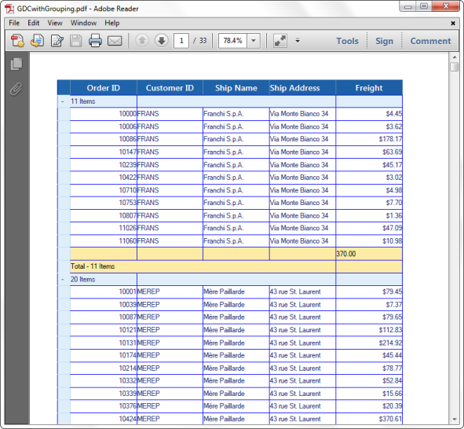 | markdownify }
{:.image }

The following screenshot illustrates how the GridData control appears as a PdfLightTable document after grouping the data.

{ 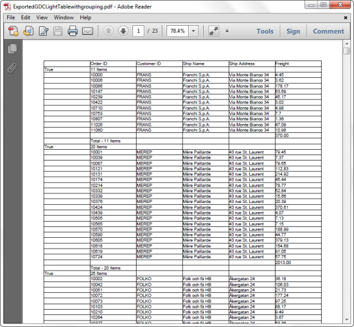 | markdownify }
{:.image }

###### Exporting Customized GridData Control 

Use the following code to customize the GridData control with blend styling.

[XAML]

        <syncfusion:GridDataControl x:Name="grid"

                                    Grid.Row="0"

                                    Margin="10"

                                    AllowEdit="False"

                                    AutoPopulateColumns="False"

                                    AutoPopulateRelations="False"

                                    ColumnSizer="Star"

                                    ContextMenuOptions="CustomWithDefault"

                                    ContextMenuStyle="{StaticResource 

                                                       RContextMenuStyle}"

                                    EnableBlendStyling="True"

                                    HeaderStyle="{StaticResource                                                                             

GridDataHeaderCellControlStyle2}"

                                    HideColumnsWhenGrouped="True"

                                    IsGroupsExpanded="True"

                                    ItemsSource="{Binding Path=MovieDetails}"

                                    ListBoxSelectionMode="MultiExtended"

                                    PersistGroupsExpandState="True"

                                    ShowAddNewRow="False"

                                    ShowFilters="True"

                                    ShowGroupDropArea="True"

                                    ShowHoveringBackground="false"

                                    ShowTableSummaries="True"

                                    ShowTooltips="True"

                                    StyleManager="{StaticResource 

                                                        CustomGridDataStyleManager}">

            &lt;!--  Table Summary rows created here  --&gt;

            &lt;syncfusion:GridDataControl.TableSummaryRows&gt;

                <syncfusion:GridDataSummaryRow Title="Total : {CountSummary} Items"

                                               ShowSummaryInRow="True"

                                               TitleColumnCount="2">

                    &lt;syncfusion:GridDataSummaryRow.SummaryColumns&gt;

                        <syncfusion:GridDataSummaryColumn Name="CountSummary"

                                                          Format="'{Count:d}'"

                                                          MappingName="OrderId"

                                                SummaryType="CountAggregate" />

                    &lt;/syncfusion:GridDataSummaryRow.SummaryColumns&gt;

                &lt;/syncfusion:GridDataSummaryRow&gt;

            &lt;/syncfusion:GridDataControl.TableSummaryRows&gt;

            &lt;!--  Grouped Column Created here  --&gt;

            &lt;syncfusion:GridDataControl.GroupedColumns&gt;

                &lt;syncfusion:GridDataGroupColumn ColumnName="Movie" /&gt;

            &lt;/syncfusion:GridDataControl.GroupedColumns&gt;

            &lt;!--  Visible Column Created here  --&gt;

            &lt;syncfusion:GridDataControl.VisibleColumns&gt;

                &lt;syncfusion:GridDataVisibleColumn MappingName="Movie"&gt;

                    &lt;syncfusion:GridDataVisibleColumn.FilterPane&gt;

                        <syncfusion:GridDataTextFilteringPane Foreground="Black"

                                                              IsThemed="False"

                                                              PredicateType="And" />

                    &lt;/syncfusion:GridDataVisibleColumn.FilterPane&gt;

                &lt;/syncfusion:GridDataVisibleColumn&gt;

  &lt;syncfusion:GridDataVisibleColumn ColumnStyle="{StaticResource GridDataColumnStyle}"                                                                 MappingName="OrderId"&gt;

                    &lt;syncfusion:GridDataVisibleColumn.FilterPane&gt;

                        <syncfusion:GridDataTextFilteringPane Foreground="Black"

                                                              IsThemed="False"

                                                              PredicateType="And" />

                    &lt;/syncfusion:GridDataVisibleColumn.FilterPane&gt;

                &lt;/syncfusion:GridDataVisibleColumn&gt;

  &lt;syncfusion:GridDataVisibleColumn ColumnStyle="{StaticResource GridDataColumnStyle}"                                                                   MappingName="Name"&gt;

                    &lt;syncfusion:GridDataVisibleColumn.FilterPane&gt;

                        <syncfusion:GridDataTextFilteringPane Foreground="Black"

                                                              IsThemed="False"

                                                              PredicateType="And" />

                    &lt;/syncfusion:GridDataVisibleColumn.FilterPane&gt;

                &lt;/syncfusion:GridDataVisibleColumn&gt;

  &lt;syncfusion:GridDataVisibleColumn ColumnStyle="{StaticResource GridDataColumnStyle}"                                                                 MappingName="SeatNo"&gt;

                    &lt;syncfusion:GridDataVisibleColumn.FilterPane&gt;

                        <syncfusion:GridDataTextFilteringPane Foreground="Black"

                                                              IsThemed="False"

                                                              PredicateType="And" />

                    &lt;/syncfusion:GridDataVisibleColumn.FilterPane&gt;

                &lt;/syncfusion:GridDataVisibleColumn&gt;

   &lt;syncfusion:GridDataVisibleColumn ColumnStyle="{StaticResource GridDataColumnStyle}"                                                                  MappingName="City"&gt;

                    &lt;syncfusion:GridDataVisibleColumn.FilterPane&gt;

                        <syncfusion:GridDataTextFilteringPane Foreground="Black"

                                                              IsThemed="False"

                                                              PredicateType="And" />

                    &lt;/syncfusion:GridDataVisibleColumn.FilterPane&gt;

                &lt;/syncfusion:GridDataVisibleColumn&gt;

   &lt;syncfusion:GridDataVisibleColumn ColumnStyle="{StaticResource GridDataColumnStyle}"                                                               MappingName="Theatre" /&gt;

            &lt;/syncfusion:GridDataControl.VisibleColumns&gt;

        &lt;/syncfusion:GridDataControl&gt;

Use the following code to export a customized GridData control:

Button Code to Export:

[XAML]

<Button Name="Exportbtn" Content="Export To Pdf" 

                            Click="Exportbtn_Click"/>

Button Click Event Code:

[CS]

private void Exportbtn_Click(object sender, RoutedEventArgs e)

        {

            // Dialog to save the exported document.

            SaveFileDialog sfd = new SaveFileDialog

            {

                DefaultExt = ".pdf",

                Filter = "Adobe PDF Files(*.pdf)|*.pdf",

                FilterIndex = 1

            };

            // Pdf document object to save the data as a pdf file.

            PdfDocument document = new PdfDocument();

            if (sfd.ShowDialog() == true)

            {

                using (Stream stream = sfd.OpenFile())

                {

                    document = dataGrid.Model.ExportToPdfGridDocument(

                                                              GridRangeInfo.Table());

                    document.Save(stream);

                    Process.Start(sfd.FileName);

                }

            }

        }

GridDataControl with Blend Styling

The below screenshot shows the customized blend styling of the GridData control.

{ 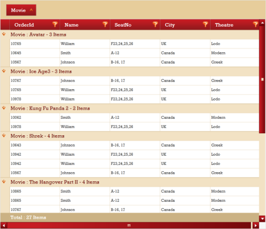 | markdownify }
{:.image }

Exported PDF Document

The screenshot below shows a PDF document of the blend styling GridData control.

{  | markdownify }
{:.image }

#### Serialization in GridDataControl

GridDataControl state can be serialized in XML format. 

All the properties that are exposed in GridDataTableProperties can be serialized. 

Serializing 

There are two methods to serialize forms:

* XML string
* XML file

API Usage

Serializing as XML String

The following code illustrates how to serialize as an XML string. 

[C#]

string result = this.dataGrid.Model.SerializeAsString();

Serializing as an XML File

The following code illustrates how to serialize as an XML file. 

[C#]

this.dataGrid.Model.Serialize("sample.xml");

De-serializing 

There are two methods to serialize forms:

* XML string
* XML file

API Usage

De-serialize from XML String

The following code illustrates how to de-serialize from an XML string_._ 

[C#]

this.dataGrid.Model.DeserializeFromString(content); // the content should be an XML string saved during the serialization process.

De-serialize from XML File

The following code illustrates how to de-serialize from an XML file.

[C#]

this.dataGrid.Model.Deserialize("sample.xml"); // sample.xml file should be the XML file saved during the serialization process.

### Events

The GridData control declares a number of events that it can handle, in response to the activities either by the end user or by the system. An event is a message that is handled, to notify an object or a class of the occurrence of an action. When an event is handled, all the event handlers are notified.

The GridData control offers technical benefits by declaring all its events as Routed Events. Hence, being the high level visual element in the visual tree, it need not hook the same event on all of its descendants (e.g. rows, columns and cells), such as MouseMove. Instead, it hooks the event on itself and hence, when the mouse moves over one of its descendants, the grid can be notified appropriately, whenever the event is handled without expecting its descendants to notify it.

Subscribing to Events

In order to get event notifications, the grid needs to be wired up with the required events. This process is called as subscribing to the events. It can be done using either XAML or C# code.

[XAML]

<syncfusion:GridDataControl x:Name="dataGrid" AutoPopulateColumns="True" ItemsSource="{StaticResource ordersSource}"

MouseMove="dataGrid_MouseMove">

[C#]

this.dataGrid.MouseMove+=new MouseEventHandler(dataGrid_MouseMove);

For either of the above code languages, you should have the following C# code to handle the MouseMove event.

[C#]

private void dataGrid_MouseMove(object sender, MouseEventArgs e)

{

    Console.WriteLine("Mouse cursor Postion:" + e.GetPosition(sender as IInputElement));

}

> _Note: These Grid WPF mouse events are more advantageous than using any other default mouse events because the default mouse events are controlled by Mouse Controller that makes it very hard to access the underlying data; whereas in case of Grid mouse events, it is directly possible to access the underlying data easily._

Unsubscribing the events

If you do not want the grid to listen to the event, you can unwire the event from the grid as follows.

[C#]

this.dataGrid.MouseMove-=new MouseEventHandler(dataGrid_MouseMove);

_GridData Control Events_

<table>
<tr>
<td>
Event</td><td>
Description</td></tr>
<tr>
<td>
CurrentCellActivating</td><td>
This event is handled before the grid activates the specified cell as current cell.</td></tr>
<tr>
<td>
CurrentCellActivated</td><td>
This event is handled after the grid activates the specified cell as current cell.</td></tr>
<tr>
<td>
CurrentCellActivateFailed</td><td>
This event is handled after the grid fails to activate a specific cell as current cell.</td></tr>
<tr>
<td>
CurrentCellDeactivating</td><td>
This event is handled before the grid deactivates the current cell.</td></tr>
<tr>
<td>
CurrentCellDeactivated</td><td>
This event is handled after the grid deactivates current cell.</td></tr>
<tr>
<td>
CurrentCellDeactivateFailed</td><td>
This event is handled after the grid fails to deactivate the current cell.</td></tr>
<tr>
<td>
CurrentCellConfirmChangesFailed</td><td>
This event is handled when the grid fails to save the changes made to the active current cell.</td></tr>
<tr>
<td>
CurrentCellAcceptedChanges</td><td>
This event is handled when the grid accepts the changes made to the active current cell.</td></tr>
<tr>
<td>
CurrentCellChanging</td><td>
This event is handled when the user wants to modify contents of the current cell.</td></tr>
<tr>
<td>
CurrentCellStartEditing</td><td>
This event is handled before the current cell switches to the editing mode.</td></tr>
<tr>
<td>
CurrentCellEditingComplete</td><td>
This event is handled when the grid completes editing the active current cell.</td></tr>
<tr>
<td>
CurrentCellRejectedChanges</td><td>
This event is handled when the grid rejects the changes made to the active current cell.</td></tr>
<tr>
<td>
CurrentCellChanged</td><td>
This event is handled when the user changes the contents of the current cell.</td></tr>
<tr>
<td>
CurrentCellMoved</td><td>
This event is handled when the current cell is successfully moved to a new position.</td></tr>
<tr>
<td>
CurrentCellMoveFailed</td><td>
This event is handled when the current cell fails to move to a new position.</td></tr>
<tr>
<td>
CurrentCellMoving</td><td>
This event is handled when the current cell is about to be moved to a new position.</td></tr>
<tr>
<td>
CurrentCellValidating</td><td>
This event is handled when the grid is validating the contents of the active current cell.</td></tr>
<tr>
<td>
CurrentCellValidated</td><td>
This event is handled when the grid has completed validating the contents of the active current cell.</td></tr>
<tr>
<td>
CellButtonClick</td><td>
This event is handled when the button in the grid cell is clicked.</td></tr>
<tr>
<td>
DropDownSelectionChanged</td><td>
This event is handled when the selected item in the grid drop-down is changed.</td></tr>
<tr>
<td>
CellClick</td><td>
This event is handled when the grid cell is clicked.</td></tr>
<tr>
<td>
CellCursor</td><td>
This event is handled when the cell has a cursor.</td></tr>
<tr>
<td>
CellMouseHoverEnter</td><td>
This event is handled when the mouse hits the cell and signals that the cell wants to handle the mouse events. This event is handled before the CellMouseHover event.</td></tr>
<tr>
<td>
CellMouseHover</td><td>
This event is handled when the mouse is moved over a grid cell.</td></tr>
<tr>
<td>
CellMouseHoverLeave</td><td>
This event is handled when the mouse leaves a cell.</td></tr>
<tr>
<td>
CellMouseDown</td><td>
This event is handled when the mouse button is pressed.</td></tr>
<tr>
<td>
CellMouseMove</td><td>
This event is handled when the mouse is moved over the cell.</td></tr>
<tr>
<td>
CellMouseUp</td><td>
This event is handled when the mouse button is released.</td></tr>
<tr>
<td>
CellCancelMode</td><td>
This event is handled when any current user interaction is canceled, example-Cancel select cells when Escape key is pressed.</td></tr>
<tr>
<td>
CellRestoreMode</td><td>
This event is handled when a cell is trying to restore the canceled changes.</td></tr>
<tr>
<td>
ResizingColumns</td><td>
This event is handled when the user is about to resize a column or is in the process of re-sizing a column.</td></tr>
<tr>
<td>
QueryAllowDragColumn</td><td>
This event is handled when the user hovers over a column header  or drags a column header using mouse.</td></tr>
<tr>
<td>
ResizingRows</td><td>
This event is handled when the user is about to resize a row or is in the process of re-sizing a row.</td></tr>
<tr>
<td>
RowValueCommitting</td><td>
This event triggers before the RowValue commit. This event works only when the UpdateMode is RowCacheMode.</td></tr>
<tr>
<td>
RowValueCommitted</td><td>
This event triggers after the RowValue commit. This event works only when the UpdateMode is RowCacheMode.</td></tr>
<tr>
<td>
RowValueCommittingCancelled</td><td>
If the RowValue committing is canceled in the RowValueCommitting event, then the RowValueCommittingCancelled event is fired. This event works only when the UpdateMode is RowCacheMode.</td></tr>
<tr>
<td>
RowValidating</td><td>
This event triggers when the focus moves from the current row to any other row.</td></tr>
</table>
### Performance

Essential Grid has a high performance standard, where you can make the grid to work with large amounts of data with few property settings, without a performance hit. It provides complete support for Virtual Mode, where the data is loaded only on demand and thus saves the memory consumption and provides quick response. It also handles very high frequency updates and refresh scenarios. The following topic discusses this:

#### High Frequency Updates

This section illustrates an example that let you know how to handle high frequency updates using grid while keeping the CPU usage at a minimum level. It uses a simple data source with few double-valued columns. It changes random cell values and also does record insertions and removals, using a timer event.

The following code illustrates changing of random cell values:

[C#]

private void timer_Tick(object sender, EventArgs e)

        {

....................

for (int i = 0; i < numberOfChangesEachTimer; i++)

            {

                int recNum = rand.Next(table.Rows.Count - 1);

                int col = rand.Next(table.Columns.Count - 1) + 1;

                DataRow drow = table.Rows[recNum];

                if (drow.RowState != DataRowState.Deleted && !(drow[col] is DBNull))

                {

                    double value = (int)(Convert.ToDouble(drow[col]) * (rand.Next(50) / 100.0f + 0.8));

                    //Console.WriteLine("{0}, {1}: {2}", recNum, col, value);

                    drow[col] = value;

                }

           }

}

The following code illustrates record insertions and removals:

[C#]

private void timer_Tick(object sender, EventArgs e)

        {

....................

if (toggleInsertRemove > 0 && (timerCount % insertRemoveModulus) == 0)

            {

                icount = ++icount % (toggleInsertRemove * 2);

                shouldInsert = icount < toggleInsertRemove;

                if (shouldInsert)

                {

                    for (int ri = 0; ri < insertRemoveCount; ri++)

                    {

                        int recNum = rand.Next(Math.Min(30, table.Rows.Count));

                        double next = rand.Next(100);

                        object[] values = new object[table.Columns.Count];

                        values[0] = "H" + ti.ToString("00000");

                        for (int n = 1; n < table.Columns.Count; n++)

                            values[n] = next + n;

                        DataRow drow = table.NewRow();

                        drow.ItemArray = values;

                        table.Rows.InsertAt(drow, recNum);

                        ti++;

                    }

                }

                else

                {

                    for (int ri = 0; ri < insertRemoveCount; ri++)

                    {

                        int recNum = 5; //rand.Next(m_set.Count - 1);

                        int rowNum = recNum + 1;

                        // Underlying data structure (this could be a data table or whatever structure

                        // you use behind a virtual grid).

                        if (table.Rows.Count > 10)

                            table.Rows.RemoveAt(recNum);

                    }

                }

            }

}

> 

> _Note: For complete code of this example, refer the following browser sample:_

> _...\My Documents\Syncfusion\EssentialStudio\&lt;Version Number&gt;\WPF\Grid.WPF\ Samples\3.5\WindowsSamples\Grid Data Control – Advanced\Trader Grid Test Demo_

#### PLINQ Support in GridDataControl

[PLINQ](http://msdn.microsoft.com/en-us/library/dd997425.aspx) is the parallel implementation of the standard LINQ. GridDataControl uses a QueryableCollectionView that works on top of LINQ expressions for performing major operations such as Sorting, Filtering, Grouping and Summaries calculation. Since PLINQ works on top of LINQ expression trees, QueryableCollectionView now has a property UsePLINQ = true / false (this class implements _IParallelizableView_ interface) that would add a AsParallel() to change it into a Parallel Query. Sorting, Grouping and Summary operations would be automatically done in parallel when this property is set.

_Plinq support_

[XAML]

<syncfusion:GridDataControl

                x:Name="grid"  

                AutoPopulateColumns="True"    

                AutoPopulateRelations="False"

                UsePLINQ="True"

VisualStyle="Office14Silver">

    &lt;/syncfusion:GridDataControl&gt;

[C#]

this.gridDataControl1.UsePLINQ = true;

> 

> _Note: This only works for strongly-typed collections and not for legacy object models like DataTable._

### Features that work in PLINQ

The following features work by default when UsePLINQ is set to true:

* Sorting
* Grouping and
* Summaries

> _Note: For custom summaries, PLINQ code has to be implemented at the client implementation._

### Real Time Application

Essential Grid finds a wide range of applications in real time. It is completely optimized to deal with large amount of real time data. Its virtual mode support and high frequency updates behavior make the grid to take part in stock portfolio applications.

#### Portfolio Grid

Essential Grid is the proper choice to use in portfolio applications, as it deals with both huge and real time data without a performance hit. This section illustrates how to employ the grid in portfolio applications.

This example displays three GridData controls (GDCs) and three Chart controls hosted in a Grid control using its CellTypes feature. The three GDCs display stock details in three different views – Overview, Sector Industry View and Stock Exchange View.  Among the charts, one illustrates the performance of large portfolio account, and the other two illustrates the individual country contributions to specific portfolio accounts. You can click any portfolio account in the PortfolioAccounts chart to drill down to its contributions.

The GDCs are extremely customized with appropriate groups and summaries in order to provide the desired view. It also highlights the change of stock values. Value increase is indicated by green foreground and decrease in values is indicated by red foreground.

The following image shows the Essential Grid being used in a portfolio application:

{  | markdownify }
{:.image }

> _Note: For complete code of this example, refer to the following browser sample:_

_...\My Documents\Syncfusion\EssentialStudio\&lt;Version Number&gt;\WPF\Grid.WPF\Samples\3.5\WindowsSamples\Product Showcase\Stock Dashboard Demo_

### VS2010 Designer support  

GridDataControl provides rich design time experience by associating a designer. This allows the users to modify the various grid settings to change the look and feel of the grid.

The grid designer is populated with numerous options when ItemsSource assigned to the grid. This enables the users to edit the basic grid properties and the properties of individual column. Changes in any of these properties in the designer have an immediate impact on its XAML code and hence the designer makes the grid more user-friendly.

Activating Designer

1. Open Design window.
2. Right-click on the grid.

> _Note: An edit menu opens._

{  | markdownify }
{:.image }

3. Select Designer View -> Show Designer. 

> _Note: Ensure that the grid is assigned with an ItemsSource._

4. Designer Window is displayed.

Designer Window has two options:

* Basic Properties - Modify the overall settings of the grid.
* Visible Columns - Automatically generates a property list for each visible column in the grid.

{  | markdownify }
{:.image }

Basic Properties

This option enables the users to modify the overall settings of the grid. The properties are categorized into three types:

* Column Properties
* Row Properties
* Cell Properties

{  | markdownify }
{:.image }

Column Properties 

This section explores the various column options such as Auto Populate Columns, Auto Populate Relations, Allow Sort, Allow Drag Columns, Allow Resize Columns, Show Column Options, Show Filters, Show Group Drop Area and Column Sizer combo box.

1. Select as you require in this list.

{  | markdownify }
{:.image }

Row Properties

This section explores the row-related properties such as Show Add New, Show Group Summaries, Show Row Header, Allow Resize Rows, Allow Delete and List Box Selection Modes combo box.

Select as you require in this list.

{  | markdownify }
{:.image }

Cell Properties

This section explores cell level properties such as Allow Edit, Show Error Tooltips, Show Tooltips, Allow Selection combo box, Activate Current Cell Behavior combo box and Visual Style combo box.

{  | markdownify }
{:.image }

Select as you require in this list.

Visible Columns

This section automatically generates a property list for each visible column in the grid. Each list includes the column level properties such as Allow Filter, Allow Sort, Allow Drag, Allow Group, Allow Resize, Is Read Only, Auto fit, Width, Header Text field, Column Format combo box and Cell Type combo box.

* Click Visible Columns.
* Two options are displayed

Generate Columns

Clear Columns

{  | markdownify }
{:.image }

Generate Columns

1. Click Generate Columns to populate the properties for each visible column. 
> 
_Note: Property list for visible column in the grid displays._

{  | markdownify }
{:.image }

2. Select as you require. 

{  | markdownify }
{:.image }

Special Cell Types

This combo box lists the various possible cell types applicable to the column. It also automatically deducts the column type of the grid columns and sets the CellType of it. For example, if the column is of Boolean type, it automatically has a CheckBox.

{  | markdownify }
{:.image }

Clear Columns

Click Clear Columns to clear the visible column settings.

### Freezable Support in GridDataControl

GridDataControl now supports inheritance context using Freezable. Developers can use this feature to bind values to elements not present in the Visual Tree. Usually, the ElementName and DataContext bindings are resolved based on the target dependency object’s position within the element tree (or the namescope to which the target dependency object belongs).  But in case, if the target dependency object is not in the tree such as HeaderText in GridDataVisibleColumn, then having an inheritance context for DependencyObjects external to an element tree is the solution. We can achieve this by using Freezable.

The reason the Freezable trick works is because a Freezable object has its own notion of “inheritance context”.  When the property engine sets the effective value of a dependency property, it looks at that new value to determine whether it is a dependency object that would like to be part of a special inheritance tree.  A Freezable is one such object that always wants to be in the inheritance tree when not frozen.  

[XAML]

&lt;TextBox Text="Test" x:Name="txtBlock" /&gt;

A Separate TextBlock Text can be binded to GridDataVisibleColumn using the following code.

&lt;syncfusion:GridDataControl AutoPopulateColumns="False" x:Name="dataGrid" ItemsSource="{Binding}"&gt;

&lt;syncfusion:GridDataControl.VisibleColumns  &gt;

&lt;syncfusion:GridDataVisibleColumn  MappingName="Status"  Width="200"  HeaderText="{Binding Text,ElementName=txtBlock}" /&gt;

&lt;/syncfusion:GridDataControl.VisibleColumns&gt;

&lt;/syncfusion:GridDataControl&gt;

### Grid Localization Support

Localization is the process of making your application multi-lingual, by formatting content according to cultures. This involves configuring the application for a specific language. Culture is the combination of language and the location (e.g. En-US is the culture for English spoken in  United States; En-GB is the culture for English spoken in  Great Britain). Syncfusion Grid allows you to set custom resource through the Resx file. The user can simply give the string values in the resource file for a specific culture and set the culture in the application. The given string values are set to the Grid that does not affect the Code Block of the Grid

Adding Localization to an Application 

The following steps explain the implementation of Localization support in applications.

Creating an Application

Create a WPF application and add GridDataControl to it. 

Creating a Resource File

To create a Resource file:

1. Create a folder named “Resources” in the application. 
2. Create a resource file (Resx file) and name it “Syncfusion.Grid.Wpf.&lt;your culture info name&gt;.resx” E.g. Syncfusion.Grid.Wpf.en-GB.resx. 
3. Use the prescribed naming convention as it is mandatory. 
4. The following screenshot explains the addition of a Resource File to the application. 

{  | markdownify }
{:.image }

5. Select the String option in the Resource file. This is explained in the following screenshot.

{  | markdownify }
{:.image }

6. Enter the “Name” and “Value” in the Resource file. 

The String Property names used in the Grid are given in the Property table. This is explained in the following screenshot.

{  | markdownify }
{:.image }

Setting the Culture Information in the Application

The culture information should be set in the application before the InitializeComponent() method is called. Now, the application is set to Britain English Culture info. The following code snippet explains the implementation of this.

[C#]

        public MainWindow()

        {

            System.Threading.Thread.CurrentThread.CurrentUICulture = new               System.Globalization.CultureInfo("en-GB");

            InitializeComponent();

        }

Properties

_Localization Property Table_

<table>
<tr>
<th>
Property</th><th>
Description</th><th>
Type</th><th>
Data Type</th></tr>
<tr>
<td>
AllowDrag</td><td>
Sets the string for AllowDrag property</td><td>
static</td><td>
string</td></tr>
<tr>
<td>
AllowDrag</td><td>
Sets the string for AllowDrag</td><td>
static</td><td>
string</td></tr>
<tr>
<td>
AllowGroup</td><td>
Sets the string for AllowGroup</td><td>
static</td><td>
string</td></tr>
<tr>
<td>
AllowResize</td><td>
Sets the string for AllowResize</td><td>
static</td><td>
string</td></tr>
<tr>
<td>
AllowSort</td><td>
Sets the string for  AllowSort</td><td>
static</td><td>
string</td></tr>
<tr>
<td>
AND</td><td>
Sets the string for AND</td><td>
static</td><td>
string</td></tr>
<tr>
<td>
ApplyWidthSettings</td><td>
Sets the string for ApplyWidthSettings</td><td>
static</td><td>
string</td></tr>
<tr>
<td>
AutoFit</td><td>
Sets the string for AutoFit</td><td>
static</td><td>
string</td></tr>
<tr>
<td>
CanntPerformSortMessage</td><td>
Sets the string for CanntPerformSortMessage</td><td>
static</td><td>
string</td></tr>
<tr>
<td>
ClipboardCopyPaste</td><td>
Sets the string for ClipboardCopyPaste</td><td>
static</td><td>
string</td></tr>
<tr>
<td>
ColumnFormat</td><td>
Sets the string for ColumnFormat</td><td>
static</td><td>
string</td></tr>
<tr>
<td>
ConfirmDeleteMessage</td><td>
Sets the string for ConfirmDeleteMessage</td><td>
static</td><td>
string</td></tr>
<tr>
<td>
Contains</td><td>
Sets the string for Contains</td><td>
static</td><td>
string</td></tr>
<tr>
<td>
CurrentPageText</td><td>
Sets the string for CurrentPageText</td><td>
static</td><td>
string</td></tr>
<tr>
<td>
DeleteMessage</td><td>
Sets the string for DeleteMessage</td><td>
static</td><td>
string</td></tr>
<tr>
<td>
DragDropText</td><td>
Sets the string for DragDropText</td><td>
static</td><td>
string</td></tr>
<tr>
<td>
DynamicOptions</td><td>
Sets the string for DynamicOptions</td><td>
static</td><td>
string</td></tr>
<tr>
<td>
EndsWith</td><td>
Sets the string for EndsWith</td><td>
static</td><td>
string</td></tr>
<tr>
<td>
EnterFilterValue</td><td>
Sets the string for EnterFilterValue</td><td>
static</td><td>
string</td></tr>
<tr>
<td>
Equals</td><td>
Sets the string for Equals</td><td>
static</td><td>
string</td></tr>
<tr>
<td>
First</td><td>
Sets the string for First</td><td>
static</td><td>
string</td></tr>
<tr>
<td>
GreaterThan</td><td>
Sets the string for GreaterThan</td><td>
static</td><td>
string</td></tr>
<tr>
<td>
GreaterThanOrEqual</td><td>
Sets the string for GreaterThanOrEqual</td><td>
static</td><td>
string</td></tr>
<tr>
<td>
HCenter</td><td>
Sets the string for HCenter</td><td>
static</td><td>
string</td></tr>
<tr>
<td>
HeaderText</td><td>
Sets the string for HeaderText</td><td>
static</td><td>
string</td></tr>
<tr>
<td>
HLeft</td><td>
Sets the string for HLeft</td><td>
static</td><td>
string</td></tr>
<tr>
<td>
Horizontal</td><td>
Sets the string for Horizontal</td><td>
static</td><td>
string</td></tr>
<tr>
<td>
HRight</td><td>
Sets the string for HRight</td><td>
static</td><td>
string</td></tr>
<tr>
<td>
HStretch</td><td>
Sets the string for HStretch</td><td>
static</td><td>
string</td></tr>
<tr>
<td>
InvalidColumn</td><td>
Sets the string for InvalidColumn</td><td>
static</td><td>
string</td></tr>
<tr>
<td>
InvalidDataTime</td><td>
Sets the string for InvalidDataTime</td><td>
static</td><td>
string</td></tr>
<tr>
<td>
InvalidDataToFilter</td><td>
Sets the string for InvalidDataToFilter</td><td>
static</td><td>
string</td></tr>
<tr>
<td>
IsReadOnly</td><td>
Sets the string for IsReadOnly</td><td>
static</td><td>
string</td></tr>
<tr>
<td>
Last</td><td>
Sets the string for Last</td><td>
static</td><td>
string</td></tr>
<tr>
<td>
LessThan</td><td>
Sets the string for LessThan</td><td>
static</td><td>
string</td></tr>
<tr>
<td>
LessThanOrEqual</td><td>
Sets the string for LessThanOrEqual</td><td>
static</td><td>
string</td></tr>
<tr>
<td>
MatchCase</td><td>
Sets the string for MatchCase</td><td>
static</td><td>
string</td></tr>
<tr>
<td>
Next</td><td>
Sets the string for Next</td><td>
static</td><td>
string</td></tr>
<tr>
<td>
NoMoreItemRemoveMessage</td><td>
Sets the string for NoMoreItemRemoveMessage</td><td>
static</td><td>
string</td></tr>
<tr>
<td>
None</td><td>
Sets the string for None</td><td>
static</td><td>
string</td></tr>
<tr>
<td>
NoRecordsfound</td><td>
Sets the string for NoRecordsfound</td><td>
static</td><td>
string</td></tr>
<tr>
<td>
NotEnoughSpaceMessage</td><td>
Sets the string for NotEnoughSpaceMessage</td><td>
static</td><td>
string</td></tr>
<tr>
<td>
NotEquals</td><td>
Sets the string for NotEquals</td><td>
static</td><td>
string</td></tr>
<tr>
<td>
NotSupportDeletingItemMessage</td><td>
Sets the string for  NotSupportDeletingItemMessage</td><td>
static</td><td>
string</td></tr>
<tr>
<td>
OR</td><td>
Sets the string for OR</td><td>
static</td><td>
string</td></tr>
<tr>
<td>
PageSizes</td><td>
Sets the string for PageSizes</td><td>
static</td><td>
string</td></tr>
<tr>
<td>
Previous</td><td>
Sets the string for Previous</td><td>
static</td><td>
string</td></tr>
<tr>
<td>
PrintOutputColor</td><td>
Sets the string for PrintOutputColor</td><td>
static</td><td>
string</td></tr>
<tr>
<td>
PrintText</td><td>
Sets the string for PrintText</td><td>
static</td><td>
string</td></tr>
<tr>
<td>
PrintZoom</td><td>
Sets the string for PrintZoom</td><td>
static</td><td>
string</td></tr>
<tr>
<td>
SelectAllFilter</td><td>
Sets the string for SelectAllFilter</td><td>
static</td><td>
string</td></tr>
<tr>
<td>
StartsWith</td><td>
Sets the string for StartsWith</td><td>
static</td><td>
string</td></tr>
<tr>
<td>
TextAlignment</td><td>
Sets the string for TextAlignment</td><td>
static</td><td>
string</td></tr>
<tr>
<td>
VBottom</td><td>
Sets the string for VBottom</td><td>
static</td><td>
string</td></tr>
<tr>
<td>
VCenter</td><td>
Sets the string for VCenter</td><td>
static</td><td>
string</td></tr>
<tr>
<td>
Vertical</td><td>
Sets the string for Vertical</td><td>
static</td><td>
string</td></tr>
<tr>
<td>
VStretch</td><td>
Sets the string for VStretch</td><td>
static</td><td>
string</td></tr>
<tr>
<td>
VTop</td><td>
Sets the string for VTop</td><td>
static</td><td>
string</td></tr>
<tr>
<td>
Width</td><td>
Sets the string for Width</td><td>
static</td><td>
string</td></tr>
<tr>
<td>
WidthOptions</td><td>
Sets the string for WidthOptions</td><td>
static</td><td>
string</td></tr>
</table>

Sample Link

Refer to the sample in the shipped Sample Browser: 

Essential Studio WPF Sample Browser  Grid  LocalizationSupport LocalizationDemo.

### MVVM Enhancements

#### View – View Model Communication

In MVVM, commands are used to communicate between the View and View Model when a particular action takes place in the View. The GridData control contains events for all actions. In some cases, you may have to use events to meet requirements that do not adhere to the MVVM policy; you can overcome this with the EventToCommand approach.

To support the EventToCommand approach, commands have been added for all events in the GridData control and tables to provide complete MVVM support.

{  | markdownify }
{:.image }

GridData control has two commands for each event. The first one passes the event argument to the command as parameter, and the second one does not pass any parameter to the command. This apart, the command parameter can also be changed at Sample level.

#### Adding Commands to a GridData Control

You can add commands to a GridData control in the following three ways:

* By using Command with actual event arguments
* By using Command with custom parameter
* By overriding existing command behavior

By using a Command with Actual Event Arguments

This section explains how to add GridDataControlRecordsSelectionChangedCommandWithEventArgs command to the GridData control. The actual event arguments are passed to the Command method as parameters.

The following code example illustrates how to define the GridDataControlRecordsSelectionChangeddCommandWithEventArgs command in XAML.

[XAML]

<syncfusion:GridDataControl x:Name="dataGrid" AutoPopulateColumns="True" AutoPopulateRelations="False" 

ItemsSource="{Binding GDCSource}" ShowAddNewRow="False" 

syncmvvm:GridDataControlRecordsSelectionChangedCommandWithEventArgs.Command="{Binding SelectedItemChanged}">

The following code example illustrates binding GridDataControlRecordsSelectionChangedCommandWithEventArgs defined in the View.

[C#]

private BaseCommand selectedItemChanged;
public BaseCommand SelectedItemChanged

{

get
{

if (selectedItemChanged == null)
selectedItemChanged = new BaseCommand(SelectedItemChangedMethod);
return selectedItemChanged;

}

}

void SelectedItemChangedMethod(object parameter)
{

var item = parameter as GridDataRecordsSelectionChangedEventArgs;
if (item != null)

{

var data = item.AddedItems[0] as Data;
this.SelectedCustomerID = "Customer ID : " + data.CustomerID;

}

}

When you select a record while running your application, the SelectedItemChanged command is triggered with the actual GridDataRecordsSelectionChangedEventArgs event argument.

{  | markdownify }
{:.image }

Sample Location

A sample application can be downloaded from the following location:

[http://www.syncfusion.com/downloads/Support/DirectTrac/95643/MVVMWithActualEventArgs1100780673.zip](http://www.syncfusion.com/downloads/Support/DirectTrac/95643/MVVMWithActualEventArgs1100780673.zip)

##### By using a Command with a Custom Parameter

This section illustrates how to add the GridDataControlRecordsSelectionChangedCommand command to the GridData control and pass the GridData control as customer parameter.

The following code example can be used to define GridDataControlRecordsSelectionChangeddCommand in XAML.

[XAML]

<syncfusion:GridDataControl x:Name="dataGrid" Grid.Row="0"
AutoPopulateColumns="False" ItemsSource="{Binding GDCSource}"
syncmvvm:GridDataControlRecordsSelectionChangedCommand.Command="{Binding SelectedItemChanged}"

syncmvvm:GridDataControlRecordsSelectionChangedCommand.CommandParameter="{

Binding ElementName=dataGrid}">

The following code example is used for binding GridDataControlRecordsSelectionChangedCommand defined in the view.

[C#]

private BaseCommand selectedItemChanged;
public BaseCommand SelectedItemChanged
{

get

{

if (selectedItemChanged == null)
selectedItemChanged = new BaseCommand(SelectedItemChangedMethod);
return selectedItemChanged;

}

}

void SelectedItemChangedMethod(object parameter)
{

var grid = parameter as GridDataControl;
if(grid != null)
{

var data = grid.SelectedItem as Data;
this.SelectedCustomerID = "Customer ID : " +  data.CustomerID;

}

}

When you select a record while running your application, the SelectedItemChanged command gets triggered with the custom GridDataControl parameter.

{  | markdownify }
{:.image }

If there is no parameter set in the View, then the parameter is passed in the method call.

{  | markdownify }
{:.image }

Sample Location

A sample application can be downloaded from the following location:

[http://www.syncfusion.com/downloads/Support/DirectTrac/95643/MVVMWithCustomParameter1792996222.zip](http://www.syncfusion.com/downloads/Support/DirectTrac/95643/MVVMWithCustomParameter1792996222.zip)

##### By Overriding the Command Behavior

Another approach is to override a command’s behavior with a custom parameter. This section explains how to override the GridDataControlCellMouseMoveCommandBehavior and return the record (i.e. return the record on which the pointer rests).

First, you need to create a class and override it from the GridDataControlCellMouseMoveCommandBehavior as shown in the following code example.

[C#]

public class MyGridDataControlMouseMoveBehavior : GridDataControlCellMouseMoveCommandBehavior<Data>
{

public MyGridDataControlMouseMoveBehavior(): base((o, e) =>

{

var grid = o as GridDataControl;
RowColumnIndex rowColumnIndex = grid.Model.Grid.PointToCellRowColumnIndexOutsideCells(Mouse.GetPosition(grid.Model.Grid), true);
Debug.WriteLine("Index is {0}", rowColumnIndex.RowIndex);
var data = grid.ItemsSource as ObservableCollection<Data>;
int index = rowColumnIndex.RowIndex - grid.Model.HeaderRows - 2;
if (index >= 0)
{

var record = data[index];
return record;

}                   
else
return null;

})
{
}

}

public class MyGridDataControlMouseMoveCommand : GridDataControlCellMouseMoveCommand<Data, MyGridDataControlMouseMoveBehavior>        
{

} 

Now, bind the behavior to the GridData control. The following code example illustrates this.

[XAML]

<syncfusion:GridDataControl x:Name="dataGrid" Grid.Row="0" AutoPopulateColumns="True" AutoPopulateRelations="False" ItemsSource="{Binding GDCSource}"                        Utils:MyGridDataControlMouseMoveCommand.Command="{Binding MouseMoveCommand}"

VisualStyle="Office14Blue" />

When you hover the mouse over a row while running your application, the overridden behavior class triggers and returns the current record.

{  | markdownify }
{:.image }

Sample Location

A sample application can be downloaded from the following location:

[http://www.syncfusion.com/downloads/Support/DirectTrac/95643/MVVMWithCustomArguments1965076929.zip](http://www.syncfusion.com/downloads/Support/DirectTrac/95643/MVVMWithCustomArguments1965076929.zip)

