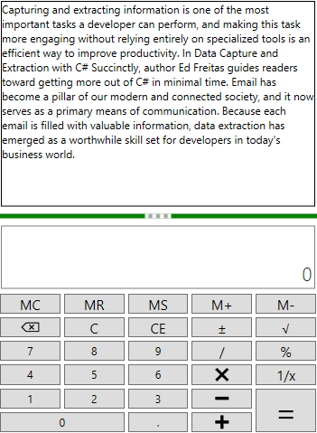
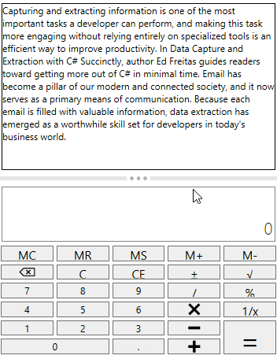
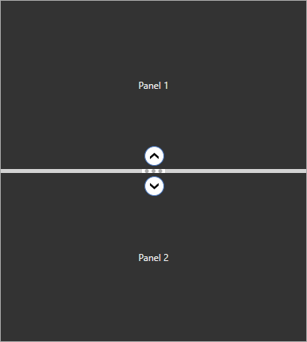

# Appearance in WPF SfGridSplitter

This section explains different UI customization and styling support available in [SfGridSplitter](https://help.syncfusion.com/cr/wpf/Syncfusion.SfInput.Wpf~Syncfusion.Windows.Controls.Input.SfGridSplitter.html) control.

## Setting the Background

We can change the background color of `SfGridSplitter` by setting the `Background` property. The default color value of `Background` property is `Light Gray`.




<Border
    Margin="10"
    BorderBrush="DarkGray"
    BorderThickness="1">
    <Grid>
        <Grid.RowDefinitions>
            <RowDefinition />
            <RowDefinition Height="auto" />
            <RowDefinition />
        </Grid.RowDefinitions>
        <TextBlock Grid.Row="0" 
                   HorizontalAlignment="Center"
                   VerticalAlignment="Center"
                   TextAlignment="Center"
                   Text="Panel 1">
        </TextBlock>
        <TextBlock Grid.Row="2"
                   HorizontalAlignment="Center" 
                   VerticalAlignment="Center" 
                   TextAlignment="Center"
                   Text="Panel 2">
        </TextBlock>
        
        <!--Grid Splitter-->
        <syncfusion:SfGridSplitter Background="Green"
                                   HorizontalAlignment="Stretch"
                                   Width="auto"
                                   Grid.Row="1">
        </syncfusion:SfGridSplitter>
    </Grid>
</Border>




N> View [Sample](https://github.com/SyncfusionExamples/syncfusion-gridsplitter-control-examples/tree/master/Samples/Appearance) in GitHub

### Setting style for Preview GridSplitter

We can change the UI and style of the preview grid splitter by using the [SfGridSplitter.PreviewStyle](https://help.syncfusion.com/cr/wpf/Syncfusion.SfInput.Wpf~Syncfusion.Windows.Controls.Input.SfGridSplitter~PreviewStyle.html) property. We can see the effect of `PreviewStyle` only on when `ShowsPreview` property value is `true`.




<Border
    Margin="10"
    BorderBrush="DarkGray"
    BorderThickness="1">
    <Grid>
        <Grid.RowDefinitions>
            <RowDefinition />
            <RowDefinition Height="auto" />
            <RowDefinition />
        </Grid.RowDefinitions>
        <TextBlock Grid.Row="0" 
                   HorizontalAlignment="Center"
                   VerticalAlignment="Center"
                   TextAlignment="Center"
                   Text="Panel 1">
        </TextBlock>
        <TextBlock Grid.Row="2"
                   HorizontalAlignment="Center" 
                   VerticalAlignment="Center" 
                   TextAlignment="Center"
                   Text="Panel 2">
        </TextBlock>
        
        <!--Grid Splitter-->
        <syncfusion:SfGridSplitter ShowsPreview="True"
                           HorizontalAlignment="Stretch"
                           Width="auto"
                           Grid.Row="1" >
            <syncfusion:SfGridSplitter.PreviewStyle>
                
            </syncfusion:SfGridSplitter.PreviewStyle>
        </syncfusion:SfGridSplitter>
    </Grid>
</Border>




N> View [Sample](https://github.com/SyncfusionExamples/syncfusion-gridsplitter-control-examples/tree/master/Samples/Appearance) in GitHub

## Theme

You can customize the appearance of the `SfGridSplitter` control by using the [SfSkinManager.SetVisualStyle](https://help.syncfusion.com/cr/cref_files/wpf/Syncfusion.SfSkinmanager.Wpf~Syncfusion.SfSkinmanager.SfSkinmanager~SetVisualStyle.html) method and `SfSkinManager.VisualStyle` property . The following are the various built-in visual styles for `SfGridSplitter` control.

* Blend
* Default
* Lime
* MaterialDark
* MaterialDarkBlue
* MaterialLight
* MaterialLightBlue
* Metro
* Office2010Black
* Office2010Blue
* Office2010Silver
* Office2013DarkGray
* Office2013LightGray
* Office2013White
* Office2016Colorful
* Office2016DarkGray
* Office2016White
* Office365
* Saffron
* SystemTheme
* VisualStudio2013
* VisualStudio2015

Here, the `Blend` style is applied to the `SfGridSplitter`.




<Border
    Margin="10"
    BorderBrush="DarkGray"
    BorderThickness="1">
    <Grid>
        <Grid.RowDefinitions>
            <RowDefinition />
            <RowDefinition Height="auto" />
            <RowDefinition />
        </Grid.RowDefinitions>
        <TextBlock Grid.Row="0" 
                   HorizontalAlignment="Center"
                   VerticalAlignment="Center"
                   TextAlignment="Center"
                   Text="Panel 1">
        </TextBlock>
        <TextBlock Grid.Row="2"
                   HorizontalAlignment="Center" 
                   VerticalAlignment="Center" 
                   TextAlignment="Center"
                   Text="Panel 2">
        </TextBlock>
        
        <!--Grid Splitter-->
        <syncfusion:SfGridSplitter syncfusionskin:SfSkinManager.VisualStyle="Blend" 
                                   EnableCollapseButton="True"
                                   HorizontalAlignment="Stretch"
                                   Width="auto"
                                   Grid.Row="1"/>
    </Grid>
</Border>




//Namespace for the SfSkinManager.
using Syncfusion.SfSkinManager;

SfGridSplitter sfGridSplitter = new SfGridSplitter();
SfSkinManager.SetVisualStyle(sfGridSplitter, VisualStyles.Blend);




N> View [Sample](https://github.com/SyncfusionExamples/syncfusion-gridsplitter-control-examples/tree/master/Samples/Themes) in GitHub