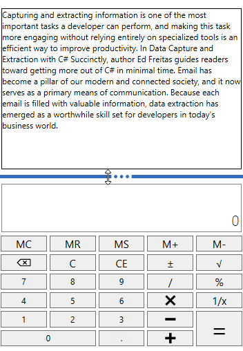
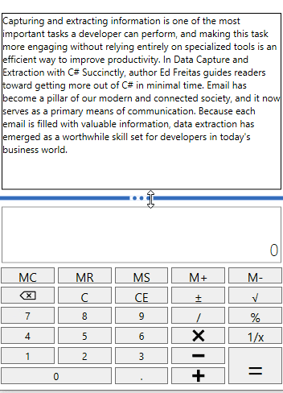
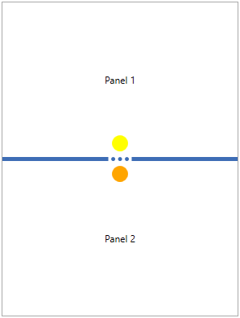
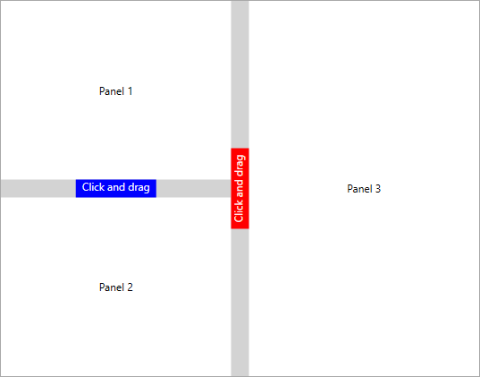
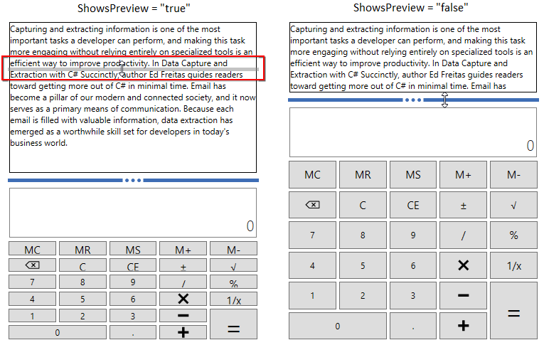
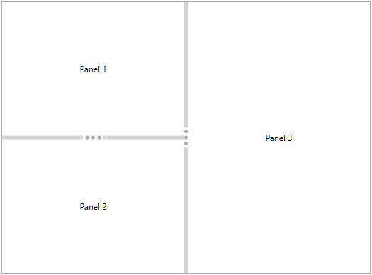

# Getting Started with WPF SfGridSplitter

This section explains how to create a WPF [SfGridSplitter](https://help.syncfusion.com/cr/wpf/Syncfusion.Windows.Controls.Input.SfGridSplitter.html) and explains about its structure.

## Structure of SfGridSplitter

## Visual representation 

## Assembly deployment

Refer to the [control dependencies](https://help.syncfusion.com/wpf/control-dependencies#sfgridsplitter) section to get the list of assemblies or NuGet package that needs to be added as a reference to use the control in any application.

You can find more details about installing the NuGet package in a WPF application in the following link: 

[How to install nuget packages](https://help.syncfusion.com/wpf/nuget-packages)

## Adding control manually in XAML

To add the control manually in XAML, follow the given steps:

1.	Add the following required assembly references to the project:
    * Syncfusion.SfInput.WPF
    * Syncfusion.SfShared.WPF
2.	Import Syncfusion WPF schema **http://schemas.syncfusion.com/wpf** in the XAML page.
3.	Declare the `SfGridSplitter` control in the XAML page.




<Window xmlns="http://schemas.microsoft.com/winfx/2006/xaml/presentation"
        xmlns:x="http://schemas.microsoft.com/winfx/2006/xaml"
        xmlns:syncfusion="http://schemas.syncfusion.com/wpf" 
        x:Class="SfGridSplitterSample.MainWindow"
        Title="SfGridSplitter Sample" Height="350" Width="525">
    <Grid>
        <!-- Adding SfGridSplitter control -->
        <syncfusion:SfGridSplitter x:Name="sfGridSplitter"
                                   HorizontalAlignment="Stretch"/>
    </Grid>
</Window>




## Add control manually in C\#

To add the control manually in C#, follow the given steps:

1.	Add the following required assembly references to the project:
    * Syncfusion.SfInput.WPF
    * Syncfusion.SfShared.WPF
2.	Import the `SfGridSplitter` namespace **using Syncfusion.Windows.Controls.Input;**.
3.	Create an `SfGridSplitter` instance, and add it to the window.




using Syncfusion.Windows.Controls.Input;
namespace SfGridSplitterSample {    
    public partial class MainWindow : Window {
        public MainWindow() {
            InitializeComponent();

            //Creating an instance of SfGridSplitter control
            SfGridSplitter sfGridSplitter = new SfGridSplitter();
            sfGridSplitter.HorizontalAlignment = HorizontalAlignment.Stretch;

            //Adding SfGridSplitter as window content
            this.Content = sfGridSplitter;
        } 
    }
}




N> [View Sample in GitHub](https://github.com/SyncfusionExamples/syncfusion-gridsplitter-control-examples/tree/master/Samples/GridSplitter)

## Resize the grid rows

If we want to resize the specific grid rows, place the `SfGridSplitter` on next or previous row and set the `HorizontalAlignment` property as `Stretch` and `ResizeBehavior` property value as `PreviousAndNext`.




<Border
    Margin="10"
    BorderBrush="DarkGray"
    BorderThickness="1">
    <Grid>
        <Grid.RowDefinitions>
            <RowDefinition />
            <RowDefinition Height="auto" />
            <RowDefinition />
        </Grid.RowDefinitions>
        <TextBlock Grid.Row="0" 
                   HorizontalAlignment="Center"
                   VerticalAlignment="Center"
                   TextAlignment="Center"
                   Text="Panel 1">
        </TextBlock>
        <TextBlock Grid.Row="2"
                   HorizontalAlignment="Center" 
                   VerticalAlignment="Center" 
                   TextAlignment="Center"
                   Text="Panel 2">
        </TextBlock>

        <!--Grid Splitter-->
        <syncfusion:SfGridSplitter Name="gridSplitter"
                                   HorizontalAlignment="Stretch" 
                                   ResizeBehavior="PreviousAndNext"
                                   Width="auto"
                                   Grid.Row="1">
        </syncfusion:SfGridSplitter>
    </Grid>
</Border>




N> [View Sample in GitHub](https://github.com/SyncfusionExamples/syncfusion-gridsplitter-control-examples/tree/master/Samples/GridSplitter)

## Resize the grid columns

If we want to resize the specific grid columns, place the `SfGridSplitter` on next or previous column and set the `VerticalAlignment` property as `Stretch` and `ResizeBehavior` property value as `PreviousAndNext`.




<Border
    Margin="10"
    BorderBrush="DarkGray"
    BorderThickness="1">
    <Grid>
        <Grid.ColumnDefinitions>
            <ColumnDefinition />
            <ColumnDefinition Width="auto" />
            <ColumnDefinition />
        </Grid.ColumnDefinitions>
        <TextBlock Grid.Column="0" 
                   HorizontalAlignment="Center"
                   VerticalAlignment="Center"
                   TextAlignment="Center"
                   Text="Panel 1">
        </TextBlock>
        <TextBlock Grid.Column="2"
                   HorizontalAlignment="Center" 
                   VerticalAlignment="Center" 
                   TextAlignment="Center"
                   Text="Panel 2">
        </TextBlock>

        <!--Grid Splitter-->
        <syncfusion:SfGridSplitter Name="gridSplitter"
                                   HorizontalAlignment="Stretch" 
                                   ResizeBehavior="PreviousAndNext"
                                   Width="auto"
                                   Grid.Column="1">
        </syncfusion:SfGridSplitter>
    </Grid>
</Border>




N> [View Sample in GitHub](https://github.com/SyncfusionExamples/syncfusion-gridsplitter-control-examples/tree/master/Samples/GridSplitter) 

N> We can restrict the moving location of the grid splitter (Left or Right or Bottom or Top) by setting the value for `ResizeBehavior` property. The `ResizeBehavior` value must be assigned based on the row or column where the grid splitter placed.

## Resizing the grid rows and columns with specific pixel

If we want to resize the rows or columns of grid with particular pixel interval, Set the pixel value for `DragIncrement` and `KeyboardIncrement` properties. If we move the splitter using the mouse, `DragIncrement` property values is used as resize pixel interval. If we move the splitter using the Up-Down buttons, `KeyboardIncrement` property values is used as resize pixel interval. The default value of `DragIncrement` property is `1` and `KeyboardIncrement` property is `20`.




<Border
    Margin="10"
    BorderBrush="DarkGray"
    BorderThickness="1">
    <Grid>
        <Grid.RowDefinitions>
            <RowDefinition />
            <RowDefinition Height="auto" />
            <RowDefinition />
        </Grid.RowDefinitions>
        <TextBlock Grid.Row="0" 
                   HorizontalAlignment="Center"
                   VerticalAlignment="Center"
                   TextAlignment="Center"
                   Text="Panel 1">
        </TextBlock>
        <TextBlock Grid.Row="2"
                   HorizontalAlignment="Center" 
                   VerticalAlignment="Center" 
                   TextAlignment="Center"
                   Text="Panel 2">
        </TextBlock>

        <!--Grid Splitter-->
        <syncfusion:SfGridSplitter DragIncrement="50"
                                   KeyboardIncrement="50"
                                   HorizontalAlignment="Stretch"
                                   Width="auto"
                                   Grid.Row="1">
        </syncfusion:SfGridSplitter>
    </Grid>
</Border>




N> [View Sample in GitHub](https://github.com/SyncfusionExamples/syncfusion-gridsplitter-control-examples/tree/master/Samples/GridSplitter) 

### Resize the grid rows or columns programmatically

We can move the splitter and resize the affected columns or rows programmatically with certain pixels by passing the pixel value in [MoveSplitter(Double)](https://help.syncfusion.com/cr/wpf/Syncfusion.Windows.Controls.Input.SfGridSplitter.html#Syncfusion_Windows_Controls_Input_SfGridSplitter_MoveSplitter_System_Double_) method.




<Border
    Margin="10"
    BorderBrush="DarkGray"
    BorderThickness="1">
    <Grid>
        <Grid.RowDefinitions>
            <RowDefinition />
            <RowDefinition Height="auto" />
            <RowDefinition />
        </Grid.RowDefinitions>
        <TextBlock Grid.Row="0" 
                   HorizontalAlignment="Center"
                   VerticalAlignment="Center"
                   TextAlignment="Center"
                   Text="Panel 1">
        </TextBlock>
        <TextBlock Grid.Row="2"
                   HorizontalAlignment="Center" 
                   VerticalAlignment="Center" 
                   TextAlignment="Center"
                   Text="Panel 2">
        </TextBlock>

        <!--Grid Splitter-->
        <syncfusion:SfGridSplitter Name="gridSplitter"
                                   HorizontalAlignment="Stretch" 
                                   ResizeBehavior="PreviousAndNext"
                                   Width="auto"
                                   Grid.Row="1">
        </syncfusion:SfGridSplitter>
    </Grid>
</Border>







//GridSplitter moves 50 pixels.
gridSplitter.MoveSplitter(50);




## Show or hide the grid row and columns

We can collapse or expands the element in either side of the splitter by clicking the collapse buttons. We can show or hide the collapse button by using the [EnableCollapseButton](https://help.syncfusion.com/cr/wpf/Syncfusion.Windows.Controls.Input.SfGridSplitter.html#Syncfusion_Windows_Controls_Input_SfGridSplitter_EnableCollapseButton) property value as `true`. The default value of `EnableCollapseButton` is `false`.




<Border
    Margin="10"
    BorderBrush="DarkGray"
    BorderThickness="1">
    <Grid>
        <Grid.RowDefinitions>
            <RowDefinition />
            <RowDefinition Height="auto" />
            <RowDefinition />
        </Grid.RowDefinitions>
        <TextBlock Grid.Row="0" 
                   HorizontalAlignment="Center"
                   VerticalAlignment="Center"
                   TextAlignment="Center"
                   Text="Panel 1">
        </TextBlock>
        <TextBlock Grid.Row="2"
                   HorizontalAlignment="Center" 
                   VerticalAlignment="Center" 
                   TextAlignment="Center"
                   Text="Panel 2">
        </TextBlock>

        <!--Grid Splitter-->
        <syncfusion:SfGridSplitter EnableCollapseButton="True"
                                   HorizontalAlignment="Stretch"
                                   Width="auto"
                                   Grid.Row="1" >
        </syncfusion:SfGridSplitter>
    </Grid>
</Border>




N> [View Sample in GitHub](https://github.com/SyncfusionExamples/syncfusion-gridsplitter-control-examples/tree/master/Samples/GridSplitter) 

## Custom UI for Collapse buttons 

If you you want to change the UI of horizontal splitter up and down collapse button separately, use the [UpButtonTemplate](https://help.syncfusion.com/cr/wpf/Syncfusion.Windows.Controls.Input.SfGridSplitter.html#Syncfusion_Windows_Controls_Input_SfGridSplitter_UpButtonTemplate) and [DownButtonTemplate](https://help.syncfusion.com/cr/wpf/Syncfusion.Windows.Controls.Input.SfGridSplitter.html#Syncfusion_Windows_Controls_Input_SfGridSplitter_DownButtonTemplate) properties. If you want to change the UI of vertical splitter left and right collapse button, use the [LeftButtonTemplate](https://help.syncfusion.com/cr/wpf/Syncfusion.Windows.Controls.Input.SfGridSplitter.html#Syncfusion_Windows_Controls_Input_SfGridSplitter_LeftButtonTemplate) and [RightButtonTemplate](https://help.syncfusion.com/cr/wpf/Syncfusion.Windows.Controls.Input.SfGridSplitter.html#Syncfusion_Windows_Controls_Input_SfGridSplitter_RightButtonTemplate) properties 

N> You can see the effect of collapse button templates only on when `EnableCollapseButton` property value is `true`.




<Border
    Margin="10"
    BorderBrush="DarkGray"
    BorderThickness="1">
    <Grid>
        <Grid.RowDefinitions>
            <RowDefinition />
            <RowDefinition Height="auto" />
            <RowDefinition />
        </Grid.RowDefinitions>
        <Grid.ColumnDefinitions>
            <ColumnDefinition />
            <ColumnDefinition Width="auto" />
            <ColumnDefinition />
        </Grid.ColumnDefinitions>
        <TextBlock  HorizontalAlignment="Center" 
                    VerticalAlignment="Center"
                    Grid.Row="0"
                    Grid.Column="0" 
                    TextAlignment="Center"
                    Text="Panel 1"/>

        <TextBlock HorizontalAlignment="Center" 
                   VerticalAlignment="Center" 
                   Grid.Row="2"
                   Grid.Column="0"
                   Text="Panel 2"/>

        <TextBlock HorizontalAlignment="Center" 
                   VerticalAlignment="Center" 
                   Grid.RowSpan="3"
                   Grid.Column="2"
                   Text="Panel 3"/>

        <!--Horizontal Splitter-->
        <syncfusion:SfGridSplitter Grid.Row="1"
                                   Grid.Column="0"
                                   Height="5"
                                   HorizontalAlignment="Stretch"
                                   EnableCollapseButton="True"
                                   ResizeBehavior="PreviousAndNext">

            <!--Up button template-->
            <syncfusion:SfGridSplitter.UpButtonTemplate>
                <DataTemplate>
                    <Ellipse Width="20" Height="20" Fill="Blue"/>
                </DataTemplate>
            </syncfusion:SfGridSplitter.UpButtonTemplate>

            <!--Down button template-->
            <syncfusion:SfGridSplitter.DownButtonTemplate>
                <DataTemplate>
                    <Ellipse Width="20" Height="20" Fill="Orange"/>
                </DataTemplate>
            </syncfusion:SfGridSplitter.DownButtonTemplate>              
        </syncfusion:SfGridSplitter>

        <!--Vertical Splitter-->
        <syncfusion:SfGridSplitter Grid.RowSpan="3"
                                   Grid.Column="1"
                                   Width="5"
                                   VerticalAlignment="Stretch"
                                   EnableCollapseButton="True"
                                   ResizeBehavior="PreviousAndNext"    
                                   ShowsPreview="True">
            <!--Left button template-->
            <syncfusion:SfGridSplitter.LeftButtonTemplate>
                <DataTemplate>
                    <Ellipse Width="20" Height="20" Fill="Red"/>
                </DataTemplate>
            </syncfusion:SfGridSplitter.LeftButtonTemplate>

            <!--Right button template-->
            <syncfusion:SfGridSplitter.RightButtonTemplate>
                <DataTemplate>
                    <Ellipse Width="20" Height="20" Fill="Green"/>
                </DataTemplate>
            </syncfusion:SfGridSplitter.RightButtonTemplate>
        </syncfusion:SfGridSplitter>
    </Grid>
</Border>




N> [View Sample in GitHub](https://github.com/SyncfusionExamples/syncfusion-gridsplitter-control-examples/tree/master/Samples/Appearance) 

## Custom UI for expander gripper

If you you want to change the UI of vertical and horizontal splitter gripper separately, use the [VerticalGripperTemplate](https://help.syncfusion.com/cr/wpf/Syncfusion.Windows.Controls.Input.SfGridSplitter.html#Syncfusion_Windows_Controls_Input_SfGridSplitter_VerticalGripperTemplate) and [HorizontalGripperTemplate](https://help.syncfusion.com/cr/wpf/Syncfusion.Windows.Controls.Input.SfGridSplitter.html#Syncfusion_Windows_Controls_Input_SfGridSplitter_HorizontalGripperTemplate) properties.




<Border
    Margin="10"
    BorderBrush="DarkGray"
    BorderThickness="1">
    <Grid>
        <Grid.RowDefinitions>
            <RowDefinition />
            <RowDefinition Height="auto" />
            <RowDefinition />
        </Grid.RowDefinitions>
        <Grid.ColumnDefinitions>
            <ColumnDefinition />
            <ColumnDefinition Width="auto" />
            <ColumnDefinition />
        </Grid.ColumnDefinitions>
        <TextBlock  HorizontalAlignment="Center" 
                    VerticalAlignment="Center"
                    Grid.Row="0"
                    Grid.Column="0" 
                    Text="Panel 1"/>

        <TextBlock HorizontalAlignment="Center" 
                   VerticalAlignment="Center" 
                   Grid.Row="2"
                   Grid.Column="0" 
                   Text="Panel 2"/>

        <TextBlock HorizontalAlignment="Center" 
                   VerticalAlignment="Center" 
                   Grid.RowSpan="3"
                   Grid.Column="2" 
                   Text="Panel 3"/>

        <!--Horizontal Splitter-->
        <syncfusion:SfGridSplitter Grid.Row="1"
                                   Grid.Column="0"
                                   Height="20"
                                   HorizontalAlignment="Stretch"
                                   EnableCollapseButton="True"
                                   ResizeBehavior="PreviousAndNext"
                                   ShowsPreview="True">

            <!--Horizontal Gripper Template-->
            <syncfusion:SfGridSplitter.HorizontalGripperTemplate>
                <DataTemplate>
                    <TextBlock Background="Blue" 
                               Foreground="White"
                               TextAlignment="Center"
                               VerticalAlignment="Center" 
                               HorizontalAlignment="Center"
                               Text="Click and drag" 
                               Width="90"
                               Height="20"/>
                </DataTemplate>
            </syncfusion:SfGridSplitter.HorizontalGripperTemplate>   
        </syncfusion:SfGridSplitter>

        <!--Vertical Splitter-->
        <syncfusion:SfGridSplitter Grid.RowSpan="3"
                                   Grid.Column="1"
                                   Width="20"
                                   VerticalAlignment="Stretch"
                                   EnableCollapseButton="True"
                                   ResizeBehavior="PreviousAndNext"  
                                   ShowsPreview="True">

            <!--Vertical GripperTemplate-->
            <syncfusion:SfGridSplitter.VerticalGripperTemplate>
                <DataTemplate>
                    <TextBlock Background="Red" 
                               Foreground="White"
                               TextAlignment="Center"
                               VerticalAlignment="Center"
                               HorizontalAlignment="Center" 
                               Text="Click and drag" 
                               Width="90" 
                               Height="20">
                        <TextBlock.LayoutTransform>
                            <RotateTransform Angle="-90"/>
                        </TextBlock.LayoutTransform>
                    </TextBlock>
                </DataTemplate>
            </syncfusion:SfGridSplitter.VerticalGripperTemplate>
        </syncfusion:SfGridSplitter>
    </Grid>
</Border>




N> [View Sample in GitHub](https://github.com/SyncfusionExamples/syncfusion-gridsplitter-control-examples/tree/master/Samples/Custom-Gripper)

## Deferred resizing

We can directly redistribute the row or columns by using `SfGridSplitter`. If we want to preview the location of redistributing row or columns before it changed, we can use the [ShowsPreview](https://help.syncfusion.com/cr/wpf/Syncfusion.Windows.Controls.Input.SfGridSplitter.html) property as `true`.




<Border
    Margin="10"
    BorderBrush="DarkGray"
    BorderThickness="1">
    <Grid>
        <Grid.RowDefinitions>
            <RowDefinition />
            <RowDefinition Height="auto" />
            <RowDefinition />
        </Grid.RowDefinitions>
        <TextBlock Grid.Row="0" 
                   HorizontalAlignment="Center"
                   VerticalAlignment="Center"
                   TextAlignment="Center"
                   Text="Panel 1">
        </TextBlock>
        <TextBlock Grid.Row="2"
                   HorizontalAlignment="Center" 
                   VerticalAlignment="Center" 
                   TextAlignment="Center"
                   Text="Panel 2">
        </TextBlock>

        <!--Grid Splitter-->
        <syncfusion:SfGridSplitter ShowsPreview="True"
                                   HorizontalAlignment="Stretch"
                                   Width="auto"
                                   Grid.Row="1" >
        </syncfusion:SfGridSplitter>
    </Grid>
</Border>




N> [View Sample in GitHub](https://github.com/SyncfusionExamples/syncfusion-gridsplitter-control-examples/tree/master/Samples/GridSplitter) 

## Grid splitter for the merged columns or rows

If we want resize the merged columns or rows, place the grid splitter on next or previous row or column of the grid.




<Border
    Margin="10"
    BorderBrush="DarkGray"
    BorderThickness="1">
    <Grid>
        <Grid.RowDefinitions>
            <RowDefinition />
            <RowDefinition Height="auto" />
            <RowDefinition />
        </Grid.RowDefinitions>
        <Grid.ColumnDefinitions>
            <ColumnDefinition />
            <ColumnDefinition Width="auto" />
            <ColumnDefinition />
        </Grid.ColumnDefinitions>
        <TextBlock  HorizontalAlignment="Center" VerticalAlignment="Center"
            Grid.Row="0"
            Grid.Column="0" TextAlignment="Center"
             Text="Panel 1">
        </TextBlock>
        <TextBlock HorizontalAlignment="Center" VerticalAlignment="Center" 
            Grid.Row="2"
            Grid.Column="0" Text="Panel 2">
        </TextBlock>

        <TextBlock HorizontalAlignment="Center" VerticalAlignment="Center" 
            Grid.RowSpan="3"
            Grid.Column="2" Text="Panel 3">
        </TextBlock>

        <!--Horizontal Splitter-->
        <syncfusion:SfGridSplitter Grid.Row="1"
                                   Grid.Column="0"
                                   Height="5"
                                   HorizontalAlignment="Stretch"
                                   ResizeBehavior="PreviousAndNext">
        </syncfusion:SfGridSplitter>

        <!--Vertical Splitter-->
        <syncfusion:SfGridSplitter Grid.RowSpan="3"
                                   Grid.Column="1"
                                   Width="5"
                                   VerticalAlignment="Stretch"
                                   ResizeBehavior="PreviousAndNext">
        </syncfusion:SfGridSplitter>
    </Grid>
</Border>




N> [View Sample in GitHub](https://github.com/SyncfusionExamples/syncfusion-gridsplitter-control-examples/tree/master/Samples/GridSplitter) 

