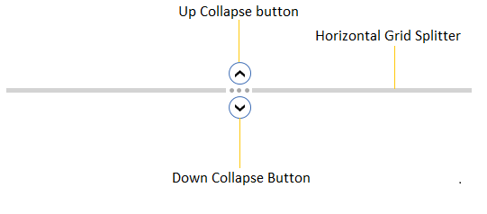
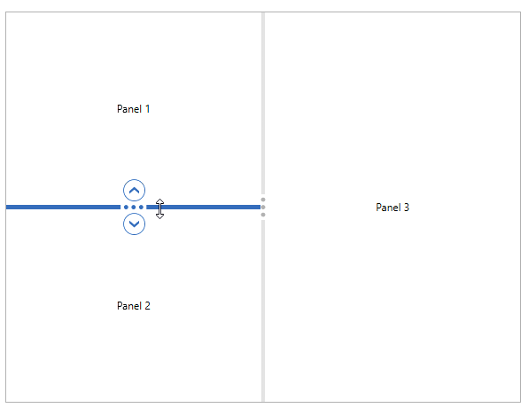
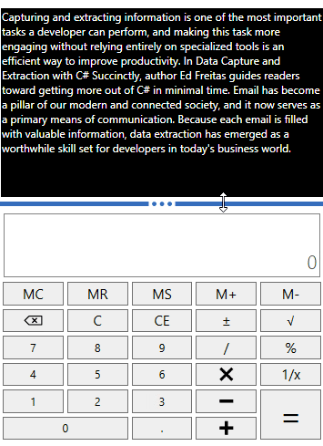
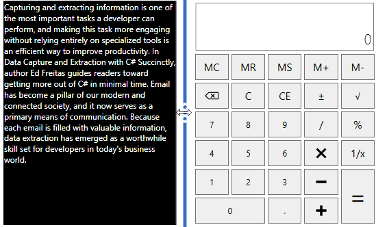
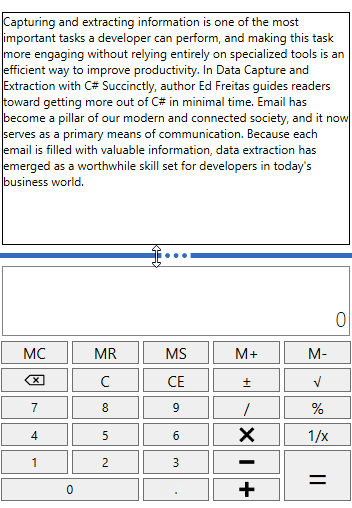
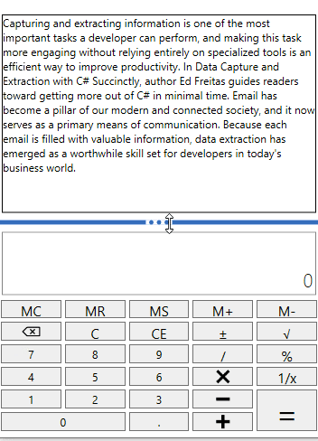
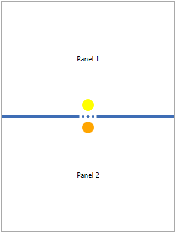
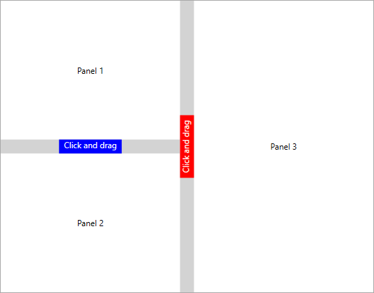
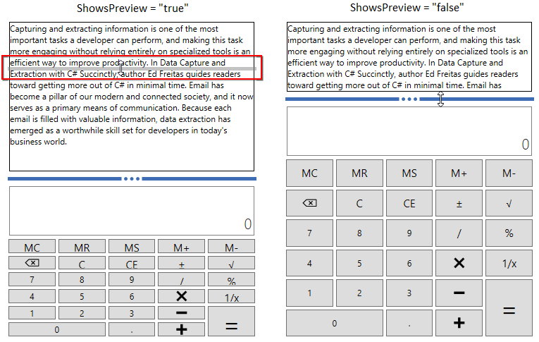
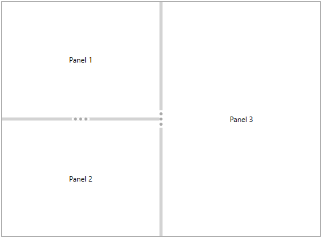

# Getting Started with WPF GridSplitter (SfGridSplitter)

This section explains how to create a [WPF GridSplitter](https://www.syncfusion.com/wpf-controls/gridsplitter) and describes its structure. The WPF GridSplitter is implemented through the [SfGridSplitter](https://help.syncfusion.com/cr/wpf/Syncfusion.Windows.Controls.Input.SfGridSplitter.html) class.

## Structure of WPF GridSplitter

## Visual representation 

## Assembly deployment

Refer to the [control dependencies](https://help.syncfusion.com/wpf/control-dependencies#sfgridsplitter) section for the list of assemblies or NuGet package that needs to be added as a reference to use the control in an application.

You can find more details about installing the NuGet package in a WPF application in the following link:

[How to install nuget packages](https://help.syncfusion.com/wpf/installation/install-nuget-packages)

## Adding control manually in XAML

To add the control manually in XAML, follow the given steps:

1. Add the following required assembly references to the project:
    * Syncfusion.SfInput.WPF
    * Syncfusion.SfShared.WPF
2. Import Syncfusion® WPF schema **http://schemas.syncfusion.com/wpf** in the XAML page.
3. Declare the `SfGridSplitter` control in the XAML page.





<Window xmlns="http://schemas.microsoft.com/winfx/2006/xaml/presentation"
        xmlns:x="http://schemas.microsoft.com/winfx/2006/xaml"
        xmlns:syncfusion="http://schemas.syncfusion.com/wpf" 
        x:Class="SfGridSplitterSample.MainWindow"
        Title="SfGridSplitter Sample" Height="350" Width="525">
    <Grid>
        <!-- Adding SfGridSplitter control -->
        <syncfusion:SfGridSplitter x:Name="sfGridSplitter"
                                   HorizontalAlignment="Stretch"/>
    </Grid>
</Window>




{{ codesnippet1 | OrderList_Indent_Level_1 }}

## Add control manually in C\#

To add the control manually in C#, follow the given steps:

1. Add the following required assembly references to the project:
    * Syncfusion.SfInput.WPF
    * Syncfusion.SfShared.WPF
2. Import the namespace **using Syncfusion.Windows.Controls.Input;**.
3. Create an `SfGridSplitter` instance and add it to the window.





using Syncfusion.Windows.Controls.Input;
namespace SfGridSplitterSample {    
    public partial class MainWindow : Window {
        public MainWindow() {
            InitializeComponent();

            //Creating an instance of SfGridSplitter control
            SfGridSplitter sfGridSplitter = new SfGridSplitter();
            sfGridSplitter.HorizontalAlignment = HorizontalAlignment.Stretch;

            //Adding SfGridSplitter as window content
            this.Content = sfGridSplitter;
        } 
    }
}




{{ codesnippet2 | OrderList_Indent_Level_1 }}

N> [View Sample in GitHub](https://github.com/SyncfusionExamples/syncfusion-gridsplitter-control-examples/tree/master/Samples/GridSplitter)

## Resize the grid rows

To resize specific grid rows, place the `SfGridSplitter` on the next or previous row and set the `HorizontalAlignment` property to `Stretch` and the `ResizeBehavior` property to `PreviousAndNext`.




<Border
    Margin="10"
    BorderBrush="DarkGray"
    BorderThickness="1">
    <Grid>
        <Grid.RowDefinitions>
            <RowDefinition />
            <RowDefinition Height="auto" />
            <RowDefinition />
        </Grid.RowDefinitions>
        <TextBlock Grid.Row="0" 
                   HorizontalAlignment="Center"
                   VerticalAlignment="Center"
                   TextAlignment="Center"
                   Text="Panel 1">
        </TextBlock>
        <TextBlock Grid.Row="2"
                   HorizontalAlignment="Center" 
                   VerticalAlignment="Center" 
                   TextAlignment="Center"
                   Text="Panel 2">
        </TextBlock>

        <!--Grid Splitter-->
        <syncfusion:SfGridSplitter Name="gridSplitter"
                                   HorizontalAlignment="Stretch" 
                                   ResizeBehavior="PreviousAndNext"
                                   Width="auto"
                                   Grid.Row="1">
        </syncfusion:SfGridSplitter>
    </Grid>
</Border>




N> [View Sample in GitHub](https://github.com/SyncfusionExamples/syncfusion-gridsplitter-control-examples/tree/master/Samples/GridSplitter)

## Resize the grid columns

To resize specific grid columns, place the `SfGridSplitter` on the next or previous column and set the `VerticalAlignment` property to `Stretch` and the `ResizeBehavior` property to `PreviousAndNext`.




<Border
    Margin="10"
    BorderBrush="DarkGray"
    BorderThickness="1">
    <Grid>
        <Grid.ColumnDefinitions>
            <ColumnDefinition />
            <ColumnDefinition Width="auto" />
            <ColumnDefinition />
        </Grid.ColumnDefinitions>
        <TextBlock Grid.Column="0" 
                   HorizontalAlignment="Center"
                   VerticalAlignment="Center"
                   TextAlignment="Center"
                   Text="Panel 1">
        </TextBlock>
        <TextBlock Grid.Column="2"
                   HorizontalAlignment="Center" 
                   VerticalAlignment="Center" 
                   TextAlignment="Center"
                   Text="Panel 2">
        </TextBlock>

        <!--Grid Splitter-->
        <syncfusion:SfGridSplitter Name="gridSplitter"
                                   HorizontalAlignment="Stretch" 
                                   ResizeBehavior="PreviousAndNext"
                                   Width="auto"
                                   Grid.Column="1">
        </syncfusion:SfGridSplitter>
    </Grid>
</Border>




N> [View Sample in GitHub](https://github.com/SyncfusionExamples/syncfusion-gridsplitter-control-examples/tree/master/Samples/GridSplitter) 

N> You can restrict the movement of the WPF GridSplitter (left, right, bottom, or top) by setting the `ResizeBehavior` property. The `ResizeBehavior` value must be assigned based on the row or column where the grid splitter is placed.

## Resizing the grid rows and columns with specific pixel

To resize grid rows or columns at a specific pixel interval, set the pixel values for the `DragIncrement` and `KeyboardIncrement` properties. When you move the splitter with the mouse, the `DragIncrement` property value is used as the resize interval. When you move the splitter using the up and down buttons, the `KeyboardIncrement` property value is used as the resize interval. The default value of the `DragIncrement` property is `1`, and the default value of the `KeyboardIncrement` property is `20`.




<Border
    Margin="10"
    BorderBrush="DarkGray"
    BorderThickness="1">
    <Grid>
        <Grid.RowDefinitions>
            <RowDefinition />
            <RowDefinition Height="auto" />
            <RowDefinition />
        </Grid.RowDefinitions>
        <TextBlock Grid.Row="0" 
                   HorizontalAlignment="Center"
                   VerticalAlignment="Center"
                   TextAlignment="Center"
                   Text="Panel 1">
        </TextBlock>
        <TextBlock Grid.Row="2"
                   HorizontalAlignment="Center" 
                   VerticalAlignment="Center" 
                   TextAlignment="Center"
                   Text="Panel 2">
        </TextBlock>

        <!--Grid Splitter-->
        <syncfusion:SfGridSplitter DragIncrement="50"
                                   KeyboardIncrement="50"
                                   HorizontalAlignment="Stretch"
                                   Width="auto"
                                   Grid.Row="1">
        </syncfusion:SfGridSplitter>
    </Grid>
</Border>




N> [View Sample in GitHub](https://github.com/SyncfusionExamples/syncfusion-gridsplitter-control-examples/tree/master/Samples/GridSplitter) 

### Resize the grid rows or columns programmatically

You can move the splitter and resize the affected columns or rows programmatically by passing the pixel value to the [MoveSplitter(Double)](https://help.syncfusion.com/cr/wpf/Syncfusion.Windows.Controls.Input.SfGridSplitter.html#Syncfusion_Windows_Controls_Input_SfGridSplitter_MoveSplitter_System_Double_) method.




<Border
    Margin="10"
    BorderBrush="DarkGray"
    BorderThickness="1">
    <Grid>
        <Grid.RowDefinitions>
            <RowDefinition />
            <RowDefinition Height="auto" />
            <RowDefinition />
        </Grid.RowDefinitions>
        <TextBlock Grid.Row="0" 
                   HorizontalAlignment="Center"
                   VerticalAlignment="Center"
                   TextAlignment="Center"
                   Text="Panel 1">
        </TextBlock>
        <TextBlock Grid.Row="2"
                   HorizontalAlignment="Center" 
                   VerticalAlignment="Center" 
                   TextAlignment="Center"
                   Text="Panel 2">
        </TextBlock>

        <!--Grid Splitter-->
        <syncfusion:SfGridSplitter Name="gridSplitter"
                                   HorizontalAlignment="Stretch" 
                                   ResizeBehavior="PreviousAndNext"
                                   Width="auto"
                                   Grid.Row="1">
        </syncfusion:SfGridSplitter>
    </Grid>
</Border>







//GridSplitter moves 50 pixels.
gridSplitter.MoveSplitter(50);




## Show or hide the grid row and columns

You can expand or collapse the element on either side of the splitter by clicking the collapse buttons. You can show or hide the collapse button by setting the [EnableCollapseButton](https://help.syncfusion.com/cr/wpf/Syncfusion.Windows.Controls.Input.SfGridSplitter.html#Syncfusion_Windows_Controls_Input_SfGridSplitter_EnableCollapseButton) property to `true`. The default value of the `EnableCollapseButton` property is `false`.




<Border
    Margin="10"
    BorderBrush="DarkGray"
    BorderThickness="1">
    <Grid>
        <Grid.RowDefinitions>
            <RowDefinition />
            <RowDefinition Height="auto" />
            <RowDefinition />
        </Grid.RowDefinitions>
        <TextBlock Grid.Row="0" 
                   HorizontalAlignment="Center"
                   VerticalAlignment="Center"
                   TextAlignment="Center"
                   Text="Panel 1">
        </TextBlock>
        <TextBlock Grid.Row="2"
                   HorizontalAlignment="Center" 
                   VerticalAlignment="Center" 
                   TextAlignment="Center"
                   Text="Panel 2">
        </TextBlock>

        <!--Grid Splitter-->
        <syncfusion:SfGridSplitter EnableCollapseButton="True"
                                   HorizontalAlignment="Stretch"
                                   Width="auto"
                                   Grid.Row="1" >
        </syncfusion:SfGridSplitter>
    </Grid>
</Border>




N> [View Sample in GitHub](https://github.com/SyncfusionExamples/syncfusion-gridsplitter-control-examples/tree/master/Samples/GridSplitter) 

## Custom UI for Collapse buttons 

If you want to change the UI of the horizontal splitter's up and down collapse buttons separately, use the [UpButtonTemplate](https://help.syncfusion.com/cr/wpf/Syncfusion.Windows.Controls.Input.SfGridSplitter.html#Syncfusion_Windows_Controls_Input_SfGridSplitter_UpButtonTemplate) and [DownButtonTemplate](https://help.syncfusion.com/cr/wpf/Syncfusion.Windows.Controls.Input.SfGridSplitter.html#Syncfusion_Windows_Controls_Input_SfGridSplitter_DownButtonTemplate) properties. If you want to change the UI of the vertical splitter's left and right collapse buttons, use the [LeftButtonTemplate](https://help.syncfusion.com/cr/wpf/Syncfusion.Windows.Controls.Input.SfGridSplitter.html#Syncfusion_Windows_Controls_Input_SfGridSplitter_LeftButtonTemplate) and [RightButtonTemplate](https://help.syncfusion.com/cr/wpf/Syncfusion.Windows.Controls.Input.SfGridSplitter.html#Syncfusion_Windows_Controls_Input_SfGridSplitter_RightButtonTemplate) properties.

N> You can see the effect of collapse button templates only when the `EnableCollapseButton` property is set to `true`.




<Border
    Margin="10"
    BorderBrush="DarkGray"
    BorderThickness="1">
    <Grid>
        <Grid.RowDefinitions>
            <RowDefinition />
            <RowDefinition Height="auto" />
            <RowDefinition />
        </Grid.RowDefinitions>
        <Grid.ColumnDefinitions>
            <ColumnDefinition />
            <ColumnDefinition Width="auto" />
            <ColumnDefinition />
        </Grid.ColumnDefinitions>
        <TextBlock  HorizontalAlignment="Center" 
                    VerticalAlignment="Center"
                    Grid.Row="0"
                    Grid.Column="0" 
                    TextAlignment="Center"
                    Text="Panel 1"/>

        <TextBlock HorizontalAlignment="Center" 
                   VerticalAlignment="Center" 
                   Grid.Row="2"
                   Grid.Column="0"
                   Text="Panel 2"/>

        <TextBlock HorizontalAlignment="Center" 
                   VerticalAlignment="Center" 
                   Grid.RowSpan="3"
                   Grid.Column="2"
                   Text="Panel 3"/>

        <!--Horizontal Splitter-->
        <syncfusion:SfGridSplitter Grid.Row="1"
                                   Grid.Column="0"
                                   Height="5"
                                   HorizontalAlignment="Stretch"
                                   EnableCollapseButton="True"
                                   ResizeBehavior="PreviousAndNext">

            <!--Up button template-->
            <syncfusion:SfGridSplitter.UpButtonTemplate>
                <DataTemplate>
                    <Ellipse Width="20" Height="20" Fill="Blue"/>
                </DataTemplate>
            </syncfusion:SfGridSplitter.UpButtonTemplate>

            <!--Down button template-->
            <syncfusion:SfGridSplitter.DownButtonTemplate>
                <DataTemplate>
                    <Ellipse Width="20" Height="20" Fill="Orange"/>
                </DataTemplate>
            </syncfusion:SfGridSplitter.DownButtonTemplate>              
        </syncfusion:SfGridSplitter>

        <!--Vertical Splitter-->
        <syncfusion:SfGridSplitter Grid.RowSpan="3"
                                   Grid.Column="1"
                                   Width="5"
                                   VerticalAlignment="Stretch"
                                   EnableCollapseButton="True"
                                   ResizeBehavior="PreviousAndNext"    
                                   ShowsPreview="True">
            <!--Left button template-->
            <syncfusion:SfGridSplitter.LeftButtonTemplate>
                <DataTemplate>
                    <Ellipse Width="20" Height="20" Fill="Red"/>
                </DataTemplate>
            </syncfusion:SfGridSplitter.LeftButtonTemplate>

            <!--Right button template-->
            <syncfusion:SfGridSplitter.RightButtonTemplate>
                <DataTemplate>
                    <Ellipse Width="20" Height="20" Fill="Green"/>
                </DataTemplate>
            </syncfusion:SfGridSplitter.RightButtonTemplate>
        </syncfusion:SfGridSplitter>
    </Grid>
</Border>




N> [View Sample in GitHub](https://github.com/SyncfusionExamples/syncfusion-gridsplitter-control-examples/tree/master/Samples/Appearance) 

## Custom UI for expander gripper

If you want to change the UI of the vertical and horizontal splitter grippers separately, use the [VerticalGripperTemplate](https://help.syncfusion.com/cr/wpf/Syncfusion.Windows.Controls.Input.SfGridSplitter.html#Syncfusion_Windows_Controls_Input_SfGridSplitter_VerticalGripperTemplate) and [HorizontalGripperTemplate](https://help.syncfusion.com/cr/wpf/Syncfusion.Windows.Controls.Input.SfGridSplitter.html#Syncfusion_Windows_Controls_Input_SfGridSplitter_HorizontalGripperTemplate) properties.




<Border
    Margin="10"
    BorderBrush="DarkGray"
    BorderThickness="1">
    <Grid>
        <Grid.RowDefinitions>
            <RowDefinition />
            <RowDefinition Height="auto" />
            <RowDefinition />
        </Grid.RowDefinitions>
        <Grid.ColumnDefinitions>
            <ColumnDefinition />
            <ColumnDefinition Width="auto" />
            <ColumnDefinition />
        </Grid.ColumnDefinitions>
        <TextBlock  HorizontalAlignment="Center" 
                    VerticalAlignment="Center"
                    Grid.Row="0"
                    Grid.Column="0" 
                    Text="Panel 1"/>

        <TextBlock HorizontalAlignment="Center" 
                   VerticalAlignment="Center" 
                   Grid.Row="2"
                   Grid.Column="0" 
                   Text="Panel 2"/>

        <TextBlock HorizontalAlignment="Center" 
                   VerticalAlignment="Center" 
                   Grid.RowSpan="3"
                   Grid.Column="2" 
                   Text="Panel 3"/>

        <!--Horizontal Splitter-->
        <syncfusion:SfGridSplitter Grid.Row="1"
                                   Grid.Column="0"
                                   Height="20"
                                   HorizontalAlignment="Stretch"
                                   EnableCollapseButton="True"
                                   ResizeBehavior="PreviousAndNext"
                                   ShowsPreview="True">

            <!--Horizontal Gripper Template-->
            <syncfusion:SfGridSplitter.HorizontalGripperTemplate>
                <DataTemplate>
                    <TextBlock Background="Blue" 
                               Foreground="White"
                               TextAlignment="Center"
                               VerticalAlignment="Center" 
                               HorizontalAlignment="Center"
                               Text="Click and drag" 
                               Width="90"
                               Height="20"/>
                </DataTemplate>
            </syncfusion:SfGridSplitter.HorizontalGripperTemplate>   
        </syncfusion:SfGridSplitter>

        <!--Vertical Splitter-->
        <syncfusion:SfGridSplitter Grid.RowSpan="3"
                                   Grid.Column="1"
                                   Width="20"
                                   VerticalAlignment="Stretch"
                                   EnableCollapseButton="True"
                                   ResizeBehavior="PreviousAndNext"  
                                   ShowsPreview="True">

            <!--Vertical GripperTemplate-->
            <syncfusion:SfGridSplitter.VerticalGripperTemplate>
                <DataTemplate>
                    <TextBlock Background="Red" 
                               Foreground="White"
                               TextAlignment="Center"
                               VerticalAlignment="Center"
                               HorizontalAlignment="Center" 
                               Text="Click and drag" 
                               Width="90" 
                               Height="20">
                        <TextBlock.LayoutTransform>
                            <RotateTransform Angle="-90"/>
                        </TextBlock.LayoutTransform>
                    </TextBlock>
                </DataTemplate>
            </syncfusion:SfGridSplitter.VerticalGripperTemplate>
        </syncfusion:SfGridSplitter>
    </Grid>
</Border>




N> [View Sample in GitHub](https://github.com/SyncfusionExamples/syncfusion-gridsplitter-control-examples/tree/master/Samples/Custom-Gripper)

## Deferred resizing

You can directly redistribute rows or columns by using `SfGridSplitter`. To preview the redistribution location before it changes, set the [ShowsPreview](https://help.syncfusion.com/cr/wpf/Syncfusion.Windows.Controls.Input.SfGridSplitter.html) property to `true`.




<Border
    Margin="10"
    BorderBrush="DarkGray"
    BorderThickness="1">
    <Grid>
        <Grid.RowDefinitions>
            <RowDefinition />
            <RowDefinition Height="auto" />
            <RowDefinition />
        </Grid.RowDefinitions>
        <TextBlock Grid.Row="0" 
                   HorizontalAlignment="Center"
                   VerticalAlignment="Center"
                   TextAlignment="Center"
                   Text="Panel 1">
        </TextBlock>
        <TextBlock Grid.Row="2"
                   HorizontalAlignment="Center" 
                   VerticalAlignment="Center" 
                   TextAlignment="Center"
                   Text="Panel 2">
        </TextBlock>

        <!--Grid Splitter-->
        <syncfusion:SfGridSplitter ShowsPreview="True"
                                   HorizontalAlignment="Stretch"
                                   Width="auto"
                                   Grid.Row="1" >
        </syncfusion:SfGridSplitter>
    </Grid>
</Border>




N> [View Sample in GitHub](https://github.com/SyncfusionExamples/syncfusion-gridsplitter-control-examples/tree/master/Samples/GridSplitter) 

## WPF GridSplitter for the merged columns or rows

To resize merged columns or rows, place the WPF GridSplitter on the next or previous row or column of the grid.




<Border
    Margin="10"
    BorderBrush="DarkGray"
    BorderThickness="1">
    <Grid>
        <Grid.RowDefinitions>
            <RowDefinition />
            <RowDefinition Height="auto" />
            <RowDefinition />
        </Grid.RowDefinitions>
        <Grid.ColumnDefinitions>
            <ColumnDefinition />
            <ColumnDefinition Width="auto" />
            <ColumnDefinition />
        </Grid.ColumnDefinitions>
        <TextBlock  HorizontalAlignment="Center" VerticalAlignment="Center"
            Grid.Row="0"
            Grid.Column="0" TextAlignment="Center"
             Text="Panel 1">
        </TextBlock>
        <TextBlock HorizontalAlignment="Center" VerticalAlignment="Center" 
            Grid.Row="2"
            Grid.Column="0" Text="Panel 2">
        </TextBlock>

        <TextBlock HorizontalAlignment="Center" VerticalAlignment="Center" 
            Grid.RowSpan="3"
            Grid.Column="2" Text="Panel 3">
        </TextBlock>

        <!--Horizontal Splitter-->
        <syncfusion:SfGridSplitter Grid.Row="1"
                                   Grid.Column="0"
                                   Height="5"
                                   HorizontalAlignment="Stretch"
                                   ResizeBehavior="PreviousAndNext">
        </syncfusion:SfGridSplitter>

        <!--Vertical Splitter-->
        <syncfusion:SfGridSplitter Grid.RowSpan="3"
                                   Grid.Column="1"
                                   Width="5"
                                   VerticalAlignment="Stretch"
                                   ResizeBehavior="PreviousAndNext">
        </syncfusion:SfGridSplitter>
    </Grid>
</Border>




N> [View Sample in GitHub](https://github.com/SyncfusionExamples/syncfusion-gridsplitter-control-examples/tree/master/Samples/GridSplitter) 

## Theme

The WPF GridSplitter supports various built-in themes. Refer to the following links to apply themes to the control:

  * [Apply theme using SfSkinManager](https://help.syncfusion.com/wpf/themes/skin-manager)
	
  * [Create a custom theme using ThemeStudio](https://help.syncfusion.com/wpf/themes/theme-studio#creating-custom-theme)

  