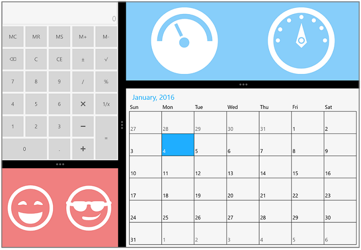

# About Syncfusion® WPF GridSplitter (SfGridSplitter) Control

[WPF GridSplitter](https://help.syncfusion.com/cr/wpf/Syncfusion.Windows.Controls.Input.SfGridSplitter.html) is a container control that helps to split the available space horizontally or vertically with a movable splitter and arrange the visual elements inside it. 

## Features of WPF GridSplitter

* Dynamic resizing: Splits available space with movable splitter that helps resize controls on demand.
* Expand / Collapse: Supports to expand and collapse splitter controls interactively in UI.
* Orientation: Supports both horizontal and vertical orientation to split controls based on user layout.

