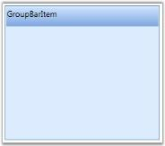

# Adding GroupBar Item to GroupBar

GroupBar Item is added to the GroupBar using XAML or C# code. The following code illustrates this. 

<table>
<tr>
<td>
[XAML]&lt;!-- Adding GroupBar --&gt;&lt;syncfusion:GroupBar Height="200" Width="230" Name="groupBar"&gt;  &lt;!-- Adding GroupBarItem --&gt;  &lt;syncfusion:GroupBarItem Name="groupBarItem" Header="GroupBarItem"/&gt;&lt;/syncfusion:GroupBar&gt;</td></tr>
<tr>
<td>
[C#]//Creating an instance of GroupBarGroupBar groupBar = new GroupBar();//Creating an instance of GroupBarItemGroupBarItem groupBarItem = new GroupBarItem();//Setting header for GroupBar itemgroupBarItem.Header = "GroupBarItem";//Adding GroupBar item to GroupBargroupBar.Items.Add(groupBarItem);//Adding GroupBar to the windowthis.Content = groupBar;</td></tr>
</table>

{  | markdownify }
{:.image }

> _Note: To display the GroupBar Item, you must have a GroupBar in which you are going to add the GroupBar Item._

