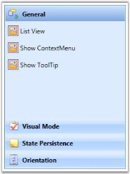
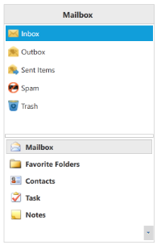
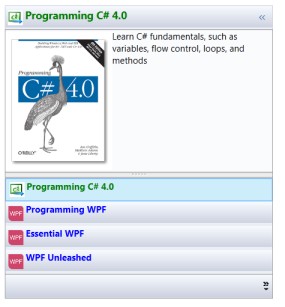
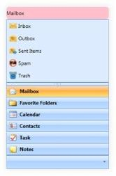

# Appearance

This section deals with the appearance of GroupBar control and contains the following topics:

## Visual Mode

Visual Mode feature in GroupBar is used to change the visual style of the GroupBar. This is done using the VisualMode property. This dependency property can be used to set the visual mode for GroupBar content. It returns the visual mode of the GroupBar.

There are three types of visual modes available in GroupBar.

* Default
* MultipleExpansion
* StackMode

Default

By setting this enum to the VisualMode property, expand and collapse of the GroupBarItem in GroupBar is enabled. Only one GroupBar item can be expanded at a time. On expanding another GroupBar item, the previously expanded groupbar item will be collapsed.

MultipleExpansion

By setting this enum to the VisualMode property, the style of GroupBar will be similar to the tree view structure in terms of expand and collapse. Any number of GroupBar items can be expanded or collapsed. 

StackMode

By setting this enum to the VisualMode property, the GroupBar behavior is set to behave like the Outlook GroupBar.

Use the following code snippet to set the VisualMode property to _Default_.

<table>
<tr>
<td>
[XAML]&lt;!-- Adding GroupBar that have visual mode is Default --&gt;&lt;syncfusion:GroupBar Height="300" Width="230" VisualMode="Default" Name="groupBar"&gt;  &lt;!-- Adding GroupBarItem --&gt;  &lt;syncfusion:GroupBarItem Name="groupBarItem1" HeaderImageSource="Label.gif" Header="General"&gt;    &lt;!-- Adding content for GroupBar item using GroupView --&gt;    &lt;syncfusion:GroupView&gt;      &lt;syncfusion:GroupViewItem Text="List View"/&gt;      &lt;syncfusion:GroupViewItem Text="Show ContextMenu"/&gt;      &lt;syncfusion:GroupViewItem Text="Show ToolTip"/&gt;    &lt;/syncfusion:GroupView&gt;  &lt;/syncfusion:GroupBarItem&gt;  &lt;!-- Adding GroupBarItem --&gt;  &lt;syncfusion:GroupBarItem HeaderImageSource="Tasks.png" Name="groupBarItem2" Header="Visual Mode"&gt;    &lt;!-- Adding content for GroupBar item using GroupView --&gt;    &lt;syncfusion:GroupView&gt;      &lt;syncfusion:GroupViewItem Text="Default"/&gt;      &lt;syncfusion:GroupViewItem Text="Multiple Expansion"/&gt;      &lt;syncfusion:GroupViewItem Text="StackMode"/&gt;    &lt;/syncfusion:GroupView&gt;  &lt;/syncfusion:GroupBarItem&gt;  &lt;!-- Adding GroupBarItem --&gt;  &lt;syncfusion:GroupBarItem HeaderImageSource="Notes.png" Name="groupBarItem3" Header="State Persistence"&gt;    &lt;!-- Adding content for GroupBar item using GroupView --&gt;    &lt;syncfusion:GroupView&gt;      &lt;syncfusion:GroupViewItem Text="Save State"/&gt;      &lt;syncfusion:GroupViewItem Text="Load State"/&gt;      &lt;syncfusion:GroupViewItem Text="Reset State"/&gt;    &lt;/syncfusion:GroupView&gt;  &lt;/syncfusion:GroupBarItem&gt;  &lt;!-- Adding GroupBarItem --&gt;  &lt;syncfusion:GroupBarItem Name="groupBarItem4" HeaderImageSource="bin.png" Header="Orientation"&gt;    &lt;!-- Adding content for GroupBar item using panel --&gt;    &lt;StackPanel Orientation="Vertical"&gt;      &lt;TextBlock Text="GroupBar Orientation" Margin="4,4,2,2"/&gt;      <RadioButton IsChecked="True" Margin="4,2,2,2">Horizontal</RadioButton>      <RadioButton Margin="4,2,2,2">Vertical</RadioButton>      &lt;TextBlock Text="GroupView Orientation" Margin="4,4,2,2"/&gt;      <RadioButton Margin="4,2,2,2">Horizontal</RadioButton>      <RadioButton IsChecked="True" Margin="4,2,2,2">Vertical</RadioButton>    &lt;/StackPanel&gt;  &lt;/syncfusion:GroupBarItem&gt;&lt;/syncfusion:GroupBar&gt;</td></tr>
<tr>
<td>
[C#]//Setting visual mode as DefaultgroupBar.VisualMode = VisualMode.Default;</td></tr>
</table>

{  | markdownify }
{:.image }

Multiple Expansion

In Multiple Expansion mode, more than one item can be expanded as seen in a tree view structure.

Use the following code snippet to set VisualMode property to Multiple Expansion.

<table>
<tr>
<td colspan = "2">
[XAML]&lt;!-- Adding GroupBar that have visual mode is Multiple Expansion --&gt;&lt;syncfusion:GroupBar Height="300" Width="230" VisualMode="MultipleExpansion" Name="groupBar"&gt;  &lt;!-- Adding GroupBarItem --&gt;  &lt;syncfusion:GroupBarItem Name="groupBarItem1" HeaderImageSource="Label.gif" Header="General"&gt;    &lt;!-- Adding content for groupbar item using GroupView --&gt;    &lt;syncfusion:GroupView&gt;      &lt;syncfusion:GroupViewItem Text="List View"/&gt;      &lt;syncfusion:GroupViewItem Text="Show ContextMenu"/&gt;      &lt;syncfusion:GroupViewItem Text="Show ToolTip"/&gt;    &lt;/syncfusion:GroupView&gt;  &lt;/syncfusion:GroupBarItem&gt;  &lt;!-- Adding GroupBarItem --&gt;  &lt;syncfusion:GroupBarItem HeaderImageSource="Tasks.png" Name="groupBarItem2" Header="Visual Mode"&gt;    &lt;!-- Adding content for groupbar item using GroupView --&gt;    &lt;syncfusion:GroupView&gt;      &lt;syncfusion:GroupViewItem Text="Default"/&gt;      &lt;syncfusion:GroupViewItem Text="Multiple Expansion"/&gt;      &lt;syncfusion:GroupViewItem Text="StackMode"/&gt;    &lt;/syncfusion:GroupView&gt;  &lt;/syncfusion:GroupBarItem&gt;  &lt;!-- Adding GroupBarItem --&gt;  &lt;syncfusion:GroupBarItem HeaderImageSource="Notes.png" Name="groupBarItem3" Header="State Persistence"&gt;    &lt;!-- Adding content for groupbar item using GroupView --&gt;    &lt;syncfusion:GroupView&gt;      &lt;syncfusion:GroupViewItem Text="Save State"/&gt;      &lt;syncfusion:GroupViewItem Text="Load State"/&gt;      &lt;syncfusion:GroupViewItem Text="Reset State"/&gt;    &lt;/syncfusion:GroupView&gt;  &lt;/syncfusion:GroupBarItem&gt;  &lt;!-- Adding GroupBarItem --&gt;  &lt;syncfusion:GroupBarItem Name="groupBarItem4" HeaderImageSource="bin.png" Header="Orientation"&gt;    &lt;!-- Adding content for groupbar item using panel --&gt;    &lt;StackPanel Orientation="Vertical"&gt;      &lt;TextBlock Text="GroupBar Orientation" Margin="4,4,2,2"/&gt;      <RadioButton IsChecked="True" Margin="4,2,2,2">Horizontal</RadioButton>      <RadioButton Margin="4,2,2,2">Vertical</RadioButton>      &lt;TextBlock Text="GroupView Orientation" Margin="4,4,2,2"/&gt;      <RadioButton Margin="4,2,2,2">Horizontal</RadioButton>      <RadioButton IsChecked="True" Margin="4,2,2,2">Vertical</RadioButton>    &lt;/StackPanel&gt;  &lt;/syncfusion:GroupBarItem&gt;&lt;/syncfusion:GroupBar&gt;</td></tr>
<tr>
<td>
[C#]//groupBar is a name of groupbar//groupbar that have visual mode is MultipleExpansiongroupBar.VisualMode = VisualMode.MultipleExpansion;</td></tr>
</table>

{  | markdownify }
{:.image }

Stack Mode

In StackMode, only one item can be expanded, Items are organized in stack-like mode. It looks like an Outlook groupbar. In stack mode, the pop-up menu is displayed at the bottom of the groupbar. This helps customize groupbar items in a GroupBar control.

Use the following code snippet to set the VisualMode property to StackMode.

<table>
<tr>
<td>
[XAML]&lt;!-- Adding GroupBar that have visual mode is StackMode--&gt;&lt;syncfusion:GroupBar Height="300" Width="230" VisualMode="StackMode" Name="groupBar"&gt;  &lt;!-- Adding GroupBarItem --&gt;  &lt;syncfusion:GroupBarItem Name="groupBarItem1" HeaderImageSource="Label.gif" Header="General"&gt;    &lt;!-- Adding content for groupbar item using GroupView --&gt;    &lt;syncfusion:GroupView&gt;      &lt;syncfusion:GroupViewItem Text="List View"/&gt;      &lt;syncfusion:GroupViewItem Text="Show ContextMenu"/&gt;      &lt;syncfusion:GroupViewItem Text="Show ToolTip"/&gt;    &lt;/syncfusion:GroupView&gt;  &lt;/syncfusion:GroupBarItem&gt;  &lt;!-- Adding GroupBarItem --&gt;  &lt;syncfusion:GroupBarItem HeaderImageSource="Tasks.png" Name="groupBarItem2" Header="Visual Mode"&gt;    &lt;!-- Adding content for groupbar item using GroupView --&gt;    &lt;syncfusion:GroupView&gt;      &lt;syncfusion:GroupViewItem Text="Default"/&gt;      &lt;syncfusion:GroupViewItem Text="Multiple Expansion"/&gt;      &lt;syncfusion:GroupViewItem Text="StackMode"/&gt;    &lt;/syncfusion:GroupView&gt;  &lt;/syncfusion:GroupBarItem&gt;  &lt;!-- Adding GroupBarItem --&gt;  &lt;syncfusion:GroupBarItem HeaderImageSource="Notes.png" Name="groupBarItem3" Header="State Persistence"&gt;    &lt;!-- Adding content for groupbar item using GroupView --&gt;    &lt;syncfusion:GroupView&gt;      &lt;syncfusion:GroupViewItem Text="Save State"/&gt;      &lt;syncfusion:GroupViewItem Text="Load State"/&gt;      &lt;syncfusion:GroupViewItem Text="Reset State"/&gt;    &lt;/syncfusion:GroupView&gt;  &lt;/syncfusion:GroupBarItem&gt;  &lt;!-- Adding GroupBarItem --&gt;  &lt;syncfusion:GroupBarItem Name="groupBarItem4" HeaderImageSource="bin.png" Header="Orientation"&gt;    &lt;!-- Adding content for groupbar item using panel --&gt;    &lt;StackPanel Orientation="Vertical"&gt;      &lt;TextBlock Text="GroupBar Orientation" Margin="4,4,2,2"/&gt;      <RadioButton IsChecked="True" Margin="4,2,2,2">Horizontal</RadioButton>      <RadioButton Margin="4,2,2,2">Vertical</RadioButton>      &lt;TextBlock Text="GroupView Orientation" Margin="4,4,2,2"/&gt;      <RadioButton Margin="4,2,2,2">Horizontal</RadioButton>      <RadioButton IsChecked="True" Margin="4,2,2,2">Vertical</RadioButton>    &lt;/StackPanel&gt;  &lt;/syncfusion:GroupBarItem&gt;&lt;/syncfusion:GroupBar&gt;</td></tr>
<tr>
<td>
[C#]//groupBar is a name of groupbar//groupbar that have visual mode is StackModegroupBar.VisualMode = VisualMode.StackMode; </td></tr>
</table>

{  | markdownify }
{:.image }

## Visual Style

The appearance of the GroupBar control can be controlled using the VisualStyle property. VisualStyle is an attached property, which gets or sets the value for visual style. Styling can be applied to both the GroupBar control and its items. Nine built-in styles have been provided. These styles can be implemented at run time based on specified conditions.

 _Visual Style Property table_

<table>
<tr>
<td>
Property</td><td>
Description</td></tr>
<tr>
<td>
VisualStyle</td><td>
Sets the visual style for the GroupBar control. The options provided are as follows.* Office2007Blue* Office2007Black* Office2007Silver* Office2010Blue* Office2010Black* Office2010Silver* Blend* Metro* Transparent </td></tr>
</table>

These styles can be applied in XAML as follows. The example below styles the GroupBar control with the Office 2010 Blue theme.

 [XAML]

&lt;syncfusion:GroupBar         syncfusion:SkinStorage.VisualStyle="Office2010Blue"        /&gt;    

Visual styles can be set in C# as follows.

[C#]

SkinStorage.SetVisualStyle(groupBarInstance, "Office2010Blue");

{  | markdownify }
{:.image }

{  | markdownify }
{:.image }

{  | markdownify }
{:.image }

{  | markdownify }
{:.image }

## Item Container Style

1. The ItemContainerStyle property of GroupBar sets the style for GroupBarItem. This style will be applied to all items in the GroupBar control.style for GroupBarItem.

[XAML]

&lt;Style TargetType="{x:Type syncfusion:GroupBarItem}" x:Key="GroupBarItemStyle"&gt;

            &lt;Setter Property="HeaderTemplate" &gt;

                &lt;Setter.Value&gt;

                    &lt;DataTemplate &gt;

                        &lt;Grid&gt;

                            &lt;Grid.ColumnDefinitions&gt;

                                &lt;ColumnDefinition Width="25" /&gt;

                                &lt;ColumnDefinition Width="*" /&gt;

                            &lt;/Grid.ColumnDefinitions&gt;                            

                            &lt;TextBlock Text="{Binding XPath=@Name}" Margin="5" Foreground="Green" VerticalAlignment="Center" FontWeight="Bold" FontFamily="Bookman Old Style" Grid.Column="1"/&gt;

                        &lt;/Grid&gt;

                    &lt;/DataTemplate&gt;

                &lt;/Setter.Value&gt;

            &lt;/Setter&gt;

            &lt;Setter Property="ContentTemplate"&gt;

                &lt;Setter.Value&gt;

                    &lt;DataTemplate&gt;

                        &lt;Grid &gt;

                            &lt;Grid.ColumnDefinitions&gt;

                                &lt;ColumnDefinition Width="4*"/&gt;

                                &lt;ColumnDefinition Width="6*"/&gt;

                            &lt;/Grid.ColumnDefinitions&gt;

                            &lt;Image Source="{Binding XPath=@ImagePath}"/&gt;

                            &lt;TextBlock Text="{Binding XPath=@Description}" TextWrapping="Wrap" Grid.Column="1"/&gt;

                        &lt;/Grid&gt;

                    &lt;/DataTemplate&gt;

                &lt;/Setter.Value&gt;

            &lt;/Setter&gt;

        &lt;/Style&gt;

2. Set ItemContainerStyle of GroupBar as follows.

[XAML]

<syncfusion:GroupBar Name="groupBar1" AllowCollapse="True" 

                    VisualMode="StackMode" 

                    ItemsSource="{Binding Source={StaticResource xmlSource}, XPath=Book}"  

                    ItemContainerStyle="{StaticResource GroupBarItemStyle}"

                             />

3. This will generate the following GroupBar control.

{  | markdownify }
{:.image }

## Item Container Style Selector

The ItemContainerStyleSelector property is used to choose the ItemContainerStyle at run time based on specified conditions. 

1. Create the styles in the Window’s resource.

[XAML]

&lt;Style TargetType="{x:Type syncfusion:GroupBarItem}" x:Key="WpfItemStyle"&gt;

            &lt;Setter Property="HeaderTemplate" &gt;

                &lt;Setter.Value&gt;

                    &lt;DataTemplate&gt;

                        &lt;StackPanel Orientation="Horizontal"&gt;

                        &lt;Image Margin="3" Source="D:\IUE_DOC\GroupBarWPF\GroupBarIUEDemo\GroupBarIUEDemo\Data\wpf.png" Width="20" Height="20"/&gt;

                        &lt;TextBlock Text="{Binding XPath=@Name}" FontWeight="Bold" Foreground="Blue"/&gt;

                        &lt;/StackPanel&gt;

                    &lt;/DataTemplate&gt;

                &lt;/Setter.Value&gt;

            &lt;/Setter&gt;            

            &lt;Setter Property="ContentTemplate"&gt;

                &lt;Setter.Value&gt;                    

                    &lt;DataTemplate&gt;

                        &lt;Grid &gt;

                            &lt;Grid.ColumnDefinitions&gt;

                                &lt;ColumnDefinition Width="4*"/&gt;

                                &lt;ColumnDefinition Width="6*"/&gt;

                            &lt;/Grid.ColumnDefinitions&gt;

                            &lt;Image Source="{Binding XPath=@ImagePath}"/&gt;

                            &lt;TextBlock Text="{Binding XPath=@Description}" TextWrapping="Wrap" Grid.Column="1"/&gt;

                        &lt;/Grid&gt;

                    &lt;/DataTemplate&gt;

                &lt;/Setter.Value&gt;

            &lt;/Setter&gt;

        &lt;/Style&gt;

        &lt;Style TargetType="{x:Type syncfusion:GroupBarItem}" x:Key="CsItemStyle"&gt;

            &lt;Setter Property="HeaderTemplate" &gt;

                &lt;Setter.Value&gt;

                    &lt;DataTemplate&gt;

                        &lt;StackPanel Orientation="Horizontal"&gt;

                            &lt;Image Margin="3" Source="D:\IUE_DOC\GroupBarWPF\GroupBarIUEDemo\GroupBarIUEDemo\Data\images.jpg" Width="20" Height="20"/&gt;

                            &lt;TextBlock Text="{Binding XPath=@Name}" FontWeight="Bold" Foreground="Green"/&gt;

                        &lt;/StackPanel&gt;

                    &lt;/DataTemplate&gt;

                &lt;/Setter.Value&gt;

            &lt;/Setter&gt;

            &lt;Setter Property="ContentTemplate"&gt;

                &lt;Setter.Value&gt;

                    &lt;DataTemplate&gt;

                        &lt;Grid &gt;

                            &lt;Grid.ColumnDefinitions&gt;

                                &lt;ColumnDefinition Width="4*"/&gt;

                                &lt;ColumnDefinition Width="6*"/&gt;

                            &lt;/Grid.ColumnDefinitions&gt;

                            &lt;Image Source="{Binding XPath=@ImagePath}"/&gt;

                            &lt;TextBlock Text="{Binding XPath=@Description}" TextWrapping="Wrap" Grid.Column="1"/&gt;

                        &lt;/Grid&gt;

                    &lt;/DataTemplate&gt;

                &lt;/Setter.Value&gt;

            &lt;/Setter&gt;

        &lt;/Style&gt;

2. Create the StyleSelector in the code.

 [C#]

     public class GroupBarItemContainerStyleSelector : StyleSelector

    {

        public override Style SelectStyle(object item, DependencyObject container)

        {

            Window window = Application.Current.MainWindow;

            string bookname = (item as System.Xml.XmlElement).GetAttribute("Name").ToString().ToLower();

            if (bookname.Contains("wpf"))

            {

                return ((Style)window.Resources["WpfItemStyle"]);

            }

            else

            {

                return ((Style)window.Resources["CsItemStyle"]);

            }

        }

    }

3. Now define the style selector in the Window’s resource.

[XAML]

        &lt;local:GroupBarItemContainerStyleSelector x:Key="groupBarItemContainerStyleSelector"/&gt;

4. Now set ItemContainerStyle for the GroupBar control.

[XAML]

   <syncfusion:GroupBar Name="groupBar1"  AllowCollapse="True" 

        VisualMode="StackMode" 

        ItemsSource="{Binding Source={StaticResource xmlSource}, XPath=Book}"  

        ItemContainerStyleSelector="{StaticResource groupBarItemContainerStyleSelector}"

                             />

This will generate the following GroupBar control.

{  | markdownify }
{:.image }

## Drag Marker Color

You can apply a custom brush for the drag marker by using the DragMarkerBrush property. This brush setting can be visualized while dragging the items in the GroupBar.

DragMarkerBrush – This dependency property sets the brush value for the drag marker. 

Use the below code snippet to set this property.

<table>
<tr>
<td>
[XAML]&lt;!-- Adding GroupBar --&gt;&lt;syncfusion:GroupBar Height="200" DragMarkerBrush="Red" Width="230" Name="groupBar"&gt;  &lt;!-- Adding GroupBarItem --&gt;  &lt;syncfusion:GroupBarItem Name="groupBarItem" Header="GroupBarItem"&gt;    &lt;!-- Adding content for GroupBar item using panel --&gt;    &lt;StackPanel Orientation="Vertical"&gt;      &lt;TextBlock Text="GroupBar Orientation" Margin="4,4,2,2"/&gt;      <RadioButton IsChecked="True" Margin="4,2,2,2">Horizontal</RadioButton>      <RadioButton Margin="4,2,2,2">Vertical</RadioButton>      &lt;TextBlock Text="GroupView Orientation" Margin="4,4,2,2"/&gt;      <RadioButton Margin="4,2,2,2">Horizontal</RadioButton>      <RadioButton IsChecked="True" Margin="4,2,2,2">Vertical</RadioButton>    &lt;/StackPanel&gt;  &lt;/syncfusion:GroupBarItem&gt;  &lt;!-- Adding GroupBarItem --&gt;  &lt;syncfusion:GroupBarItem Name="groupBarItem1" HeaderImageSource="Label.gif" Header="General"&gt;    &lt;!-- Adding content for GroupBar item using GroupView --&gt;    &lt;syncfusion:GroupView Name="groupView" IsListViewMode="True"&gt;      &lt;syncfusion:GroupViewItem Text="List View"/&gt;      &lt;syncfusion:GroupViewItem Text="Show ContextMenu"/&gt;      &lt;syncfusion:GroupViewItem Text="Show ToolTip"/&gt;    &lt;/syncfusion:GroupView&gt;  &lt;/syncfusion:GroupBarItem&gt;&lt;/syncfusion:GroupBar&gt;</td></tr>
<tr>
<td>
[C#]//Setting drag marker brushgroupBar.DragMarkerBrush = Brushes.Red;</td></tr>
</table>

## Custom Template for the Collapse Button

CollapseButtonTemplate property is used to customize the collapse button by applying custom templates. The target type of template is toggle button. By using this property, the user must write their own control template of target type ToggleButton.

Use the following code snippet for setting a template for the CollapsedButton.

[XAML]

&lt;!-- Adding GroupBar that has animation speed --&gt;

&lt;syncfusion:GroupBar Height="300" Width="230" Name="groupBar" AllowCollapse="True" VisualMode="StackMode"&gt;

  &lt;syncfusion:GroupBar.CollapseButtonTemplate&gt;

    &lt;ControlTemplate TargetType="{x:Type ToggleButton}"&gt;

      &lt;Border Height="16" Width="16"&gt;

        &lt;Path Name="path" Data="M0,0L3.5,4 7,0z" Fill="Black" HorizontalAlignment="Center" VerticalAlignment="Center"/&gt;

      &lt;/Border&gt;

      &lt;ControlTemplate.Triggers&gt;

        &lt;Trigger Property="IsChecked" Value="True"&gt;

          &lt;Setter Property="Data" TargetName="path" Value="M 3 1 L 7 5 L 3 9 z"/&gt;

        &lt;/Trigger&gt;

      &lt;/ControlTemplate.Triggers&gt;

    &lt;/ControlTemplate&gt;

  &lt;/syncfusion:GroupBar.CollapseButtonTemplate&gt;

  &lt;!-- Adding GroupBarItem --&gt;

  &lt;syncfusion:GroupBarItem Name="groupBarItem1" HeaderImageSource="Label.gif" Header="General"&gt;

    &lt;!-- Adding content for GroupBar item using GroupView --&gt;

    &lt;syncfusion:GroupView Name="groupView" IsListViewMode="True"&gt;

      &lt;syncfusion:GroupViewItem Text="List View"/&gt;

      &lt;syncfusion:GroupViewItem Text="Show ContextMenu"/&gt;

      &lt;syncfusion:GroupViewItem Text="Show ToolTip"/&gt;

    &lt;/syncfusion:GroupView&gt;

  &lt;/syncfusion:GroupBarItem&gt;

&lt;/syncfusion:GroupBar&gt;

## Collapse Button Color

You can also set the background brush and MouseOver background brush for the collapse button using the CollapseButtonBackground and CollapseButtonMouseOverBackground properties, respectively.

Use the following code snippet to set these properties.

<table>
<tr>
<td>
[XAML]&lt;!-- Adding GroupBar  --&gt;&lt;syncfusion:GroupBar Height="300" Width="230" Name="groupBar" CollapseButtonBackground="AliceBlue" CollapseButtonMouseOverBackground="Bisque" AllowCollapse="True"  VisualMode="StackMode"&gt;  &lt;!-- Adding GroupBarItem --&gt;  &lt;syncfusion:GroupBarItem Name="groupBarItem1" HeaderImageSource="Label.gif"  Header="General"&gt;    &lt;!-- Adding content for GroupBar item using GroupView --&gt;    &lt;syncfusion:GroupView Name="groupView" IsListViewMode="True"&gt;      &lt;syncfusion:GroupViewItem Text="List View"/&gt;      &lt;syncfusion:GroupViewItem Text="Show ContextMenu"/&gt;      &lt;syncfusion:GroupViewItem Text="Show ToolTip"/&gt;    &lt;/syncfusion:GroupView&gt;  &lt;/syncfusion:GroupBarItem&gt;  &lt;!-- Adding GroupBarItem --&gt;  &lt;syncfusion:GroupBarItem HeaderImageSource="Tasks.png" Name="groupBarItem2"  Header="Visual Mode"&gt;    &lt;!-- Adding content for GroupBar item using GroupView --&gt;    &lt;syncfusion:GroupView&gt;      &lt;syncfusion:GroupViewItem Text="Default"/&gt;      &lt;syncfusion:GroupViewItem Text="Multiple Expansion"/&gt;      &lt;syncfusion:GroupViewItem Text="StackMode"/&gt;    &lt;/syncfusion:GroupView&gt;  &lt;/syncfusion:GroupBarItem&gt;  &lt;!-- Adding GroupBarItem --&gt;  &lt;syncfusion:GroupBarItem HeaderImageSource="Notes.png" Name="groupBarItem3"  Header="State Persistence"&gt;    &lt;!-- Adding content for GroupBar item using GroupView --&gt;    &lt;syncfusion:GroupView&gt;      &lt;syncfusion:GroupViewItem Text="Save State"/&gt;      &lt;syncfusion:GroupViewItem Text="Load State"/&gt;      &lt;syncfusion:GroupViewItem Text="Reset State"/&gt;    &lt;/syncfusion:GroupView&gt;  &lt;/syncfusion:GroupBarItem&gt;&lt;/syncfusion:GroupBar&gt;</td></tr>
<tr>
<td>
[C#]//Enable AllowCollapse property for GroupBargroupBar.AllowCollapse = true; //Set the Background brush for Collapse buttongroupBar.CollapseButtonBackground = Brushes.AliceBlue;//Set the MouseOverBackground brush for Collapse ButtongroupBar.CollapseButtonMouseOverBackground = Brushes.Bisque;  </td></tr>
</table>

## Customizing Group Bar Header

Group Bar header can be customized in a required manner. Customized background color, corner radius, height, text alignment etc. for a Group Bar header can be customized in the following way.

[XAML]

&lt;Style x:Key="headerStyle" TargetType="{x:Type Border}"&gt;

                    &lt;Setter Property="CornerRadius" Value="7"/&gt;

                    &lt;Setter Property="Background" Value="Pink"/&gt;

                    &lt;Setter Property="Height" Value="30" /&gt;

&lt;/Style&gt;

&lt;syncfusion:GroupBar  GroupBarHeaderStyle="{StaticResource headerStyle}"/&gt;

{  | markdownify }
{:.image }

