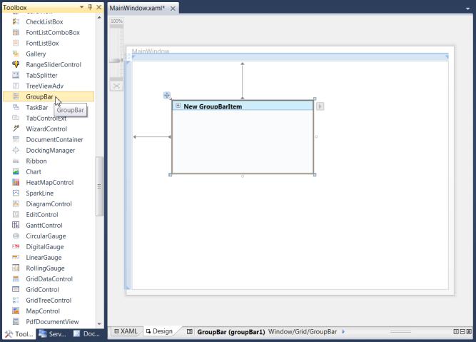
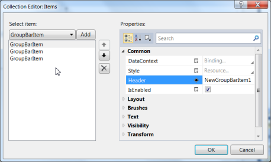
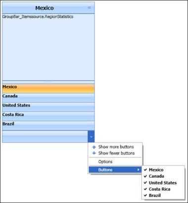
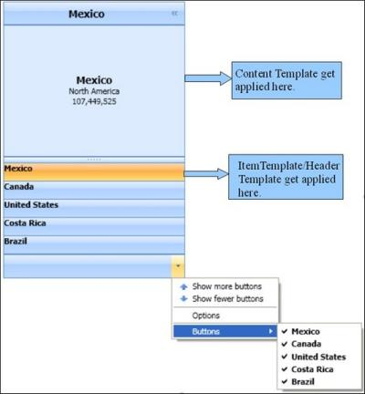
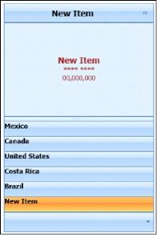

# Getting Started

This section guides you on getting started with GroupBar control. It covers the following topics:

## Overview of Groupbar control

The GroupBar control implements list-type controls in the user interface, similar to the Microsoft Outlook Bar. It has a container to host controls within it, and it can be used to host a categorized collection of command items and custom controls that are wired to execute custom commands. It includes several customizable features, which can be easily implemented in WPF applications.

{  | markdownify }
{:.image }

## Why use our Groupbar control?

Here are some highlights of our Groupbar control.

* Vertical and Horizontal layouts and orientation of GroupBar items
* Alignment and Orientation of GroupView Items
* Built-in visual styles - Default, Office 2003, Office 2007 Blue, Office 2007 Silver, Office 2007 Black and Blend are available for the control
* It supports expansion of multiple tabs
* ToolTip support for GroupView items
* Built-in context menu that provides the user access to functionalities to customize the GroupBar items just like in VS 2005 Toolbox context menu
* Various types of visual modes such as Multiple Expansion (VS 2005 Toolbox) and Stack Mode
* Dynamically sort tabs / items alphabetically in ascending / descending order through context menu or programmatically
* Dynamically add new tabs / items through context menu or programmatically
* Dynamically alter the tab header text or item header text using context menu or programmatically
* Dynamically move a selected tab up / down one step in the GroupBar using context menu
* Tabs can toggle between expanded and collapsed state. Can expand multiple tabs at the same time
* Dynamically move a selected item up / down one step in the GroupBar using context menu or programmatically

Navigation Pane Features

* Resizing the Pop up
* Expand / Collapsing the Navigation Pane
* Setting the height of Toolbar
## Creating GroupBar control

There are two possible ways to create a simple GroupBar control.

### Creating the Control through Visual Studio

The following steps describe how to create the GroupBar control via Visual Studio.

1. Drag GroupBar from the Toolbox and drop it in the designer area. This will generate the GroupBar control. 

{  | markdownify }
{:.image }

2. To add items to GroupBarItems with the Collection Editor, select GroupBar and look at its properties. Click the button in the Items property. This will open the Collection Editor.

{  | markdownify }
{:.image }

Using the Collection Editor, add the GroupBarItems and configure their properties.The GroupBar control can also be created and configured using Microsoft Expression Blend. Follow these steps to do so. 

1. Create a WPF project in Expression Blend and reference the following assemblies.
2. Search for _GroupBar_ in the toolbox.

{  | markdownify }
{:.image }

3. Drag GroupBar to the designer and drop it there. This will generate the control. 

{  | markdownify }
{:.image }

4. To add items to the GroupBar control with the Collection Editor, select GroupBar and go to Properties. Next, click Items (Collection) under Common Properties.

{  | markdownify }
{:.image }

5. Once the Collection Editor opens, click Add Another Item to openthe Select Object window. Select the GroupBarItem by typing _GroupBarItem_ in the search box and clicking OK.

{  | markdownify }
{:.image }

6. Figure 8: Collection Editor for GroupBar in Expression BlendGroupBarItem using the properties in the Collection Editor.

You can also customize the appearance of the GroupBar control and its items by using the template-editing feature available in Expression Blend.

### Creatig the Control Programmatically

To create the GroupBar control through code, use the following XAML or C# code.

<table>
<tr>
<td>
[XAML]&lt;!-- Adding GroupBar --&gt;&lt;syncfusion:GroupBar Height="300" Width="230" Name="groupBar"/&gt;</td></tr>
<tr>
<td>
[C#]//Creating an instance of GroupBarGroupBar groupBar = new GroupBar();//Setting height for GroupBargroupBar.Height = 300;//Setting width for GroupBargroupBar.Width = 200;//Adding GroupBar to windowthis.Content = groupBar;</td></tr>
</table>
### Itemssource Support/GroupBar Control

Items in a GroupBar can also be added by binding a collection of business object through Itemssource property. The following is an example of the business object, which is used for Itemssource binding. 

public class RegionStatistics

{

public string Population{get; set;}

public string Name{get; set;}

public string Location{get; set;}

}

Adding Items to the ObservableCollection

Add items to the ObservableCollection, by using the following code.

private void Window1_Loaded(object sender, RoutedEventArgs e)

        {

            SampleList = new ObservableCollection<RegionStatistics>();

            SampleList.Add(new RegionStatistics() { Name = "Mexico", Population = "107,449,525", Location="North America" });

            SampleList.Add(new RegionStatistics() { Name = "Canada", Population = "33,098,932", Location = "North America" });

            SampleList.Add(new RegionStatistics() { Name = "United States", Population = "304,228,357", Location = "North America" });

            SampleList.Add(new RegionStatistics() { Name = "Costa Rica", Population = "04,075,261", Location = "Central America" });

            SampleList.Add(new RegionStatistics() { Name = "Brazil", Population = "188,078,287", Location = "South America" });

            gri.DataContext = this;

        }

Binding Itemssource Property

 Set the Itemssource property, by using the following code.

<table>
<tr>
<td>
[XAML]&lt;sync:GroupBar Name="gBar" ItemsSource="{Binding SampleList}"/&gt;</td></tr>
<tr>
<td>
[C#]Binding bind = new Binding();          bind.Source = this;          bind.Path = new PropertyPath("SampleList");          gBar.SetBinding(GroupBar.ItemssourceProperty, bind);</td></tr>
</table>

{  | markdownify }
{:.image }

Using ItemTemplate

Apply the ItemTemplate to GroupBar, by using the following code. 

[XAML]       

 &lt;sync:GroupBar.ItemTemplate&gt;

                &lt;DataTemplate&gt;

                    &lt;TextBlock Text="{Binding Name}" FontWeight="Bold"/&gt;

                &lt;/DataTemplate&gt;

            &lt;/sync:GroupBar.ItemTemplate&gt;

{  | markdownify }
{:.image }

Using ItemContainer Style 

The above image shows that the GroupBar is bounded with the ObservableCollection SampleList. Write the HeaderTemplate and ContentTemplate for the ItemContainer, by using the following code. 

The Item Container Style should be declared as follows.

&lt;sync:GroupBar.ItemContainerStyle&gt;

&lt;Style TargetType="{x:Type sync:GroupBarItem}"&gt;

&lt;/Style&gt;

&lt;/sync:GroupBar.ItemContainerStyle&gt;

Apply Header Template to the Header Template property of the Item, by using the following code.

&lt;Setter Property="Header" Value="{Binding}"/&gt;

                        &lt;Setter Property="HeaderTemplate"&gt;

                            &lt;Setter.Value&gt;

                               &lt;DataTemplate&gt;

                                     &lt;TextBlock Text="{Binding Name}" FontWeight="Bold"/&gt;

                                &lt;/DataTemplate&gt;

                            &lt;/Setter.Value&gt;

                         &lt;/Setter&gt;

Apply Content Template to Content Template property of the item, by using the following code.

 &lt;Setter Property="Content" Value="{Binding}"/&gt;

                        &lt;Setter Property="ContentTemplate"&gt;

                            &lt;Setter.Value&gt;

                                &lt;DataTemplate&gt;

                                    &lt;StackPanel Height="50"&gt;

                     &lt;TextBlock Text="{Binding Name}" FontWeight="Bold" Margin="1" HorizontalAlignment="Center" FontSize="14"/&gt;

                                        &lt;TextBlock Text="{Binding Location}" HorizontalAlignment="Center"/&gt;

                                        &lt;TextBlock Text="{Binding Population}" HorizontalAlignment="Center"/&gt;

                                    &lt;/StackPanel&gt;

                                &lt;/DataTemplate&gt;

                            &lt;/Setter.Value&gt;

                        &lt;/Setter&gt;

{  | markdownify }
{:.image }

Using Template Selector

Template can be applied according to the logic set by the user using Template Selector.

The following code illustrates this.

> _Note:Data Template has been written for North America Statistics data_

&lt;DataTemplate x:Key="North"&gt;

         &lt;StackPanel Height="50"&gt;

              &lt;TextBlock Text="{Binding Name}" FontWeight="Bold" Margin="1" HorizontalAlignment="Center" FontSize="14" Foreground="Blue"/&gt;

              &lt;TextBlock Text="{Binding Location}" HorizontalAlignment="Center" Foreground="Blue"/&gt;

              &lt;TextBlock Text="{Binding Population}" HorizontalAlignment="Center" Foreground="Blue"/&gt;

         &lt;/StackPanel&gt;

 &lt;/DataTemplate&gt;

> _Note: Data Template has been written for South America Statistics data._

&lt;DataTemplate x:Key="South"&gt;

        &lt;StackPanel Height="50"&gt;

            &lt;TextBlock Text="{Binding Name}" FontWeight="Bold" Margin="1" HorizontalAlignment="Center" FontSize="14" Foreground="Red"/&gt;

            &lt;TextBlock Text="{Binding Location}" HorizontalAlignment="Center" Foreground="Red"/&gt;

            &lt;TextBlock Text="{Binding Population}" HorizontalAlignment="Center" Foreground="Red"/&gt;

        &lt;/StackPanel&gt;

&lt;/DataTemplate&gt;

> _Note: Data Template has been written for Other Statistics data._

&lt;DataTemplate x:Key="Other"&gt;

    &lt;StackPanel Height="50"&gt;

        &lt;TextBlock Text="{Binding Name}" FontWeight="Bold" Margin="1" HorizontalAlignment="Center" FontSize="14" Foreground="Brown"/&gt;

        &lt;TextBlock Text="{Binding Location}" HorizontalAlignment="Center" Foreground="Brown"/&gt;

        &lt;TextBlock Text="{Binding Population}" HorizontalAlignment="Center" Foreground="Brown"/&gt;

      &lt;/StackPanel&gt;

&lt;/DataTemplate&gt;

> _Note: Following is the data template selector logic set by the user._

/// &lt;summary&gt;

    /// Logic for Template Selector

    /// &lt;/summary&gt;

    public class SampleTemplateSelector : DataTemplateSelector

    {

        public override DataTemplate SelectTemplate(object item, DependencyObject container)

        {

            Window win = Application.Current.MainWindow;

            if (((RegionStatistics)item).Location == "North America")

            {

                return win.Resources["North"] as DataTemplate;

            }

            else if (((RegionStatistics)item).Location == "South America")

            {

                return win.Resources["South"] as DataTemplate;

            }

            else

            {

                return win.Resources["Other"] as DataTemplate;

            }

        }

    }

> _Note: The ContentTemplate Selector can be applied as follows._

&lt;sync:GroupBar.ItemContainerStyle&gt;

                    &lt;Style TargetType="{x:Type sync:GroupBarItem}"&gt;

                        &lt;Setter Property="Header" Value="{Binding}"/&gt;

                        &lt;Setter Property="HeaderTemplate"&gt;

                            &lt;Setter.Value&gt;

                                &lt;DataTemplate&gt;

                                    &lt;TextBlock Text="{Binding Name}" FontWeight="Bold"/&gt;

                                &lt;/DataTemplate&gt;

                            &lt;/Setter.Value&gt;

                        &lt;/Setter&gt;

                        &lt;Setter Property="Content" Value="{Binding}"/&gt;

                    &lt;Setter Property="ContentTemplateSelector" Value="{StaticResource Selector}"/&gt;

&lt;/Style&gt;

{  | markdownify }
{:.image }

Events associated with GroupBar ContextMenu

When Itemssource is in use, Add Tab, Delete Tab, Rename Tab, etc Commands in Context menu cannot be used. To enable this user can use the following event associated with the context menu.

ContextMenuItemClick - The Event is called when any of the ContextMenu items clicked. It contains the following property.

MenuItem –Gets the MenuItem. Users can perform the require command in this menu.

Add a new tab when Itemssource in use, by using the following code.

[C#]

gBar.ContextMenuItemClick += new GroupBarContextMenuItemEventHandler(gBar_ContextMenuItemClick);

private void gBar_ContextMenuItemClick(object sender, GroupBarContextMenuItemEventArgs e)

        {

           	if (e.MenuItem.ToString() == "Add Tab")

          	{

      SampleList.Add(new RegionStatistics() { Name = "New Item", Population = 			"00,000,000", Location = "**** ****" });

                e.Handled = true;

 	}

}

> 

> _Note: Set the Handled property of GroupBarContextMenuItemEventArgs to true to avoid the in-built logic to execute._

{  | markdownify }
{:.image }

{  | markdownify }
{:.image }

